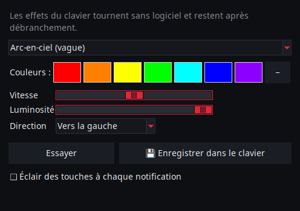
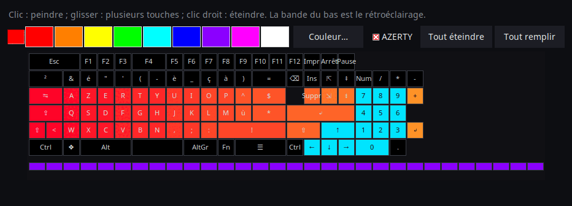

<p align="center">
  
</p>

# AniMe Matrix pour Linux — ROG Strix Flare II Animate

[](https://github.com/AntiCitoyen/Anticitoyen-ROG-flare2-anime-matrix/releases/latest)
[](https://github.com/AntiCitoyen/Anticitoyen-ROG-flare2-anime-matrix/actions/workflows/ci.yml)
[](LICENSE)
[](https://buymeacoffee.com/anticitoyen)

Piloter sous Linux l'écran **AniMe Matrix** (312 mini-LED) du clavier **ASUS ROG Strix Flare II Animate**, sans Armoury Crate ni Windows : GIF et galerie, horloge, effets et visualiseurs audio, jeux, moniteur système, notifications du bureau, programmation horaire, éditeur d'animation, bibliothèque partagée, couleurs du clavier synchronisées.

<div align="center">

**🇫🇷 Français** · [🇬🇧 English](docs/readme/README.en.md) · [🇪🇸 Español](docs/readme/README.es.md) · [🇩🇪 Deutsch](docs/readme/README.de.md) · [🇮🇹 Italiano](docs/readme/README.it.md) · [🇧🇷 Português](docs/readme/README.pt-BR.md) · [🇳🇱 Nederlands](docs/readme/README.nl.md) · [🇵🇱 Polski](docs/readme/README.pl.md) · [🇷🇺 Русский](docs/readme/README.ru.md) · [🇺🇦 Українська](docs/readme/README.uk.md) · [🇹🇷 Türkçe](docs/readme/README.tr.md) · [🇸🇦 العربية](docs/readme/README.ar.md) · [🇮🇳 हिन्दी](docs/readme/README.hi.md) · [🇨🇳 简体中文](docs/readme/README.zh-CN.md) · [🇹🇼 繁體中文](docs/readme/README.zh-TW.md) · [🇯🇵 日本語](docs/readme/README.ja.md) · [🇰🇷 한국어](docs/readme/README.ko.md) · [🇻🇳 Tiếng Việt](docs/readme/README.vi.md) · [🇮🇩 Bahasa Indonesia](docs/readme/README.id.md)

</div>

<p align="center"><br><em>Cadran + tiroir (interface par défaut)</em></p>

| Cadran | Arrondie | Classique |
|:---:|:---:|:---:|
|  |  |  |

<p align="center"></p>

---

## Sommaire

- [Ce que fait le projet](#projet)
- [Matériel pris en charge](#materiel)
- [Installation](#installation)
- [Utilisation](#utilisation)
- [Préparer de bons GIF](#gif)
- [Comment ça marche](#fonctionnement)
- [Dépannage](#depannage)
- [Organisation du dépôt](#depot)
- [Construire les paquets](#deb)
- [Crédits](#credits)
- [Licence](#licence)
- [Soutenir le projet](#soutien)

---

<a id="projet"></a>

## Ce que fait le projet

ASUS ne fournit l'écran AniMe Matrix de ce clavier que sous Windows (Armoury Crate). Ce projet parle directement au clavier en USB HID et apporte :

**Afficher**
- **GIF, images et vidéos** : un fichier, une sélection ou tout un dossier en galerie, à glisser-déposer sur la fenêtre ; vidéos (MP4, WebM, MKV…) lues par ffmpeg ; galerie en vignettes ; trames converties gardées en cache (une galerie de 400 GIF tient en ~25 Mo de mémoire).
- **Horloge** : cadran numérique, analogique, binaire, en mots (français, anglais, allemand, espagnol, italien, portugais, néerlandais) ou stylisé.
- **Effets animés** (pluie façon Matrix, plasma, feu, étoiles, feux d'artifice, éclairs, métaballes, vague…) et **7 visualiseurs audio** qui réagissent au son joué par le PC.
- **Texte** : votre message, dans toutes les écritures (accents, cyrillique, arabe, hindi, chinois, japonais, coréen…), défilant vers la gauche, la droite, le haut, le bas, ou fixe.
- **Webcam** (image ou silhouette) et **miroir d'écran** (écran entier, autour de la souris ou fenêtre active).
- **Moniteur système** : CPU, RAM, GPU, température, débit réseau et heure, en jauges.
- **Morceau en cours** : au changement de piste, « ARTISTE - TITRE » défile une fois, puis un visualiseur (Spotify, VLC, Rhythmbox, navigateurs… via MPRIS).
- **Notifications du bureau** : « APPLI : TITRE » s'affiche en surimpression puis la lecture reprend (désactivé par défaut, liste d'applications autorisées).
- **Jeux jouables** au clavier : Snake, Pong (seul ou à deux), Tetris, casse-briques, Invaders, Flappy, avec records.
- **Voyants** : petits blocs lumineux quand le micro est coupé ou utilisé, quand la webcam tourne, quand OBS diffuse ou enregistre.
- **Mémoire du clavier** : une animation (GIF, image) enregistrée dans le clavier s'affiche sans aucun logiciel, dès le branchement, même sur un autre PC ; luminosité réglable (onglet GIF, `animematrix-ctl memoire`). Les 6 animations intégrées (KO, Météorite, Œil, Love, Halloween, Démarrage) se choisissent aussi : `animematrix-ctl clavier 1`…`6`.

**Créer**
- **Éditeur d'animation** image par image, sur la vraie géométrie de l'écran : 3 niveaux, frise, calque fantôme, décalage, copier-coller, aperçu, envoi au clavier, export GIF.
- **Bibliothèque d'animations** partagée : parcourir, jouer, ajouter à sa galerie, proposer les siennes.
- **Conversion intelligente** de GIF : recadrage sur le sujet, sujet clair sur fond noir, contours renforcés, 3 niveaux.
- **Aperçu fidèle** avant envoi : rendu simulé de l'écran (disposition réelle, halo entre LED).
- **Effets en extensions** : un fichier Python déposé dans un dossier ajoute un effet (voir [docs/EXTENSIONS.md](docs/EXTENSIONS.md)).

**Automatiser**
- **Démon `animematrixd`** : seul propriétaire de l'écran, il continue d'afficher quand le lanceur est fermé ; commande `animematrix-ctl` et API HTTP locale optionnelle.
- **Programmation horaire** : plages (jours, nuit comprise) avec horloge, galerie, moniteur, morceau en cours, un effet, une liste de lecture ou écran éteint ; écran noir quand la session est verrouillée, en veille ou quand une application est en plein écran.
- **Profils par application** : un contenu propre à un jeu ou à une application tant qu'elle est au premier plan (bouton *Détecter*).
- **Listes de lecture et favoris** : GIF, effets, horloge… chacun pendant sa durée, en boucle ; aussi dans l'icône de barre système et en ligne de commande.
- **Télécommande web** : une page pour piloter l'écran depuis un téléphone du réseau local (QR code, jeton).
- **Fin des commandes longues** : dans le terminal, « Terminé : make 2 min 05 » s'affiche quand une longue commande se termine.
- **Couleurs et effets des touches**, sans OpenRGB : arc-en-ciel, statique, respiration, cycle, réactif, ondulation, nuit étoilée, sable mouvant, courant, pluie — exécutés par le clavier et gardés après débranchement ; ou couleur du thème, pulsation avec l'écran.
- **Icône de barre système** : menu rapide (modes, luminosité).

**Confort**
- **4 interfaces** (*Cadran + tiroir* par défaut, *Cadran*, *Arrondie*, *Classique*) avec **aperçu en direct des 312 LED**, **11 thèmes** (5 ROG, 5 roses, système) et **19 langues**.
- **X11 et Wayland** : réaction au clavier par evdev, fenêtre active lue auprès de Sway, Hyprland, KDE (kdotool) ou GNOME (extension *Window Calls*) ; miroir d'écran par le portail du bureau (écran ou fenêtre, choix mémorisé).
- **Mises à jour intégrées** : le lanceur télécharge la dernière release, vérifie son empreinte SHA-256 et l'installe (mot de passe administrateur) ; ou `apt upgrade` avec le dépôt APT.

<a id="materiel"></a>

## Matériel pris en charge

| Appareil | USB | État |
|---|---|---|
| ASUS ROG Strix Flare II Animate | `0b05:19fc` | pris en charge (HID, interface 4, usage page `0xFF02`) |
| Écrans AniMe Matrix des portables ROG (G14, G16…) | divers | **expérimental** via `asusctl`, non testé sur matériel (voir [Utilisation](#utilisation)) |

Testé sur Ubuntu 26.04 (X11, PipeWire, Cinnamon). Toute distribution avec Python ≥ 3.10, hidapi, Tk et systemd doit convenir ; sous Wayland, le lanceur passe par XWayland.

<a id="installation"></a>

## Installation

### Dépôt APT (Debian, Ubuntu, Mint, Pop!_OS…) — mises à jour avec `apt upgrade`

```bash
curl -fsSL https://anticitoyen.github.io/Anticitoyen-ROG-flare2-anime-matrix/animematrix.gpg \
  | sudo tee /usr/share/keyrings/animematrix.gpg >/dev/null
echo "deb [signed-by=/usr/share/keyrings/animematrix.gpg] https://anticitoyen.github.io/Anticitoyen-ROG-flare2-anime-matrix stable main" \
  | sudo tee /etc/apt/sources.list.d/animematrix.list
sudo apt update && sudo apt install anticitoyen-rog-flare2-anime-matrix
```

Puis **débrancher et rebrancher le clavier** (la règle udev donne l'accès à l'utilisateur connecté) et lancer **AniMe Matrix** depuis le menu.

### Autres formats (page [Releases](https://github.com/AntiCitoyen/Anticitoyen-ROG-flare2-anime-matrix/releases/latest))

| Système | Fichier | Installation |
|---|---|---|
| Debian, Ubuntu… | `anticitoyen-rog-flare2-anime-matrix_<version>_all.deb` | `sudo apt install ./anticitoyen-rog-flare2-anime-matrix_*_all.deb` |
| Fedora, openSUSE… | `anticitoyen-rog-flare2-anime-matrix-<version>-1.noarch.rpm` | `sudo dnf install ./anticitoyen-rog-flare2-anime-matrix-*.noarch.rpm` |
| Arch, Manjaro… | `anticitoyen-rog-flare2-anime-matrix-<version>-1-any.pkg.tar.zst` | `sudo pacman -U anticitoyen-rog-flare2-anime-matrix-*.pkg.tar.zst` |
| Toutes (Flatpak) | `AniMeMatrix-<version>.flatpak` | `flatpak install --user AniMeMatrix-*.flatpak` (installer aussi la règle udev ci-dessous ; pas de visualiseurs audio) |
| AUR | `aur-<version>.tar.gz` | PKGBUILD et .SRCINFO : `tar xf aur-*.tar.gz && cd anticitoyen-rog-flare2-anime-matrix && makepkg -si` |
| Copr | `anticitoyen-rog-flare2-anime-matrix-<version>-1.<fc>.src.rpm` | RPM source : `rpmbuild --rebuild anticitoyen-rog-flare2-anime-matrix-*.src.rpm`, ou à envoyer dans un projet Copr |
| Flathub | `flathub-<version>.tar.gz` | manifeste figé sur cette version et `python3-modules.json` : soumission Flathub ou `flatpak-builder` |
| Weblate | `translations-<version>.zip` | fichiers de traduction (`locale/*.json`, base `_source.json`) à importer dans Weblate |

Le paquet installe :

| Élément | Emplacement |
|---|---|
| Programmes | `/usr/share/anticitoyen-rog-flare2-anime-matrix/` |
| Commandes | `animematrix`, `animematrixd`, `animematrix-ctl`, `animematrix-bascule`, `animematrix-animation`, `animematrix-apercu`, `animematrix-convertir`, `animematrix-effet`, `animematrix-galerie`, `animematrix-horloge`, `animematrix-dessin`, `animematrix-tray`, `animematrix-memoire` |
| Service utilisateur | `/usr/lib/systemd/user/animematrixd.service` (activé pour toutes les sessions) |
| Règle udev | `/usr/lib/udev/rules.d/72-rog-flare2-animate.rules` |
| Menu et icône | `animematrix.desktop`, icône `animematrix` |

### Depuis les sources

```bash
git clone https://github.com/AntiCitoyen/Anticitoyen-ROG-flare2-anime-matrix.git
cd Anticitoyen-ROG-flare2-anime-matrix
python3 -m venv .venv
.venv/bin/pip install hidapi pillow numpy pynput python-xlib
# accès au clavier sans root
sudo cp packaging/72-rog-flare2-animate.rules /etc/udev/rules.d/
sudo udevadm control --reload-rules && sudo udevadm trigger
# puis débrancher/rebrancher le clavier
.venv/bin/python rog_flare2_launcher.py
```

Outils système utiles : `imagemagick` (conversion classique), `pulseaudio-utils` (`parec`, pour l'audio), `zenity` (sélecteurs de fichiers), `libnotify-bin` (notifications), `python3-gi` et `gir1.2-ayatanaappindicator3-0.1` (icône de barre système), `ffmpeg` (vidéos, webcam, miroir d'écran), `python3-evdev` (réaction au clavier sous Wayland), `x11-utils` (fenêtre active sous X11), `python3-qrcode` (QR code de la télécommande), `tkdnd` (glisser-déposer).

<a id="utilisation"></a>

## Utilisation

### Le lanceur

`animematrix` (ou l'entrée **AniMe Matrix** du menu).

Dans les interfaces rondes, les boutons ronds ouvrent les blocs *GIF*, *Effets*, *Audio* et *Réglages* (dans le tiroir ou dans le cercle) ; *Horloge* et *Arrêter* agissent tout de suite ; l'arc du bas règle la luminosité ; on déplace la fenêtre en la tirant par le fond ; les petits boutons du haut réduisent ou ferment. La forme ronde utilise l'extension X11 SHAPE (paquet `python3-xlib`) ; sans elle, la même interface s'affiche dans une fenêtre rectangulaire.

- **GIF / images** : *GIF/images…* ou *Dossier (galerie)…* (ou glisser-déposer sur la fenêtre) ; *Géométrie fidèle* garde les proportions (le coin coupe l'image au lieu de l'étirer) ; *👁 Aperçu fidèle (avant envoi)* montre le rendu sans rien envoyer ; *🎞 Créer une animation (éditeur)* ; *📚 Bibliothèque d'animations* ; *★ Listes de lecture et favoris* ; *🖼 Galerie en vignettes* (clic : lire, clic droit : favori) ; *🎥 Webcam* et *🖥 Miroir d'écran* ; *Conversion intelligente* pour convertir des GIF.
- **Effets** et **Audio** : choisir, régler, *▶ Lancer l'effet*. Les curseurs agissent en direct ; *Cadence* accélère ou ralentit toute l'animation. L'effet *Texte* prend votre message et son sens de défilement. Les jeux se jouent avec les flèches, Espace et Entrée, fenêtre du lanceur au premier plan ; Pong à deux : Z/W et S pour le joueur de gauche.
- **Luminosité**, **🕒 Horloge**, **■ Arrêter** (qui efface l'écran) sont communs à tous les onglets.
- **Réglages** : démarrage de session (Galerie GIF, Horloge, Dernière lecture ou Rien), cadran de l'horloge, langue, thème, interface, notifications du bureau, couleurs du clavier, *Programmation…* (déclencheurs, profils par application, plages horaires), *Voyants…*, *Télécommande web…*, icône de barre système, fin des commandes longues, dossier des extensions, mises à jour.

**Fermer le lanceur ne coupe rien** : le démon `animematrixd` continue d'afficher. *■ Arrêter* éteint l'écran.

### Démon et ligne de commande

```bash
animematrix-ctl etat                               # ce qui est affiché
animematrix-ctl gif ~/Images/AniMe-Matrix --fidele # galerie (dossier ou fichiers)
animematrix-ctl effet "Plasma" --param speed=250   # effet et réglages
animematrix-ctl horloge
animematrix-ctl texte "Bonjour"
animematrix-ctl effet "Text" --param message="Salut" --param direction=haut
animematrix-ctl liste "Soirée"                     # liste de lecture (sans nom : les affiche)
animematrix-ctl favori 2                           # favori n° 2 (sans numéro : les affiche)
animematrix-ctl notifier "Café prêt" --duree 5     # surimpression puis retour
animematrix-ctl memoire anim.gif                   # enregistrée dans le clavier (196 images au plus)
animematrix-ctl clavier                            # affiche l'animation enregistrée
animematrix-ctl luminosite 60
animematrix-ctl stop
```

| Commande | Rôle |
|---|---|
| `animematrix-bascule [gif\|horloge\|lecture\|off\|etat]` | bascule (aussi dans le clic droit de l'icône du menu) ; le mode choisi est aussi celui du démarrage de session |
| `animematrixd --http 8765` | démon avec API HTTP locale (`POST http://127.0.0.1:8765/api`, `Content-Type: application/json`, même JSON que le socket) |
| `animematrix-animation [fichier.gif]` | éditeur d'animation |
| `animematrix-apercu fichier.gif -o apercu.gif` | aperçu fidèle d'un GIF (fichier) |
| `animematrix-convertir dossier/ [--fidele] [--classique]` | convertit des GIF pour la matrice (dans `dossier/matrix/`) |
| `animematrix-effet --liste` | liste les effets et visualiseurs |
| `animematrix-dessin` | éditeur LED par LED (rend la main au démon en fermant) |
| `animematrix-ctl sauvegarde reglages.zip`, `animematrix-ctl restaurer reglages.zip` | exporte ou restaure tous les réglages (aussi dans *Réglages*) ; sans le jeton ni le mot de passe OBS, sauf `--secrets` |

### Audio

Les visualiseurs écoutent le **moniteur de la sortie son par défaut** avec `parec` (PipeWire ou PulseAudio) : ils réagissent à ce que joue le PC, pas au micro.

### Effet « Keyboard React »

Il allume l'écran au rythme de la frappe, tant que l'effet tourne : sous X11 par `pynput`, sous Wayland en lisant le clavier dans `/dev/input` (`python3-evdev`). Sous Wayland, si l'effet reste en démonstration, autoriser la lecture du seul clavier ROG :

```bash
sudo cp /usr/share/anticitoyen-rog-flare2-anime-matrix/udev/73-rog-flare2-animate-touches.rules /etc/udev/rules.d/
sudo udevadm control --reload-rules && sudo udevadm trigger
```

### Voyants

*Réglages* → *Voyants (micro, webcam, OBS)…* : un bloc de 2 × 2 LED s'allume en haut à gauche de l'écran, par-dessus la lecture (1 : micro coupé ou utilisé, 2 : webcam utilisée, 3 : OBS en direct ou en enregistrement), et chaque changement peut être annoncé par un texte défilant. OBS : activer le serveur WebSocket (*Outils* → *Paramètres du serveur WebSocket*) et reporter son port et son mot de passe.

### Télécommande web

*Réglages* → *Télécommande web…* : cocher *Activer*, puis ouvrir l'adresse (ou lire le QR code) sur un téléphone du même réseau. La page montre l'écran en direct et propose horloge, galerie, effets, favoris, listes, luminosité et message. L'adresse contient un jeton : ne la partagez pas, changez-la avec *Nouveau jeton* ; la page n'est pas chiffrée (HTTP) : réseau de confiance seulement.

### Fin des commandes longues

*Réglages* → *Afficher la fin des commandes longues (terminal)* ajoute une ligne à `~/.bashrc` (et `~/.zshrc`) : toute commande de plus de 30 secondes affiche à sa fin « Terminé : make 2 min 05 » ou « Échec (2) : … ». Seuil : `ANIMEMATRIX_FIN_SECONDES` ; les commandes interactives (éditeurs, `ssh`, `less`…) sont ignorées.

### Couleurs du clavier

*Réglages* → *🌈 Couleurs du clavier…* : effet (arc-en-ciel, statique, respiration, cycle des couleurs, réactif, ondulation, nuit étoilée, sable mouvant, courant, pluie), couleurs, vitesse, luminosité, direction. *Essayer* l'applique, *Enregistrer dans le clavier* le garde après débranchement. *Couleur du thème* et *Pulsation avec l'écran* sont envoyées touche par touche par le démon ; en les quittant, l'effet enregistré revient. En ligne de commande : `animematrix-ctl rgb arc-en-ciel --vitesse 70`, `animematrix-ctl rgb statique --couleur "#ff0000"`. Deux autres modes logiciels : *Image de l'écran* (les touches reprennent l'écran, agrandi) et *Spectre audio* (une barre par colonne). Chaque plage horaire et chaque profil d'application peut aussi choisir ses couleurs de touches (*Programmation…*). *Touche par touche* : une couleur par touche, peinte à la souris sur le plan du clavier (AZERTY ou QWERTY). *Frappe lumineuse* : chaque touche frappée s'allume puis s'estompe. Les voyants micro, webcam et OBS peuvent aussi allumer F1, F2 et F3, et chaque notification fait briller les touches.

<p align="center"> </p>

### Portables ROG (expérimental)

Écrire `portable-asusctl` dans `~/.config/rog-flare2/materiel` puis relancer le démon : les trames passent par `asusctl anime image` (5 images par seconde au plus). Non testé sur un vrai portable : retours bienvenus dans les tickets.

<a id="gif"></a>

## Préparer de bons GIF

L'écran n'est pas un rectangle : 24 rangées décalées, de 19 LED en haut à 7 en bas (bord droit vertical, bord gauche en diagonale), 3 niveaux de gris vraiment distincts, un halo entre LED voisines. Les silhouettes, pictogrammes, textes courts et mouvements lents rendent bien ; les photos et vidéos, peu.

Le guide complet (toile, niveaux, cadence, conversion, géométrie fidèle) : **[docs/GUIDE-GIF.md](docs/GUIDE-GIF.md)**.

<a id="fonctionnement"></a>

## Comment ça marche

- **Transport** : hidapi ouvre l'interface HID n° 4 du clavier et y écrit des trames de **1024 octets** ; le clavier renvoie chaque trame.
- **Trame** : `60 81 00 00` + **312 octets** (une luminosité 0–255 par LED, dans l'ordre matériel) + zéros jusqu'à 1024.
- **Géométrie** : 24 rangées décalées (la rangée r couvre les colonnes (r+1)//2 à 18), ou de façon équivalente 12 rangées logiques de 37 → 15 colonnes (modèle de PolyWollyWin) ; les deux correspondances ont été vérifiées identiques sur les 312 LED.
- **Démon** : `animematrixd` tient seul le clavier ; lecture de base et surimpression (notifications) ; socket JSON `$XDG_RUNTIME_DIR/animematrix.sock` ; reconnexion automatique du clavier.
- **Animation** : l'hôte envoie les trames les unes après les autres (~30 i/s pour les effets) ; la mémoire interne du clavier n'est pas utilisée (recherche : [docs/RECHERCHE-MEMOIRE.md](docs/RECHERCHE-MEMOIRE.md)).

Les notes de rétro-ingénierie d'origine sont dans **[docs/PROTOCOL.md](docs/PROTOCOL.md)** ; les captures `*.cap` et les outils `parse_usbpcap.py` / `rog_flare2_replay_capture.py` restent dans le dépôt.

⚠️ N'envoyez pas au clavier les paquets des AniMe Matrix de portables (`0x5E …`, `0xEC …`) : ce n'est pas le bon protocole et cela peut bloquer le clavier (débrancher/rebrancher, ou maintenir **Fn + Échap** 10–15 s).

<a id="depannage"></a>

## Dépannage

| Symptôme | Cause probable | Solution |
|---|---|---|
| `interface 4 not found` | clavier non vu ou pas de droits | `lsusb \| grep 0b05:19fc` ; règle udev installée ? débrancher/rebrancher |
| `Permission denied` / `open failed` | règle udev non appliquée | `sudo udevadm control --reload-rules && sudo udevadm trigger`, puis rebrancher |
| « Service animematrixd injoignable » | démon arrêté | `systemctl --user restart animematrixd.service` ou `animematrixd &` |
| L'écran ne change pas | un autre programme écrit sur le clavier | fermer les anciens scripts ; `animematrix-ctl etat` |
| Les visualiseurs restent en mode démo | pas de `parec` ou pas de son | installer `pulseaudio-utils`, jouer du son |
| « Keyboard React » ne réagit pas | `pynput` (X11) ou `python3-evdev` (Wayland) absent, ou clavier illisible | installer le paquet ; sous Wayland, la règle udev de [Keyboard React](#utilisation) |
| Webcam, vidéos ou miroir d'écran inactifs | `ffmpeg` absent | `sudo apt install ffmpeg` ; sous Wayland, le miroir d'écran passe par le portail (`gstreamer1.0-pipewire`) |
| Profils par application ou plein écran sans effet sous Wayland | fenêtre active inconnue du compositeur | GNOME : extension *Window Calls* ; KDE : `kdotool` ; Sway et Hyprland : rien à faire |
| La fenêtre ronde s'affiche en rectangle | extension SHAPE ou `python3-xlib` absente | `sudo apt install python3-xlib`, ou *Réglages* → *Interface :* → *Classique* |
| Journal du démon | — | `journalctl --user -u animematrixd.service -f` |

<a id="depot"></a>

## Organisation du dépôt

| Fichier | Rôle |
|---|---|
| `rog_flare2_launcher.py` | lanceur graphique (Tk) |
| `rog_flare2_ui_ronde.py`, `rog_flare2_themes.py` | interfaces rondes, thèmes |
| `rog_flare2_i18n.py`, `locale/` | traduction (19 langues ; `locale/_cles.json` = textes à traduire ; [docs/TRADUIRE.md](docs/TRADUIRE.md)) |
| `rog_flare2_demon.py`, `rog_flare2_ctl.py` | démon `animematrixd`, client et commande `animematrix-ctl` |
| `rog_flare2_core.py` | lecture GIF en flux, cache des trames, horloge, géométrie |
| `rog_flare2_texte.py`, `rog_flare2_horloges.py` | texte toutes écritures, effet *Texte*, cadrans d'horloge |
| `rog_flare2_listes.py`, `rog_flare2_vignettes.py` | listes de lecture, favoris, galerie en vignettes, glisser-déposer |
| `rog_flare2_video.py`, `rog_flare2_voyants.py`, `rog_flare2_telecommande.py` | vidéos, webcam, miroir d'écran ; voyants ; télécommande web |
| `rog_flare2_touches.py`, `rog_flare2_fenetre.py`, `rog_flare2_fin.py`, `rog_flare2_flatpak.py` | touches et fenêtre active (X11, Wayland), fin des commandes longues, Flatpak |
| `rog_flare2_effets.py`, `polywollywin/` | effets et visualiseurs (moteur PolyWollyWin, MIT), extensions |
| `rog_flare2_infos.py`, `rog_flare2_mpris.py`, `rog_flare2_jeux.py` | moniteur système, morceau en cours, jeux |
| `rog_flare2_notifs.py`, `rog_flare2_programme.py`, `rog_flare2_ui_programme.py` | notifications, programmation horaire et déclencheurs |
| `rog_flare2_rgb.py`, `rog_flare2_tray.py`, `rog_flare2_portable.py` | couleurs et effets des touches, icône de barre système, portables (expérimental) |
| `rog_flare2_animation.py`, `rog_flare2_simulateur.py`, `rog_flare2_convertir.py` | éditeur d'animation, simulateur, conversion |
| `rog_flare2_bibliotheque.py`, `bibliotheque/` | bibliothèque d'animations (catalogue, GIF CC0) |
| `rog_flare2_maj.py` | mises à jour depuis les releases |
| `rog_flare2_matrix_paint.py`, `rog_flare2_clock_v3.py`, `rog_flare2_folder_player.py` | transport HID et éditeur LED, horloge, galerie (outils d'origine) |
| `parse_usbpcap.py`, `rog_flare2_replay_capture.py`, `*.cap` | rétro-ingénierie |
| `examples/effets/` | exemple d'extension |
| `tests/` | tests (dont interfaces par vrais clics) |
| `systemd/`, `packaging/` | service utilisateur ; .deb, RPM, Arch, Flatpak, dépôt APT |
| `docs/` | guide GIF, extensions, protocole, recherche, captures d'écran, README traduits |

<a id="deb"></a>

## Construire les paquets

```bash
packaging/build-deb.sh
# → dist/anticitoyen-rog-flare2-anime-matrix_<version>_all.deb
```

`packaging/install.sh` installe le projet dans n'importe quelle arborescence ; il sert au .deb, au RPM (`packaging/rpm/`), au paquet Arch (`packaging/aur/`) et au Flatpak (`packaging/flathub/`). À chaque release publiée, GitHub construit le RPM, le paquet Arch et le Flatpak, et met à jour le dépôt APT signé. La version est lue dans `rog_flare2_core.py` (`VERSION`). Tests : `python -m pytest tests`.

<a id="credits"></a>

## Crédits

- **NicRoss512** — rétro-ingénierie du protocole, horloge et éditeur d'origine : [ASUS-ROG-Strix-Flare-II-Animate-AniMe-Matrix-Protocol](https://github.com/NicRoss512/ASUS-ROG-Strix-Flare-II-Animate-AniMe-Matrix-Protocol). Ce dépôt en part ; son historique est conservé.
- **Mike Opitz** — [PolyWollyWin](https://github.com/MikeOpitz99/PolyWollyWin) (MIT), contrôleur Windows dont le moteur d'effets et de visualiseurs audio est repris ici.
- **Yoshi Walsh** — [Mastering the AniMe Matrix](https://blog.yoshiwalsh.me/asus-anime-matrix/), pour le comportement des LED (halo, niveaux perçus, cadence).
- **asus-linux** — [asusctl](https://gitlab.com/asus-linux/asusctl), utilisé pour les écrans des portables.

Projet indépendant, non affilié à ASUS. « ROG », « AniMe Matrix » et « Armoury Crate » sont des marques d'ASUSTeK.

<a id="licence"></a>

## Licence

[MIT](LICENSE) pour le code de ce dépôt ; animations de `bibliotheque/` sous CC0. `polywollywin/` reste sous la licence MIT de son auteur ([polywollywin/LICENSE](polywollywin/LICENSE)). Les fichiers d'origine de NicRoss512 (`rog_flare2_clock_v3.py`, `rog_flare2_matrix_paint.py`, `parse_usbpcap.py`, `rog_flare2_replay_capture.py`, `docs/PROTOCOL.md`, captures) ont été publiés sans licence explicite et restent à leur auteur ; ils sont redistribués avec attribution.

<a id="soutien"></a>

## Soutenir le projet

Si ce projet vous rend service, un café aide à le maintenir :

[](https://buymeacoffee.com/anticitoyen)

**https://buymeacoffee.com/anticitoyen** — le lien est aussi dans l'onglet *Réglages* du lanceur.

Rapports de bugs, idées et animations à partager : [Issues](https://github.com/AntiCitoyen/Anticitoyen-ROG-flare2-anime-matrix/issues). Traductions : [docs/TRADUIRE.md](docs/TRADUIRE.md).
