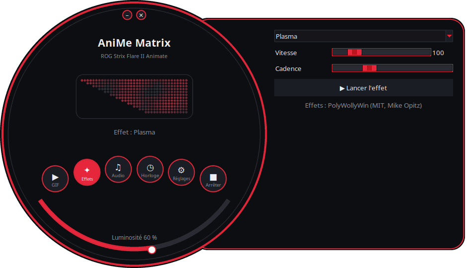
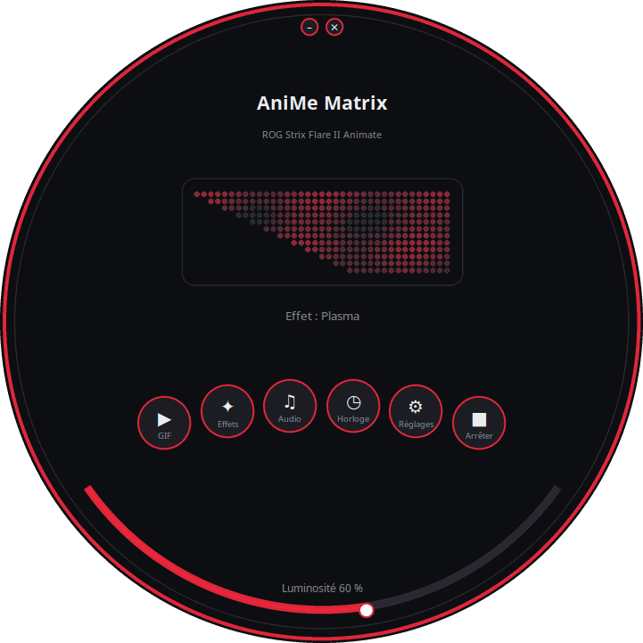
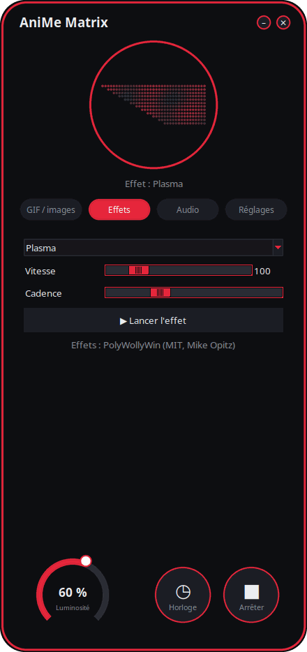
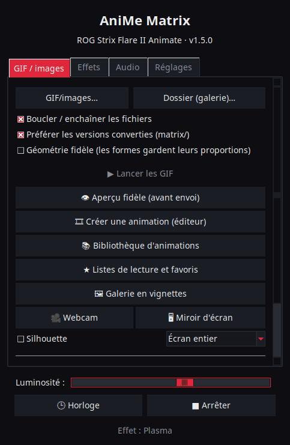
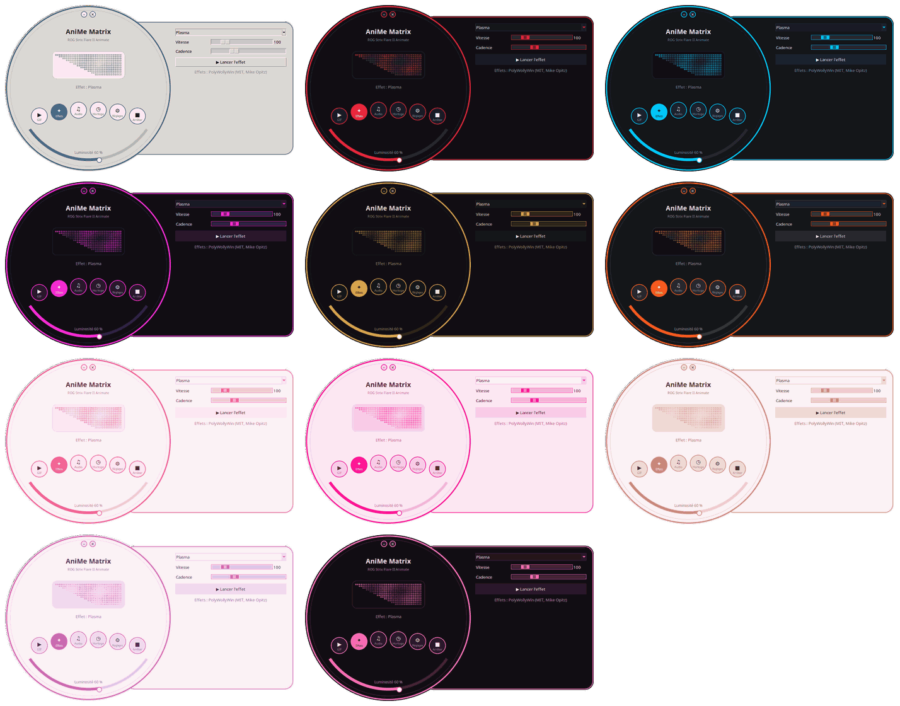

<p align="center">
  
</p>

# AniMe Matrix pour Linux — ROG Strix Flare II Animate

[](https://github.com/AntiCitoyen/Anticitoyen-ROG-flare2-anime-matrix/releases/latest)
[](LICENSE)
[](https://buymeacoffee.com/anticitoyen)

Piloter sous Linux l'écran **AniMe Matrix** (312 mini-LED) du clavier **ASUS ROG Strix Flare II Animate**, sans Armoury Crate ni Windows : GIF et images, galerie de fond, horloge, 19 effets animés, 7 visualiseurs audio, dessin LED par LED.

<div align="center">

**🇫🇷 Français** · [🇬🇧 English](docs/readme/README.en.md) · [🇪🇸 Español](docs/readme/README.es.md) · [🇩🇪 Deutsch](docs/readme/README.de.md) · [🇮🇹 Italiano](docs/readme/README.it.md) · [🇧🇷 Português](docs/readme/README.pt-BR.md) · [🇳🇱 Nederlands](docs/readme/README.nl.md) · [🇵🇱 Polski](docs/readme/README.pl.md) · [🇷🇺 Русский](docs/readme/README.ru.md) · [🇺🇦 Українська](docs/readme/README.uk.md) · [🇹🇷 Türkçe](docs/readme/README.tr.md) · [🇸🇦 العربية](docs/readme/README.ar.md) · [🇮🇳 हिन्दी](docs/readme/README.hi.md) · [🇨🇳 简体中文](docs/readme/README.zh-CN.md) · [🇹🇼 繁體中文](docs/readme/README.zh-TW.md) · [🇯🇵 日本語](docs/readme/README.ja.md) · [🇰🇷 한국어](docs/readme/README.ko.md) · [🇻🇳 Tiếng Việt](docs/readme/README.vi.md) · [🇮🇩 Bahasa Indonesia](docs/readme/README.id.md)

</div>

<p align="center"><br><em>Cadran + tiroir (interface par défaut)</em></p>

| Cadran | Arrondie | Classique |
|:---:|:---:|:---:|
|  |  |  |

<p align="center"></p>

---

## Sommaire

- [Ce que fait le projet](#projet)
- [Matériel pris en charge](#materiel)
- [Installation](#installation)
- [Utilisation](#utilisation)
- [Préparer de bons GIF](#gif)
- [Comment ça marche](#fonctionnement)
- [Dépannage](#depannage)
- [Organisation du dépôt](#depot)
- [Construire le paquet .deb](#deb)
- [Crédits](#credits)
- [Licence](#licence)
- [Soutenir le projet](#soutien)

---

<a id="projet"></a>

## Ce que fait le projet

ASUS ne fournit l'écran AniMe Matrix de ce clavier que sous Windows (Armoury Crate). Ce projet parle directement au clavier en USB HID et apporte :

- **Un lanceur graphique** (`animematrix`), au choix parmi **4 interfaces** : *Cadran + tiroir* (fenêtre ronde et panneau de réglages qui sort à droite, par défaut), *Cadran* (tout dans le cercle), *Arrondie* (coins très arrondis, molette de luminosité) et *Classique* (onglets). Les interfaces rondes montrent **en direct les 312 LED** telles qu'elles sont envoyées au clavier. Quatre blocs de commandes :
  - **GIF / images** : lire un ou plusieurs fichiers, ou tout un dossier en galerie, en boucle ; convertir des GIF pour la matrice.
  - **Effets** : 19 animations (pluie façon Matrix, plasma, feu, étoiles, feux d'artifice, éclairs, métaballes, vague, serpent, texte défilant, horloge stylisée, réaction au clavier…), réglables pendant qu'elles tournent.
  - **Audio** : 7 visualiseurs qui réagissent au son joué par le PC (spectre, KITT/KARR, starburst, oscilloscope, feu audio…).
  - **Réglages** : ce qui s'affiche à l'ouverture de session, langue, thème et interface, éditeur de dessin, liens du projet.
- **Une horloge** HH:MM, depuis le lanceur ou en service de fond.
- **Une galerie de fond** : un service `systemd --user` qui fait défiler un dossier de GIF dès l'ouverture de session.
- **Une bascule en un clic** (`animematrix-bascule`) : l'icône du menu allume ou éteint l'écran ; le clic droit choisit Galerie GIF, Horloge ou Éteindre.
- **Une conversion de GIF adaptée à la matrice** (`animematrix-convertir`) : 19×24, gris, 3 niveaux, sans tramage — voir [docs/GUIDE-GIF.md](docs/GUIDE-GIF.md).
- **Un éditeur de dessin** LED par LED (`animematrix-dessin`).
- **11 thèmes** : 5 inspirés de ROG (Classic, Strix, Glitch, Gold, Carbon), 5 roses (Sakura, Barbe à papa, Or rose, Rose lavande, Nuit rose) et celui du système, au choix dans *Réglages* → *Thème :*.
- **Une interface en 19 langues** : elle suit la langue du système et se change dans *Réglages* → *Langue :*.
- **Mises à jour intégrées** : *Réglages* → *Rechercher les mises à jour* ; vérification automatique une fois par jour (désactivable). Le lanceur télécharge le `.deb` de la dernière release GitHub, vérifie son empreinte SHA-256 et l'installe après la demande de mot de passe administrateur (`pkexec`).
- **Une faible consommation** : les GIF sont décodés image par image ; une galerie de 400 GIF tourne en ~25 Mo de mémoire.

<a id="materiel"></a>

## Matériel pris en charge

| Clavier | USB | Interface |
|---|---|---|
| ASUS ROG Strix Flare II Animate | `0b05:19fc` | HID, interface 4 (usage page `0xFF02`) |

Les écrans AniMe Matrix des **portables** ROG (Zephyrus G14, etc.) utilisent un autre protocole : ils ne sont **pas** pris en charge ici (voir plutôt `asusctl`).

Testé sur Ubuntu 26.04 (X11, PipeWire). Toute distribution avec Python ≥ 3.10, hidapi, Tk et systemd doit convenir.

<a id="installation"></a>

## Installation

### Paquet .deb (Debian, Ubuntu, Mint, Pop!_OS…)

1. Télécharger `anticitoyen-rog-flare2-anime-matrix_<version>_all.deb` depuis la page [Releases](https://github.com/AntiCitoyen/Anticitoyen-ROG-flare2-anime-matrix/releases/latest).
2. L'installer (apt récupère les dépendances) :
   ```bash
   sudo apt install ./anticitoyen-rog-flare2-anime-matrix_*_all.deb
   ```
3. **Débrancher puis rebrancher le clavier** (la règle udev donne l'accès à l'utilisateur connecté).
4. Lancer **AniMe Matrix** depuis le menu des applications, ou `animematrix` dans un terminal.

Le paquet installe :

| Élément | Emplacement |
|---|---|
| Programmes | `/usr/share/anticitoyen-rog-flare2-anime-matrix/` |
| Commandes | `animematrix`, `animematrix-bascule`, `animematrix-effet`, `animematrix-galerie`, `animematrix-horloge`, `animematrix-convertir`, `animematrix-dessin`, `animematrix-lecture` |
| Services utilisateur | `/usr/lib/systemd/user/animematrix-galerie.service`, `animematrix-horloge.service`, `animematrix-lecture.service` (non activés d'office) |
| Règle udev | `/usr/lib/udev/rules.d/72-rog-flare2-animate.rules` |
| Menu et icône | `animematrix.desktop`, icône `animematrix` |

Désinstallation : `sudo apt remove anticitoyen-rog-flare2-anime-matrix`.

### Depuis les sources

```bash
git clone https://github.com/AntiCitoyen/Anticitoyen-ROG-flare2-anime-matrix.git
cd Anticitoyen-ROG-flare2-anime-matrix
python3 -m venv .venv
.venv/bin/pip install hidapi pillow numpy pynput python-xlib
# accès au clavier sans root
sudo cp packaging/72-rog-flare2-animate.rules /etc/udev/rules.d/
sudo udevadm control --reload-rules && sudo udevadm trigger
# puis débrancher/rebrancher le clavier
.venv/bin/python rog_flare2_launcher.py
```

Outils système utiles : `imagemagick` (conversion), `pulseaudio-utils` (`parec`, pour l'audio), `zenity` (sélecteurs de fichiers), `libnotify-bin` (notifications de la bascule).

Pour les services de fond depuis les sources, copier `systemd/*.service` dans `~/.config/systemd/user/` en remplaçant les lignes `ExecStart=` par le chemin de `.venv/bin/python` et du script (`rog_flare2_folder_player.py`, `rog_flare2_clock_v3.py`), puis `systemctl --user daemon-reload`.

<a id="utilisation"></a>

## Utilisation

### Le lanceur

`animematrix` (ou l'entrée **AniMe Matrix** du menu).

Dans les interfaces rondes, les boutons ronds ouvrent les blocs *GIF*, *Effets*, *Audio* et *Réglages* (dans le tiroir ou dans le cercle) ; *Horloge* et *Arrêter* agissent tout de suite ; l'arc du bas règle la luminosité ; on déplace la fenêtre en la tirant par le fond ; les petits boutons du haut réduisent ou ferment. La forme ronde utilise l'extension X11 SHAPE (paquet `python3-xlib`) ; sans elle, la même interface s'affiche dans une fenêtre rectangulaire.

- **GIF / images** : *GIF/images…* pour une sélection, *Dossier (galerie)…* pour tout un dossier. Le dossier choisi devient aussi celui de la galerie de fond. *Préférer les versions converties* lit `dossier/matrix/nom.gif` quand il existe (produit par la conversion).
- **Effets** et **Audio** : choisir, régler, *▶ Lancer l'effet*. Les curseurs agissent en direct ; *Cadence* accélère ou ralentit toute l'animation.
- **Luminosité**, **🕒 Horloge**, **■ Arrêter** (qui efface l'écran) sont communs à tous les onglets.
- **Réglages** : *Au démarrage de session* = Galerie GIF, Horloge, Dernière lecture ou Rien ; *Langue :* change la langue de l'interface (le lanceur redémarre) ; *Interface :* choisit l'une des 4 interfaces (le lanceur redémarre, l'affichage en cours continue).

**Quand on ferme le lanceur, ce qui est affiché continue** (GIF, effet avec ses réglages du moment, visualiseur audio ou horloge) : le lanceur le confie au service de fond `animematrix-lecture.service`. Au prochain lancement, il reprend la main dès qu'on démarre autre chose (un seul programme peut écrire sur le clavier). *■ Arrêter* avant de fermer laisse l'écran éteint.

### Bascule et services de fond

```bash
animematrix-bascule            # allumé → éteint ; éteint → dernier mode
animematrix-bascule gif        # galerie de fond, aussi au démarrage de session
animematrix-bascule horloge    # horloge de fond, aussi au démarrage de session
animematrix-bascule lecture    # dernière lecture du lanceur, aussi au démarrage de session
animematrix-bascule off        # éteint, rien au démarrage
animematrix-bascule etat       # mode courant
```

Les mêmes choix sont dans le clic droit de l'icône du menu. Sous le capot : `systemctl --user enable --now animematrix-galerie.service` (ou `animematrix-horloge.service`).

### En ligne de commande

| Commande | Rôle |
|---|---|
| `animematrix-effet --liste` | liste les effets et visualiseurs |
| `animematrix-effet "Plasma" --brightness 60 --vitesse 1.5` | lance un effet (Ctrl+C pour arrêter) |
| `animematrix-galerie [dossier] --brightness 60 [--originaux]` | fait défiler un dossier (par défaut le dernier choisi dans le lanceur, sinon `~/Images/AniMe-Matrix`) |
| `animematrix-lecture` | rejoue la dernière lecture du lanceur (`~/.config/rog-flare2/lecture.json`) |
| `animematrix-horloge -b 25` | horloge ; `--clear` efface l'écran, `--once --text 12:34` affiche un texte |
| `animematrix-convertir dossier/ [--sortie D] [--force]` | convertit des GIF pour la matrice (dans `dossier/matrix/`) |
| `animematrix-dessin` | éditeur de dessin |

### Audio

Les visualiseurs écoutent le **moniteur de la sortie son par défaut** avec `parec` (PipeWire ou PulseAudio) : ils réagissent à ce que joue le PC, pas au micro. Pour changer de sortie, changer la sortie par défaut du système.

### Effet « Keyboard React »

Il allume l'écran au rythme de la frappe grâce à `pynput`, qui lit les touches de toute la session tant que l'effet tourne. Il fonctionne sous X11 ; sous Wayland, il ne reçoit pas les touches.

<a id="gif"></a>

## Préparer de bons GIF

L'écran n'est pas un rectangle : 24 rangées décalées, de 19 LED en haut à 7 en bas, 3 niveaux de gris vraiment distincts, un halo entre LED voisines. Les silhouettes, pictogrammes, textes courts et mouvements lents rendent bien ; les photos et vidéos, non.

Le guide complet (taille de toile, niveaux, cadence, luminosité, commande ImageMagick) : **[docs/GUIDE-GIF.md](docs/GUIDE-GIF.md)**.

<a id="fonctionnement"></a>

## Comment ça marche

- **Transport** : hidapi ouvre l'interface HID n° 4 du clavier et y écrit des trames de **1024 octets**.
- **Trame** : `60 81 00 00` + **312 octets** (une luminosité 0–255 par LED, dans l'ordre matériel) + zéros jusqu'à 1024.
- **Géométrie** : 24 rangées décalées en diagonale (19 → 7 LED), ou de façon équivalente 12 rangées logiques de 37 → 15 colonnes (modèle de PolyWollyWin) ; les deux correspondances ont été vérifiées identiques sur les 312 LED.
- **GIF** : chaque image est recomposée (les GIF optimisés ne stockent que les différences), passée en gris, ramenée à 24 rangées et échantillonnée rangée par rangée.
- **Animation** : pas de mémoire embarquée utilisée ; l'animation, c'est l'hôte qui envoie les trames les unes après les autres (~30 i/s pour les effets).

Les notes de rétro-ingénierie d'origine (captures USBPcap, ordre des LED, points de calibration) sont dans **[docs/PROTOCOL.md](docs/PROTOCOL.md)** ; les captures `*.cap` et les outils `parse_usbpcap.py` / `rog_flare2_replay_capture.py` restent dans le dépôt pour qui veut aller plus loin.

⚠️ N'envoyez pas au clavier les paquets des AniMe Matrix de portables (`0x5E …`, `0xEC …`) : ce n'est pas le bon protocole et cela peut bloquer le clavier (débrancher/rebrancher, ou maintenir **Fn + Échap** 10–15 s).

<a id="depannage"></a>

## Dépannage

| Symptôme | Cause probable | Solution |
|---|---|---|
| `interface 4 not found` | clavier non vu ou pas de droits | `lsusb \| grep 0b05:19fc` ; règle udev installée ? débrancher/rebrancher |
| `Permission denied` / `open failed` | règle udev non appliquée | `sudo udevadm control --reload-rules && sudo udevadm trigger`, puis rebrancher |
| L'écran ne change pas | un autre programme écrit déjà | `animematrix-bascule off`, fermer les autres lanceurs ou scripts |
| Les visualiseurs restent en mode démo | pas de `parec` ou pas de son | installer `pulseaudio-utils`, jouer du son |
| « Keyboard React » ne réagit pas | session Wayland ou `pynput` absent | session X11, `sudo apt install python3-pynput` |
| La galerie de fond ne démarre pas | dossier vide ou absent | choisir un dossier dans le lanceur (onglet GIF) |
| La fenêtre ronde s'affiche en rectangle | extension SHAPE ou `python3-xlib` absente | `sudo apt install python3-xlib`, ou *Réglages* → *Interface :* → *Classique* |
| Journal d'un service | — | `journalctl --user -u animematrix-galerie.service -f` |

<a id="depot"></a>

## Organisation du dépôt

| Fichier | Rôle |
|---|---|
| `rog_flare2_launcher.py` | lanceur graphique (Tk) |
| `rog_flare2_i18n.py`, `locale/` | traduction de l'interface (19 langues, un catalogue JSON par langue) |
| `rog_flare2_themes.py` | thèmes de l'interface (ROG et roses) |
| `rog_flare2_ui_ronde.py` | interfaces rondes (cadran + tiroir, cadran, arrondie) : dessin, forme de fenêtre, aperçu LED |
| `rog_flare2_effets.py` | effets et visualiseurs audio (moteur PolyWollyWin adapté à Linux) |
| `polywollywin/` | moteur d'effets de PolyWollyWin, copié sans modification (MIT) |
| `rog_flare2_folder_player.py` | galerie de fond (service) |
| `rog_flare2_lecture.py` | lecture de fond : reprend ce que le lanceur affichait à sa fermeture (service) |
| `rog_flare2_clock_v3.py` | horloge (service) |
| `rog_flare2_bascule.sh` | bascule galerie / horloge / éteint |
| `rog_flare2_convertir.py` | conversion de GIF (ImageMagick) |
| `rog_flare2_matrix_paint.py` | transport HID, ordre des LED, éditeur de dessin |
| `parse_usbpcap.py`, `rog_flare2_replay_capture.py`, `*.cap` | outils et captures de rétro-ingénierie |
| `systemd/` | services utilisateur |
| `packaging/` | règle udev, entrée de menu, icône, fichiers et script du paquet .deb |
| `docs/` | guide GIF, notes de protocole, captures d'écran |

<a id="deb"></a>

## Construire le paquet .deb

```bash
packaging/build-deb.sh
# → dist/anticitoyen-rog-flare2-anime-matrix_<version>_all.deb
```

Seuls `dpkg-deb` et `bash` sont nécessaires ; la version est lue dans `rog_flare2_launcher.py` (`VERSION`).

<a id="credits"></a>

## Crédits

- **NicRoss512** — rétro-ingénierie du protocole, horloge et éditeur d'origine : [ASUS-ROG-Strix-Flare-II-Animate-AniMe-Matrix-Protocol](https://github.com/NicRoss512/ASUS-ROG-Strix-Flare-II-Animate-AniMe-Matrix-Protocol). Ce dépôt en part ; son historique est conservé.
- **Mike Opitz** — [PolyWollyWin](https://github.com/MikeOpitz99/PolyWollyWin) (MIT), contrôleur Windows dont le moteur d'effets et de visualiseurs audio est repris ici.
- **Yoshi Walsh** — [Mastering the AniMe Matrix](https://blog.yoshiwalsh.me/asus-anime-matrix/), pour le comportement des LED (halo, niveaux perçus, cadence).

Projet indépendant, non affilié à ASUS. « ROG », « AniMe Matrix » et « Armoury Crate » sont des marques d'ASUSTeK.

<a id="licence"></a>

## Licence

[MIT](LICENSE) pour le code de ce dépôt. `polywollywin/` reste sous la licence MIT de son auteur ([polywollywin/LICENSE](polywollywin/LICENSE)). Les fichiers d'origine de NicRoss512 (`rog_flare2_clock_v3.py`, `rog_flare2_matrix_paint.py`, `parse_usbpcap.py`, `rog_flare2_replay_capture.py`, `docs/PROTOCOL.md`, captures) ont été publiés sans licence explicite et restent à leur auteur ; ils sont redistribués avec attribution.

<a id="soutien"></a>

## Soutenir le projet

Si ce projet vous rend service, un café aide à le maintenir :

[](https://buymeacoffee.com/anticitoyen)

**https://buymeacoffee.com/anticitoyen** — le lien est aussi dans l'onglet *Réglages* du lanceur.

Rapports de bugs et idées : [Issues](https://github.com/AntiCitoyen/Anticitoyen-ROG-flare2-anime-matrix/issues).
