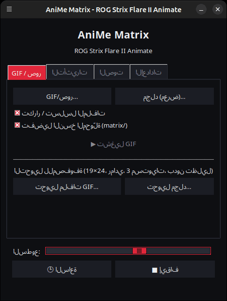
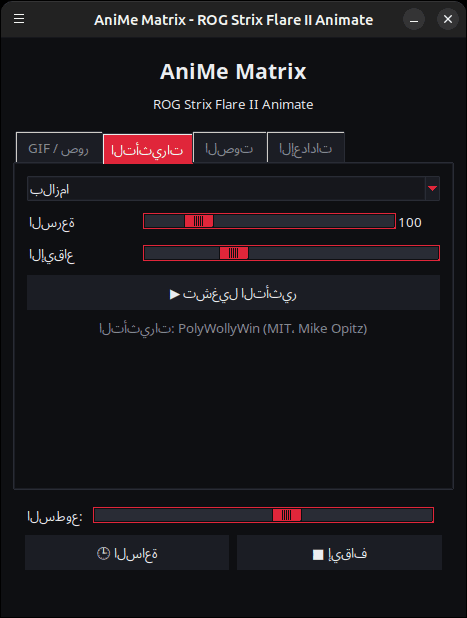
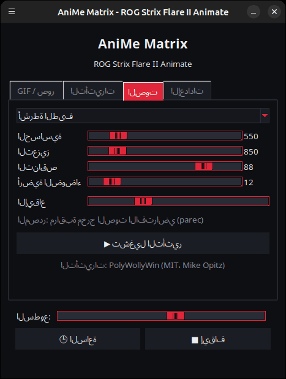
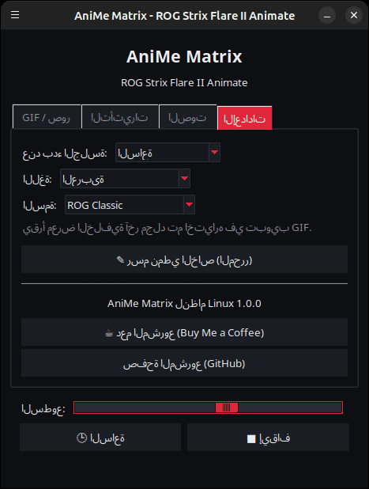

<p align="center">
  
</p>

# AniMe Matrix لِلينكس — ROG Strix Flare II Animate

[](https://github.com/AntiCitoyen/Anticitoyen-ROG-flare2-anime-matrix/releases/latest)
[](../../LICENSE)
[](https://buymeacoffee.com/anticitoyen)

تحكم عبر Linux في شاشة **AniMe Matrix** (312 مصباح LED مصغر) الخاصة بلوحة المفاتيح **ASUS ROG Strix Flare II Animate**، دون Armoury Crate أو Windows: صور GIF وصور ثابتة، معرض خلفية، ساعة، 19 تأثيرًا متحركًا، 7 أدوات لتصور الصوت، رسم LED بـ LED.

<div align="center">

[🇫🇷 Français](../../README.md) · [🇬🇧 English](README.en.md) · [🇪🇸 Español](README.es.md) · [🇩🇪 Deutsch](README.de.md) · [🇮🇹 Italiano](README.it.md) · [🇧🇷 Português](README.pt-BR.md) · [🇳🇱 Nederlands](README.nl.md) · [🇵🇱 Polski](README.pl.md) · [🇷🇺 Русский](README.ru.md) · [🇺🇦 Українська](README.uk.md) · [🇹🇷 Türkçe](README.tr.md) · **🇸🇦 العربية** · [🇮🇳 हिन्दी](README.hi.md) · [🇨🇳 简体中文](README.zh-CN.md) · [🇹🇼 繁體中文](README.zh-TW.md) · [🇯🇵 日本語](README.ja.md) · [🇰🇷 한국어](README.ko.md) · [🇻🇳 Tiếng Việt](README.vi.md) · [🇮🇩 Bahasa Indonesia](README.id.md)

</div>

<div dir="rtl">

*ملاحظة: الواجهة متوفرة بـ19 لغة، وتتبع لغة النظام تلقائيًا، ويمكن تغييرها من تبويب **الإعدادات** عبر **اللغة:**.*

| GIF / صور | التأثيرات | الصوت | الإعدادات |
|---|---|---|---|
|  |  |  |  |

<p align="center"></p>

---

## الفهرس

- [ما يقوم به المشروع](#projet)
- [الأجهزة المدعومة](#materiel)
- [التثبيت](#installation)
- [الاستخدام](#utilisation)
- [إعداد ملفات GIF جيدة](#gif)
- [كيف يعمل](#fonctionnement)
- [استكشاف الأخطاء وإصلاحها](#depannage)
- [تنظيم المستودع](#depot)
- [بناء حزمة .deb](#deb)
- [شكر وتقدير](#credits)
- [الرخصة](#licence)
- [دعم المشروع](#soutien)

---

<a id="projet"></a>

## ما يقوم به المشروع

لا توفر ASUS شاشة AniMe Matrix الخاصة بلوحة المفاتيح هذه إلا تحت Windows (Armoury Crate). يتواصل هذا المشروع مباشرة مع لوحة المفاتيح عبر USB HID ويوفر:

- **مُشغِّل رسومي** (`animematrix`) بأربعة تبويبات:
  - **GIF / صور**: تشغيل ملف واحد أو عدة ملفات، أو مجلد كامل كمعرض، في حلقة متكررة؛ تحويل ملفات GIF لتناسب المصفوفة.
  - **التأثيرات**: 19 حركة (مطر على طراز Matrix، بلازما، نار، نجوم، ألعاب نارية، برق، كرات معدنية، موجة، ثعبان، نص متحرك، ساعة مُصمَّمة، استجابة للوحة المفاتيح…)، قابلة للضبط أثناء تشغيلها.
  - **الصوت**: 7 أدوات لتصور الصوت الذي يشغّله الحاسوب (طيف، KITT/KARR، starburst، راسم الذبذبات، نار صوتية…).
  - **الإعدادات**: ما يُعرض عند فتح الجلسة، محرر الرسم، روابط المشروع.
- **ساعة** بصيغة HH:MM، من المُشغِّل أو كخدمة خلفية.
- **معرض خلفية**: خدمة `systemd --user` تعرض محتوى مجلد GIF بالتناوب فور فتح الجلسة.
- **تبديل بنقرة واحدة** (`animematrix-bascule`): تُشغّل أيقونة القائمة الشاشة أو تُطفئها؛ النقر بزر الماوس الأيمن يتيح الاختيار بين **معرض GIF**، أو **الساعة**، أو **إطفاء**.
- **تحويل ملفات GIF مناسب للمصفوفة** (`animematrix-convertir`): 19×24، تدرج رمادي، 3 مستويات، دون تظليل — راجع [docs/GUIDE-GIF.md](../GUIDE-GIF.md).
- **محرر رسم** LED بـ LED (`animematrix-dessin`).
- **11 سمة**: 5 مستوحاة من ROG (Classic وStrix وGlitch وGold وCarbon)، و5 وردية (ساكورا، علكة، ذهبي وردي، وردي لافندر، ليلة وردية)، وسمة النظام، يمكن اختيارها من *الإعدادات* ← *السمة:*.
- **استهلاك منخفض**: تُفكّك ملفات GIF صورة تلو الأخرى؛ يعمل معرض من 400 ملف GIF باستخدام نحو 25 ميغابايت من الذاكرة.

<a id="materiel"></a>

## الأجهزة المدعومة

| لوحة المفاتيح | USB | الواجهة |
|---|---|---|
| ASUS ROG Strix Flare II Animate | `0b05:19fc` | HID، الواجهة 4 (صفحة الاستخدام `0xFF02`) |

تستخدم شاشات AniMe Matrix الخاصة بحواسيب ROG **المحمولة** (مثل Zephyrus G14) بروتوكولًا مختلفًا: وهي **غير مدعومة** هنا (استخدم `asusctl` بدلًا من ذلك).

اختُبر على Ubuntu 26.04 (X11، PipeWire). يُفترض أن يعمل مع أي توزيعة تحتوي على Python ≥ 3.10 وhidapi وTk وsystemd.

<a id="installation"></a>

## التثبيت

### حزمة .deb (Debian، Ubuntu، Mint، Pop!_OS…)

1. نزّل `anticitoyen-rog-flare2-anime-matrix_<version>_all.deb` من صفحة [Releases](https://github.com/AntiCitoyen/Anticitoyen-ROG-flare2-anime-matrix/releases/latest).
2. ثبّتها (يجلب apt التبعيات تلقائيًا):
   ```bash
   sudo apt install ./anticitoyen-rog-flare2-anime-matrix_*_all.deb
   ```
3. **افصل لوحة المفاتيح ثم أعد توصيلها** (تمنح قاعدة udev الصلاحية للمستخدم الحالي).
4. شغّل **AniMe Matrix** من قائمة التطبيقات، أو نفّذ `animematrix` في الطرفية.

تثبّت الحزمة:

| العنصر | الموقع |
|---|---|
| البرامج | `/usr/share/anticitoyen-rog-flare2-anime-matrix/` |
| الأوامر | `animematrix`، `animematrix-bascule`، `animematrix-effet`، `animematrix-galerie`، `animematrix-horloge`، `animematrix-convertir`، `animematrix-dessin`، `animematrix-lecture` |
| خدمات المستخدم | `/usr/lib/systemd/user/animematrix-galerie.service`، `animematrix-horloge.service`، `animematrix-lecture.service` (غير مُفعَّلة افتراضيًا) |
| قاعدة udev | `/usr/lib/udev/rules.d/72-rog-flare2-animate.rules` |
| القائمة والأيقونة | `animematrix.desktop`، أيقونة `animematrix` |

إزالة التثبيت: `sudo apt remove anticitoyen-rog-flare2-anime-matrix`.

### من المصدر

```bash
git clone https://github.com/AntiCitoyen/Anticitoyen-ROG-flare2-anime-matrix.git
cd Anticitoyen-ROG-flare2-anime-matrix
python3 -m venv .venv
.venv/bin/pip install hidapi pillow numpy pynput
# الوصول إلى لوحة المفاتيح دون root
sudo cp packaging/72-rog-flare2-animate.rules /etc/udev/rules.d/
sudo udevadm control --reload-rules && sudo udevadm trigger
# ثم افصل لوحة المفاتيح وأعد توصيلها
.venv/bin/python rog_flare2_launcher.py
```

أدوات نظام مفيدة: `imagemagick` (التحويل)، `pulseaudio-utils` (`parec`، للصوت)، `zenity` (منتقيات الملفات)، `libnotify-bin` (إشعارات التبديل).

بالنسبة لخدمات الخلفية عند التثبيت من المصدر، انسخ `systemd/*.service` إلى `~/.config/systemd/user/` مع استبدال أسطر `ExecStart=` بمسار `.venv/bin/python` والبرنامج النصي (`rog_flare2_folder_player.py`، `rog_flare2_clock_v3.py`)، ثم نفّذ `systemctl --user daemon-reload`.

<a id="utilisation"></a>

## الاستخدام

### المُشغِّل

`animematrix` (أو عنصر **AniMe Matrix** في القائمة).

- **GIF / صور**: *GIF/صور…* للاختيار، *مجلد (معرض)…* لمجلد كامل. يصبح المجلد المختار أيضًا مجلد معرض الخلفية. *تفضيل النسخ المحوّلة (matrix/)* يقرأ `dossier/matrix/nom.gif` إن وُجد (ينتجه التحويل).
- **التأثيرات** و**الصوت**: اختر، اضبط، *▶ تشغيل التأثير*. تعمل أشرطة التمرير مباشرة؛ *الإيقاع* تُسرّع الحركة أو تُبطئها.
- **السطوع**، **🕒 الساعة**، **■ إيقاف** (يمسح الشاشة) مشتركة بين جميع التبويبات.
- **الإعدادات**: *عند بدء الجلسة* = **معرض GIF**، أو **الساعة**، أو **آخر تشغيل**، أو **لا شيء**.

**عند إغلاق المُشغِّل، ما يُعرض يستمر** (GIF، تأثير بإعداداته الحالية، مصوّر صوتي، أو ساعة): يُسلِّمه المُشغِّل إلى خدمة الخلفية `animematrix-lecture.service`. عند التشغيل التالي، يستعيد المُشغِّل زمام الأمر بمجرد تشغيل شيء آخر (لا يمكن إلا لبرنامج واحد أن يكتب على لوحة المفاتيح). *■ إيقاف* قبل الإغلاق يترك الشاشة مطفأة.

### التبديل وخدمات الخلفية

```bash
animematrix-bascule            # مُشغَّل ← مُطفَأ ؛ مُطفَأ ← آخر وضع
animematrix-bascule gif        # معرض الخلفية، وأيضًا عند فتح الجلسة
animematrix-bascule horloge    # ساعة الخلفية، وأيضًا عند فتح الجلسة
animematrix-bascule lecture    # آخر تشغيل من المُشغِّل، وأيضًا عند فتح الجلسة
animematrix-bascule off        # مُطفَأ، لا شيء عند البدء
animematrix-bascule etat       # الوضع الحالي
```

الخيارات نفسها متاحة بالنقر بزر الماوس الأيمن على أيقونة القائمة. خلف الكواليس: `systemctl --user enable --now animematrix-galerie.service` (أو `animematrix-horloge.service`).

### عبر سطر الأوامر

| الأمر | الوظيفة |
|---|---|
| `animematrix-effet --liste` | يسرد التأثيرات وأدوات التصور |
| `animematrix-effet "Plasma" --brightness 60 --vitesse 1.5` | يشغّل تأثيرًا (Ctrl+C للإيقاف) |
| `animematrix-galerie [dossier] --brightness 60 [--originaux]` | يعرض محتوى مجلد بالتناوب (افتراضيًا آخر مجلد مختار في المُشغِّل، وإلا `~/Images/AniMe-Matrix`) |
| `animematrix-lecture` | يعيد تشغيل آخر تشغيل من المُشغِّل (`~/.config/rog-flare2/lecture.json`) |
| `animematrix-horloge -b 25` | ساعة؛ `--clear` يمسح الشاشة، `--once --text 12:34` يعرض نصًا |
| `animematrix-convertir dossier/ [--sortie D] [--force]` | يحوّل ملفات GIF لتناسب المصفوفة (داخل `dossier/matrix/`) |
| `animematrix-dessin` | محرر الرسم |

### الصوت

تستمع أدوات التصور إلى **مراقب مخرج الصوت الافتراضي** عبر `parec` (PipeWire أو PulseAudio): فهي تستجيب لما يشغّله الحاسوب، لا للميكروفون. لتغيير المخرج، غيّر مخرج الصوت الافتراضي للنظام.

### تأثير « Keyboard React »

يُضيء الشاشة بإيقاع الكتابة بفضل `pynput`، الذي يقرأ ضغطات المفاتيح في الجلسة بأكملها طالما التأثير قيد التشغيل. يعمل تحت X11؛ أما تحت Wayland فلا يستقبل ضغطات المفاتيح.

<a id="gif"></a>

## إعداد ملفات GIF جيدة

الشاشة ليست مستطيلة: 24 صفًا متدرجًا، من 19 مصباح LED في الأعلى إلى 7 في الأسفل، و3 مستويات رمادية متمايزة فعليًا، وهالة بين المصابيح المتجاورة. الأشكال الظلية، والرموز التصويرية، والنصوص القصيرة، والحركات البطيئة تظهر بشكل جيد؛ أما الصور الفوتوغرافية ومقاطع الفيديو فلا.

الدليل الكامل (حجم اللوحة، المستويات، سرعة العرض، السطوع، أمر ImageMagick): **[docs/GUIDE-GIF.md](../GUIDE-GIF.md)**.

<a id="fonctionnement"></a>

## كيف يعمل

- **النقل**: تفتح hidapi واجهة HID رقم 4 في لوحة المفاتيح وتكتب فيها إطارات من **1024 بايت**.
- **الإطار**: `60 81 00 00` + **312 بايت** (سطوع من 0 إلى 255 لكل مصباح LED، وفق الترتيب المادي) + أصفار حتى 1024.
- **الهندسة**: 24 صفًا متدرجًا قطريًا (19 → 7 LED)، أو ما يعادلها 12 صفًا منطقيًا من 37 → 15 عمودًا (نموذج PolyWollyWin)؛ وقد تم التحقق من تطابق التمثيلين على جميع مصابيح LED الـ312.
- **GIF**: تُعاد تركيب كل صورة (ملفات GIF المُحسَّنة تخزّن الفروق فقط)، تُحوَّل إلى تدرج رمادي، تُختزل إلى 24 صفًا، وتُؤخذ عينات منها صفًا صفًا.
- **الحركة**: لا تُستخدم أي ذاكرة مضمّنة؛ الحركة ناتجة عن إرسال الحاسوب المضيف للإطارات واحدًا تلو الآخر (نحو 30 إطارًا/ثانية للتأثيرات).

توجد ملاحظات الهندسة العكسية الأصلية (تسجيلات USBPcap، ترتيب مصابيح LED، نقاط المعايرة) في **[docs/PROTOCOL.md](../PROTOCOL.md)**؛ وتبقى تسجيلات `*.cap` وأدوات `parse_usbpcap.py` / `rog_flare2_replay_capture.py` في المستودع لمن يرغب في التعمق أكثر.

⚠️ لا ترسل إلى لوحة المفاتيح حزم شاشات AniMe Matrix الخاصة بالحواسيب المحمولة (`0x5E …`، `0xEC …`): فهذا ليس البروتوكول الصحيح وقد يؤدي إلى تجميد لوحة المفاتيح (افصلها وأعد توصيلها، أو اضغط مطولًا على **Fn + Esc** لمدة 10-15 ثانية).

<a id="depannage"></a>

## استكشاف الأخطاء وإصلاحها

| العرض | السبب المحتمل | الحل |
|---|---|---|
| `interface 4 not found` | لوحة المفاتيح غير مكتشَفة أو لا صلاحيات | `lsusb \| grep 0b05:19fc`؛ هل قاعدة udev مثبَّتة؟ افصل وأعد التوصيل |
| `Permission denied` / `open failed` | قاعدة udev غير مُطبَّقة | `sudo udevadm control --reload-rules && sudo udevadm trigger`، ثم أعد التوصيل |
| الشاشة لا تتغير | برنامج آخر يكتب عليها بالفعل | `animematrix-bascule off`، أغلق المُشغِّلات أو البرامج النصية الأخرى |
| أدوات التصور تبقى في وضع العرض التجريبي | لا `parec` أو لا صوت | ثبّت `pulseaudio-utils`، شغّل صوتًا |
| « Keyboard React » لا يستجيب | جلسة Wayland أو `pynput` غير موجود | جلسة X11، `sudo apt install python3-pynput` |
| معرض الخلفية لا يبدأ | المجلد فارغ أو غير موجود | اختر مجلدًا في المُشغِّل (تبويب GIF) |
| سجلّ إحدى الخدمات | — | `journalctl --user -u animematrix-galerie.service -f` |

<a id="depot"></a>

## تنظيم المستودع

| الملف | الوظيفة |
|---|---|
| `rog_flare2_launcher.py` | المُشغِّل الرسومي (Tk) |
| `rog_flare2_effets.py` | التأثيرات وأدوات تصور الصوت (محرك PolyWollyWin مُكيَّف لِلينكس) |
| `polywollywin/` | محرك تأثيرات PolyWollyWin، منسوخ دون تعديل (MIT) |
| `rog_flare2_folder_player.py` | معرض الخلفية (خدمة) |
| `rog_flare2_lecture.py` | تشغيل الخلفية: يواصل ما كان المُشغِّل يعرضه عند إغلاقه (خدمة) |
| `rog_flare2_clock_v3.py` | الساعة (خدمة) |
| `rog_flare2_bascule.sh` | التبديل بين المعرض / الساعة / الإطفاء |
| `rog_flare2_convertir.py` | تحويل ملفات GIF (ImageMagick) |
| `rog_flare2_matrix_paint.py` | نقل HID، ترتيب مصابيح LED، محرر الرسم |
| `parse_usbpcap.py`، `rog_flare2_replay_capture.py`، `*.cap` | أدوات وتسجيلات الهندسة العكسية |
| `systemd/` | خدمات المستخدم |
| `packaging/` | قاعدة udev، عنصر القائمة، الأيقونة، ملفات وبرنامج بناء حزمة .deb |
| `docs/` | دليل GIF، ملاحظات البروتوكول، لقطات الشاشة |

<a id="deb"></a>

## بناء حزمة .deb

```bash
packaging/build-deb.sh
# → dist/anticitoyen-rog-flare2-anime-matrix_<version>_all.deb
```

لا يلزم سوى `dpkg-deb` و`bash`؛ يُقرأ رقم الإصدار من `rog_flare2_launcher.py` (`VERSION`).

<a id="credits"></a>

## شكر وتقدير

- **NicRoss512** — الهندسة العكسية للبروتوكول، الساعة والمحرر الأصليان: [ASUS-ROG-Strix-Flare-II-Animate-AniMe-Matrix-Protocol](https://github.com/NicRoss512/ASUS-ROG-Strix-Flare-II-Animate-AniMe-Matrix-Protocol). ينطلق هذا المستودع من عمله؛ ويُحافَظ على تاريخه.
- **Mike Opitz** — [PolyWollyWin](https://github.com/MikeOpitz99/PolyWollyWin) (MIT)، مُتحكِّم Windows الذي أُخذ منه محرك التأثيرات وأدوات تصور الصوت المستخدمة هنا.
- **Yoshi Walsh** — [Mastering the AniMe Matrix](https://blog.yoshiwalsh.me/asus-anime-matrix/)، لسلوك مصابيح LED (الهالة، المستويات المُدركة، سرعة العرض).

مشروع مستقل، غير تابع لشركة ASUS. تُعد "ROG" و"AniMe Matrix" و"Armoury Crate" علامات تجارية مملوكة لشركة ASUSTeK.

<a id="licence"></a>

## الرخصة

[MIT](../../LICENSE) لكود هذا المستودع. يبقى `polywollywin/` خاضعًا لرخصة MIT الخاصة بمؤلفه ([polywollywin/LICENSE](../../polywollywin/LICENSE)). نُشرت الملفات الأصلية لـNicRoss512 (`rog_flare2_clock_v3.py`، `rog_flare2_matrix_paint.py`، `parse_usbpcap.py`، `rog_flare2_replay_capture.py`، `docs/PROTOCOL.md`، التسجيلات) دون رخصة صريحة وتبقى ملكًا لمؤلفها؛ ويُعاد توزيعها مع ذكر المصدر.

<a id="soutien"></a>

## دعم المشروع

إذا كان هذا المشروع مفيدًا لك، فإن فنجان قهوة يساعد على صيانته:

[](https://buymeacoffee.com/anticitoyen)

**https://buymeacoffee.com/anticitoyen** — الرابط موجود أيضًا في تبويب *الإعدادات* في المُشغِّل.

تقارير الأخطاء والأفكار: [Issues](https://github.com/AntiCitoyen/Anticitoyen-ROG-flare2-anime-matrix/issues).

</div>
