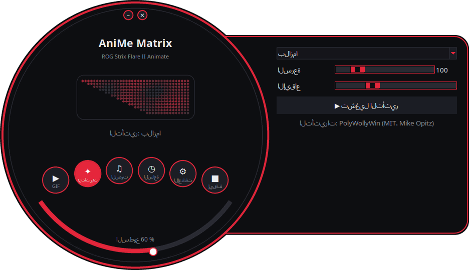
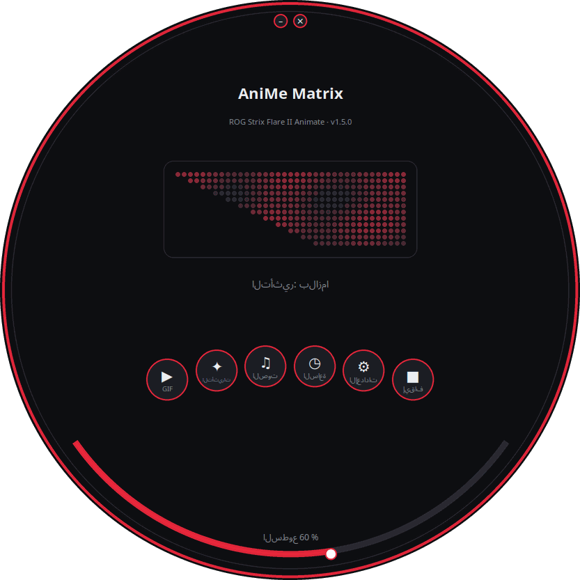
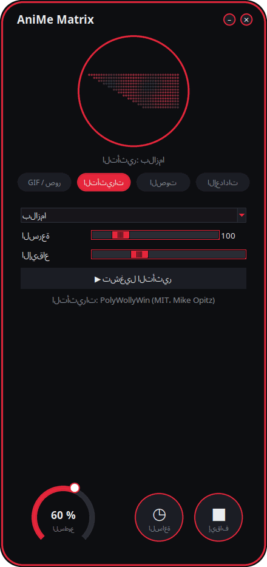
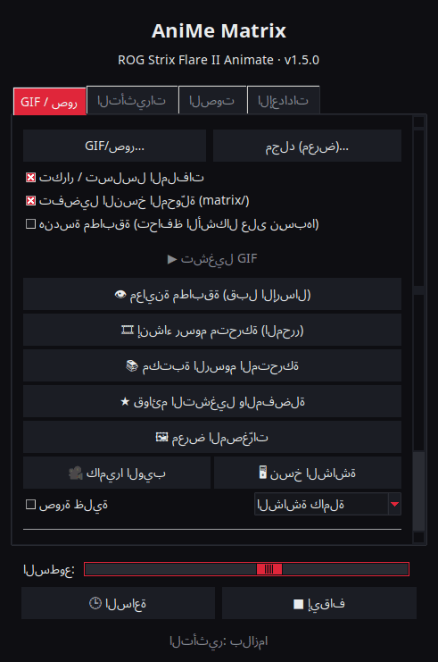

<p align="center">
  
</p>

# AniMe Matrix لِلينكس — ROG Strix Flare II Animate

[](https://github.com/AntiCitoyen/Anticitoyen-ROG-flare2-anime-matrix/releases/latest)
[](https://github.com/AntiCitoyen/Anticitoyen-ROG-flare2-anime-matrix/actions/workflows/ci.yml)
[](../../LICENSE)
[](https://buymeacoffee.com/anticitoyen)

تحكم عبر Linux في شاشة **AniMe Matrix** (312 مصباح LED مصغر) الخاصة بلوحة المفاتيح **ASUS ROG Strix Flare II Animate**، دون Armoury Crate أو Windows: GIF ومعرض، ساعة، تأثيرات وأدوات تصور صوتي، ألعاب، مراقب النظام، إشعارات سطح المكتب، جدولة زمنية، محرر رسوم متحركة، مكتبة مشتركة، ألوان لوحة مفاتيح متزامنة.

<div align="center">

[🇫🇷 Français](../../README.md) · [🇬🇧 English](README.en.md) · [🇪🇸 Español](README.es.md) · [🇩🇪 Deutsch](README.de.md) · [🇮🇹 Italiano](README.it.md) · [🇧🇷 Português](README.pt-BR.md) · [🇳🇱 Nederlands](README.nl.md) · [🇵🇱 Polski](README.pl.md) · [🇷🇺 Русский](README.ru.md) · [🇺🇦 Українська](README.uk.md) · [🇹🇷 Türkçe](README.tr.md) · **🇸🇦 العربية** · [🇮🇳 हिन्दी](README.hi.md) · [🇨🇳 简体中文](README.zh-CN.md) · [🇹🇼 繁體中文](README.zh-TW.md) · [🇯🇵 日本語](README.ja.md) · [🇰🇷 한국어](README.ko.md) · [🇻🇳 Tiếng Việt](README.vi.md) · [🇮🇩 Bahasa Indonesia](README.id.md)

</div>

<div dir="rtl">

<p align="center"><br><em>قرص + درج (الواجهة الافتراضية)</em></p>

| قرص | مستديرة | كلاسيكية |
|:---:|:---:|:---:|
|  |  |  |

<p align="center"></p>

---

## الفهرس

- [ما يقوم به المشروع](#projet)
- [الأجهزة المدعومة](#materiel)
- [التثبيت](#installation)
- [الاستخدام](#utilisation)
- [إعداد ملفات GIF جيدة](#gif)
- [كيف يعمل](#fonctionnement)
- [استكشاف الأخطاء وإصلاحها](#depannage)
- [تنظيم المستودع](#depot)
- [بناء الحزم](#deb)
- [شكر وتقدير](#credits)
- [الرخصة](#licence)
- [دعم المشروع](#soutien)

---

<a id="projet"></a>

## ما يقوم به المشروع

لا توفر ASUS شاشة AniMe Matrix الخاصة بلوحة المفاتيح هذه إلا تحت Windows (Armoury Crate). يتواصل هذا المشروع مباشرة مع لوحة المفاتيح عبر USB HID ويوفر:

**العرض**
- **GIF وصور وفيديو**: ملف واحد، مجموعة مختارة، أو مجلد كامل كمعرض، بالسحب والإفلات على النافذة؛ مقاطع فيديو (MP4، WebM، MKV…) يشغّلها ffmpeg؛ معرض المصغّرات؛ تُحفظ الإطارات المحوَّلة في ذاكرة مؤقتة (يعمل معرض من 400 GIF بنحو 25 ميغابايت من الذاكرة).
- **ساعة**: واجهة رقمية أو تناظرية أو ثنائية أو بالكلمات (الفرنسية، الإنجليزية، الألمانية، الإسبانية، الإيطالية، البرتغالية، الهولندية) أو مزخرفة.
- **تأثيرات متحركة** (مطر على طراز Matrix، بلازما، نار، نجوم، ألعاب نارية، برق، كرات معدنية، موجة…) و**7 أدوات لتصور الصوت** تستجيب للصوت الذي يشغّله الحاسوب.
- **نص**: رسالتك، بكل أنظمة الكتابة (الحروف المشكّلة، السيريلية، العربية، الهندية، الصينية، اليابانية، الكورية…)، متحركًا نحو اليسار أو اليمين أو الأعلى أو الأسفل، أو ثابتًا.
- **كاميرا الويب** (صورة أو ظلّ) و**نسخ الشاشة** (الشاشة كاملة، حول مؤشر الفأرة، أو النافذة النشطة).
- **مراقب النظام**: المعالج، الذاكرة، بطاقة الرسوميات، الحرارة، سرعة الشبكة والوقت، على شكل مقاييس.
- **المقطوعة الجارية**: عند تغيير المقطوعة، يمرّ « الفنان - العنوان » مرة واحدة، ثم تظهر أداة تصور (Spotify، VLC، Rhythmbox، المتصفحات… عبر MPRIS).
- **إشعارات سطح المكتب**: يظهر « التطبيق: العنوان » فوق المحتوى الحالي ثم يستأنف العرض (معطّلة افتراضيًا، بقائمة تطبيقات مسموح بها).
- **ألعاب قابلة للّعب** على لوحة المفاتيح: Snake وPong (فرديًا أو للاعبَين) وTetris ولعبة كسر الطوب وInvaders وFlappy، مع أرقام قياسية.
- **المؤشرات**: كتل مضيئة صغيرة عندما يكون الميكروفون مكتومًا أو قيد الاستخدام، وعندما تعمل كاميرا الويب، وعندما يبثّ OBS أو يسجّل.
- **ذاكرة لوحة المفاتيح**: رسوم متحركة (GIF، صورة) محفوظة في لوحة المفاتيح تُعرض دون أي برنامج فور التوصيل، حتى على حاسوب آخر؛ سطوع قابل للضبط (تبويب GIF، `animematrix-ctl memoire`).

**الإنشاء**
- **محرر رسوم متحركة** صورة تلو الأخرى، على الهندسة الحقيقية للشاشة: 3 مستويات، شريط زمني، طبقة شبح، إزاحة، نسخ ولصق، معاينة، إرسال إلى لوحة المفاتيح، تصدير كـGIF.
- **مكتبة رسوم متحركة** مشتركة: التصفح والتشغيل، الإضافة إلى معرضك، اقتراح رسومك الخاصة.
- **تحويل ذكي** لملفات GIF: قصّ على الموضوع، موضوع فاتح على خلفية سوداء، حواف معزَّزة، 3 مستويات.
- **معاينة مطابقة** قبل الإرسال: عرض محاكى للشاشة (التخطيط الحقيقي، هالة بين المصابيح).
- **تأثيرات كإضافات**: ملف Python يوضع في مجلد يضيف تأثيرًا (راجع [docs/EXTENSIONS.md](../EXTENSIONS.md)).

**الأتمتة**
- **خدمة الخلفية `animematrixd`**: المالك الوحيد للشاشة، تستمر في العرض عند إغلاق المُشغِّل؛ أمر `animematrix-ctl` وواجهة HTTP محلية اختيارية.
- **جدولة زمنية**: فترات (أيام، بما فيها الليل) بساعة أو معرض أو مراقب أو مقطوعة جارية أو تأثير أو قائمة تشغيل أو شاشة مطفأة؛ تُطفأ الشاشة عند قفل الجلسة أو أثناء السكون أو عندما يكون تطبيق في وضع ملء الشاشة.
- **ملفات تعريف التطبيقات**: محتوى خاص بلعبة أو بتطبيق ما دام في المقدمة (زر *اكتشاف*).
- **قوائم التشغيل والمفضلة**: GIF، تأثيرات، ساعة… كلٌّ طوال مدته، في حلقة؛ متاحة أيضًا في أيقونة شريط النظام وفي سطر الأوامر.
- **التحكم عن بُعد عبر الويب**: صفحة للتحكم بالشاشة من هاتف على الشبكة المحلية (رمز QR، رمز وصول).
- **انتهاء الأوامر الطويلة**: في الطرفية، يظهر « اكتمل: make 2 min 05 » عند انتهاء أمر طويل.
- **ألوان المفاتيح وتأثيراتها** دون OpenRGB: قوس قزح، ثابت، تنفّس، دورة الألوان، تفاعلي، تموّج، ليلة مرصّعة بالنجوم، رمال متحركة، تيّار، مطر — تنفّذها لوحة المفاتيح نفسها وتبقى بعد فصلها؛ أو لون السمة، نبض مع الشاشة.
- **أيقونة شريط النظام**: قائمة سريعة (الأوضاع، السطوع).

**الراحة**
- **4 واجهات** (افتراضيًا *قرص + درج*، ثم *قرص*، *مستديرة*، *كلاسيكية*) مع **معاينة حية لمصابيح LED الـ312**، **11 سمة** (5 من ROG، 5 وردية، وسمة النظام) و**19 لغة**.
- **X11 وWayland**: الاستجابة للوحة المفاتيح عبر evdev، وقراءة النافذة النشطة من Sway أو Hyprland أو KDE (kdotool) أو GNOME (امتداد *Window Calls*).
- **تحديثات مدمجة**: يُنزّل المُشغِّل آخر إصدار، يتحقق من بصمته SHA-256 ويثبّته (كلمة مرور المسؤول)؛ أو `apt upgrade` مع مستودع APT.

<a id="materiel"></a>

## الأجهزة المدعومة

| الجهاز | USB | الحالة |
|---|---|---|
| ASUS ROG Strix Flare II Animate | `0b05:19fc` | مدعوم (HID، الواجهة 4، صفحة الاستخدام `0xFF02`) |
| شاشات AniMe Matrix الخاصة بحواسيب ROG المحمولة (G14، G16…) | متنوعة | **تجريبي** عبر `asusctl`، لم يُختبر على عتاد حقيقي (راجع [الاستخدام](#utilisation)) |

اختُبر على Ubuntu 26.04 (X11، PipeWire، Cinnamon). يُفترض أن تعمل أي توزيعة تحتوي على Python ≥ 3.10 وhidapi وTk وsystemd؛ وتحت Wayland يعمل المُشغِّل عبر XWayland.

<a id="installation"></a>

## التثبيت

### مستودع APT (Debian، Ubuntu، Mint، Pop!_OS…) — تحديثات عبر `apt upgrade`

```bash
curl -fsSL https://anticitoyen.github.io/Anticitoyen-ROG-flare2-anime-matrix/animematrix.gpg \
  | sudo tee /usr/share/keyrings/animematrix.gpg >/dev/null
echo "deb [signed-by=/usr/share/keyrings/animematrix.gpg] https://anticitoyen.github.io/Anticitoyen-ROG-flare2-anime-matrix stable main" \
  | sudo tee /etc/apt/sources.list.d/animematrix.list
sudo apt update && sudo apt install anticitoyen-rog-flare2-anime-matrix
```

ثم **افصل لوحة المفاتيح ثم أعد توصيلها** (تمنح قاعدة udev الصلاحية للمستخدم المتصل) وشغّل **AniMe Matrix** من القائمة.

### صيغ أخرى (صفحة [Releases](https://github.com/AntiCitoyen/Anticitoyen-ROG-flare2-anime-matrix/releases/latest))

| النظام | الملف | التثبيت |
|---|---|---|
| Debian، Ubuntu… | `anticitoyen-rog-flare2-anime-matrix_<version>_all.deb` | `sudo apt install ./anticitoyen-rog-flare2-anime-matrix_*_all.deb` |
| Fedora، openSUSE… | `anticitoyen-rog-flare2-anime-matrix-<version>-1.noarch.rpm` | `sudo dnf install ./anticitoyen-rog-flare2-anime-matrix-*.noarch.rpm` |
| Arch، Manjaro… | `anticitoyen-rog-flare2-anime-matrix-<version>-1-any.pkg.tar.zst` | `sudo pacman -U anticitoyen-rog-flare2-anime-matrix-*.pkg.tar.zst` |
| جميع التوزيعات (Flatpak) | `AniMeMatrix-<version>.flatpak` | `flatpak install --user AniMeMatrix-*.flatpak` (ثبّت أيضًا قاعدة udev أدناه؛ دون أدوات تصور صوتي) |

تثبّت الحزمة:

| العنصر | الموقع |
|---|---|
| البرامج | `/usr/share/anticitoyen-rog-flare2-anime-matrix/` |
| الأوامر | `animematrix`، `animematrixd`، `animematrix-ctl`، `animematrix-bascule`، `animematrix-animation`، `animematrix-apercu`، `animematrix-convertir`، `animematrix-effet`، `animematrix-galerie`، `animematrix-horloge`، `animematrix-dessin`، `animematrix-tray`, `animematrix-memoire` |
| خدمة المستخدم | `/usr/lib/systemd/user/animematrixd.service` (مُفعَّلة لجميع الجلسات) |
| قاعدة udev | `/usr/lib/udev/rules.d/72-rog-flare2-animate.rules` |
| القائمة والأيقونة | `animematrix.desktop`، أيقونة `animematrix` |

### من المصدر

```bash
git clone https://github.com/AntiCitoyen/Anticitoyen-ROG-flare2-anime-matrix.git
cd Anticitoyen-ROG-flare2-anime-matrix
python3 -m venv .venv
.venv/bin/pip install hidapi pillow numpy pynput python-xlib
# الوصول إلى لوحة المفاتيح دون root
sudo cp packaging/72-rog-flare2-animate.rules /etc/udev/rules.d/
sudo udevadm control --reload-rules && sudo udevadm trigger
# ثم افصل لوحة المفاتيح وأعد توصيلها
.venv/bin/python rog_flare2_launcher.py
```

أدوات نظام مفيدة: `imagemagick` (التحويل الكلاسيكي)، `pulseaudio-utils` (`parec`، للصوت)، `zenity` (منتقيات الملفات)، `libnotify-bin` (الإشعارات)، `python3-gi` وgir1.2-ayatanaappindicator3-0.1 (أيقونة شريط النظام)، `ffmpeg` (الفيديو، كاميرا الويب، نسخ الشاشة)، `python3-evdev` (الاستجابة للوحة المفاتيح تحت Wayland)، `x11-utils` (النافذة النشطة تحت X11)، `python3-qrcode` (رمز QR للتحكم عن بُعد)، `tkdnd` (السحب والإفلات).

<a id="utilisation"></a>

## الاستخدام

### المُشغِّل

`animematrix` (أو عنصر **AniMe Matrix** في القائمة).

في الواجهات الدائرية، تفتح الأزرار الدائرية كتل *GIF*، *التأثيرات*، *الصوت* و*الإعدادات* (في الدرج أو داخل الدائرة)؛ يعمل *الساعة* و*إيقاف* فورًا؛ يضبط القوس السفلي السطوع؛ تُنقل النافذة بسحب خلفيتها؛ تُصغِّر الأزرار الصغيرة العلوية النافذة أو تُغلقها. يستخدم الشكل الدائري امتداد X11 SHAPE (حزمة `python3-xlib`)؛ بدونه، تُعرض الواجهة نفسها في نافذة مستطيلة.

- **GIF / صور**: *GIF/صور…* أو *مجلد (معرض)…* (أو السحب والإفلات على النافذة)؛ *هندسة مطابقة* تحافظ على النِسب (تقصّ الزاوية الصورة بدلًا من تمديدها)؛ *👁 معاينة مطابقة (قبل الإرسال)* تعرض النتيجة دون إرسال أي شيء؛ *🎞 إنشاء رسوم متحركة (المحرر)*؛ *📚 مكتبة الرسوم المتحركة*؛ *★ قوائم التشغيل والمفضلة*؛ *🖼 معرض المصغّرات* (نقرة: تشغيل، نقرة يمنى: مفضلة)؛ *🎥 كاميرا الويب* و*🖥 نسخ الشاشة*؛ *تحويل ذكي* لتحويل ملفات GIF.
- **التأثيرات** و**الصوت**: اختر، اضبط، *▶ تشغيل التأثير*. تعمل أشرطة التمرير مباشرة؛ *الإيقاع* تُسرّع الحركة كلها أو تُبطئها. يأخذ تأثير *نص* رسالتك واتجاه حركتها. تُلعَب الألعاب بالأسهم والمسافة وEnter، مع بقاء نافذة المُشغِّل في المقدمة؛ Pong للاعبَين: Z/W وS للاعب الأيسر.
- **السطوع**، **🕒 الساعة**، **■ إيقاف** (يمسح الشاشة) مشتركة بين جميع التبويبات.
- **الإعدادات**: عند بدء الجلسة (معرض GIF، الساعة، آخر تشغيل أو لا شيء)، واجهة الساعة، اللغة، السمة، الواجهة، إشعارات سطح المكتب، ألوان لوحة المفاتيح، *الجدولة…* (المُحفِّزات، ملفات تعريف التطبيقات، الفترات الزمنية)، *المؤشرات (الميكروفون، كاميرا الويب، OBS)…*، *التحكم عن بُعد عبر الويب…*، أيقونة شريط النظام، انتهاء الأوامر الطويلة، مجلد الإضافات، التحديثات.

**إغلاق المُشغِّل لا يوقف شيئًا**: تستمر خدمة الخلفية `animematrixd` في العرض. *■ إيقاف* يُطفئ الشاشة.

### الخدمة الخلفية وسطر الأوامر

```bash
animematrix-ctl etat                               # ما يُعرض حاليًا
animematrix-ctl gif ~/Images/AniMe-Matrix --fidele # معرض (مجلد أو ملفات)
animematrix-ctl effet "Plasma" --param speed=250   # تأثير وإعدادات
animematrix-ctl horloge
animematrix-ctl texte "Bonjour"
animematrix-ctl effet "Text" --param message="Salut" --param direction=haut
animematrix-ctl liste "Soirée"                     # قائمة تشغيل (بدون اسم: يعرض القوائم)
animematrix-ctl favori 2                           # المفضلة رقم 2 (بدون رقم: يعرض المفضلة)
animematrix-ctl notifier "Café prêt" --duree 5     # يظهر فوق المحتوى ثم يعود
animematrix-ctl memoire anim.gif                   # تُحفظ في لوحة المفاتيح (196 إطارًا على الأكثر)
animematrix-ctl clavier                            # يعرض الرسوم المحفوظة
animematrix-ctl luminosite 60
animematrix-ctl stop
```

| الأمر | الدور |
|---|---|
| `animematrix-bascule [gif\|horloge\|lecture\|off\|etat]` | تبديل (متاح أيضًا في النقر بزر الماوس الأيمن على أيقونة القائمة)؛ الوضع المختار هو أيضًا وضع بدء الجلسة |
| `animematrixd --http 8765` | خدمة خلفية بواجهة HTTP محلية (`POST http://127.0.0.1:8765/api`, `Content-Type: application/json`، بنفس صيغة JSON الخاصة بالمقبس) |
| `animematrix-animation [fichier.gif]` | محرر الرسوم المتحركة |
| `animematrix-apercu fichier.gif -o apercu.gif` | معاينة مطابقة لملف GIF |
| `animematrix-convertir dossier/ [--fidele] [--classique]` | يحوّل ملفات GIF لتناسب المصفوفة (في `dossier/matrix/`) |
| `animematrix-effet --liste` | يسرد التأثيرات وأدوات التصور |
| `animematrix-dessin` | محرر LED بـ LED (يُعيد اليد إلى الخدمة الخلفية عند الإغلاق) |

### الصوت

تستمع أدوات التصور إلى **مراقب مخرج الصوت الافتراضي** عبر `parec` (PipeWire أو PulseAudio): فهي تستجيب لما يشغّله الحاسوب، لا للميكروفون.

### تأثير « Keyboard React »

يُضيء الشاشة بإيقاع الكتابة طالما التأثير قيد التشغيل: تحت X11 عبر `pynput`، وتحت Wayland بقراءة لوحة المفاتيح من `/dev/input` (`python3-evdev`). تحت Wayland، إذا بقي التأثير في وضع العرض التجريبي، اسمح بقراءة لوحة مفاتيح ROG وحدها:

```bash
sudo cp /usr/share/anticitoyen-rog-flare2-anime-matrix/udev/73-rog-flare2-animate-touches.rules /etc/udev/rules.d/
sudo udevadm control --reload-rules && sudo udevadm trigger
```

### المؤشرات

*الإعدادات* ← *المؤشرات (الميكروفون، كاميرا الويب، OBS)…*: تُضيء كتلة من 2 × 2 LED في أعلى يسار الشاشة، فوق العرض الجاري (1: الميكروفون مكتوم أو قيد الاستخدام، 2: كاميرا الويب قيد الاستخدام، 3: OBS في بثّ مباشر أو تسجيل)، ويمكن الإعلان عن كل تغيير بنص متحرك. OBS: فعّل خادم WebSocket (*أدوات* ← *إعدادات خادم WebSocket*) وأدخل منفذه وكلمة مروره هنا.

### التحكم عن بُعد عبر الويب

*الإعدادات* ← *التحكم عن بُعد عبر الويب…*: حدّد *تفعيل التحكم عن بُعد عبر الويب*، ثم افتح العنوان (أو امسح رمز QR) على هاتف متصل بالشبكة نفسها. تعرض الصفحة الشاشة مباشرة وتتيح الساعة والمعرض والتأثيرات والمفضلة والقوائم والسطوع والرسالة. يحتوي العنوان على رمز وصول: لا تشاركه، وغيّره بـ*رمز جديد*؛ الصفحة غير مشفّرة (HTTP): للشبكات الموثوقة فقط.

### انتهاء الأوامر الطويلة

*الإعدادات* ← *عرض انتهاء الأوامر الطويلة (الطرفية)* يضيف سطرًا إلى `~/.bashrc` (و`~/.zshrc`): كل أمر يستغرق أكثر من 30 ثانية يعرض عند انتهائه « اكتمل: make 2 min 05 » أو « فشل (2): … ». العتبة: `ANIMEMATRIX_FIN_SECONDES`؛ تُتجاهل الأوامر التفاعلية (المحررات، `ssh`، `less`…).

### ألوان لوحة المفاتيح

*الإعدادات* ← *🌈 ألوان لوحة المفاتيح…*: التأثير (قوس قزح، ثابت، تنفّس، دورة الألوان، تفاعلي، تموّج، ليلة مرصّعة بالنجوم، رمال متحركة، تيّار، مطر)، الألوان، السرعة، السطوع، الاتجاه. *تجربة* تطبّقه، و*حفظ في لوحة المفاتيح* يُبقيه بعد الفصل. *لون السمة* و*النبض مع الشاشة* يرسلهما البرنامج الخادم مفتاحًا مفتاحًا؛ وعند الخروج منهما يعود التأثير المحفوظ. من سطر الأوامر: `animematrix-ctl rgb arc-en-ciel --vitesse 70`، `animematrix-ctl rgb statique --couleur "#ff0000"`. وضعان برمجيان آخران: *صورة الشاشة* (تعكس المفاتيح الشاشة مكبّرة) و*طيف الصوت* (شريط لكل عمود). ويمكن لكل فترة زمنية ولكل ملف تطبيق أن يختار أيضًا ألوان المفاتيح (*الجدولة…*).

### حواسيب ROG المحمولة (تجريبي)

اكتب `portable-asusctl` في `~/.config/rog-flare2/materiel` ثم أعد تشغيل الخدمة الخلفية: تمرّ الإطارات عبر `asusctl anime image` (بحد أقصى 5 صور في الثانية). لم يُختبر على حاسوب محمول حقيقي: الملاحظات مرحّب بها في التذاكر.

<a id="gif"></a>

## إعداد ملفات GIF جيدة

الشاشة ليست مستطيلة: 24 صفًا متدرجًا، من 19 مصباح LED في الأعلى إلى 7 في الأسفل (الحافة اليمنى عمودية، الحافة اليسرى قطرية)، و3 مستويات رمادية متمايزة فعليًا، وهالة بين المصابيح المتجاورة. الأشكال الظلية، والرموز التصويرية، والنصوص القصيرة، والحركات البطيئة تظهر بشكل جيد؛ أما الصور الفوتوغرافية ومقاطع الفيديو فلا.

الدليل الكامل (اللوحة، المستويات، السرعة، التحويل، الهندسة المطابقة): **[docs/GUIDE-GIF.md](../GUIDE-GIF.md)**.

<a id="fonctionnement"></a>

## كيف يعمل

- **النقل**: تفتح hidapi واجهة HID رقم 4 في لوحة المفاتيح وتكتب فيها إطارات من **1024 بايت**؛ وتُعيد لوحة المفاتيح كل إطار.
- **الإطار**: `60 81 00 00` + **312 بايت** (سطوع من 0 إلى 255 لكل مصباح LED، وفق الترتيب المادي) + أصفار حتى 1024.
- **الهندسة**: 24 صفًا متدرجًا (يغطي الصف r الأعمدة من (r+1)//2 إلى 18)، أو ما يعادلها 12 صفًا منطقيًا من 37 → 15 عمودًا (نموذج PolyWollyWin)؛ وقد تم التحقق من تطابق التمثيلين على جميع مصابيح LED الـ312.
- **الخدمة الخلفية**: تُمسك `animematrixd` بلوحة المفاتيح وحدها؛ تشغيل أساسي وطبقة علوية (الإشعارات)؛ مقبس JSON عند `$XDG_RUNTIME_DIR/animematrix.sock`؛ إعادة اتصال تلقائية بلوحة المفاتيح.
- **الحركة**: يرسل الحاسوب المضيف الإطارات واحدًا تلو الآخر (نحو 30 إطارًا/ثانية للتأثيرات)؛ لا تُستخدم ذاكرة لوحة المفاتيح الداخلية (البحث: [docs/RECHERCHE-MEMOIRE.md](../RECHERCHE-MEMOIRE.md)).

توجد ملاحظات الهندسة العكسية الأصلية في **[docs/PROTOCOL.md](../PROTOCOL.md)**؛ وتبقى تسجيلات `*.cap` وأدوات `parse_usbpcap.py` / `rog_flare2_replay_capture.py` في المستودع.

⚠️ لا ترسل إلى لوحة المفاتيح حزم شاشات AniMe Matrix الخاصة بالحواسيب المحمولة (`0x5E …`، `0xEC …`): فهذا ليس البروتوكول الصحيح وقد يؤدي إلى تجميد لوحة المفاتيح (افصلها وأعد توصيلها، أو اضغط مطولًا على **Fn + Esc** لمدة 10-15 ثانية).

<a id="depannage"></a>

## استكشاف الأخطاء وإصلاحها

| العرض | السبب المحتمل | الحل |
|---|---|---|
| `interface 4 not found` | لوحة المفاتيح غير مكتشَفة أو لا صلاحيات | `lsusb \| grep 0b05:19fc`؛ هل قاعدة udev مثبَّتة؟ افصل وأعد التوصيل |
| `Permission denied` / `open failed` | قاعدة udev غير مُطبَّقة | `sudo udevadm control --reload-rules && sudo udevadm trigger`، ثم أعد التوصيل |
| « تعذّر الوصول إلى خدمة animematrixd » | الخدمة الخلفية متوقفة | `systemctl --user restart animematrixd.service` أو `animematrixd &` |
| الشاشة لا تتغير | برنامج آخر يكتب على لوحة المفاتيح | أغلق البرامج النصية القديمة؛ `animematrix-ctl etat` |
| أدوات التصور تبقى في وضع العرض التجريبي | لا `parec` أو لا صوت | ثبّت `pulseaudio-utils`، شغّل صوتًا |
| « Keyboard React » لا يستجيب | `pynput` (X11) أو `python3-evdev` (Wayland) غير موجود، أو لوحة المفاتيح غير مقروءة | ثبّت الحزمة؛ وتحت Wayland، قاعدة udev في [Keyboard React](#utilisation) |
| كاميرا الويب أو الفيديو أو نسخ الشاشة لا تعمل | `ffmpeg` غير موجود | `sudo apt install ffmpeg`؛ تحت Wayland، يمرّ نسخ الشاشة عبر البوابة (`gstreamer1.0-pipewire`) |
| ملفات تعريف التطبيقات أو ملء الشاشة بلا أثر تحت Wayland | النافذة النشطة غير معروفة لدى المُركِّب | GNOME: امتداد *Window Calls*؛ KDE: `kdotool`؛ Sway وHyprland: لا شيء يلزم فعله |
| النافذة الدائرية تظهر كمستطيل | امتداد SHAPE أو `python3-xlib` غائب | `sudo apt install python3-xlib`، أو *الإعدادات* ← *الواجهة:* ← *كلاسيكية* |
| سجلّ الخدمة الخلفية | — | `journalctl --user -u animematrixd.service -f` |

<a id="depot"></a>

## تنظيم المستودع

| الملف | الوظيفة |
|---|---|
| `rog_flare2_launcher.py` | المُشغِّل الرسومي (Tk) |
| `rog_flare2_ui_ronde.py`، `rog_flare2_themes.py` | الواجهات الدائرية، السمات |
| `rog_flare2_i18n.py`، `locale/` | الترجمة (19 لغة؛ `locale/_cles.json` = النصوص الواجب ترجمتها؛ [docs/TRADUIRE.md](../TRADUIRE.md)) |
| `rog_flare2_demon.py`، `rog_flare2_ctl.py` | خدمة الخلفية `animematrixd`، العميل وأمر `animematrix-ctl` |
| `rog_flare2_core.py` | تشغيل GIF بالتدفق، ذاكرة الإطارات المؤقتة، الساعة، الهندسة |
| `rog_flare2_texte.py`، `rog_flare2_horloges.py` | نص بكل أنظمة الكتابة، تأثير *نص*، واجهات الساعة |
| `rog_flare2_listes.py`، `rog_flare2_vignettes.py` | قوائم التشغيل، المفضلة، معرض المصغّرات، السحب والإفلات |
| `rog_flare2_video.py`، `rog_flare2_voyants.py`، `rog_flare2_telecommande.py` | الفيديو، كاميرا الويب، نسخ الشاشة؛ المؤشرات؛ التحكم عن بُعد عبر الويب |
| `rog_flare2_touches.py`، `rog_flare2_fenetre.py`، `rog_flare2_fin.py`، `rog_flare2_flatpak.py` | المفاتيح والنافذة النشطة (X11، Wayland)، انتهاء الأوامر الطويلة، Flatpak |
| `rog_flare2_effets.py`، `polywollywin/` | التأثيرات وأدوات التصور (محرك PolyWollyWin، MIT)، الإضافات |
| `rog_flare2_infos.py`، `rog_flare2_mpris.py`، `rog_flare2_jeux.py` | مراقب النظام، المقطوعة الجارية، الألعاب |
| `rog_flare2_notifs.py`، `rog_flare2_programme.py`، `rog_flare2_ui_programme.py` | الإشعارات، الجدولة الزمنية والمُحفِّزات |
| `rog_flare2_rgb.py`، `rog_flare2_tray.py`، `rog_flare2_portable.py` | ألوان المفاتيح وتأثيراتها، أيقونة شريط النظام، الحواسيب المحمولة (تجريبي) |
| `rog_flare2_animation.py`، `rog_flare2_simulateur.py`، `rog_flare2_convertir.py` | محرر الرسوم المتحركة، المحاكي، التحويل |
| `rog_flare2_bibliotheque.py`، `bibliotheque/` | مكتبة الرسوم المتحركة (الفهرس، ملفات GIF بترخيص CC0) |
| `rog_flare2_maj.py` | التحديثات من الإصدارات |
| `rog_flare2_matrix_paint.py`، `rog_flare2_clock_v3.py`، `rog_flare2_folder_player.py` | نقل HID ومحرر LED، الساعة، المعرض (الأدوات الأصلية) |
| `parse_usbpcap.py`، `rog_flare2_replay_capture.py`، `*.cap` | الهندسة العكسية |
| `examples/effets/` | مثال إضافة |
| `tests/` | الاختبارات (بما فيها اختبارات الواجهة بنقرات حقيقية) |
| `systemd/`، `packaging/` | خدمة المستخدم؛ ملفات .deb وRPM وArch وFlatpak ومستودع APT |
| `docs/` | دليل GIF، الإضافات، البروتوكول، البحث، لقطات الشاشة، ملفات README المترجمة |

<a id="deb"></a>

## بناء الحزم

```bash
packaging/build-deb.sh
# → dist/anticitoyen-rog-flare2-anime-matrix_<version>_all.deb
```

يثبّت `packaging/install.sh` المشروع في أي شجرة مجلدات؛ ويُستخدم لحزمة .deb، وRPM (`packaging/rpm/`)، وحزمة Arch (`packaging/aur/`)، وFlatpak (`packaging/flathub/`). عند كل إصدار يُنشر، يبني GitHub حزمة RPM وحزمة Arch وFlatpak، ويحدّث مستودع APT الموقَّع. تُقرأ نسخة الإصدار من `rog_flare2_core.py` (`VERSION`). الاختبارات: `python -m pytest tests`.

<a id="credits"></a>

## شكر وتقدير

- **NicRoss512** — الهندسة العكسية للبروتوكول، الساعة والمحرر الأصليان: [ASUS-ROG-Strix-Flare-II-Animate-AniMe-Matrix-Protocol](https://github.com/NicRoss512/ASUS-ROG-Strix-Flare-II-Animate-AniMe-Matrix-Protocol). ينطلق هذا المستودع من عمله؛ ويُحافَظ على تاريخه.
- **Mike Opitz** — [PolyWollyWin](https://github.com/MikeOpitz99/PolyWollyWin) (MIT)، مُتحكِّم Windows الذي أُخذ منه محرك التأثيرات وأدوات تصور الصوت المستخدمة هنا.
- **Yoshi Walsh** — [Mastering the AniMe Matrix](https://blog.yoshiwalsh.me/asus-anime-matrix/)، لسلوك مصابيح LED (الهالة، المستويات المُدركة، سرعة العرض).
- **asus-linux** — [asusctl](https://gitlab.com/asus-linux/asusctl)، المُستخدَم لشاشات الحواسيب المحمولة.

مشروع مستقل، غير تابع لشركة ASUS. تُعد "ROG" و"AniMe Matrix" و"Armoury Crate" علامات تجارية مملوكة لشركة ASUSTeK.

<a id="licence"></a>

## الرخصة

[MIT](../../LICENSE) لكود هذا المستودع؛ الرسوم المتحركة في `bibliotheque/` بترخيص CC0. يبقى `polywollywin/` خاضعًا لرخصة MIT الخاصة بمؤلفه ([polywollywin/LICENSE](../../polywollywin/LICENSE)). نُشرت الملفات الأصلية لـNicRoss512 (`rog_flare2_clock_v3.py`، `rog_flare2_matrix_paint.py`، `parse_usbpcap.py`، `rog_flare2_replay_capture.py`، `docs/PROTOCOL.md`، التسجيلات) دون رخصة صريحة وتبقى ملكًا لمؤلفها؛ ويُعاد توزيعها مع ذكر المصدر.

<a id="soutien"></a>

## دعم المشروع

إذا كان هذا المشروع مفيدًا لك، فإن فنجان قهوة يساعد على صيانته:

[](https://buymeacoffee.com/anticitoyen)

**https://buymeacoffee.com/anticitoyen** — الرابط موجود أيضًا في تبويب *الإعدادات* في المُشغِّل.

تقارير الأخطاء، الأفكار، والرسوم المتحركة المُراد مشاركتها: [Issues](https://github.com/AntiCitoyen/Anticitoyen-ROG-flare2-anime-matrix/issues). الترجمات: [docs/TRADUIRE.md](../TRADUIRE.md).

</div>
