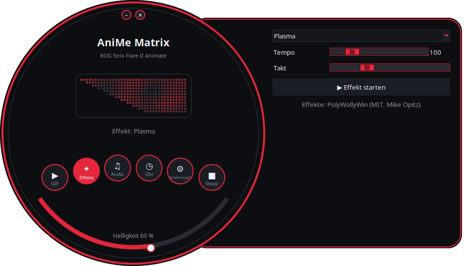
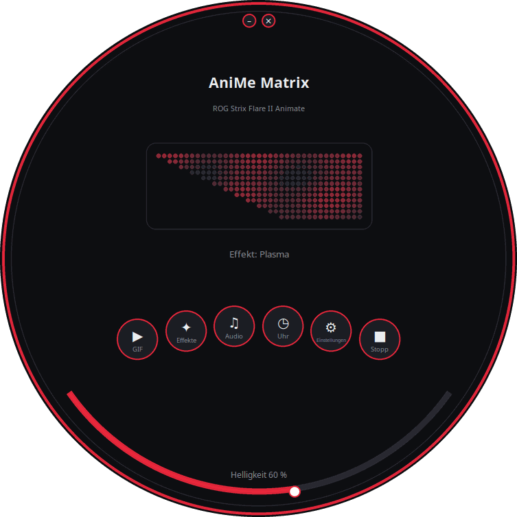
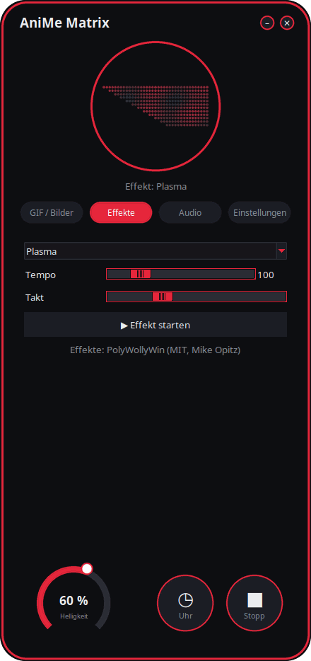
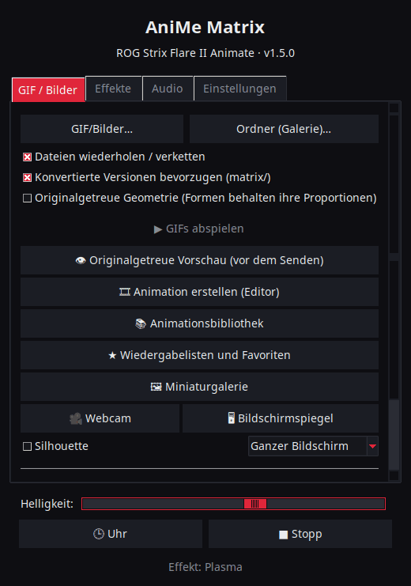

<p align="center">
  
</p>

# AniMe Matrix für Linux — ROG Strix Flare II Animate

[](https://github.com/AntiCitoyen/Anticitoyen-ROG-flare2-anime-matrix/releases/latest)
[](https://github.com/AntiCitoyen/Anticitoyen-ROG-flare2-anime-matrix/actions/workflows/ci.yml)
[](../../LICENSE)
[](https://buymeacoffee.com/anticitoyen)

Steuert unter Linux das **AniMe Matrix**-Display (312 Mini-LEDs) der Tastatur **ASUS ROG Strix Flare II Animate**, ganz ohne Armoury Crate oder Windows: GIFs und Galerie, Uhr, Effekte und Audio-Visualizer, Spiele, Systemmonitor, Desktop-Benachrichtigungen, Zeitplanung, Animationseditor, gemeinsame Bibliothek, synchronisierte Tastaturfarben.

<div align="center">

[🇫🇷 Français](../../README.md) · [🇬🇧 English](README.en.md) · [🇪🇸 Español](README.es.md) · **🇩🇪 Deutsch** · [🇮🇹 Italiano](README.it.md) · [🇧🇷 Português](README.pt-BR.md) · [🇳🇱 Nederlands](README.nl.md) · [🇵🇱 Polski](README.pl.md) · [🇷🇺 Русский](README.ru.md) · [🇺🇦 Українська](README.uk.md) · [🇹🇷 Türkçe](README.tr.md) · [🇸🇦 العربية](README.ar.md) · [🇮🇳 हिन्दी](README.hi.md) · [🇨🇳 简体中文](README.zh-CN.md) · [🇹🇼 繁體中文](README.zh-TW.md) · [🇯🇵 日本語](README.ja.md) · [🇰🇷 한국어](README.ko.md) · [🇻🇳 Tiếng Việt](README.vi.md) · [🇮🇩 Bahasa Indonesia](README.id.md)

</div>

<p align="center"><br><em>Drehrad + Schublade (Standardoberfläche)</em></p>

| Drehrad | Abgerundet | Klassisch |
|:---:|:---:|:---:|
|  |  |  |

<p align="center"></p>

---

## Inhaltsverzeichnis

- [Was das Projekt macht](#projet)
- [Unterstützte Hardware](#materiel)
- [Installation](#installation)
- [Verwendung](#utilisation)
- [Gute GIFs vorbereiten](#gif)
- [Funktionsweise](#fonctionnement)
- [Fehlerbehebung](#depannage)
- [Aufbau des Repositorys](#depot)
- [Die Pakete bauen](#deb)
- [Danksagungen](#credits)
- [Lizenz](#licence)
- [Projekt unterstützen](#soutien)

---

<a id="projet"></a>

## Was das Projekt macht

ASUS bietet das AniMe-Matrix-Display dieser Tastatur nur unter Windows (Armoury Crate) an. Dieses Projekt spricht die Tastatur direkt über USB-HID an und bringt:

**Anzeigen**
- **GIFs, Bilder und Videos**: eine Datei, eine Auswahl oder einen ganzen Ordner als Galerie, per Drag & Drop auf das Fenster; Videos (MP4, WebM, MKV…) über ffmpeg abgespielt; Miniaturgalerie; umgewandelte Frames im Cache (eine Galerie mit 400 GIFs läuft mit ~25 MB Speicher).
- **Uhr**: Zifferblatt digital, analog, binär, in Worten (Französisch, Englisch, Deutsch, Spanisch, Italienisch, Portugiesisch, Niederländisch) oder stilisiert.
- **Animierte Effekte** (Matrix-artiger Regen, Plasma, Feuer, Sterne, Feuerwerk, Blitze, Metaballs, Welle…) und **7 Audio-Visualizer**, die auf den vom PC wiedergegebenen Ton reagieren.
- **Text**: Ihre Nachricht, in allen Schriften (Akzente, Kyrillisch, Arabisch, Hindi, Chinesisch, Japanisch, Koreanisch…), nach links, rechts, oben, unten laufend oder fest.
- **Webcam** (Bild oder Silhouette) und **Bildschirmspiegel** (ganzer Bildschirm, um den Mauszeiger oder aktives Fenster).
- **Systemmonitor**: CPU, RAM, GPU, Temperatur, Netzwerkdurchsatz und Uhrzeit, als Anzeigen.
- **Aktueller Titel**: bei Titelwechsel läuft „KÜNSTLER - TITEL" einmal durch, danach ein Visualizer (Spotify, VLC, Rhythmbox, Browser… über MPRIS).
- **Desktop-Benachrichtigungen**: „APP: TITEL" wird als Einblendung angezeigt, danach läuft die Wiedergabe weiter (standardmäßig deaktiviert, Liste erlaubter Anwendungen).
- **Spielbare Spiele** auf der Tastatur: Snake, Pong (allein oder zu zweit), Tetris, Breakout, Invaders, Flappy, mit Highscores.
- **Anzeigen**: kleine Leuchtblöcke, wenn das Mikro stummgeschaltet oder in Benutzung ist, wenn die Webcam läuft, wenn OBS streamt oder aufnimmt.
- **Tastaturspeicher**: eine in der Tastatur gespeicherte Animation (GIF, Bild) läuft ohne Software, sobald die Tastatur angeschlossen ist, auch an einem anderen PC; Helligkeit einstellbar (Reiter GIF, `animematrix-ctl memoire`). Auch die 6 integrierten Animationen (KO, Meteorit, Auge, Love, Halloween, Start) lassen sich wählen: `animematrix-ctl clavier 1`…`6`.

**Erstellen**
- **Animationseditor** Bild für Bild, auf der echten Geometrie des Displays: 3 Stufen, Filmstreifen, Geisterebene, Versatz, Kopieren/Einfügen, Vorschau, Senden an die Tastatur, GIF-Export.
- **Gemeinsame Animationsbibliothek**: durchstöbern, abspielen, zur eigenen Galerie hinzufügen, eigene vorschlagen.
- **Intelligente Umwandlung** von GIFs: Zuschnitt aufs Motiv, helles Motiv auf schwarzem Hintergrund, verstärkte Konturen, 3 Stufen.
- **Originalgetreue Vorschau** vor dem Senden: simulierte Darstellung des Displays (reales Layout, Halo zwischen LEDs).
- **Effekte als Erweiterungen**: eine in einem Ordner abgelegte Python-Datei fügt einen Effekt hinzu (siehe [../EXTENSIONS.md](../EXTENSIONS.md)).

**Automatisieren**
- **`animematrixd`-Dienst**: alleiniger Besitzer des Displays, er zeigt weiter an, wenn der Starter geschlossen wird; Befehl `animematrix-ctl` und optionale lokale HTTP-API.
- **Zeitplanung**: Zeitfenster (Tage, einschließlich Nacht) mit Uhr, Galerie, Monitor, aktuellem Titel, einem Effekt, einer Wiedergabeliste oder ausgeschaltetem Display; schwarzes Display, wenn die Sitzung gesperrt ist, im Ruhezustand oder wenn eine Anwendung im Vollbildmodus läuft.
- **Profile pro Anwendung**: eigener Inhalt für ein Spiel oder eine Anwendung, solange sie im Vordergrund ist (Schaltfläche *Erkennen*).
- **Wiedergabelisten und Favoriten**: GIFs, Effekte, Uhr… jeweils für ihre Dauer, in Schleife; auch im Symbol in der Systemleiste und auf der Kommandozeile.
- **Web-Fernbedienung**: eine Seite, um das Display von einem Telefon im lokalen Netzwerk zu steuern (QR-Code, Token).
- **Ende langer Befehle**: im Terminal wird „Fertig: make 2 min 05" angezeigt, wenn ein langer Befehl endet.
- **Tastenfarben und -effekte**, ohne OpenRGB: Regenbogen, statisch, Atmen, Farbwechsel, reaktiv, Wellen, Sternennacht, Treibsand, Strömung, Regen — von der Tastatur ausgeführt und nach dem Abstecken behalten; oder die Themenfarbe, Pulsieren mit dem Bildschirm.
- **Symbol in der Systemleiste**: Schnellmenü (Modi, Helligkeit).

**Komfort**
- **4 Oberflächen** (*Drehrad + Schublade* standardmäßig, *Drehrad*, *Abgerundet*, *Klassisch*) mit **Live-Vorschau der 312 LEDs**, **11 Designs** (5 ROG, 5 in Rosa, System) und **19 Sprachen**.
- **X11 und Wayland**: Tastaturreaktion über evdev, aktives Fenster von Sway, Hyprland, KDE (kdotool) oder GNOME (Erweiterung *Window Calls*) gelesen.
- **Integrierte Updates**: Der Starter lädt das neueste Release herunter, prüft seine SHA-256-Prüfsumme und installiert es (Administratorpasswort); oder `apt upgrade` mit dem APT-Repository.

<a id="materiel"></a>

## Unterstützte Hardware

| Gerät | USB | Status |
|---|---|---|
| ASUS ROG Strix Flare II Animate | `0b05:19fc` | unterstützt (HID, Schnittstelle 4, Usage Page `0xFF02`) |
| AniMe-Matrix-Displays der ROG-Laptops (G14, G16…) | verschieden | **experimentell** über `asusctl`, nicht an echter Hardware getestet (siehe [Verwendung](#utilisation)) |

Getestet unter Ubuntu 26.04 (X11, PipeWire, Cinnamon). Jede Distribution mit Python ≥ 3.10, hidapi, Tk und systemd sollte funktionieren; unter Wayland läuft der Starter über XWayland.

<a id="installation"></a>

## Installation

### APT-Repository (Debian, Ubuntu, Mint, Pop!_OS…) — Updates mit `apt upgrade`

```bash
curl -fsSL https://anticitoyen.github.io/Anticitoyen-ROG-flare2-anime-matrix/animematrix.gpg \
  | sudo tee /usr/share/keyrings/animematrix.gpg >/dev/null
echo "deb [signed-by=/usr/share/keyrings/animematrix.gpg] https://anticitoyen.github.io/Anticitoyen-ROG-flare2-anime-matrix stable main" \
  | sudo tee /etc/apt/sources.list.d/animematrix.list
sudo apt update && sudo apt install anticitoyen-rog-flare2-anime-matrix
```

Danach **Tastatur ab- und wieder anstecken** (die udev-Regel gewährt dem angemeldeten Benutzer Zugriff) und **AniMe Matrix** über das Menü starten.

### Andere Formate (Seite [Releases](https://github.com/AntiCitoyen/Anticitoyen-ROG-flare2-anime-matrix/releases/latest))

| System | Datei | Installation |
|---|---|---|
| Debian, Ubuntu… | `anticitoyen-rog-flare2-anime-matrix_<version>_all.deb` | `sudo apt install ./anticitoyen-rog-flare2-anime-matrix_*_all.deb` |
| Fedora, openSUSE… | `anticitoyen-rog-flare2-anime-matrix-<version>-1.noarch.rpm` | `sudo dnf install ./anticitoyen-rog-flare2-anime-matrix-*.noarch.rpm` |
| Arch, Manjaro… | `anticitoyen-rog-flare2-anime-matrix-<version>-1-any.pkg.tar.zst` | `sudo pacman -U anticitoyen-rog-flare2-anime-matrix-*.pkg.tar.zst` |
| Alle (Flatpak) | `AniMeMatrix-<version>.flatpak` | `flatpak install --user AniMeMatrix-*.flatpak` (zusätzlich die udev-Regel unten installieren; keine Audio-Visualizer) |
| AUR | `aur-<version>.tar.gz` | PKGBUILD und .SRCINFO: `tar xf aur-*.tar.gz && cd anticitoyen-rog-flare2-anime-matrix && makepkg -si` |
| Copr | `anticitoyen-rog-flare2-anime-matrix-<version>-1.<fc>.src.rpm` | Quell-RPM: `rpmbuild --rebuild anticitoyen-rog-flare2-anime-matrix-*.src.rpm`, oder in ein Copr-Projekt hochladen |
| Flathub | `flathub-<version>.tar.gz` | Manifest auf diese Version festgelegt und `python3-modules.json`: Flathub-Einreichung oder `flatpak-builder` |
| Weblate | `translations-<version>.zip` | Übersetzungsdateien (`locale/*.json`, Basis `_source.json`) zum Import in Weblate |

Das Paket installiert:

| Element | Ort |
|---|---|
| Programme | `/usr/share/anticitoyen-rog-flare2-anime-matrix/` |
| Befehle | `animematrix`, `animematrixd`, `animematrix-ctl`, `animematrix-bascule`, `animematrix-animation`, `animematrix-apercu`, `animematrix-convertir`, `animematrix-effet`, `animematrix-galerie`, `animematrix-horloge`, `animematrix-dessin`, `animematrix-tray`, `animematrix-memoire` |
| Benutzerdienst | `/usr/lib/systemd/user/animematrixd.service` (für alle Sitzungen aktiviert) |
| udev-Regel | `/usr/lib/udev/rules.d/72-rog-flare2-animate.rules` |
| Menü und Symbol | `animematrix.desktop`, Symbol `animematrix` |

### Aus den Quellen

```bash
git clone https://github.com/AntiCitoyen/Anticitoyen-ROG-flare2-anime-matrix.git
cd Anticitoyen-ROG-flare2-anime-matrix
python3 -m venv .venv
.venv/bin/pip install hidapi pillow numpy pynput python-xlib
# Zugriff auf die Tastatur ohne root
sudo cp packaging/72-rog-flare2-animate.rules /etc/udev/rules.d/
sudo udevadm control --reload-rules && sudo udevadm trigger
# dann Tastatur ab- und wieder anstecken
.venv/bin/python rog_flare2_launcher.py
```

Nützliche Systemwerkzeuge: `imagemagick` (klassische Konvertierung), `pulseaudio-utils` (`parec`, für Audio), `zenity` (Dateiauswahl), `libnotify-bin` (Benachrichtigungen), `python3-gi` und `gir1.2-ayatanaappindicator3-0.1` (Symbol in der Systemleiste), `ffmpeg` (Videos, Webcam, Bildschirmspiegel), `python3-evdev` (Tastaturreaktion unter Wayland), `x11-utils` (aktives Fenster unter X11), `python3-qrcode` (QR-Code der Fernbedienung), `tkdnd` (Drag & Drop).

<a id="utilisation"></a>

## Verwendung

### Der Starter

`animematrix` (oder der Eintrag **AniMe Matrix** im Menü).

In den runden Oberflächen öffnen die runden Schaltflächen die Blöcke *GIF*, *Effekte*, *Audio* und *Einstellungen* (in der Schublade oder im Kreis); *Uhr* und *Stopp* wirken sofort; der untere Bogen regelt die Helligkeit; das Fenster wird durch Ziehen am Hintergrund verschoben; die kleinen Schaltflächen oben verkleinern oder schließen es. Die runde Form nutzt die X11-Erweiterung SHAPE (Paket `python3-xlib`); ohne sie wird dieselbe Oberfläche in einem rechteckigen Fenster angezeigt.

- **GIF / Bilder**: *GIF/Bilder…* oder *Ordner (Galerie)…* (oder Drag & Drop auf das Fenster); *Originalgetreue Geometrie* behält die Proportionen bei (die Ecke schneidet das Bild zu, statt es zu strecken); *👁 Originalgetreue Vorschau (vor dem Senden)* zeigt die Darstellung, ohne etwas zu senden; *🎞 Animation erstellen (Editor)*; *📚 Animationsbibliothek*; *★ Wiedergabelisten und Favoriten*; *🖼 Miniaturgalerie* (Klick: abspielen, Rechtsklick: Favorit); *🎥 Webcam* und *🖥 Bildschirmspiegel*; *Intelligente Umwandlung* zum Konvertieren von GIFs.
- **Effekte** und **Audio**: auswählen, einstellen, *▶ Effekt starten*. Die Regler wirken live; *Takt* beschleunigt oder verlangsamt die gesamte Animation. Der Effekt *Text* nimmt Ihre Nachricht und ihre Laufrichtung entgegen. Die Spiele werden mit den Pfeiltasten, Leertaste und Eingabetaste gespielt, wobei das Fenster des Starters im Vordergrund sein muss; Pong zu zweit: Z/W und S für den linken Spieler.
- **Helligkeit**, **🕒 Uhr**, **■ Stopp** (löscht das Display) sind allen Reitern gemeinsam.
- **Einstellungen**: Sitzungsstart (GIF-Galerie, Uhr, Letzte Wiedergabe oder Nichts), Zifferblatt, Sprache, Design, Oberfläche, Desktop-Benachrichtigungen, Tastaturfarben, *Zeitplan…* (Auslöser, Profile pro Anwendung, Zeitfenster), *Anzeigen…*, *Web-Fernbedienung…*, Symbol in der Systemleiste, Ende langer Befehle, Erweiterungsordner, Updates.

**Das Schließen des Starters unterbricht nichts**: Der `animematrixd`-Dienst zeigt weiter an. *■ Stopp* schaltet das Display aus.

### Dienst und Kommandozeile

```bash
animematrix-ctl etat                               # was gerade angezeigt wird
animematrix-ctl gif ~/Images/AniMe-Matrix --fidele # Galerie (Ordner oder Dateien)
animematrix-ctl effet "Plasma" --param speed=250   # Effekt und Einstellungen
animematrix-ctl horloge
animematrix-ctl texte "Bonjour"
animematrix-ctl effet "Text" --param message="Salut" --param direction=haut
animematrix-ctl liste "Soirée"                     # Wiedergabeliste (ohne Namen: zeigt sie an)
animematrix-ctl favori 2                           # Favorit Nr. 2 (ohne Nummer: zeigt sie an)
animematrix-ctl notifier "Café prêt" --duree 5     # Einblendung, danach zurück
animematrix-ctl memoire anim.gif                   # in der Tastatur gespeichert (höchstens 196 Bilder)
animematrix-ctl clavier                            # zeigt die gespeicherte Animation
animematrix-ctl luminosite 60
animematrix-ctl stop
```

| Befehl | Funktion |
|---|---|
| `animematrix-bascule [gif\|horloge\|lecture\|off\|etat]` | schaltet um (auch im Rechtsklickmenü des Symbols); der gewählte Modus gilt auch für den Sitzungsstart |
| `animematrixd --http 8765` | Dienst mit lokaler HTTP-API (`POST http://127.0.0.1:8765/api`, `Content-Type: application/json`, gleiches JSON wie das Socket) |
| `animematrix-animation [fichier.gif]` | Animationseditor |
| `animematrix-apercu fichier.gif -o apercu.gif` | originalgetreue Vorschau eines GIFs (Datei) |
| `animematrix-convertir dossier/ [--fidele] [--classique]` | konvertiert GIFs für die Matrix (nach `dossier/matrix/`) |
| `animematrix-effet --liste` | listet die Effekte und Visualizer auf |
| `animematrix-dessin` | LED-für-LED-Editor (übergibt beim Schließen die Kontrolle zurück an den Dienst) |

### Audio

Die Visualizer hören auf den **Monitor der Standard-Audioausgabe** mit `parec` (PipeWire oder PulseAudio): Sie reagieren auf das, was der PC wiedergibt, nicht auf das Mikrofon.

### Effekt „Keyboard React"

Er lässt das Display im Takt der Eingabe aufleuchten, solange der Effekt läuft: unter X11 über `pynput`, unter Wayland durch Lesen der Tastatur in `/dev/input` (`python3-evdev`). Bleibt der Effekt unter Wayland im Demomodus, das Lesen nur der ROG-Tastatur erlauben:

```bash
sudo cp /usr/share/anticitoyen-rog-flare2-anime-matrix/udev/73-rog-flare2-animate-touches.rules /etc/udev/rules.d/
sudo udevadm control --reload-rules && sudo udevadm trigger
```

### Anzeigen

*Einstellungen* → *Anzeigen (Mikro, Webcam, OBS)…*: ein Block aus 2 × 2 LEDs leuchtet oben links auf dem Display, über der Wiedergabe (1: Mikro stummgeschaltet oder in Benutzung, 2: Webcam in Benutzung, 3: OBS live oder bei der Aufnahme), und jede Änderung kann per Lauftext angekündigt werden. OBS: den WebSocket-Server aktivieren (*Werkzeuge* → *WebSocket-Server-Einstellungen*) und dessen Port und Passwort übernehmen.

### Web-Fernbedienung

*Einstellungen* → *Web-Fernbedienung…*: *Web-Fernbedienung aktivieren* ankreuzen, dann die Adresse auf einem Telefon im selben Netzwerk öffnen (oder den QR-Code scannen). Die Seite zeigt das Display live und bietet Uhr, Galerie, Effekte, Favoriten, Listen, Helligkeit und Nachricht. Die Adresse enthält ein Token: nicht weitergeben, mit *Neues Token* ändern; die Seite ist nicht verschlüsselt (HTTP): nur in vertrauenswürdigen Netzwerken.

### Ende langer Befehle

*Einstellungen* → *Ende langer Befehle anzeigen (Terminal)* fügt `~/.bashrc` (und `~/.zshrc`) eine Zeile hinzu: jeder Befehl, der länger als 30 Sekunden dauert, zeigt an seinem Ende „Fertig: make 2 min 05" oder „Fehlgeschlagen (2): …". Schwelle: `ANIMEMATRIX_FIN_SECONDES`; interaktive Befehle (Editoren, `ssh`, `less`…) werden ignoriert.

### Tastaturfarben

*Einstellungen* → *🌈 Tastaturfarben…*: Effekt (Regenbogen, statisch, Atmen, Farbwechsel, reaktiv, Wellen, Sternennacht, Treibsand, Strömung, Regen), Farben, Geschwindigkeit, Helligkeit, Richtung. *Ausprobieren* wendet ihn an, *In der Tastatur speichern* behält ihn nach dem Abstecken. *Themenfarbe* und *Pulsieren mit dem Bildschirm* sendet der Dienst Taste für Taste; beim Verlassen kehrt der gespeicherte Effekt zurück. Auf der Kommandozeile: `animematrix-ctl rgb arc-en-ciel --vitesse 70`, `animematrix-ctl rgb statique --couleur "#ff0000"`. Zwei weitere Software-Modi: *Bildschirmbild* (die Tasten zeigen den Bildschirm vergrößert) und *Audiospektrum* (ein Balken pro Spalte). Jedes Zeitfenster und jedes Anwendungsprofil kann auch eigene Tastenfarben wählen (*Zeitplan…*). *Taste für Taste*: eine Farbe pro Taste, mit der Maus auf einem Tastaturplan gemalt (AZERTY oder QWERTY).

### ROG-Laptops (experimentell)

`portable-asusctl` in `~/.config/rog-flare2/materiel` eintragen und den Dienst neu starten: Die Frames laufen über `asusctl anime image` (höchstens 5 Bilder pro Sekunde). Nicht an einem echten Laptop getestet: Rückmeldungen in den Tickets sind willkommen.

<a id="gif"></a>

## Gute GIFs vorbereiten

Das Display ist kein Rechteck: 24 versetzte Reihen, von 19 LEDs oben bis 7 unten (rechter Rand vertikal, linker Rand diagonal), 3 wirklich unterscheidbare Graustufen, ein Halo zwischen benachbarten LEDs. Silhouetten, Piktogramme, kurze Texte und langsame Bewegungen wirken gut; Fotos und Videos nicht.

Der vollständige Leitfaden (Canvas, Stufen, Bildrate, Konvertierung, originalgetreue Geometrie): **[../GUIDE-GIF.md](../GUIDE-GIF.md)**.

<a id="fonctionnement"></a>

## Funktionsweise

- **Transport**: hidapi öffnet die HID-Schnittstelle Nr. 4 der Tastatur und schreibt **1024-Byte**-Frames dorthin; die Tastatur sendet jeden Frame zurück.
- **Frame**: `60 81 00 00` + **312 Byte** (ein Helligkeitswert 0–255 pro LED, in Hardware-Reihenfolge) + Nullen bis 1024.
- **Geometrie**: 24 versetzte Reihen (Reihe r deckt die Spalten (r+1)//2 bis 18 ab), oder gleichwertig 12 logische Reihen mit 37 → 15 Spalten (Modell von PolyWollyWin); beide Zuordnungen wurden über alle 312 LEDs als identisch verifiziert.
- **Dienst**: `animematrixd` hält allein die Tastatur; Basiswiedergabe und Einblendung (Benachrichtigungen); JSON-Socket `$XDG_RUNTIME_DIR/animematrix.sock`; automatische Wiederverbindung der Tastatur.
- **Animation**: Der Host sendet die Frames nacheinander (~30 Bilder/s für Effekte); der interne Speicher der Tastatur wird nicht verwendet (Recherche: [../RECHERCHE-MEMOIRE.md](../RECHERCHE-MEMOIRE.md)).

Die ursprünglichen Reverse-Engineering-Notizen befinden sich in **[../PROTOCOL.md](../PROTOCOL.md)**; die `*.cap`-Mitschnitte und die Werkzeuge `parse_usbpcap.py` / `rog_flare2_replay_capture.py` verbleiben im Repository.

⚠️ Sendet nicht die Pakete der AniMe-Matrix-Displays von Laptops an die Tastatur (`0x5E …`, `0xEC …`): Das ist nicht das richtige Protokoll und kann die Tastatur blockieren (ab-/wieder anstecken, oder **Fn + Esc** 10–15 s gedrückt halten).

<a id="depannage"></a>

## Fehlerbehebung

| Symptom | Wahrscheinliche Ursache | Lösung |
|---|---|---|
| `interface 4 not found` | Tastatur nicht erkannt oder keine Rechte | `lsusb \| grep 0b05:19fc`; udev-Regel installiert? ab-/wieder anstecken |
| `Permission denied` / `open failed` | udev-Regel nicht angewendet | `sudo udevadm control --reload-rules && sudo udevadm trigger`, dann wieder anstecken |
| „Dienst animematrixd nicht erreichbar" | Dienst gestoppt | `systemctl --user restart animematrixd.service` oder `animematrixd &` |
| Das Display ändert sich nicht | ein anderes Programm schreibt auf die Tastatur | alte Skripte schließen; `animematrix-ctl etat` |
| Die Visualizer bleiben im Demo-Modus | kein `parec` oder kein Ton | `pulseaudio-utils` installieren, Ton abspielen |
| „Keyboard React" reagiert nicht | `pynput` (X11) oder `python3-evdev` (Wayland) fehlt, oder Tastatur nicht lesbar | Paket installieren; unter Wayland die udev-Regel aus [Keyboard React](#utilisation) |
| Webcam, Videos oder Bildschirmspiegel inaktiv | `ffmpeg` fehlt | `sudo apt install ffmpeg`; unter Wayland läuft der Bildschirmspiegel über das Portal (`gstreamer1.0-pipewire`) |
| Profile pro Anwendung oder Vollbild ohne Wirkung unter Wayland | aktives Fenster dem Compositor unbekannt | GNOME: Erweiterung *Window Calls*; KDE: `kdotool`; Sway und Hyprland: nichts zu tun |
| Das runde Fenster wird als Rechteck angezeigt | SHAPE-Erweiterung oder `python3-xlib` fehlt | `sudo apt install python3-xlib`, oder *Einstellungen* → *Oberfläche:* → *Klassisch* |
| Protokoll des Dienstes | — | `journalctl --user -u animematrixd.service -f` |

<a id="depot"></a>

## Aufbau des Repositorys

| Datei | Funktion |
|---|---|
| `rog_flare2_launcher.py` | grafischer Starter (Tk) |
| `rog_flare2_ui_ronde.py`, `rog_flare2_themes.py` | runde Oberflächen, Designs |
| `rog_flare2_i18n.py`, `locale/` | Übersetzung (19 Sprachen; `locale/_cles.json` = zu übersetzende Texte; [docs/TRADUIRE.md](../TRADUIRE.md)) |
| `rog_flare2_demon.py`, `rog_flare2_ctl.py` | `animematrixd`-Dienst, Client und Befehl `animematrix-ctl` |
| `rog_flare2_core.py` | gestreamte GIF-Wiedergabe, Frame-Cache, Uhr, Geometrie |
| `rog_flare2_texte.py`, `rog_flare2_horloges.py` | Text in allen Schriften, Effekt *Text*, Zifferblätter |
| `rog_flare2_listes.py`, `rog_flare2_vignettes.py` | Wiedergabelisten, Favoriten, Miniaturgalerie, Drag & Drop |
| `rog_flare2_video.py`, `rog_flare2_voyants.py`, `rog_flare2_telecommande.py` | Videos, Webcam, Bildschirmspiegel; Anzeigen; Web-Fernbedienung |
| `rog_flare2_touches.py`, `rog_flare2_fenetre.py`, `rog_flare2_fin.py`, `rog_flare2_flatpak.py` | Tasten und aktives Fenster (X11, Wayland), Ende langer Befehle, Flatpak |
| `rog_flare2_effets.py`, `polywollywin/` | Effekte und Visualizer (PolyWollyWin-Engine, MIT), Erweiterungen |
| `rog_flare2_infos.py`, `rog_flare2_mpris.py`, `rog_flare2_jeux.py` | Systemmonitor, aktueller Titel, Spiele |
| `rog_flare2_notifs.py`, `rog_flare2_programme.py`, `rog_flare2_ui_programme.py` | Benachrichtigungen, Zeitplanung und Auslöser |
| `rog_flare2_rgb.py`, `rog_flare2_tray.py`, `rog_flare2_portable.py` | Tastenfarben und -effekte, Symbol in der Systemleiste, Laptops (experimentell) |
| `rog_flare2_animation.py`, `rog_flare2_simulateur.py`, `rog_flare2_convertir.py` | Animationseditor, Simulator, Konvertierung |
| `rog_flare2_bibliotheque.py`, `bibliotheque/` | Animationsbibliothek (Katalog, CC0-GIFs) |
| `rog_flare2_maj.py` | Updates aus den Releases |
| `rog_flare2_matrix_paint.py`, `rog_flare2_clock_v3.py`, `rog_flare2_folder_player.py` | HID-Transport und LED-Editor, Uhr, Galerie (ursprüngliche Werkzeuge) |
| `parse_usbpcap.py`, `rog_flare2_replay_capture.py`, `*.cap` | Reverse Engineering |
| `examples/effets/` | Beispiel für eine Erweiterung |
| `tests/` | Tests (einschließlich Oberflächen über echte Klicks) |
| `systemd/`, `packaging/` | Benutzerdienst; .deb, RPM, Arch, Flatpak, APT-Repository |
| `docs/` | GIF-Leitfaden, Erweiterungen, Protokoll, Recherche, Screenshots, übersetzte READMEs |

<a id="deb"></a>

## Die Pakete bauen

```bash
packaging/build-deb.sh
# → dist/anticitoyen-rog-flare2-anime-matrix_<version>_all.deb
```

`packaging/install.sh` installiert das Projekt in einen beliebigen Verzeichnisbaum; es wird für das .deb, das RPM (`packaging/rpm/`), das Arch-Paket (`packaging/aur/`) und das Flatpak (`packaging/flathub/`) verwendet. Bei jedem veröffentlichten Release baut GitHub das RPM, das Arch-Paket und das Flatpak und aktualisiert das signierte APT-Repository. Die Version wird aus `rog_flare2_core.py` (`VERSION`) gelesen. Tests: `python -m pytest tests`.

<a id="credits"></a>

## Danksagungen

- **NicRoss512** — Reverse-Engineering des Protokolls, ursprüngliche Uhr und Editor: [ASUS-ROG-Strix-Flare-II-Animate-AniMe-Matrix-Protocol](https://github.com/NicRoss512/ASUS-ROG-Strix-Flare-II-Animate-AniMe-Matrix-Protocol). Dieses Repository geht daraus hervor; seine Historie bleibt erhalten.
- **Mike Opitz** — [PolyWollyWin](https://github.com/MikeOpitz99/PolyWollyWin) (MIT), Windows-Controller, dessen Effekt- und Audio-Visualizer-Engine hier wiederverwendet wird.
- **Yoshi Walsh** — [Mastering the AniMe Matrix](https://blog.yoshiwalsh.me/asus-anime-matrix/), für das LED-Verhalten (Halo, wahrgenommene Stufen, Bildrate).
- **asus-linux** — [asusctl](https://gitlab.com/asus-linux/asusctl), verwendet für die Displays der Laptops.

Unabhängiges Projekt, nicht mit ASUS verbunden. „ROG", „AniMe Matrix" und „Armoury Crate" sind Marken von ASUSTeK.

<a id="licence"></a>

## Lizenz

[MIT](../../LICENSE) für den Code dieses Repositorys; die Animationen aus `bibliotheque/` stehen unter CC0. `polywollywin/` bleibt unter der MIT-Lizenz seines Autors ([polywollywin/LICENSE](../../polywollywin/LICENSE)). Die Originaldateien von NicRoss512 (`rog_flare2_clock_v3.py`, `rog_flare2_matrix_paint.py`, `parse_usbpcap.py`, `rog_flare2_replay_capture.py`, `docs/PROTOCOL.md`, Mitschnitte) wurden ohne ausdrückliche Lizenz veröffentlicht und verbleiben bei ihrem Autor; sie werden mit Namensnennung weiterverbreitet.

<a id="soutien"></a>

## Projekt unterstützen

Wenn euch dieses Projekt nützt, hilft ein Kaffee bei der Pflege:

[](https://buymeacoffee.com/anticitoyen)

**https://buymeacoffee.com/anticitoyen** — der Link findet sich auch im Reiter *Einstellungen* des Starters.

Fehlermeldungen, Ideen und Animationen zum Teilen: [Issues](https://github.com/AntiCitoyen/Anticitoyen-ROG-flare2-anime-matrix/issues). Übersetzungen: [docs/TRADUIRE.md](../TRADUIRE.md).
