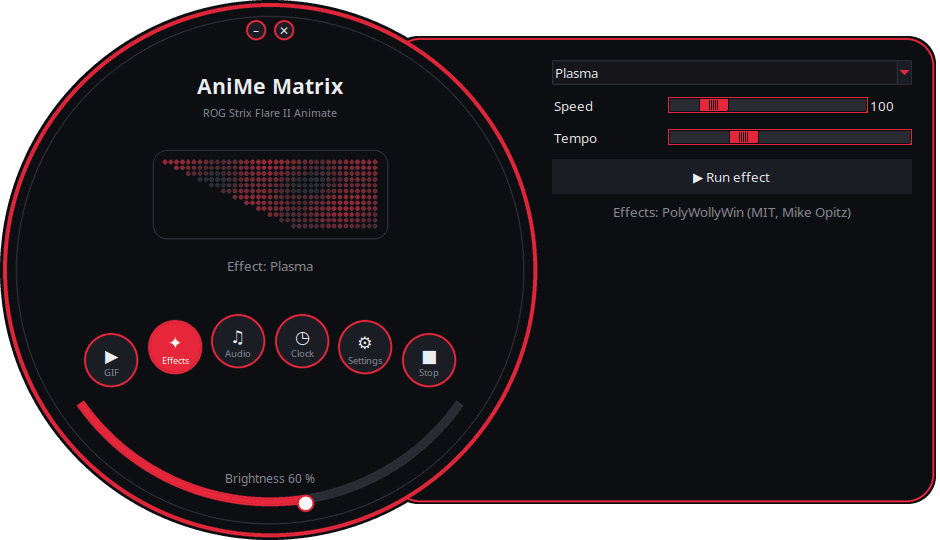
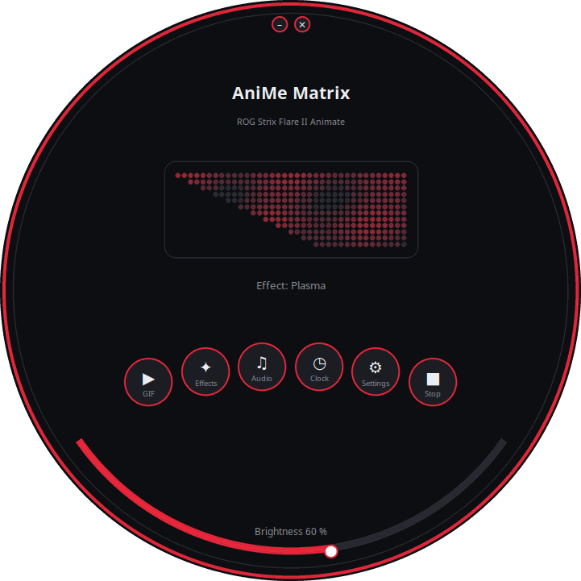
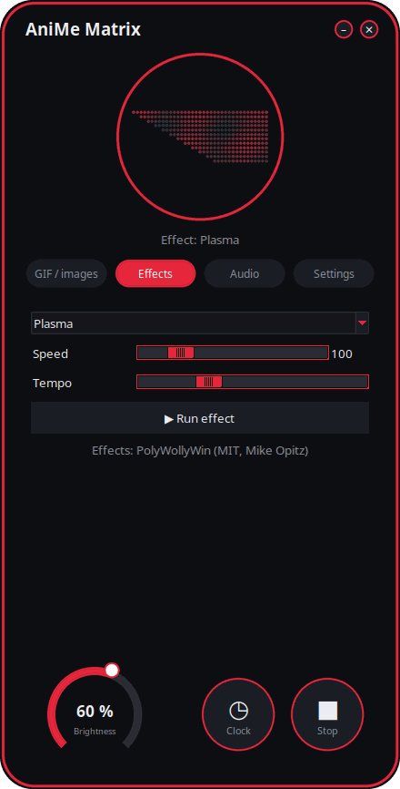
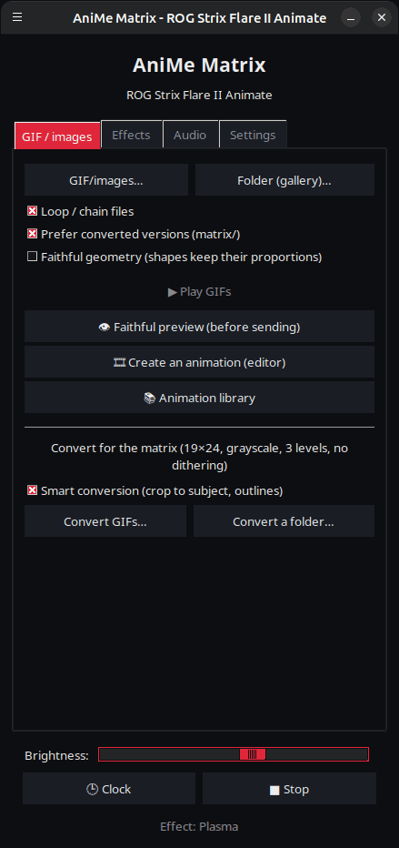

<p align="center">
  
</p>

# AniMe Matrix for Linux — ROG Strix Flare II Animate

[](https://github.com/AntiCitoyen/Anticitoyen-ROG-flare2-anime-matrix/releases/latest)
[](https://github.com/AntiCitoyen/Anticitoyen-ROG-flare2-anime-matrix/actions/workflows/ci.yml)
[](../../LICENSE)
[](https://buymeacoffee.com/anticitoyen)

Control the **AniMe Matrix** display (312 mini-LEDs) of the **ASUS ROG Strix Flare II Animate** keyboard on Linux, without Armoury Crate or Windows: GIFs and gallery, clock, effects and audio visualizers, games, system monitor, desktop notifications, scheduling, animation editor, shared library, synchronized keyboard colours.

<div align="center">

[🇫🇷 Français](../../README.md) · **🇬🇧 English** · [🇪🇸 Español](README.es.md) · [🇩🇪 Deutsch](README.de.md) · [🇮🇹 Italiano](README.it.md) · [🇧🇷 Português](README.pt-BR.md) · [🇳🇱 Nederlands](README.nl.md) · [🇵🇱 Polski](README.pl.md) · [🇷🇺 Русский](README.ru.md) · [🇺🇦 Українська](README.uk.md) · [🇹🇷 Türkçe](README.tr.md) · [🇸🇦 العربية](README.ar.md) · [🇮🇳 हिन्दी](README.hi.md) · [🇨🇳 简体中文](README.zh-CN.md) · [🇹🇼 繁體中文](README.zh-TW.md) · [🇯🇵 日本語](README.ja.md) · [🇰🇷 한국어](README.ko.md) · [🇻🇳 Tiếng Việt](README.vi.md) · [🇮🇩 Bahasa Indonesia](README.id.md)

</div>

<p align="center"><br><em>Dial + drawer (default interface)</em></p>

| Dial | Rounded | Classic |
|:---:|:---:|:---:|
|  |  |  |

<p align="center"></p>

---

## Table of contents

- [What the project does](#projet)
- [Supported hardware](#materiel)
- [Installation](#installation)
- [Usage](#utilisation)
- [Preparing good GIFs](#gif)
- [How it works](#fonctionnement)
- [Troubleshooting](#depannage)
- [Repository layout](#depot)
- [Building the packages](#deb)
- [Credits](#credits)
- [License](#licence)
- [Supporting the project](#soutien)

---

<a id="projet"></a>

## What the project does

ASUS only provides this keyboard's AniMe Matrix display on Windows (Armoury Crate). This project talks to the keyboard directly over USB HID and brings:

**Display**
- **GIFs and images**: a file, a selection or a whole folder as a gallery; streamed playback (a 400-GIF gallery fits in ~25 MB of memory).
- **Clock** HH:MM.
- **19 animated effects** (Matrix-style rain, plasma, fire, stars, fireworks, lightning, metaballs, wave, scrolling text…) and **7 audio visualizers** that react to the sound played by the PC.
- **System monitor**: CPU, RAM, GPU, temperature, network throughput and time, as gauges.
- **Now playing**: on track change, "ARTIST - TITLE" scrolls once, then a visualizer (Spotify, VLC, Rhythmbox, browsers… via MPRIS).
- **Desktop notifications**: "APP: TITLE" is shown as an overlay, then playback resumes (disabled by default, allow-list of applications).
- **Playable games** on the keyboard: Snake, Pong, Tetris, Breakout, with high scores.

**Create**
- **Animation editor**, frame by frame, on the screen's real geometry: 3 levels, filmstrip, ghost layer, offset, copy-paste, preview, send to keyboard, GIF export.
- **Shared animation library**: browse, play, add to your gallery, contribute your own.
- **Smart conversion** of GIFs: crop to subject, light subject on black background, reinforced outlines, 3 levels.
- **Faithful preview** before sending: simulated rendering of the screen (real layout, halo between LEDs).
- **Effects as extensions**: a Python file dropped into a folder adds an effect (see [../EXTENSIONS.md](../EXTENSIONS.md)).

**Automate**
- **`animematrixd` daemon**: sole owner of the display, it keeps displaying when the launcher is closed; `animematrix-ctl` command and optional local HTTP API.
- **Scheduling**: time slots (days, including night) with clock, gallery, monitor, now playing or screen off; blank screen when the session is locked, asleep, or when an application is fullscreen.
- **Keyboard colours via OpenRGB**: theme colour on the keys, or pulsing in sync with the display.
- **System tray icon**: quick menu (modes, brightness).

**Comfort**
- **4 interfaces** (*Dial + drawer* by default, *Dial*, *Rounded*, *Classic*) with **live preview of the 312 LEDs**, **11 themes** (5 ROG, 5 pink, system) and **19 languages**.
- **Built-in updates**: the launcher downloads the latest release, verifies its SHA-256 checksum and installs it (administrator password); or `apt upgrade` with the APT repository.

<a id="materiel"></a>

## Supported hardware

| Device | USB | Status |
|---|---|---|
| ASUS ROG Strix Flare II Animate | `0b05:19fc` | supported (HID, interface 4, usage page `0xFF02`) |
| AniMe Matrix displays on ROG laptops (G14, G16…) | various | **experimental** via `asusctl`, not tested on hardware (see [Usage](#utilisation)) |

Tested on Ubuntu 26.04 (X11, PipeWire, Cinnamon). Any distribution with Python ≥ 3.10, hidapi, Tk and systemd should work.

<a id="installation"></a>

## Installation

### APT repository (Debian, Ubuntu, Mint, Pop!_OS…) — updates via `apt upgrade`

```bash
curl -fsSL https://anticitoyen.github.io/Anticitoyen-ROG-flare2-anime-matrix/animematrix.gpg \
  | sudo tee /usr/share/keyrings/animematrix.gpg >/dev/null
echo "deb [signed-by=/usr/share/keyrings/animematrix.gpg] https://anticitoyen.github.io/Anticitoyen-ROG-flare2-anime-matrix stable main" \
  | sudo tee /etc/apt/sources.list.d/animematrix.list
sudo apt update && sudo apt install anticitoyen-rog-flare2-anime-matrix
```

Then **unplug and replug the keyboard** (the udev rule grants access to the logged-in user) and launch **AniMe Matrix** from the menu.

### Other formats (page [Releases](https://github.com/AntiCitoyen/Anticitoyen-ROG-flare2-anime-matrix/releases/latest))

| System | File | Installation |
|---|---|---|
| Debian, Ubuntu… | `anticitoyen-rog-flare2-anime-matrix_<version>_all.deb` | `sudo apt install ./anticitoyen-rog-flare2-anime-matrix_*_all.deb` |
| Fedora, openSUSE… | `anticitoyen-rog-flare2-anime-matrix-<version>-1.noarch.rpm` | `sudo dnf install ./anticitoyen-rog-flare2-anime-matrix-*.noarch.rpm` |
| Arch, Manjaro… | `anticitoyen-rog-flare2-anime-matrix-<version>-1-any.pkg.tar.zst` | `sudo pacman -U anticitoyen-rog-flare2-anime-matrix-*.pkg.tar.zst` |
| All (Flatpak) | `AniMeMatrix-<version>.flatpak` | `flatpak install --user AniMeMatrix-*.flatpak` (also install the udev rule below; no audio visualizers) |

The package installs:

| Item | Location |
|---|---|
| Programs | `/usr/share/anticitoyen-rog-flare2-anime-matrix/` |
| Commands | `animematrix`, `animematrixd`, `animematrix-ctl`, `animematrix-bascule`, `animematrix-animation`, `animematrix-apercu`, `animematrix-convertir`, `animematrix-effet`, `animematrix-galerie`, `animematrix-horloge`, `animematrix-dessin`, `animematrix-tray` |
| User service | `/usr/lib/systemd/user/animematrixd.service` (enabled for all sessions) |
| udev rule | `/usr/lib/udev/rules.d/72-rog-flare2-animate.rules` |
| Menu and icon | `animematrix.desktop`, `animematrix` icon |

### From source

```bash
git clone https://github.com/AntiCitoyen/Anticitoyen-ROG-flare2-anime-matrix.git
cd Anticitoyen-ROG-flare2-anime-matrix
python3 -m venv .venv
.venv/bin/pip install hidapi pillow numpy pynput python-xlib
# access to the keyboard without root
sudo cp packaging/72-rog-flare2-animate.rules /etc/udev/rules.d/
sudo udevadm control --reload-rules && sudo udevadm trigger
# then unplug/replug the keyboard
.venv/bin/python rog_flare2_launcher.py
```

Useful system tools: `imagemagick` (classic conversion), `pulseaudio-utils` (`parec`, for audio), `zenity` (file pickers), `libnotify-bin` (notifications), `python3-gi` and `gir1.2-ayatanaappindicator3-0.1` (system tray icon), `openrgb` (key colours).

<a id="utilisation"></a>

## Usage

### The launcher

`animematrix` (or the **AniMe Matrix** entry in the menu).

In the round interfaces, the round buttons open the *GIF*, *Effects*, *Audio* and *Settings* blocks (in the drawer or in the circle); *Clock* and *Stop* act immediately; the bottom arc sets the brightness; drag the window by its background to move it; the small buttons at the top minimize or close it. The round shape uses the X11 SHAPE extension (`python3-xlib` package); without it, the same interface is shown in a rectangular window.

- **GIF / images**: *GIF/images…* or *Folder (gallery)…*; *Faithful geometry* keeps the proportions (the corner crops the image instead of stretching it); *👁 Faithful preview (before sending)* shows the render without sending anything; *🎞 Create an animation (editor)*; *📚 Animation library*; *Smart conversion* to convert GIFs.
- **Effects** and **Audio**: choose, adjust, *▶ Run effect*. The sliders act live; *Tempo* speeds up or slows down the whole animation. Games are played with the arrow keys, Space and Enter, with the launcher window in the foreground.
- **Brightness**, **🕒 Clock**, **■ Stop** (which clears the screen) are common to all tabs.
- **Settings**: session start-up (GIF gallery, Clock, Last playback or None), language, theme, interface, desktop notifications, keyboard colours (OpenRGB), *Schedule…*, system tray icon, extensions folder, updates.

**Closing the launcher does not stop anything**: the `animematrixd` daemon keeps displaying. *■ Stop* turns off the screen.

### Daemon and command line

```bash
animematrix-ctl etat                               # what is displayed
animematrix-ctl gif ~/Images/AniMe-Matrix --fidele # gallery (folder or files)
animematrix-ctl effet "Plasma" --param speed=250   # effect and settings
animematrix-ctl horloge
animematrix-ctl texte "Bonjour"
animematrix-ctl notifier "Café prêt" --duree 5     # overlay then back
animematrix-ctl luminosite 60
animematrix-ctl stop
```

| Command | Role |
|---|---|
| `animematrix-bascule [gif\|horloge\|lecture\|off\|etat]` | toggle (also in the tray icon's right-click menu); the chosen mode is also used at session start |
| `animematrixd --http 8765` | daemon with a local HTTP API (`POST http://127.0.0.1:8765/api`, same JSON as the socket) |
| `animematrix-animation [fichier.gif]` | animation editor |
| `animematrix-apercu fichier.gif -o apercu.gif` | faithful preview of a GIF (file) |
| `animematrix-convertir dossier/ [--fidele] [--classique]` | converts GIFs for the matrix (into `dossier/matrix/`) |
| `animematrix-effet --liste` | lists the effects and visualizers |
| `animematrix-dessin` | LED-by-LED editor (hands control back to the daemon on close) |

### Audio

The visualizers listen to the **default audio output's monitor** using `parec` (PipeWire or PulseAudio): they react to what the PC is playing, not to the microphone.

### "Keyboard React" effect

It lights up the screen in time with your typing thanks to `pynput`, which reads keystrokes across the whole session while the effect is running. It works under X11; under Wayland, it does not receive keystrokes.

### Keyboard colours (OpenRGB)

*Settings* → *Keyboard colours (OpenRGB)*: theme colour or pulsing with the display. The daemon starts `openrgb --server` as needed. OpenRGB does not know the keyboard's previous lighting: to get back the effect stored in the keyboard, unplug it then replug it.

### ROG laptops (experimental)

Write `portable-asusctl` in `~/.config/rog-flare2/materiel` then restart the daemon: frames go through `asusctl anime image` (5 frames per second at most). Not tested on an actual laptop: feedback welcome in the issues.

<a id="gif"></a>

## Preparing good GIFs

The screen is not a rectangle: 24 staggered rows, from 19 LEDs at the top to 7 at the bottom (vertical right edge, diagonal left edge), 3 truly distinct grey levels, a halo between neighbouring LEDs. Silhouettes, pictograms, short text and slow motion render well; photos and videos do not.

The full guide (canvas, levels, frame rate, conversion, faithful geometry): **[../GUIDE-GIF.md](../GUIDE-GIF.md)**.

<a id="fonctionnement"></a>

## How it works

- **Transport**: hidapi opens the keyboard's HID interface #4 and writes **1024-byte** frames to it; the keyboard echoes each frame back.
- **Frame**: `60 81 00 00` + **312 bytes** (a 0–255 brightness value per LED, in hardware order) + zeros up to 1024.
- **Geometry**: 24 staggered rows (row r covers columns (r+1)//2 to 18), or equivalently 12 logical rows of 37 → 15 columns (PolyWollyWin's model); both mappings have been verified identical across the 312 LEDs.
- **Daemon**: `animematrixd` alone holds the keyboard; base playback and overlay (notifications); JSON socket `$XDG_RUNTIME_DIR/animematrix.sock`; automatic keyboard reconnection.
- **Animation**: the host sends frames one after another (~30 fps for effects); the keyboard's internal memory is not used (research: [../RECHERCHE-MEMOIRE.md](../RECHERCHE-MEMOIRE.md)).

The original reverse-engineering notes are in **[../PROTOCOL.md](../PROTOCOL.md)**; the `*.cap` captures and the `parse_usbpcap.py` / `rog_flare2_replay_capture.py` tools remain in the repository.

⚠️ Do not send the keyboard the packets used by laptop AniMe Matrix displays (`0x5E …`, `0xEC …`): that is the wrong protocol and it can lock up the keyboard (unplug/replug, or hold **Fn + Esc** for 10–15 s).

<a id="depannage"></a>

## Troubleshooting

| Symptom | Likely cause | Solution |
|---|---|---|
| `interface 4 not found` | keyboard not detected or no permissions | `lsusb \| grep 0b05:19fc`; is the udev rule installed? unplug/replug |
| `Permission denied` / `open failed` | udev rule not applied | `sudo udevadm control --reload-rules && sudo udevadm trigger`, then replug |
| "animematrixd service unreachable" | daemon stopped | `systemctl --user restart animematrixd.service` or `animematrixd &` |
| The screen does not change | another program is writing to the keyboard | close old scripts; `animematrix-ctl etat` |
| The visualizers stay in demo mode | no `parec` or no sound | install `pulseaudio-utils`, play some sound |
| "Keyboard React" does not respond | Wayland session or `pynput` missing | X11 session, `sudo apt install python3-pynput` |
| The round window shows as a rectangle | SHAPE extension or `python3-xlib` missing | `sudo apt install python3-xlib`, or *Settings* → *Interface:* → *Classic* |
| The keys stay one colour after OpenRGB | OpenRGB does not restore the keyboard's original lighting | unplug then replug the keyboard |
| Daemon log | — | `journalctl --user -u animematrixd.service -f` |

<a id="depot"></a>

## Repository layout

| File | Role |
|---|---|
| `rog_flare2_launcher.py` | graphical launcher (Tk) |
| `rog_flare2_ui_ronde.py`, `rog_flare2_themes.py` | round interfaces, themes |
| `rog_flare2_i18n.py`, `locale/` | translation (19 languages; `locale/_cles.json` = texts to translate) |
| `rog_flare2_demon.py`, `rog_flare2_ctl.py` | `animematrixd` daemon, client and `animematrix-ctl` command |
| `rog_flare2_core.py` | streamed GIF playback, clock, geometry |
| `rog_flare2_effets.py`, `polywollywin/` | effects and visualizers (PolyWollyWin engine, MIT), extensions |
| `rog_flare2_infos.py`, `rog_flare2_mpris.py`, `rog_flare2_jeux.py` | system monitor, now playing, games |
| `rog_flare2_notifs.py`, `rog_flare2_programme.py`, `rog_flare2_ui_programme.py` | notifications, scheduling and triggers |
| `rog_flare2_openrgb.py`, `rog_flare2_tray.py`, `rog_flare2_portable.py` | colours via OpenRGB, system tray icon, laptops (experimental) |
| `rog_flare2_animation.py`, `rog_flare2_simulateur.py`, `rog_flare2_convertir.py` | animation editor, simulator, conversion |
| `rog_flare2_bibliotheque.py`, `bibliotheque/` | animation library (catalogue, CC0 GIFs) |
| `rog_flare2_maj.py` | updates from releases |
| `rog_flare2_matrix_paint.py`, `rog_flare2_clock_v3.py`, `rog_flare2_folder_player.py` | HID transport and LED editor, clock, gallery (original tools) |
| `parse_usbpcap.py`, `rog_flare2_replay_capture.py`, `*.cap` | reverse engineering |
| `examples/effets/` | extension example |
| `tests/` | tests (including interfaces via real clicks) |
| `systemd/`, `packaging/` | user service; .deb, RPM, Arch, Flatpak, APT repository |
| `docs/` | GIF guide, extensions, protocol, research, screenshots, translated READMEs |

<a id="deb"></a>

## Building the packages

```bash
packaging/build-deb.sh
# → dist/anticitoyen-rog-flare2-anime-matrix_<version>_all.deb
```

`packaging/install.sh` installs the project into any directory tree; it is used by the .deb, the RPM (`packaging/rpm/`), the Arch package (`packaging/aur/`) and the Flatpak (`packaging/flatpak/`). On every published release, GitHub builds the RPM, the Arch package and the Flatpak, and updates the signed APT repository. The version is read from `rog_flare2_core.py` (`VERSION`). Tests: `python -m pytest tests`.

<a id="credits"></a>

## Credits

- **NicRoss512** — protocol reverse engineering, original clock and editor: [ASUS-ROG-Strix-Flare-II-Animate-AniMe-Matrix-Protocol](https://github.com/NicRoss512/ASUS-ROG-Strix-Flare-II-Animate-AniMe-Matrix-Protocol). This repository is forked from it; its history is preserved.
- **Mike Opitz** — [PolyWollyWin](https://github.com/MikeOpitz99/PolyWollyWin) (MIT), the Windows controller whose effects and audio-visualizer engine is reused here.
- **Yoshi Walsh** — [Mastering the AniMe Matrix](https://blog.yoshiwalsh.me/asus-anime-matrix/), for LED behaviour (halo, perceived levels, frame rate).
- **asus-linux** — [asusctl](https://gitlab.com/asus-linux/asusctl), used for laptop displays.

Independent project, not affiliated with ASUS. "ROG", "AniMe Matrix" and "Armoury Crate" are trademarks of ASUSTeK.

<a id="licence"></a>

## License

[MIT](../../LICENSE) for the code in this repository; animations in `bibliotheque/` are under CC0. `polywollywin/` remains under its author's MIT licence ([polywollywin/LICENSE](../../polywollywin/LICENSE)). NicRoss512's original files (`rog_flare2_clock_v3.py`, `rog_flare2_matrix_paint.py`, `parse_usbpcap.py`, `rog_flare2_replay_capture.py`, `docs/PROTOCOL.md`, captures) were published without an explicit licence and remain their author's; they are redistributed with attribution.

<a id="soutien"></a>

## Supporting the project

If this project is useful to you, a coffee helps keep it going:

[](https://buymeacoffee.com/anticitoyen)

**https://buymeacoffee.com/anticitoyen** — the link is also in the launcher's *Settings* tab.

Bug reports, ideas and animations to share: [Issues](https://github.com/AntiCitoyen/Anticitoyen-ROG-flare2-anime-matrix/issues).
