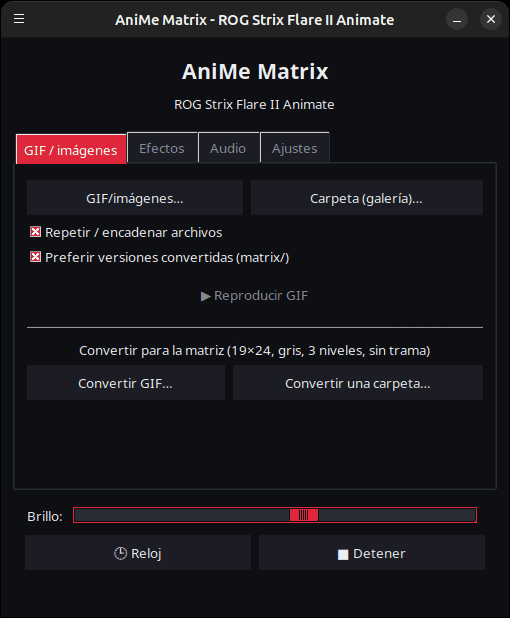
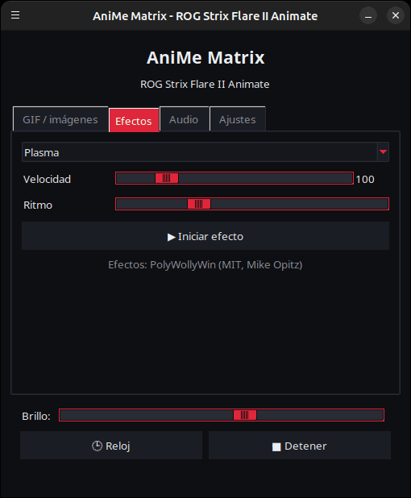
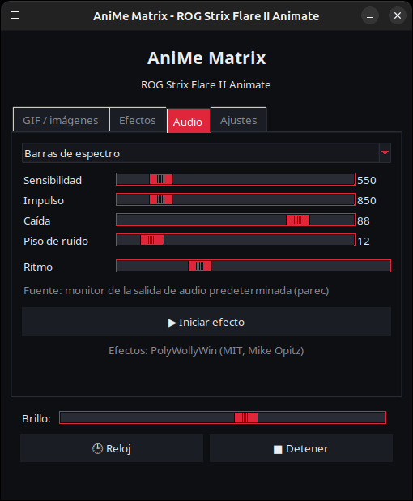
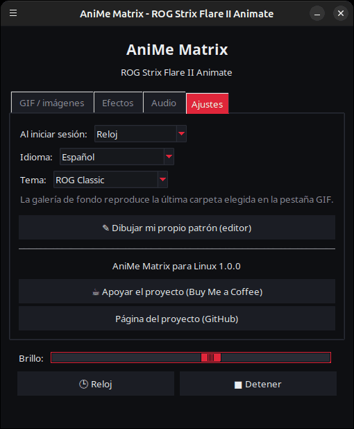

<p align="center">
  
</p>

# AniMe Matrix para Linux — ROG Strix Flare II Animate

[](https://github.com/AntiCitoyen/Anticitoyen-ROG-flare2-anime-matrix/releases/latest)
[](../../LICENSE)
[](https://buymeacoffee.com/anticitoyen)

Controla en Linux la pantalla **AniMe Matrix** (312 mini-LED) del teclado **ASUS ROG Strix Flare II Animate**, sin Armoury Crate ni Windows: GIF e imágenes, galería de fondo, reloj, 19 efectos animados, 7 visualizadores de audio, dibujo LED por LED.

La interfaz gráfica de la aplicación está disponible en 19 idiomas y sigue automáticamente el idioma del sistema; se puede cambiar en la pestaña **Ajustes** (**Idioma:**).

<div align="center">

[🇫🇷 Français](../../README.md) · [🇬🇧 English](README.en.md) · **🇪🇸 Español** · [🇩🇪 Deutsch](README.de.md) · [🇮🇹 Italiano](README.it.md) · [🇧🇷 Português](README.pt-BR.md) · [🇳🇱 Nederlands](README.nl.md) · [🇵🇱 Polski](README.pl.md) · [🇷🇺 Русский](README.ru.md) · [🇺🇦 Українська](README.uk.md) · [🇹🇷 Türkçe](README.tr.md) · [🇸🇦 العربية](README.ar.md) · [🇮🇳 हिन्दी](README.hi.md) · [🇨🇳 简体中文](README.zh-CN.md) · [🇹🇼 繁體中文](README.zh-TW.md) · [🇯🇵 日本語](README.ja.md) · [🇰🇷 한국어](README.ko.md) · [🇻🇳 Tiếng Việt](README.vi.md) · [🇮🇩 Bahasa Indonesia](README.id.md)

</div>

| GIF / imágenes | Efectos | Audio | Ajustes |
|---|---|---|---|
|  |  |  |  |

<p align="center"></p>

---

## Índice

- [Qué hace el proyecto](#projet)
- [Hardware compatible](#materiel)
- [Instalación](#installation)
- [Uso](#utilisation)
- [Preparar buenos GIF](#gif)
- [Cómo funciona](#fonctionnement)
- [Solución de problemas](#depannage)
- [Organización del repositorio](#depot)
- [Compilar el paquete .deb](#deb)
- [Créditos](#credits)
- [Licencia](#licence)
- [Apoyar el proyecto](#soutien)

---

<a id="projet"></a>

## Qué hace el proyecto

ASUS solo ofrece la pantalla AniMe Matrix de este teclado en Windows (Armoury Crate). Este proyecto habla directamente con el teclado por USB HID y aporta:

- **Un lanzador gráfico** (`animematrix`) con cuatro pestañas:
  - **GIF / imágenes**: reproducir uno o varios archivos, o una carpeta entera como galería, en bucle; convertir GIF para la matriz.
  - **Efectos**: 19 animaciones (lluvia estilo Matrix, plasma, fuego, estrellas, fuegos artificiales, rayos, metaballs, ola, serpiente, texto en movimiento, reloj estilizado, reacción al teclado…), ajustables mientras se ejecutan.
  - **Audio**: 7 visualizadores que reaccionan al sonido reproducido por el PC (espectro, KITT/KARR, starburst, osciloscopio, fuego de audio…).
  - **Ajustes**: qué se muestra al iniciar sesión, editor de dibujo, enlaces del proyecto.
- **Un reloj** HH:MM, desde el lanzador o como servicio en segundo plano.
- **Una galería de fondo**: un servicio `systemd --user` que recorre una carpeta de GIF nada más abrir sesión.
- **Un alternador de un clic** (`animematrix-bascule`): el icono de la bandeja enciende o apaga la pantalla; el clic derecho permite elegir Galería GIF, Reloj o Apagar.
- **Una conversión de GIF adaptada a la matriz** (`animematrix-convertir`): 19×24, escala de grises, 3 niveles, sin tramado — ver [../GUIDE-GIF.md](../GUIDE-GIF.md).
- **Un editor de dibujo** LED por LED (`animematrix-dessin`).
- **11 temas**: 5 inspirados en ROG (Classic, Strix, Glitch, Gold, Carbon), 5 rosas (Sakura, Chicle, Oro rosa, Rosa lavanda, Noche rosa) y el del sistema, a elegir en *Ajustes* → *Tema:*.
- **Bajo consumo**: los GIF se decodifican imagen a imagen; una galería de 400 GIF funciona con ~25 MB de memoria.

<a id="materiel"></a>

## Hardware compatible

| Teclado | USB | Interfaz |
|---|---|---|
| ASUS ROG Strix Flare II Animate | `0b05:19fc` | HID, interfaz 4 (usage page `0xFF02`) |

Las pantallas AniMe Matrix de los **portátiles** ROG (Zephyrus G14, etc.) usan otro protocolo: **no** están soportadas aquí (ver `asusctl` en su lugar).

Probado en Ubuntu 26.04 (X11, PipeWire). Cualquier distribución con Python ≥ 3.10, hidapi, Tk y systemd debería funcionar.

<a id="installation"></a>

## Instalación

### Paquete .deb (Debian, Ubuntu, Mint, Pop!_OS…)

1. Descargar `anticitoyen-rog-flare2-anime-matrix_<version>_all.deb` desde la página de [Releases](https://github.com/AntiCitoyen/Anticitoyen-ROG-flare2-anime-matrix/releases/latest).
2. Instalarlo (apt resuelve las dependencias):
   ```bash
   sudo apt install ./anticitoyen-rog-flare2-anime-matrix_*_all.deb
   ```
3. **Desconectar y volver a conectar el teclado** (la regla udev concede acceso al usuario conectado).
4. Lanzar **AniMe Matrix** desde el menú de aplicaciones, o `animematrix` en una terminal.

El paquete instala:

| Elemento | Ubicación |
|---|---|
| Programas | `/usr/share/anticitoyen-rog-flare2-anime-matrix/` |
| Comandos | `animematrix`, `animematrix-bascule`, `animematrix-effet`, `animematrix-galerie`, `animematrix-horloge`, `animematrix-convertir`, `animematrix-dessin` |
| Servicios de usuario | `/usr/lib/systemd/user/animematrix-galerie.service`, `animematrix-horloge.service` (no activados por defecto) |
| Regla udev | `/usr/lib/udev/rules.d/72-rog-flare2-animate.rules` |
| Menú e icono | `animematrix.desktop`, icono `animematrix` |

Desinstalación: `sudo apt remove anticitoyen-rog-flare2-anime-matrix`.

### Desde las fuentes

```bash
git clone https://github.com/AntiCitoyen/Anticitoyen-ROG-flare2-anime-matrix.git
cd Anticitoyen-ROG-flare2-anime-matrix
python3 -m venv .venv
.venv/bin/pip install hidapi pillow numpy pynput
# acceso al teclado sin root
sudo cp packaging/72-rog-flare2-animate.rules /etc/udev/rules.d/
sudo udevadm control --reload-rules && sudo udevadm trigger
# luego desconectar/reconectar el teclado
.venv/bin/python rog_flare2_launcher.py
```

Herramientas del sistema útiles: `imagemagick` (conversión), `pulseaudio-utils` (`parec`, para el audio), `zenity` (selectores de archivos), `libnotify-bin` (notificaciones del alternador).

Para los servicios en segundo plano ejecutando desde las fuentes, copiar `systemd/*.service` en `~/.config/systemd/user/` sustituyendo las líneas `ExecStart=` por la ruta de `.venv/bin/python` y del script (`rog_flare2_folder_player.py`, `rog_flare2_clock_v3.py`), y luego `systemctl --user daemon-reload`.

<a id="utilisation"></a>

## Uso

### El lanzador

`animematrix` (o la entrada **AniMe Matrix** del menú).

- **GIF / imágenes**: *GIF/imágenes…* para una selección, *Carpeta (galería)…* para una carpeta entera. La carpeta elegida también se convierte en la de la galería de fondo. *Preferir versiones convertidas* lee `dossier/matrix/nom.gif` cuando existe (generado por la conversión).
- **Efectos** y **Audio**: elegir, ajustar, *▶ Iniciar efecto*. Los deslizadores actúan en vivo; *Ritmo* acelera o ralentiza la animación.
- **Brillo**, **🕒 Reloj**, **■ Detener** (que borra la pantalla) son comunes a todas las pestañas.
- **Ajustes**: *Al iniciar sesión* = Galería GIF, Reloj o Ninguno.

Mientras muestra algo, el lanzador pausa el servicio en segundo plano (solo un programa puede escribir en el teclado) y lo reinicia al cerrarse.

### Alternador y servicios en segundo plano

```bash
animematrix-bascule            # allumé → éteint ; éteint → dernier mode
animematrix-bascule gif        # galerie de fond, aussi au démarrage de session
animematrix-bascule horloge    # horloge de fond, aussi au démarrage de session
animematrix-bascule off        # éteint, rien au démarrage
animematrix-bascule etat       # mode courant
```

Las mismas opciones están en el clic derecho del icono de la bandeja. Por debajo: `systemctl --user enable --now animematrix-galerie.service` (o `animematrix-horloge.service`).

### En línea de comandos

| Comando | Función |
|---|---|
| `animematrix-effet --liste` | lista los efectos y visualizadores |
| `animematrix-effet "Plasma" --brightness 60 --vitesse 1.5` | lanza un efecto (Ctrl+C para detener) |
| `animematrix-galerie [dossier] --brightness 60 [--originaux]` | recorre una carpeta (por defecto la última elegida en el lanzador, si no `~/Images/AniMe-Matrix`) |
| `animematrix-horloge -b 25` | reloj; `--clear` borra la pantalla, `--once --text 12:34` muestra un texto |
| `animematrix-convertir dossier/ [--sortie D] [--force]` | convierte GIF para la matriz (en `dossier/matrix/`) |
| `animematrix-dessin` | editor de dibujo |

### Audio

Los visualizadores escuchan el **monitor de la salida de sonido predeterminada** con `parec` (PipeWire o PulseAudio): reaccionan a lo que reproduce el PC, no al micrófono. Para cambiar de salida, cambiar la salida predeterminada del sistema.

### Efecto «Keyboard React»

Enciende la pantalla al ritmo de la escritura gracias a `pynput`, que lee las teclas de toda la sesión mientras el efecto está activo. Funciona en X11; en Wayland no recibe las teclas.

<a id="gif"></a>

## Preparar buenos GIF

La pantalla no es un rectángulo: 24 filas escalonadas, de 19 LED arriba a 7 abajo, 3 niveles de gris realmente distintos, un halo entre LED vecinos. Las siluetas, pictogramas, textos cortos y movimientos lentos quedan bien; las fotos y vídeos, no.

La guía completa (tamaño de lienzo, niveles, cadencia, brillo, comando de ImageMagick): **[../GUIDE-GIF.md](../GUIDE-GIF.md)**.

<a id="fonctionnement"></a>

## Cómo funciona

- **Transporte**: hidapi abre la interfaz HID nº 4 del teclado y escribe tramas de **1024 bytes**.
- **Trama**: `60 81 00 00` + **312 bytes** (un valor de brillo 0–255 por LED, en el orden del hardware) + ceros hasta 1024.
- **Geometría**: 24 filas escalonadas en diagonal (19 → 7 LED), o de forma equivalente 12 filas lógicas de 37 → 15 columnas (modelo de PolyWollyWin); ambas correspondencias se han verificado idénticas en las 312 LED.
- **GIF**: cada imagen se recompone (los GIF optimizados solo almacenan las diferencias), se pasa a gris, se reduce a 24 filas y se muestrea fila por fila.
- **Animación**: no se usa memoria embebida; la animación consiste en que el host envía las tramas una tras otra (~30 i/s para los efectos).

Las notas originales de ingeniería inversa (capturas USBPcap, orden de las LED, puntos de calibración) están en **[../PROTOCOL.md](../PROTOCOL.md)**; las capturas `*.cap` y las herramientas `parse_usbpcap.py` / `rog_flare2_replay_capture.py` permanecen en el repositorio para quien quiera profundizar.

⚠️ No envíes al teclado los paquetes de las pantallas AniMe Matrix de portátiles (`0x5E …`, `0xEC …`): no es el protocolo correcto y puede bloquear el teclado (desconectar/reconectar, o mantener pulsado **Fn + Esc** 10–15 s).

<a id="depannage"></a>

## Solución de problemas

| Síntoma | Causa probable | Solución |
|---|---|---|
| `interface 4 not found` | teclado no detectado o sin permisos | `lsusb \| grep 0b05:19fc`; ¿regla udev instalada? desconectar/reconectar |
| `Permission denied` / `open failed` | regla udev no aplicada | `sudo udevadm control --reload-rules && sudo udevadm trigger`, luego reconectar |
| La pantalla no cambia | otro programa ya está escribiendo | `animematrix-bascule off`, cerrar otros lanzadores o scripts |
| Los visualizadores se quedan en modo demo | falta `parec` o no hay sonido | instalar `pulseaudio-utils`, reproducir sonido |
| «Keyboard React» no reacciona | sesión Wayland o falta `pynput` | sesión X11, `sudo apt install python3-pynput` |
| La galería de fondo no arranca | carpeta vacía o ausente | elegir una carpeta en el lanzador (pestaña GIF) |
| Registro de un servicio | — | `journalctl --user -u animematrix-galerie.service -f` |

<a id="depot"></a>

## Organización del repositorio

| Archivo | Función |
|---|---|
| `rog_flare2_launcher.py` | lanzador gráfico (Tk) |
| `rog_flare2_effets.py` | efectos y visualizadores de audio (motor de PolyWollyWin adaptado a Linux) |
| `polywollywin/` | motor de efectos de PolyWollyWin, copiado sin modificar (MIT) |
| `rog_flare2_folder_player.py` | galería de fondo (servicio) |
| `rog_flare2_clock_v3.py` | reloj (servicio) |
| `rog_flare2_bascule.sh` | alternador galería / reloj / apagado |
| `rog_flare2_convertir.py` | conversión de GIF (ImageMagick) |
| `rog_flare2_matrix_paint.py` | transporte HID, orden de las LED, editor de dibujo |
| `parse_usbpcap.py`, `rog_flare2_replay_capture.py`, `*.cap` | herramientas y capturas de ingeniería inversa |
| `systemd/` | servicios de usuario |
| `packaging/` | regla udev, entrada de menú, icono, archivos y script del paquete .deb |
| `docs/` | guía de GIF, notas de protocolo, capturas de pantalla |

<a id="deb"></a>

## Compilar el paquete .deb

```bash
packaging/build-deb.sh
# → dist/anticitoyen-rog-flare2-anime-matrix_<version>_all.deb
```

Solo se necesitan `dpkg-deb` y `bash`; la versión se lee en `rog_flare2_launcher.py` (`VERSION`).

<a id="credits"></a>

## Créditos

- **NicRoss512** — ingeniería inversa del protocolo, reloj y editor originales: [ASUS-ROG-Strix-Flare-II-Animate-AniMe-Matrix-Protocol](https://github.com/NicRoss512/ASUS-ROG-Strix-Flare-II-Animate-AniMe-Matrix-Protocol). Este repositorio parte de ahí; se conserva su historial.
- **Mike Opitz** — [PolyWollyWin](https://github.com/MikeOpitz99/PolyWollyWin) (MIT), controlador de Windows cuyo motor de efectos y visualizadores de audio se reutiliza aquí.
- **Yoshi Walsh** — [Mastering the AniMe Matrix](https://blog.yoshiwalsh.me/asus-anime-matrix/), por el comportamiento de las LED (halo, niveles percibidos, cadencia).

Proyecto independiente, no afiliado a ASUS. «ROG», «AniMe Matrix» y «Armoury Crate» son marcas de ASUSTeK.

<a id="licence"></a>

## Licencia

[MIT](../../LICENSE) para el código de este repositorio. `polywollywin/` sigue bajo la licencia MIT de su autor ([polywollywin/LICENSE](../../polywollywin/LICENSE)). Los archivos originales de NicRoss512 (`rog_flare2_clock_v3.py`, `rog_flare2_matrix_paint.py`, `parse_usbpcap.py`, `rog_flare2_replay_capture.py`, `docs/PROTOCOL.md`, capturas) se publicaron sin licencia explícita y siguen siendo de su autor; se redistribuyen con atribución.

<a id="soutien"></a>

## Apoyar el proyecto

Si este proyecto te resulta útil, un café ayuda a mantenerlo:

[](https://buymeacoffee.com/anticitoyen)

**https://buymeacoffee.com/anticitoyen** — el enlace también está en la pestaña *Ajustes* del lanzador.

Informes de errores e ideas: [Issues](https://github.com/AntiCitoyen/Anticitoyen-ROG-flare2-anime-matrix/issues).
