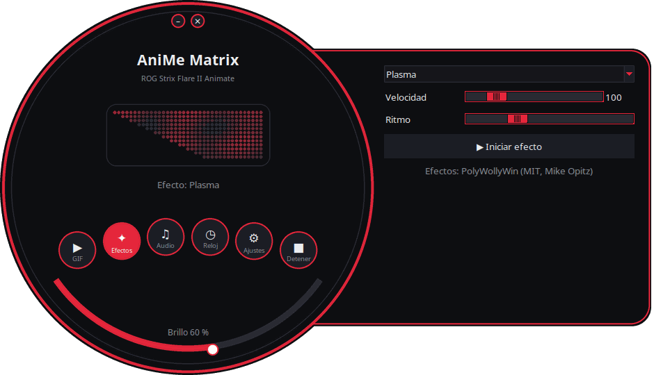
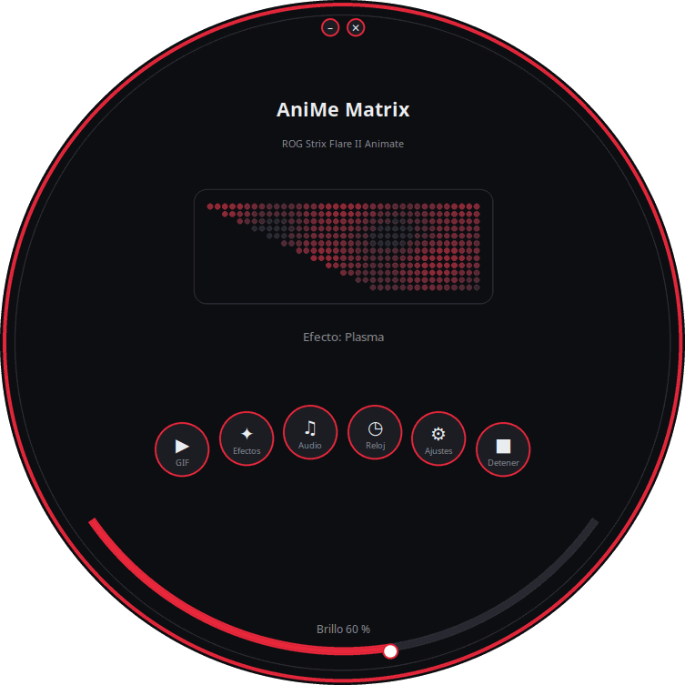
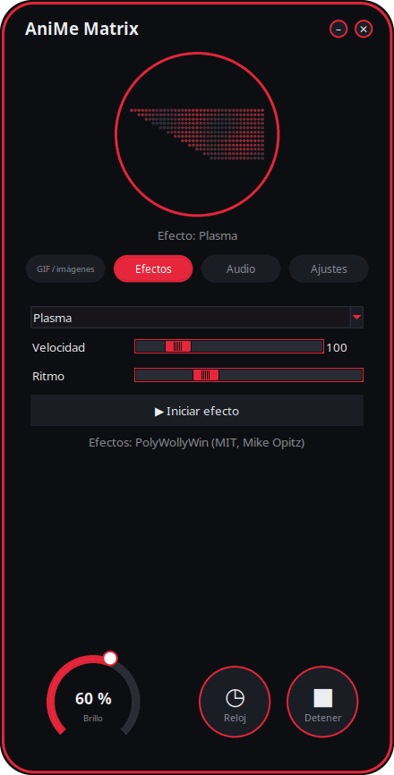
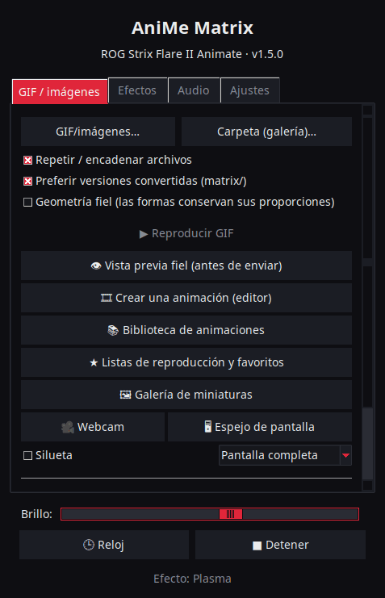

<p align="center">
  
</p>

# AniMe Matrix para Linux — ROG Strix Flare II Animate

[](https://github.com/AntiCitoyen/Anticitoyen-ROG-flare2-anime-matrix/releases/latest)
[](https://github.com/AntiCitoyen/Anticitoyen-ROG-flare2-anime-matrix/actions/workflows/ci.yml)
[](../../LICENSE)
[](https://buymeacoffee.com/anticitoyen)

Controla en Linux la pantalla **AniMe Matrix** (312 mini-LED) del teclado **ASUS ROG Strix Flare II Animate**, sin Armoury Crate ni Windows: GIF y galería, reloj, efectos y visualizadores de audio, juegos, monitor del sistema, notificaciones del escritorio, programación horaria, editor de animación, biblioteca compartida, colores del teclado sincronizados.

<div align="center">

[🇫🇷 Français](../../README.md) · [🇬🇧 English](README.en.md) · **🇪🇸 Español** · [🇩🇪 Deutsch](README.de.md) · [🇮🇹 Italiano](README.it.md) · [🇧🇷 Português](README.pt-BR.md) · [🇳🇱 Nederlands](README.nl.md) · [🇵🇱 Polski](README.pl.md) · [🇷🇺 Русский](README.ru.md) · [🇺🇦 Українська](README.uk.md) · [🇹🇷 Türkçe](README.tr.md) · [🇸🇦 العربية](README.ar.md) · [🇮🇳 हिन्दी](README.hi.md) · [🇨🇳 简体中文](README.zh-CN.md) · [🇹🇼 繁體中文](README.zh-TW.md) · [🇯🇵 日本語](README.ja.md) · [🇰🇷 한국어](README.ko.md) · [🇻🇳 Tiếng Việt](README.vi.md) · [🇮🇩 Bahasa Indonesia](README.id.md)

</div>

<p align="center"><br><em>Dial + cajón (interfaz predeterminada)</em></p>

| Dial | Redondeada | Clásica |
|:---:|:---:|:---:|
|  |  |  |

<p align="center"></p>

---

## Índice

- [Qué hace el proyecto](#projet)
- [Hardware compatible](#materiel)
- [Instalación](#installation)
- [Uso](#utilisation)
- [Preparar buenos GIF](#gif)
- [Cómo funciona](#fonctionnement)
- [Solución de problemas](#depannage)
- [Organización del repositorio](#depot)
- [Compilar los paquetes](#deb)
- [Créditos](#credits)
- [Licencia](#licence)
- [Apoyar el proyecto](#soutien)

---

<a id="projet"></a>

## Qué hace el proyecto

ASUS solo ofrece la pantalla AniMe Matrix de este teclado en Windows (Armoury Crate). Este proyecto habla directamente con el teclado por USB HID y aporta:

**Mostrar**
- **GIF, imágenes y vídeos**: un archivo, una selección o una carpeta entera como galería, arrastrando y soltando sobre la ventana; vídeos (MP4, WebM, MKV…) reproducidos con ffmpeg; galería de miniaturas; fotogramas convertidos guardados en caché (una galería de 400 GIF cabe en ~25 MB de memoria).
- **Reloj**: esfera digital, analógica, binaria, en palabras (francés, inglés, alemán, español, italiano, portugués, neerlandés) o estilizada.
- **Efectos animados** (lluvia estilo Matrix, plasma, fuego, estrellas, fuegos artificiales, rayos, metaballs, ola…) y **7 visualizadores de audio** que reaccionan al sonido reproducido por el PC.
- **Texto**: su mensaje, en todas las escrituras (acentos, cirílico, árabe, hindi, chino, japonés, coreano…), desplazándose hacia la izquierda, la derecha, arriba, abajo, o fijo.
- **Webcam** (imagen o silueta) y **espejo de pantalla** (pantalla entera, alrededor del ratón o ventana activa).
- **Monitor del sistema**: CPU, RAM, GPU, temperatura, tráfico de red y hora, en indicadores.
- **Canción en curso**: al cambiar de pista, «ARTISTA - TÍTULO» se desplaza una vez, y después un visualizador (Spotify, VLC, Rhythmbox, navegadores… vía MPRIS).
- **Notificaciones del escritorio**: «APP: TÍTULO» se muestra en superposición y luego la reproducción continúa (desactivado por defecto, lista de aplicaciones permitidas).
- **Juegos jugables** con el teclado: Snake, Pong (solo o a dos), Tetris, rompecabezas, Invaders, Flappy, con récords.
- **Indicadores**: pequeños bloques luminosos cuando el micro está silenciado o en uso, cuando la webcam está activa, cuando OBS emite o graba.
- **Memoria del teclado**: una animación (GIF, imagen) guardada en el teclado se muestra sin ningún software, nada más conectarlo, incluso en otro PC; brillo ajustable (pestaña GIF, `animematrix-ctl memoire`). También se pueden elegir las 6 animaciones integradas (KO, Meteorito, Ojo, Love, Halloween, Arranque): `animematrix-ctl clavier 1`…`6`.

**Crear**
- **Editor de animación** fotograma a fotograma, sobre la geometría real de la pantalla: 3 niveles, tira de fotogramas, capa fantasma, desplazamiento, copiar y pegar, vista previa, envío al teclado, exportación a GIF.
- **Biblioteca de animaciones** compartida: explorar, reproducir, añadir a tu galería, proponer las tuyas.
- **Conversión inteligente** de GIF: recorte al motivo, motivo claro sobre fondo negro, contornos reforzados, 3 niveles.
- **Vista previa fiel** antes de enviar: renderizado simulado de la pantalla (disposición real, halo entre LED).
- **Efectos como extensiones**: un archivo Python colocado en una carpeta añade un efecto (ver [../EXTENSIONS.md](../EXTENSIONS.md)).

**Automatizar**
- **Demonio `animematrixd`**: único propietario de la pantalla, sigue mostrando contenido cuando se cierra el lanzador; comando `animematrix-ctl` y API HTTP local opcional.
- **Programación horaria**: franjas (días, incluida la noche) con reloj, galería, monitor, canción en curso, un efecto, una lista de reproducción o pantalla apagada; pantalla en negro cuando la sesión está bloqueada, en reposo o cuando una aplicación está en pantalla completa.
- **Perfiles por aplicación**: un contenido propio de un juego o de una aplicación mientras está en primer plano (botón *Detectar*).
- **Listas de reproducción y favoritos**: GIF, efectos, reloj… cada uno durante su duración, en bucle; también en el icono de la bandeja del sistema y en la línea de comandos.
- **Mando web**: una página para controlar la pantalla desde un teléfono de la red local (código QR, token).
- **Fin de comandos largos**: en la terminal, «Terminado: make 2 min 05» se muestra cuando termina un comando largo.
- **Colores y efectos de las teclas**, sin OpenRGB: arcoíris, estático, respiración, ciclo, reactivo, ondulación, noche estrellada, arenas movedizas, corriente, lluvia — ejecutados por el teclado y conservados al desconectarlo; o el color del tema, pulso con la pantalla.
- **Icono de la bandeja del sistema**: menú rápido (modos, brillo).

**Comodidad**
- **4 interfaces** (*Dial + cajón* por defecto, *Dial*, *Redondeada*, *Clásica*) con **vista previa en directo de los 312 LED**, **11 temas** (5 ROG, 5 rosas, sistema) y **19 idiomas**.
- **X11 y Wayland**: reacción al teclado por evdev, ventana activa obtenida de Sway, Hyprland, KDE (kdotool) o GNOME (extensión *Window Calls*).
- **Actualizaciones integradas**: el lanzador descarga la última release, verifica su suma SHA-256 y la instala (contraseña de administrador); o `apt upgrade` con el repositorio APT.

<a id="materiel"></a>

## Hardware compatible

| Dispositivo | USB | Estado |
|---|---|---|
| ASUS ROG Strix Flare II Animate | `0b05:19fc` | compatible (HID, interfaz 4, usage page `0xFF02`) |
| Pantallas AniMe Matrix de los portátiles ROG (G14, G16…) | varios | **experimental** vía `asusctl`, no probado en hardware real (ver [Uso](#utilisation)) |

Probado en Ubuntu 26.04 (X11, PipeWire, Cinnamon). Cualquier distribución con Python ≥ 3.10, hidapi, Tk y systemd debería funcionar; en Wayland, el lanzador pasa por XWayland.

<a id="installation"></a>

## Instalación

### Repositorio APT (Debian, Ubuntu, Mint, Pop!_OS…) — actualizaciones con `apt upgrade`

```bash
curl -fsSL https://anticitoyen.github.io/Anticitoyen-ROG-flare2-anime-matrix/animematrix.gpg \
  | sudo tee /usr/share/keyrings/animematrix.gpg >/dev/null
echo "deb [signed-by=/usr/share/keyrings/animematrix.gpg] https://anticitoyen.github.io/Anticitoyen-ROG-flare2-anime-matrix stable main" \
  | sudo tee /etc/apt/sources.list.d/animematrix.list
sudo apt update && sudo apt install anticitoyen-rog-flare2-anime-matrix
```

Después **desconectar y volver a conectar el teclado** (la regla udev concede acceso al usuario conectado) y lanzar **AniMe Matrix** desde el menú.

### Otros formatos (página de [Releases](https://github.com/AntiCitoyen/Anticitoyen-ROG-flare2-anime-matrix/releases/latest))

| Sistema | Archivo | Instalación |
|---|---|---|
| Debian, Ubuntu… | `anticitoyen-rog-flare2-anime-matrix_<version>_all.deb` | `sudo apt install ./anticitoyen-rog-flare2-anime-matrix_*_all.deb` |
| Fedora, openSUSE… | `anticitoyen-rog-flare2-anime-matrix-<version>-1.noarch.rpm` | `sudo dnf install ./anticitoyen-rog-flare2-anime-matrix-*.noarch.rpm` |
| Arch, Manjaro… | `anticitoyen-rog-flare2-anime-matrix-<version>-1-any.pkg.tar.zst` | `sudo pacman -U anticitoyen-rog-flare2-anime-matrix-*.pkg.tar.zst` |
| Todos (Flatpak) | `AniMeMatrix-<version>.flatpak` | `flatpak install --user AniMeMatrix-*.flatpak` (instalar también la regla udev de abajo; sin visualizadores de audio) |
| AUR | `aur-<version>.tar.gz` | PKGBUILD y .SRCINFO: `tar xf aur-*.tar.gz && cd anticitoyen-rog-flare2-anime-matrix && makepkg -si` |
| Copr | `anticitoyen-rog-flare2-anime-matrix-<version>-1.<fc>.src.rpm` | RPM fuente: `rpmbuild --rebuild anticitoyen-rog-flare2-anime-matrix-*.src.rpm`, o subirlo a un proyecto Copr |
| Flathub | `flathub-<version>.tar.gz` | manifiesto fijado a esta versión y `python3-modules.json`: envío a Flathub o `flatpak-builder` |
| Weblate | `translations-<version>.zip` | archivos de traducción (`locale/*.json`, base `_source.json`) para importar en Weblate |

El paquete instala:

| Elemento | Ubicación |
|---|---|
| Programas | `/usr/share/anticitoyen-rog-flare2-anime-matrix/` |
| Comandos | `animematrix`, `animematrixd`, `animematrix-ctl`, `animematrix-bascule`, `animematrix-animation`, `animematrix-apercu`, `animematrix-convertir`, `animematrix-effet`, `animematrix-galerie`, `animematrix-horloge`, `animematrix-dessin`, `animematrix-tray`, `animematrix-memoire` |
| Servicio de usuario | `/usr/lib/systemd/user/animematrixd.service` (activado para todas las sesiones) |
| Regla udev | `/usr/lib/udev/rules.d/72-rog-flare2-animate.rules` |
| Menú e icono | `animematrix.desktop`, icono `animematrix` |

### Desde las fuentes

```bash
git clone https://github.com/AntiCitoyen/Anticitoyen-ROG-flare2-anime-matrix.git
cd Anticitoyen-ROG-flare2-anime-matrix
python3 -m venv .venv
.venv/bin/pip install hidapi pillow numpy pynput python-xlib
# acceso al teclado sin root
sudo cp packaging/72-rog-flare2-animate.rules /etc/udev/rules.d/
sudo udevadm control --reload-rules && sudo udevadm trigger
# luego desconectar/reconectar el teclado
.venv/bin/python rog_flare2_launcher.py
```

Herramientas del sistema útiles: `imagemagick` (conversión clásica), `pulseaudio-utils` (`parec`, para el audio), `zenity` (selectores de archivos), `libnotify-bin` (notificaciones), `python3-gi` y `gir1.2-ayatanaappindicator3-0.1` (icono de la bandeja del sistema), `ffmpeg` (vídeos, webcam, espejo de pantalla), `python3-evdev` (reacción al teclado en Wayland), `x11-utils` (ventana activa en X11), `python3-qrcode` (código QR del mando), `tkdnd` (arrastrar y soltar).

<a id="utilisation"></a>

## Uso

### El lanzador

`animematrix` (o la entrada **AniMe Matrix** del menú).

En las interfaces redondas, los botones redondos abren los bloques *GIF*, *Efectos*, *Audio* y *Ajustes* (en el cajón o en el círculo); *Reloj* y *Detener* actúan de inmediato; el arco inferior ajusta el brillo; la ventana se mueve arrastrándola por el fondo; los pequeños botones de arriba minimizan o cierran. La forma redonda usa la extensión X11 SHAPE (paquete `python3-xlib`); sin ella, la misma interfaz se muestra en una ventana rectangular.

- **GIF / imágenes**: *GIF/imágenes…* o *Carpeta (galería)…* (o arrastrar y soltar sobre la ventana); *Geometría fiel* conserva las proporciones (la esquina recorta la imagen en lugar de estirarla); *👁 Vista previa fiel (antes de enviar)* muestra el renderizado sin enviar nada; *🎞 Crear una animación (editor)*; *📚 Biblioteca de animaciones*; *★ Listas de reproducción y favoritos*; *🖼 Galería de miniaturas* (clic: reproducir, clic derecho: favorito); *🎥 Webcam* y *🖥 Espejo de pantalla*; *Conversión inteligente* para convertir GIF.
- **Efectos** y **Audio**: elegir, ajustar, *▶ Iniciar efecto*. Los deslizadores actúan en vivo; *Ritmo* acelera o ralentiza toda la animación. El efecto *Texto* toma su mensaje y su dirección de desplazamiento. Los juegos se juegan con las flechas, Espacio e Intro, con la ventana del lanzador en primer plano; Pong a dos: Z/W y S para el jugador de la izquierda.
- **Brillo**, **🕒 Reloj**, **■ Detener** (que borra la pantalla) son comunes a todas las pestañas.
- **Ajustes**: inicio de sesión (Galería GIF, Reloj, Última reproducción o Ninguno), esfera del reloj, idioma, tema, interfaz, notificaciones del escritorio, colores del teclado, *Programación…* (disparadores, perfiles por aplicación, franjas horarias), *Indicadores…*, *Mando web…*, icono de la bandeja del sistema, fin de comandos largos, carpeta de extensiones, actualizaciones.

**Cerrar el lanzador no interrumpe nada**: el demonio `animematrixd` sigue mostrando contenido. *■ Detener* apaga la pantalla.

### Demonio y línea de comandos

```bash
animematrix-ctl etat                               # qué se muestra
animematrix-ctl gif ~/Images/AniMe-Matrix --fidele # galería (carpeta o archivos)
animematrix-ctl effet "Plasma" --param speed=250   # efecto y ajustes
animematrix-ctl horloge
animematrix-ctl texte "Bonjour"
animematrix-ctl effet "Text" --param message="Salut" --param direction=haut
animematrix-ctl liste "Soirée"                     # lista de reproducción (sin nombre: las muestra)
animematrix-ctl favori 2                           # favorito n.º 2 (sin número: los muestra)
animematrix-ctl notifier "Café prêt" --duree 5     # superposición y vuelta
animematrix-ctl memoire anim.gif                   # guardada en el teclado (196 imágenes como máximo)
animematrix-ctl clavier                            # muestra la animación guardada
animematrix-ctl luminosite 60
animematrix-ctl stop
```

| Comando | Función |
|---|---|
| `animematrix-bascule [gif\|horloge\|lecture\|off\|etat]` | alterna (también en el clic derecho del icono de la bandeja); el modo elegido es también el del inicio de sesión |
| `animematrixd --http 8765` | demonio con API HTTP local (`POST http://127.0.0.1:8765/api`, `Content-Type: application/json`, mismo JSON que el socket) |
| `animematrix-animation [fichier.gif]` | editor de animación |
| `animematrix-apercu fichier.gif -o apercu.gif` | vista previa fiel de un GIF (archivo) |
| `animematrix-convertir dossier/ [--fidele] [--classique]` | convierte GIF para la matriz (en `dossier/matrix/`) |
| `animematrix-effet --liste` | lista los efectos y visualizadores |
| `animematrix-dessin` | editor LED por LED (devuelve el control al demonio al cerrarse) |
| `animematrix-ctl sauvegarde reglages.zip`, `animematrix-ctl restaurer reglages.zip` | exporta o restaura todos los ajustes (también en *Ajustes*); sin el token ni la contraseña de OBS, salvo `--secrets` |

### Audio

Los visualizadores escuchan el **monitor de la salida de sonido predeterminada** con `parec` (PipeWire o PulseAudio): reaccionan a lo que reproduce el PC, no al micrófono.

### Efecto «Keyboard React»

Enciende la pantalla al ritmo de la escritura, mientras el efecto está activo: en X11 mediante `pynput`, en Wayland leyendo el teclado en `/dev/input` (`python3-evdev`). En Wayland, si el efecto se queda en modo demo, autorizar la lectura solo del teclado ROG:

```bash
sudo cp /usr/share/anticitoyen-rog-flare2-anime-matrix/udev/73-rog-flare2-animate-touches.rules /etc/udev/rules.d/
sudo udevadm control --reload-rules && sudo udevadm trigger
```

### Indicadores

*Ajustes* → *Indicadores (micro, webcam, OBS)…*: un bloque de 2 × 2 LED se enciende arriba a la izquierda de la pantalla, por encima de la reproducción (1: micro silenciado o en uso, 2: webcam en uso, 3: OBS en directo o grabando), y cada cambio puede anunciarse con un texto desplazable. OBS: activar el servidor WebSocket (*Herramientas* → *Ajustes del servidor WebSocket*) y copiar su puerto y su contraseña.

### Mando web

*Ajustes* → *Mando web…*: marcar *Activar el mando web* y luego abrir la dirección (o escanear el código QR) en un teléfono de la misma red. La página muestra la pantalla en directo y ofrece reloj, galería, efectos, favoritos, listas, brillo y mensaje. La dirección contiene un token: no la comparta, cámbiela con *Nuevo token*; la página no está cifrada (HTTP): solo en una red de confianza.

### Fin de comandos largos

*Ajustes* → *Mostrar el fin de comandos largos (terminal)* añade una línea a `~/.bashrc` (y `~/.zshrc`): todo comando de más de 30 segundos muestra al terminar «Terminado: make 2 min 05» o «Fallo (2): …». Umbral: `ANIMEMATRIX_FIN_SECONDES`; los comandos interactivos (editores, `ssh`, `less`…) se ignoran.

### Colores del teclado

*Ajustes* → *🌈 Colores del teclado…*: efecto (arcoíris, estático, respiración, ciclo de colores, reactivo, ondulación, noche estrellada, arenas movedizas, corriente, lluvia), colores, velocidad, brillo, dirección. *Probar* lo aplica, *Guardar en el teclado* lo conserva al desconectarlo. *Color del tema* y *Pulso con la pantalla* los envía el demonio tecla por tecla; al salir de ellos, vuelve el efecto guardado. En la línea de comandos: `animematrix-ctl rgb arc-en-ciel --vitesse 70`, `animematrix-ctl rgb statique --couleur "#ff0000"`. Dos modos de software más: *Imagen de la pantalla* (las teclas reproducen la pantalla, ampliada) y *Espectro de audio* (una barra por columna). Cada franja horaria y cada perfil de aplicación también puede elegir sus colores de teclas (*Programación…*). *Tecla por tecla*: un color por tecla, pintado con el ratón sobre el plano del teclado (AZERTY o QWERTY). *Pulsación luminosa*: cada tecla pulsada se ilumina y luego se apaga. Los indicadores de micro, webcam y OBS también pueden encender F1, F2 y F3, y cada notificación hace destellar las teclas.

### Portátiles ROG (experimental)

Escribir `portable-asusctl` en `~/.config/rog-flare2/materiel` y reiniciar el demonio: las tramas pasan por `asusctl anime image` (5 imágenes por segundo como máximo). No probado en un portátil real: los comentarios son bienvenidos en los tickets.

<a id="gif"></a>

## Preparar buenos GIF

La pantalla no es un rectángulo: 24 filas escalonadas, de 19 LED arriba a 7 abajo (borde derecho vertical, borde izquierdo en diagonal), 3 niveles de gris realmente distintos, un halo entre LED vecinos. Las siluetas, pictogramas, textos cortos y movimientos lentos quedan bien; las fotos y vídeos, no.

La guía completa (lienzo, niveles, cadencia, conversión, geometría fiel): **[../GUIDE-GIF.md](../GUIDE-GIF.md)**.

<a id="fonctionnement"></a>

## Cómo funciona

- **Transporte**: hidapi abre la interfaz HID nº 4 del teclado y escribe tramas de **1024 bytes**; el teclado devuelve cada trama.
- **Trama**: `60 81 00 00` + **312 bytes** (un valor de brillo 0–255 por LED, en el orden del hardware) + ceros hasta 1024.
- **Geometría**: 24 filas escalonadas (la fila r cubre las columnas (r+1)//2 a 18), o de forma equivalente 12 filas lógicas de 37 → 15 columnas (modelo de PolyWollyWin); ambas correspondencias se han verificado idénticas en las 312 LED.
- **Demonio**: `animematrixd` es el único que controla el teclado; reproducción base y superposición (notificaciones); socket JSON `$XDG_RUNTIME_DIR/animematrix.sock`; reconexión automática del teclado.
- **Animación**: el host envía las tramas una tras otra (~30 i/s para los efectos); no se usa la memoria interna del teclado (investigación: [../RECHERCHE-MEMOIRE.md](../RECHERCHE-MEMOIRE.md)).

Las notas originales de ingeniería inversa están en **[../PROTOCOL.md](../PROTOCOL.md)**; las capturas `*.cap` y las herramientas `parse_usbpcap.py` / `rog_flare2_replay_capture.py` permanecen en el repositorio.

⚠️ No envíes al teclado los paquetes de las pantallas AniMe Matrix de portátiles (`0x5E …`, `0xEC …`): no es el protocolo correcto y puede bloquear el teclado (desconectar/reconectar, o mantener pulsado **Fn + Esc** 10–15 s).

<a id="depannage"></a>

## Solución de problemas

| Síntoma | Causa probable | Solución |
|---|---|---|
| `interface 4 not found` | teclado no detectado o sin permisos | `lsusb \| grep 0b05:19fc`; ¿regla udev instalada? desconectar/reconectar |
| `Permission denied` / `open failed` | regla udev no aplicada | `sudo udevadm control --reload-rules && sudo udevadm trigger`, luego reconectar |
| «Servicio animematrixd inalcanzable» | demonio detenido | `systemctl --user restart animematrixd.service` o `animematrixd &` |
| La pantalla no cambia | otro programa escribe en el teclado | cerrar los scripts antiguos; `animematrix-ctl etat` |
| Los visualizadores se quedan en modo demo | falta `parec` o no hay sonido | instalar `pulseaudio-utils`, reproducir sonido |
| «Keyboard React» no reacciona | falta `pynput` (X11) o `python3-evdev` (Wayland), o teclado ilegible | instalar el paquete; en Wayland, la regla udev de [Keyboard React](#utilisation) |
| Webcam, vídeos o espejo de pantalla inactivos | falta `ffmpeg` | `sudo apt install ffmpeg`; en Wayland, el espejo de pantalla pasa por el portal (`gstreamer1.0-pipewire`) |
| Perfiles por aplicación o pantalla completa sin efecto en Wayland | ventana activa desconocida para el compositor | GNOME: extensión *Window Calls*; KDE: `kdotool`; Sway e Hyprland: nada que hacer |
| La ventana redonda se muestra como un rectángulo | falta la extensión SHAPE o `python3-xlib` | `sudo apt install python3-xlib`, o *Ajustes* → *Interfaz:* → *Clásica* |
| Registro del demonio | — | `journalctl --user -u animematrixd.service -f` |

<a id="depot"></a>

## Organización del repositorio

| Archivo | Función |
|---|---|
| `rog_flare2_launcher.py` | lanzador gráfico (Tk) |
| `rog_flare2_ui_ronde.py`, `rog_flare2_themes.py` | interfaces redondas, temas |
| `rog_flare2_i18n.py`, `locale/` | traducción (19 idiomas; `locale/_cles.json` = textos a traducir; [docs/TRADUIRE.md](../TRADUIRE.md)) |
| `rog_flare2_demon.py`, `rog_flare2_ctl.py` | demonio `animematrixd`, cliente y comando `animematrix-ctl` |
| `rog_flare2_core.py` | reproducción de GIF en flujo, caché de fotogramas, reloj, geometría |
| `rog_flare2_texte.py`, `rog_flare2_horloges.py` | texto en todas las escrituras, efecto *Texto*, esferas del reloj |
| `rog_flare2_listes.py`, `rog_flare2_vignettes.py` | listas de reproducción, favoritos, galería de miniaturas, arrastrar y soltar |
| `rog_flare2_video.py`, `rog_flare2_voyants.py`, `rog_flare2_telecommande.py` | vídeos, webcam, espejo de pantalla; indicadores; mando web |
| `rog_flare2_touches.py`, `rog_flare2_fenetre.py`, `rog_flare2_fin.py`, `rog_flare2_flatpak.py` | teclas y ventana activa (X11, Wayland), fin de comandos largos, Flatpak |
| `rog_flare2_effets.py`, `polywollywin/` | efectos y visualizadores (motor PolyWollyWin, MIT), extensiones |
| `rog_flare2_infos.py`, `rog_flare2_mpris.py`, `rog_flare2_jeux.py` | monitor del sistema, canción en curso, juegos |
| `rog_flare2_notifs.py`, `rog_flare2_programme.py`, `rog_flare2_ui_programme.py` | notificaciones, programación horaria y disparadores |
| `rog_flare2_rgb.py`, `rog_flare2_tray.py`, `rog_flare2_portable.py` | colores y efectos de las teclas, icono de la bandeja del sistema, portátiles (experimental) |
| `rog_flare2_animation.py`, `rog_flare2_simulateur.py`, `rog_flare2_convertir.py` | editor de animación, simulador, conversión |
| `rog_flare2_bibliotheque.py`, `bibliotheque/` | biblioteca de animaciones (catálogo, GIF CC0) |
| `rog_flare2_maj.py` | actualizaciones desde las releases |
| `rog_flare2_matrix_paint.py`, `rog_flare2_clock_v3.py`, `rog_flare2_folder_player.py` | transporte HID y editor LED, reloj, galería (herramientas originales) |
| `parse_usbpcap.py`, `rog_flare2_replay_capture.py`, `*.cap` | ingeniería inversa |
| `examples/effets/` | ejemplo de extensión |
| `tests/` | pruebas (incluidas interfaces con clics reales) |
| `systemd/`, `packaging/` | servicio de usuario; .deb, RPM, Arch, Flatpak, repositorio APT |
| `docs/` | guía de GIF, extensiones, protocolo, investigación, capturas de pantalla, README traducidos |

<a id="deb"></a>

## Compilar los paquetes

```bash
packaging/build-deb.sh
# → dist/anticitoyen-rog-flare2-anime-matrix_<version>_all.deb
```

`packaging/install.sh` instala el proyecto en cualquier árbol de directorios; se usa para el .deb, el RPM (`packaging/rpm/`), el paquete Arch (`packaging/aur/`) y el Flatpak (`packaging/flathub/`). En cada release publicada, GitHub compila el RPM, el paquete Arch y el Flatpak, y actualiza el repositorio APT firmado. La versión se lee en `rog_flare2_core.py` (`VERSION`). Pruebas: `python -m pytest tests`.

<a id="credits"></a>

## Créditos

- **NicRoss512** — ingeniería inversa del protocolo, reloj y editor originales: [ASUS-ROG-Strix-Flare-II-Animate-AniMe-Matrix-Protocol](https://github.com/NicRoss512/ASUS-ROG-Strix-Flare-II-Animate-AniMe-Matrix-Protocol). Este repositorio parte de ahí; se conserva su historial.
- **Mike Opitz** — [PolyWollyWin](https://github.com/MikeOpitz99/PolyWollyWin) (MIT), controlador de Windows cuyo motor de efectos y visualizadores de audio se reutiliza aquí.
- **Yoshi Walsh** — [Mastering the AniMe Matrix](https://blog.yoshiwalsh.me/asus-anime-matrix/), por el comportamiento de las LED (halo, niveles percibidos, cadencia).
- **asus-linux** — [asusctl](https://gitlab.com/asus-linux/asusctl), usado para las pantallas de los portátiles.

Proyecto independiente, no afiliado a ASUS. «ROG», «AniMe Matrix» y «Armoury Crate» son marcas de ASUSTeK.

<a id="licence"></a>

## Licencia

[MIT](../../LICENSE) para el código de este repositorio; las animaciones de `bibliotheque/` están bajo CC0. `polywollywin/` sigue bajo la licencia MIT de su autor ([polywollywin/LICENSE](../../polywollywin/LICENSE)). Los archivos originales de NicRoss512 (`rog_flare2_clock_v3.py`, `rog_flare2_matrix_paint.py`, `parse_usbpcap.py`, `rog_flare2_replay_capture.py`, `docs/PROTOCOL.md`, capturas) se publicaron sin licencia explícita y siguen siendo de su autor; se redistribuyen con atribución.

<a id="soutien"></a>

## Apoyar el proyecto

Si este proyecto te resulta útil, un café ayuda a mantenerlo:

[](https://buymeacoffee.com/anticitoyen)

**https://buymeacoffee.com/anticitoyen** — el enlace también está en la pestaña *Ajustes* del lanzador.

Informes de errores, ideas y animaciones para compartir: [Issues](https://github.com/AntiCitoyen/Anticitoyen-ROG-flare2-anime-matrix/issues). Traducciones: [docs/TRADUIRE.md](../TRADUIRE.md).
