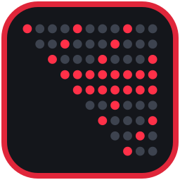
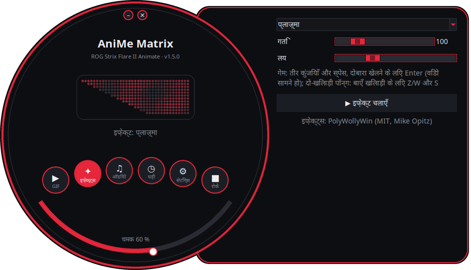
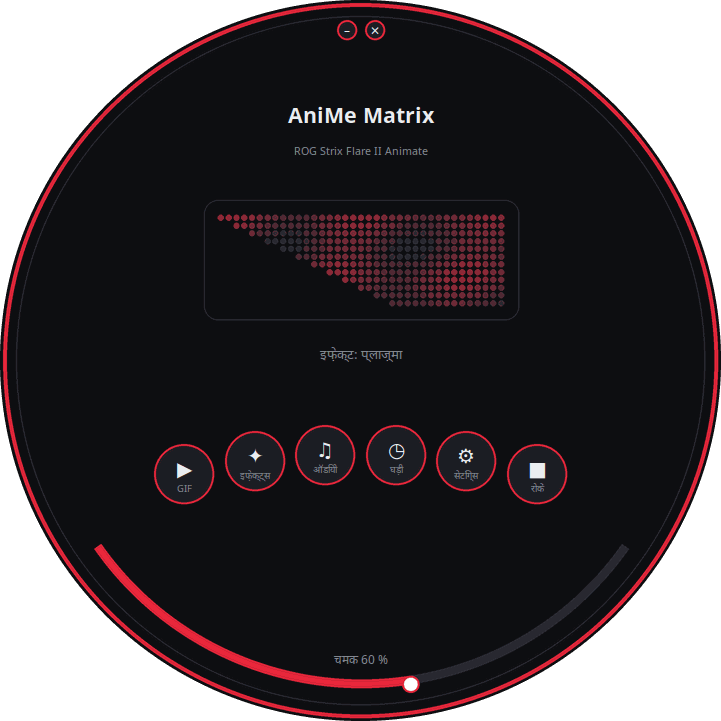
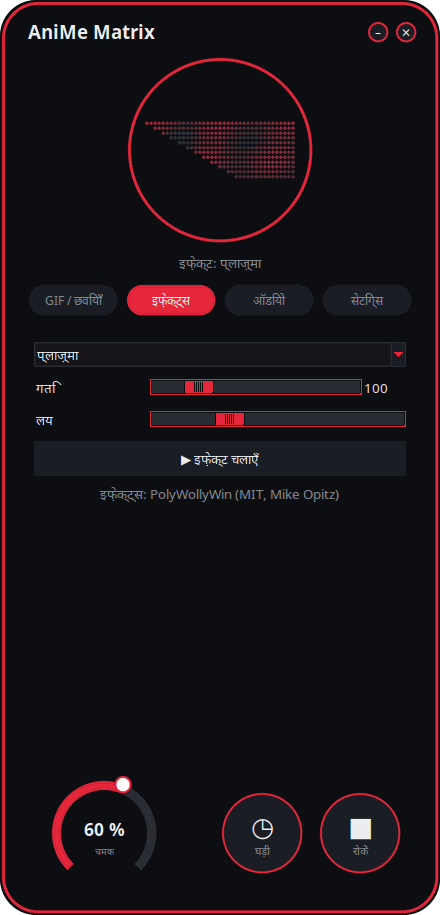
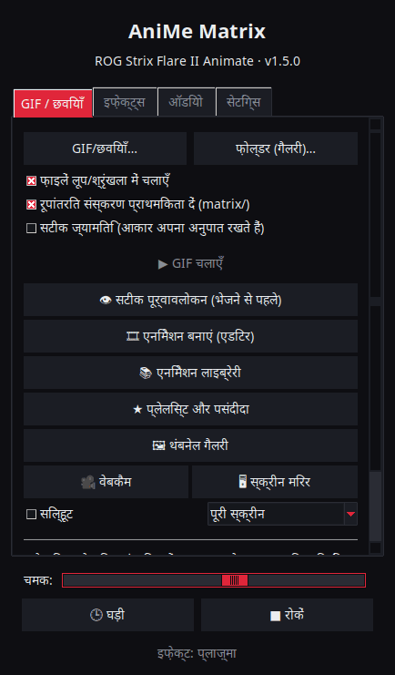
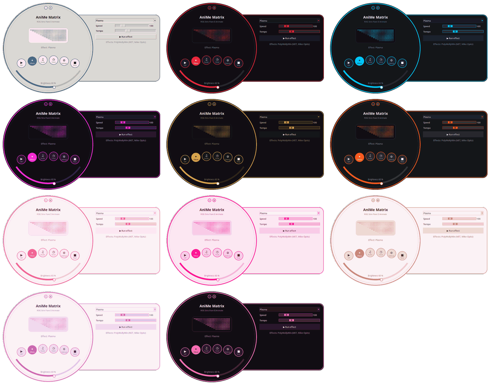

<p align="center">
  
</p>

# Linux के लिए AniMe Matrix — ROG Strix Flare II Animate

[](https://github.com/AntiCitoyen/Anticitoyen-ROG-flare2-anime-matrix/releases/latest)
[](https://github.com/AntiCitoyen/Anticitoyen-ROG-flare2-anime-matrix/actions/workflows/ci.yml)
[](../../LICENSE)
[](https://buymeacoffee.com/anticitoyen)

बिना Armoury Crate या Windows के, Linux पर **ASUS ROG Strix Flare II Animate** कीबोर्ड की **AniMe Matrix** स्क्रीन (312 मिनी-LED) को नियंत्रित करें: GIF और गैलरी, घड़ी, इफ़ेक्ट्स और ऑडियो विज़ुअलाइज़र, गेम्स, सिस्टम मॉनिटर, डेस्कटॉप नोटिफ़िकेशन, समय शेड्यूलिंग, एनिमेशन एडिटर, साझा लाइब्रेरी, सिंक्रोनाइज़्ड कीबोर्ड रंग।

<div align="center">

[🇫🇷 Français](../../README.md) · [🇬🇧 English](README.en.md) · [🇪🇸 Español](README.es.md) · [🇩🇪 Deutsch](README.de.md) · [🇮🇹 Italiano](README.it.md) · [🇧🇷 Português](README.pt-BR.md) · [🇳🇱 Nederlands](README.nl.md) · [🇵🇱 Polski](README.pl.md) · [🇷🇺 Русский](README.ru.md) · [🇺🇦 Українська](README.uk.md) · [🇹🇷 Türkçe](README.tr.md) · [🇸🇦 العربية](README.ar.md) · **🇮🇳 हिन्दी** · [🇨🇳 简体中文](README.zh-CN.md) · [🇹🇼 繁體中文](README.zh-TW.md) · [🇯🇵 日本語](README.ja.md) · [🇰🇷 한국어](README.ko.md) · [🇻🇳 Tiếng Việt](README.vi.md) · [🇮🇩 Bahasa Indonesia](README.id.md)

</div>

<p align="center"><br><em>डायल + ड्रॉअर (डिफ़ॉल्ट इंटरफ़ेस)</em></p>

| डायल | गोलाकार | क्लासिक |
|:---:|:---:|:---:|
|  |  |  |

<p align="center"></p>

---

## विषय-सूची

- [प्रोजेक्ट क्या करता है](#projet)
- [समर्थित हार्डवेयर](#materiel)
- [इंस्टॉलेशन](#installation)
- [उपयोग](#utilisation)
- [अच्छे GIF तैयार करना](#gif)
- [यह कैसे काम करता है](#fonctionnement)
- [समस्या निवारण](#depannage)
- [रिपॉज़िटरी संरचना](#depot)
- [पैकेज बनाना](#deb)
- [श्रेय](#credits)
- [लाइसेंस](#licence)
- [प्रोजेक्ट को समर्थन दें](#soutien)

---

<a id="projet"></a>

## प्रोजेक्ट क्या करता है

ASUS इस कीबोर्ड की AniMe Matrix स्क्रीन केवल Windows (Armoury Crate) के अंतर्गत ही उपलब्ध कराता है। यह प्रोजेक्ट कीबोर्ड से सीधे USB HID के ज़रिए संवाद करता है और उपलब्ध कराता है:

**दिखाना**
- **GIF, छवियाँ और वीडियो**: एक फ़ाइल, चयनित फ़ाइलें, या पूरा फ़ोल्डर गैलरी के रूप में, विंडो पर ड्रैग-एंड-ड्रॉप करके; वीडियो (MP4, WebM, MKV…) ffmpeg से चलते हैं; थंबनेल गैलरी; रूपांतरित फ़्रेम कैश में रखे जाते हैं (400 GIF की गैलरी लगभग 25 MB मेमोरी में चलती है)।
- **घड़ी**: डिजिटल, एनालॉग, बाइनरी, शब्दों में (फ़्रेंच, अंग्रेज़ी, जर्मन, स्पैनिश, इतालवी, पुर्तगाली, डच) या स्टाइलिश डायल।
- **एनिमेटेड इफ़ेक्ट** (Matrix जैसी बारिश, प्लाज़्मा, आग, तारे, आतिशबाज़ी, बिजली, मेटाबॉल, लहर…) और PC पर बज रहे साउंड पर प्रतिक्रिया देने वाले **7 ऑडियो विज़ुअलाइज़र**।
- **टेक्स्ट**: आपका संदेश, सभी लिपियों में (एक्सेंट, सिरिलिक, अरबी, हिंदी, चीनी, जापानी, कोरियाई…), बाएँ, दाएँ, ऊपर, नीचे स्क्रॉल होता हुआ, या स्थिर।
- **वेबकैम** (छवि या सिल्हूट) और **स्क्रीन मिरर** (पूरी स्क्रीन, माउस के आसपास का हिस्सा या सक्रिय विंडो)।
- **सिस्टम मॉनिटर**: CPU, RAM, GPU, तापमान, नेटवर्क स्पीड और समय, गेज के रूप में।
- **चल रहा गाना**: ट्रैक बदलने पर, « कलाकार - शीर्षक » एक बार स्क्रॉल होता है, फिर एक विज़ुअलाइज़र दिखता है (Spotify, VLC, Rhythmbox, ब्राउज़र… MPRIS के ज़रिए)।
- **डेस्कटॉप नोटिफ़िकेशन**: « ऐप: शीर्षक » ओवरले के रूप में दिखता है फिर प्लेबैक फिर से शुरू होता है (डिफ़ॉल्ट रूप से बंद, अनुमति प्राप्त ऐप्स की सूची के साथ)।
- कीबोर्ड पर **खेले जाने योग्य गेम्स**: Snake, Pong (अकेले या दो खिलाड़ी), Tetris, ब्रेकआउट, Invaders, Flappy, रिकॉर्ड्स के साथ।
- **संकेतक**: माइक म्यूट या उपयोग में होने पर, वेबकैम चलने पर, OBS के स्ट्रीम या रिकॉर्ड करने पर जलने वाले छोटे चमकदार ब्लॉक।
- **कीबोर्ड मेमोरी**: कीबोर्ड में सहेजा गया एनिमेशन (GIF, छवि) कीबोर्ड लगाते ही बिना किसी सॉफ़्टवेयर के चलता है, दूसरे पीसी पर भी; चमक समायोज्य (GIF टैब, `animematrix-ctl memoire`)। 6 अंतर्निहित एनिमेशन (KO, उल्का, आँख, Love, हैलोवीन, बूट) भी चुने जा सकते हैं: `animematrix-ctl clavier 1`…`6`।

**बनाना**
- स्क्रीन की वास्तविक ज्यामिति पर, फ़्रेम-दर-फ़्रेम **एनिमेशन एडिटर**: 3 स्तर, टाइमलाइन, घोस्ट लेयर, शिफ़्ट, कॉपी-पेस्ट, पूर्वावलोकन, कीबोर्ड को भेजना, GIF एक्सपोर्ट।
- साझा **एनिमेशन लाइब्रेरी**: ब्राउज़ करना, चलाना, अपनी गैलरी में जोड़ना, अपने खुद के प्रस्तावित करना।
- GIF का **स्मार्ट रूपांतरण**: विषय पर क्रॉपिंग, काली पृष्ठभूमि पर स्पष्ट विषय, मज़बूत किनारे, 3 स्तर।
- भेजने से पहले **सटीक पूर्वावलोकन**: स्क्रीन का सिम्युलेटेड रेंडर (वास्तविक लेआउट, LED के बीच हेलो)।
- **एक्सटेंशन के रूप में इफ़ेक्ट्स**: किसी फ़ोल्डर में रखी गई एक Python फ़ाइल एक इफ़ेक्ट जोड़ती है (देखें [docs/EXTENSIONS.md](../EXTENSIONS.md))।

**ऑटोमेट करना**
- **`animematrixd` बैकग्राउंड सर्विस**: स्क्रीन की अकेली मालिक, लॉन्चर बंद होने पर भी दिखाना जारी रखती है; `animematrix-ctl` कमांड और वैकल्पिक लोकल HTTP API।
- **समय शेड्यूलिंग**: घड़ी, गैलरी, मॉनिटर, चल रहे गाने, किसी इफ़ेक्ट, किसी प्लेलिस्ट या बंद स्क्रीन के साथ समय-सीमाएँ (रात सहित); सेशन लॉक होने पर, स्लीप में होने पर, या कोई ऐप फ़ुल-स्क्रीन में होने पर स्क्रीन काली रहती है।
- **ऐप प्रोफ़ाइल**: कोई गेम या ऐप जब तक सबसे आगे है, तब तक उसके लिए अलग सामग्री (*पता लगाएँ* बटन)।
- **प्लेलिस्ट और पसंदीदा**: GIF, इफ़ेक्ट्स, घड़ी… हर एक अपनी अवधि तक, लूप में; सिस्टम ट्रे आइकन और कमांड लाइन में भी।
- **वेब रिमोट**: लोकल नेटवर्क के किसी फ़ोन से स्क्रीन नियंत्रित करने के लिए एक पेज (QR कोड, टोकन)।
- **लंबे कमांड का अंत**: टर्मिनल में, कोई लंबा कमांड ख़त्म होने पर « पूरा हुआ: make 2 min 05 » दिखता है।
- **कुंजियों के रंग और प्रभाव**, OpenRGB के बिना: इंद्रधनुष, स्थिर, श्वास, रंग चक्र, प्रतिक्रियाशील, तरंग, तारों भरी रात, दलदली रेत, धारा, बारिश — कीबोर्ड स्वयं चलाता है और निकालने के बाद भी रहते हैं; या थीम का रंग, स्क्रीन के साथ स्पंदन।
- **सिस्टम ट्रे आइकन**: क्विक मेनू (मोड, ब्राइटनेस)।

**सुविधा**
- **4 इंटरफ़ेस** (डिफ़ॉल्ट रूप से *डायल + ड्रॉअर*, फिर *डायल*, *गोलाकार*, *क्लासिक*) **312 LED के लाइव पूर्वावलोकन** के साथ, **11 थीम** (5 ROG, 5 गुलाबी, सिस्टम) और **19 भाषाएँ**।
- **X11 और Wayland**: evdev के ज़रिए कीबोर्ड पर प्रतिक्रिया, सक्रिय विंडो Sway, Hyprland, KDE (kdotool) या GNOME (*Window Calls* एक्सटेंशन) से पढ़ी जाती है।
- **अंतर्निहित अपडेट**: लॉन्चर नवीनतम रिलीज़ डाउनलोड करता है, उसका SHA-256 फ़िंगरप्रिंट जाँचता है और उसे इंस्टॉल करता है (व्यवस्थापक पासवर्ड); या APT रिपॉज़िटरी के साथ `apt upgrade`।

<a id="materiel"></a>

## समर्थित हार्डवेयर

| डिवाइस | USB | स्थिति |
|---|---|---|
| ASUS ROG Strix Flare II Animate | `0b05:19fc` | समर्थित (HID, इंटरफ़ेस 4, यूसेज पेज `0xFF02`) |
| ROG लैपटॉप की AniMe Matrix स्क्रीन (G14, G16…) | विविध | `asusctl` के ज़रिए **प्रायोगिक**, हार्डवेयर पर परीक्षण नहीं किया गया (देखें [उपयोग](#utilisation)) |

Ubuntu 26.04 (X11, PipeWire, Cinnamon) पर परीक्षण किया गया। Python ≥ 3.10, hidapi, Tk और systemd वाला कोई भी डिस्ट्रीब्यूशन उपयुक्त होना चाहिए; Wayland पर लॉन्चर XWayland के ज़रिए चलता है।

<a id="installation"></a>

## इंस्टॉलेशन

### APT रिपॉज़िटरी (Debian, Ubuntu, Mint, Pop!_OS…) — `apt upgrade` से अपडेट

```bash
curl -fsSL https://anticitoyen.github.io/Anticitoyen-ROG-flare2-anime-matrix/animematrix.gpg \
  | sudo tee /usr/share/keyrings/animematrix.gpg >/dev/null
echo "deb [signed-by=/usr/share/keyrings/animematrix.gpg] https://anticitoyen.github.io/Anticitoyen-ROG-flare2-anime-matrix stable main" \
  | sudo tee /etc/apt/sources.list.d/animematrix.list
sudo apt update && sudo apt install anticitoyen-rog-flare2-anime-matrix
```

फिर **कीबोर्ड को निकालें और फिर से लगाएँ** (udev रूल लॉग-इन किए हुए यूज़र को एक्सेस देता है) और मेनू से **AniMe Matrix** लॉन्च करें।

### अन्य फ़ॉर्मैट ([Releases](https://github.com/AntiCitoyen/Anticitoyen-ROG-flare2-anime-matrix/releases/latest) पेज)

| सिस्टम | फ़ाइल | इंस्टॉलेशन |
|---|---|---|
| Debian, Ubuntu… | `anticitoyen-rog-flare2-anime-matrix_<version>_all.deb` | `sudo apt install ./anticitoyen-rog-flare2-anime-matrix_*_all.deb` |
| Fedora, openSUSE… | `anticitoyen-rog-flare2-anime-matrix-<version>-1.noarch.rpm` | `sudo dnf install ./anticitoyen-rog-flare2-anime-matrix-*.noarch.rpm` |
| Arch, Manjaro… | `anticitoyen-rog-flare2-anime-matrix-<version>-1-any.pkg.tar.zst` | `sudo pacman -U anticitoyen-rog-flare2-anime-matrix-*.pkg.tar.zst` |
| सभी (Flatpak) | `AniMeMatrix-<version>.flatpak` | `flatpak install --user AniMeMatrix-*.flatpak` (नीचे दिया गया udev रूल भी इंस्टॉल करें; ऑडियो विज़ुअलाइज़र नहीं) |
| AUR | `aur-<version>.tar.gz` | PKGBUILD और .SRCINFO: `tar xf aur-*.tar.gz && cd anticitoyen-rog-flare2-anime-matrix && makepkg -si` |
| Copr | `anticitoyen-rog-flare2-anime-matrix-<version>-1.<fc>.src.rpm` | सोर्स RPM: `rpmbuild --rebuild anticitoyen-rog-flare2-anime-matrix-*.src.rpm`, या किसी Copr प्रोजेक्ट में अपलोड करें |
| Flathub | `flathub-<version>.tar.gz` | इस संस्करण पर स्थिर मैनिफ़ेस्ट और `python3-modules.json`: Flathub में जमा करें या `flatpak-builder` |
| Weblate | `translations-<version>.zip` | Weblate में आयात के लिए अनुवाद फ़ाइलें (`locale/*.json`, आधार `_source.json`) |

पैकेज इंस्टॉल करता है:

| तत्व | स्थान |
|---|---|
| प्रोग्राम | `/usr/share/anticitoyen-rog-flare2-anime-matrix/` |
| कमांड | `animematrix`, `animematrixd`, `animematrix-ctl`, `animematrix-bascule`, `animematrix-animation`, `animematrix-apercu`, `animematrix-convertir`, `animematrix-effet`, `animematrix-galerie`, `animematrix-horloge`, `animematrix-dessin`, `animematrix-tray`, `animematrix-memoire` |
| यूज़र सर्विस | `/usr/lib/systemd/user/animematrixd.service` (सभी सेशन के लिए सक्रिय) |
| udev रूल | `/usr/lib/udev/rules.d/72-rog-flare2-animate.rules` |
| मेनू और आइकन | `animematrix.desktop`, आइकन `animematrix` |

### सोर्स से

```bash
git clone https://github.com/AntiCitoyen/Anticitoyen-ROG-flare2-anime-matrix.git
cd Anticitoyen-ROG-flare2-anime-matrix
python3 -m venv .venv
.venv/bin/pip install hidapi pillow numpy pynput python-xlib
# root के बिना कीबोर्ड तक पहुँच
sudo cp packaging/72-rog-flare2-animate.rules /etc/udev/rules.d/
sudo udevadm control --reload-rules && sudo udevadm trigger
# फिर कीबोर्ड निकालें और फिर से लगाएँ
.venv/bin/python rog_flare2_launcher.py
```

उपयोगी सिस्टम टूल: `imagemagick` (क्लासिक रूपांतरण), `pulseaudio-utils` (`parec`, ऑडियो के लिए), `zenity` (फ़ाइल चयनकर्ता), `libnotify-bin` (नोटिफ़िकेशन), `python3-gi` और `gir1.2-ayatanaappindicator3-0.1` (सिस्टम ट्रे आइकन), `ffmpeg` (वीडियो, वेबकैम, स्क्रीन मिरर), `python3-evdev` (Wayland पर कीबोर्ड प्रतिक्रिया), `x11-utils` (X11 पर सक्रिय विंडो), `python3-qrcode` (रिमोट का QR कोड), `tkdnd` (ड्रैग-एंड-ड्रॉप)।

<a id="utilisation"></a>

## उपयोग

### लॉन्चर

`animematrix` (या मेनू में **AniMe Matrix** एंट्री)।

गोल इंटरफ़ेस में, गोल बटन *GIF*, *इफ़ेक्ट्स*, *ऑडियो* और *सेटिंग्स* ब्लॉक खोलते हैं (ड्रॉअर में या वृत्त के अंदर); *घड़ी* और *रोकें* तुरंत असर करते हैं; नीचे का आर्क ब्राइटनेस सेट करता है; पृष्ठभूमि को खींचकर विंडो को हिलाया जाता है; ऊपर के छोटे बटन छोटा या बंद करते हैं। गोल आकार X11 SHAPE एक्सटेंशन का उपयोग करता है (`python3-xlib` पैकेज); इसके बिना, वही इंटरफ़ेस एक आयताकार विंडो में दिखता है।

- **GIF / छवियाँ**: *GIF/छवियाँ…* या *फ़ोल्डर (गैलरी)…* (या विंडो पर ड्रैग-एंड-ड्रॉप); *सटीक ज्यामिति* अनुपात बनाए रखती है (कोना छवि को खींचने के बजाय काटता है); *👁 सटीक पूर्वावलोकन (भेजने से पहले)* कुछ भी भेजे बिना रेंडर दिखाता है; *🎞 एनिमेशन बनाएं (एडिटर)*; *📚 एनिमेशन लाइब्रेरी*; *★ प्लेलिस्ट और पसंदीदा*; *🖼 थंबनेल गैलरी* (क्लिक: चलाएँ, राइट-क्लिक: पसंदीदा); *🎥 वेबकैम* और *🖥 स्क्रीन मिरर*; GIF बदलने के लिए *स्मार्ट रूपांतरण*।
- **इफ़ेक्ट्स** और **ऑडियो**: चुनें, समायोजित करें, *▶ इफ़ेक्ट चलाएँ*। स्लाइडर तुरंत असर करते हैं; *लय* पूरे एनिमेशन को तेज़ या धीमा करती है। *टेक्स्ट* इफ़ेक्ट आपका संदेश और उसकी स्क्रॉल दिशा लेता है। गेम्स ऐरो कीज़, स्पेस और एंटर से खेले जाते हैं, लॉन्चर विंडो सबसे आगे होनी चाहिए; दो खिलाड़ियों वाला Pong: बाएँ खिलाड़ी के लिए Z/W और S।
- **चमक**, **🕒 घड़ी**, **■ रोकें** (जो स्क्रीन साफ़ करता है) सभी टैब में समान रूप से उपलब्ध हैं।
- **सेटिंग्स**: सत्र शुरुआत (GIF गैलरी, घड़ी, पिछला प्लेबैक या कुछ नहीं), घड़ी का डायल, भाषा, थीम, इंटरफ़ेस, डेस्कटॉप नोटिफ़िकेशन, कीबोर्ड के रंग, *शेड्यूल…* (ट्रिगर, ऐप प्रोफ़ाइल, समय-सीमाएँ), *संकेतक (माइक, वेबकैम, OBS)…*, *वेब रिमोट…*, सिस्टम ट्रे आइकन, लंबे कमांड का अंत, एक्सटेंशन फ़ोल्डर, अपडेट।

**लॉन्चर बंद करना कुछ भी नहीं रोकता**: `animematrixd` बैकग्राउंड सर्विस दिखाना जारी रखती है। *■ रोकें* स्क्रीन को बंद कर देता है।

### बैकग्राउंड सर्विस और कमांड लाइन

```bash
animematrix-ctl etat                               # क्या दिखाया जा रहा है
animematrix-ctl gif ~/Images/AniMe-Matrix --fidele # गैलरी (फ़ोल्डर या फ़ाइलें)
animematrix-ctl effet "Plasma" --param speed=250   # इफ़ेक्ट और सेटिंग्स
animematrix-ctl horloge
animematrix-ctl texte "Bonjour"
animematrix-ctl effet "Text" --param message="Salut" --param direction=haut
animematrix-ctl liste "Soirée"                     # प्लेलिस्ट (बिना नाम: सभी प्लेलिस्ट दिखाता है)
animematrix-ctl favori 2                           # पसंदीदा नं. 2 (बिना नंबर: सभी पसंदीदा दिखाता है)
animematrix-ctl notifier "Café prêt" --duree 5     # ओवरले फिर वापसी
animematrix-ctl memoire anim.gif                   # कीबोर्ड में सहेजा जाता है (अधिकतम 196 फ़्रेम)
animematrix-ctl clavier                            # सहेजा गया एनिमेशन दिखाता है
animematrix-ctl luminosite 60
animematrix-ctl stop
```

| कमांड | भूमिका |
|---|---|
| `animematrix-bascule [gif\|horloge\|lecture\|off\|etat]` | टॉगल (मेनू आइकन के राइट-क्लिक में भी); चुना गया मोड सत्र शुरुआत का मोड भी होता है |
| `animematrixd --http 8765` | लोकल HTTP API वाली बैकग्राउंड सर्विस (`POST http://127.0.0.1:8765/api`, `Content-Type: application/json`, सॉकेट जैसा ही JSON) |
| `animematrix-animation [fichier.gif]` | एनिमेशन एडिटर |
| `animematrix-apercu fichier.gif -o apercu.gif` | किसी GIF (फ़ाइल) का सटीक पूर्वावलोकन |
| `animematrix-convertir dossier/ [--fidele] [--classique]` | मैट्रिक्स के लिए GIF रूपांतरित करता है (`dossier/matrix/` में) |
| `animematrix-effet --liste` | इफ़ेक्ट्स और विज़ुअलाइज़र की सूची दिखाता है |
| `animematrix-dessin` | LED-दर-LED एडिटर (बंद होने पर नियंत्रण बैकग्राउंड सर्विस को सौंपता है) |
| `animematrix-ctl sauvegarde reglages.zip`, `animematrix-ctl restaurer reglages.zip` | सभी सेटिंग्स निर्यात या पुनर्स्थापित करता है (*सेटिंग्स* में भी); `--secrets` के बिना टोकन और OBS पासवर्ड नहीं |

### ऑडियो

विज़ुअलाइज़र `parec` (PipeWire या PulseAudio) के ज़रिए **डिफ़ॉल्ट साउंड आउटपुट के मॉनिटर** को सुनते हैं: वे PC पर बज रहे साउंड पर प्रतिक्रिया देते हैं, माइक्रोफ़ोन पर नहीं।

### « Keyboard React » इफ़ेक्ट

जब तक इफ़ेक्ट चलता है, यह टाइपिंग की लय पर स्क्रीन को जगाता है: X11 पर `pynput` से, Wayland पर `/dev/input` से कीबोर्ड पढ़कर (`python3-evdev`)। Wayland पर, अगर इफ़ेक्ट डेमो मोड में ही रहता है, तो केवल ROG कीबोर्ड को पढ़ने की अनुमति दें:

```bash
sudo cp /usr/share/anticitoyen-rog-flare2-anime-matrix/udev/73-rog-flare2-animate-touches.rules /etc/udev/rules.d/
sudo udevadm control --reload-rules && sudo udevadm trigger
```

### संकेतक

*सेटिंग्स* → *संकेतक (माइक, वेबकैम, OBS)…*: स्क्रीन के ऊपरी बाएँ कोने में, चल रहे प्लेबैक के ऊपर 2 × 2 LED का एक ब्लॉक जलता है (1: माइक म्यूट या उपयोग में, 2: वेबकैम उपयोग में, 3: OBS लाइव या रिकॉर्डिंग में), और हर बदलाव की घोषणा स्क्रॉलिंग टेक्स्ट से की जा सकती है। OBS: WebSocket सर्वर चालू करें (*Tools* → *WebSocket Server Settings*) और उसका पोर्ट और पासवर्ड यहाँ दर्ज करें।

### वेब रिमोट

*सेटिंग्स* → *वेब रिमोट…*: *वेब रिमोट चालू करें* पर टिक करें, फिर उसी नेटवर्क के किसी फ़ोन पर पता खोलें (या QR कोड स्कैन करें)। पेज स्क्रीन को लाइव दिखाता है और घड़ी, गैलरी, इफ़ेक्ट्स, पसंदीदा, प्लेलिस्ट, ब्राइटनेस और संदेश उपलब्ध कराता है। पते में एक टोकन होता है: इसे साझा न करें, *नया टोकन* से इसे बदलें; पेज एन्क्रिप्टेड नहीं है (HTTP): केवल भरोसेमंद नेटवर्क पर उपयोग करें।

### लंबे कमांड का अंत

*सेटिंग्स* → *लंबे कमांड का अंत दिखाएँ (टर्मिनल)* `~/.bashrc` (और `~/.zshrc`) में एक पंक्ति जोड़ता है: 30 सेकंड से लंबा हर कमांड ख़त्म होने पर « पूरा हुआ: make 2 min 05 » या « विफल (2): … » दिखाता है। सीमा: `ANIMEMATRIX_FIN_SECONDES`; इंटरैक्टिव कमांड (एडिटर, `ssh`, `less`…) अनदेखे किए जाते हैं।

### कीबोर्ड के रंग

*सेटिंग्स* → *🌈 कीबोर्ड के रंग…*: प्रभाव (इंद्रधनुष, स्थिर, श्वास, रंग चक्र, प्रतिक्रियाशील, तरंग, तारों भरी रात, दलदली रेत, धारा, बारिश), रंग, गति, चमक, दिशा। *आज़माएँ* इसे लागू करता है, *कीबोर्ड में सहेजें* निकालने के बाद भी रखता है। *थीम का रंग* और *स्क्रीन के साथ स्पंदन* डेमन हर कुंजी पर भेजता है; इन्हें छोड़ने पर सहेजा गया प्रभाव लौट आता है। कमांड लाइन से: `animematrix-ctl rgb arc-en-ciel --vitesse 70`, `animematrix-ctl rgb statique --couleur "#ff0000"`। दो और सॉफ़्टवेयर मोड: *स्क्रीन की छवि* (कुंजियाँ स्क्रीन को बड़ा करके दिखाती हैं) और *ऑडियो स्पेक्ट्रम* (हर कॉलम में एक पट्टी)। हर समय-सीमा और हर ऐप प्रोफ़ाइल अपनी कुंजियों के रंग भी चुन सकती है (*शेड्यूल…*)। *कुंजी-दर-कुंजी*: हर कुंजी का अलग रंग, कीबोर्ड के नक्शे पर माउस से रंगा जाता है (AZERTY या QWERTY)। *चमकती टाइपिंग*: दबाई गई हर कुंजी जलती है, फिर मंद हो जाती है। माइक, वेबकैम और OBS संकेतक F1, F2 और F3 को भी जला सकते हैं, और हर सूचना पर कुंजियाँ चमकती हैं।

### ROG लैपटॉप (प्रायोगिक)

`~/.config/rog-flare2/materiel` में `portable-asusctl` लिखें फिर बैकग्राउंड सर्विस को फिर से शुरू करें: फ़्रेम `asusctl anime image` के ज़रिए जाते हैं (अधिकतम 5 फ़्रेम प्रति सेकंड)। किसी वास्तविक लैपटॉप पर परीक्षण नहीं किया गया: टिकट्स में फ़ीडबैक का स्वागत है।

<a id="gif"></a>

## अच्छे GIF तैयार करना

स्क्रीन कोई आयत नहीं है: 24 ऑफ़सेट पंक्तियाँ, ऊपर 19 से नीचे 7 LED तक (दायाँ किनारा सीधा, बायाँ किनारा तिरछा), वास्तव में अलग-अलग दिखने वाले 3 ग्रे स्तर, पड़ोसी LED के बीच एक हेलो। सिल्हूट, पिक्टोग्राम, छोटे टेक्स्ट और धीमी गति अच्छी दिखती है; फ़ोटो और वीडियो नहीं।

पूरी गाइड (कैनवस, स्तर, गति, रूपांतरण, सटीक ज्यामिति): **[docs/GUIDE-GIF.md](../GUIDE-GIF.md)**।

<a id="fonctionnement"></a>

## यह कैसे काम करता है

- **ट्रांसपोर्ट**: hidapi कीबोर्ड का HID इंटरफ़ेस नंबर 4 खोलता है और उसमें **1024 बाइट** के फ़्रेम लिखता है; कीबोर्ड हर फ़्रेम वापस भेजता है।
- **फ़्रेम**: `60 81 00 00` + **312 बाइट** (हार्डवेयर क्रम में प्रति LED 0-255 चमक) + 1024 तक शून्य।
- **ज्यामिति**: 24 ऑफ़सेट पंक्तियाँ (पंक्ति r कॉलम (r+1)//2 से 18 तक कवर करती है), या समकक्ष रूप से 37 → 15 कॉलम की 12 लॉजिकल पंक्तियाँ (PolyWollyWin मॉडल); दोनों मैपिंग सभी 312 LED पर समान पाई गई हैं।
- **बैकग्राउंड सर्विस**: `animematrixd` अकेले कीबोर्ड को संभालती है; बुनियादी प्लेबैक और ओवरले (नोटिफ़िकेशन); JSON सॉकेट `$XDG_RUNTIME_DIR/animematrix.sock`; कीबोर्ड का ऑटोमैटिक फिर से कनेक्ट होना।
- **एनिमेशन**: होस्ट फ़्रेम एक के बाद एक भेजता है (इफ़ेक्ट्स के लिए लगभग 30 फ़्रेम/सेकंड); कीबोर्ड की अंतर्निहित मेमोरी इस्तेमाल नहीं होती (रिसर्च: [docs/RECHERCHE-MEMOIRE.md](../RECHERCHE-MEMOIRE.md))।

मूल रिवर्स-इंजीनियरिंग नोट्स **[docs/PROTOCOL.md](../PROTOCOL.md)** में हैं; `*.cap` कैप्चर और `parse_usbpcap.py` / `rog_flare2_replay_capture.py` टूल रिपॉज़िटरी में बने रहते हैं।

⚠️ लैपटॉप के AniMe Matrix पैकेट (`0x5E …`, `0xEC …`) कीबोर्ड को न भेजें: यह सही प्रोटोकॉल नहीं है और कीबोर्ड को ब्लॉक कर सकता है (निकालें और फिर से लगाएँ, या **Fn + Esc** को 10-15 सेकंड दबाए रखें)।

<a id="depannage"></a>

## समस्या निवारण

| लक्षण | संभावित कारण | समाधान |
|---|---|---|
| `interface 4 not found` | कीबोर्ड नहीं दिख रहा या अधिकार नहीं हैं | `lsusb \| grep 0b05:19fc`; क्या udev रूल इंस्टॉल है? निकालें और फिर से लगाएँ |
| `Permission denied` / `open failed` | udev रूल लागू नहीं हुआ | `sudo udevadm control --reload-rules && sudo udevadm trigger`, फिर फिर से लगाएँ |
| « animematrixd सर्विस तक नहीं पहुँचा जा सका » | बैकग्राउंड सर्विस रुकी हुई है | `systemctl --user restart animematrixd.service` या `animematrixd &` |
| स्क्रीन नहीं बदलती | कोई और प्रोग्राम कीबोर्ड पर लिख रहा है | पुरानी स्क्रिप्ट बंद करें; `animematrix-ctl etat` |
| विज़ुअलाइज़र डेमो मोड में बने रहते हैं | `parec` नहीं है या साउंड नहीं है | `pulseaudio-utils` इंस्टॉल करें, साउंड बजाएँ |
| « Keyboard React » प्रतिक्रिया नहीं देता | `pynput` (X11) या `python3-evdev` (Wayland) अनुपलब्ध, या कीबोर्ड पढ़ा नहीं जा सकता | पैकेज इंस्टॉल करें; Wayland पर, [Keyboard React](#utilisation) वाला udev रूल |
| वेबकैम, वीडियो या स्क्रीन मिरर काम नहीं करते | `ffmpeg` अनुपलब्ध | `sudo apt install ffmpeg`; Wayland पर स्क्रीन मिरर पोर्टल के ज़रिए चलता है (`gstreamer1.0-pipewire`) |
| Wayland पर ऐप प्रोफ़ाइल या फ़ुल-स्क्रीन का कोई असर नहीं | कंपोज़िटर को सक्रिय विंडो का पता नहीं | GNOME: *Window Calls* एक्सटेंशन; KDE: `kdotool`; Sway और Hyprland: कुछ करने की ज़रूरत नहीं |
| गोल विंडो आयताकार दिखती है | SHAPE एक्सटेंशन या `python3-xlib` मौजूद नहीं है | `sudo apt install python3-xlib`, या *सेटिंग्स* → *इंटरफ़ेस:* → *क्लासिक* |
| बैकग्राउंड सर्विस का लॉग | — | `journalctl --user -u animematrixd.service -f` |

<a id="depot"></a>

## रिपॉज़िटरी संरचना

| फ़ाइल | भूमिका |
|---|---|
| `rog_flare2_launcher.py` | ग्राफ़िकल लॉन्चर (Tk) |
| `rog_flare2_ui_ronde.py`, `rog_flare2_themes.py` | गोल इंटरफ़ेस, थीम |
| `rog_flare2_i18n.py`, `locale/` | अनुवाद (19 भाषाएँ; `locale/_cles.json` = अनुवाद किए जाने वाले टेक्स्ट; [docs/TRADUIRE.md](../TRADUIRE.md)) |
| `rog_flare2_demon.py`, `rog_flare2_ctl.py` | `animematrixd` बैकग्राउंड सर्विस, क्लाइंट और `animematrix-ctl` कमांड |
| `rog_flare2_core.py` | GIF स्ट्रीमिंग प्लेबैक, फ़्रेम कैश, घड़ी, ज्यामिति |
| `rog_flare2_texte.py`, `rog_flare2_horloges.py` | सभी लिपियों में टेक्स्ट, *टेक्स्ट* इफ़ेक्ट, घड़ी के डायल |
| `rog_flare2_listes.py`, `rog_flare2_vignettes.py` | प्लेलिस्ट, पसंदीदा, थंबनेल गैलरी, ड्रैग-एंड-ड्रॉप |
| `rog_flare2_video.py`, `rog_flare2_voyants.py`, `rog_flare2_telecommande.py` | वीडियो, वेबकैम, स्क्रीन मिरर; संकेतक; वेब रिमोट |
| `rog_flare2_touches.py`, `rog_flare2_fenetre.py`, `rog_flare2_fin.py`, `rog_flare2_flatpak.py` | कीज़ और सक्रिय विंडो (X11, Wayland), लंबे कमांड का अंत, Flatpak |
| `rog_flare2_effets.py`, `polywollywin/` | इफ़ेक्ट्स और विज़ुअलाइज़र (PolyWollyWin इंजन, MIT), एक्सटेंशन |
| `rog_flare2_infos.py`, `rog_flare2_mpris.py`, `rog_flare2_jeux.py` | सिस्टम मॉनिटर, चल रहा गाना, गेम्स |
| `rog_flare2_notifs.py`, `rog_flare2_programme.py`, `rog_flare2_ui_programme.py` | नोटिफ़िकेशन, समय शेड्यूलिंग और ट्रिगर |
| `rog_flare2_rgb.py`, `rog_flare2_tray.py`, `rog_flare2_portable.py` | कुंजियों के रंग और प्रभाव, सिस्टम ट्रे आइकन, लैपटॉप (प्रायोगिक) |
| `rog_flare2_animation.py`, `rog_flare2_simulateur.py`, `rog_flare2_convertir.py` | एनिमेशन एडिटर, सिम्युलेटर, रूपांतरण |
| `rog_flare2_bibliotheque.py`, `bibliotheque/` | एनिमेशन लाइब्रेरी (कैटलॉग, CC0 GIF) |
| `rog_flare2_maj.py` | रिलीज़ से अपडेट |
| `rog_flare2_matrix_paint.py`, `rog_flare2_clock_v3.py`, `rog_flare2_folder_player.py` | HID ट्रांसपोर्ट और LED एडिटर, घड़ी, गैलरी (मूल टूल) |
| `parse_usbpcap.py`, `rog_flare2_replay_capture.py`, `*.cap` | रिवर्स-इंजीनियरिंग |
| `examples/effets/` | एक्सटेंशन का उदाहरण |
| `tests/` | टेस्ट (वास्तविक क्लिक वाले इंटरफ़ेस टेस्ट सहित) |
| `systemd/`, `packaging/` | यूज़र सर्विस; .deb, RPM, Arch, Flatpak, APT रिपॉज़िटरी |
| `docs/` | GIF गाइड, एक्सटेंशन, प्रोटोकॉल, रिसर्च, स्क्रीनशॉट, अनुवादित README |

<a id="deb"></a>

## पैकेज बनाना

```bash
packaging/build-deb.sh
# → dist/anticitoyen-rog-flare2-anime-matrix_<version>_all.deb
```

`packaging/install.sh` प्रोजेक्ट को किसी भी डायरेक्टरी स्ट्रक्चर में इंस्टॉल करता है; यह .deb, RPM (`packaging/rpm/`), Arch पैकेज (`packaging/aur/`) और Flatpak (`packaging/flathub/`) के लिए इस्तेमाल होता है। हर पब्लिश की गई रिलीज़ पर, GitHub RPM, Arch पैकेज और Flatpak बनाता है, और साइन किए गए APT रिपॉज़िटरी को अपडेट करता है। वर्ज़न `rog_flare2_core.py` (`VERSION`) से पढ़ा जाता है। टेस्ट: `python -m pytest tests`।

<a id="credits"></a>

## श्रेय

- **NicRoss512** — प्रोटोकॉल की रिवर्स-इंजीनियरिंग, मूल घड़ी और एडिटर: [ASUS-ROG-Strix-Flare-II-Animate-AniMe-Matrix-Protocol](https://github.com/NicRoss512/ASUS-ROG-Strix-Flare-II-Animate-AniMe-Matrix-Protocol)। यह रिपॉज़िटरी वहीं से शुरू होती है; इसका इतिहास सुरक्षित रखा गया है।
- **Mike Opitz** — [PolyWollyWin](https://github.com/MikeOpitz99/PolyWollyWin) (MIT), Windows कंट्रोलर जिसका इफ़ेक्ट और ऑडियो विज़ुअलाइज़र इंजन यहाँ इस्तेमाल किया गया है।
- **Yoshi Walsh** — [Mastering the AniMe Matrix](https://blog.yoshiwalsh.me/asus-anime-matrix/), LED व्यवहार (हेलो, दिखने वाले स्तर, गति) के लिए।
- **asus-linux** — [asusctl](https://gitlab.com/asus-linux/asusctl), लैपटॉप स्क्रीन के लिए इस्तेमाल किया गया।

यह एक स्वतंत्र प्रोजेक्ट है, ASUS से संबद्ध नहीं। "ROG", "AniMe Matrix" और "Armoury Crate" ASUSTeK के ट्रेडमार्क हैं।

<a id="licence"></a>

## लाइसेंस

इस रिपॉज़िटरी के कोड के लिए [MIT](../../LICENSE); `bibliotheque/` के एनिमेशन CC0 के अंतर्गत हैं। `polywollywin/` अपने लेखक के MIT लाइसेंस के अंतर्गत ही रहता है ([polywollywin/LICENSE](../../polywollywin/LICENSE))। NicRoss512 की मूल फ़ाइलें (`rog_flare2_clock_v3.py`, `rog_flare2_matrix_paint.py`, `parse_usbpcap.py`, `rog_flare2_replay_capture.py`, `docs/PROTOCOL.md`, कैप्चर) बिना किसी स्पष्ट लाइसेंस के प्रकाशित की गई थीं और अपने लेखक की ही रहती हैं; इन्हें श्रेय के साथ फिर से वितरित किया जाता है।

<a id="soutien"></a>

## प्रोजेक्ट को समर्थन दें

अगर यह प्रोजेक्ट आपके काम आता है, तो एक कॉफ़ी इसे बनाए रखने में मदद करती है:

[](https://buymeacoffee.com/anticitoyen)

**https://buymeacoffee.com/anticitoyen** — यह लिंक लॉन्चर के *सेटिंग्स* टैब में भी मौजूद है।

बग रिपोर्ट, विचार, और साझा करने के लिए एनिमेशन: [Issues](https://github.com/AntiCitoyen/Anticitoyen-ROG-flare2-anime-matrix/issues)। अनुवाद: [docs/TRADUIRE.md](../TRADUIRE.md)।
