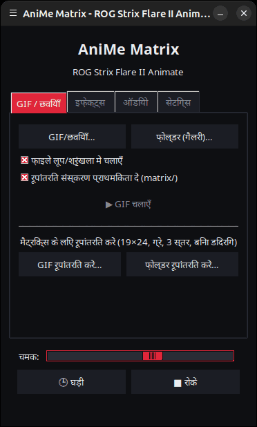
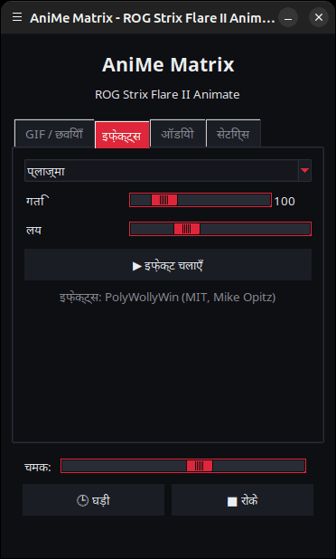
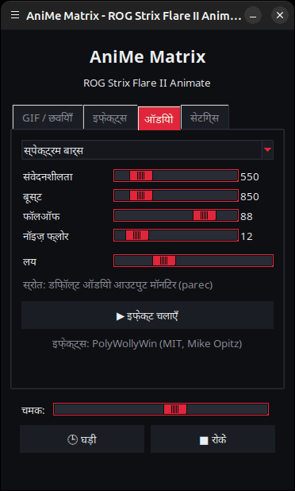
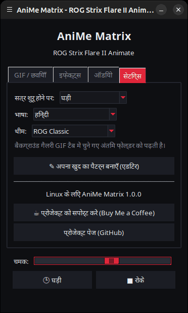

<p align="center">
  
</p>

# Linux के लिए AniMe Matrix — ROG Strix Flare II Animate

[](https://github.com/AntiCitoyen/Anticitoyen-ROG-flare2-anime-matrix/releases/latest)
[](../../LICENSE)
[](https://buymeacoffee.com/anticitoyen)

बिना Armoury Crate या Windows के, Linux पर **ASUS ROG Strix Flare II Animate** कीबोर्ड की **AniMe Matrix** स्क्रीन (312 मिनी-LED) को नियंत्रित करें: GIF और इमेज, बैकग्राउंड गैलरी, घड़ी, 19 एनिमेटेड इफ़ेक्ट, 7 ऑडियो विज़ुअलाइज़र, LED-दर-LED ड्रॉइंग।

<div align="center">

[🇫🇷 Français](../../README.md) · [🇬🇧 English](README.en.md) · [🇪🇸 Español](README.es.md) · [🇩🇪 Deutsch](README.de.md) · [🇮🇹 Italiano](README.it.md) · [🇧🇷 Português](README.pt-BR.md) · [🇳🇱 Nederlands](README.nl.md) · [🇵🇱 Polski](README.pl.md) · [🇷🇺 Русский](README.ru.md) · [🇺🇦 Українська](README.uk.md) · [🇹🇷 Türkçe](README.tr.md) · [🇸🇦 العربية](README.ar.md) · **🇮🇳 हिन्दी** · [🇨🇳 简体中文](README.zh-CN.md) · [🇹🇼 繁體中文](README.zh-TW.md) · [🇯🇵 日本語](README.ja.md) · [🇰🇷 한국어](README.ko.md) · [🇻🇳 Tiếng Việt](README.vi.md) · [🇮🇩 Bahasa Indonesia](README.id.md)

</div>

*नोट: इंटरफ़ेस 19 भाषाओं में उपलब्ध है, यह सिस्टम की भाषा को अपने आप फ़ॉलो करता है, और इसे **सेटिंग्स** टैब में **भाषा:** से बदला जा सकता है।*

| GIF / इमेज | इफ़ेक्ट्स | ऑडियो | सेटिंग्स |
|---|---|---|---|
|  |  |  |  |

<p align="center"></p>

---

## विषय-सूची

- [प्रोजेक्ट क्या करता है](#projet)
- [समर्थित हार्डवेयर](#materiel)
- [इंस्टॉलेशन](#installation)
- [उपयोग](#utilisation)
- [अच्छे GIF तैयार करना](#gif)
- [यह कैसे काम करता है](#fonctionnement)
- [समस्या निवारण](#depannage)
- [रिपॉज़िटरी संरचना](#depot)
- [.deb पैकेज बनाना](#deb)
- [श्रेय](#credits)
- [लाइसेंस](#licence)
- [प्रोजेक्ट को समर्थन दें](#soutien)

---

<a id="projet"></a>

## प्रोजेक्ट क्या करता है

ASUS इस कीबोर्ड की AniMe Matrix स्क्रीन केवल Windows (Armoury Crate) के अंतर्गत ही उपलब्ध कराता है। यह प्रोजेक्ट कीबोर्ड से सीधे USB HID के ज़रिए संवाद करता है और उपलब्ध कराता है:

- **एक ग्राफ़िकल लॉन्चर** (`animematrix`), चार टैब के साथ:
  - **GIF / छवियाँ**: एक या कई फ़ाइलें, या पूरा फ़ोल्डर गैलरी के रूप में, लूप में चलाना; मैट्रिक्स के लिए GIF रूपांतरण।
  - **इफ़ेक्ट्स**: 19 एनिमेशन (Matrix जैसी बारिश, प्लाज़्मा, आग, तारे, आतिशबाज़ी, बिजली, मेटाबॉल, लहर, साँप, स्क्रॉलिंग टेक्स्ट, स्टाइलाइज़्ड घड़ी, कीबोर्ड पर प्रतिक्रिया…), चलते समय समायोज्य।
  - **ऑडियो**: PC पर बज रहे साउंड पर प्रतिक्रिया देने वाले 7 विज़ुअलाइज़र (स्पेक्ट्रम, KITT/KARR, स्टारबर्स्ट, ऑसिलोस्कोप, ऑडियो फ़ायर…)।
  - **सेटिंग्स**: सेशन खुलने पर क्या दिखेगा, ड्रॉइंग एडिटर, प्रोजेक्ट लिंक।
- HH:MM फ़ॉर्मैट में **एक घड़ी**, लॉन्चर से या बैकग्राउंड सर्विस के रूप में।
- **एक बैकग्राउंड गैलरी**: एक `systemd --user` सर्विस जो सेशन खुलते ही किसी GIF फ़ोल्डर को क्रमवार दिखाती है।
- **एक-क्लिक टॉगल** (`animematrix-bascule`): मेनू आइकन स्क्रीन चालू या बंद करता है; राइट-क्लिक से **GIF गैलरी**, **घड़ी** या **बंद करें** चुना जा सकता है।
- **मैट्रिक्स के अनुकूल GIF रूपांतरण** (`animematrix-convertir`): 19×24, ग्रे, 3 स्तर, बिना डिदरिंग के — देखें [docs/GUIDE-GIF.md](../GUIDE-GIF.md)।
- LED-दर-LED **एक ड्रॉइंग एडिटर** (`animematrix-dessin`)।
- **11 थीम**: ROG से प्रेरित 5 (Classic, Strix, Glitch, Gold, Carbon), 5 गुलाबी (साकुरा, बबलगम, रोज़ गोल्ड, लैवेंडर गुलाबी, गुलाबी रात) और सिस्टम थीम, जिन्हें *सेटिंग्स* → *थीम:* में चुना जा सकता है।
- **कम बिजली खपत**: GIF फ़्रेम-दर-फ़्रेम डिकोड होते हैं; 400 GIF की गैलरी लगभग 25 MB मेमोरी में चलती है।

<a id="materiel"></a>

## समर्थित हार्डवेयर

| कीबोर्ड | USB | इंटरफ़ेस |
|---|---|---|
| ASUS ROG Strix Flare II Animate | `0b05:19fc` | HID, इंटरफ़ेस 4 (यूसेज पेज `0xFF02`) |

ROG **लैपटॉप** (Zephyrus G14 आदि) की AniMe Matrix स्क्रीन एक अलग प्रोटोकॉल इस्तेमाल करती हैं: वे यहाँ **समर्थित नहीं** हैं (इसके बजाय `asusctl` देखें)।

Ubuntu 26.04 (X11, PipeWire) पर परीक्षण किया गया। Python ≥ 3.10, hidapi, Tk और systemd वाला कोई भी डिस्ट्रीब्यूशन उपयुक्त होना चाहिए।

<a id="installation"></a>

## इंस्टॉलेशन

### .deb पैकेज (Debian, Ubuntu, Mint, Pop!_OS…)

1. [Releases](https://github.com/AntiCitoyen/Anticitoyen-ROG-flare2-anime-matrix/releases/latest) पेज से `anticitoyen-rog-flare2-anime-matrix_<version>_all.deb` डाउनलोड करें।
2. इसे इंस्टॉल करें (apt निर्भरताएँ अपने आप ले लेता है):
   ```bash
   sudo apt install ./anticitoyen-rog-flare2-anime-matrix_*_all.deb
   ```
3. **कीबोर्ड को निकालें और फिर से लगाएँ** (udev रूल लॉग-इन किए हुए यूज़र को एक्सेस देता है)।
4. एप्लिकेशन मेनू से **AniMe Matrix** लॉन्च करें, या टर्मिनल में `animematrix` चलाएँ।

पैकेज इंस्टॉल करता है:

| तत्व | स्थान |
|---|---|
| प्रोग्राम | `/usr/share/anticitoyen-rog-flare2-anime-matrix/` |
| कमांड | `animematrix`, `animematrix-bascule`, `animematrix-effet`, `animematrix-galerie`, `animematrix-horloge`, `animematrix-convertir`, `animematrix-dessin` |
| यूज़र सर्विसेज़ | `/usr/lib/systemd/user/animematrix-galerie.service`, `animematrix-horloge.service` (डिफ़ॉल्ट रूप से सक्रिय नहीं) |
| udev रूल | `/usr/lib/udev/rules.d/72-rog-flare2-animate.rules` |
| मेनू और आइकन | `animematrix.desktop`, आइकन `animematrix` |

अनइंस्टॉल: `sudo apt remove anticitoyen-rog-flare2-anime-matrix`।

### सोर्स से

```bash
git clone https://github.com/AntiCitoyen/Anticitoyen-ROG-flare2-anime-matrix.git
cd Anticitoyen-ROG-flare2-anime-matrix
python3 -m venv .venv
.venv/bin/pip install hidapi pillow numpy pynput
# root के बिना कीबोर्ड तक पहुँच
sudo cp packaging/72-rog-flare2-animate.rules /etc/udev/rules.d/
sudo udevadm control --reload-rules && sudo udevadm trigger
# फिर कीबोर्ड निकालें और फिर से लगाएँ
.venv/bin/python rog_flare2_launcher.py
```

उपयोगी सिस्टम टूल: `imagemagick` (रूपांतरण), `pulseaudio-utils` (`parec`, ऑडियो के लिए), `zenity` (फ़ाइल चयनकर्ता), `libnotify-bin` (टॉगल नोटिफ़िकेशन)।

सोर्स से बैकग्राउंड सर्विसेज़ के लिए, `systemd/*.service` फ़ाइलों को `~/.config/systemd/user/` में कॉपी करें, `ExecStart=` लाइनों को `.venv/bin/python` के पाथ और स्क्रिप्ट (`rog_flare2_folder_player.py`, `rog_flare2_clock_v3.py`) से बदलें, फिर `systemctl --user daemon-reload` चलाएँ।

<a id="utilisation"></a>

## उपयोग

### लॉन्चर

`animematrix` (या मेनू में **AniMe Matrix** एंट्री)।

- **GIF / छवियाँ**: चयन के लिए *GIF/छवियाँ…*, पूरे फ़ोल्डर के लिए *फ़ोल्डर (गैलरी)…*। चुना गया फ़ोल्डर बैकग्राउंड गैलरी का फ़ोल्डर भी बन जाता है। *रूपांतरित संस्करण प्राथमिकता दें (matrix/)* मौजूद होने पर `dossier/matrix/nom.gif` पढ़ता है (जो रूपांतरण से बनता है)।
- **इफ़ेक्ट्स** और **ऑडियो**: चुनें, समायोजित करें, *▶ इफ़ेक्ट चलाएँ*। स्लाइडर तुरंत असर करते हैं; *लय* एनिमेशन को तेज़ या धीमा करती है।
- **चमक**, **🕒 घड़ी**, **■ रोकें** (जो स्क्रीन साफ़ करता है) सभी टैब में समान रूप से उपलब्ध हैं।
- **सेटिंग्स**: *सत्र शुरू होने पर* = **GIF गैलरी**, **घड़ी** या **कुछ नहीं**।

जब लॉन्चर कुछ दिखा रहा होता है, तो वह बैकग्राउंड सर्विस को रोक देता है (कीबोर्ड पर केवल एक ही प्रोग्राम लिख सकता है) और बंद होने पर उसे फिर से शुरू कर देता है।

### टॉगल और बैकग्राउंड सर्विसेज़

```bash
animematrix-bascule            # चालू → बंद ; बंद → आख़िरी मोड
animematrix-bascule gif        # बैकग्राउंड गैलरी, सेशन शुरू होने पर भी
animematrix-bascule horloge    # बैकग्राउंड घड़ी, सेशन शुरू होने पर भी
animematrix-bascule off        # बंद, शुरुआत में कुछ नहीं
animematrix-bascule etat       # मौजूदा मोड
```

यही विकल्प मेनू आइकन के राइट-क्लिक में भी मिलते हैं। पर्दे के पीछे: `systemctl --user enable --now animematrix-galerie.service` (या `animematrix-horloge.service`)।

### कमांड लाइन से

| कमांड | भूमिका |
|---|---|
| `animematrix-effet --liste` | इफ़ेक्ट्स और विज़ुअलाइज़र की सूची दिखाता है |
| `animematrix-effet "Plasma" --brightness 60 --vitesse 1.5` | एक इफ़ेक्ट शुरू करता है (रोकने के लिए Ctrl+C) |
| `animematrix-galerie [dossier] --brightness 60 [--originaux]` | किसी फ़ोल्डर को क्रमवार दिखाता है (डिफ़ॉल्ट रूप से लॉन्चर में चुना गया आख़िरी फ़ोल्डर, अन्यथा `~/Images/AniMe-Matrix`) |
| `animematrix-horloge -b 25` | घड़ी; `--clear` स्क्रीन साफ़ करता है, `--once --text 12:34` एक टेक्स्ट दिखाता है |
| `animematrix-convertir dossier/ [--sortie D] [--force]` | मैट्रिक्स के लिए GIF रूपांतरित करता है (`dossier/matrix/` में) |
| `animematrix-dessin` | ड्रॉइंग एडिटर |

### ऑडियो

विज़ुअलाइज़र `parec` (PipeWire या PulseAudio) के ज़रिए **डिफ़ॉल्ट साउंड आउटपुट के मॉनिटर** को सुनते हैं: वे PC पर बज रहे साउंड पर प्रतिक्रिया देते हैं, माइक्रोफ़ोन पर नहीं। आउटपुट बदलने के लिए, सिस्टम का डिफ़ॉल्ट आउटपुट बदलें।

### « Keyboard React » इफ़ेक्ट

यह `pynput` की मदद से टाइपिंग की लय पर स्क्रीन को जगाता है, जो जब तक इफ़ेक्ट चलता है तब तक पूरे सेशन की-प्रेस पढ़ता रहता है। यह X11 पर काम करता है; Wayland पर यह की-प्रेस प्राप्त नहीं करता।

<a id="gif"></a>

## अच्छे GIF तैयार करना

स्क्रीन कोई आयत नहीं है: 24 ऑफ़सेट पंक्तियाँ, ऊपर 19 से नीचे 7 LED तक, वास्तव में अलग-अलग दिखने वाले 3 ग्रे स्तर, पड़ोसी LED के बीच एक हेलो। सिल्हूट, पिक्टोग्राम, छोटे टेक्स्ट और धीमी गति अच्छी दिखती है; फ़ोटो और वीडियो नहीं।

पूरी गाइड (कैनवस साइज़, स्तर, गति, चमक, ImageMagick कमांड): **[docs/GUIDE-GIF.md](../GUIDE-GIF.md)**।

<a id="fonctionnement"></a>

## यह कैसे काम करता है

- **ट्रांसपोर्ट**: hidapi कीबोर्ड का HID इंटरफ़ेस नंबर 4 खोलता है और उसमें **1024 बाइट** के फ़्रेम लिखता है।
- **फ़्रेम**: `60 81 00 00` + **312 बाइट** (हार्डवेयर क्रम में प्रति LED 0-255 चमक) + 1024 तक शून्य।
- **ज्यामिति**: विकर्ण रूप से ऑफ़सेट 24 पंक्तियाँ (19 → 7 LED), या समकक्ष रूप से 37 → 15 कॉलम की 12 लॉजिकल पंक्तियाँ (PolyWollyWin मॉडल); दोनों मैपिंग सभी 312 LED पर समान पाई गई हैं।
- **GIF**: हर फ़्रेम को फिर से जोड़ा जाता है (ऑप्टिमाइज़्ड GIF केवल अंतर संग्रहीत करते हैं), ग्रेस्केल में बदला जाता है, 24 पंक्तियों में घटाया जाता है और पंक्ति-दर-पंक्ति सैंपल किया जाता है।
- **एनिमेशन**: कोई एम्बेडेड मेमोरी इस्तेमाल नहीं होती; एनिमेशन होस्ट द्वारा फ़्रेम एक के बाद एक भेजने से बनता है (इफ़ेक्ट्स के लिए लगभग 30 फ़्रेम/सेकंड)।

मूल रिवर्स-इंजीनियरिंग नोट्स (USBPcap कैप्चर, LED क्रम, कैलिब्रेशन पॉइंट) **[docs/PROTOCOL.md](../PROTOCOL.md)** में हैं; `*.cap` कैप्चर और `parse_usbpcap.py` / `rog_flare2_replay_capture.py` टूल उन लोगों के लिए रिपॉज़िटरी में बने हुए हैं जो और आगे जाना चाहते हैं।

⚠️ लैपटॉप के AniMe Matrix पैकेट (`0x5E …`, `0xEC …`) कीबोर्ड को न भेजें: यह सही प्रोटोकॉल नहीं है और कीबोर्ड को ब्लॉक कर सकता है (निकालें और फिर से लगाएँ, या **Fn + Esc** को 10-15 सेकंड दबाए रखें)।

<a id="depannage"></a>

## समस्या निवारण

| लक्षण | संभावित कारण | समाधान |
|---|---|---|
| `interface 4 not found` | कीबोर्ड नहीं दिख रहा या अधिकार नहीं हैं | `lsusb \| grep 0b05:19fc`; क्या udev रूल इंस्टॉल है? निकालें और फिर से लगाएँ |
| `Permission denied` / `open failed` | udev रूल लागू नहीं हुआ | `sudo udevadm control --reload-rules && sudo udevadm trigger`, फिर फिर से लगाएँ |
| स्क्रीन नहीं बदलती | कोई और प्रोग्राम पहले से लिख रहा है | `animematrix-bascule off`, अन्य लॉन्चर या स्क्रिप्ट बंद करें |
| विज़ुअलाइज़र डेमो मोड में बने रहते हैं | `parec` नहीं है या साउंड नहीं है | `pulseaudio-utils` इंस्टॉल करें, साउंड बजाएँ |
| « Keyboard React » प्रतिक्रिया नहीं देता | Wayland सेशन या `pynput` अनुपलब्ध | X11 सेशन, `sudo apt install python3-pynput` |
| बैकग्राउंड गैलरी शुरू नहीं होती | फ़ोल्डर खाली है या मौजूद नहीं है | लॉन्चर में (GIF टैब) एक फ़ोल्डर चुनें |
| किसी सर्विस का लॉग | — | `journalctl --user -u animematrix-galerie.service -f` |

<a id="depot"></a>

## रिपॉज़िटरी संरचना

| फ़ाइल | भूमिका |
|---|---|
| `rog_flare2_launcher.py` | ग्राफ़िकल लॉन्चर (Tk) |
| `rog_flare2_effets.py` | इफ़ेक्ट्स और ऑडियो विज़ुअलाइज़र (Linux के लिए अनुकूलित PolyWollyWin इंजन) |
| `polywollywin/` | PolyWollyWin का इफ़ेक्ट इंजन, बिना बदलाव के कॉपी किया गया (MIT) |
| `rog_flare2_folder_player.py` | बैकग्राउंड गैलरी (सर्विस) |
| `rog_flare2_clock_v3.py` | घड़ी (सर्विस) |
| `rog_flare2_bascule.sh` | गैलरी / घड़ी / बंद के बीच टॉगल |
| `rog_flare2_convertir.py` | GIF रूपांतरण (ImageMagick) |
| `rog_flare2_matrix_paint.py` | HID ट्रांसपोर्ट, LED क्रम, ड्रॉइंग एडिटर |
| `parse_usbpcap.py`, `rog_flare2_replay_capture.py`, `*.cap` | रिवर्स-इंजीनियरिंग टूल और कैप्चर |
| `systemd/` | यूज़र सर्विसेज़ |
| `packaging/` | udev रूल, मेनू एंट्री, आइकन, .deb पैकेज की फ़ाइलें और स्क्रिप्ट |
| `docs/` | GIF गाइड, प्रोटोकॉल नोट्स, स्क्रीनशॉट |

<a id="deb"></a>

## .deb पैकेज बनाना

```bash
packaging/build-deb.sh
# → dist/anticitoyen-rog-flare2-anime-matrix_<version>_all.deb
```

केवल `dpkg-deb` और `bash` की ज़रूरत है; संस्करण `rog_flare2_launcher.py` (`VERSION`) से पढ़ा जाता है।

<a id="credits"></a>

## श्रेय

- **NicRoss512** — प्रोटोकॉल की रिवर्स-इंजीनियरिंग, मूल घड़ी और एडिटर: [ASUS-ROG-Strix-Flare-II-Animate-AniMe-Matrix-Protocol](https://github.com/NicRoss512/ASUS-ROG-Strix-Flare-II-Animate-AniMe-Matrix-Protocol)। यह रिपॉज़िटरी वहीं से शुरू होती है; इसका इतिहास सुरक्षित रखा गया है।
- **Mike Opitz** — [PolyWollyWin](https://github.com/MikeOpitz99/PolyWollyWin) (MIT), Windows कंट्रोलर जिसका इफ़ेक्ट और ऑडियो विज़ुअलाइज़र इंजन यहाँ इस्तेमाल किया गया है।
- **Yoshi Walsh** — [Mastering the AniMe Matrix](https://blog.yoshiwalsh.me/asus-anime-matrix/), LED व्यवहार (हेलो, दिखने वाले स्तर, गति) के लिए।

यह एक स्वतंत्र प्रोजेक्ट है, ASUS से संबद्ध नहीं। "ROG", "AniMe Matrix" और "Armoury Crate" ASUSTeK के ट्रेडमार्क हैं।

<a id="licence"></a>

## लाइसेंस

इस रिपॉज़िटरी के कोड के लिए [MIT](../../LICENSE)। `polywollywin/` अपने लेखक के MIT लाइसेंस के अंतर्गत ही रहता है ([polywollywin/LICENSE](../../polywollywin/LICENSE))। NicRoss512 की मूल फ़ाइलें (`rog_flare2_clock_v3.py`, `rog_flare2_matrix_paint.py`, `parse_usbpcap.py`, `rog_flare2_replay_capture.py`, `docs/PROTOCOL.md`, कैप्चर) बिना किसी स्पष्ट लाइसेंस के प्रकाशित की गई थीं और अपने लेखक की ही रहती हैं; इन्हें श्रेय के साथ फिर से वितरित किया जाता है।

<a id="soutien"></a>

## प्रोजेक्ट को समर्थन दें

अगर यह प्रोजेक्ट आपके काम आता है, तो एक कॉफ़ी इसे बनाए रखने में मदद करती है:

[](https://buymeacoffee.com/anticitoyen)

**https://buymeacoffee.com/anticitoyen** — यह लिंक लॉन्चर के *सेटिंग्स* टैब में भी मौजूद है।

बग रिपोर्ट और विचार: [Issues](https://github.com/AntiCitoyen/Anticitoyen-ROG-flare2-anime-matrix/issues)।
