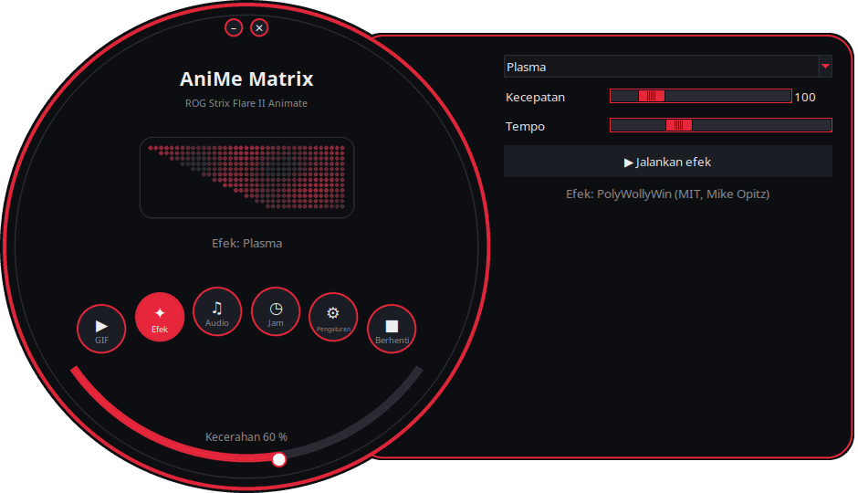
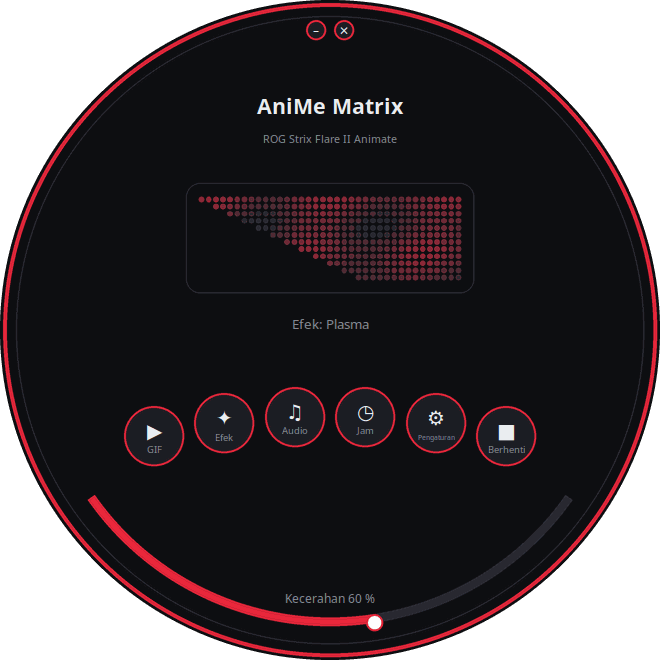
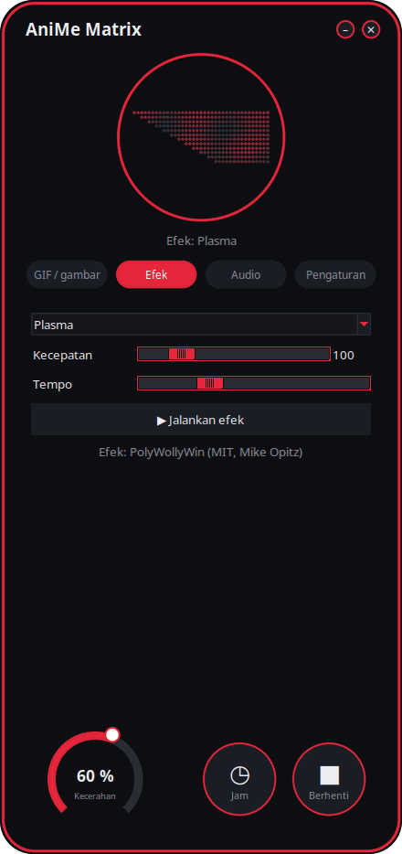
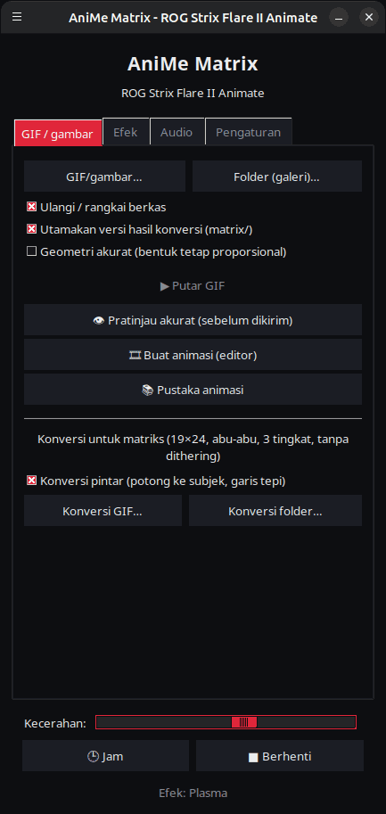

<p align="center">
  
</p>

# AniMe Matrix untuk Linux — ROG Strix Flare II Animate

[](https://github.com/AntiCitoyen/Anticitoyen-ROG-flare2-anime-matrix/releases/latest)
[](https://github.com/AntiCitoyen/Anticitoyen-ROG-flare2-anime-matrix/actions/workflows/ci.yml)
[](../../LICENSE)
[](https://buymeacoffee.com/anticitoyen)

Mengendalikan layar **AniMe Matrix** (312 mini-LED) pada keyboard **ASUS ROG Strix Flare II Animate** di Linux, tanpa Armoury Crate maupun Windows: GIF dan galeri, jam, efek dan visualizer audio, permainan, monitor sistem, notifikasi desktop, penjadwalan waktu, editor animasi, pustaka bersama, warna keyboard yang tersinkron.

<div align="center">

[🇫🇷 Français](../../README.md) · [🇬🇧 English](README.en.md) · [🇪🇸 Español](README.es.md) · [🇩🇪 Deutsch](README.de.md) · [🇮🇹 Italiano](README.it.md) · [🇧🇷 Português](README.pt-BR.md) · [🇳🇱 Nederlands](README.nl.md) · [🇵🇱 Polski](README.pl.md) · [🇷🇺 Русский](README.ru.md) · [🇺🇦 Українська](README.uk.md) · [🇹🇷 Türkçe](README.tr.md) · [🇸🇦 العربية](README.ar.md) · [🇮🇳 हिन्दी](README.hi.md) · [🇨🇳 简体中文](README.zh-CN.md) · [🇹🇼 繁體中文](README.zh-TW.md) · [🇯🇵 日本語](README.ja.md) · [🇰🇷 한국어](README.ko.md) · [🇻🇳 Tiếng Việt](README.vi.md) · **🇮🇩 Bahasa Indonesia**

</div>

<p align="center"><br><em>Dial + laci (antarmuka bawaan)</em></p>

| Dial | Membulat | Klasik |
|:---:|:---:|:---:|
|  |  |  |

<p align="center"></p>

---

## Daftar Isi

- [Fungsi proyek ini](#projet)
- [Perangkat keras yang didukung](#materiel)
- [Instalasi](#installation)
- [Penggunaan](#utilisation)
- [Menyiapkan GIF yang baik](#gif)
- [Cara kerja](#fonctionnement)
- [Pemecahan masalah](#depannage)
- [Struktur repositori](#depot)
- [Membangun paket](#deb)
- [Kredit](#credits)
- [Lisensi](#licence)
- [Mendukung proyek](#soutien)

---

<a id="projet"></a>

## Fungsi proyek ini

ASUS hanya menyediakan layar AniMe Matrix pada keyboard ini untuk Windows (Armoury Crate). Proyek ini berkomunikasi langsung dengan keyboard melalui USB HID dan menghadirkan:

**Menampilkan**
- **GIF, gambar, dan video**: satu berkas, beberapa berkas terpilih, atau seluruh folder sebagai galeri, bisa diseret dan dilepas ke jendela; video (MP4, WebM, MKV…) diputar dengan ffmpeg; galeri gambar mini; bingkai hasil konversi disimpan di cache (galeri berisi 400 GIF hanya memakai memori sekitar 25 MB).
- **Jam**: muka jam digital, analog, biner, dalam kata (Prancis, Inggris, Jerman, Spanyol, Italia, Portugis, Belanda), atau bergaya.
- **Efek animasi** (hujan gaya Matrix, plasma, api, bintang, kembang api, petir, metaball, gelombang…) dan **7 visualizer audio** yang bereaksi terhadap suara yang diputar oleh PC.
- **Teks**: pesan Anda, dalam semua aksara (huruf beraksen, Sirilik, Arab, Hindi, Tionghoa, Jepang, Korea…), bergulir ke kiri, ke kanan, ke atas, ke bawah, atau diam.
- **Webcam** (gambar atau siluet) dan **cermin layar** (seluruh layar, di sekitar tetikus, atau jendela aktif).
- **Monitor sistem**: CPU, RAM, GPU, suhu, kecepatan jaringan, dan jam, dalam bentuk pengukur.
- **Lagu yang sedang diputar**: saat lagu berganti, "ARTIS - JUDUL" bergulir sekali, lalu muncul visualizer (Spotify, VLC, Rhythmbox, peramban… melalui MPRIS).
- **Notifikasi desktop**: "APLIKASI : JUDUL" ditampilkan menimpa layar lalu tampilan sebelumnya kembali (dinonaktifkan secara default, dengan daftar aplikasi yang diizinkan).
- **Permainan yang bisa dimainkan** dengan keyboard: Ular, Pong (sendiri atau berdua), Tetris, pemecah bata, Invaders, Flappy, dengan rekor tersimpan.
- **Indikator**: blok cahaya kecil saat mikrofon dibisukan atau sedang digunakan, saat webcam aktif, saat OBS sedang siaran atau merekam.
- **Memori keyboard**: animasi (GIF, gambar) yang disimpan di keyboard tampil tanpa perangkat lunak apa pun, begitu dicolokkan, bahkan di PC lain; kecerahan dapat diatur (tab GIF, `animematrix-ctl memoire`).

**Membuat**
- **Editor animasi** per bingkai, sesuai geometri asli layar: 3 tingkat, filmstrip, onion skin, geser, salin-tempel, pratinjau, kirim ke keyboard, ekspor GIF.
- **Pustaka animasi** bersama: menelusuri, memutar, menambahkan ke galeri sendiri, mengusulkan animasi buatan sendiri.
- **Konversi pintar** untuk GIF: memotong sesuai subjek, subjek terang di atas latar hitam, penguatan kontur, 3 tingkat.
- **Pratinjau akurat** sebelum dikirim: rendering simulasi layar (tata letak sebenarnya, halo di antara LED).
- **Efek berupa tambahan (ekstensi)**: berkas Python yang diletakkan dalam sebuah folder menambahkan efek baru (lihat [docs/EXTENSIONS.md](../EXTENSIONS.md)).

**Otomatisasi**
- **Daemon `animematrixd`**: satu-satunya pemilik layar, tetap menampilkan konten meski peluncur ditutup; perintah `animematrix-ctl` dan API HTTP lokal opsional.
- **Penjadwalan waktu**: rentang waktu (termasuk malam hari) dengan jam, galeri, monitor, lagu yang sedang diputar, sebuah efek, daftar putar, atau layar mati; layar otomatis mati saat sesi terkunci, saat tidur, atau saat sebuah aplikasi dalam mode layar penuh.
- **Profil per aplikasi**: konten khusus untuk sebuah game atau aplikasi selama berada di depan (tombol *Deteksi*).
- **Daftar putar dan favorit**: GIF, efek, jam… masing-masing selama durasinya, berulang; juga tersedia di ikon baki sistem dan baris perintah.
- **Remote web**: halaman untuk mengendalikan layar dari ponsel di jaringan lokal (kode QR, token).
- **Akhir perintah panjang**: di terminal, "Selesai: make 2 min 05" ditampilkan saat perintah yang lama selesai.
- **Warna keyboard melalui OpenRGB**: warna tema pada tombol, atau berdenyut mengikuti layar.
- **Ikon baki sistem**: menu cepat (mode, kecerahan).

**Kenyamanan**
- **4 antarmuka** (*Dial + laci* bawaan, *Dial*, *Membulat*, *Klasik*) dengan **pratinjau langsung 312 LED**, **11 tema** (5 ROG, 5 merah muda, sistem) dan **19 bahasa**.
- **X11 dan Wayland**: reaksi terhadap keyboard melalui evdev, jendela aktif dibaca dari Sway, Hyprland, KDE (kdotool), atau GNOME (ekstensi *Window Calls*).
- **Pembaruan bawaan**: peluncur mengunduh rilis terbaru, memverifikasi sidik jari SHA-256, lalu memasangnya (perlu kata sandi administrator); atau `apt upgrade` dengan repositori APT.

<a id="materiel"></a>

## Perangkat keras yang didukung

| Perangkat | USB | Status |
|---|---|---|
| ASUS ROG Strix Flare II Animate | `0b05:19fc` | didukung (HID, interface 4, usage page `0xFF02`) |
| Layar AniMe Matrix pada laptop ROG (G14, G16…) | beragam | **eksperimental** melalui `asusctl`, belum diuji pada perangkat asli (lihat [Penggunaan](#utilisation)) |

Telah diuji pada Ubuntu 26.04 (X11, PipeWire, Cinnamon). Distribusi apa pun dengan Python ≥ 3.10, hidapi, Tk, dan systemd seharusnya cocok; di Wayland, peluncur berjalan melalui XWayland.

<a id="installation"></a>

## Instalasi

### Repositori APT (Debian, Ubuntu, Mint, Pop!_OS…) — pembaruan dengan `apt upgrade`

```bash
curl -fsSL https://anticitoyen.github.io/Anticitoyen-ROG-flare2-anime-matrix/animematrix.gpg \
  | sudo tee /usr/share/keyrings/animematrix.gpg >/dev/null
echo "deb [signed-by=/usr/share/keyrings/animematrix.gpg] https://anticitoyen.github.io/Anticitoyen-ROG-flare2-anime-matrix stable main" \
  | sudo tee /etc/apt/sources.list.d/animematrix.list
sudo apt update && sudo apt install anticitoyen-rog-flare2-anime-matrix
```

Kemudian **cabut lalu pasang kembali keyboard** (aturan udev memberikan akses kepada pengguna yang sedang login) dan jalankan **AniMe Matrix** dari menu.

### Format lain (halaman [Releases](https://github.com/AntiCitoyen/Anticitoyen-ROG-flare2-anime-matrix/releases/latest))

| Sistem | Berkas | Instalasi |
|---|---|---|
| Debian, Ubuntu… | `anticitoyen-rog-flare2-anime-matrix_<version>_all.deb` | `sudo apt install ./anticitoyen-rog-flare2-anime-matrix_*_all.deb` |
| Fedora, openSUSE… | `anticitoyen-rog-flare2-anime-matrix-<version>-1.noarch.rpm` | `sudo dnf install ./anticitoyen-rog-flare2-anime-matrix-*.noarch.rpm` |
| Arch, Manjaro… | `anticitoyen-rog-flare2-anime-matrix-<version>-1-any.pkg.tar.zst` | `sudo pacman -U anticitoyen-rog-flare2-anime-matrix-*.pkg.tar.zst` |
| Semua distribusi (Flatpak) | `AniMeMatrix-<version>.flatpak` | `flatpak install --user AniMeMatrix-*.flatpak` (pasang juga aturan udev di bawah ; tanpa visualizer audio) |

Paket ini menginstal:

| Elemen | Lokasi |
|---|---|
| Program | `/usr/share/anticitoyen-rog-flare2-anime-matrix/` |
| Perintah | `animematrix`, `animematrixd`, `animematrix-ctl`, `animematrix-bascule`, `animematrix-animation`, `animematrix-apercu`, `animematrix-convertir`, `animematrix-effet`, `animematrix-galerie`, `animematrix-horloge`, `animematrix-dessin`, `animematrix-tray`, `animematrix-memoire` |
| Layanan pengguna | `/usr/lib/systemd/user/animematrixd.service` (diaktifkan untuk semua sesi) |
| Aturan udev | `/usr/lib/udev/rules.d/72-rog-flare2-animate.rules` |
| Menu dan ikon | `animematrix.desktop`, ikon `animematrix` |

### Dari sumber

```bash
git clone https://github.com/AntiCitoyen/Anticitoyen-ROG-flare2-anime-matrix.git
cd Anticitoyen-ROG-flare2-anime-matrix
python3 -m venv .venv
.venv/bin/pip install hidapi pillow numpy pynput python-xlib
# akses keyboard tanpa root
sudo cp packaging/72-rog-flare2-animate.rules /etc/udev/rules.d/
sudo udevadm control --reload-rules && sudo udevadm trigger
# lalu cabut/pasang kembali keyboard
.venv/bin/python rog_flare2_launcher.py
```

Alat sistem yang berguna: `imagemagick` (konversi standar), `pulseaudio-utils` (`parec`, untuk audio), `zenity` (pemilih berkas), `libnotify-bin` (notifikasi), `python3-gi` dan `gir1.2-ayatanaappindicator3-0.1` (ikon baki sistem), `openrgb` (warna tombol), `ffmpeg` (video, webcam, cermin layar), `python3-evdev` (reaksi keyboard di Wayland), `x11-utils` (jendela aktif di X11), `python3-qrcode` (kode QR remote), `tkdnd` (seret dan lepas).

<a id="utilisation"></a>

## Penggunaan

### Peluncur

`animematrix` (atau entri **AniMe Matrix** pada menu).

Pada antarmuka bulat, tombol bulat membuka blok *GIF*, *Efek*, *Audio*, dan *Pengaturan* (di laci atau di dalam lingkaran); *Jam* dan *Berhenti* langsung bereaksi; busur di bagian bawah mengatur kecerahan; jendela dipindahkan dengan menarik bagian latarnya; tombol-tombol kecil di bagian atas untuk meminimalkan atau menutup. Bentuk bulat menggunakan ekstensi X11 SHAPE (paket `python3-xlib`); tanpanya, antarmuka yang sama ditampilkan dalam jendela persegi panjang.

- **GIF / gambar**: *GIF/gambar…* atau *Folder (galeri)…* (atau seret dan lepas ke jendela); *Geometri akurat* mempertahankan proporsi (sudut gambar terpotong, bukan gambar yang diregangkan); *👁 Pratinjau akurat (sebelum dikirim)* menampilkan hasilnya tanpa mengirim apa pun; *🎞 Buat animasi (editor)*; *📚 Pustaka animasi*; *★ Daftar putar dan favorit*; *🖼 Galeri gambar mini* (klik: putar, klik kanan: favorit); *🎥 Webcam* dan *🖥 Cermin layar*; *Konversi pintar* untuk mengonversi GIF.
- **Efek** dan **Audio**: pilih, atur, lalu *▶ Jalankan efek*. Penggeser bekerja secara langsung; *Tempo* mempercepat atau memperlambat seluruh animasi. Efek *Teks* menerima pesan Anda dan arah gulirnya. Permainan dimainkan dengan tombol panah, Spasi, dan Enter, dengan jendela peluncur di posisi terdepan; Pong berdua: Z/W dan S untuk pemain kiri.
- **Kecerahan**, **🕒 Jam**, **■ Berhenti** (menghapus layar) tersedia di semua tab.
- **Pengaturan**: saat sesi dimulai (Galeri GIF, Jam, Putar terakhir, atau Tidak ada), muka jam, bahasa, tema, antarmuka, notifikasi desktop, warna keyboard (OpenRGB), *Jadwal…* (pemicu, profil per aplikasi, rentang waktu), *Indikator…*, *Remote web…*, ikon baki sistem, akhir perintah panjang, folder ekstensi, pembaruan.

**Menutup peluncur tidak menghentikan apa pun**: daemon `animematrixd` terus menampilkan konten. *■ Berhenti* akan mematikan layar.

### Daemon dan baris perintah

```bash
animematrix-ctl etat                               # apa yang sedang ditampilkan
animematrix-ctl gif ~/Images/AniMe-Matrix --fidele # galeri (folder atau berkas)
animematrix-ctl effet "Plasma" --param speed=250   # efek dan pengaturannya
animematrix-ctl horloge
animematrix-ctl texte "Bonjour"
animematrix-ctl effet "Text" --param message="Salut" --param direction=haut
animematrix-ctl liste "Soirée"                     # daftar putar (tanpa nama: tampilkan daftarnya)
animematrix-ctl favori 2                           # favorit no. 2 (tanpa nomor: tampilkan daftarnya)
animematrix-ctl notifier "Café prêt" --duree 5     # tampil menimpa lalu kembali
animematrix-ctl memoire anim.gif                   # disimpan di keyboard (paling banyak 196 bingkai)
animematrix-ctl clavier                            # menampilkan animasi tersimpan
animematrix-ctl luminosite 60
animematrix-ctl stop
```

| Perintah | Fungsi |
|---|---|
| `animematrix-bascule [gif\|horloge\|lecture\|off\|etat]` | sakelar (juga tersedia lewat klik kanan ikon menu); mode yang dipilih juga menjadi mode saat sesi dimulai |
| `animematrixd --http 8765` | daemon dengan API HTTP lokal (`POST http://127.0.0.1:8765/api`, JSON yang sama seperti soket) |
| `animematrix-animation [fichier.gif]` | editor animasi |
| `animematrix-apercu fichier.gif -o apercu.gif` | pratinjau akurat sebuah GIF (berkas) |
| `animematrix-convertir dossier/ [--fidele] [--classique]` | mengonversi GIF untuk matriks (di `dossier/matrix/`) |
| `animematrix-effet --liste` | menampilkan daftar efek dan visualizer |
| `animematrix-dessin` | editor per LED (mengembalikan kendali ke daemon saat ditutup) |

### Audio

Visualizer mendengarkan **monitor dari output suara default** melalui `parec` (PipeWire atau PulseAudio): visualizer bereaksi terhadap suara yang diputar PC, bukan mikrofon.

### Efek "Keyboard React"

Efek ini menyalakan layar mengikuti ritme ketikan selama efek berjalan: di X11 melalui `pynput`, di Wayland dengan membaca keyboard di `/dev/input` (`python3-evdev`). Di Wayland, jika efek tetap dalam mode demo, izinkan pembacaan khusus untuk keyboard ROG:

```bash
sudo cp /usr/share/anticitoyen-rog-flare2-anime-matrix/udev/73-rog-flare2-animate-touches.rules /etc/udev/rules.d/
sudo udevadm control --reload-rules && sudo udevadm trigger
```

### Indikator

*Pengaturan* → *Indikator (mikrofon, webcam, OBS)…*: blok 2 × 2 LED menyala di kiri atas layar, di atas tampilan yang sedang diputar (1: mikrofon dibisukan atau digunakan, 2: webcam digunakan, 3: OBS sedang siaran langsung atau merekam), dan setiap perubahan dapat diumumkan dengan teks bergulir. OBS: aktifkan server WebSocket (*Alat* → *Pengaturan Server WebSocket*) lalu masukkan port dan kata sandinya.

### Remote web

*Pengaturan* → *Remote web…*: centang *Aktifkan remote web*, lalu buka alamatnya (atau pindai kode QR) di ponsel pada jaringan yang sama. Halaman ini menampilkan layar secara langsung dan menyediakan jam, galeri, efek, favorit, daftar, kecerahan, dan pesan. Alamatnya berisi token: jangan dibagikan, ganti dengan *Token baru*; halaman tidak dienkripsi (HTTP): hanya untuk jaringan tepercaya.

### Akhir perintah panjang

*Pengaturan* → *Tampilkan akhir perintah panjang (terminal)* menambahkan satu baris ke `~/.bashrc` (dan `~/.zshrc`): setiap perintah yang berjalan lebih dari 30 detik menampilkan "Selesai: make 2 min 05" atau "Gagal (2): …" saat berakhir. Ambang: `ANIMEMATRIX_FIN_SECONDES`; perintah interaktif (editor, `ssh`, `less`…) diabaikan.

### Warna keyboard (OpenRGB)

*Pengaturan* → *Warna keyboard (OpenRGB)*: warna tema atau berdenyut mengikuti layar. Daemon akan menjalankan `openrgb --server` bila diperlukan. OpenRGB tidak mengetahui pencahayaan keyboard sebelumnya: untuk mendapatkan kembali efek yang tersimpan di keyboard, cabut lalu pasang kembali.

### Laptop ROG (eksperimental)

Tuliskan `portable-asusctl` di `~/.config/rog-flare2/materiel` lalu jalankan ulang daemon: data akan dikirim melalui `asusctl anime image` (maksimum 5 gambar per detik). Belum diuji pada laptop asli: masukan sangat diterima lewat tiket.

<a id="gif"></a>

## Menyiapkan GIF yang baik

Layar ini bukan berbentuk persegi panjang: 24 baris yang bergeser, dari 19 LED di bagian atas hingga 7 LED di bagian bawah (tepi kanan vertikal, tepi kiri diagonal), 3 tingkat abu-abu yang benar-benar berbeda, dan ada efek halo di antara LED yang berdekatan. Siluet, piktogram, teks pendek, dan gerakan lambat tampil baik; foto dan video tidak.

Panduan lengkap (kanvas, tingkat, kecepatan bingkai, konversi, geometri akurat): **[docs/GUIDE-GIF.md](../GUIDE-GIF.md)**.

<a id="fonctionnement"></a>

## Cara kerja

- **Transport**: hidapi membuka interface HID nomor 4 pada keyboard dan menulis bingkai data (frame) berukuran **1024 byte**; keyboard mengirim balik setiap bingkai.
- **Bingkai data**: `60 81 00 00` + **312 byte** (satu nilai kecerahan 0–255 per LED, sesuai urutan perangkat keras) + byte nol hingga mencapai 1024.
- **Geometri**: 24 baris yang bergeser (baris r mencakup kolom (r+1)//2 hingga 18), atau secara setara 12 baris logis dari 37 → 15 kolom (model milik PolyWollyWin); kedua pemetaan tersebut telah diverifikasi identik pada seluruh 312 LED.
- **Daemon**: `animematrixd` satu-satunya yang memegang keyboard; pemutaran dasar dan tampilan menimpa (notifikasi); soket JSON `$XDG_RUNTIME_DIR/animematrix.sock`; sambungan ulang keyboard otomatis.
- **Animasi**: host mengirimkan bingkai satu demi satu (~30 fps untuk efek); memori internal keyboard tidak digunakan (riset: [docs/RECHERCHE-MEMOIRE.md](../RECHERCHE-MEMOIRE.md)).

Catatan reverse engineering aslinya ada di **[docs/PROTOCOL.md](../PROTOCOL.md)**; berkas tangkapan `*.cap` serta alat `parse_usbpcap.py` / `rog_flare2_replay_capture.py` tetap berada di repositori.

⚠️ Jangan kirim paket data AniMe Matrix milik laptop (`0x5E …`, `0xEC …`) ke keyboard ini: itu bukan protokol yang tepat dan dapat membuat keyboard macet (cabut lalu pasang kembali, atau tahan **Fn + Esc** selama 10–15 detik).

<a id="depannage"></a>

## Pemecahan masalah

| Gejala | Kemungkinan penyebab | Solusi |
|---|---|---|
| `interface 4 not found` | keyboard tidak terdeteksi atau tidak ada izin | `lsusb \| grep 0b05:19fc`; aturan udev sudah terpasang? cabut lalu pasang kembali |
| `Permission denied` / `open failed` | aturan udev belum diterapkan | `sudo udevadm control --reload-rules && sudo udevadm trigger`, lalu pasang kembali |
| "Layanan animematrixd tidak dapat dijangkau" | daemon berhenti | `systemctl --user restart animematrixd.service` atau `animematrixd &` |
| Layar tidak berubah | program lain sedang menulis ke keyboard | tutup skrip lama; `animematrix-ctl etat` |
| Visualizer tetap dalam mode demo | tidak ada `parec` atau tidak ada suara | instal `pulseaudio-utils`, putar suara |
| "Keyboard React" tidak bereaksi | `pynput` (X11) atau `python3-evdev` (Wayland) tidak ada, atau keyboard tidak bisa dibaca | instal paketnya; di Wayland, aturan udev di [Keyboard React](#utilisation) |
| Webcam, video, atau cermin layar tidak berfungsi | `ffmpeg` tidak ada | `sudo apt install ffmpeg`; di Wayland, cermin layar melalui portal (`gstreamer1.0-pipewire`) |
| Profil per aplikasi atau layar penuh tidak berpengaruh di Wayland | jendela aktif tidak diketahui oleh compositor | GNOME: ekstensi *Window Calls*; KDE: `kdotool`; Sway dan Hyprland: tidak perlu apa-apa |
| Jendela bulat ditampilkan sebagai persegi panjang | ekstensi SHAPE atau `python3-xlib` tidak ada | `sudo apt install python3-xlib`, atau *Pengaturan* → *Antarmuka:* → *Klasik* |
| Tombol tetap satu warna setelah OpenRGB | OpenRGB tidak menampilkan efek aslinya | cabut lalu pasang kembali keyboard |
| Log daemon | — | `journalctl --user -u animematrixd.service -f` |

<a id="depot"></a>

## Struktur repositori

| Berkas | Fungsi |
|---|---|
| `rog_flare2_launcher.py` | peluncur grafis (Tk) |
| `rog_flare2_ui_ronde.py`, `rog_flare2_themes.py` | antarmuka bulat, tema |
| `rog_flare2_i18n.py`, `locale/` | terjemahan (19 bahasa ; `locale/_cles.json` = teks yang perlu diterjemahkan ; [docs/TRADUIRE.md](../TRADUIRE.md)) |
| `rog_flare2_demon.py`, `rog_flare2_ctl.py` | daemon `animematrixd`, klien dan perintah `animematrix-ctl` |
| `rog_flare2_core.py` | pemutaran GIF secara streaming, cache bingkai, jam, geometri |
| `rog_flare2_texte.py`, `rog_flare2_horloges.py` | teks semua aksara, efek *Teks*, muka jam |
| `rog_flare2_listes.py`, `rog_flare2_vignettes.py` | daftar putar, favorit, galeri gambar mini, seret dan lepas |
| `rog_flare2_video.py`, `rog_flare2_voyants.py`, `rog_flare2_telecommande.py` | video, webcam, cermin layar ; indikator ; remote web |
| `rog_flare2_touches.py`, `rog_flare2_fenetre.py`, `rog_flare2_fin.py`, `rog_flare2_flatpak.py` | tombol dan jendela aktif (X11, Wayland), akhir perintah panjang, Flatpak |
| `rog_flare2_effets.py`, `polywollywin/` | efek dan visualizer (engine PolyWollyWin, MIT), ekstensi |
| `rog_flare2_infos.py`, `rog_flare2_mpris.py`, `rog_flare2_jeux.py` | monitor sistem, lagu yang sedang diputar, permainan |
| `rog_flare2_notifs.py`, `rog_flare2_programme.py`, `rog_flare2_ui_programme.py` | notifikasi, penjadwalan waktu dan pemicunya |
| `rog_flare2_openrgb.py`, `rog_flare2_tray.py`, `rog_flare2_portable.py` | warna melalui OpenRGB, ikon baki sistem, laptop (eksperimental) |
| `rog_flare2_animation.py`, `rog_flare2_simulateur.py`, `rog_flare2_convertir.py` | editor animasi, simulator, konversi |
| `rog_flare2_bibliotheque.py`, `bibliotheque/` | pustaka animasi (katalog, GIF CC0) |
| `rog_flare2_maj.py` | pembaruan dari rilis |
| `rog_flare2_matrix_paint.py`, `rog_flare2_clock_v3.py`, `rog_flare2_folder_player.py` | transport HID dan editor LED, jam, galeri (alat asli) |
| `parse_usbpcap.py`, `rog_flare2_replay_capture.py`, `*.cap` | reverse engineering |
| `examples/effets/` | contoh ekstensi |
| `tests/` | pengujian (termasuk antarmuka dengan klik nyata) |
| `systemd/`, `packaging/` | layanan pengguna ; .deb, RPM, Arch, Flatpak, repositori APT |
| `docs/` | panduan GIF, ekstensi, protokol, riset, tangkapan layar, README terjemahan |

<a id="deb"></a>

## Membangun paket

```bash
packaging/build-deb.sh
# → dist/anticitoyen-rog-flare2-anime-matrix_<version>_all.deb
```

`packaging/install.sh` memasang proyek ini ke struktur direktori mana pun; skrip ini digunakan untuk .deb, RPM (`packaging/rpm/`), paket Arch (`packaging/aur/`), dan Flatpak (`packaging/flathub/`). Setiap kali rilis baru diterbitkan, GitHub membangun RPM, paket Arch, dan Flatpak, lalu memperbarui repositori APT yang ditandatangani. Nomor versi dibaca dari `rog_flare2_core.py` (`VERSION`). Pengujian: `python -m pytest tests`.

<a id="credits"></a>

## Kredit

- **NicRoss512** — reverse engineering protokol, jam dan editor aslinya: [ASUS-ROG-Strix-Flare-II-Animate-AniMe-Matrix-Protocol](https://github.com/NicRoss512/ASUS-ROG-Strix-Flare-II-Animate-AniMe-Matrix-Protocol). Repositori ini bermula dari sana; riwayat commit-nya dipertahankan.
- **Mike Opitz** — [PolyWollyWin](https://github.com/MikeOpitz99/PolyWollyWin) (MIT), pengontrol Windows yang engine efek dan visualizer audionya digunakan kembali di sini.
- **Yoshi Walsh** — [Mastering the AniMe Matrix](https://blog.yoshiwalsh.me/asus-anime-matrix/), untuk perilaku LED (halo, tingkat kecerahan yang dipersepsikan, kecepatan bingkai).
- **asus-linux** — [asusctl](https://gitlab.com/asus-linux/asusctl), digunakan untuk layar pada laptop.

Proyek independen, tidak berafiliasi dengan ASUS. "ROG", "AniMe Matrix", dan "Armoury Crate" adalah merek dagang milik ASUSTeK.

<a id="licence"></a>

## Lisensi

[MIT](../../LICENSE) untuk kode dalam repositori ini ; animasi dalam `bibliotheque/` berlisensi CC0. `polywollywin/` tetap menggunakan lisensi MIT dari penulis aslinya ([polywollywin/LICENSE](../../polywollywin/LICENSE)). Berkas asli dari NicRoss512 (`rog_flare2_clock_v3.py`, `rog_flare2_matrix_paint.py`, `parse_usbpcap.py`, `rog_flare2_replay_capture.py`, `docs/PROTOCOL.md`, tangkapan) dipublikasikan tanpa lisensi eksplisit dan tetap menjadi hak penulis aslinya; berkas-berkas ini didistribusikan ulang dengan atribusi.

<a id="soutien"></a>

## Mendukung proyek

Jika proyek ini bermanfaat bagi Anda, secangkir kopi akan membantu perawatannya:

[](https://buymeacoffee.com/anticitoyen)

**https://buymeacoffee.com/anticitoyen** — tautan ini juga tersedia di tab *Pengaturan* pada peluncur.

Laporan bug, ide, dan animasi yang ingin dibagikan: [Issues](https://github.com/AntiCitoyen/Anticitoyen-ROG-flare2-anime-matrix/issues). Terjemahan: [docs/TRADUIRE.md](../TRADUIRE.md).
