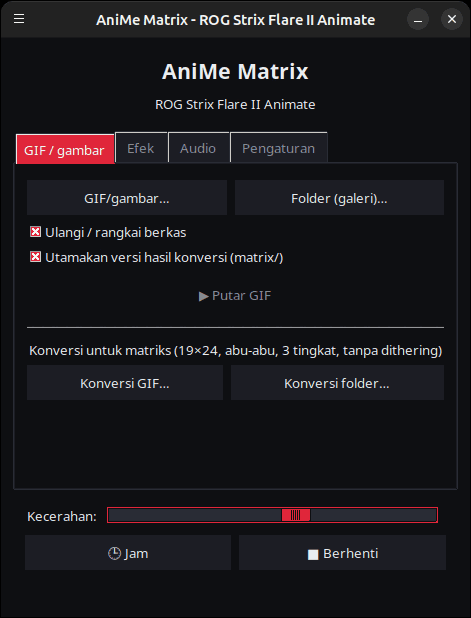
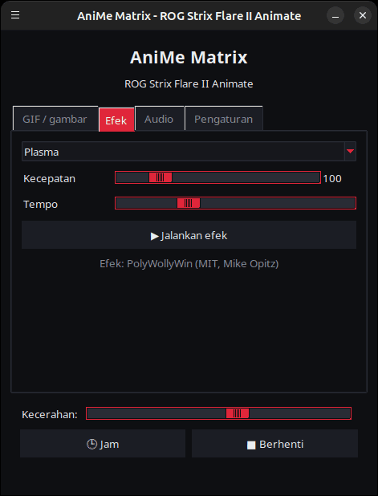
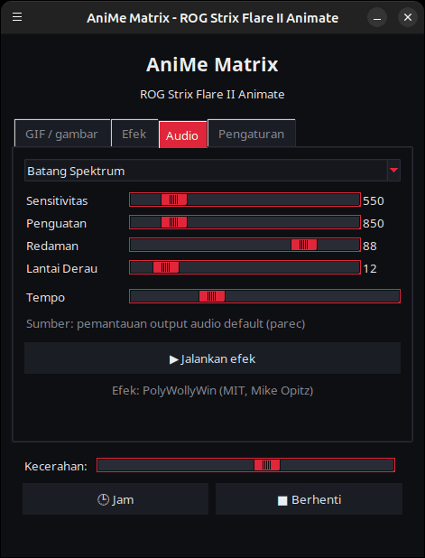
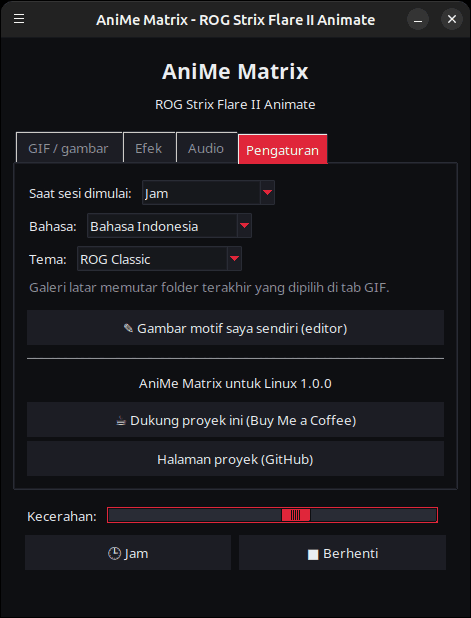

<p align="center">
  
</p>

# AniMe Matrix untuk Linux — ROG Strix Flare II Animate

[](https://github.com/AntiCitoyen/Anticitoyen-ROG-flare2-anime-matrix/releases/latest)
[](../../LICENSE)
[](https://buymeacoffee.com/anticitoyen)

Mengendalikan layar **AniMe Matrix** (312 mini-LED) pada keyboard **ASUS ROG Strix Flare II Animate** di Linux, tanpa Armoury Crate maupun Windows: GIF dan gambar, galeri latar belakang, jam, 19 efek animasi, 7 visualizer audio, menggambar LED demi LED.

Antarmuka aplikasi tersedia dalam 19 bahasa, mengikuti bahasa sistem secara otomatis, dan dapat diubah di tab *Pengaturan* → *Bahasa:*.

<div align="center">

[🇫🇷 Français](../../README.md) · [🇬🇧 English](README.en.md) · [🇪🇸 Español](README.es.md) · [🇩🇪 Deutsch](README.de.md) · [🇮🇹 Italiano](README.it.md) · [🇧🇷 Português](README.pt-BR.md) · [🇳🇱 Nederlands](README.nl.md) · [🇵🇱 Polski](README.pl.md) · [🇷🇺 Русский](README.ru.md) · [🇺🇦 Українська](README.uk.md) · [🇹🇷 Türkçe](README.tr.md) · [🇸🇦 العربية](README.ar.md) · [🇮🇳 हिन्दी](README.hi.md) · [🇨🇳 简体中文](README.zh-CN.md) · [🇹🇼 繁體中文](README.zh-TW.md) · [🇯🇵 日本語](README.ja.md) · [🇰🇷 한국어](README.ko.md) · [🇻🇳 Tiếng Việt](README.vi.md) · **🇮🇩 Bahasa Indonesia**

</div>

| GIF / gambar | Efek | Audio | Pengaturan |
|---|---|---|---|
|  |  |  |  |

<p align="center"></p>

---

## Daftar Isi

- [Fungsi proyek ini](#projet)
- [Perangkat keras yang didukung](#materiel)
- [Instalasi](#installation)
- [Penggunaan](#utilisation)
- [Menyiapkan GIF yang baik](#gif)
- [Cara kerja](#fonctionnement)
- [Pemecahan masalah](#depannage)
- [Struktur repositori](#depot)
- [Membangun paket .deb](#deb)
- [Kredit](#credits)
- [Lisensi](#licence)
- [Mendukung proyek](#soutien)

---

<a id="projet"></a>

## Fungsi proyek ini

ASUS hanya menyediakan layar AniMe Matrix pada keyboard ini untuk Windows (Armoury Crate). Proyek ini berkomunikasi langsung dengan keyboard melalui USB HID dan menghadirkan:

- **Peluncur grafis** (`animematrix`) dengan empat tab:
  - **GIF / gambar**: memutar satu atau beberapa berkas, atau seluruh folder sebagai galeri, secara berulang (loop); mengonversi GIF untuk matriks LED.
  - **Efek**: 19 animasi (Hujan Matriks V2, Plasma, Api, bintang, Kembang Api, Petir, Metaball, Gelombang, Ular, Teks Bergulir, Jam Bergaya, Reaksi Keyboard…), dapat diatur saat sedang berjalan.
  - **Audio**: 7 visualizer yang bereaksi terhadap suara yang diputar oleh PC (Batang Spektrum, KITT / KARR, Ledakan Bintang Tengah, Osiloskop, Api Audio…).
  - **Pengaturan**: apa yang ditampilkan saat sesi dibuka, editor gambar, tautan proyek.
- **Jam** HH:MM, dari peluncur atau sebagai layanan latar belakang.
- **Galeri latar belakang**: layanan `systemd --user` yang memutar folder GIF secara otomatis begitu sesi dibuka.
- **Sakelar sekali klik** (`animematrix-bascule`): ikon di menu menyalakan atau mematikan layar; klik kanan untuk memilih Galeri GIF, Jam, atau Matikan.
- **Konversi GIF yang disesuaikan untuk matriks** (`animematrix-convertir`): 19×24, abu-abu, 3 tingkat, tanpa dithering — lihat [docs/GUIDE-GIF.md](../GUIDE-GIF.md).
- **Editor gambar** LED demi LED (`animematrix-dessin`).
- **11 tema**: 5 terinspirasi ROG (Classic, Strix, Glitch, Gold, Carbon), 5 tema merah muda (Sakura, Permen karet, Emas mawar, Lavender merah muda, Malam merah muda) dan tema sistem, dipilih di *Pengaturan* → *Tema:*.
- **Konsumsi sumber daya rendah**: GIF didekode per bingkai; galeri berisi 400 GIF berjalan dengan memori sekitar 25 MB.

<a id="materiel"></a>

## Perangkat keras yang didukung

| Keyboard | USB | Antarmuka |
|---|---|---|
| ASUS ROG Strix Flare II Animate | `0b05:19fc` | HID, interface 4 (usage page `0xFF02`) |

Layar AniMe Matrix pada **laptop** ROG (Zephyrus G14, dll.) menggunakan protokol yang berbeda: perangkat tersebut **tidak** didukung di sini (gunakan `asusctl` sebagai gantinya).

Telah diuji pada Ubuntu 26.04 (X11, PipeWire). Distribusi apa pun dengan Python ≥ 3.10, hidapi, Tk, dan systemd seharusnya dapat digunakan.

<a id="installation"></a>

## Instalasi

### Paket .deb (Debian, Ubuntu, Mint, Pop!_OS…)

1. Unduh `anticitoyen-rog-flare2-anime-matrix_<version>_all.deb` dari halaman [Releases](https://github.com/AntiCitoyen/Anticitoyen-ROG-flare2-anime-matrix/releases/latest).
2. Instal (apt akan mengambil dependensinya):
   ```bash
   sudo apt install ./anticitoyen-rog-flare2-anime-matrix_*_all.deb
   ```
3. **Cabut lalu pasang kembali keyboard** (aturan udev memberikan akses kepada pengguna yang sedang login).
4. Jalankan **AniMe Matrix** dari menu aplikasi, atau `animematrix` di terminal.

Paket ini menginstal:

| Elemen | Lokasi |
|---|---|
| Program | `/usr/share/anticitoyen-rog-flare2-anime-matrix/` |
| Perintah | `animematrix`, `animematrix-bascule`, `animematrix-effet`, `animematrix-galerie`, `animematrix-horloge`, `animematrix-convertir`, `animematrix-dessin`, `animematrix-lecture` |
| Layanan pengguna | `/usr/lib/systemd/user/animematrix-galerie.service`, `animematrix-horloge.service`, `animematrix-lecture.service` (tidak diaktifkan secara default) |
| Aturan udev | `/usr/lib/udev/rules.d/72-rog-flare2-animate.rules` |
| Menu dan ikon | `animematrix.desktop`, ikon `animematrix` |

Uninstal: `sudo apt remove anticitoyen-rog-flare2-anime-matrix`.

### Dari sumber

```bash
git clone https://github.com/AntiCitoyen/Anticitoyen-ROG-flare2-anime-matrix.git
cd Anticitoyen-ROG-flare2-anime-matrix
python3 -m venv .venv
.venv/bin/pip install hidapi pillow numpy pynput
# akses keyboard tanpa root
sudo cp packaging/72-rog-flare2-animate.rules /etc/udev/rules.d/
sudo udevadm control --reload-rules && sudo udevadm trigger
# lalu cabut/pasang kembali keyboard
.venv/bin/python rog_flare2_launcher.py
```

Alat sistem yang berguna: `imagemagick` (konversi), `pulseaudio-utils` (`parec`, untuk audio), `zenity` (pemilih berkas), `libnotify-bin` (notifikasi sakelar).

Untuk layanan latar belakang dari sumber, salin `systemd/*.service` ke `~/.config/systemd/user/`, ganti baris `ExecStart=` dengan path ke `.venv/bin/python` dan skrip terkait (`rog_flare2_folder_player.py`, `rog_flare2_clock_v3.py`), lalu jalankan `systemctl --user daemon-reload`.

<a id="utilisation"></a>

## Penggunaan

### Peluncur

`animematrix` (atau entri **AniMe Matrix** pada menu).

- **GIF / gambar**: *GIF/gambar…* untuk memilih berkas, *Folder (galeri)…* untuk memilih seluruh folder. Folder yang dipilih juga menjadi folder galeri latar belakang. *Utamakan versi hasil konversi* akan membaca `dossier/matrix/nom.gif` jika berkas tersebut ada (dihasilkan oleh proses konversi).
- **Efek** dan **Audio**: pilih, atur, lalu *▶ Jalankan efek*. Penggeser (slider) bekerja secara langsung; *Tempo* mempercepat atau memperlambat animasi.
- **Kecerahan**, **🕒 Jam**, **■ Berhenti** (menghapus layar) tersedia di semua tab.
- **Pengaturan**: *Saat sesi dimulai* = Galeri GIF, Jam, Putar terakhir, atau Tidak ada.

**Saat peluncur ditutup, apa yang sedang ditampilkan tetap berjalan** (GIF, efek dengan pengaturannya saat itu, visualizer audio, atau jam): peluncur menyerahkannya ke layanan latar belakang `animematrix-lecture.service`. Pada peluncuran berikutnya, ia mengambil alih kendali begitu ada program lain yang dijalankan (hanya satu program yang dapat menulis ke keyboard). Menekan *■ Berhenti* sebelum menutup akan membuat layar tetap padam.

### Sakelar dan layanan latar belakang

```bash
animematrix-bascule            # nyala → mati; mati → mode terakhir
animematrix-bascule gif        # galeri latar, juga saat sesi dimulai
animematrix-bascule horloge    # jam latar, juga saat sesi dimulai
animematrix-bascule lecture    # putar terakhir dari peluncur, juga saat sesi dimulai
animematrix-bascule off        # mati, tidak ada saat sesi dimulai
animematrix-bascule etat       # mode saat ini
```

Pilihan yang sama juga tersedia melalui klik kanan pada ikon menu. Di baliknya: `systemctl --user enable --now animematrix-galerie.service` (atau `animematrix-horloge.service`).

### Baris perintah

| Perintah | Fungsi |
|---|---|
| `animematrix-effet --liste` | menampilkan daftar efek dan visualizer |
| `animematrix-effet "Plasma" --brightness 60 --vitesse 1.5` | menjalankan sebuah efek (Ctrl+C untuk menghentikan) |
| `animematrix-galerie [dossier] --brightness 60 [--originaux]` | memutar isi sebuah folder (secara default folder terakhir yang dipilih di peluncur, atau `~/Images/AniMe-Matrix` jika tidak ada) |
| `animematrix-lecture` | memutar ulang putar terakhir dari peluncur (`~/.config/rog-flare2/lecture.json`) |
| `animematrix-horloge -b 25` | jam; `--clear` menghapus layar, `--once --text 12:34` menampilkan teks |
| `animematrix-convertir dossier/ [--sortie D] [--force]` | mengonversi GIF untuk matriks LED (hasil di `dossier/matrix/`) |
| `animematrix-dessin` | editor gambar |

### Audio

Visualizer mendengarkan **monitor dari output suara default** melalui `parec` (PipeWire atau PulseAudio): visualizer bereaksi terhadap apa yang diputar oleh PC, bukan mikrofon. Untuk mengganti output, ubah output default sistem.

### Efek "Keyboard React"

Efek ini menyalakan layar mengikuti ritme ketikan berkat `pynput`, yang membaca tombol dari seluruh sesi selama efek berjalan. Efek ini berfungsi di X11; di Wayland, efek ini tidak menerima input tombol.

<a id="gif"></a>

## Menyiapkan GIF yang baik

Layar ini bukan berbentuk persegi panjang: 24 baris yang bergeser, dari 19 LED di bagian atas hingga 7 LED di bagian bawah, 3 tingkat abu-abu yang benar-benar berbeda, dan ada efek halo di antara LED yang berdekatan. Siluet, piktogram, teks pendek, dan gerakan lambat tampil baik; foto dan video tidak.

Panduan lengkap (ukuran kanvas, tingkat abu-abu, kecepatan bingkai, kecerahan, perintah ImageMagick): **[docs/GUIDE-GIF.md](../GUIDE-GIF.md)**.

<a id="fonctionnement"></a>

## Cara kerja

- **Transport**: hidapi membuka interface HID nomor 4 pada keyboard dan menulis bingkai data (frame) berukuran **1024 byte**.
- **Bingkai data**: `60 81 00 00` + **312 byte** (satu nilai kecerahan 0–255 per LED, sesuai urutan perangkat keras) + byte nol hingga mencapai 1024.
- **Geometri**: 24 baris yang bergeser secara diagonal (19 → 7 LED), atau secara setara 12 baris logis dari 37 → 15 kolom (model milik PolyWollyWin); kedua pemetaan tersebut telah diverifikasi identik pada seluruh 312 LED.
- **GIF**: setiap bingkai direkonstruksi ulang (GIF yang dioptimalkan hanya menyimpan perbedaannya), diubah ke skala abu-abu, disesuaikan menjadi 24 baris, dan disampel baris demi baris.
- **Animasi**: tidak ada memori internal yang digunakan; animasi dihasilkan dengan cara host mengirimkan bingkai satu demi satu (~30 fps untuk efek).

Catatan reverse engineering aslinya (tangkapan USBPcap, urutan LED, titik kalibrasi) ada di **[docs/PROTOCOL.md](../PROTOCOL.md)**; berkas tangkapan `*.cap` serta alat `parse_usbpcap.py` / `rog_flare2_replay_capture.py` tetap berada di repositori bagi yang ingin menelusuri lebih jauh.

⚠️ Jangan kirim paket data AniMe Matrix milik laptop (`0x5E …`, `0xEC …`) ke keyboard ini: itu bukan protokol yang tepat dan dapat membuat keyboard macet (cabut lalu pasang kembali, atau tahan **Fn + Esc** selama 10–15 detik).

<a id="depannage"></a>

## Pemecahan masalah

| Gejala | Kemungkinan penyebab | Solusi |
|---|---|---|
| `interface 4 not found` | keyboard tidak terdeteksi atau tidak ada izin | `lsusb \| grep 0b05:19fc`; aturan udev sudah terpasang? cabut lalu pasang kembali |
| `Permission denied` / `open failed` | aturan udev belum diterapkan | jalankan `sudo udevadm control --reload-rules && sudo udevadm trigger`, lalu pasang kembali |
| Layar tidak berubah | program lain sudah menulis ke layar | `animematrix-bascule off`, tutup peluncur atau skrip lain |
| Visualizer tetap dalam mode demo | tidak ada `parec` atau tidak ada suara | instal `pulseaudio-utils`, putar suara |
| "Keyboard React" tidak bereaksi | sesi Wayland atau `pynput` tidak ada | gunakan sesi X11, `sudo apt install python3-pynput` |
| Galeri latar belakang tidak berjalan | folder kosong atau tidak ada | pilih folder di peluncur (tab GIF) |
| Log sebuah layanan | — | `journalctl --user -u animematrix-galerie.service -f` |

<a id="depot"></a>

## Struktur repositori

| Berkas | Fungsi |
|---|---|
| `rog_flare2_launcher.py` | peluncur grafis (Tk) |
| `rog_flare2_effets.py` | efek dan visualizer audio (engine PolyWollyWin yang disesuaikan untuk Linux) |
| `polywollywin/` | engine efek dari PolyWollyWin, disalin tanpa modifikasi (MIT) |
| `rog_flare2_folder_player.py` | galeri latar belakang (layanan) |
| `rog_flare2_lecture.py` | pemutaran latar belakang: melanjutkan apa yang ditampilkan peluncur saat ditutup (layanan) |
| `rog_flare2_clock_v3.py` | jam (layanan) |
| `rog_flare2_bascule.sh` | sakelar galeri / jam / mati |
| `rog_flare2_convertir.py` | konversi GIF (ImageMagick) |
| `rog_flare2_matrix_paint.py` | transport HID, urutan LED, editor gambar |
| `parse_usbpcap.py`, `rog_flare2_replay_capture.py`, `*.cap` | alat dan tangkapan reverse engineering |
| `systemd/` | layanan pengguna |
| `packaging/` | aturan udev, entri menu, ikon, berkas dan skrip paket .deb |
| `docs/` | panduan GIF, catatan protokol, tangkapan layar |

<a id="deb"></a>

## Membangun paket .deb

```bash
packaging/build-deb.sh
# → dist/anticitoyen-rog-flare2-anime-matrix_<version>_all.deb
```

Hanya `dpkg-deb` dan `bash` yang diperlukan; nomor versi dibaca dari `rog_flare2_launcher.py` (`VERSION`).

<a id="credits"></a>

## Kredit

- **NicRoss512** — reverse engineering protokol, jam dan editor aslinya: [ASUS-ROG-Strix-Flare-II-Animate-AniMe-Matrix-Protocol](https://github.com/NicRoss512/ASUS-ROG-Strix-Flare-II-Animate-AniMe-Matrix-Protocol). Repositori ini bermula dari sana; riwayat commit-nya dipertahankan.
- **Mike Opitz** — [PolyWollyWin](https://github.com/MikeOpitz99/PolyWollyWin) (MIT), pengontrol Windows yang engine efek dan visualizer audionya digunakan kembali di sini.
- **Yoshi Walsh** — [Mastering the AniMe Matrix](https://blog.yoshiwalsh.me/asus-anime-matrix/), untuk perilaku LED (halo, tingkat kecerahan yang dipersepsikan, kecepatan bingkai).

Proyek independen, tidak berafiliasi dengan ASUS. "ROG", "AniMe Matrix", dan "Armoury Crate" adalah merek dagang milik ASUSTeK.

<a id="licence"></a>

## Lisensi

[MIT](../../LICENSE) untuk kode dalam repositori ini. `polywollywin/` tetap menggunakan lisensi MIT dari penulis aslinya ([polywollywin/LICENSE](../../polywollywin/LICENSE)). Berkas asli dari NicRoss512 (`rog_flare2_clock_v3.py`, `rog_flare2_matrix_paint.py`, `parse_usbpcap.py`, `rog_flare2_replay_capture.py`, `docs/PROTOCOL.md`, tangkapan) dipublikasikan tanpa lisensi eksplisit dan tetap menjadi hak penulis aslinya; berkas-berkas ini didistribusikan ulang dengan atribusi.

<a id="soutien"></a>

## Mendukung proyek

Jika proyek ini bermanfaat bagi Anda, secangkir kopi akan membantu perawatannya:

[](https://buymeacoffee.com/anticitoyen)

**https://buymeacoffee.com/anticitoyen** — tautan ini juga tersedia di tab *Pengaturan* pada peluncur.

Laporan bug dan ide: [Issues](https://github.com/AntiCitoyen/Anticitoyen-ROG-flare2-anime-matrix/issues).
