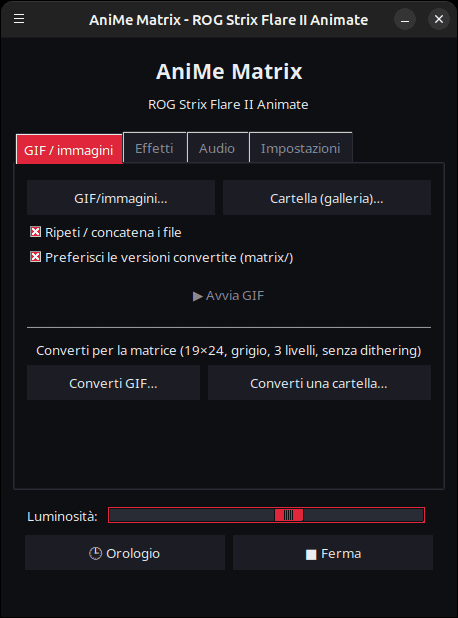
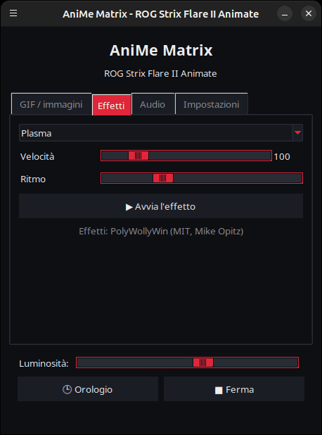
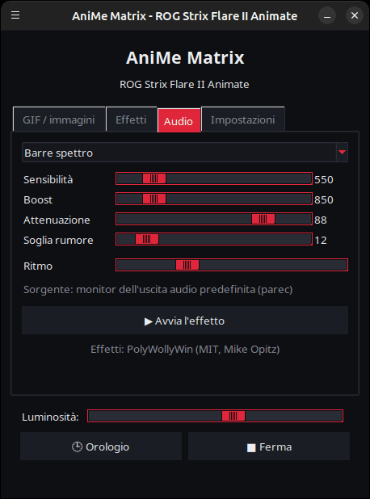
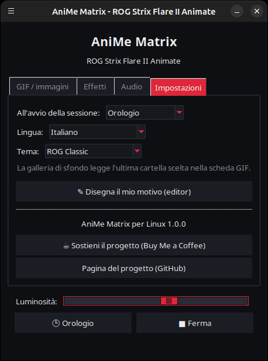

<p align="center">
  
</p>

# AniMe Matrix per Linux — ROG Strix Flare II Animate

[](https://github.com/AntiCitoyen/Anticitoyen-ROG-flare2-anime-matrix/releases/latest)
[](../../LICENSE)
[](https://buymeacoffee.com/anticitoyen)

Pilotare su Linux lo schermo **AniMe Matrix** (312 mini-LED) della tastiera **ASUS ROG Strix Flare II Animate**, senza Armoury Crate né Windows: GIF e immagini, galleria di sfondo, orologio, 19 effetti animati, 7 visualizzatori audio, disegno LED per LED.

L'interfaccia dell'applicazione è disponibile in 19 lingue: segue automaticamente la lingua del sistema e può essere cambiata nella scheda *Impostazioni* → *Lingua:*.

<div align="center">

[🇫🇷 Français](../../README.md) · [🇬🇧 English](README.en.md) · [🇪🇸 Español](README.es.md) · [🇩🇪 Deutsch](README.de.md) · **🇮🇹 Italiano** · [🇧🇷 Português](README.pt-BR.md) · [🇳🇱 Nederlands](README.nl.md) · [🇵🇱 Polski](README.pl.md) · [🇷🇺 Русский](README.ru.md) · [🇺🇦 Українська](README.uk.md) · [🇹🇷 Türkçe](README.tr.md) · [🇸🇦 العربية](README.ar.md) · [🇮🇳 हिन्दी](README.hi.md) · [🇨🇳 简体中文](README.zh-CN.md) · [🇹🇼 繁體中文](README.zh-TW.md) · [🇯🇵 日本語](README.ja.md) · [🇰🇷 한국어](README.ko.md) · [🇻🇳 Tiếng Việt](README.vi.md) · [🇮🇩 Bahasa Indonesia](README.id.md)

</div>

| GIF / immagini | Effetti | Audio | Impostazioni |
|---|---|---|---|
|  |  |  |  |

<p align="center"></p>

---

## Indice

- [Cosa fa il progetto](#projet)
- [Hardware supportato](#materiel)
- [Installazione](#installation)
- [Utilizzo](#utilisation)
- [Preparare buoni GIF](#gif)
- [Come funziona](#fonctionnement)
- [Risoluzione dei problemi](#depannage)
- [Organizzazione del repository](#depot)
- [Costruire il pacchetto .deb](#deb)
- [Crediti](#credits)
- [Licenza](#licence)
- [Sostenere il progetto](#soutien)

---

<a id="projet"></a>

## Cosa fa il progetto

ASUS fornisce lo schermo AniMe Matrix di questa tastiera solo su Windows (Armoury Crate). Questo progetto comunica direttamente con la tastiera via USB HID e offre:

- **Un lanciatore grafico** (`animematrix`) in quattro schede:
  - **GIF / immagini**: riprodurre uno o più file, o un'intera cartella in galleria, in loop; convertire GIF per la matrice.
  - **Effetti**: 19 animazioni (pioggia in stile Matrix, plasma, fuoco, stelle, fuochi d'artificio, fulmini, metaball, onda, serpente, testo scorrevole, orologio stilizzato, reazione alla tastiera…), regolabili mentre sono in esecuzione.
  - **Audio**: 7 visualizzatori che reagiscono al suono riprodotto dal PC (spettro, KITT/KARR, starburst, oscilloscopio, fuoco audio…).
  - **Impostazioni**: cosa viene mostrato all'apertura della sessione, editor di disegno, link del progetto.
- **Un orologio** HH:MM, dal lanciatore o come servizio in background.
- **Una galleria di sfondo**: un servizio `systemd --user` che scorre una cartella di GIF fin dall'apertura della sessione.
- **Un interruttore a un clic** (`animematrix-bascule`): l'icona nel menu accende o spegne lo schermo; il clic destro permette di scegliere Galleria GIF, Orologio o Schermo spento.
- **Una conversione di GIF adatta alla matrice** (`animematrix-convertir`): 19×24, grigi, 3 livelli, senza dithering — vedi [../GUIDE-GIF.md](../GUIDE-GIF.md).
- **Un editor di disegno** LED per LED (`animematrix-dessin`).
- **11 temi**: 5 ispirati a ROG (Classic, Strix, Glitch, Gold, Carbon), 5 rosa (Sakura, Zucchero filato, Oro rosa, Rosa lavanda, Notte rosa) e quello di sistema, selezionabili in *Impostazioni* → *Tema:*.
- **Un basso consumo**: i GIF vengono decodificati fotogramma per fotogramma; una galleria di 400 GIF gira con circa 25 MB di memoria.

<a id="materiel"></a>

## Hardware supportato

| Tastiera | USB | Interfaccia |
|---|---|---|
| ASUS ROG Strix Flare II Animate | `0b05:19fc` | HID, interfaccia 4 (usage page `0xFF02`) |

Gli schermi AniMe Matrix dei **portatili** ROG (Zephyrus G14, ecc.) usano un protocollo diverso: **non** sono supportati qui (vedere piuttosto `asusctl`).

Testato su Ubuntu 26.04 (X11, PipeWire). Qualsiasi distribuzione con Python ≥ 3.10, hidapi, Tk e systemd dovrebbe andare bene.

<a id="installation"></a>

## Installazione

### Pacchetto .deb (Debian, Ubuntu, Mint, Pop!_OS…)

1. Scaricare `anticitoyen-rog-flare2-anime-matrix_<version>_all.deb` dalla pagina [Releases](https://github.com/AntiCitoyen/Anticitoyen-ROG-flare2-anime-matrix/releases/latest).
2. Installarlo (apt recupera le dipendenze):
   ```bash
   sudo apt install ./anticitoyen-rog-flare2-anime-matrix_*_all.deb
   ```
3. **Scollegare e ricollegare la tastiera** (la regola udev concede l'accesso all'utente connesso).
4. Avviare **AniMe Matrix** dal menu delle applicazioni, oppure `animematrix` da terminale.

Il pacchetto installa:

| Elemento | Posizione |
|---|---|
| Programmi | `/usr/share/anticitoyen-rog-flare2-anime-matrix/` |
| Comandi | `animematrix`, `animematrix-bascule`, `animematrix-effet`, `animematrix-galerie`, `animematrix-horloge`, `animematrix-convertir`, `animematrix-dessin`, `animematrix-lecture` |
| Servizi utente | `/usr/lib/systemd/user/animematrix-galerie.service`, `animematrix-horloge.service`, `animematrix-lecture.service` (non attivati di default) |
| Regola udev | `/usr/lib/udev/rules.d/72-rog-flare2-animate.rules` |
| Menu e icona | `animematrix.desktop`, icona `animematrix` |

Disinstallazione: `sudo apt remove anticitoyen-rog-flare2-anime-matrix`.

### Dai sorgenti

```bash
git clone https://github.com/AntiCitoyen/Anticitoyen-ROG-flare2-anime-matrix.git
cd Anticitoyen-ROG-flare2-anime-matrix
python3 -m venv .venv
.venv/bin/pip install hidapi pillow numpy pynput
# accesso alla tastiera senza root
sudo cp packaging/72-rog-flare2-animate.rules /etc/udev/rules.d/
sudo udevadm control --reload-rules && sudo udevadm trigger
# poi scollegare/ricollegare la tastiera
.venv/bin/python rog_flare2_launcher.py
```

Strumenti di sistema utili: `imagemagick` (conversione), `pulseaudio-utils` (`parec`, per l'audio), `zenity` (selettori di file), `libnotify-bin` (notifiche dell'interruttore).

Per i servizi in background dai sorgenti, copiare `systemd/*.service` in `~/.config/systemd/user/` sostituendo le righe `ExecStart=` con il percorso di `.venv/bin/python` e dello script (`rog_flare2_folder_player.py`, `rog_flare2_clock_v3.py`), poi `systemctl --user daemon-reload`.

<a id="utilisation"></a>

## Utilizzo

### Il lanciatore

`animematrix` (oppure la voce **AniMe Matrix** nel menu).

- **GIF / immagini**: *GIF/immagini…* per una selezione, *Cartella (galleria)…* per un'intera cartella. La cartella scelta diventa anche quella della galleria di sfondo. *Preferisci le versioni convertite* legge `dossier/matrix/nom.gif` quando esiste (prodotto dalla conversione).
- **Effetti** e **Audio**: scegliere, regolare, *▶ Avvia l'effetto*. I cursori agiscono in tempo reale; *Ritmo* accelera o rallenta l'animazione.
- **Luminosità**, **🕒 Orologio**, **■ Ferma** (che cancella lo schermo) sono comuni a tutte le schede.
- **Impostazioni**: *All'avvio della sessione:* = Galleria GIF, Orologio, Ultima riproduzione o Niente.

**Quando si chiude il lanciatore, ciò che è visualizzato continua** (GIF, effetto con le sue impostazioni del momento, visualizzatore audio o orologio): il lanciatore lo affida al servizio in background `animematrix-lecture.service`. Al prossimo avvio, riprende il controllo non appena si avvia qualcos'altro (un solo programma può scrivere sulla tastiera). *■ Ferma* prima di chiudere lascia lo schermo spento.

### Interruttore e servizi in background

```bash
animematrix-bascule            # acceso → spento ; spento → ultima modalità
animematrix-bascule gif        # galleria di sfondo, anche all'apertura di sessione
animematrix-bascule horloge    # orologio di sfondo, anche all'apertura di sessione
animematrix-bascule lecture    # ultima riproduzione del lanciatore, anche all'apertura di sessione
animematrix-bascule off        # spento, niente all'apertura
animematrix-bascule etat       # modalità corrente
```

Le stesse scelte sono nel clic destro dell'icona nel menu. Dietro le quinte: `systemctl --user enable --now animematrix-galerie.service` (o `animematrix-horloge.service`).

### Da riga di comando

| Comando | Ruolo |
|---|---|
| `animematrix-effet --liste` | elenca gli effetti e i visualizzatori |
| `animematrix-effet "Plasma" --brightness 60 --vitesse 1.5` | avvia un effetto (Ctrl+C per fermare) |
| `animematrix-galerie [dossier] --brightness 60 [--originaux]` | scorre una cartella (per default l'ultima scelta nel lanciatore, altrimenti `~/Images/AniMe-Matrix`) |
| `animematrix-lecture` | riproduce di nuovo l'ultima riproduzione del lanciatore (`~/.config/rog-flare2/lecture.json`) |
| `animematrix-horloge -b 25` | orologio; `--clear` cancella lo schermo, `--once --text 12:34` mostra un testo |
| `animematrix-convertir dossier/ [--sortie D] [--force]` | converte GIF per la matrice (in `dossier/matrix/`) |
| `animematrix-dessin` | editor di disegno |

### Audio

I visualizzatori ascoltano il **monitor dell'uscita audio predefinita** con `parec` (PipeWire o PulseAudio): reagiscono a ciò che riproduce il PC, non al microfono. Per cambiare uscita, cambiare l'uscita predefinita del sistema.

### Effetto « Keyboard React »

Accende lo schermo al ritmo della digitazione grazie a `pynput`, che legge i tasti di tutta la sessione finché l'effetto è attivo. Funziona su X11; su Wayland non riceve i tasti.

<a id="gif"></a>

## Preparare buoni GIF

Lo schermo non è un rettangolo: 24 righe sfalsate, da 19 LED in alto a 7 in basso, 3 livelli di grigio veramente distinti, un alone tra LED vicini. Le sagome, i pittogrammi, i testi brevi e i movimenti lenti rendono bene; le foto e i video no.

La guida completa (dimensione della tela, livelli, frequenza, luminosità, comando ImageMagick): **[../GUIDE-GIF.md](../GUIDE-GIF.md)**.

<a id="fonctionnement"></a>

## Come funziona

- **Trasporto**: hidapi apre l'interfaccia HID n° 4 della tastiera e vi scrive trame da **1024 byte**.
- **Trama**: `60 81 00 00` + **312 byte** (una luminosità 0–255 per LED, nell'ordine hardware) + zeri fino a 1024.
- **Geometria**: 24 righe sfalsate in diagonale (19 → 7 LED), oppure in modo equivalente 12 righe logiche da 37 → 15 colonne (modello di PolyWollyWin); le due corrispondenze sono state verificate identiche sui 312 LED.
- **GIF**: ogni fotogramma viene ricomposto (i GIF ottimizzati memorizzano solo le differenze), convertito in grigio, riportato a 24 righe e campionato riga per riga.
- **Animazione**: nessuna memoria integrata utilizzata; l'animazione consiste nell'host che invia le trame una dopo l'altra (~30 f/s per gli effetti).

Le note originali di reverse engineering (catture USBPcap, ordine dei LED, punti di calibrazione) sono in **[../PROTOCOL.md](../PROTOCOL.md)**; le catture `*.cap` e gli strumenti `parse_usbpcap.py` / `rog_flare2_replay_capture.py` restano nel repository per chi vuole approfondire.

⚠️ Non inviare alla tastiera i pacchetti degli AniMe Matrix dei portatili (`0x5E …`, `0xEC …`): non è il protocollo corretto e può bloccare la tastiera (scollegare/ricollegare, oppure tenere premuto **Fn + Esc** per 10–15 s).

<a id="depannage"></a>

## Risoluzione dei problemi

| Sintomo | Causa probabile | Soluzione |
|---|---|---|
| `interface 4 not found` | tastiera non rilevata o permessi mancanti | `lsusb \| grep 0b05:19fc`; regola udev installata? scollegare/ricollegare |
| `Permission denied` / `open failed` | regola udev non applicata | `sudo udevadm control --reload-rules && sudo udevadm trigger`, poi ricollegare |
| Lo schermo non cambia | un altro programma sta già scrivendo | `animematrix-bascule off`, chiudere gli altri lanciatori o script |
| I visualizzatori restano in modalità demo | `parec` assente o nessun suono | installare `pulseaudio-utils`, riprodurre audio |
| « Keyboard React » non reagisce | sessione Wayland o `pynput` assente | sessione X11, `sudo apt install python3-pynput` |
| La galleria di sfondo non si avvia | cartella vuota o assente | scegliere una cartella nel lanciatore (scheda GIF) |
| Log di un servizio | — | `journalctl --user -u animematrix-galerie.service -f` |

<a id="depot"></a>

## Organizzazione del repository

| File | Ruolo |
|---|---|
| `rog_flare2_launcher.py` | lanciatore grafico (Tk) |
| `rog_flare2_effets.py` | effetti e visualizzatori audio (motore PolyWollyWin adattato a Linux) |
| `polywollywin/` | motore di effetti di PolyWollyWin, copiato senza modifiche (MIT) |
| `rog_flare2_folder_player.py` | galleria di sfondo (servizio) |
| `rog_flare2_lecture.py` | riproduzione in background: riprende ciò che il lanciatore mostrava alla chiusura (servizio) |
| `rog_flare2_clock_v3.py` | orologio (servizio) |
| `rog_flare2_bascule.sh` | interruttore galleria / orologio / spento |
| `rog_flare2_convertir.py` | conversione GIF (ImageMagick) |
| `rog_flare2_matrix_paint.py` | trasporto HID, ordine dei LED, editor di disegno |
| `parse_usbpcap.py`, `rog_flare2_replay_capture.py`, `*.cap` | strumenti e catture di reverse engineering |
| `systemd/` | servizi utente |
| `packaging/` | regola udev, voce di menu, icona, file e script del pacchetto .deb |
| `docs/` | guida GIF, note di protocollo, screenshot |

<a id="deb"></a>

## Costruire il pacchetto .deb

```bash
packaging/build-deb.sh
# → dist/anticitoyen-rog-flare2-anime-matrix_<version>_all.deb
```

Sono necessari solo `dpkg-deb` e `bash`; la versione viene letta da `rog_flare2_launcher.py` (`VERSION`).

<a id="credits"></a>

## Crediti

- **NicRoss512** — reverse engineering del protocollo, orologio ed editor originali: [ASUS-ROG-Strix-Flare-II-Animate-AniMe-Matrix-Protocol](https://github.com/NicRoss512/ASUS-ROG-Strix-Flare-II-Animate-AniMe-Matrix-Protocol). Questo repository ne deriva; la sua cronologia è conservata.
- **Mike Opitz** — [PolyWollyWin](https://github.com/MikeOpitz99/PolyWollyWin) (MIT), controller Windows di cui viene ripreso qui il motore di effetti e visualizzatori audio.
- **Yoshi Walsh** — [Mastering the AniMe Matrix](https://blog.yoshiwalsh.me/asus-anime-matrix/), per il comportamento dei LED (alone, livelli percepiti, frequenza).

Progetto indipendente, non affiliato ad ASUS. « ROG », « AniMe Matrix » e « Armoury Crate » sono marchi di ASUSTeK.

<a id="licence"></a>

## Licenza

[MIT](../../LICENSE) per il codice di questo repository. `polywollywin/` resta sotto la licenza MIT del suo autore ([../../polywollywin/LICENSE](../../polywollywin/LICENSE)). I file originali di NicRoss512 (`rog_flare2_clock_v3.py`, `rog_flare2_matrix_paint.py`, `parse_usbpcap.py`, `rog_flare2_replay_capture.py`, `../PROTOCOL.md`, catture) sono stati pubblicati senza licenza esplicita e restano del loro autore; sono ridistribuiti con attribuzione.

<a id="soutien"></a>

## Sostenere il progetto

Se questo progetto ti è utile, un caffè aiuta a mantenerlo:

[](https://buymeacoffee.com/anticitoyen)

**https://buymeacoffee.com/anticitoyen** — il link si trova anche nella scheda *Impostazioni* del lanciatore.

Segnalazioni di bug e idee: [Issues](https://github.com/AntiCitoyen/Anticitoyen-ROG-flare2-anime-matrix/issues).
