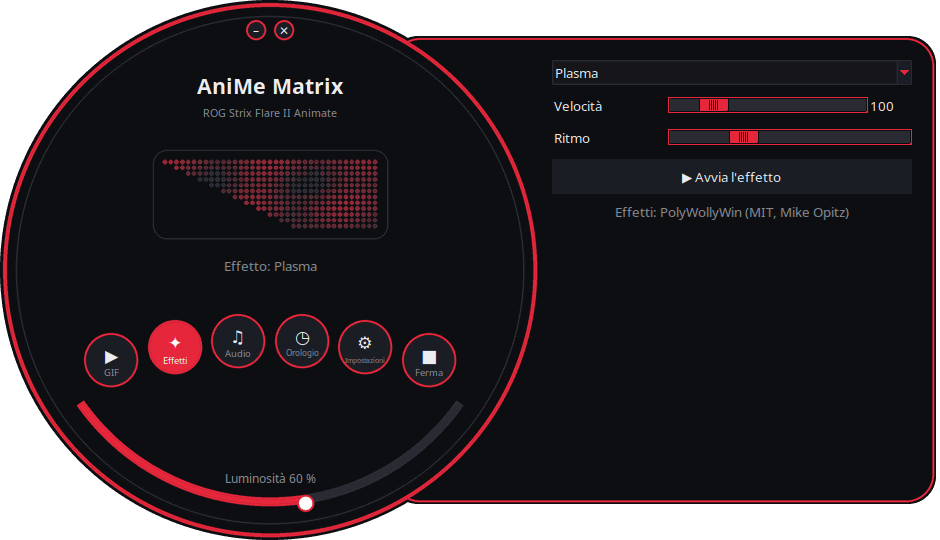
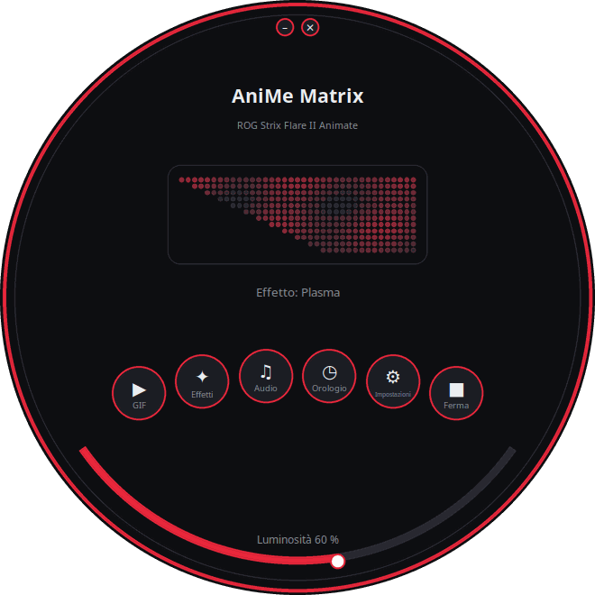
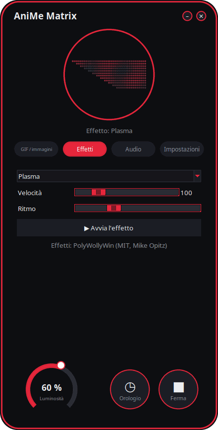
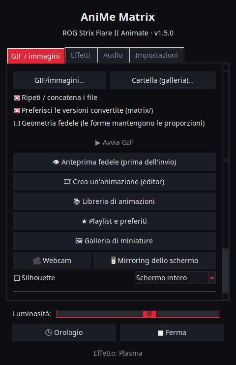

<p align="center">
  
</p>

# AniMe Matrix per Linux — ROG Strix Flare II Animate

[](https://github.com/AntiCitoyen/Anticitoyen-ROG-flare2-anime-matrix/releases/latest)
[](https://github.com/AntiCitoyen/Anticitoyen-ROG-flare2-anime-matrix/actions/workflows/ci.yml)
[](../../LICENSE)
[](https://buymeacoffee.com/anticitoyen)

Pilotare su Linux lo schermo **AniMe Matrix** (312 mini-LED) della tastiera **ASUS ROG Strix Flare II Animate**, senza Armoury Crate né Windows: GIF e galleria, orologio, effetti e visualizzatori audio, giochi, monitor di sistema, notifiche del desktop, programmazione oraria, editor di animazioni, libreria condivisa, colori della tastiera sincronizzati.

<div align="center">

[🇫🇷 Français](../../README.md) · [🇬🇧 English](README.en.md) · [🇪🇸 Español](README.es.md) · [🇩🇪 Deutsch](README.de.md) · **🇮🇹 Italiano** · [🇧🇷 Português](README.pt-BR.md) · [🇳🇱 Nederlands](README.nl.md) · [🇵🇱 Polski](README.pl.md) · [🇷🇺 Русский](README.ru.md) · [🇺🇦 Українська](README.uk.md) · [🇹🇷 Türkçe](README.tr.md) · [🇸🇦 العربية](README.ar.md) · [🇮🇳 हिन्दी](README.hi.md) · [🇨🇳 简体中文](README.zh-CN.md) · [🇹🇼 繁體中文](README.zh-TW.md) · [🇯🇵 日本語](README.ja.md) · [🇰🇷 한국어](README.ko.md) · [🇻🇳 Tiếng Việt](README.vi.md) · [🇮🇩 Bahasa Indonesia](README.id.md)

</div>

<p align="center"><br><em>Quadrante + cassetto (interfaccia predefinita)</em></p>

| Quadrante | Arrotondata | Classica |
|:---:|:---:|:---:|
|  |  |  |

<p align="center"></p>

---

## Indice

- [Cosa fa il progetto](#projet)
- [Hardware supportato](#materiel)
- [Installazione](#installation)
- [Utilizzo](#utilisation)
- [Preparare buoni GIF](#gif)
- [Come funziona](#fonctionnement)
- [Risoluzione dei problemi](#depannage)
- [Organizzazione del repository](#depot)
- [Costruire i pacchetti](#deb)
- [Crediti](#credits)
- [Licenza](#licence)
- [Sostenere il progetto](#soutien)

---

<a id="projet"></a>

## Cosa fa il progetto

ASUS fornisce lo schermo AniMe Matrix di questa tastiera solo su Windows (Armoury Crate). Questo progetto comunica direttamente con la tastiera via USB HID e offre:

**Visualizzare**
- **GIF, immagini e video**: un file, una selezione o un'intera cartella in galleria, da trascinare e rilasciare sulla finestra; video (MP4, WebM, MKV…) riprodotti da ffmpeg; galleria di miniature; fotogrammi convertiti conservati in cache (una galleria di 400 GIF occupa circa 25 MB di memoria).
- **Orologio**: quadrante digitale, analogico, binario, a parole (francese, inglese, tedesco, spagnolo, italiano, portoghese, olandese) o stilizzato.
- **Effetti animati** (pioggia in stile Matrix, plasma, fuoco, stelle, fuochi d'artificio, fulmini, metaball, onda…) e **7 visualizzatori audio** che reagiscono al suono riprodotto dal PC.
- **Testo**: il tuo messaggio, in tutte le scritture (accenti, cirillico, arabo, hindi, cinese, giapponese, coreano…), che scorre verso sinistra, verso destra, verso l'alto, verso il basso, oppure fisso.
- **Webcam** (immagine o sagoma) e **mirroring dello schermo** (schermo intero, attorno al mouse o finestra attiva).
- **Monitor di sistema**: CPU, RAM, GPU, temperatura, velocità di rete e ora, sotto forma di indicatori.
- **Brano in riproduzione**: al cambio di traccia, « ARTISTA - TITOLO » scorre una volta, poi un visualizzatore (Spotify, VLC, Rhythmbox, browser… via MPRIS).
- **Notifiche del desktop**: « APP: TITOLO » viene mostrato in sovrimpressione, poi la riproduzione riprende (disattivate per default, elenco di applicazioni autorizzate).
- **Giochi** giocabili da tastiera: Snake, Pong (da soli o in due), Tetris, rompimattoncini, Invaders, Flappy, con record.
- **Indicatori**: piccoli blocchi luminosi quando il microfono è disattivato o in uso, quando la webcam è attiva, quando OBS trasmette o registra.
- **Memoria della tastiera**: un'animazione (GIF, immagine) salvata nella tastiera si vede senza alcun software, appena collegata, anche su un altro PC; luminosità regolabile (scheda GIF, `animematrix-ctl memoire`). Si possono scegliere anche le 6 animazioni integrate (KO, Meteorite, Occhio, Love, Halloween, Avvio): `animematrix-ctl clavier 1`…`6`.

**Creare**
- **Editor di animazioni** fotogramma per fotogramma, sulla vera geometria dello schermo: 3 livelli, striscia dei fotogrammi, livello fantasma, spostamento, copia-incolla, anteprima, invio alla tastiera, esportazione GIF.
- **Libreria di animazioni** condivisa: sfogliare, riprodurre, aggiungere alla propria galleria, proporre le proprie.
- **Conversione intelligente** di GIF: ritaglio sul soggetto, soggetto chiaro su sfondo nero, contorni rinforzati, 3 livelli.
- **Anteprima fedele** prima dell'invio: rendering simulato dello schermo (disposizione reale, alone tra i LED).
- **Effetti come estensioni**: un file Python inserito in una cartella aggiunge un effetto (vedere [../EXTENSIONS.md](../EXTENSIONS.md)).

**Automatizzare**
- **Demone `animematrixd`**: unico proprietario dello schermo, continua a visualizzare quando il lanciatore è chiuso; comando `animematrix-ctl` e API HTTP locale opzionale.
- **Programmazione oraria**: fasce orarie (giorni, notte compresa) con orologio, galleria, monitor, brano in riproduzione, un effetto, una playlist o schermo spento; schermo nero quando la sessione è bloccata, in sospensione o quando un'applicazione è a schermo intero.
- **Profili per applicazione**: un contenuto proprio di un gioco o di un'applicazione finché è in primo piano (pulsante *Rileva*).
- **Playlist e preferiti**: GIF, effetti, orologio… ciascuno per la sua durata, in ciclo; anche nell'icona della barra di sistema e da riga di comando.
- **Telecomando web**: una pagina per controllare lo schermo da un telefono della rete locale (codice QR, token).
- **Fine dei comandi lunghi**: nel terminale, « Completato : make 2 min 05 » viene mostrato quando un comando lungo termina.
- **Colori ed effetti dei tasti**, senza OpenRGB: arcobaleno, statico, respiro, ciclo, reattivo, increspatura, notte stellata, sabbie mobili, corrente, pioggia — eseguiti dalla tastiera e conservati dopo averla scollegata; oppure il colore del tema, pulsazione con lo schermo.
- **Icona nella barra di sistema**: menu rapido (modalità, luminosità).

**Comodità**
- **4 interfacce** (*Quadrante + cassetto* predefinita, *Quadrante*, *Arrotondata*, *Classica*) con **anteprima dal vivo dei 312 LED**, **11 temi** (5 ROG, 5 rosa, di sistema) e **19 lingue**.
- **X11 e Wayland**: reazione alla tastiera tramite evdev, finestra attiva letta da Sway, Hyprland, KDE (kdotool) o GNOME (estensione *Window Calls*).
- **Aggiornamenti integrati**: il lanciatore scarica l'ultima release, ne verifica l'impronta SHA-256 e la installa (password di amministratore); oppure `apt upgrade` con il repository APT.

<a id="materiel"></a>

## Hardware supportato

| Dispositivo | USB | Stato |
|---|---|---|
| ASUS ROG Strix Flare II Animate | `0b05:19fc` | supportato (HID, interfaccia 4, usage page `0xFF02`) |
| Schermi AniMe Matrix dei portatili ROG (G14, G16…) | vari | **sperimentale** tramite `asusctl`, non testato su hardware reale (vedere [Utilizzo](#utilisation)) |

Testato su Ubuntu 26.04 (X11, PipeWire, Cinnamon). Qualsiasi distribuzione con Python ≥ 3.10, hidapi, Tk e systemd dovrebbe andare bene; su Wayland, il lanciatore passa per XWayland.

<a id="installation"></a>

## Installazione

### Repository APT (Debian, Ubuntu, Mint, Pop!_OS…) — aggiornamenti con `apt upgrade`

```bash
curl -fsSL https://anticitoyen.github.io/Anticitoyen-ROG-flare2-anime-matrix/animematrix.gpg \
  | sudo tee /usr/share/keyrings/animematrix.gpg >/dev/null
echo "deb [signed-by=/usr/share/keyrings/animematrix.gpg] https://anticitoyen.github.io/Anticitoyen-ROG-flare2-anime-matrix stable main" \
  | sudo tee /etc/apt/sources.list.d/animematrix.list
sudo apt update && sudo apt install anticitoyen-rog-flare2-anime-matrix
```

Poi **scollegare e ricollegare la tastiera** (la regola udev concede l'accesso all'utente connesso) e avviare **AniMe Matrix** dal menu.

### Altri formati (pagina [Releases](https://github.com/AntiCitoyen/Anticitoyen-ROG-flare2-anime-matrix/releases/latest))

| Sistema | File | Installazione |
|---|---|---|
| Debian, Ubuntu… | `anticitoyen-rog-flare2-anime-matrix_<version>_all.deb` | `sudo apt install ./anticitoyen-rog-flare2-anime-matrix_*_all.deb` |
| Fedora, openSUSE… | `anticitoyen-rog-flare2-anime-matrix-<version>-1.noarch.rpm` | `sudo dnf install ./anticitoyen-rog-flare2-anime-matrix-*.noarch.rpm` |
| Arch, Manjaro… | `anticitoyen-rog-flare2-anime-matrix-<version>-1-any.pkg.tar.zst` | `sudo pacman -U anticitoyen-rog-flare2-anime-matrix-*.pkg.tar.zst` |
| Tutti (Flatpak) | `AniMeMatrix-<version>.flatpak` | `flatpak install --user AniMeMatrix-*.flatpak` (installare anche la regola udev qui sotto; nessun visualizzatore audio) |

Il pacchetto installa:

| Elemento | Posizione |
|---|---|
| Programmi | `/usr/share/anticitoyen-rog-flare2-anime-matrix/` |
| Comandi | `animematrix`, `animematrixd`, `animematrix-ctl`, `animematrix-bascule`, `animematrix-animation`, `animematrix-apercu`, `animematrix-convertir`, `animematrix-effet`, `animematrix-galerie`, `animematrix-horloge`, `animematrix-dessin`, `animematrix-tray`, `animematrix-memoire` |
| Servizio utente | `/usr/lib/systemd/user/animematrixd.service` (attivato per tutte le sessioni) |
| Regola udev | `/usr/lib/udev/rules.d/72-rog-flare2-animate.rules` |
| Menu e icona | `animematrix.desktop`, icona `animematrix` |

### Dai sorgenti

```bash
git clone https://github.com/AntiCitoyen/Anticitoyen-ROG-flare2-anime-matrix.git
cd Anticitoyen-ROG-flare2-anime-matrix
python3 -m venv .venv
.venv/bin/pip install hidapi pillow numpy pynput python-xlib
# accesso alla tastiera senza root
sudo cp packaging/72-rog-flare2-animate.rules /etc/udev/rules.d/
sudo udevadm control --reload-rules && sudo udevadm trigger
# poi scollegare/ricollegare la tastiera
.venv/bin/python rog_flare2_launcher.py
```

Strumenti di sistema utili: `imagemagick` (conversione classica), `pulseaudio-utils` (`parec`, per l'audio), `zenity` (selettori di file), `libnotify-bin` (notifiche), `python3-gi` e `gir1.2-ayatanaappindicator3-0.1` (icona nella barra di sistema), `ffmpeg` (video, webcam, mirroring dello schermo), `python3-evdev` (reazione alla tastiera su Wayland), `x11-utils` (finestra attiva su X11), `python3-qrcode` (codice QR del telecomando), `tkdnd` (trascinamento).

<a id="utilisation"></a>

## Utilizzo

### Il lanciatore

`animematrix` (oppure la voce **AniMe Matrix** nel menu).

Nelle interfacce rotonde, i pulsanti rotondi aprono i blocchi *GIF*, *Effetti*, *Audio* e *Impostazioni* (nel cassetto o nel cerchio); *Orologio* e *Ferma* agiscono subito; l'arco in basso regola la luminosità; si sposta la finestra trascinandola dallo sfondo; i piccoli pulsanti in alto riducono a icona o chiudono. La forma rotonda usa l'estensione X11 SHAPE (pacchetto `python3-xlib`); senza di essa, la stessa interfaccia viene mostrata in una finestra rettangolare.

- **GIF / immagini**: *GIF/immagini…* o *Cartella (galleria)…* (oppure trascinare e rilasciare sulla finestra); *Geometria fedele* mantiene le proporzioni (l'angolo taglia l'immagine invece di deformarla); *👁 Anteprima fedele (prima dell'invio)* mostra il rendering senza inviare nulla; *🎞 Crea un'animazione (editor)*; *📚 Libreria di animazioni*; *★ Playlist e preferiti*; *🖼 Galleria di miniature* (clic: riproduci, clic destro: preferito); *🎥 Webcam* e *🖥 Mirroring dello schermo*; *Conversione intelligente* per convertire le GIF.
- **Effetti** e **Audio**: scegliere, regolare, *▶ Avvia l'effetto*. I cursori agiscono in tempo reale; *Ritmo* accelera o rallenta l'intera animazione. L'effetto *Testo* accetta il tuo messaggio e la sua direzione di scorrimento. I giochi si giocano con le frecce, Spazio e Invio, con la finestra del lanciatore in primo piano; Pong in due: Z/W e S per il giocatore di sinistra.
- **Luminosità**, **🕒 Orologio**, **■ Ferma** (che cancella lo schermo) sono comuni a tutte le schede.
- **Impostazioni**: avvio della sessione (Galleria GIF, Orologio, Ultima riproduzione o Niente), quadrante dell'orologio, lingua, tema, interfaccia, notifiche del desktop, colori della tastiera, *Programmazione…* (trigger, profili per applicazione, fasce orarie), *Indicatori…*, *Telecomando web…*, icona nella barra di sistema, fine dei comandi lunghi, cartella delle estensioni, aggiornamenti.

**Chiudere il lanciatore non interrompe nulla**: il demone `animematrixd` continua a visualizzare. *■ Ferma* spegne lo schermo.

### Demone e riga di comando

```bash
animematrix-ctl etat                               # cosa è visualizzato
animematrix-ctl gif ~/Images/AniMe-Matrix --fidele # galleria (cartella o file)
animematrix-ctl effet "Plasma" --param speed=250   # effetto e impostazioni
animematrix-ctl horloge
animematrix-ctl texte "Bonjour"
animematrix-ctl effet "Text" --param message="Salut" --param direction=haut
animematrix-ctl liste "Soirée"                     # playlist (senza nome: le elenca)
animematrix-ctl favori 2                           # preferito n° 2 (senza numero: li elenca)
animematrix-ctl notifier "Café prêt" --duree 5     # sovrimpressione poi ritorno
animematrix-ctl memoire anim.gif                   # salvata nella tastiera (al massimo 196 fotogrammi)
animematrix-ctl clavier                            # mostra l'animazione salvata
animematrix-ctl luminosite 60
animematrix-ctl stop
```

| Comando | Ruolo |
|---|---|
| `animematrix-bascule [gif\|horloge\|lecture\|off\|etat]` | interruttore (anche nel clic destro dell'icona del menu); la modalità scelta è anche quella di avvio della sessione |
| `animematrixd --http 8765` | demone con API HTTP locale (`POST http://127.0.0.1:8765/api`, `Content-Type: application/json`, stesso JSON del socket) |
| `animematrix-animation [file.gif]` | editor di animazioni |
| `animematrix-apercu file.gif -o anteprima.gif` | anteprima fedele di una GIF (file) |
| `animematrix-convertir cartella/ [--fidele] [--classique]` | converte le GIF per la matrice (in `cartella/matrix/`) |
| `animematrix-effet --liste` | elenca gli effetti e i visualizzatori |
| `animematrix-dessin` | editor LED per LED (restituisce il controllo al demone alla chiusura) |

### Audio

I visualizzatori ascoltano il **monitor dell'uscita audio predefinita** con `parec` (PipeWire o PulseAudio): reagiscono a ciò che riproduce il PC, non al microfono.

### Effetto « Keyboard React »

Accende lo schermo al ritmo della digitazione, finché l'effetto è attivo: su X11 tramite `pynput`, su Wayland leggendo la tastiera in `/dev/input` (`python3-evdev`). Su Wayland, se l'effetto resta in modalità demo, autorizzare la lettura della sola tastiera ROG:

```bash
sudo cp /usr/share/anticitoyen-rog-flare2-anime-matrix/udev/73-rog-flare2-animate-touches.rules /etc/udev/rules.d/
sudo udevadm control --reload-rules && sudo udevadm trigger
```

### Indicatori

*Impostazioni* → *Indicatori (microfono, webcam, OBS)…*: un blocco di 2 × 2 LED si accende in alto a sinistra dello schermo, sopra la riproduzione (1: microfono disattivato o in uso, 2: webcam in uso, 3: OBS in diretta o in registrazione), e ogni cambiamento può essere annunciato da un testo scorrevole. OBS: attivare il server WebSocket (*Strumenti* → *Impostazioni del server WebSocket*) e riportarne la porta e la password.

### Telecomando web

*Impostazioni* → *Telecomando web…*: spuntare *Attiva*, poi aprire l'indirizzo (o leggere il codice QR) su un telefono della stessa rete. La pagina mostra lo schermo dal vivo e propone orologio, galleria, effetti, preferiti, playlist, luminosità e messaggio. L'indirizzo contiene un token: non condividerlo, cambialo con *Nuovo token*; la pagina non è cifrata (HTTP): solo su una rete fidata.

### Fine dei comandi lunghi

*Impostazioni* → *Mostra la fine dei comandi lunghi (terminale)* aggiunge una riga a `~/.bashrc` (e `~/.zshrc`): ogni comando di oltre 30 secondi mostra alla fine « Completato : make 2 min 05 » o « Non riuscito (2) : … ». Soglia: `ANIMEMATRIX_FIN_SECONDES`; i comandi interattivi (editor, `ssh`, `less`…) vengono ignorati.

### Colori della tastiera

*Impostazioni* → *🌈 Colori della tastiera…*: effetto (arcobaleno, statico, respiro, ciclo dei colori, reattivo, increspatura, notte stellata, sabbie mobili, corrente, pioggia), colori, velocità, luminosità, direzione. *Prova* lo applica, *Salva nella tastiera* lo conserva dopo averla scollegata. *Colore del tema* e *Pulsazione con lo schermo* li invia il demone tasto per tasto; uscendone, torna l'effetto salvato. Da riga di comando: `animematrix-ctl rgb arc-en-ciel --vitesse 70`, `animematrix-ctl rgb statique --couleur "#ff0000"`. Altre due modalità software: *Immagine dello schermo* (i tasti riproducono lo schermo, ingrandito) e *Spettro audio* (una barra per colonna). Ogni fascia oraria e ogni profilo di applicazione può anche scegliere i colori dei tasti (*Programmazione…*). *Tasto per tasto*: un colore per tasto, dipinto con il mouse su una mappa della tastiera (AZERTY o QWERTY).

### Portatili ROG (sperimentale)

Scrivere `portable-asusctl` in `~/.config/rog-flare2/materiel` poi riavviare il demone: i frame passano tramite `asusctl anime image` (al massimo 5 immagini al secondo). Non testato su un portatile reale: riscontri benvenuti nei ticket.

<a id="gif"></a>

## Preparare buoni GIF

Lo schermo non è un rettangolo: 24 righe sfalsate, da 19 LED in alto a 7 in basso (bordo destro verticale, bordo sinistro in diagonale), 3 livelli di grigio realmente distinti, un alone tra LED vicini. Le sagome, i pittogrammi, i testi brevi e i movimenti lenti rendono bene; le foto e i video, poco.

La guida completa (tela, livelli, ritmo, conversione, geometria fedele): **[../GUIDE-GIF.md](../GUIDE-GIF.md)**.

<a id="fonctionnement"></a>

## Come funziona

- **Trasporto**: hidapi apre l'interfaccia HID n° 4 della tastiera e vi scrive trame da **1024 byte**; la tastiera restituisce ogni trama.
- **Trama**: `60 81 00 00` + **312 byte** (una luminosità 0–255 per LED, nell'ordine hardware) + zeri fino a 1024.
- **Geometria**: 24 righe sfalsate (la riga r copre le colonne (r+1)//2 fino a 18), oppure in modo equivalente 12 righe logiche da 37 → 15 colonne (modello di PolyWollyWin); le due corrispondenze sono state verificate identiche sui 312 LED.
- **Demone**: `animematrixd` gestisce da solo la tastiera; riproduzione di base e sovrimpressione (notifiche); socket JSON `$XDG_RUNTIME_DIR/animematrix.sock`; riconnessione automatica della tastiera.
- **Animazione**: l'host invia le trame una dopo l'altra (~30 f/s per gli effetti); la memoria interna della tastiera non viene utilizzata (ricerca: [../RECHERCHE-MEMOIRE.md](../RECHERCHE-MEMOIRE.md)).

Le note originali di reverse engineering sono in **[../PROTOCOL.md](../PROTOCOL.md)**; le catture `*.cap` e gli strumenti `parse_usbpcap.py` / `rog_flare2_replay_capture.py` restano nel repository.

⚠️ Non inviare alla tastiera i pacchetti degli AniMe Matrix dei portatili (`0x5E …`, `0xEC …`): non è il protocollo corretto e può bloccare la tastiera (scollegare/ricollegare, oppure tenere premuto **Fn + Esc** per 10–15 s).

<a id="depannage"></a>

## Risoluzione dei problemi

| Sintomo | Causa probabile | Soluzione |
|---|---|---|
| `interface 4 not found` | tastiera non rilevata o permessi mancanti | `lsusb \| grep 0b05:19fc`; regola udev installata? scollegare/ricollegare |
| `Permission denied` / `open failed` | regola udev non applicata | `sudo udevadm control --reload-rules && sudo udevadm trigger`, poi ricollegare |
| « Servizio animematrixd non raggiungibile » | demone fermo | `systemctl --user restart animematrixd.service` oppure `animematrixd &` |
| Lo schermo non cambia | un altro programma scrive sulla tastiera | chiudere i vecchi script; `animematrix-ctl etat` |
| I visualizzatori restano in modalità demo | nessun `parec` o nessun suono | installare `pulseaudio-utils`, riprodurre audio |
| « Keyboard React » non reagisce | `pynput` (X11) o `python3-evdev` (Wayland) assente, oppure tastiera illeggibile | installare il pacchetto; su Wayland, la regola udev di [Keyboard React](#utilisation) |
| Webcam, video o mirroring dello schermo inattivi | `ffmpeg` assente | `sudo apt install ffmpeg`; su Wayland, il mirroring dello schermo passa dal portale (`gstreamer1.0-pipewire`) |
| Profili per applicazione o schermo intero senza effetto su Wayland | finestra attiva sconosciuta al compositor | GNOME: estensione *Window Calls*; KDE: `kdotool`; Sway e Hyprland: niente da fare |
| La finestra rotonda viene mostrata come un rettangolo | estensione SHAPE o `python3-xlib` mancante | `sudo apt install python3-xlib`, oppure *Impostazioni* → *Interfaccia:* → *Classica* |
| Log del demone | — | `journalctl --user -u animematrixd.service -f` |

<a id="depot"></a>

## Organizzazione del repository

| File | Ruolo |
|---|---|
| `rog_flare2_launcher.py` | lanciatore grafico (Tk) |
| `rog_flare2_ui_ronde.py`, `rog_flare2_themes.py` | interfacce rotonde, temi |
| `rog_flare2_i18n.py`, `locale/` | traduzione (19 lingue; `locale/_cles.json` = testi da tradurre; [../TRADUIRE.md](../TRADUIRE.md)) |
| `rog_flare2_demon.py`, `rog_flare2_ctl.py` | demone `animematrixd`, client e comando `animematrix-ctl` |
| `rog_flare2_core.py` | riproduzione GIF in streaming, cache dei fotogrammi, orologio, geometria |
| `rog_flare2_texte.py`, `rog_flare2_horloges.py` | testo in tutte le scritture, effetto *Testo*, quadranti dell'orologio |
| `rog_flare2_listes.py`, `rog_flare2_vignettes.py` | playlist, preferiti, galleria di miniature, trascinamento |
| `rog_flare2_video.py`, `rog_flare2_voyants.py`, `rog_flare2_telecommande.py` | video, webcam, mirroring dello schermo; indicatori; telecomando web |
| `rog_flare2_touches.py`, `rog_flare2_fenetre.py`, `rog_flare2_fin.py`, `rog_flare2_flatpak.py` | tasti e finestra attiva (X11, Wayland), fine dei comandi lunghi, Flatpak |
| `rog_flare2_effets.py`, `polywollywin/` | effetti e visualizzatori (motore PolyWollyWin, MIT), estensioni |
| `rog_flare2_infos.py`, `rog_flare2_mpris.py`, `rog_flare2_jeux.py` | monitor di sistema, brano in riproduzione, giochi |
| `rog_flare2_notifs.py`, `rog_flare2_programme.py`, `rog_flare2_ui_programme.py` | notifiche, programmazione oraria e trigger |
| `rog_flare2_rgb.py`, `rog_flare2_tray.py`, `rog_flare2_portable.py` | colori ed effetti dei tasti, icona nella barra di sistema, portatili (sperimentale) |
| `rog_flare2_animation.py`, `rog_flare2_simulateur.py`, `rog_flare2_convertir.py` | editor di animazioni, simulatore, conversione |
| `rog_flare2_bibliotheque.py`, `bibliotheque/` | libreria di animazioni (catalogo, GIF CC0) |
| `rog_flare2_maj.py` | aggiornamenti dalle release |
| `rog_flare2_matrix_paint.py`, `rog_flare2_clock_v3.py`, `rog_flare2_folder_player.py` | trasporto HID ed editor LED, orologio, galleria (strumenti originali) |
| `parse_usbpcap.py`, `rog_flare2_replay_capture.py`, `*.cap` | reverse engineering |
| `examples/effets/` | esempio di estensione |
| `tests/` | test (incluse interfacce con clic reali) |
| `systemd/`, `packaging/` | servizio utente; .deb, RPM, Arch, Flatpak, repository APT |
| `docs/` | guida GIF, estensioni, protocollo, ricerca, screenshot, README tradotti |

<a id="deb"></a>

## Costruire i pacchetti

```bash
packaging/build-deb.sh
# → dist/anticitoyen-rog-flare2-anime-matrix_<version>_all.deb
```

`packaging/install.sh` installa il progetto in qualsiasi albero di directory; viene usato per il .deb, l'RPM (`packaging/rpm/`), il pacchetto Arch (`packaging/aur/`) e il Flatpak (`packaging/flathub/`). A ogni release pubblicata, GitHub costruisce l'RPM, il pacchetto Arch e il Flatpak, e aggiorna il repository APT firmato. La versione viene letta in `rog_flare2_core.py` (`VERSION`). Test: `python -m pytest tests`.

<a id="credits"></a>

## Crediti

- **NicRoss512** — reverse engineering del protocollo, orologio ed editor originali: [ASUS-ROG-Strix-Flare-II-Animate-AniMe-Matrix-Protocol](https://github.com/NicRoss512/ASUS-ROG-Strix-Flare-II-Animate-AniMe-Matrix-Protocol). Questo repository ne deriva; la sua cronologia è conservata.
- **Mike Opitz** — [PolyWollyWin](https://github.com/MikeOpitz99/PolyWollyWin) (MIT), controller Windows di cui viene ripreso qui il motore di effetti e visualizzatori audio.
- **Yoshi Walsh** — [Mastering the AniMe Matrix](https://blog.yoshiwalsh.me/asus-anime-matrix/), per il comportamento dei LED (alone, livelli percepiti, ritmo).
- **asus-linux** — [asusctl](https://gitlab.com/asus-linux/asusctl), utilizzato per gli schermi dei portatili.

Progetto indipendente, non affiliato ad ASUS. « ROG », « AniMe Matrix » e « Armoury Crate » sono marchi di ASUSTeK.

<a id="licence"></a>

## Licenza

[MIT](../../LICENSE) per il codice di questo repository; le animazioni di `bibliotheque/` sono sotto CC0. `polywollywin/` resta sotto la licenza MIT del suo autore ([../../polywollywin/LICENSE](../../polywollywin/LICENSE)). I file originali di NicRoss512 (`rog_flare2_clock_v3.py`, `rog_flare2_matrix_paint.py`, `parse_usbpcap.py`, `rog_flare2_replay_capture.py`, `../PROTOCOL.md`, catture) sono stati pubblicati senza licenza esplicita e restano del loro autore; sono ridistribuiti con attribuzione.

<a id="soutien"></a>

## Sostenere il progetto

Se questo progetto ti è utile, un caffè aiuta a mantenerlo:

[](https://buymeacoffee.com/anticitoyen)

**https://buymeacoffee.com/anticitoyen** — il link si trova anche nella scheda *Impostazioni* del lanciatore.

Segnalazioni di bug, idee e animazioni da condividere: [Issues](https://github.com/AntiCitoyen/Anticitoyen-ROG-flare2-anime-matrix/issues). Traduzioni: [../TRADUIRE.md](../TRADUIRE.md).
