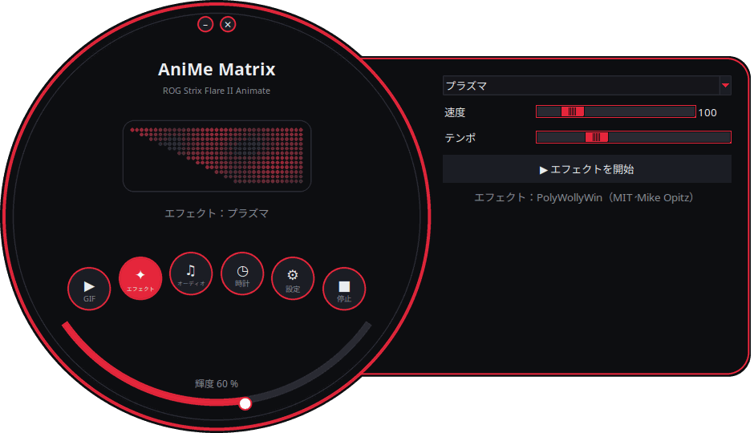
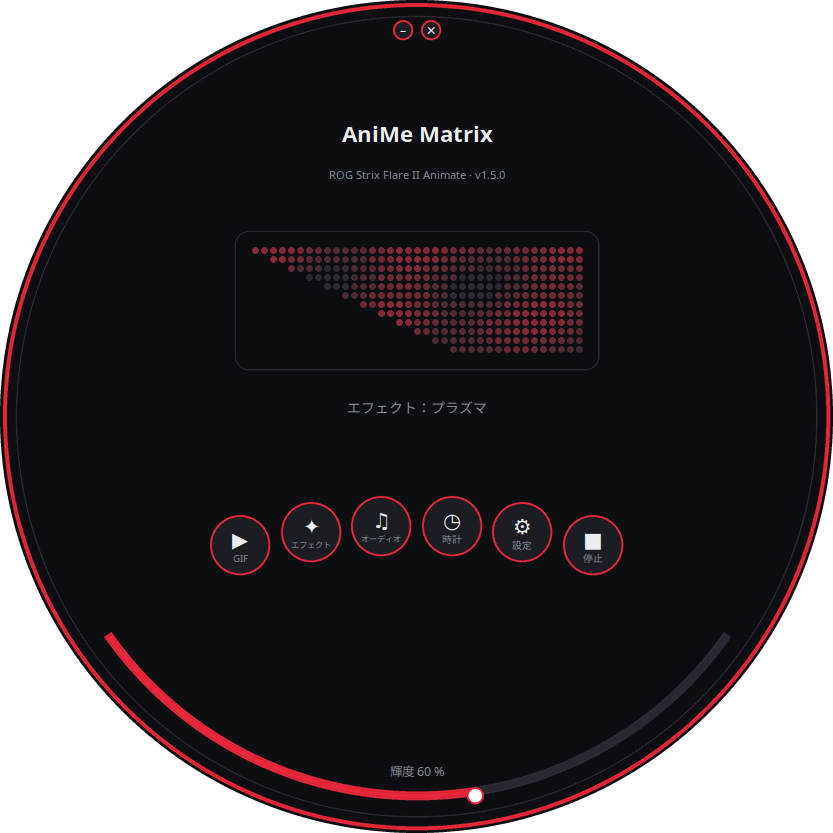
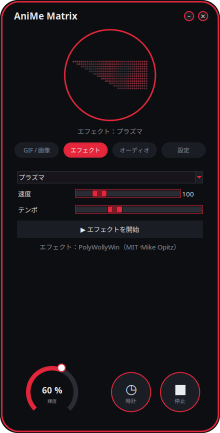
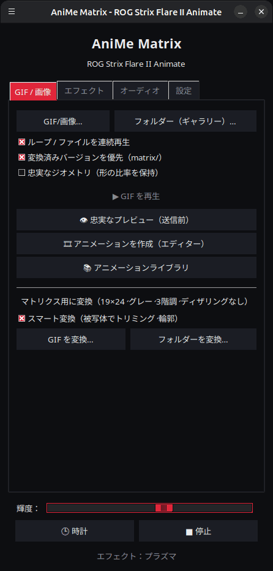

<p align="center">
  
</p>

# Linux 向け AniMe Matrix — ROG Strix Flare II Animate

[](https://github.com/AntiCitoyen/Anticitoyen-ROG-flare2-anime-matrix/releases/latest)
[](https://github.com/AntiCitoyen/Anticitoyen-ROG-flare2-anime-matrix/actions/workflows/ci.yml)
[](../../LICENSE)
[](https://buymeacoffee.com/anticitoyen)

**ASUS ROG Strix Flare II Animate** キーボードの **AniMe Matrix**(312 個のミニ LED)ディスプレイを、Armoury Crate も Windows も使わずに Linux 上で直接制御します。GIF とギャラリー、時計、エフェクトとオーディオビジュアライザー、ゲーム、システムモニター、デスクトップ通知、スケジュール機能、アニメーションエディター、共有アニメーションライブラリ、キーボードの色の同期。

<div align="center">

[🇫🇷 Français](../../README.md) · [🇬🇧 English](README.en.md) · [🇪🇸 Español](README.es.md) · [🇩🇪 Deutsch](README.de.md) · [🇮🇹 Italiano](README.it.md) · [🇧🇷 Português](README.pt-BR.md) · [🇳🇱 Nederlands](README.nl.md) · [🇵🇱 Polski](README.pl.md) · [🇷🇺 Русский](README.ru.md) · [🇺🇦 Українська](README.uk.md) · [🇹🇷 Türkçe](README.tr.md) · [🇸🇦 العربية](README.ar.md) · [🇮🇳 हिन्दी](README.hi.md) · [🇨🇳 简体中文](README.zh-CN.md) · [🇹🇼 繁體中文](README.zh-TW.md) · **🇯🇵 日本語** · [🇰🇷 한국어](README.ko.md) · [🇻🇳 Tiếng Việt](README.vi.md) · [🇮🇩 Bahasa Indonesia](README.id.md)

</div>

<p align="center"><br><em>ダイヤル＋ドロワー (既定のインターフェース)</em></p>

| ダイヤル | 角丸 | クラシック |
|:---:|:---:|:---:|
|  |  |  |

<p align="center"></p>

---

## 目次

- [このプロジェクトについて](#projet)
- [対応ハードウェア](#materiel)
- [インストール](#installation)
- [使い方](#utilisation)
- [適切な GIF を作る](#gif)
- [仕組み](#fonctionnement)
- [トラブルシューティング](#depannage)
- [リポジトリ構成](#depot)
- [パッケージのビルド](#deb)
- [クレジット](#credits)
- [ライセンス](#licence)
- [プロジェクトを支援する](#soutien)

---

<a id="projet"></a>

## このプロジェクトについて

ASUS はこのキーボードの AniMe Matrix ディスプレイを Windows(Armoury Crate)専用としてしか提供していません。本プロジェクトは USB HID 経由でキーボードと直接通信し、次を提供します。

**表示**
- **GIF、画像、動画**:1 つのファイル、複数選択、またはフォルダー全体をギャラリーとして再生。ウィンドウへのドラッグ＆ドロップにも対応。動画(MP4、WebM、MKV など)は ffmpeg で再生。サムネイルギャラリー。変換済みのフレームはキャッシュに保存(400 個の GIF からなるギャラリーはメモリ使用量約 25 MB)。
- **時計**:デジタル、アナログ、バイナリ、ワード(フランス語、英語、ドイツ語、スペイン語、イタリア語、ポルトガル語、オランダ語)、装飾の文字盤。
- **アニメーションエフェクト**(マトリックスレイン、プラズマ、炎、星空、花火、稲妻、メタボール、波など)と、PC が再生する音に反応する**7 種類のオーディオビジュアライザー**。
- **テキスト**:あらゆる文字体系(アクセント付き文字、キリル文字、アラビア文字、ヒンディー語、中国語、日本語、韓国語など)でメッセージを表示。左、右、上、下へのスクロール、または固定表示。
- **Webカメラ**(映像またはシルエット)と**画面ミラー**(画面全体、マウス周辺、またはアクティブウィンドウ)。
- **システムモニター**:CPU、メモリ、GPU、温度、ネットワーク速度、時刻をゲージ表示。
- **再生中の曲**:曲が変わると「アーティスト - タイトル」が一度スクロール表示され、その後ビジュアライザーに切り替わります(Spotify、VLC、Rhythmbox、ブラウザーなど、MPRIS 経由)。
- **デスクトップ通知**:「アプリ名:タイトル」がオーバーレイ表示され、その後再生に戻ります(デフォルトでは無効、許可するアプリのリストあり)。
- **キーボードで遊べるゲーム**:スネーク、ポン(1 人または 2 人)、テトリス、ブロック崩し、インベーダー、Flappy、ハイスコア記録付き。
- **インジケーター**:マイクのミュート中や使用中、Webカメラの使用中、OBS の配信中や録画中に、小さな光るブロックを表示。
- **キーボードのメモリ**：キーボードに保存したアニメーション（GIF、画像）は、接続するだけでソフトウェアなしに再生され、別の PC でも同じです。明るさは調整可能（GIF タブ、`animematrix-ctl memoire`）。 6 つの内蔵アニメーション（KO、流星、目、Love、ハロウィン、起動）も選べます：`animematrix-ctl clavier 1`…`6`。

**作成**
- **フレームごとのアニメーションエディター**、画面の実際の形状に基づく:3 階調、タイムライン、ゴーストレイヤー、オフセット、コピー&ペースト、プレビュー、キーボードへの送信、GIF エクスポート。
- **共有アニメーションライブラリ**:閲覧、再生、自分のギャラリーに追加、自作アニメーションの投稿。
- **スマート GIF 変換**:被写体でのトリミング、黒背景に浮かぶ被写体、強調された輪郭、3 階調。
- **忠実なプレビュー**(送信前):画面のシミュレーション表示(実際の配置、LED 間のにじみ)。
- **拡張エフェクト**:Python ファイルをフォルダーに置くだけでエフェクトを追加できます([EXTENSIONS.md](../EXTENSIONS.md) を参照)。

**自動化**
- **`animematrixd` デーモン**:画面の唯一の所有者で、ランチャーを閉じても表示を継続します。`animematrix-ctl` コマンドとオプションのローカル HTTP API を提供。
- **スケジュール機能**:時間帯(夜間を含む)ごとに時計、ギャラリー、モニター、再生中の曲、エフェクト、プレイリスト、または画面オフを設定;セッションのロック中、スリープ中、アプリのフルスクリーン時は画面を消灯。
- **アプリ別プロファイル**:ゲームやアプリが最前面にある間、そのアプリ専用の内容を表示(*検出* ボタン)。
- **プレイリストとお気に入り**:GIF、エフェクト、時計などを、それぞれ設定した時間ずつループ再生。システムトレイアイコンやコマンドラインからも利用可能。
- **Webリモコン**:ローカルネットワーク上のスマートフォンから画面を操作できるページ(QR コード、トークン)。
- **長いコマンドの終了**:ターミナルで長いコマンドが終わると「完了：make 2 min 05」と表示。
- **キーの色と効果**（OpenRGB 不要）：レインボー、スタティック、ブリージング、カラーサイクル、リアクティブ、リップル、星空、流砂、カレント、レイン。キーボード自身が実行し、取り外した後も残ります。テーマの色や画面と連動した点滅も可能です。
- **システムトレイアイコン**:クイックメニュー(モード、輝度)。

**快適性**
- **4 種類のインターフェース**(デフォルトは *ダイヤル＋ドロワー*、ほかに *ダイヤル*、*角丸*、*クラシック*)、**312 個の LED をライブプレビュー**、**11 種類のテーマ**(ROG 系 5 種、ピンク系 5 種、システム標準)、**19 の言語**に対応。
- **X11 と Wayland**:evdev でキーボードに反応し、アクティブウィンドウを Sway、Hyprland、KDE(kdotool)、GNOME(*Window Calls* 拡張機能)から取得。
- **組み込みアップデート**:ランチャーが最新のリリースをダウンロードし、SHA-256 のフィンガープリントを検証してからインストール(管理者パスワードが必要);または APT リポジトリ経由で `apt upgrade`。

<a id="materiel"></a>

## 対応ハードウェア

| デバイス | USB | 状態 |
|---|---|---|
| ASUS ROG Strix Flare II Animate | `0b05:19fc` | 対応(HID、インターフェース 4、usage page `0xFF02`) |
| ROG ノート PC の AniMe Matrix ディスプレイ(G14、G16 など) | 各種 | **実験的**、`asusctl` 経由、実機での未検証(「[使い方](#utilisation)」参照) |

Ubuntu 26.04(X11、PipeWire、Cinnamon)で動作確認済み。Python ≥ 3.10、hidapi、Tk、systemd を備えたディストリビューションであれば動作するはずです。Wayland では、ランチャーは XWayland 経由で動作します。

<a id="installation"></a>

## インストール

### APT リポジトリ(Debian、Ubuntu、Mint、Pop!_OS など)— `apt upgrade` でアップデート

```bash
curl -fsSL https://anticitoyen.github.io/Anticitoyen-ROG-flare2-anime-matrix/animematrix.gpg \
  | sudo tee /usr/share/keyrings/animematrix.gpg >/dev/null
echo "deb [signed-by=/usr/share/keyrings/animematrix.gpg] https://anticitoyen.github.io/Anticitoyen-ROG-flare2-anime-matrix stable main" \
  | sudo tee /etc/apt/sources.list.d/animematrix.list
sudo apt update && sudo apt install anticitoyen-rog-flare2-anime-matrix
```

その後、**キーボードを抜いてから再度接続**し(udev ルールによりログイン中のユーザーにアクセス権が付与されます)、メニューから **AniMe Matrix** を起動します。

### その他の形式([Releases](https://github.com/AntiCitoyen/Anticitoyen-ROG-flare2-anime-matrix/releases/latest) ページ)

| システム | ファイル | インストール方法 |
|---|---|---|
| Debian、Ubuntu など | `anticitoyen-rog-flare2-anime-matrix_<version>_all.deb` | `sudo apt install ./anticitoyen-rog-flare2-anime-matrix_*_all.deb` |
| Fedora、openSUSE など | `anticitoyen-rog-flare2-anime-matrix-<version>-1.noarch.rpm` | `sudo dnf install ./anticitoyen-rog-flare2-anime-matrix-*.noarch.rpm` |
| Arch、Manjaro など | `anticitoyen-rog-flare2-anime-matrix-<version>-1-any.pkg.tar.zst` | `sudo pacman -U anticitoyen-rog-flare2-anime-matrix-*.pkg.tar.zst` |
| すべて(Flatpak) | `AniMeMatrix-<version>.flatpak` | `flatpak install --user AniMeMatrix-*.flatpak`(下記の udev ルールも別途インストールが必要;オーディオビジュアライザーは非対応) |
| AUR | `aur-<version>.tar.gz` | PKGBUILD と .SRCINFO：`tar xf aur-*.tar.gz && cd anticitoyen-rog-flare2-anime-matrix && makepkg -si` |
| Copr | `anticitoyen-rog-flare2-anime-matrix-<version>-1.<fc>.src.rpm` | ソース RPM：`rpmbuild --rebuild anticitoyen-rog-flare2-anime-matrix-*.src.rpm`、または Copr プロジェクトへアップロード |
| Flathub | `flathub-<version>.tar.gz` | このバージョンに固定したマニフェストと `python3-modules.json`：Flathub への申請または `flatpak-builder` |
| Weblate | `translations-<version>.zip` | Weblate に取り込む翻訳ファイル（`locale/*.json`、ベース `_source.json`） |

このパッケージがインストールするもの:

| 項目 | 場所 |
|---|---|
| プログラム | `/usr/share/anticitoyen-rog-flare2-anime-matrix/` |
| コマンド | `animematrix`、`animematrixd`、`animematrix-ctl`、`animematrix-bascule`、`animematrix-animation`、`animematrix-apercu`、`animematrix-convertir`、`animematrix-effet`、`animematrix-galerie`、`animematrix-horloge`、`animematrix-dessin`、`animematrix-tray`, `animematrix-memoire` |
| ユーザーサービス | `/usr/lib/systemd/user/animematrixd.service`(すべてのセッションで有効) |
| udev ルール | `/usr/lib/udev/rules.d/72-rog-flare2-animate.rules` |
| メニューとアイコン | `animematrix.desktop`、アイコン `animematrix` |

### ソースから

```bash
git clone https://github.com/AntiCitoyen/Anticitoyen-ROG-flare2-anime-matrix.git
cd Anticitoyen-ROG-flare2-anime-matrix
python3 -m venv .venv
.venv/bin/pip install hidapi pillow numpy pynput python-xlib
# root 権限なしでキーボードにアクセスできるようにする
sudo cp packaging/72-rog-flare2-animate.rules /etc/udev/rules.d/
sudo udevadm control --reload-rules && sudo udevadm trigger
# その後、キーボードを抜き差しする
.venv/bin/python rog_flare2_launcher.py
```

役立つシステムツール:`imagemagick`(従来型の変換用)、`pulseaudio-utils`(オーディオ用の `parec`)、`zenity`(ファイル選択ダイアログ)、`libnotify-bin`(通知)、`python3-gi` と `gir1.2-ayatanaappindicator3-0.1`(システムトレイアイコン)、`ffmpeg`(動画、Webカメラ、画面ミラー)、`python3-evdev`(Wayland でのキーボード反応)、`x11-utils`(X11 でのアクティブウィンドウ)、`python3-qrcode`(リモコンの QR コード)、`tkdnd`(ドラッグ＆ドロップ)。

<a id="utilisation"></a>

## 使い方

### ランチャー

`animematrix`(またはメニューの **AniMe Matrix** 項目)。

丸いインターフェースでは、丸いボタンで *GIF*、*エフェクト*、*オーディオ*、*設定* の各ブロックを開きます(ドロワー内、または円の中)。*時計* と *停止* はすぐに反映されます。下部のアークで輝度を調整します。背景をドラッグしてウィンドウを移動します。上部の小さなボタンで最小化・終了します。丸い形状は X11 SHAPE 拡張(`python3-xlib` パッケージ)を利用します。これがない場合は、同じインターフェースが長方形のウィンドウで表示されます。

- **GIF / 画像**:*GIF/画像…* または *フォルダー（ギャラリー）…*(またはウィンドウにドラッグ＆ドロップ);*忠実なジオメトリ* は比率を保ちます(引き伸ばす代わりに角を切り取ります);*👁 忠実なプレビュー（送信前）* は何も送信せずに表示を確認できます;*🎞 アニメーションを作成（エディター）*;*📚 アニメーションライブラリ*;*★ プレイリストとお気に入り*;*🖼 サムネイルギャラリー*(クリック:再生、右クリック:お気に入り);*🎥 Webカメラ* と *🖥 画面ミラー*;*スマート変換* で GIF を変換します。
- **エフェクト**と **オーディオ**:選択・調整して *▶ エフェクトを開始*。スライダーはリアルタイムに反映され、*テンポ*でアニメーション全体を速く/遅くできます。*テキスト* エフェクトでは、メッセージとスクロール方向を指定できます。ゲームは矢印キー、スペース、Enter で操作し、ランチャーのウィンドウを最前面にする必要があります。2 人ポンでは、左のプレイヤーは Z/W と S で操作します。
- **輝度**、**🕒 時計**、**■ 停止**(画面を消去)はすべてのタブに共通です。
- **設定**:セッション開始時の表示内容(GIF ギャラリー、時計、前回の再生、なし)、時計の文字盤、言語、テーマ、インターフェース、デスクトップ通知、キーボードの色、*スケジュール…*(トリガー、アプリ別プロファイル、時間帯)、*インジケーター…*、*Webリモコン…*、システムトレイアイコン、長いコマンドの終了、拡張機能フォルダー、アップデート。

**ランチャーを閉じても、表示は途切れません**:`animematrixd` デーモンが表示を継続します。*■ 停止* を押すと画面が消灯します。

### デーモンとコマンドライン

```bash
animematrix-ctl etat                               # 現在表示されている内容
animematrix-ctl gif ~/Images/AniMe-Matrix --fidele # ギャラリー(フォルダーまたはファイル)
animematrix-ctl effet "Plasma" --param speed=250   # エフェクトと設定値
animematrix-ctl horloge
animematrix-ctl texte "Bonjour"
animematrix-ctl effet "Text" --param message="Salut" --param direction=haut
animematrix-ctl liste "Soirée"                     # プレイリスト(名前なし:一覧を表示)
animematrix-ctl favori 2                           # お気に入り 2 番(番号なし:一覧を表示)
animematrix-ctl notifier "Café prêt" --duree 5     # オーバーレイ表示後に復帰
animematrix-ctl memoire anim.gif                   # キーボードに保存（最大 196 フレーム）
animematrix-ctl clavier                            # 保存したアニメーションを表示
animematrix-ctl luminosite 60
animematrix-ctl stop
```

| コマンド | 役割 |
|---|---|
| `animematrix-bascule [gif\|horloge\|lecture\|off\|etat]` | モードを切り替え(メニューアイコンの右クリックメニューからも可能);選んだモードはセッション開始時のモードにもなります |
| `animematrixd --http 8765` | ローカル HTTP API を備えたデーモン(`POST http://127.0.0.1:8765/api`, `Content-Type: application/json`、ソケットと同じ JSON) |
| `animematrix-animation [fichier.gif]` | アニメーションエディター |
| `animematrix-apercu fichier.gif -o apercu.gif` | GIF ファイルの忠実なプレビューを生成 |
| `animematrix-convertir dossier/ [--fidele] [--classique]` | GIF をマトリクス用に変換(`dossier/matrix/` に出力) |
| `animematrix-effet --liste` | エフェクトとビジュアライザーの一覧を表示 |
| `animematrix-dessin` | LED 単位の描画エディター(終了するとデーモンに制御を返します) |
| `animematrix-ctl sauvegarde reglages.zip`, `animematrix-ctl restaurer reglages.zip` | すべての設定をエクスポート・復元します（*設定*からも可能）。`--secrets` がなければトークンと OBS パスワードは含みません |

### オーディオ

ビジュアライザーは `parec`(PipeWire または PulseAudio)を使って**デフォルトの音声出力のモニター**を聴取します。マイクではなく、PC が再生している音に反応します。

### 「Keyboard React」エフェクト

エフェクトが動作している間、キー入力のリズムに合わせて画面を光らせます。X11 では `pynput` を使い、Wayland では `/dev/input` のキーボードを読み取ります(`python3-evdev`)。Wayland でエフェクトがデモ表示のままの場合は、ROG キーボードだけの読み取りを許可してください:

```bash
sudo cp /usr/share/anticitoyen-rog-flare2-anime-matrix/udev/73-rog-flare2-animate-touches.rules /etc/udev/rules.d/
sudo udevadm control --reload-rules && sudo udevadm trigger
```

### インジケーター

*設定* → *インジケーター（マイク、Webカメラ、OBS）…*:画面左上に 2 × 2 LED のブロックが再生中の内容に重ねて点灯し(1:マイクのミュートまたは使用中、2:Webカメラ使用中、3:OBS の配信中または録画中)、変化のたびにスクロールテキストで知らせることもできます。OBS:WebSocket サーバーを有効にし(*ツール* → *WebSocket サーバー設定*)、そのポートとパスワードを入力します。

### Webリモコン

*設定* → *Webリモコン…*:*Webリモコンを有効にする* にチェックを入れ、同じネットワークのスマートフォンでアドレスを開きます(または QR コードを読み取ります)。ページには画面がライブで表示され、時計、ギャラリー、エフェクト、お気に入り、リスト、輝度、メッセージを操作できます。アドレスにはトークンが含まれているため共有しないでください。*新しいトークン* で変更できます。ページは暗号化されていません(HTTP):信頼できるネットワークでのみ使用してください。

### 長いコマンドの終了

*設定* → *長いコマンドの終了を表示（ターミナル）* は `~/.bashrc`(および `~/.zshrc`)に 1 行を追加します:30 秒を超えるコマンドは、終了時に「完了：make 2 min 05」または「失敗（2）：…」と表示します。しきい値:`ANIMEMATRIX_FIN_SECONDES`;対話型コマンド(エディター、`ssh`、`less` など)は対象外です。

### キーボードの色

*設定* → *🌈 キーボードの色…*：効果（レインボー、スタティック、ブリージング、カラーサイクル、リアクティブ、リップル、星空、流砂、カレント、レイン）、色、速度、明るさ、方向。*試す* で適用、*キーボードに保存* で取り外した後も保持します。*テーマの色* と *画面と連動して点滅* はデーモンがキーごとに送信し、終了すると保存した効果に戻ります。コマンドライン：`animematrix-ctl rgb arc-en-ciel --vitesse 70`、`animematrix-ctl rgb statique --couleur "#ff0000"`。 さらに 2 つのソフトウェアモード：*画面の映像*（キーが画面を拡大して映す）と*オーディオスペクトラム*（列ごとに 1 本のバー）。各時間帯と各アプリのプロファイルでキーの色も選べます（*スケジュール…*）。 *キーごと*：キーごとに色を指定し、キーボードの配置図にマウスで塗ります（AZERTY または QWERTY）。 *タイピングで光る*：押したキーが光り、ゆっくり消えます。マイク・ウェブカメラ・OBS のインジケーターで F1・F2・F3 も光らせられ、通知のたびにキーが光ります。

### ROG ノート PC(実験的)

`~/.config/rog-flare2/materiel` に `portable-asusctl` と記述し、デーモンを再起動します。フレームは `asusctl anime image` 経由で送られます(最大毎秒 5 フレーム)。実機での動作は未検証です。フィードバックはチケットまでお願いします。

<a id="gif"></a>

## 適切な GIF を作る

画面は単純な長方形ではありません。24 行が段違いに並び、上端が 19 個、下端が 7 個の LED(右端は垂直、左端は対角線)、実際に区別できるグレースケールは 3 階調、隣接する LED の間にはにじみがあります。シルエット、ピクトグラム、短いテキスト、ゆっくりした動きはきれいに表示されますが、写真や動画は向きません。

完全なガイド(キャンバス、階調、フレームレート、変換、忠実なジオメトリ):**[GUIDE-GIF.md](../GUIDE-GIF.md)**。

<a id="fonctionnement"></a>

## 仕組み

- **転送方式**:hidapi がキーボードの HID インターフェース 4 番を開き、**1024 バイト**のフレームを書き込みます。キーボードは各フレームを送り返します。
- **フレーム構造**:`60 81 00 00` + **312 バイト**(LED ごとに 0〜255 の輝度値、ハードウェア順)+ 1024 バイトまでゼロ埋め。
- **ジオメトリ**:対角線状に段違いになった 24 行(行 r は列 (r+1)//2 から 18 までをカバー)、あるいは等価に 37 → 15 列の論理行 12 段(PolyWollyWin のモデル)。この 2 つの対応関係は 312 個すべての LED で一致することが確認されています。
- **デーモン**:`animematrixd` が単独でキーボードを扱います。基本的な再生とオーバーレイ表示(通知)を担当;JSON ソケット `$XDG_RUNTIME_DIR/animematrix.sock`;キーボードの自動再接続。
- **アニメーション**:ホスト側がフレームを次々と送信することで実現しています(エフェクトはおよそ 30 fps)。キーボード内部の記憶領域は使用していません(調査内容は [RECHERCHE-MEMOIRE.md](../RECHERCHE-MEMOIRE.md) を参照)。

オリジナルのリバースエンジニアリングの記録は **[PROTOCOL.md](../PROTOCOL.md)** にあります。キャプチャファイル `*.cap` と `parse_usbpcap.py` / `rog_flare2_replay_capture.py` ツールは、リポジトリに残されています。

⚠️ ノート PC 版 AniMe Matrix 用のパケット(`0x5E …`、`0xEC …`)をキーボードに送らないでください。プロトコルが異なり、キーボードがフリーズする可能性があります(抜き差しするか、**Fn + Esc** を 10〜15 秒間長押ししてください)。

<a id="depannage"></a>

## トラブルシューティング

| 症状 | 考えられる原因 | 対処法 |
|---|---|---|
| `interface 4 not found` | キーボードが認識されていない、または権限がない | `lsusb \| grep 0b05:19fc`、udev ルールがインストールされているか確認、抜き差し |
| `Permission denied` / `open failed` | udev ルールが適用されていない | `sudo udevadm control --reload-rules && sudo udevadm trigger` の後、再接続 |
| 「animematrixd サービスに接続できません」 | デーモンが停止している | `systemctl --user restart animematrixd.service` または `animematrixd &` |
| 画面が変化しない | 別のプログラムがキーボードに書き込み中 | 古いスクリプトを終了;`animematrix-ctl etat` |
| ビジュアライザーがデモモードのまま | `parec` がない、または音が鳴っていない | `pulseaudio-utils` をインストール、音を再生する |
| 「Keyboard React」が反応しない | `pynput`(X11)または `python3-evdev`(Wayland)がない、またはキーボードを読み取れない | パッケージをインストール;Wayland では [Keyboard React](#utilisation) の udev ルールを適用 |
| Webカメラ、動画、画面ミラーが動作しない | `ffmpeg` がない | `sudo apt install ffmpeg`;Wayland では画面ミラーはポータル(`gstreamer1.0-pipewire`)経由 |
| Wayland でアプリ別プロファイルやフルスクリーン検出が効かない | コンポジターからアクティブウィンドウを取得できない | GNOME:*Window Calls* 拡張機能;KDE:`kdotool`;Sway と Hyprland:設定不要 |
| 丸いウィンドウが長方形で表示される | SHAPE 拡張または `python3-xlib` が未導入 | `sudo apt install python3-xlib`、または *設定* → *インターフェース：* → *クラシック* |
| デーモンのログ | — | `journalctl --user -u animematrixd.service -f` |

<a id="depot"></a>

## リポジトリ構成

| ファイル | 役割 |
|---|---|
| `rog_flare2_launcher.py` | グラフィカルランチャー(Tk) |
| `rog_flare2_ui_ronde.py`、`rog_flare2_themes.py` | 丸いインターフェース、テーマ |
| `rog_flare2_i18n.py`、`locale/` | 翻訳(19 言語;`locale/_cles.json` = 翻訳対象のテキスト;[TRADUIRE.md](../TRADUIRE.md)) |
| `rog_flare2_demon.py`、`rog_flare2_ctl.py` | `animematrixd` デーモン、クライアント、`animematrix-ctl` コマンド |
| `rog_flare2_core.py` | GIF のストリーミング再生、フレームキャッシュ、時計、ジオメトリ |
| `rog_flare2_texte.py`、`rog_flare2_horloges.py` | あらゆる文字体系のテキスト、*テキスト* エフェクト、時計の文字盤 |
| `rog_flare2_listes.py`、`rog_flare2_vignettes.py` | プレイリスト、お気に入り、サムネイルギャラリー、ドラッグ＆ドロップ |
| `rog_flare2_video.py`、`rog_flare2_voyants.py`、`rog_flare2_telecommande.py` | 動画、Webカメラ、画面ミラー;インジケーター;Webリモコン |
| `rog_flare2_touches.py`、`rog_flare2_fenetre.py`、`rog_flare2_fin.py`、`rog_flare2_flatpak.py` | キーとアクティブウィンドウ(X11、Wayland)、長いコマンドの終了、Flatpak |
| `rog_flare2_effets.py`、`polywollywin/` | エフェクトとビジュアライザー(PolyWollyWin のエンジン、MIT)、拡張機能 |
| `rog_flare2_infos.py`、`rog_flare2_mpris.py`、`rog_flare2_jeux.py` | システムモニター、再生中の曲、ゲーム |
| `rog_flare2_notifs.py`、`rog_flare2_programme.py`、`rog_flare2_ui_programme.py` | 通知、スケジュール機能とトリガー |
| `rog_flare2_rgb.py`、`rog_flare2_tray.py`、`rog_flare2_portable.py` | キーの色と効果、システムトレイアイコン、ノート PC(実験的) |
| `rog_flare2_animation.py`、`rog_flare2_simulateur.py`、`rog_flare2_convertir.py` | アニメーションエディター、シミュレーター、変換 |
| `rog_flare2_bibliotheque.py`、`bibliotheque/` | アニメーションライブラリ(カタログ、CC0 の GIF) |
| `rog_flare2_maj.py` | リリースからのアップデート |
| `rog_flare2_matrix_paint.py`、`rog_flare2_clock_v3.py`、`rog_flare2_folder_player.py` | HID 転送と LED 単位の描画エディター、時計、ギャラリー(オリジナルツール) |
| `parse_usbpcap.py`、`rog_flare2_replay_capture.py`、`*.cap` | リバースエンジニアリング |
| `examples/effets/` | 拡張機能の例 |
| `tests/` | テスト(実際のクリック操作によるインターフェーステストを含む) |
| `systemd/`、`packaging/` | ユーザーサービス;.deb、RPM、Arch、Flatpak、APT リポジトリ |
| `docs/` | GIF ガイド、拡張機能、プロトコル、調査資料、スクリーンショット、翻訳された README |

<a id="deb"></a>

## パッケージのビルド

```bash
packaging/build-deb.sh
# → dist/anticitoyen-rog-flare2-anime-matrix_<version>_all.deb
```

`packaging/install.sh` は本プロジェクトを任意のディレクトリツリーにインストールします。この仕組みは .deb、RPM(`packaging/rpm/`)、Arch パッケージ(`packaging/aur/`)、Flatpak(`packaging/flathub/`)で使われています。リリースが公開されるたびに、GitHub が RPM、Arch パッケージ、Flatpak をビルドし、署名済みの APT リポジトリを更新します。バージョンは `rog_flare2_core.py`(`VERSION`)から読み取られます。テスト:`python -m pytest tests`。

<a id="credits"></a>

## クレジット

- **NicRoss512** — プロトコルのリバースエンジニアリング、オリジナルの時計と描画エディター:[ASUS-ROG-Strix-Flare-II-Animate-AniMe-Matrix-Protocol](https://github.com/NicRoss512/ASUS-ROG-Strix-Flare-II-Animate-AniMe-Matrix-Protocol)。本リポジトリはここから派生したもので、その履歴を保持しています。
- **Mike Opitz** — [PolyWollyWin](https://github.com/MikeOpitz99/PolyWollyWin)(MIT)、Windows 用コントローラーで、そのエフェクトとオーディオビジュアライザーのエンジンを本プロジェクトで再利用しています。
- **Yoshi Walsh** — [Mastering the AniMe Matrix](https://blog.yoshiwalsh.me/asus-anime-matrix/)、LED の挙動(にじみ、知覚される階調、表示速度)についての情報を提供。
- **asus-linux** — [asusctl](https://gitlab.com/asus-linux/asusctl)、ノート PC のディスプレイに使用。

本プロジェクトは独立したもので、ASUS とは提携していません。「ROG」「AniMe Matrix」「Armoury Crate」は ASUSTeK の商標です。

<a id="licence"></a>

## ライセンス

本リポジトリのコードは [MIT](../../LICENSE) ライセンスです。`bibliotheque/` 内のアニメーションは CC0 ライセンスです。`polywollywin/` はその作者による MIT ライセンスのままです([polywollywin/LICENSE](../../polywollywin/LICENSE))。NicRoss512 によるオリジナルファイル(`rog_flare2_clock_v3.py`、`rog_flare2_matrix_paint.py`、`parse_usbpcap.py`、`rog_flare2_replay_capture.py`、`docs/PROTOCOL.md`、キャプチャファイル)は明示的なライセンスなしで公開されたもので、著作権は原作者に帰属したままですが、クレジットを明記したうえで再配布しています。

<a id="soutien"></a>

## プロジェクトを支援する

このプロジェクトが役に立ったなら、コーヒー一杯分の支援が維持の助けになります。

[](https://buymeacoffee.com/anticitoyen)

**https://buymeacoffee.com/anticitoyen** — このリンクはランチャーの *設定* タブにもあります。

バグ報告、アイデア、アニメーションの共有:[Issues](https://github.com/AntiCitoyen/Anticitoyen-ROG-flare2-anime-matrix/issues)。翻訳:[TRADUIRE.md](../TRADUIRE.md)。
