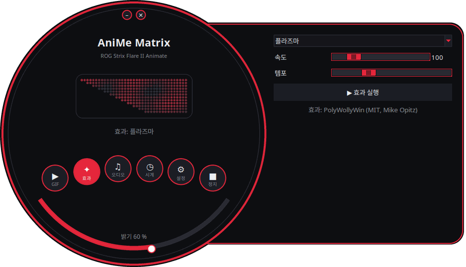
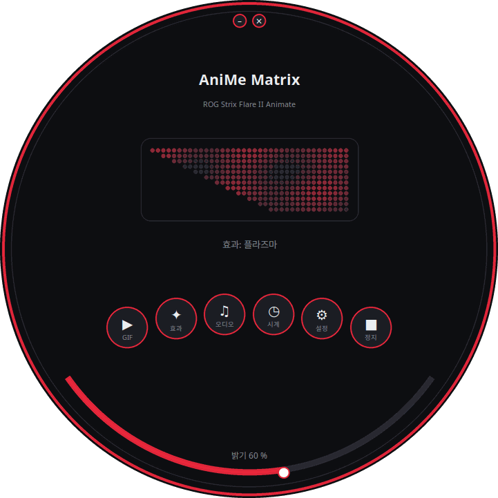
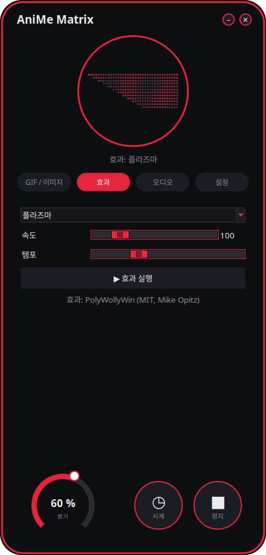
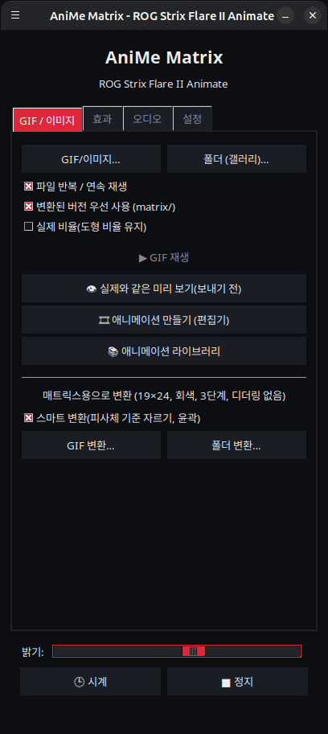

<p align="center">
  
</p>

# 리눅스용 AniMe Matrix — ROG Strix Flare II Animate

[](https://github.com/AntiCitoyen/Anticitoyen-ROG-flare2-anime-matrix/releases/latest)
[](../../LICENSE)
[](https://buymeacoffee.com/anticitoyen)

ASUS ROG Strix Flare II Animate 키보드의 AniMe Matrix 디스플레이(312개의 미니 LED)를 Armoury Crate나 Windows 없이 리눅스에서 직접 제어합니다: GIF와 이미지, 배경 갤러리, 시계, 19가지 애니메이션 효과, 7가지 오디오 비주얼라이저, LED 단위 드로잉.

애플리케이션 인터페이스는 19개 언어로 제공되며, 시스템 언어를 자동으로 따르고 *설정* 탭의 *언어:*에서 변경할 수 있습니다.

<div align="center">

[🇫🇷 Français](../../README.md) · [🇬🇧 English](README.en.md) · [🇪🇸 Español](README.es.md) · [🇩🇪 Deutsch](README.de.md) · [🇮🇹 Italiano](README.it.md) · [🇧🇷 Português](README.pt-BR.md) · [🇳🇱 Nederlands](README.nl.md) · [🇵🇱 Polski](README.pl.md) · [🇷🇺 Русский](README.ru.md) · [🇺🇦 Українська](README.uk.md) · [🇹🇷 Türkçe](README.tr.md) · [🇸🇦 العربية](README.ar.md) · [🇮🇳 हिन्दी](README.hi.md) · [🇨🇳 简体中文](README.zh-CN.md) · [🇹🇼 繁體中文](README.zh-TW.md) · [🇯🇵 日本語](README.ja.md) · **🇰🇷 한국어** · [🇻🇳 Tiếng Việt](README.vi.md) · [🇮🇩 Bahasa Indonesia](README.id.md)

</div>

<p align="center"><br><em>다이얼 + 서랍 (기본 인터페이스)</em></p>

| 다이얼 | 둥근 모서리 | 클래식 |
|:---:|:---:|:---:|
|  |  |  |

<p align="center"></p>

---

## 목차

- [프로젝트 소개](#projet)
- [지원 하드웨어](#materiel)
- [설치](#installation)
- [사용법](#utilisation)
- [좋은 GIF 만들기](#gif)
- [작동 원리](#fonctionnement)
- [문제 해결](#depannage)
- [저장소 구성](#depot)
- [.deb 패키지 빌드](#deb)
- [크레딧](#credits)
- [라이선스](#licence)
- [프로젝트 후원](#soutien)

---

<a id="projet"></a>

## 프로젝트 소개

ASUS는 이 키보드의 AniMe Matrix 디스플레이를 Windows(Armoury Crate)에서만 제공합니다. 이 프로젝트는 USB HID를 통해 키보드와 직접 통신하며 다음 기능을 제공합니다.

- **그래픽 런처** (`animematrix`), **4가지 인터페이스** 중 선택: *다이얼 + 서랍*(둥근 창과 오른쪽으로 열리는 설정 패널, 기본값), *다이얼*(모든 것이 원 안에), *둥근 모서리*(매우 둥근 모서리, 밝기 휠), *클래식*(탭). 둥근 인터페이스는 키보드로 전송되는 **312개의 LED를 실시간으로** 보여줍니다. 4개의 제어 블록:
  - **GIF / 이미지** : 하나 이상의 파일, 또는 폴더 전체를 갤러리로 반복 재생 ; 매트릭스용 GIF 변환.
  - **효과** : 19가지 애니메이션(매트릭스 레인 V2, 플라즈마, 파이어, 별, 불꽃놀이, 번개, 메타볼, 웨이브, 스네이크, 스크롤 텍스트, 스타일 시계, 키보드 반응 등), 실행 중에도 조정 가능.
  - **오디오** : PC에서 재생되는 소리에 반응하는 7가지 비주얼라이저(스펙트럼 바, KITT / KARR, 중앙 스타버스트, 오실로스코프, 오디오 파이어 등).
  - **설정** : 세션 시작 시 표시할 항목, 언어·테마·인터페이스, 드로잉 편집기, 프로젝트 링크.
- HH:MM **시계**, 런처에서 또는 백그라운드 서비스로.
- **배경 갤러리** : 세션이 열리자마자 GIF 폴더를 슬라이드쇼로 재생하는 `systemd --user` 서비스.
- **원클릭 토글** (`animematrix-bascule`) : 메뉴 아이콘 클릭으로 화면 켜기/끄기 ; 오른쪽 클릭으로 GIF 갤러리, 시계, 끄기 중 선택.
- **매트릭스에 맞춘 GIF 변환** (`animematrix-convertir`) : 19×24, 그레이스케일, 3단계, 디더링 없음 — [docs/GUIDE-GIF.md](../GUIDE-GIF.md) 참조.
- LED 단위 **드로잉 편집기** (`animematrix-dessin`).
- **11가지 테마**: ROG 스타일 5종(Classic, Strix, Glitch, Gold, Carbon), 핑크 5종(벚꽃, 버블껌, 로즈 골드, 라벤더 로즈, 로즈 나이트), 시스템 기본 테마. *설정* → *테마:*에서 선택합니다.
- **내장 업데이트**: *설정* → *업데이트 확인*; 하루 한 번 자동 확인(끌 수 있음). 런처가 최신 GitHub 릴리스의 `.deb`를 내려받아 SHA-256 체크섬을 확인하고, 관리자 비밀번호를 받은 뒤 설치합니다(`pkexec`).
- **낮은 리소스 사용량** : GIF는 프레임 단위로 디코딩되며, 400개 GIF로 구성된 갤러리도 메모리 약 25MB로 실행됩니다.

<a id="materiel"></a>

## 지원 하드웨어

| 키보드 | USB | 인터페이스 |
|---|---|---|
| ASUS ROG Strix Flare II Animate | `0b05:19fc` | HID, interface 4 (usage page `0xFF02`) |

ROG **노트북**(Zephyrus G14 등)의 AniMe Matrix 디스플레이는 다른 프로토콜을 사용하며, 이 프로젝트에서는 지원되지 **않습니다** (대신 `asusctl`을 참고하세요).

Ubuntu 26.04(X11, PipeWire)에서 테스트되었습니다. Python ≥ 3.10, hidapi, Tk, systemd를 갖춘 배포판이라면 모두 사용 가능할 것입니다.

<a id="installation"></a>

## 설치

### .deb 패키지 (Debian, Ubuntu, Mint, Pop!_OS 등)

1. [Releases](https://github.com/AntiCitoyen/Anticitoyen-ROG-flare2-anime-matrix/releases/latest) 페이지에서 `anticitoyen-rog-flare2-anime-matrix_<version>_all.deb`를 다운로드합니다.
2. 설치합니다 (apt가 의존성을 가져옵니다):
   ```bash
   sudo apt install ./anticitoyen-rog-flare2-anime-matrix_*_all.deb
   ```
3. **키보드를 분리했다가 다시 연결하세요** (udev 규칙이 로그인한 사용자에게 접근 권한을 부여합니다).
4. 애플리케이션 메뉴에서 **AniMe Matrix**를 실행하거나, 터미널에서 `animematrix`를 실행합니다.

패키지가 설치하는 항목:

| 항목 | 위치 |
|---|---|
| 프로그램 | `/usr/share/anticitoyen-rog-flare2-anime-matrix/` |
| 명령어 | `animematrix`, `animematrix-bascule`, `animematrix-effet`, `animematrix-galerie`, `animematrix-horloge`, `animematrix-convertir`, `animematrix-dessin`, `animematrix-lecture` |
| 사용자 서비스 | `/usr/lib/systemd/user/animematrix-galerie.service`, `animematrix-horloge.service`, `animematrix-lecture.service` (기본적으로 비활성화) |
| udev 규칙 | `/usr/lib/udev/rules.d/72-rog-flare2-animate.rules` |
| 메뉴 및 아이콘 | `animematrix.desktop`, 아이콘 `animematrix` |

제거: `sudo apt remove anticitoyen-rog-flare2-anime-matrix`.

### 소스에서 빌드

```bash
git clone https://github.com/AntiCitoyen/Anticitoyen-ROG-flare2-anime-matrix.git
cd Anticitoyen-ROG-flare2-anime-matrix
python3 -m venv .venv
.venv/bin/pip install hidapi pillow numpy pynput python-xlib
# root 권한 없이 키보드에 접근
sudo cp packaging/72-rog-flare2-animate.rules /etc/udev/rules.d/
sudo udevadm control --reload-rules && sudo udevadm trigger
# 이후 키보드를 분리했다가 다시 연결
.venv/bin/python rog_flare2_launcher.py
```

유용한 시스템 도구: `imagemagick` (변환), `pulseaudio-utils` (`parec`, 오디오용), `zenity` (파일 선택 대화상자), `libnotify-bin` (토글 알림).

소스에서 백그라운드 서비스를 사용하려면, `systemd/*.service` 파일을 `~/.config/systemd/user/`에 복사하고 `ExecStart=` 줄을 `.venv/bin/python` 경로와 스크립트(`rog_flare2_folder_player.py`, `rog_flare2_clock_v3.py`) 경로로 교체한 뒤 `systemctl --user daemon-reload`를 실행하세요.

<a id="utilisation"></a>

## 사용법

### 런처

`animematrix` (또는 메뉴의 **AniMe Matrix** 항목).

둥근 인터페이스에서는 둥근 버튼을 눌러 *GIF / 이미지*, *효과*, *오디오*, *설정* 블록을 엽니다(서랍 안이나 원 안에서); *시계*와 *정지*는 즉시 실행됩니다; 아래쪽 호는 밝기를 조절합니다; 배경을 드래그해 창을 이동합니다; 위쪽의 작은 버튼은 최소화 또는 닫기입니다. 둥근 형태는 X11 SHAPE 확장(`python3-xlib` 패키지)을 사용합니다; 이 확장이 없으면 같은 인터페이스가 사각형 창으로 표시됩니다.

- **GIF / 이미지** : *GIF/이미지…*로 파일을 선택하거나, *폴더 (갤러리)…*로 폴더 전체를 선택합니다. 선택한 폴더는 배경 갤러리의 폴더로도 사용됩니다. *변환된 버전 우선 사용*을 켜면 변환 작업으로 생성된 `dossier/matrix/nom.gif`가 있을 경우 그것을 읽습니다.
- **효과**와 **오디오** : 선택하고, 조정한 뒤 *▶ 효과 실행*을 누릅니다. 슬라이더는 실시간으로 작동하며, *템포*는 애니메이션을 빠르거나 느리게 만듭니다.
- **밝기**, **🕒 시계**, **■ 정지** (화면을 지웁니다)는 모든 탭에 공통입니다.
- **설정** : *세션 시작 시*의 값은 GIF 갤러리, 시계, 마지막 재생, 또는 없음입니다 ; *인터페이스:* 4가지 인터페이스 중 하나를 선택합니다(런처가 다시 시작되며, 현재 표시 중인 내용은 계속 재생됩니다).

**런처를 닫아도, 표시되던 내용은 계속 재생됩니다** (GIF, 그 순간의 설정을 유지한 효과, 오디오 비주얼라이저 또는 시계): 런처는 이를 백그라운드 서비스인 `animematrix-lecture.service`에 넘깁니다. 다음 실행 시, 다른 무언가를 시작하는 즉시 다시 제어권을 가져옵니다(한 번에 하나의 프로그램만 키보드에 쓸 수 있습니다). 닫기 전에 *■ 정지*를 누르면 화면이 꺼진 채로 남습니다.

### 토글 및 백그라운드 서비스

```bash
animematrix-bascule            # 켜짐 → 꺼짐, 꺼짐 → 마지막 모드
animematrix-bascule gif        # 백그라운드 갤러리, 세션 시작 시에도
animematrix-bascule horloge    # 백그라운드 시계, 세션 시작 시에도
animematrix-bascule lecture    # 런처의 마지막 재생, 세션 시작 시에도
animematrix-bascule off        # 꺼짐, 세션 시작 시 아무것도 안 함
animematrix-bascule etat       # 현재 모드
```

동일한 선택 항목은 메뉴 아이콘의 오른쪽 클릭에도 있습니다. 내부적으로는 `systemctl --user enable --now animematrix-galerie.service`(또는 `animematrix-horloge.service`)가 사용됩니다.

### 명령줄

| 명령어 | 역할 |
|---|---|
| `animematrix-effet --liste` | 효과와 비주얼라이저 목록 표시 |
| `animematrix-effet "Plasma" --brightness 60 --vitesse 1.5` | 효과 실행 (중지하려면 Ctrl+C) |
| `animematrix-galerie [dossier] --brightness 60 [--originaux]` | 폴더를 슬라이드쇼로 재생 (기본값은 런처에서 마지막으로 선택한 폴더, 없으면 `~/Images/AniMe-Matrix`) |
| `animematrix-lecture` | 런처의 마지막 재생을 다시 재생 (`~/.config/rog-flare2/lecture.json`) |
| `animematrix-horloge -b 25` | 시계 ; `--clear`는 화면을 지우고, `--once --text 12:34`는 텍스트를 표시 |
| `animematrix-convertir dossier/ [--sortie D] [--force]` | 매트릭스용 GIF 변환 (`dossier/matrix/`에 저장) |
| `animematrix-dessin` | 드로잉 편집기 |

### 오디오

비주얼라이저는 `parec`(PipeWire 또는 PulseAudio)를 사용해 **기본 오디오 출력의 모니터**를 수신합니다. 즉 PC에서 재생되는 소리에 반응하며, 마이크에는 반응하지 않습니다. 출력을 변경하려면 시스템의 기본 출력을 변경하세요.

### "Keyboard React" 효과

키를 누르는 리듬에 맞춰 화면이 켜지며, 이는 효과가 실행되는 동안 세션 전체의 키 입력을 읽는 `pynput`을 통해 구현됩니다. X11에서는 작동하지만, Wayland에서는 키 입력을 받지 못합니다.

<a id="gif"></a>

## 좋은 GIF 만들기

화면은 사각형이 아닙니다. 위쪽 19개에서 아래쪽 7개로 엇갈리게 배열된 24개의 행, 확실히 구분되는 3단계의 회색조, 인접한 LED 사이의 번짐 효과가 있습니다. 실루엣, 픽토그램, 짧은 텍스트, 느린 움직임은 잘 표현되지만, 사진과 동영상은 그렇지 않습니다.

전체 가이드(캔버스 크기, 단계, 프레임 속도, 밝기, ImageMagick 명령어): **[docs/GUIDE-GIF.md](../GUIDE-GIF.md)**.

<a id="fonctionnement"></a>

## 작동 원리

- **전송 방식** : hidapi가 키보드의 4번 HID 인터페이스를 열고 **1024바이트** 프레임을 씁니다.
- **프레임 구조** : `60 81 00 00` + **312바이트**(하드웨어 순서대로 LED당 0–255의 밝기값 1개) + 1024바이트까지 0으로 채움.
- **기하학적 구조** : 대각선으로 엇갈린 24개의 행(19 → 7개의 LED), 또는 이와 동등하게 37 → 15개의 열을 가진 12개의 논리적 행(PolyWollyWin 모델) ; 두 대응 방식은 312개 LED 전체에서 동일함이 확인되었습니다.
- **GIF** : 각 프레임은 재구성되고(최적화된 GIF는 차이만 저장함), 회색조로 변환되고, 24개 행으로 축소되어 행 단위로 샘플링됩니다.
- **애니메이션** : 내장 메모리는 사용되지 않습니다. 애니메이션은 호스트가 프레임을 차례로 전송하는 방식으로 구현됩니다(효과의 경우 초당 약 30프레임).

원본 리버스 엔지니어링 노트(USBPcap 캡처, LED 순서, 보정 지점)는 **[docs/PROTOCOL.md](../PROTOCOL.md)**에 있습니다. 더 깊이 파고들고 싶은 분들을 위해 `*.cap` 캡처 파일과 `parse_usbpcap.py` / `rog_flare2_replay_capture.py` 도구가 저장소에 남아 있습니다.

⚠️ 노트북용 AniMe Matrix의 패킷(`0x5E …`, `0xEC …`)을 키보드로 보내지 마세요. 올바른 프로토콜이 아니며 키보드가 멈출 수 있습니다(분리 후 재연결하거나, **Fn + Esc**를 10~15초간 눌러 유지하세요).

<a id="depannage"></a>

## 문제 해결

| 증상 | 예상 원인 | 해결책 |
|---|---|---|
| `interface 4 not found` | 키보드가 인식되지 않거나 권한 없음 | `lsusb \| grep 0b05:19fc` ; udev 규칙이 설치되었는지 확인 ; 분리 후 재연결 |
| `Permission denied` / `open failed` | udev 규칙이 적용되지 않음 | `sudo udevadm control --reload-rules && sudo udevadm trigger` 실행 후 재연결 |
| 화면이 바뀌지 않음 | 다른 프로그램이 이미 화면에 쓰고 있음 | `animematrix-bascule off` 실행, 다른 런처나 스크립트 종료 |
| 비주얼라이저가 데모 모드에 머무름 | `parec`이 없거나 소리가 없음 | `pulseaudio-utils` 설치, 소리 재생 |
| "Keyboard React"가 반응하지 않음 | Wayland 세션이거나 `pynput`이 없음 | X11 세션 사용, `sudo apt install python3-pynput` 실행 |
| 배경 갤러리가 시작되지 않음 | 폴더가 비어 있거나 없음 | 런처(GIF 탭)에서 폴더 선택 |
| 둥근 창이 사각형으로 표시됨 | SHAPE 확장 또는 `python3-xlib` 누락 | `sudo apt install python3-xlib`, 또는 *설정* → *인터페이스:* → *클래식* |
| 서비스 로그 확인 | — | `journalctl --user -u animematrix-galerie.service -f` |

<a id="depot"></a>

## 저장소 구성

| 파일 | 역할 |
|---|---|
| `rog_flare2_launcher.py` | 그래픽 런처 (Tk) |
| `rog_flare2_i18n.py`, `locale/` | 인터페이스 번역(19개 언어, 언어별 JSON 카탈로그 1개) |
| `rog_flare2_themes.py` | 인터페이스 테마(ROG 및 핑크) |
| `rog_flare2_ui_ronde.py` | 둥근 인터페이스 (다이얼 + 서랍, 다이얼, 둥근 모서리): 그리기, 창 모양, LED 미리보기 |
| `rog_flare2_effets.py` | 효과 및 오디오 비주얼라이저 (리눅스에 맞춘 PolyWollyWin 엔진) |
| `polywollywin/` | PolyWollyWin의 효과 엔진, 수정 없이 그대로 복사 (MIT) |
| `rog_flare2_folder_player.py` | 배경 갤러리 (서비스) |
| `rog_flare2_lecture.py` | 백그라운드 재생 : 런처가 종료될 때 표시하던 내용을 이어받습니다 (서비스) |
| `rog_flare2_clock_v3.py` | 시계 (서비스) |
| `rog_flare2_bascule.sh` | 갤러리 / 시계 / 끄기 토글 |
| `rog_flare2_convertir.py` | GIF 변환 (ImageMagick) |
| `rog_flare2_matrix_paint.py` | HID 전송, LED 순서, 드로잉 편집기 |
| `parse_usbpcap.py`, `rog_flare2_replay_capture.py`, `*.cap` | 리버스 엔지니어링 도구 및 캡처 파일 |
| `systemd/` | 사용자 서비스 |
| `packaging/` | udev 규칙, 메뉴 항목, 아이콘, .deb 패키지 파일 및 스크립트 |
| `docs/` | GIF 가이드, 프로토콜 노트, 스크린샷 |

<a id="deb"></a>

## .deb 패키지 빌드

```bash
packaging/build-deb.sh
# → dist/anticitoyen-rog-flare2-anime-matrix_<version>_all.deb
```

`dpkg-deb`와 `bash`만 있으면 됩니다. 버전 정보는 `rog_flare2_launcher.py`(`VERSION`)에서 읽어옵니다.

<a id="credits"></a>

## 크레딧

- **NicRoss512** — 프로토콜 리버스 엔지니어링, 원본 시계 및 편집기: [ASUS-ROG-Strix-Flare-II-Animate-AniMe-Matrix-Protocol](https://github.com/NicRoss512/ASUS-ROG-Strix-Flare-II-Animate-AniMe-Matrix-Protocol). 이 저장소는 여기서 파생되었으며, 그 커밋 히스토리가 보존되어 있습니다.
- **Mike Opitz** — [PolyWollyWin](https://github.com/MikeOpitz99/PolyWollyWin) (MIT), 이 프로젝트에서 효과 및 오디오 비주얼라이저 엔진을 가져온 Windows용 컨트롤러.
- **Yoshi Walsh** — [Mastering the AniMe Matrix](https://blog.yoshiwalsh.me/asus-anime-matrix/), LED 동작(번짐, 체감 밝기 단계, 프레임 속도)에 대한 자료.

독립적인 프로젝트이며 ASUS와 제휴하지 않았습니다. "ROG", "AniMe Matrix", "Armoury Crate"는 ASUSTeK의 상표입니다.

<a id="licence"></a>

## 라이선스

이 저장소의 코드는 [MIT](../../LICENSE) 라이선스를 따릅니다. `polywollywin/`은 원저작자의 MIT 라이선스를 그대로 유지합니다([polywollywin/LICENSE](../../polywollywin/LICENSE)). NicRoss512의 원본 파일들(`rog_flare2_clock_v3.py`, `rog_flare2_matrix_paint.py`, `parse_usbpcap.py`, `rog_flare2_replay_capture.py`, `docs/PROTOCOL.md`, 캡처 파일)은 명시적인 라이선스 없이 공개되었으며 원저작자에게 저작권이 있고, 출처를 표기하여 재배포됩니다.

<a id="soutien"></a>

## 프로젝트 후원

이 프로젝트가 도움이 되었다면, 커피 한 잔이 유지 관리에 힘이 됩니다.

[](https://buymeacoffee.com/anticitoyen)

**https://buymeacoffee.com/anticitoyen** — 이 링크는 런처의 *설정* 탭에도 있습니다.

버그 리포트와 아이디어: [Issues](https://github.com/AntiCitoyen/Anticitoyen-ROG-flare2-anime-matrix/issues).
