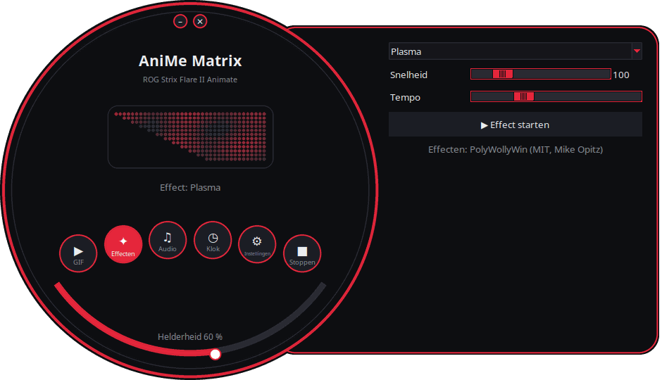
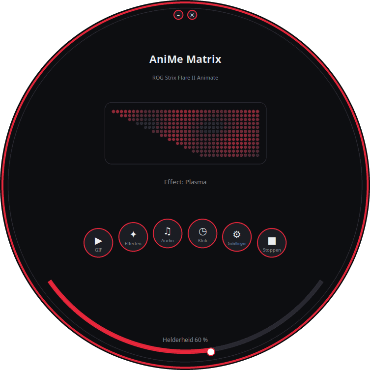
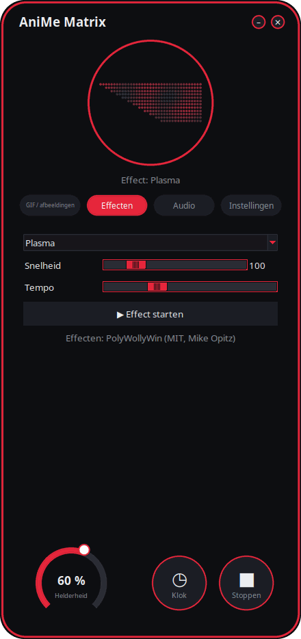
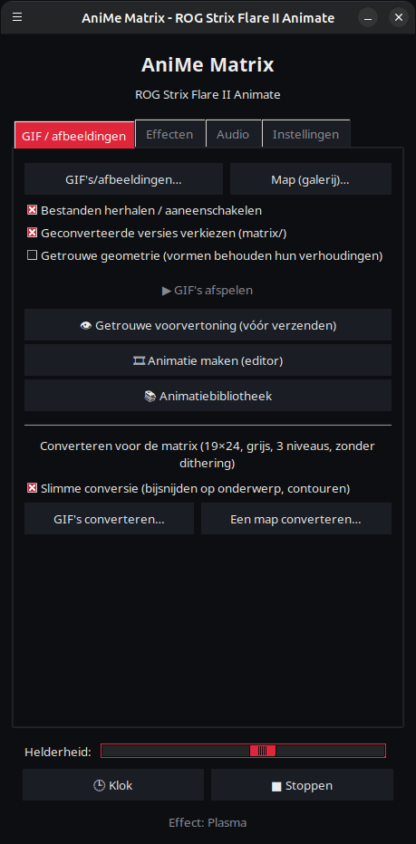
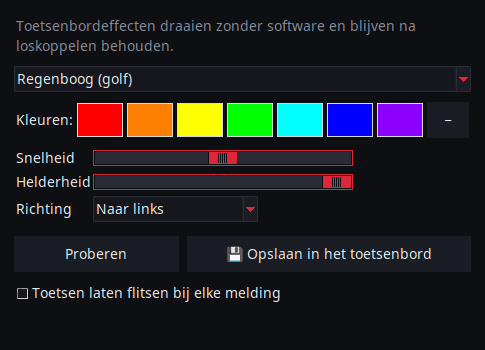
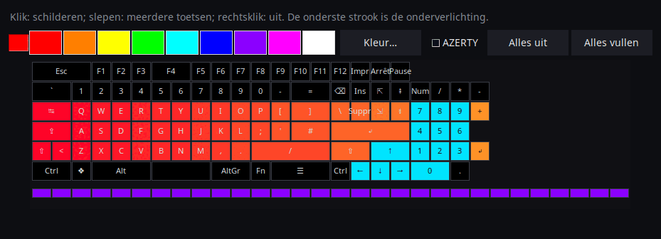

<p align="center">
  
</p>

# AniMe Matrix voor Linux — ROG Strix Flare II Animate

[](https://github.com/AntiCitoyen/Anticitoyen-ROG-flare2-anime-matrix/releases/latest)
[](https://github.com/AntiCitoyen/Anticitoyen-ROG-flare2-anime-matrix/actions/workflows/ci.yml)
[](../../LICENSE)
[](https://buymeacoffee.com/anticitoyen)

Bestuur onder Linux het **AniMe Matrix**-scherm (312 mini-leds) van het **ASUS ROG Strix Flare II Animate**-toetsenbord, zonder Armoury Crate of Windows: GIF's en galerij, klok, effecten en audiovisualisaties, spellen, systeemmonitor, bureaubladmeldingen, tijdgebonden planning, animatie-editor, gedeelde bibliotheek, gesynchroniseerde toetsenbordkleuren.

<div align="center">

[🇫🇷 Français](../../README.md) · [🇬🇧 English](README.en.md) · [🇪🇸 Español](README.es.md) · [🇩🇪 Deutsch](README.de.md) · [🇮🇹 Italiano](README.it.md) · [🇧🇷 Português](README.pt-BR.md) · **🇳🇱 Nederlands** · [🇵🇱 Polski](README.pl.md) · [🇷🇺 Русский](README.ru.md) · [🇺🇦 Українська](README.uk.md) · [🇹🇷 Türkçe](README.tr.md) · [🇸🇦 العربية](README.ar.md) · [🇮🇳 हिन्दी](README.hi.md) · [🇨🇳 简体中文](README.zh-CN.md) · [🇹🇼 繁體中文](README.zh-TW.md) · [🇯🇵 日本語](README.ja.md) · [🇰🇷 한국어](README.ko.md) · [🇻🇳 Tiếng Việt](README.vi.md) · [🇮🇩 Bahasa Indonesia](README.id.md)

</div>

<p align="center"><br><em>Draaiknop + lade (standaardinterface)</em></p>

| Draaiknop | Afgerond | Klassiek |
|:---:|:---:|:---:|
|  |  |  |

<p align="center"></p>

---

## Inhoud

- [Wat het project doet](#projet)
- [Ondersteunde hardware](#materiel)
- [Installatie](#installation)
- [Gebruik](#utilisation)
- [Goede GIF's voorbereiden](#gif)
- [Hoe het werkt](#fonctionnement)
- [Problemen oplossen](#depannage)
- [Structuur van de repository](#depot)
- [Pakketten bouwen](#deb)
- [Credits](#credits)
- [Licentie](#licence)
- [Het project steunen](#soutien)

---

<a id="projet"></a>

## Wat het project doet

ASUS levert het AniMe Matrix-scherm van dit toetsenbord alleen onder Windows (Armoury Crate). Dit project communiceert rechtstreeks met het toetsenbord via USB HID en biedt:

**Weergeven**
- **GIF's, afbeeldingen en video's**: een bestand, een selectie of een hele map als galerij, ook door ze op het venster te slepen; video's (MP4, WebM, MKV…) afgespeeld via ffmpeg; miniaturengalerij; geconverteerde frames in de cache bewaard (een galerij van 400 GIF's past in ~25 MB geheugen).
- **Klok**: digitale, analoge, binaire wijzerplaat, in woorden (Frans, Engels, Duits, Spaans, Italiaans, Portugees, Nederlands) of gestileerd.
- **Geanimeerde effecten** (regen in Matrix-stijl, plasma, vuur, sterren, vuurwerk, bliksem, metaballs, golf…) en **7 audiovisualisaties** die reageren op het geluid dat de pc afspeelt.
- **Tekst**: je eigen bericht, in alle schriften (accenten, Cyrillisch, Arabisch, Hindi, Chinees, Japans, Koreaans…), lopend naar links, naar rechts, omhoog, omlaag, of stilstaand.
- **Webcam** (beeld of silhouet) en **schermspiegeling** (volledig scherm, rond de muis of actief venster).
- **Systeemmonitor**: cpu, ram, gpu, temperatuur, netwerksnelheid en tijd, als meters.
- **Nu spelend**: bij een nummerwissel schuift « ARTIEST - TITEL » eenmaal voorbij, daarna een visualisatie (Spotify, VLC, Rhythmbox, browsers… via MPRIS).
- **Bureaubladmeldingen**: « APP: TITEL » wordt in overlay getoond, waarna de weergave wordt hervat (standaard uitgeschakeld, lijst met toegestane toepassingen).
- **Spellen** speelbaar met het toetsenbord: Snake, Pong (alleen of met z'n tweeën), Tetris, breakout, Invaders, Flappy, met records.
- **Indicatoren**: kleine lichtblokjes wanneer de microfoon gedempt of in gebruik is, wanneer de webcam aan staat, wanneer OBS uitzendt of opneemt.
- **Toetsenbordgeheugen**: een in het toetsenbord opgeslagen animatie (GIF, afbeelding) speelt zonder software, zodra het is aangesloten, ook op een andere pc; instelbare helderheid (tabblad GIF, `animematrix-ctl memoire`). Ook de 6 ingebouwde animaties (KO, Meteoriet, Oog, Love, Halloween, Opstarten) zijn te kiezen: `animematrix-ctl clavier 1`…`6`.

**Maken**
- **Animatie-editor** beeld voor beeld, op de echte geometrie van het scherm: 3 niveaus, filmstrook, spooklaag, verschuiving, kopiëren-plakken, voorvertoning, verzenden naar het toetsenbord, GIF-export.
- **Gedeelde animatiebibliotheek**: doorbladeren, afspelen, toevoegen aan je eigen galerij, je eigen animaties voorstellen.
- **Slimme conversie** van GIF's: bijsnijden op het onderwerp, licht onderwerp op zwarte achtergrond, versterkte contouren, 3 niveaus.
- **Getrouwe voorvertoning** vóór verzenden: gesimuleerde weergave van het scherm (werkelijke opstelling, halo tussen leds).
- **Effecten als extensies**: een Python-bestand in een map voegt een effect toe (zie [../EXTENSIONS.md](../EXTENSIONS.md)).

**Automatiseren**
- **Daemon `animematrixd`**: enige eigenaar van het scherm, blijft weergeven wanneer de launcher gesloten is; commando `animematrix-ctl` en optionele lokale HTTP-API.
- **Tijdgebonden planning**: tijdvakken (dagen, ook 's nachts) met klok, galerij, monitor, nu spelend, een effect, een afspeellijst of uitgeschakeld scherm; zwart scherm wanneer de sessie is vergrendeld, in slaapstand staat of wanneer een toepassing op volledig scherm draait.
- **Profielen per app**: eigen inhoud voor een spel of toepassing zolang die op de voorgrond staat (knop *Detecteren*).
- **Afspeellijsten en favorieten**: GIF's, effecten, klok… elk gedurende zijn eigen tijd, in een lus; ook in het pictogram in het systeemvak en via de opdrachtregel.
- **Webafstandsbediening**: een pagina om het scherm te bedienen vanaf een telefoon in het lokale netwerk (QR-code, token).
- **Einde van lange opdrachten**: in de terminal verschijnt « Klaar : make 2 min 05 » wanneer een lange opdracht klaar is.
- **Toetskleuren en -effecten**, zonder OpenRGB: regenboog, statisch, ademen, kleurcyclus, reactief, rimpeling, sterrennacht, drijfzand, stroming, regen — uitgevoerd door het toetsenbord en behouden na loskoppelen; of de themakleur, pulseren met het scherm.
- **Pictogram in het systeemvak**: snelmenu (modi, helderheid).

**Comfort**
- **4 interfaces** (*Draaiknop + lade* standaard, *Draaiknop*, *Afgerond*, *Klassiek*) met **live voorvertoning van de 312 leds**, **11 thema's** (5 ROG, 5 roze, systeem) en **19 talen**.
- **X11 en Wayland**: reactie op het toetsenbord via evdev, actief venster opgevraagd bij Sway, Hyprland, KDE (kdotool) of GNOME (extensie *Window Calls*); schermspiegeling via het desktopportaal (scherm of venster, keuze onthouden).
- **Ingebouwde updates**: de launcher haalt de nieuwste release op, controleert de SHA-256-controlesom en installeert deze (beheerderswachtwoord); of `apt upgrade` met de APT-repository.

<a id="materiel"></a>

## Ondersteunde hardware

| Toestel | USB | Status |
|---|---|---|
| ASUS ROG Strix Flare II Animate | `0b05:19fc` | ondersteund (HID, interface 4, usage page `0xFF02`) |
| AniMe Matrix-schermen van ROG-laptops (G14, G16…) | diverse | **experimenteel** via `asusctl`, niet getest op hardware (zie [Gebruik](#utilisation)) |

Getest op Ubuntu 26.04 (X11, PipeWire, Cinnamon). Elke distributie met Python ≥ 3.10, hidapi, Tk en systemd zou moeten werken; onder Wayland draait de launcher via XWayland.

<a id="installation"></a>

## Installatie

### APT-repository (Debian, Ubuntu, Mint, Pop!_OS…) — updates met `apt upgrade`

```bash
curl -fsSL https://anticitoyen.github.io/Anticitoyen-ROG-flare2-anime-matrix/animematrix.gpg \
  | sudo tee /usr/share/keyrings/animematrix.gpg >/dev/null
echo "deb [signed-by=/usr/share/keyrings/animematrix.gpg] https://anticitoyen.github.io/Anticitoyen-ROG-flare2-anime-matrix stable main" \
  | sudo tee /etc/apt/sources.list.d/animematrix.list
sudo apt update && sudo apt install anticitoyen-rog-flare2-anime-matrix
```

Daarna het **toetsenbord loskoppelen en opnieuw aansluiten** (de udev-regel geeft de ingelogde gebruiker toegang) en **AniMe Matrix** starten vanuit het menu.

### Andere formaten (pagina [Releases](https://github.com/AntiCitoyen/Anticitoyen-ROG-flare2-anime-matrix/releases/latest))

| Systeem | Bestand | Installatie |
|---|---|---|
| Debian, Ubuntu… | `anticitoyen-rog-flare2-anime-matrix_<version>_all.deb` | `sudo apt install ./anticitoyen-rog-flare2-anime-matrix_*_all.deb` |
| Fedora, openSUSE… | `anticitoyen-rog-flare2-anime-matrix-<version>-1.noarch.rpm` | `sudo dnf install ./anticitoyen-rog-flare2-anime-matrix-*.noarch.rpm` |
| Arch, Manjaro… | `anticitoyen-rog-flare2-anime-matrix-<version>-1-any.pkg.tar.zst` | `sudo pacman -U anticitoyen-rog-flare2-anime-matrix-*.pkg.tar.zst` |
| Alle (Flatpak) | `AniMeMatrix-<version>.flatpak` | `flatpak install --user AniMeMatrix-*.flatpak` (installeer ook de udev-regel hieronder; geen audiovisualisaties) |
| AUR | `aur-<version>.tar.gz` | PKGBUILD en .SRCINFO: `tar xf aur-*.tar.gz && cd anticitoyen-rog-flare2-anime-matrix && makepkg -si` |
| Copr | `anticitoyen-rog-flare2-anime-matrix-<version>-1.<fc>.src.rpm` | bron-RPM: `rpmbuild --rebuild anticitoyen-rog-flare2-anime-matrix-*.src.rpm`, of uploaden naar een Copr-project |
| Flathub | `flathub-<version>.tar.gz` | manifest vastgezet op deze versie en `python3-modules.json`: Flathub-inzending of `flatpak-builder` |
| Weblate | `translations-<version>.zip` | vertaalbestanden (`locale/*.json`, basis `_source.json`) om in Weblate te importeren |

Het pakket installeert:

| Onderdeel | Locatie |
|---|---|
| Programma's | `/usr/share/anticitoyen-rog-flare2-anime-matrix/` |
| Commando's | `animematrix`, `animematrixd`, `animematrix-ctl`, `animematrix-bascule`, `animematrix-animation`, `animematrix-apercu`, `animematrix-convertir`, `animematrix-effet`, `animematrix-galerie`, `animematrix-horloge`, `animematrix-dessin`, `animematrix-tray`, `animematrix-memoire` |
| Gebruikersservice | `/usr/lib/systemd/user/animematrixd.service` (ingeschakeld voor alle sessies) |
| udev-regel | `/usr/lib/udev/rules.d/72-rog-flare2-animate.rules` |
| Menu en pictogram | `animematrix.desktop`, pictogram `animematrix` |

### Vanuit de broncode

```bash
git clone https://github.com/AntiCitoyen/Anticitoyen-ROG-flare2-anime-matrix.git
cd Anticitoyen-ROG-flare2-anime-matrix
python3 -m venv .venv
.venv/bin/pip install hidapi pillow numpy pynput python-xlib
# toegang tot het toetsenbord zonder root
sudo cp packaging/72-rog-flare2-animate.rules /etc/udev/rules.d/
sudo udevadm control --reload-rules && sudo udevadm trigger
# daarna toetsenbord loskoppelen/opnieuw aansluiten
.venv/bin/python rog_flare2_launcher.py
```

Nuttige systeemtools: `imagemagick` (klassieke conversie), `pulseaudio-utils` (`parec`, voor audio), `zenity` (bestandskiezers), `libnotify-bin` (meldingen), `python3-gi` en `gir1.2-ayatanaappindicator3-0.1` (pictogram in het systeemvak), `ffmpeg` (video's, webcam, schermspiegeling), `python3-evdev` (reactie op het toetsenbord onder Wayland), `x11-utils` (actief venster onder X11), `python3-qrcode` (QR-code van de afstandsbediening), `tkdnd` (slepen en neerzetten).

<a id="utilisation"></a>

## Gebruik

### De launcher

`animematrix` (of het item **AniMe Matrix** in het menu).

In de ronde interfaces openen de ronde knoppen de blokken *GIF*, *Effecten*, *Audio* en *Instellingen* (in de lade of in de cirkel); *Klok* en *Stoppen* werken meteen; de boog onderaan regelt de helderheid; het venster wordt verplaatst door het aan de achtergrond te slepen; de kleine knoppen bovenaan minimaliseren of sluiten het. De ronde vorm gebruikt de X11 SHAPE-extensie (pakket `python3-xlib`); zonder deze wordt dezelfde interface in een rechthoekig venster weergegeven.

- **GIF / afbeeldingen**: *GIF's/afbeeldingen…* of *Map (galerij)…* (of slepen en neerzetten op het venster); *Getrouwe geometrie* behoudt de verhoudingen (de hoek snijdt de afbeelding bij in plaats van ze uit te rekken); *👁 Getrouwe voorvertoning (vóór verzenden)* toont de weergave zonder iets te verzenden; *🎞 Animatie maken (editor)*; *📚 Animatiebibliotheek*; *★ Afspeellijsten en favorieten*; *🖼 Miniaturengalerij* (klik: afspelen, rechtsklik: favoriet); *🎥 Webcam* en *🖥 Schermspiegeling*; *Slimme conversie* om GIF's te converteren.
- **Effecten** en **Audio**: kiezen, instellen, *▶ Effect starten*. De schuifregelaars werken live; *Tempo* versnelt of vertraagt de hele animatie. Het effect *Tekst* neemt je bericht en de looprichting. De spellen worden bediend met de pijltjestoetsen, spatie en enter, met het launchervenster op de voorgrond; Pong met z'n tweeën: Z/W en S voor de linkerspeler.
- **Helderheid**, **🕒 Klok**, **■ Stoppen** (wat het scherm wist) zijn gemeenschappelijk voor alle tabbladen.
- **Instellingen**: opstarten van de sessie (GIF-galerij, Klok, Laatste weergave of Niets), klokweergave, taal, thema, interface, bureaubladmeldingen, toetsenbordkleuren, *Planning…* (triggers, profielen per app, tijdvakken), *Indicatoren…*, *Webafstandsbediening…*, pictogram in het systeemvak, einde van lange opdrachten, map met extensies, updates.

**Als je de launcher sluit, wordt niets onderbroken**: de daemon `animematrixd` blijft weergeven. *■ Stoppen* schakelt het scherm uit.

### Daemon en opdrachtregel

```bash
animematrix-ctl etat                               # wat wordt weergegeven
animematrix-ctl gif ~/Images/AniMe-Matrix --fidele # galerij (map of bestanden)
animematrix-ctl effet "Plasma" --param speed=250   # effect en instellingen
animematrix-ctl horloge
animematrix-ctl texte "Bonjour"
animematrix-ctl effet "Text" --param message="Salut" --param direction=haut
animematrix-ctl liste "Soirée"                     # afspeellijst (zonder naam: toont ze)
animematrix-ctl favori 2                           # favoriet nr. 2 (zonder nummer: toont ze)
animematrix-ctl notifier "Café prêt" --duree 5     # overlay, daarna terug
animematrix-ctl memoire anim.gif                   # opgeslagen in het toetsenbord (hoogstens 196 beelden)
animematrix-ctl clavier                            # toont de opgeslagen animatie
animematrix-ctl luminosite 60
animematrix-ctl stop
```

| Commando | Functie |
|---|---|
| `animematrix-bascule [gif\|horloge\|lecture\|off\|etat]` | schakelaar (ook via de rechtermuisknop op het menupictogram); de gekozen modus is ook die van het opstarten van de sessie |
| `animematrixd --http 8765` | daemon met lokale HTTP-API (`POST http://127.0.0.1:8765/api`, `Content-Type: application/json`, dezelfde JSON als de socket) |
| `animematrix-animation [bestand.gif]` | animatie-editor |
| `animematrix-apercu bestand.gif -o voorvertoning.gif` | getrouwe voorvertoning van een GIF (bestand) |
| `animematrix-convertir map/ [--fidele] [--classique]` | converteert GIF's voor de matrix (in `map/matrix/`) |
| `animematrix-effet --liste` | toont de lijst met effecten en visualisaties |
| `animematrix-dessin` | LED-voor-LED-editor (geeft de controle terug aan de daemon bij het sluiten) |
| `animematrix-ctl sauvegarde reglages.zip`, `animematrix-ctl restaurer reglages.zip` | exporteert of herstelt alle instellingen (ook in *Instellingen*); zonder token of OBS-wachtwoord, behalve met `--secrets` |

### Audio

De visualisaties luisteren naar de **monitor van de standaard audio-uitgang** via `parec` (PipeWire of PulseAudio): ze reageren op wat de pc afspeelt, niet op de microfoon.

### Effect « Keyboard React »

Dit laat het scherm oplichten op het ritme van het typen, zolang het effect actief is: onder X11 via `pynput`, onder Wayland door het toetsenbord in `/dev/input` te lezen (`python3-evdev`). Blijft het effect onder Wayland in demomodus, geef dan leestoegang tot alleen het ROG-toetsenbord:

```bash
sudo cp /usr/share/anticitoyen-rog-flare2-anime-matrix/udev/73-rog-flare2-animate-touches.rules /etc/udev/rules.d/
sudo udevadm control --reload-rules && sudo udevadm trigger
```

### Indicatoren

*Instellingen* → *Indicatoren (microfoon, webcam, OBS)…*: een blok van 2 × 2 leds licht linksboven op het scherm op, over de weergave heen (1: microfoon gedempt of in gebruik, 2: webcam in gebruik, 3: OBS live of aan het opnemen), en elke wijziging kan met een lopende tekst worden aangekondigd. OBS: schakel de WebSocket-server in (*Extra* → *WebSocket-serverinstellingen*) en neem de poort en het wachtwoord over.

### Webafstandsbediening

*Instellingen* → *Webafstandsbediening…*: vink *Inschakelen* aan en open dan het adres (of scan de QR-code) op een telefoon in hetzelfde netwerk. De pagina toont het scherm live en biedt klok, galerij, effecten, favorieten, afspeellijsten, helderheid en bericht. Het adres bevat een token: deel het niet en vervang het met *Nieuw token*; de pagina is niet versleuteld (HTTP): alleen op een vertrouwd netwerk.

### Einde van lange opdrachten

*Instellingen* → *Einde van lange opdrachten tonen (terminal)* voegt een regel toe aan `~/.bashrc` (en `~/.zshrc`): elke opdracht van meer dan 30 seconden toont na afloop « Klaar : make 2 min 05 » of « Mislukt (2) : … ». Drempel: `ANIMEMATRIX_FIN_SECONDES`; interactieve opdrachten (editors, `ssh`, `less`…) worden genegeerd.

### Toetsenbordkleuren

*Instellingen* → *🌈 Toetsenbordkleuren…*: effect (regenboog, statisch, ademen, kleurcyclus, reactief, rimpeling, sterrennacht, drijfzand, stroming, regen), kleuren, snelheid, helderheid, richting. *Proberen* past het toe, *Opslaan in het toetsenbord* bewaart het na loskoppelen. *Themakleur* en *Pulseren met het scherm* stuurt de daemon toets per toets; verlaat je ze, dan komt het opgeslagen effect terug. Op de opdrachtregel: `animematrix-ctl rgb arc-en-ciel --vitesse 70`, `animematrix-ctl rgb statique --couleur "#ff0000"`. Nog twee softwaremodi: *Schermbeeld* (de toetsen tonen het scherm, vergroot) en *Audiospectrum* (één balk per kolom). Elk tijdvak en elk toepassingsprofiel kan ook eigen toetskleuren kiezen (*Planning…*). *Toets voor toets*: één kleur per toets, met de muis geschilderd op een toetsenbordkaart (AZERTY of QWERTY). *Oplichtende aanslagen*: elke ingedrukte toets licht op en vervaagt daarna. De indicatoren voor microfoon, webcam en OBS kunnen ook F1, F2 en F3 laten oplichten, en elke melding laat de toetsen flitsen.

<p align="center"> </p>

### ROG-laptops (experimenteel)

Schrijf `portable-asusctl` in `~/.config/rog-flare2/materiel` en herstart daarna de daemon: de frames verlopen via `asusctl anime image` (maximaal 5 beelden per seconde). Niet getest op een echte laptop: feedback is welkom in de tickets.

<a id="gif"></a>

## Goede GIF's voorbereiden

Het scherm is geen rechthoek: 24 verspringende rijen, van 19 leds bovenaan tot 7 onderaan (rechterrand verticaal, linkerrand diagonaal), 3 echt onderscheiden grijstinten, een halo tussen naburige leds. Silhouetten, pictogrammen, korte teksten en trage bewegingen komen goed over; foto's en video's nauwelijks.

De volledige gids (canvas, niveaus, tempo, conversie, getrouwe geometrie): **[../GUIDE-GIF.md](../GUIDE-GIF.md)**.

<a id="fonctionnement"></a>

## Hoe het werkt

- **Transport**: hidapi opent HID-interface nr. 4 van het toetsenbord en schrijft er frames van **1024 bytes** naartoe; het toetsenbord stuurt elk frame terug.
- **Frame**: `60 81 00 00` + **312 bytes** (een helderheid van 0–255 per led, in hardwarevolgorde) + nullen tot 1024.
- **Geometrie**: 24 verspringende rijen (rij r bestrijkt de kolommen (r+1)//2 tot 18), of gelijkwaardig 12 logische rijen van 37 → 15 kolommen (model van PolyWollyWin); beide indelingen zijn geverifieerd als identiek over de 312 leds.
- **Daemon**: `animematrixd` beheert als enige het toetsenbord; basisweergave en overlay (meldingen); JSON-socket `$XDG_RUNTIME_DIR/animematrix.sock`; automatisch opnieuw verbinden van het toetsenbord.
- **Animatie**: de host verstuurt de frames na elkaar (~30 fps voor de effecten); het interne geheugen van het toetsenbord wordt niet gebruikt (onderzoek: [../RECHERCHE-MEMOIRE.md](../RECHERCHE-MEMOIRE.md)).

De oorspronkelijke reverse-engineeringnotities staan in **[../PROTOCOL.md](../PROTOCOL.md)**; de `*.cap`-captures en de tools `parse_usbpcap.py` / `rog_flare2_replay_capture.py` blijven in de repository.

⚠️ Stuur geen pakketten van de AniMe Matrix van laptops (`0x5E …`, `0xEC …`) naar het toetsenbord: dat is niet het juiste protocol en kan het toetsenbord blokkeren (loskoppelen/opnieuw aansluiten, of **Fn + Esc** 10–15 s ingedrukt houden).

<a id="depannage"></a>

## Problemen oplossen

| Symptoom | Waarschijnlijke oorzaak | Oplossing |
|---|---|---|
| `interface 4 not found` | toetsenbord niet herkend of geen rechten | `lsusb \| grep 0b05:19fc`; udev-regel geïnstalleerd? loskoppelen/opnieuw aansluiten |
| `Permission denied` / `open failed` | udev-regel niet toegepast | `sudo udevadm control --reload-rules && sudo udevadm trigger`, daarna opnieuw aansluiten |
| « Service animematrixd onbereikbaar » | daemon gestopt | `systemctl --user restart animematrixd.service` of `animematrixd &` |
| Het scherm verandert niet | een ander programma schrijft naar het toetsenbord | oude scripts sluiten; `animematrix-ctl etat` |
| De visualisaties blijven in demomodus | geen `parec` of geen geluid | `pulseaudio-utils` installeren, geluid afspelen |
| « Keyboard React » reageert niet | `pynput` (X11) of `python3-evdev` (Wayland) ontbreekt, of toetsenbord niet leesbaar | het pakket installeren; onder Wayland de udev-regel van [Keyboard React](#utilisation) |
| Webcam, video's of schermspiegeling werken niet | `ffmpeg` ontbreekt | `sudo apt install ffmpeg`; onder Wayland loopt schermspiegeling via de portal (`gstreamer1.0-pipewire`) |
| Profielen per app of volledig scherm zonder effect onder Wayland | actief venster onbekend bij de compositor | GNOME: extensie *Window Calls*; KDE: `kdotool`; Sway en Hyprland: niets te doen |
| Het ronde venster wordt als een rechthoek weergegeven | SHAPE-extensie of `python3-xlib` ontbreekt | `sudo apt install python3-xlib`, of *Instellingen* → *Interface:* → *Klassiek* |
| Logboek van de daemon | — | `journalctl --user -u animematrixd.service -f` |

<a id="depot"></a>

## Structuur van de repository

| Bestand | Functie |
|---|---|
| `rog_flare2_launcher.py` | grafische launcher (Tk) |
| `rog_flare2_ui_ronde.py`, `rog_flare2_themes.py` | ronde interfaces, thema's |
| `rog_flare2_i18n.py`, `locale/` | vertaling (19 talen; `locale/_cles.json` = te vertalen teksten; [../TRADUIRE.md](../TRADUIRE.md)) |
| `rog_flare2_demon.py`, `rog_flare2_ctl.py` | daemon `animematrixd`, client en commando `animematrix-ctl` |
| `rog_flare2_core.py` | streaming GIF-weergave, framecache, klok, geometrie |
| `rog_flare2_texte.py`, `rog_flare2_horloges.py` | tekst in alle schriften, effect *Tekst*, klokweergaven |
| `rog_flare2_listes.py`, `rog_flare2_vignettes.py` | afspeellijsten, favorieten, miniaturengalerij, slepen en neerzetten |
| `rog_flare2_video.py`, `rog_flare2_voyants.py`, `rog_flare2_telecommande.py` | video's, webcam, schermspiegeling; indicatoren; webafstandsbediening |
| `rog_flare2_touches.py`, `rog_flare2_fenetre.py`, `rog_flare2_fin.py`, `rog_flare2_flatpak.py` | toetsen en actief venster (X11, Wayland), einde van lange opdrachten, Flatpak |
| `rog_flare2_effets.py`, `polywollywin/` | effecten en visualisaties (PolyWollyWin-engine, MIT), extensies |
| `rog_flare2_infos.py`, `rog_flare2_mpris.py`, `rog_flare2_jeux.py` | systeemmonitor, nu spelend, spellen |
| `rog_flare2_notifs.py`, `rog_flare2_programme.py`, `rog_flare2_ui_programme.py` | meldingen, tijdgebonden planning en triggers |
| `rog_flare2_rgb.py`, `rog_flare2_tray.py`, `rog_flare2_portable.py` | toetskleuren en -effecten, pictogram in het systeemvak, laptops (experimenteel) |
| `rog_flare2_animation.py`, `rog_flare2_simulateur.py`, `rog_flare2_convertir.py` | animatie-editor, simulator, conversie |
| `rog_flare2_bibliotheque.py`, `bibliotheque/` | animatiebibliotheek (catalogus, CC0-GIF's) |
| `rog_flare2_maj.py` | updates vanuit de releases |
| `rog_flare2_matrix_paint.py`, `rog_flare2_clock_v3.py`, `rog_flare2_folder_player.py` | HID-transport en LED-editor, klok, galerij (oorspronkelijke tools) |
| `parse_usbpcap.py`, `rog_flare2_replay_capture.py`, `*.cap` | reverse engineering |
| `examples/effets/` | voorbeeld van een extensie |
| `tests/` | tests (waaronder interfaces met echte kliks) |
| `systemd/`, `packaging/` | gebruikersservice; .deb, RPM, Arch, Flatpak, APT-repository |
| `docs/` | GIF-gids, extensies, protocol, onderzoek, screenshots, vertaalde READMEs |

<a id="deb"></a>

## Pakketten bouwen

```bash
packaging/build-deb.sh
# → dist/anticitoyen-rog-flare2-anime-matrix_<version>_all.deb
```

`packaging/install.sh` installeert het project in elke mapstructuur; het wordt gebruikt voor het .deb-, het RPM- (`packaging/rpm/`), het Arch-pakket (`packaging/aur/`) en het Flatpak-pakket (`packaging/flathub/`). Bij elke gepubliceerde release bouwt GitHub het RPM-pakket, het Arch-pakket en het Flatpak-pakket, en werkt het de ondertekende APT-repository bij. De versie wordt gelezen in `rog_flare2_core.py` (`VERSION`). Tests: `python -m pytest tests`.

<a id="credits"></a>

## Credits

- **NicRoss512** — reverse engineering van het protocol, oorspronkelijke klok en editor: [ASUS-ROG-Strix-Flare-II-Animate-AniMe-Matrix-Protocol](https://github.com/NicRoss512/ASUS-ROG-Strix-Flare-II-Animate-AniMe-Matrix-Protocol). Deze repository is daarvan afgeleid; de geschiedenis ervan is bewaard.
- **Mike Opitz** — [PolyWollyWin](https://github.com/MikeOpitz99/PolyWollyWin) (MIT), Windows-controller waarvan de effecten- en audiovisualisatie-engine hier wordt hergebruikt.
- **Yoshi Walsh** — [Mastering the AniMe Matrix](https://blog.yoshiwalsh.me/asus-anime-matrix/), voor het gedrag van de leds (halo, waargenomen niveaus, tempo).
- **asus-linux** — [asusctl](https://gitlab.com/asus-linux/asusctl), gebruikt voor de schermen van laptops.

Onafhankelijk project, niet gelieerd aan ASUS. « ROG », « AniMe Matrix » en « Armoury Crate » zijn handelsmerken van ASUSTeK.

<a id="licence"></a>

## Licentie

[MIT](../../LICENSE) voor de code van deze repository; animaties uit `bibliotheque/` vallen onder CC0. `polywollywin/` blijft onder de MIT-licentie van de oorspronkelijke auteur ([../../polywollywin/LICENSE](../../polywollywin/LICENSE)). De oorspronkelijke bestanden van NicRoss512 (`rog_flare2_clock_v3.py`, `rog_flare2_matrix_paint.py`, `parse_usbpcap.py`, `rog_flare2_replay_capture.py`, `../PROTOCOL.md`, captures) zijn zonder expliciete licentie gepubliceerd en blijven eigendom van hun auteur; ze worden herverspreid met bronvermelding.

<a id="soutien"></a>

## Het project steunen

Als je iets hebt aan dit project, helpt een kopje koffie om het te onderhouden:

[](https://buymeacoffee.com/anticitoyen)

**https://buymeacoffee.com/anticitoyen** — de link staat ook op het tabblad *Instellingen* van de launcher.

Bugmeldingen, ideeën en te delen animaties: [Issues](https://github.com/AntiCitoyen/Anticitoyen-ROG-flare2-anime-matrix/issues). Vertalingen: [../TRADUIRE.md](../TRADUIRE.md).
