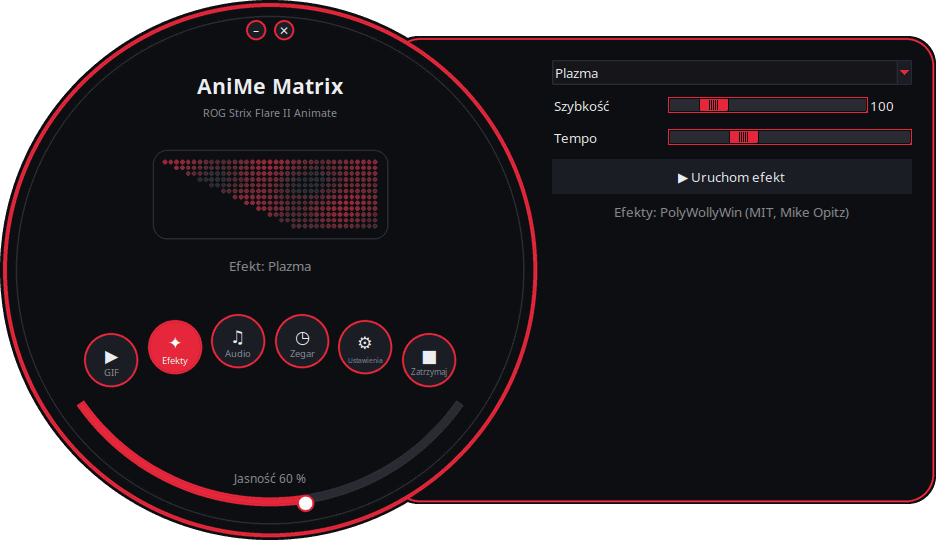
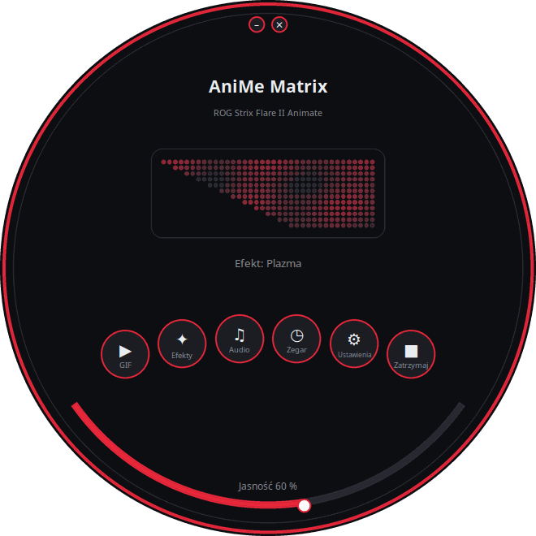
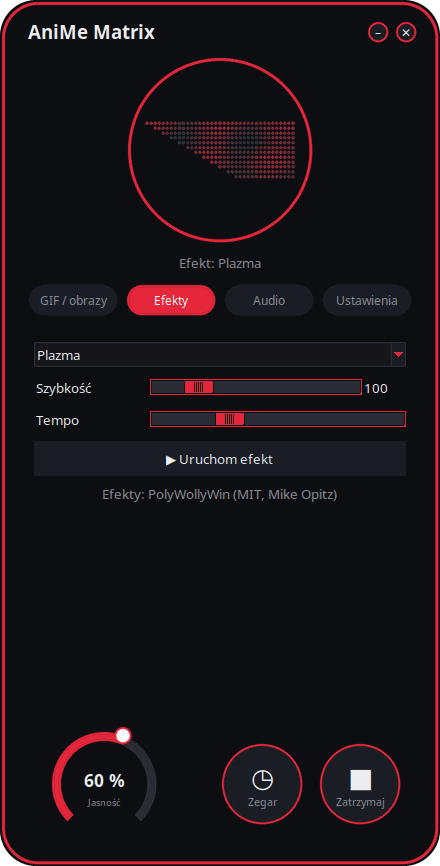
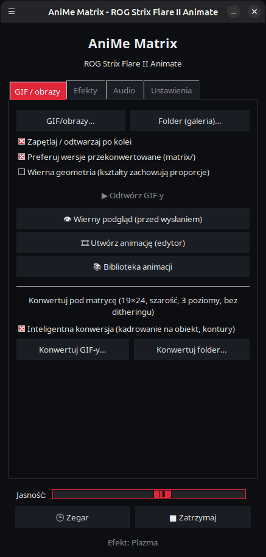

<p align="center">
  
</p>

# AniMe Matrix dla Linuksa — ROG Strix Flare II Animate

[](https://github.com/AntiCitoyen/Anticitoyen-ROG-flare2-anime-matrix/releases/latest)
[](https://github.com/AntiCitoyen/Anticitoyen-ROG-flare2-anime-matrix/actions/workflows/ci.yml)
[](../../LICENSE)
[](https://buymeacoffee.com/anticitoyen)

Sterowanie pod Linuksem ekranem **AniMe Matrix** (312 mini-diod LED) klawiatury **ASUS ROG Strix Flare II Animate**, bez Armoury Crate ani Windows: GIF-y i galeria, zegar, efekty i wizualizatory audio, gry, monitor systemu, powiadomienia pulpitu, harmonogram, edytor animacji, wspólna biblioteka, zsynchronizowane kolory klawiatury.

<div align="center">

[🇫🇷 Français](../../README.md) · [🇬🇧 English](README.en.md) · [🇪🇸 Español](README.es.md) · [🇩🇪 Deutsch](README.de.md) · [🇮🇹 Italiano](README.it.md) · [🇧🇷 Português](README.pt-BR.md) · [🇳🇱 Nederlands](README.nl.md) · **🇵🇱 Polski** · [🇷🇺 Русский](README.ru.md) · [🇺🇦 Українська](README.uk.md) · [🇹🇷 Türkçe](README.tr.md) · [🇸🇦 العربية](README.ar.md) · [🇮🇳 हिन्दी](README.hi.md) · [🇨🇳 简体中文](README.zh-CN.md) · [🇹🇼 繁體中文](README.zh-TW.md) · [🇯🇵 日本語](README.ja.md) · [🇰🇷 한국어](README.ko.md) · [🇻🇳 Tiếng Việt](README.vi.md) · [🇮🇩 Bahasa Indonesia](README.id.md)

</div>

<p align="center"><br><em>Tarcza + szuflada (interfejs domyślny)</em></p>

| Tarcza | Zaokrąglony | Klasyczny |
|:---:|:---:|:---:|
|  |  |  |

<p align="center"></p>

---

## Spis treści

- [Co robi projekt](#projet)
- [Obsługiwany sprzęt](#materiel)
- [Instalacja](#installation)
- [Użytkowanie](#utilisation)
- [Przygotowanie dobrych GIF-ów](#gif)
- [Jak to działa](#fonctionnement)
- [Rozwiązywanie problemów](#depannage)
- [Organizacja repozytorium](#depot)
- [Budowanie pakietów](#deb)
- [Podziękowania](#credits)
- [Licencja](#licence)
- [Wsparcie projektu](#soutien)

---

<a id="projet"></a>

## Co robi projekt

ASUS udostępnia ekran AniMe Matrix tej klawiatury wyłącznie pod Windows (Armoury Crate). Ten projekt komunikuje się bezpośrednio z klawiaturą przez USB HID i dostarcza:

**Wyświetlanie**
- **GIF-y, obrazy i filmy**: pojedynczy plik, wybór plików lub cały folder jako galeria, do przeciągnięcia i upuszczenia na okno; filmy (MP4, WebM, MKV…) odtwarzane przez ffmpeg; galeria miniatur; przekonwertowane klatki trzymane w pamięci podręcznej (galeria 400 GIF-ów mieści się w ~25 MB pamięci).
- **Zegar**: tarcza cyfrowa, analogowa, binarna, słowna (francuski, angielski, niemiecki, hiszpański, włoski, portugalski, niderlandzki) lub stylizowana.
- **Animowane efekty** (deszcz w stylu Matrix, plazma, ogień, gwiazdy, fajerwerki, błyskawice, metaballe, fala…) oraz **7 wizualizatorów audio** reagujących na dźwięk odtwarzany przez komputer.
- **Tekst**: Twoja wiadomość, w każdym piśmie (znaki diakrytyczne, cyrylica, arabski, hindi, chiński, japoński, koreański…), przewijana w lewo, w prawo, w górę, w dół lub nieruchoma.
- **Kamera** (obraz lub sylwetka) i **lustro ekranu** (cały ekran, obszar wokół myszy lub aktywne okno).
- **Monitor systemu**: CPU, RAM, GPU, temperatura, przepustowość sieci i godzina, w formie wskaźników.
- **Aktualnie odtwarzany utwór**: przy zmianie utworu „WYKONAWCA - TYTUŁ” przewija się raz, a następnie pojawia się wizualizator (Spotify, VLC, Rhythmbox, przeglądarki… przez MPRIS).
- **Powiadomienia pulpitu**: „APLIKACJA: TYTUŁ” wyświetla się jako nakładka, po czym odtwarzanie wraca do poprzedniego stanu (domyślnie wyłączone, lista dozwolonych aplikacji).
- **Grywalne gry** na klawiaturze: Snake, Pong (w pojedynkę lub we dwóch), Tetris, Breakout, Invaders, Flappy, z rekordami.
- **Wskaźniki**: małe świecące bloki, gdy mikrofon jest wyciszony lub używany, gdy kamera działa, gdy OBS nadaje lub nagrywa.
- **Pamięć klawiatury**: animacja (GIF, obraz) zapisana w klawiaturze wyświetla się bez żadnego oprogramowania, zaraz po podłączeniu, nawet na innym komputerze; regulowana jasność (karta GIF, `animematrix-ctl memoire`).

**Tworzenie**
- **Edytor animacji** klatka po klatce, na rzeczywistej geometrii ekranu: 3 poziomy, oś czasu, warstwa-widmo, przesunięcie, kopiuj-wklej, podgląd, wysyłanie do klawiatury, eksport GIF.
- **Wspólna biblioteka animacji**: przeglądaj, odtwarzaj, dodawaj do swojej galerii, zgłaszaj własne.
- **Inteligentna konwersja** GIF-ów: kadrowanie na obiekcie, jasny obiekt na czarnym tle, wzmocnione kontury, 3 poziomy.
- **Wierny podgląd** przed wysłaniem: symulowane wyświetlanie ekranu (rzeczywisty układ, poświata między diodami).
- **Efekty jako rozszerzenia**: plik Python umieszczony w folderze dodaje efekt (zob. [../EXTENSIONS.md](../EXTENSIONS.md)).

**Automatyzacja**
- **Demon `animematrixd`**: jedyny właściciel ekranu, kontynuuje wyświetlanie po zamknięciu launchera; polecenie `animematrix-ctl` i opcjonalne lokalne API HTTP.
- **Harmonogram**: przedziały czasowe (dni, także noc) z zegarem, galerią, monitorem, aktualnie odtwarzanym utworem, efektem, listą odtwarzania lub wyłączonym ekranem; czarny ekran, gdy sesja jest zablokowana, w uśpieniu lub gdy aplikacja działa w pełnym ekranie.
- **Profile aplikacji**: własna zawartość dla gry lub aplikacji, dopóki jest na pierwszym planie (przycisk *Wykryj*).
- **Listy odtwarzania i ulubione**: GIF-y, efekty, zegar… każdy przez swój czas, w pętli; także w ikonie na pasku systemowym i w wierszu poleceń.
- **Pilot przez przeglądarkę**: strona do sterowania ekranem z telefonu w sieci lokalnej (kod QR, token).
- **Zakończenie długich poleceń**: w terminalu wyświetla się „Gotowe: make 2 min 05”, gdy długie polecenie się kończy.
- **Kolory i efekty klawiszy**, bez OpenRGB: tęcza, statyczny, oddychanie, cykl, reaktywny, fale, gwiaździsta noc, ruchome piaski, prąd, deszcz — wykonywane przez klawiaturę i zachowane po odłączeniu; albo kolor motywu, pulsowanie z ekranem.
- **Ikona na pasku systemowym**: szybkie menu (tryby, jasność).

**Wygoda**
- **4 interfejsy** (*Tarcza + szuflada* domyślnie, *Tarcza*, *Zaokrąglony*, *Klasyczny*) z **podglądem 312 diod LED na żywo**, **11 motywami** (5 ROG, 5 różowych, systemowy) i **19 językami**.
- **X11 i Wayland**: reakcja na klawiaturę przez evdev, aktywne okno odczytywane z Sway, Hyprland, KDE (kdotool) lub GNOME (rozszerzenie *Window Calls*).
- **Wbudowane aktualizacje**: launcher pobiera najnowsze wydanie, sprawdza jego odcisk SHA-256 i instaluje je (hasło administratora); albo `apt upgrade` z repozytorium APT.

<a id="materiel"></a>

## Obsługiwany sprzęt

| Urządzenie | USB | Stan |
|---|---|---|
| ASUS ROG Strix Flare II Animate | `0b05:19fc` | obsługiwane (HID, interfejs 4, usage page `0xFF02`) |
| Ekrany AniMe Matrix laptopów ROG (G14, G16…) | różne | **eksperymentalne** przez `asusctl`, nietestowane na sprzęcie (zob. [Użytkowanie](#utilisation)) |

Testowano na Ubuntu 26.04 (X11, PipeWire, Cinnamon). Każda dystrybucja z Pythonem ≥ 3.10, hidapi, Tk i systemd powinna działać; pod Waylandem launcher działa przez XWayland.

<a id="installation"></a>

## Instalacja

### Repozytorium APT (Debian, Ubuntu, Mint, Pop!_OS…) — aktualizacje przez `apt upgrade`

```bash
curl -fsSL https://anticitoyen.github.io/Anticitoyen-ROG-flare2-anime-matrix/animematrix.gpg \
  | sudo tee /usr/share/keyrings/animematrix.gpg >/dev/null
echo "deb [signed-by=/usr/share/keyrings/animematrix.gpg] https://anticitoyen.github.io/Anticitoyen-ROG-flare2-anime-matrix stable main" \
  | sudo tee /etc/apt/sources.list.d/animematrix.list
sudo apt update && sudo apt install anticitoyen-rog-flare2-anime-matrix
```

Następnie **odłącz i podłącz ponownie klawiaturę** (reguła udev nadaje dostęp zalogowanemu użytkownikowi) i uruchom **AniMe Matrix** z menu.

### Inne formaty (strona [Releases](https://github.com/AntiCitoyen/Anticitoyen-ROG-flare2-anime-matrix/releases/latest))

| System | Plik | Instalacja |
|---|---|---|
| Debian, Ubuntu… | `anticitoyen-rog-flare2-anime-matrix_<version>_all.deb` | `sudo apt install ./anticitoyen-rog-flare2-anime-matrix_*_all.deb` |
| Fedora, openSUSE… | `anticitoyen-rog-flare2-anime-matrix-<version>-1.noarch.rpm` | `sudo dnf install ./anticitoyen-rog-flare2-anime-matrix-*.noarch.rpm` |
| Arch, Manjaro… | `anticitoyen-rog-flare2-anime-matrix-<version>-1-any.pkg.tar.zst` | `sudo pacman -U anticitoyen-rog-flare2-anime-matrix-*.pkg.tar.zst` |
| Wszystkie (Flatpak) | `AniMeMatrix-<version>.flatpak` | `flatpak install --user AniMeMatrix-*.flatpak` (zainstaluj też regułę udev poniżej; bez wizualizatorów audio) |

Pakiet instaluje:

| Element | Lokalizacja |
|---|---|
| Programy | `/usr/share/anticitoyen-rog-flare2-anime-matrix/` |
| Polecenia | `animematrix`, `animematrixd`, `animematrix-ctl`, `animematrix-bascule`, `animematrix-animation`, `animematrix-apercu`, `animematrix-convertir`, `animematrix-effet`, `animematrix-galerie`, `animematrix-horloge`, `animematrix-dessin`, `animematrix-tray`, `animematrix-memoire` |
| Usługa użytkownika | `/usr/lib/systemd/user/animematrixd.service` (włączona dla wszystkich sesji) |
| Reguła udev | `/usr/lib/udev/rules.d/72-rog-flare2-animate.rules` |
| Menu i ikona | `animematrix.desktop`, ikona `animematrix` |

### Ze źródeł

```bash
git clone https://github.com/AntiCitoyen/Anticitoyen-ROG-flare2-anime-matrix.git
cd Anticitoyen-ROG-flare2-anime-matrix
python3 -m venv .venv
.venv/bin/pip install hidapi pillow numpy pynput python-xlib
# dostęp do klawiatury bez roota
sudo cp packaging/72-rog-flare2-animate.rules /etc/udev/rules.d/
sudo udevadm control --reload-rules && sudo udevadm trigger
# następnie odłącz/podłącz ponownie klawiaturę
.venv/bin/python rog_flare2_launcher.py
```

Przydatne narzędzia systemowe: `imagemagick` (klasyczna konwersja), `pulseaudio-utils` (`parec`, do audio), `zenity` (wybór plików), `libnotify-bin` (powiadomienia), `python3-gi` i `gir1.2-ayatanaappindicator3-0.1` (ikona na pasku systemowym), `ffmpeg` (filmy, kamera, lustro ekranu), `python3-evdev` (reakcja na klawiaturę pod Waylandem), `x11-utils` (aktywne okno pod X11), `python3-qrcode` (kod QR pilota), `tkdnd` (przeciągnij i upuść).

<a id="utilisation"></a>

## Użytkowanie

### Launcher

`animematrix` (lub wpis **AniMe Matrix** w menu).

W okrągłych interfejsach okrągłe przyciski otwierają bloki *GIF*, *Efekty*, *Audio* i *Ustawienia* (w szufladzie lub w kole); *Zegar* i *Zatrzymaj* działają natychmiast; dolny łuk reguluje jasność; okno przesuwa się, przeciągając je za tło; małe przyciski u góry minimalizują lub zamykają. Okrągły kształt wykorzystuje rozszerzenie X11 SHAPE (pakiet `python3-xlib`); bez niego ten sam interfejs wyświetla się w prostokątnym oknie.

- **GIF / obrazy**: *GIF/obrazy…* lub *Folder (galeria)…* (lub przeciągnij i upuść na okno); *Wierna geometria* zachowuje proporcje (róg przycina obraz zamiast go rozciągać); *👁 Wierny podgląd (przed wysłaniem)* pokazuje wynik bez niczego wysyłania; *🎞 Utwórz animację (edytor)*; *📚 Biblioteka animacji*; *★ Listy odtwarzania i ulubione*; *🖼 Galeria miniatur* (klik: odtwórz, prawy klik: ulubione); *🎥 Kamera* i *🖥 Lustro ekranu*; *Inteligentna konwersja* do przekształcania GIF-ów.
- **Efekty** i **Audio**: wybierz, ustaw, *▶ Uruchom efekt*. Suwaki działają na żywo; *Tempo* przyspiesza lub spowalnia całą animację. Efekt *Tekst* przyjmuje Twoją wiadomość i kierunek przewijania. Gry gra się strzałkami, spacją i Enterem, gdy okno launchera jest na pierwszym planie; Pong we dwóch: Z/W i S dla lewego gracza.
- **Jasność**, **🕒 Zegar**, **■ Zatrzymaj** (co czyści ekran) są wspólne dla wszystkich zakładek.
- **Ustawienia**: start sesji (Galeria GIF, Zegar, Ostatnie odtwarzanie lub Nic), tarcza zegara, język, motyw, interfejs, powiadomienia pulpitu, kolory klawiatury, *Harmonogram…* (wyzwalacze, profile aplikacji, przedziały czasu), *Wskaźniki (mikrofon, kamera, OBS)…*, *Pilot przez przeglądarkę…*, ikona na pasku systemowym, zakończenie długich poleceń, folder rozszerzeń, aktualizacje.

**Zamknięcie launchera niczego nie przerywa**: demon `animematrixd` kontynuuje wyświetlanie. *■ Zatrzymaj* wyłącza ekran.

### Demon i wiersz poleceń

```bash
animematrix-ctl etat                               # co jest wyświetlane
animematrix-ctl gif ~/Images/AniMe-Matrix --fidele # galeria (folder lub pliki)
animematrix-ctl effet "Plasma" --param speed=250   # efekt i ustawienia
animematrix-ctl horloge
animematrix-ctl texte "Bonjour"
animematrix-ctl effet "Text" --param message="Salut" --param direction=haut
animematrix-ctl liste "Soirée"                     # lista odtwarzania (bez nazwy: wyświetla listy)
animematrix-ctl favori 2                           # ulubiony nr 2 (bez numeru: wyświetla ulubione)
animematrix-ctl notifier "Café prêt" --duree 5     # nakładka, potem powrót
animematrix-ctl memoire anim.gif                   # zapisana w klawiaturze (najwyżej 196 klatek)
animematrix-ctl clavier                            # pokazuje zapisaną animację
animematrix-ctl luminosite 60
animematrix-ctl stop
```

| Komenda | Rola |
|---|---|
| `animematrix-bascule [gif\|horloge\|lecture\|off\|etat]` | przełącznik (także pod prawym przyciskiem ikony w menu); wybrany tryb jest też trybem startu sesji |
| `animematrixd --http 8765` | demon z lokalnym API HTTP (`POST http://127.0.0.1:8765/api`, `Content-Type: application/json`, ten sam JSON co gniazdo) |
| `animematrix-animation [plik.gif]` | edytor animacji |
| `animematrix-apercu plik.gif -o apercu.gif` | wierny podgląd GIF-a (plik) |
| `animematrix-convertir folder/ [--fidele] [--classique]` | konwertuje GIF-y pod matrycę (do `folder/matrix/`) |
| `animematrix-effet --liste` | wyświetla listę efektów i wizualizatorów |
| `animematrix-dessin` | edytor dioda po diodzie (oddaje kontrolę demonowi po zamknięciu) |

### Audio

Wizualizatory nasłuchują **monitora domyślnego wyjścia dźwięku** za pomocą `parec` (PipeWire lub PulseAudio): reagują na to, co odtwarza komputer, a nie na mikrofon.

### Efekt „Keyboard React”

Zapala ekran w rytm pisania, dopóki efekt działa: pod X11 przez `pynput`, pod Waylandem odczytując klawiaturę w `/dev/input` (`python3-evdev`). Jeśli pod Waylandem efekt pozostaje w trybie demo, zezwól na odczyt tylko klawiatury ROG:

```bash
sudo cp /usr/share/anticitoyen-rog-flare2-anime-matrix/udev/73-rog-flare2-animate-touches.rules /etc/udev/rules.d/
sudo udevadm control --reload-rules && sudo udevadm trigger
```

### Wskaźniki

*Ustawienia* → *Wskaźniki (mikrofon, kamera, OBS)…*: blok 2 × 2 diod zapala się w lewym górnym rogu ekranu, ponad odtwarzaną treścią (1: mikrofon wyciszony lub używany, 2: kamera używana, 3: OBS na żywo lub nagrywa), a każdą zmianę może ogłosić przewijany tekst. OBS: włącz serwer WebSocket (*Narzędzia* → *Ustawienia serwera WebSocket*) i przepisz jego port i hasło.

### Pilot przez przeglądarkę

*Ustawienia* → *Pilot przez przeglądarkę…*: zaznacz *Włącz pilota przez przeglądarkę*, a następnie otwórz adres (lub zeskanuj kod QR) na telefonie w tej samej sieci. Strona pokazuje ekran na żywo i oferuje zegar, galerię, efekty, ulubione, listy, jasność i wiadomość. Adres zawiera token: nie udostępniaj go, zmień go przyciskiem *Nowy token*; strona nie jest szyfrowana (HTTP): tylko zaufana sieć.

### Zakończenie długich poleceń

*Ustawienia* → *Pokazuj zakończenie długich poleceń (terminal)* dodaje wiersz do `~/.bashrc` (i `~/.zshrc`): każde polecenie trwające ponad 30 sekund wyświetla po zakończeniu „Gotowe: make 2 min 05” lub „Niepowodzenie (2): …”. Próg: `ANIMEMATRIX_FIN_SECONDES`; polecenia interaktywne (edytory, `ssh`, `less`…) są pomijane.

### Kolory klawiatury

*Ustawienia* → *🌈 Kolory klawiatury…*: efekt (tęcza, statyczny, oddychanie, cykl kolorów, reaktywny, fale, gwiaździsta noc, ruchome piaski, prąd, deszcz), kolory, szybkość, jasność, kierunek. *Wypróbuj* go stosuje, *Zapisz w klawiaturze* zachowuje po odłączeniu. *Kolor motywu* i *Pulsowanie z ekranem* demon wysyła klawisz po klawiszu; po ich wyłączeniu wraca zapisany efekt. W wierszu poleceń: `animematrix-ctl rgb arc-en-ciel --vitesse 70`, `animematrix-ctl rgb statique --couleur "#ff0000"`.

### Laptopy ROG (eksperymentalne)

Wpisz `portable-asusctl` w `~/.config/rog-flare2/materiel`, a następnie zrestartuj demona: ramki przechodzą przez `asusctl anime image` (maksymalnie 5 klatek na sekundę). Nietestowane na prawdziwym laptopie: opinie mile widziane w zgłoszeniach.

<a id="gif"></a>

## Przygotowanie dobrych GIF-ów

Ekran nie jest prostokątem: 24 przesunięte rzędy, od 19 diod na górze do 7 na dole (prawa krawędź pionowa, lewa po przekątnej), 3 naprawdę rozróżnialne poziomy szarości, poświata między sąsiednimi diodami. Sylwetki, piktogramy, krótkie teksty i powolny ruch wyglądają dobrze; zdjęcia i wideo — słabo.

Pełny przewodnik (płótno, poziomy, tempo, konwersja, wierna geometria): **[../GUIDE-GIF.md](../GUIDE-GIF.md)**.

<a id="fonctionnement"></a>

## Jak to działa

- **Transport**: hidapi otwiera interfejs HID nr 4 klawiatury i zapisuje do niego ramki o długości **1024 bajtów**; klawiatura odsyła każdą ramkę.
- **Ramka**: `60 81 00 00` + **312 bajtów** (jasność 0–255 na diodę, w kolejności sprzętowej) + zera do 1024.
- **Geometria**: 24 przesunięte rzędy (rząd r obejmuje kolumny (r+1)//2 do 18), lub równoważnie 12 rzędów logicznych po 37 → 15 kolumn (model PolyWollyWin); oba odwzorowania zweryfikowano jako identyczne dla wszystkich 312 diod.
- **Demon**: `animematrixd` samodzielnie zarządza klawiaturą; podstawowe odtwarzanie i nakładka (powiadomienia); gniazdo JSON `$XDG_RUNTIME_DIR/animematrix.sock`; automatyczne ponowne łączenie z klawiaturą.
- **Animacja**: host wysyła ramki jedna po drugiej (~30 kl./s dla efektów); wewnętrzna pamięć klawiatury nie jest wykorzystywana (badania: [../RECHERCHE-MEMOIRE.md](../RECHERCHE-MEMOIRE.md)).

Oryginalne notatki z inżynierii wstecznej znajdują się w **[../PROTOCOL.md](../PROTOCOL.md)**; przechwyty `*.cap` oraz narzędzia `parse_usbpcap.py` / `rog_flare2_replay_capture.py` pozostają w repozytorium.

⚠️ Nie wysyłaj do klawiatury pakietów przeznaczonych dla AniMe Matrix laptopów (`0x5E …`, `0xEC …`): to niewłaściwy protokół, który może zablokować klawiaturę (odłącz/podłącz ponownie, albo przytrzymaj **Fn + Esc** przez 10–15 s).

<a id="depannage"></a>

## Rozwiązywanie problemów

| Objaw | Prawdopodobna przyczyna | Rozwiązanie |
|---|---|---|
| `interface 4 not found` | klawiatura niewidoczna lub brak uprawnień | `lsusb \| grep 0b05:19fc` ; czy reguła udev jest zainstalowana? odłącz/podłącz |
| `Permission denied` / `open failed` | reguła udev nie została zastosowana | `sudo udevadm control --reload-rules && sudo udevadm trigger`, następnie podłącz ponownie |
| „Usługa animematrixd niedostępna” | demon zatrzymany | `systemctl --user restart animematrixd.service` lub `animematrixd &` |
| Ekran się nie zmienia | inny program zapisuje na klawiaturze | zamknij stare skrypty; `animematrix-ctl etat` |
| Wizualizatory pozostają w trybie demo | brak `parec` lub brak dźwięku | zainstaluj `pulseaudio-utils`, odtwórz dźwięk |
| „Keyboard React” nie reaguje | brak `pynput` (X11) lub `python3-evdev` (Wayland) albo klawiatura nieczytelna | zainstaluj pakiet; pod Waylandem reguła udev z [Keyboard React](#utilisation) |
| Kamera, filmy lub lustro ekranu nie działają | brak `ffmpeg` | `sudo apt install ffmpeg`; pod Waylandem lustro ekranu przechodzi przez portal (`gstreamer1.0-pipewire`) |
| Profile aplikacji lub pełny ekran bez efektu pod Waylandem | kompozytor nie podaje aktywnego okna | GNOME: rozszerzenie *Window Calls*; KDE: `kdotool`; Sway i Hyprland: nic do zrobienia |
| Okrągłe okno wyświetla się jako prostokąt | brak rozszerzenia SHAPE lub `python3-xlib` | `sudo apt install python3-xlib`, albo *Ustawienia* → *Interfejs:* → *Klasyczny* |
| Dziennik demona | — | `journalctl --user -u animematrixd.service -f` |

<a id="depot"></a>

## Organizacja repozytorium

| Plik | Rola |
|---|---|
| `rog_flare2_launcher.py` | launcher graficzny (Tk) |
| `rog_flare2_ui_ronde.py`, `rog_flare2_themes.py` | okrągłe interfejsy, motywy |
| `rog_flare2_i18n.py`, `locale/` | tłumaczenie (19 języków; `locale/_cles.json` = teksty do przetłumaczenia; [../TRADUIRE.md](../TRADUIRE.md)) |
| `rog_flare2_demon.py`, `rog_flare2_ctl.py` | demon `animematrixd`, klient i polecenie `animematrix-ctl` |
| `rog_flare2_core.py` | odtwarzanie GIF-ów strumieniowo, pamięć podręczna klatek, zegar, geometria |
| `rog_flare2_texte.py`, `rog_flare2_horloges.py` | tekst w każdym piśmie, efekt *Tekst*, tarcze zegara |
| `rog_flare2_listes.py`, `rog_flare2_vignettes.py` | listy odtwarzania, ulubione, galeria miniatur, przeciąganie i upuszczanie |
| `rog_flare2_video.py`, `rog_flare2_voyants.py`, `rog_flare2_telecommande.py` | filmy, kamera, lustro ekranu; wskaźniki; pilot przez przeglądarkę |
| `rog_flare2_touches.py`, `rog_flare2_fenetre.py`, `rog_flare2_fin.py`, `rog_flare2_flatpak.py` | klawisze i aktywne okno (X11, Wayland), zakończenie długich poleceń, Flatpak |
| `rog_flare2_effets.py`, `polywollywin/` | efekty i wizualizatory (silnik PolyWollyWin, MIT), rozszerzenia |
| `rog_flare2_infos.py`, `rog_flare2_mpris.py`, `rog_flare2_jeux.py` | monitor systemu, aktualnie odtwarzany utwór, gry |
| `rog_flare2_notifs.py`, `rog_flare2_programme.py`, `rog_flare2_ui_programme.py` | powiadomienia, harmonogram i wyzwalacze |
| `rog_flare2_rgb.py`, `rog_flare2_tray.py`, `rog_flare2_portable.py` | kolory i efekty klawiszy, ikona na pasku systemowym, laptopy (eksperymentalne) |
| `rog_flare2_animation.py`, `rog_flare2_simulateur.py`, `rog_flare2_convertir.py` | edytor animacji, symulator, konwersja |
| `rog_flare2_bibliotheque.py`, `bibliotheque/` | biblioteka animacji (katalog, GIF CC0) |
| `rog_flare2_maj.py` | aktualizacje z wydań |
| `rog_flare2_matrix_paint.py`, `rog_flare2_clock_v3.py`, `rog_flare2_folder_player.py` | transport HID i edytor LED, zegar, galeria (narzędzia oryginalne) |
| `parse_usbpcap.py`, `rog_flare2_replay_capture.py`, `*.cap` | inżynieria wsteczna |
| `examples/effets/` | przykład rozszerzenia |
| `tests/` | testy (w tym interfejsy poprzez prawdziwe kliknięcia) |
| `systemd/`, `packaging/` | usługa użytkownika; .deb, RPM, Arch, Flatpak, repozytorium APT |
| `docs/` | przewodnik GIF, rozszerzenia, protokół, badania, zrzuty ekranu, przetłumaczone README |

<a id="deb"></a>

## Budowanie pakietów

```bash
packaging/build-deb.sh
# → dist/anticitoyen-rog-flare2-anime-matrix_<version>_all.deb
```

`packaging/install.sh` instaluje projekt w dowolnej strukturze katalogów; służy do budowy .deb, RPM (`packaging/rpm/`), pakietu Arch (`packaging/aur/`) i Flatpaka (`packaging/flathub/`). Przy każdym opublikowanym wydaniu GitHub buduje RPM, pakiet Arch i Flatpak oraz aktualizuje podpisane repozytorium APT. Wersja jest odczytywana z `rog_flare2_core.py` (`VERSION`). Testy: `python -m pytest tests`.

<a id="credits"></a>

## Podziękowania

- **NicRoss512** — inżynieria wsteczna protokołu, oryginalny zegar i edytor: [ASUS-ROG-Strix-Flare-II-Animate-AniMe-Matrix-Protocol](https://github.com/NicRoss512/ASUS-ROG-Strix-Flare-II-Animate-AniMe-Matrix-Protocol). To repozytorium wychodzi z tego projektu; jego historia commitów została zachowana.
- **Mike Opitz** — [PolyWollyWin](https://github.com/MikeOpitz99/PolyWollyWin) (MIT), kontroler dla Windows, którego silnik efektów i wizualizatorów audio został tu wykorzystany.
- **Yoshi Walsh** — [Mastering the AniMe Matrix](https://blog.yoshiwalsh.me/asus-anime-matrix/), za opis zachowania diod (poświata, odbierane poziomy, tempo).
- **asus-linux** — [asusctl](https://gitlab.com/asus-linux/asusctl), używane dla ekranów laptopów.

Projekt niezależny, niezwiązany z ASUS. „ROG”, „AniMe Matrix” i „Armoury Crate” są znakami towarowymi ASUSTeK.

<a id="licence"></a>

## Licencja

[MIT](../../LICENSE) dla kodu tego repozytorium; animacje z `bibliotheque/` na licencji CC0. `polywollywin/` pozostaje na licencji MIT swojego autora ([../../polywollywin/LICENSE](../../polywollywin/LICENSE)). Oryginalne pliki NicRoss512 (`rog_flare2_clock_v3.py`, `rog_flare2_matrix_paint.py`, `parse_usbpcap.py`, `rog_flare2_replay_capture.py`, `../PROTOCOL.md`, przechwyty) zostały opublikowane bez jawnej licencji i pozostają własnością ich autora; są redystrybuowane z podaniem źródła.

<a id="soutien"></a>

## Wsparcie projektu

Jeśli ten projekt jest dla Ciebie przydatny, kawa pomaga w jego utrzymaniu:

[](https://buymeacoffee.com/anticitoyen)

**https://buymeacoffee.com/anticitoyen** — link znajduje się także w zakładce *Ustawienia* launchera.

Zgłoszenia błędów, pomysły i animacje do udostępnienia: [Issues](https://github.com/AntiCitoyen/Anticitoyen-ROG-flare2-anime-matrix/issues). Tłumaczenia: [../TRADUIRE.md](../TRADUIRE.md).
