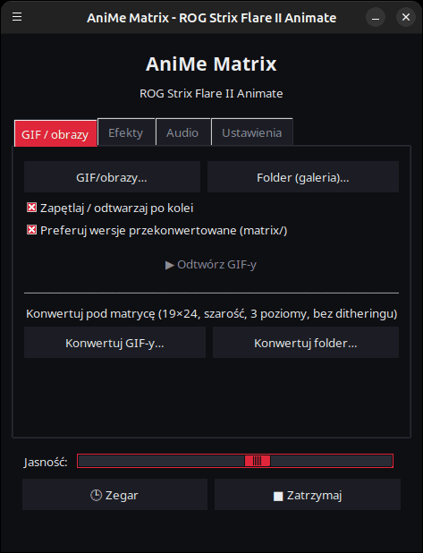
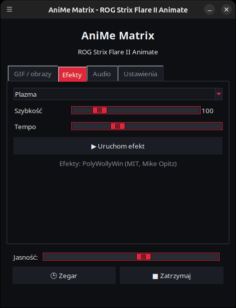
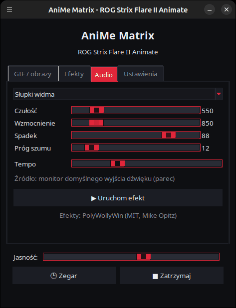
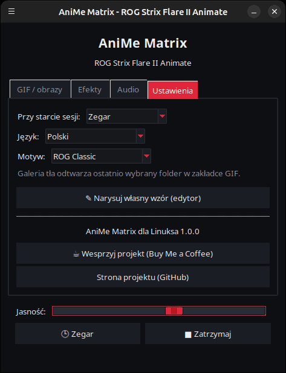

<p align="center">
  
</p>

# AniMe Matrix dla Linuksa — ROG Strix Flare II Animate

[](https://github.com/AntiCitoyen/Anticitoyen-ROG-flare2-anime-matrix/releases/latest)
[](../../LICENSE)
[](https://buymeacoffee.com/anticitoyen)

Sterowanie pod Linuksem ekranem **AniMe Matrix** (312 mini-diod LED) klawiatury **ASUS ROG Strix Flare II Animate**, bez Armoury Crate ani Windows: GIF-y i obrazy, galeria tła, zegar, 19 animowanych efektów, 7 wizualizatorów audio, rysowanie dioda po diodzie.

Interfejs jest dostępny w 19 językach — automatycznie dopasowuje się do języka systemu, a zmienisz go w zakładce *Ustawienia* → *Język:*.

<div align="center">

[🇫🇷 Français](../../README.md) · [🇬🇧 English](README.en.md) · [🇪🇸 Español](README.es.md) · [🇩🇪 Deutsch](README.de.md) · [🇮🇹 Italiano](README.it.md) · [🇧🇷 Português](README.pt-BR.md) · [🇳🇱 Nederlands](README.nl.md) · **🇵🇱 Polski** · [🇷🇺 Русский](README.ru.md) · [🇺🇦 Українська](README.uk.md) · [🇹🇷 Türkçe](README.tr.md) · [🇸🇦 العربية](README.ar.md) · [🇮🇳 हिन्दी](README.hi.md) · [🇨🇳 简体中文](README.zh-CN.md) · [🇹🇼 繁體中文](README.zh-TW.md) · [🇯🇵 日本語](README.ja.md) · [🇰🇷 한국어](README.ko.md) · [🇻🇳 Tiếng Việt](README.vi.md) · [🇮🇩 Bahasa Indonesia](README.id.md)

</div>

| GIF / obrazy | Efekty | Audio | Ustawienia |
|---|---|---|---|
|  |  |  |  |

<p align="center"></p>

---

## Spis treści

- [Co robi projekt](#projet)
- [Obsługiwany sprzęt](#materiel)
- [Instalacja](#installation)
- [Użytkowanie](#utilisation)
- [Przygotowanie dobrych GIF-ów](#gif)
- [Jak to działa](#fonctionnement)
- [Rozwiązywanie problemów](#depannage)
- [Organizacja repozytorium](#depot)
- [Budowanie pakietu .deb](#deb)
- [Podziękowania](#credits)
- [Licencja](#licence)
- [Wsparcie projektu](#soutien)

---

<a id="projet"></a>

## Co robi projekt

ASUS udostępnia ekran AniMe Matrix tej klawiatury wyłącznie pod Windows (Armoury Crate). Ten projekt komunikuje się bezpośrednio z klawiaturą przez USB HID i dostarcza:

- **Graficzny launcher** (`animematrix`) z czterema zakładkami:
  - **GIF / obrazy** (*GIF/obrazy…*): odtwarzanie jednego lub kilku plików albo całego folderu jako galerii, w pętli; konwersja GIF-ów pod matrycę.
  - **Efekty**: 19 animacji (deszcz w stylu Matrix, plazma, ogień, gwiazdy, fajerwerki, błyskawice, metaballe, fala, wąż, przewijany tekst, stylizowany zegar, reakcja na klawiaturę…), regulowanych w trakcie działania.
  - **Audio**: 7 wizualizatorów reagujących na dźwięk odtwarzany przez komputer (widmo, KITT/KARR, starburst, oscyloskop, ogień audio…).
  - **Ustawienia**: co wyświetla się przy otwarciu sesji, język interfejsu, edytor rysunku, linki projektu.
- **Zegar** HH:MM, z poziomu launchera lub jako usługa w tle.
- **Galeria tła**: usługa `systemd --user`, która przewija folder z GIF-ami od razu po otwarciu sesji.
- **Przełącznik jednym kliknięciem** (`animematrix-bascule`): ikona w menu włącza lub wyłącza ekran; kliknięcie prawym przyciskiem pozwala wybrać Galeria GIF, Zegar lub Wyłącz.
- **Konwersję GIF-ów dostosowaną do matrycy** (`animematrix-convertir`): 19×24, skala szarości, 3 poziomy, bez ditheringu — zob. [../GUIDE-GIF.md](../GUIDE-GIF.md).
- **Edytor rysunku** dioda po diodzie (`animematrix-dessin`).
- **11 motywów**: 5 inspirowanych ROG (Classic, Strix, Glitch, Gold, Carbon), 5 różowych (Sakura, Guma balonowa, Różowe złoto, Lawendowy róż, Różowa noc) oraz systemowy, do wyboru w *Ustawienia* → *Motyw:*.
- **Niskie zużycie zasobów**: GIF-y są dekodowane klatka po klatce; galeria 400 GIF-ów działa w ~25 MB pamięci.

<a id="materiel"></a>

## Obsługiwany sprzęt

| Klawiatura | USB | Interfejs |
|---|---|---|
| ASUS ROG Strix Flare II Animate | `0b05:19fc` | HID, interfejs 4 (usage page `0xFF02`) |

Ekrany AniMe Matrix w **laptopach** ROG (Zephyrus G14 itd.) korzystają z innego protokołu: **nie są** tu obsługiwane (zamiast tego zob. `asusctl`).

Testowano na Ubuntu 26.04 (X11, PipeWire). Każda dystrybucja z Pythonem ≥ 3.10, hidapi, Tk i systemd powinna działać.

<a id="installation"></a>

## Instalacja

### Pakiet .deb (Debian, Ubuntu, Mint, Pop!_OS…)

1. Pobierz `anticitoyen-rog-flare2-anime-matrix_<version>_all.deb` ze strony [Releases](https://github.com/AntiCitoyen/Anticitoyen-ROG-flare2-anime-matrix/releases/latest).
2. Zainstaluj go (apt pobierze zależności):
   ```bash
   sudo apt install ./anticitoyen-rog-flare2-anime-matrix_*_all.deb
   ```
3. **Odłącz i podłącz ponownie klawiaturę** (reguła udev nadaje dostęp zalogowanemu użytkownikowi).
4. Uruchom **AniMe Matrix** z menu aplikacji albo poleceniem `animematrix` w terminalu.

Pakiet instaluje:

| Element | Lokalizacja |
|---|---|
| Programy | `/usr/share/anticitoyen-rog-flare2-anime-matrix/` |
| Polecenia | `animematrix`, `animematrix-bascule`, `animematrix-effet`, `animematrix-galerie`, `animematrix-horloge`, `animematrix-convertir`, `animematrix-dessin` |
| Usługi użytkownika | `/usr/lib/systemd/user/animematrix-galerie.service`, `animematrix-horloge.service` (domyślnie nieaktywne) |
| Reguła udev | `/usr/lib/udev/rules.d/72-rog-flare2-animate.rules` |
| Menu i ikona | `animematrix.desktop`, ikona `animematrix` |

Odinstalowanie: `sudo apt remove anticitoyen-rog-flare2-anime-matrix`.

### Ze źródeł

```bash
git clone https://github.com/AntiCitoyen/Anticitoyen-ROG-flare2-anime-matrix.git
cd Anticitoyen-ROG-flare2-anime-matrix
python3 -m venv .venv
.venv/bin/pip install hidapi pillow numpy pynput
# dostęp do klawiatury bez roota
sudo cp packaging/72-rog-flare2-animate.rules /etc/udev/rules.d/
sudo udevadm control --reload-rules && sudo udevadm trigger
# następnie odłącz i podłącz ponownie klawiaturę
.venv/bin/python rog_flare2_launcher.py
```

Przydatne narzędzia systemowe: `imagemagick` (konwersja), `pulseaudio-utils` (`parec`, do audio), `zenity` (wybór plików), `libnotify-bin` (powiadomienia przełącznika).

Dla usług w tle uruchamianych ze źródeł: skopiuj `systemd/*.service` do `~/.config/systemd/user/`, zamieniając linie `ExecStart=` na ścieżkę do `.venv/bin/python` i odpowiedniego skryptu (`rog_flare2_folder_player.py`, `rog_flare2_clock_v3.py`), a następnie wykonaj `systemctl --user daemon-reload`.

<a id="utilisation"></a>

## Użytkowanie

### Launcher

`animematrix` (lub wpis **AniMe Matrix** w menu).

- **GIF / obrazy**: *GIF/obrazy…* dla wyboru pojedynczych plików, *Folder (galeria)…* dla całego folderu. Wybrany folder staje się też folderem galerii tła. *Preferuj wersje przekonwertowane* odczytuje `folder/matrix/nazwa.gif`, jeśli istnieje (powstały w wyniku konwersji).
- **Efekty** i **Audio**: wybierz, ustaw, *▶ Uruchom efekt*. Suwaki działają na żywo; *Tempo* przyspiesza lub spowalnia animację.
- **Jasność**, **🕒 Zegar**, **■ Zatrzymaj** (co czyści ekran) są wspólne dla wszystkich zakładek.
- **Ustawienia**: *Przy starcie sesji* = Galeria GIF, Zegar lub Nic; *Język:* zmienia język interfejsu (launcher uruchamia się ponownie).

Gdy launcher coś wyświetla, wstrzymuje usługę tła (tylko jeden program może zapisywać do klawiatury) i wznawia ją po zamknięciu.

### Przełącznik i usługi w tle

```bash
animematrix-bascule            # włączone → wyłączone ; wyłączone → ostatni tryb
animematrix-bascule gif        # galeria tła, także przy starcie sesji
animematrix-bascule horloge    # zegar w tle, także przy starcie sesji
animematrix-bascule off        # wyłączone, nic przy starcie
animematrix-bascule etat       # bieżący tryb
```

Te same opcje znajdują się w menu pod prawym przyciskiem ikony. Pod spodem: `systemctl --user enable --now animematrix-galerie.service` (lub `animematrix-horloge.service`).

### Z wiersza poleceń

| Polecenie | Rola |
|---|---|
| `animematrix-effet --liste` | wyświetla listę efektów i wizualizatorów |
| `animematrix-effet "Plasma" --brightness 60 --vitesse 1.5` | uruchamia efekt (Ctrl+C zatrzymuje) |
| `animematrix-galerie [folder] --brightness 60 [--originaux]` | przewija folder (domyślnie ostatnio wybrany w launcherze, w przeciwnym razie `~/Images/AniMe-Matrix`) |
| `animematrix-horloge -b 25` | zegar; `--clear` czyści ekran, `--once --text 12:34` wyświetla tekst |
| `animematrix-convertir folder/ [--sortie D] [--force]` | konwertuje GIF-y pod matrycę (do `folder/matrix/`) |
| `animematrix-dessin` | edytor rysunku |

### Audio

Wizualizatory nasłuchują **monitora domyślnego wyjścia dźwięku** za pomocą `parec` (PipeWire lub PulseAudio): reagują na to, co odtwarza komputer, a nie na mikrofon. Aby zmienić wyjście, zmień domyślne wyjście dźwięku systemu.

### Efekt „Reakcja na klawiaturę”

Zapala ekran w rytm pisania dzięki `pynput`, który odczytuje klawisze z całej sesji, dopóki efekt działa. Działa pod X11; pod Waylandem nie odbiera klawiszy.

<a id="gif"></a>

## Przygotowanie dobrych GIF-ów

Ekran nie jest prostokątem: 24 przesunięte rzędy, od 19 diod na górze do 7 na dole, 3 wyraźnie rozróżnialne poziomy szarości, poświata między sąsiednimi diodami. Sylwetki, piktogramy, krótkie teksty i powolny ruch wyglądają dobrze; zdjęcia i wideo — nie.

Pełny przewodnik (rozmiar płótna, poziomy, częstotliwość, jasność, polecenie ImageMagick): **[../GUIDE-GIF.md](../GUIDE-GIF.md)**.

<a id="fonctionnement"></a>

## Jak to działa

- **Transport**: hidapi otwiera interfejs HID nr 4 klawiatury i zapisuje do niego ramki o długości **1024 bajtów**.
- **Ramka**: `60 81 00 00` + **312 bajtów** (jasność 0–255 na diodę, w kolejności sprzętowej) + zera do 1024.
- **Geometria**: 24 rzędy przesunięte po przekątnej (19 → 7 diod), lub równoważnie 12 rzędów logicznych po 37 → 15 kolumn (model PolyWollyWin); obie reprezentacje zweryfikowano jako identyczne dla wszystkich 312 diod.
- **GIF**: każda klatka jest odtwarzana w pełni (zoptymalizowane GIF-y przechowują tylko różnice), konwertowana do skali szarości, sprowadzana do 24 rzędów i próbkowana rząd po rzędzie.
- **Animacja**: brak pamięci wbudowanej w urządzenie; animację tworzy host, wysyłając kolejne ramki jedna po drugiej (~30 kl./s dla efektów).

Oryginalne notatki z inżynierii wstecznej (przechwyty USBPcap, kolejność diod, punkty kalibracji) znajdują się w **[../PROTOCOL.md](../PROTOCOL.md)**; przechwyty `*.cap` i narzędzia `parse_usbpcap.py` / `rog_flare2_replay_capture.py` pozostają w repozytorium dla chętnych na dalsze zgłębianie.

⚠️ Nie wysyłaj do klawiatury pakietów przeznaczonych dla AniMe Matrix z laptopów (`0x5E …`, `0xEC …`): to niewłaściwy protokół, który może zablokować klawiaturę (odłącz i podłącz ponownie, albo przytrzymaj **Fn + Esc** przez 10–15 s).

<a id="depannage"></a>

## Rozwiązywanie problemów

| Objaw | Prawdopodobna przyczyna | Rozwiązanie |
|---|---|---|
| `interface 4 not found` | klawiatura niewidoczna lub brak uprawnień | `lsusb \| grep 0b05:19fc` ; czy reguła udev jest zainstalowana? odłącz/podłącz |
| `Permission denied` / `open failed` | reguła udev nie została zastosowana | `sudo udevadm control --reload-rules && sudo udevadm trigger`, następnie podłącz ponownie |
| Ekran się nie zmienia | inny program już zapisuje | `animematrix-bascule off`, zamknij inne launchery lub skrypty |
| Wizualizatory pozostają w trybie demo | brak `parec` lub brak dźwięku | zainstaluj `pulseaudio-utils`, odtwórz dźwięk |
| „Reakcja na klawiaturę” nie reaguje | sesja Wayland lub brak `pynput` | sesja X11, `sudo apt install python3-pynput` |
| Galeria tła się nie uruchamia | pusty lub nieistniejący folder | wybierz folder w launcherze (zakładka GIF) |
| Dziennik usługi | — | `journalctl --user -u animematrix-galerie.service -f` |

<a id="depot"></a>

## Organizacja repozytorium

| Plik | Rola |
|---|---|
| `rog_flare2_launcher.py` | launcher graficzny (Tk) |
| `rog_flare2_effets.py` | efekty i wizualizatory audio (silnik PolyWollyWin dostosowany do Linuksa) |
| `polywollywin/` | silnik efektów PolyWollyWin, skopiowany bez zmian (MIT) |
| `rog_flare2_folder_player.py` | galeria tła (usługa) |
| `rog_flare2_clock_v3.py` | zegar (usługa) |
| `rog_flare2_bascule.sh` | przełącznik galeria / zegar / wyłączony |
| `rog_flare2_convertir.py` | konwersja GIF-ów (ImageMagick) |
| `rog_flare2_matrix_paint.py` | transport HID, kolejność diod, edytor rysunku |
| `parse_usbpcap.py`, `rog_flare2_replay_capture.py`, `*.cap` | narzędzia i przechwyty z inżynierii wstecznej |
| `systemd/` | usługi użytkownika |
| `packaging/` | reguła udev, wpis menu, ikona, pliki i skrypt pakietu .deb |
| `docs/` | przewodnik GIF, notatki protokołu, zrzuty ekranu |

<a id="deb"></a>

## Budowanie pakietu .deb

```bash
packaging/build-deb.sh
# → dist/anticitoyen-rog-flare2-anime-matrix_<version>_all.deb
```

Potrzebne są tylko `dpkg-deb` i `bash`; wersja jest odczytywana z `rog_flare2_launcher.py` (`VERSION`).

<a id="credits"></a>

## Podziękowania

- **NicRoss512** — inżynieria wsteczna protokołu, oryginalny zegar i edytor: [ASUS-ROG-Strix-Flare-II-Animate-AniMe-Matrix-Protocol](https://github.com/NicRoss512/ASUS-ROG-Strix-Flare-II-Animate-AniMe-Matrix-Protocol). To repozytorium jest jego odgałęzieniem; historia commitów została zachowana.
- **Mike Opitz** — [PolyWollyWin](https://github.com/MikeOpitz99/PolyWollyWin) (MIT), kontroler dla Windows, którego silnik efektów i wizualizatorów audio został tu wykorzystany.
- **Yoshi Walsh** — [Mastering the AniMe Matrix](https://blog.yoshiwalsh.me/asus-anime-matrix/), za opis zachowania diod (poświata, odbierane poziomy, częstotliwość).

Projekt niezależny, niezwiązany z ASUS. „ROG”, „AniMe Matrix” i „Armoury Crate” są znakami towarowymi ASUSTeK.

<a id="licence"></a>

## Licencja

[MIT](../../LICENSE) dla kodu tego repozytorium. `polywollywin/` pozostaje na licencji MIT swojego autora ([../../polywollywin/LICENSE](../../polywollywin/LICENSE)). Oryginalne pliki NicRoss512 (`rog_flare2_clock_v3.py`, `rog_flare2_matrix_paint.py`, `parse_usbpcap.py`, `rog_flare2_replay_capture.py`, `../PROTOCOL.md`, przechwyty) zostały opublikowane bez jawnej licencji i pozostają własnością ich autora; są redystrybuowane z podaniem źródła.

<a id="soutien"></a>

## Wsparcie projektu

Jeśli ten projekt jest dla Ciebie przydatny, kawa pomaga w jego utrzymaniu:

[](https://buymeacoffee.com/anticitoyen)

**https://buymeacoffee.com/anticitoyen** — link znajduje się także w zakładce *Ustawienia* launchera.

Zgłoszenia błędów i pomysły: [Issues](https://github.com/AntiCitoyen/Anticitoyen-ROG-flare2-anime-matrix/issues).
