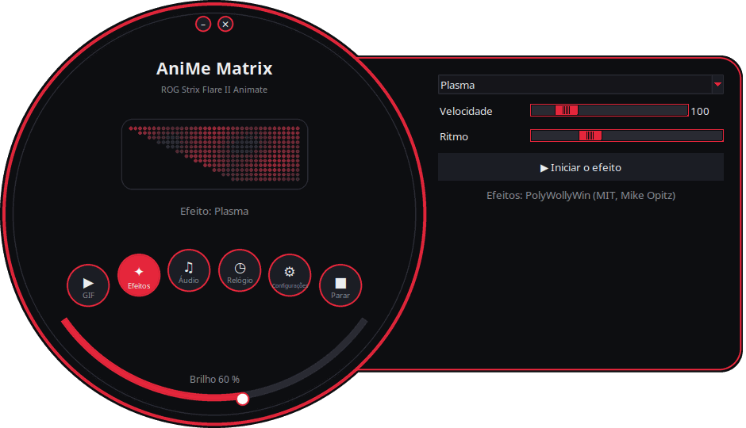
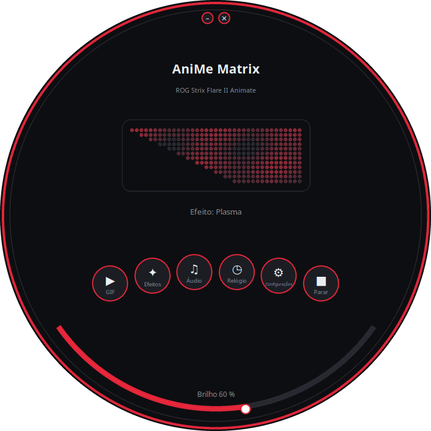
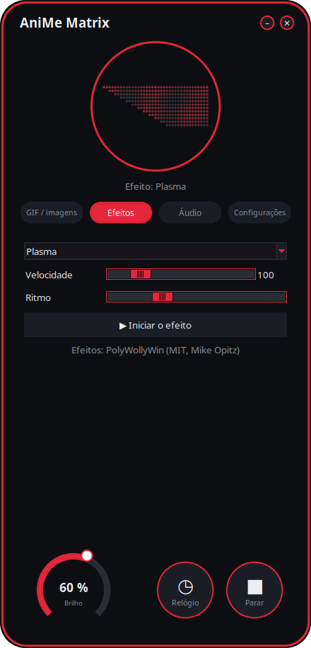
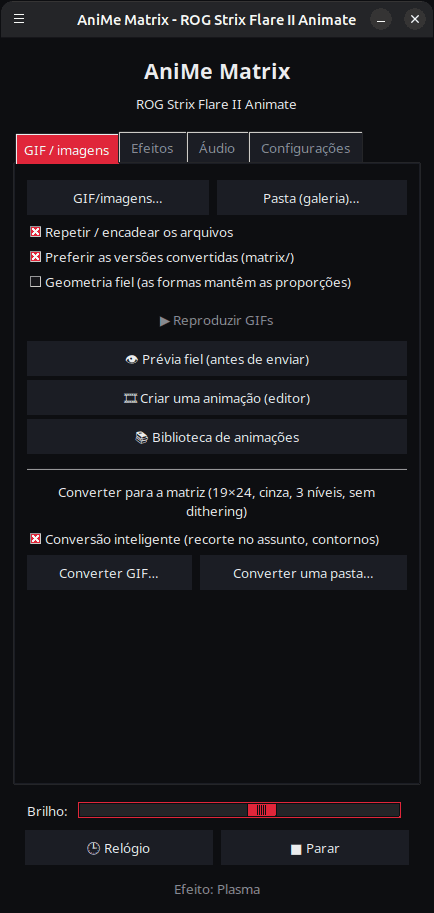

<p align="center">
  
</p>

# AniMe Matrix para Linux — ROG Strix Flare II Animate

[](https://github.com/AntiCitoyen/Anticitoyen-ROG-flare2-anime-matrix/releases/latest)
[](https://github.com/AntiCitoyen/Anticitoyen-ROG-flare2-anime-matrix/actions/workflows/ci.yml)
[](../../LICENSE)
[](https://buymeacoffee.com/anticitoyen)

Controle no Linux a tela **AniMe Matrix** (312 mini-LEDs) do teclado **ASUS ROG Strix Flare II Animate**, sem Armoury Crate nem Windows: GIFs e galeria, relógio, efeitos e visualizadores de áudio, jogos, monitor do sistema, notificações da área de trabalho, programação horária, editor de animação, biblioteca compartilhada, cores do teclado sincronizadas.

<div align="center">

[🇫🇷 Français](../../README.md) · [🇬🇧 English](README.en.md) · [🇪🇸 Español](README.es.md) · [🇩🇪 Deutsch](README.de.md) · [🇮🇹 Italiano](README.it.md) · **🇧🇷 Português** · [🇳🇱 Nederlands](README.nl.md) · [🇵🇱 Polski](README.pl.md) · [🇷🇺 Русский](README.ru.md) · [🇺🇦 Українська](README.uk.md) · [🇹🇷 Türkçe](README.tr.md) · [🇸🇦 العربية](README.ar.md) · [🇮🇳 हिन्दी](README.hi.md) · [🇨🇳 简体中文](README.zh-CN.md) · [🇹🇼 繁體中文](README.zh-TW.md) · [🇯🇵 日本語](README.ja.md) · [🇰🇷 한국어](README.ko.md) · [🇻🇳 Tiếng Việt](README.vi.md) · [🇮🇩 Bahasa Indonesia](README.id.md)

</div>

<p align="center"><br><em>Mostrador + gaveta (interface padrão)</em></p>

| Mostrador | Arredondada | Clássica |
|:---:|:---:|:---:|
|  |  |  |

<p align="center"></p>

---

## Sumário

- [O que o projeto faz](#projet)
- [Hardware compatível](#materiel)
- [Instalação](#installation)
- [Uso](#utilisation)
- [Preparar bons GIFs](#gif)
- [Como funciona](#fonctionnement)
- [Solução de problemas](#depannage)
- [Organização do repositório](#depot)
- [Compilar os pacotes](#deb)
- [Créditos](#credits)
- [Licença](#licence)
- [Apoiar o projeto](#soutien)

---

<a id="projet"></a>

## O que o projeto faz

A ASUS só fornece a tela AniMe Matrix deste teclado no Windows (Armoury Crate). Este projeto fala diretamente com o teclado via USB HID e traz:

**Exibir**
- **GIFs e imagens**: um arquivo, uma seleção ou uma pasta inteira em galeria; reprodução em fluxo (uma galeria de 400 GIFs cabe em ~25 MB de memória).
- **Relógio** HH:MM.
- **19 efeitos animados** (chuva estilo Matrix, plasma, fogo, estrelas, fogos de artifício, raios, metaballs, onda, texto rolante…) e **7 visualizadores de áudio** que reagem ao som reproduzido pelo PC.
- **Monitor do sistema**: CPU, RAM, GPU, temperatura, taxa de rede e hora, em medidores.
- **Música tocando agora**: ao trocar de faixa, « ARTISTA - TÍTULO » desliza uma vez, depois um visualizador (Spotify, VLC, Rhythmbox, navegadores… via MPRIS).
- **Notificações da área de trabalho**: « APP: TÍTULO » aparece em sobreposição e depois a reprodução retoma (desativado por padrão, lista de aplicativos autorizados).
- **Jogos** jogáveis pelo teclado: Snake, Pong, Tetris, quebra-blocos, com recordes.

**Criar**
- **Editor de animação** quadro a quadro, na geometria real da tela: 3 níveis, tira de quadros, camada fantasma, deslocamento, copiar e colar, prévia, envio ao teclado, exportação em GIF.
- **Biblioteca de animações** compartilhada: navegar, reproduzir, adicionar à própria galeria, propor as suas.
- **Conversão inteligente** de GIFs: recorte no assunto, assunto claro sobre fundo preto, contornos reforçados, 3 níveis.
- **Prévia fiel** antes do envio: renderização simulada da tela (disposição real, halo entre LEDs).
- **Efeitos em extensões**: um arquivo Python colocado em uma pasta adiciona um efeito (veja [../EXTENSIONS.md](../EXTENSIONS.md)).

**Automatizar**
- **Daemon `animematrixd`**: único dono da tela, continua exibindo quando o lançador é fechado; comando `animematrix-ctl` e API HTTP local opcional.
- **Programação horária**: faixas (dias, incluindo a noite) com relógio, galeria, monitor, música tocando ou tela apagada; tela preta quando a sessão está bloqueada, em suspensão ou quando um aplicativo está em tela cheia.
- **Cores do teclado via OpenRGB**: cor do tema nas teclas, ou pulsação sincronizada com a tela.
- **Ícone na bandeja do sistema**: menu rápido (modos, brilho).

**Conforto**
- **4 interfaces** (*Mostrador + gaveta* padrão, *Mostrador*, *Arredondada*, *Clássica*) com **prévia ao vivo dos 312 LEDs**, **11 temas** (5 ROG, 5 rosa, sistema) e **19 idiomas**.
- **Atualizações integradas**: o lançador baixa a última release, verifica sua soma SHA-256 e a instala (senha de administrador); ou `apt upgrade` com o repositório APT.

<a id="materiel"></a>

## Hardware compatível

| Dispositivo | USB | Estado |
|---|---|---|
| ASUS ROG Strix Flare II Animate | `0b05:19fc` | compatível (HID, interface 4, usage page `0xFF02`) |
| Telas AniMe Matrix dos notebooks ROG (G14, G16…) | vários | **experimental** via `asusctl`, não testado em hardware (veja [Uso](#utilisation)) |

Testado no Ubuntu 26.04 (X11, PipeWire, Cinnamon). Qualquer distribuição com Python ≥ 3.10, hidapi, Tk e systemd deve funcionar.

<a id="installation"></a>

## Instalação

### Repositório APT (Debian, Ubuntu, Mint, Pop!_OS…) — atualizações com `apt upgrade`

```bash
curl -fsSL https://anticitoyen.github.io/Anticitoyen-ROG-flare2-anime-matrix/animematrix.gpg \
  | sudo tee /usr/share/keyrings/animematrix.gpg >/dev/null
echo "deb [signed-by=/usr/share/keyrings/animematrix.gpg] https://anticitoyen.github.io/Anticitoyen-ROG-flare2-anime-matrix stable main" \
  | sudo tee /etc/apt/sources.list.d/animematrix.list
sudo apt update && sudo apt install anticitoyen-rog-flare2-anime-matrix
```

Depois **desconectar e reconectar o teclado** (a regra udev concede o acesso ao usuário conectado) e iniciar **AniMe Matrix** pelo menu.

### Outros formatos (página [Releases](https://github.com/AntiCitoyen/Anticitoyen-ROG-flare2-anime-matrix/releases/latest))

| Sistema | Arquivo | Instalação |
|---|---|---|
| Debian, Ubuntu… | `anticitoyen-rog-flare2-anime-matrix_<version>_all.deb` | `sudo apt install ./anticitoyen-rog-flare2-anime-matrix_*_all.deb` |
| Fedora, openSUSE… | `anticitoyen-rog-flare2-anime-matrix-<version>-1.noarch.rpm` | `sudo dnf install ./anticitoyen-rog-flare2-anime-matrix-*.noarch.rpm` |
| Arch, Manjaro… | `anticitoyen-rog-flare2-anime-matrix-<version>-1-any.pkg.tar.zst` | `sudo pacman -U anticitoyen-rog-flare2-anime-matrix-*.pkg.tar.zst` |
| Todos (Flatpak) | `AniMeMatrix-<version>.flatpak` | `flatpak install --user AniMeMatrix-*.flatpak` (instalar também a regra udev abaixo; sem visualizadores de áudio) |

O pacote instala:

| Item | Local |
|---|---|
| Programas | `/usr/share/anticitoyen-rog-flare2-anime-matrix/` |
| Comandos | `animematrix`, `animematrixd`, `animematrix-ctl`, `animematrix-bascule`, `animematrix-animation`, `animematrix-apercu`, `animematrix-convertir`, `animematrix-effet`, `animematrix-galerie`, `animematrix-horloge`, `animematrix-dessin`, `animematrix-tray` |
| Serviço de usuário | `/usr/lib/systemd/user/animematrixd.service` (ativado para todas as sessões) |
| Regra udev | `/usr/lib/udev/rules.d/72-rog-flare2-animate.rules` |
| Menu e ícone | `animematrix.desktop`, ícone `animematrix` |

### A partir do código-fonte

```bash
git clone https://github.com/AntiCitoyen/Anticitoyen-ROG-flare2-anime-matrix.git
cd Anticitoyen-ROG-flare2-anime-matrix
python3 -m venv .venv
.venv/bin/pip install hidapi pillow numpy pynput python-xlib
# acesso ao teclado sem root
sudo cp packaging/72-rog-flare2-animate.rules /etc/udev/rules.d/
sudo udevadm control --reload-rules && sudo udevadm trigger
# depois desconectar/reconectar o teclado
.venv/bin/python rog_flare2_launcher.py
```

Ferramentas de sistema úteis: `imagemagick` (conversão clássica), `pulseaudio-utils` (`parec`, para áudio), `zenity` (seletores de arquivo), `libnotify-bin` (notificações), `python3-gi` e `gir1.2-ayatanaappindicator3-0.1` (ícone na bandeja do sistema), `openrgb` (cores das teclas).

<a id="utilisation"></a>

## Uso

### O lançador

`animematrix` (ou a entrada **AniMe Matrix** do menu).

Nas interfaces redondas, os botões redondos abrem os blocos *GIF*, *Efeitos*, *Áudio* e *Configurações* (na gaveta ou no círculo); *Relógio* e *Parar* agem imediatamente; o arco inferior ajusta o brilho; a janela é movida arrastando-a pelo fundo; os pequenos botões no topo minimizam ou fecham. A forma redonda usa a extensão X11 SHAPE (pacote `python3-xlib`); sem ela, a mesma interface é exibida em uma janela retangular.

- **GIF / imagens**: *GIF/imagens…* ou *Pasta (galeria)…*; *Geometria fiel* mantém as proporções (o canto corta a imagem em vez de esticá-la); *👁 Prévia fiel (antes de enviar)* mostra a renderização sem enviar nada; *🎞 Criar uma animação (editor)*; *📚 Biblioteca de animações*; *Conversão inteligente* para converter GIFs.
- **Efeitos** e **Áudio**: escolher, ajustar, *▶ Iniciar o efeito*. Os controles deslizantes agem em tempo real; *Ritmo* acelera ou desacelera toda a animação. Os jogos se jogam com as setas, Espaço e Enter, com a janela do lançador em primeiro plano.
- **Brilho**, **🕒 Relógio**, **■ Parar** (que apaga a tela) são comuns a todas as abas.
- **Configurações**: início da sessão (Galeria de GIF, Relógio, Última reprodução ou Nada), idioma, tema, interface, notificações da área de trabalho, cores do teclado (OpenRGB), *Programação…*, ícone na bandeja do sistema, pasta de extensões, atualizações.

**Fechar o lançador não interrompe nada**: o daemon `animematrixd` continua exibindo. *■ Parar* apaga a tela.

### Daemon e linha de comando

```bash
animematrix-ctl etat                               # o que está sendo exibido
animematrix-ctl gif ~/Images/AniMe-Matrix --fidele # galeria (pasta ou arquivos)
animematrix-ctl effet "Plasma" --param speed=250   # efeito e ajustes
animematrix-ctl horloge
animematrix-ctl texte "Bonjour"
animematrix-ctl notifier "Café prêt" --duree 5     # sobreposição e depois retorno
animematrix-ctl luminosite 60
animematrix-ctl stop
```

| Comando | Função |
|---|---|
| `animematrix-bascule [gif\|horloge\|lecture\|off\|etat]` | alternador (também no clique direito do ícone do menu); o modo escolhido é também o do início da sessão |
| `animematrixd --http 8765` | daemon com API HTTP local (`POST http://127.0.0.1:8765/api`, mesmo JSON do socket) |
| `animematrix-animation [arquivo.gif]` | editor de animação |
| `animematrix-apercu arquivo.gif -o previa.gif` | prévia fiel de um GIF (arquivo) |
| `animematrix-convertir pasta/ [--fidele] [--classique]` | converte GIFs para a matriz (em `pasta/matrix/`) |
| `animematrix-effet --liste` | lista os efeitos e visualizadores |
| `animematrix-dessin` | editor LED por LED (devolve o controle ao daemon ao fechar) |

### Áudio

Os visualizadores escutam o **monitor da saída de áudio padrão** com `parec` (PipeWire ou PulseAudio): reagem ao que o PC reproduz, não ao microfone.

### Efeito « Keyboard React »

Ele acende a tela no ritmo da digitação graças ao `pynput`, que lê as teclas de toda a sessão enquanto o efeito está ativo. Funciona no X11; no Wayland, ele não recebe as teclas.

### Cores do teclado (OpenRGB)

*Configurações* → *Cores do teclado (OpenRGB)*: cor do tema ou pulsação sincronizada com a tela. O daemon inicia, se necessário, o `openrgb --server`. O OpenRGB não conhece a iluminação anterior do teclado: para recuperar o efeito salvo no teclado, desconecte-o e reconecte-o.

### Notebooks ROG (experimental)

Escrever `portable-asusctl` em `~/.config/rog-flare2/materiel` e depois reiniciar o daemon: os quadros passam por `asusctl anime image` (no máximo 5 imagens por segundo). Não testado em um notebook real: retornos são bem-vindos nos tickets.

<a id="gif"></a>

## Preparar bons GIFs

A tela não é um retângulo: 24 fileiras deslocadas, de 19 LEDs no topo a 7 na base (borda direita vertical, borda esquerda em diagonal), 3 níveis de cinza realmente distintos, um halo entre LEDs vizinhos. Silhuetas, pictogramas, textos curtos e movimentos lentos ficam bons; fotos e vídeos, pouco.

O guia completo (tela, níveis, ritmo, conversão, geometria fiel): **[../GUIDE-GIF.md](../GUIDE-GIF.md)**.

<a id="fonctionnement"></a>

## Como funciona

- **Transporte**: o hidapi abre a interface HID nº 4 do teclado e nela escreve quadros de **1024 bytes**; o teclado devolve cada quadro.
- **Quadro**: `60 81 00 00` + **312 bytes** (um brilho de 0–255 por LED, na ordem do hardware) + zeros até 1024.
- **Geometria**: 24 fileiras deslocadas (a fileira r cobre as colunas (r+1)//2 até 18), ou de forma equivalente 12 fileiras lógicas de 37 → 15 colunas (modelo do PolyWollyWin); as duas correspondências foram verificadas como idênticas nos 312 LEDs.
- **Daemon**: `animematrixd` controla sozinho o teclado; reprodução básica e sobreposição (notificações); socket JSON `$XDG_RUNTIME_DIR/animematrix.sock`; reconexão automática do teclado.
- **Animação**: o host envia os quadros um após o outro (~30 q/s para os efeitos); a memória interna do teclado não é usada (pesquisa: [../RECHERCHE-MEMOIRE.md](../RECHERCHE-MEMOIRE.md)).

As notas originais de engenharia reversa estão em **[../PROTOCOL.md](../PROTOCOL.md)**; as capturas `*.cap` e as ferramentas `parse_usbpcap.py` / `rog_flare2_replay_capture.py` permanecem no repositório.

⚠️ Não envie ao teclado os pacotes dos AniMe Matrix de notebooks (`0x5E …`, `0xEC …`): não é o protocolo correto e pode travar o teclado (desconectar/reconectar, ou manter pressionado **Fn + Esc** por 10–15 s).

<a id="depannage"></a>

## Solução de problemas

| Sintoma | Causa provável | Solução |
|---|---|---|
| `interface 4 not found` | teclado não detectado ou sem permissões | `lsusb \| grep 0b05:19fc`; regra udev instalada? desconectar/reconectar |
| `Permission denied` / `open failed` | regra udev não aplicada | `sudo udevadm control --reload-rules && sudo udevadm trigger`, depois reconectar |
| « Serviço animematrixd inacessível » | daemon parado | `systemctl --user restart animematrixd.service` ou `animematrixd &` |
| A tela não muda | outro programa está escrevendo no teclado | fechar scripts antigos; `animematrix-ctl etat` |
| Os visualizadores ficam em modo demonstração | sem `parec` ou sem som | instalar `pulseaudio-utils`, reproduzir som |
| « Keyboard React » não reage | sessão Wayland ou `pynput` ausente | sessão X11, `sudo apt install python3-pynput` |
| A janela redonda aparece como um retângulo | extensão SHAPE ou `python3-xlib` ausente | `sudo apt install python3-xlib`, ou *Configurações* → *Interface:* → *Clássica* |
| As teclas continuam com uma cor após o OpenRGB | o OpenRGB não restaura o efeito original | desconectar e reconectar o teclado |
| Log do daemon | — | `journalctl --user -u animematrixd.service -f` |

<a id="depot"></a>

## Organização do repositório

| Arquivo | Função |
|---|---|
| `rog_flare2_launcher.py` | lançador gráfico (Tk) |
| `rog_flare2_ui_ronde.py`, `rog_flare2_themes.py` | interfaces redondas, temas |
| `rog_flare2_i18n.py`, `locale/` | tradução (19 idiomas; `locale/_cles.json` = textos a traduzir) |
| `rog_flare2_demon.py`, `rog_flare2_ctl.py` | daemon `animematrixd`, cliente e comando `animematrix-ctl` |
| `rog_flare2_core.py` | reprodução de GIF em fluxo, relógio, geometria |
| `rog_flare2_effets.py`, `polywollywin/` | efeitos e visualizadores (motor PolyWollyWin, MIT), extensões |
| `rog_flare2_infos.py`, `rog_flare2_mpris.py`, `rog_flare2_jeux.py` | monitor do sistema, música tocando, jogos |
| `rog_flare2_notifs.py`, `rog_flare2_programme.py`, `rog_flare2_ui_programme.py` | notificações, programação horária e gatilhos |
| `rog_flare2_openrgb.py`, `rog_flare2_tray.py`, `rog_flare2_portable.py` | cores via OpenRGB, ícone na bandeja do sistema, notebooks (experimental) |
| `rog_flare2_animation.py`, `rog_flare2_simulateur.py`, `rog_flare2_convertir.py` | editor de animação, simulador, conversão |
| `rog_flare2_bibliotheque.py`, `bibliotheque/` | biblioteca de animações (catálogo, GIFs CC0) |
| `rog_flare2_maj.py` | atualizações a partir das releases |
| `rog_flare2_matrix_paint.py`, `rog_flare2_clock_v3.py`, `rog_flare2_folder_player.py` | transporte HID e editor LED, relógio, galeria (ferramentas originais) |
| `parse_usbpcap.py`, `rog_flare2_replay_capture.py`, `*.cap` | engenharia reversa |
| `examples/effets/` | exemplo de extensão |
| `tests/` | testes (incluindo interfaces com cliques reais) |
| `systemd/`, `packaging/` | serviço de usuário; .deb, RPM, Arch, Flatpak, repositório APT |
| `docs/` | guia de GIF, extensões, protocolo, pesquisa, capturas de tela, READMEs traduzidos |

<a id="deb"></a>

## Compilar os pacotes

```bash
packaging/build-deb.sh
# → dist/anticitoyen-rog-flare2-anime-matrix_<version>_all.deb
```

`packaging/install.sh` instala o projeto em qualquer estrutura de diretórios; ele é usado pelo .deb, pelo RPM (`packaging/rpm/`), pelo pacote Arch (`packaging/aur/`) e pelo Flatpak (`packaging/flatpak/`). A cada release publicada, o GitHub compila o RPM, o pacote Arch e o Flatpak, e atualiza o repositório APT assinado. A versão é lida em `rog_flare2_core.py` (`VERSION`). Testes: `python -m pytest tests`.

<a id="credits"></a>

## Créditos

- **NicRoss512** — engenharia reversa do protocolo, relógio e editor originais: [ASUS-ROG-Strix-Flare-II-Animate-AniMe-Matrix-Protocol](https://github.com/NicRoss512/ASUS-ROG-Strix-Flare-II-Animate-AniMe-Matrix-Protocol). Este repositório parte dele; seu histórico é preservado.
- **Mike Opitz** — [PolyWollyWin](https://github.com/MikeOpitz99/PolyWollyWin) (MIT), controlador Windows cujo motor de efeitos e visualizadores de áudio é reaproveitado aqui.
- **Yoshi Walsh** — [Mastering the AniMe Matrix](https://blog.yoshiwalsh.me/asus-anime-matrix/), pelo comportamento dos LEDs (halo, níveis percebidos, ritmo).
- **asus-linux** — [asusctl](https://gitlab.com/asus-linux/asusctl), usado para as telas dos notebooks.

Projeto independente, não afiliado à ASUS. « ROG », « AniMe Matrix » e « Armoury Crate » são marcas da ASUSTeK.

<a id="licence"></a>

## Licença

[MIT](../../LICENSE) para o código deste repositório; as animações de `bibliotheque/` são sob CC0. `polywollywin/` permanece sob a licença MIT de seu autor ([../../polywollywin/LICENSE](../../polywollywin/LICENSE)). Os arquivos originais de NicRoss512 (`rog_flare2_clock_v3.py`, `rog_flare2_matrix_paint.py`, `parse_usbpcap.py`, `rog_flare2_replay_capture.py`, `../PROTOCOL.md`, capturas) foram publicados sem licença explícita e permanecem de seu autor; são redistribuídos com atribuição.

<a id="soutien"></a>

## Apoiar o projeto

Se este projeto for útil para você, um café ajuda a mantê-lo:

[](https://buymeacoffee.com/anticitoyen)

**https://buymeacoffee.com/anticitoyen** — o link também está na aba *Configurações* do lançador.

Relatos de bugs, ideias e animações para compartilhar: [Issues](https://github.com/AntiCitoyen/Anticitoyen-ROG-flare2-anime-matrix/issues).
