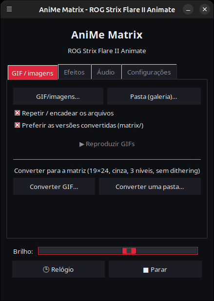
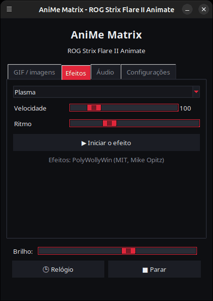
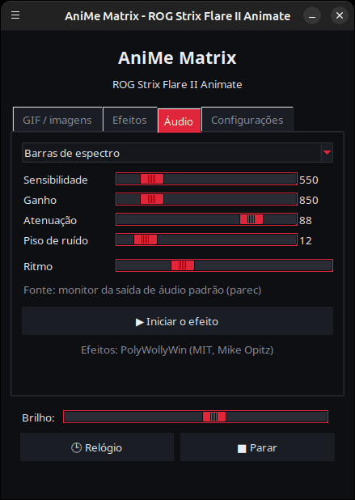
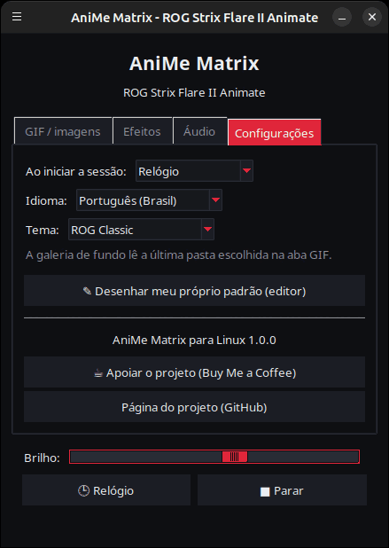

<p align="center">
  
</p>

# AniMe Matrix para Linux — ROG Strix Flare II Animate

[](https://github.com/AntiCitoyen/Anticitoyen-ROG-flare2-anime-matrix/releases/latest)
[](../../LICENSE)
[](https://buymeacoffee.com/anticitoyen)

Controle no Linux a tela **AniMe Matrix** (312 mini-LEDs) do teclado **ASUS ROG Strix Flare II Animate**, sem Armoury Crate nem Windows: GIFs e imagens, galeria de fundo, relógio, 19 efeitos animados, 7 visualizadores de áudio, desenho LED por LED.

A interface do aplicativo está disponível em 19 idiomas: ela segue automaticamente o idioma do sistema e pode ser alterada na aba *Configurações* → *Idioma:*.

<div align="center">

[🇫🇷 Français](../../README.md) · [🇬🇧 English](README.en.md) · [🇪🇸 Español](README.es.md) · [🇩🇪 Deutsch](README.de.md) · [🇮🇹 Italiano](README.it.md) · **🇧🇷 Português** · [🇳🇱 Nederlands](README.nl.md) · [🇵🇱 Polski](README.pl.md) · [🇷🇺 Русский](README.ru.md) · [🇺🇦 Українська](README.uk.md) · [🇹🇷 Türkçe](README.tr.md) · [🇸🇦 العربية](README.ar.md) · [🇮🇳 हिन्दी](README.hi.md) · [🇨🇳 简体中文](README.zh-CN.md) · [🇹🇼 繁體中文](README.zh-TW.md) · [🇯🇵 日本語](README.ja.md) · [🇰🇷 한국어](README.ko.md) · [🇻🇳 Tiếng Việt](README.vi.md) · [🇮🇩 Bahasa Indonesia](README.id.md)

</div>

| GIF / imagens | Efeitos | Áudio | Configurações |
|---|---|---|---|
|  |  |  |  |

<p align="center"></p>

---

## Sumário

- [O que o projeto faz](#projet)
- [Hardware compatível](#materiel)
- [Instalação](#installation)
- [Uso](#utilisation)
- [Preparar bons GIFs](#gif)
- [Como funciona](#fonctionnement)
- [Solução de problemas](#depannage)
- [Organização do repositório](#depot)
- [Compilar o pacote .deb](#deb)
- [Créditos](#credits)
- [Licença](#licence)
- [Apoiar o projeto](#soutien)

---

<a id="projet"></a>

## O que o projeto faz

A ASUS só fornece a tela AniMe Matrix deste teclado no Windows (Armoury Crate). Este projeto fala diretamente com o teclado via USB HID e traz:

- **Um lançador gráfico** (`animematrix`) com quatro abas:
  - **GIF / imagens**: reproduzir um ou vários arquivos, ou uma pasta inteira em galeria, em loop; converter GIFs para a matriz.
  - **Efeitos**: 19 animações (chuva estilo Matrix, plasma, fogo, estrelas, fogos de artifício, raios, metaballs, onda, cobra, texto rolante, relógio estilizado, reação ao teclado…), ajustáveis enquanto estão em execução.
  - **Áudio**: 7 visualizadores que reagem ao som reproduzido pelo PC (espectro, KITT/KARR, starburst, osciloscópio, fogo de áudio…).
  - **Configurações**: o que é exibido ao abrir a sessão, editor de desenho, links do projeto.
- **Um relógio** HH:MM, pelo lançador ou como serviço em segundo plano.
- **Uma galeria de fundo**: um serviço `systemd --user` que percorre uma pasta de GIFs desde a abertura da sessão.
- **Um alternador de um clique** (`animematrix-bascule`): o ícone do menu liga ou desliga a tela; o clique direito permite escolher Galeria de GIF, Relógio ou Tela desligada.
- **Uma conversão de GIF adaptada à matriz** (`animematrix-convertir`): 19×24, tons de cinza, 3 níveis, sem dithering — veja [../GUIDE-GIF.md](../GUIDE-GIF.md).
- **Um editor de desenho** LED por LED (`animematrix-dessin`).
- **11 temas**: 5 inspirados na ROG (Classic, Strix, Glitch, Gold, Carbon), 5 rosa (Sakura, Chiclete, Ouro rosé, Rosa lavanda, Noite rosa) e o do sistema, escolhidos em *Configurações* → *Tema:*.
- **Baixo consumo**: os GIFs são decodificados quadro a quadro; uma galeria de 400 GIFs roda com cerca de 25 MB de memória.

<a id="materiel"></a>

## Hardware compatível

| Teclado | USB | Interface |
|---|---|---|
| ASUS ROG Strix Flare II Animate | `0b05:19fc` | HID, interface 4 (usage page `0xFF02`) |

As telas AniMe Matrix dos **notebooks** ROG (Zephyrus G14, etc.) usam outro protocolo: **não** são compatíveis aqui (veja `asusctl`).

Testado no Ubuntu 26.04 (X11, PipeWire). Qualquer distribuição com Python ≥ 3.10, hidapi, Tk e systemd deve funcionar.

<a id="installation"></a>

## Instalação

### Pacote .deb (Debian, Ubuntu, Mint, Pop!_OS…)

1. Baixar `anticitoyen-rog-flare2-anime-matrix_<version>_all.deb` na página [Releases](https://github.com/AntiCitoyen/Anticitoyen-ROG-flare2-anime-matrix/releases/latest).
2. Instalá-lo (o apt resolve as dependências):
   ```bash
   sudo apt install ./anticitoyen-rog-flare2-anime-matrix_*_all.deb
   ```
3. **Desconectar e reconectar o teclado** (a regra udev concede acesso ao usuário conectado).
4. Abrir **AniMe Matrix** no menu de aplicativos, ou `animematrix` em um terminal.

O pacote instala:

| Item | Local |
|---|---|
| Programas | `/usr/share/anticitoyen-rog-flare2-anime-matrix/` |
| Comandos | `animematrix`, `animematrix-bascule`, `animematrix-effet`, `animematrix-galerie`, `animematrix-horloge`, `animematrix-convertir`, `animematrix-dessin` |
| Serviços de usuário | `/usr/lib/systemd/user/animematrix-galerie.service`, `animematrix-horloge.service` (não ativados por padrão) |
| Regra udev | `/usr/lib/udev/rules.d/72-rog-flare2-animate.rules` |
| Menu e ícone | `animematrix.desktop`, ícone `animematrix` |

Desinstalação: `sudo apt remove anticitoyen-rog-flare2-anime-matrix`.

### A partir do código-fonte

```bash
git clone https://github.com/AntiCitoyen/Anticitoyen-ROG-flare2-anime-matrix.git
cd Anticitoyen-ROG-flare2-anime-matrix
python3 -m venv .venv
.venv/bin/pip install hidapi pillow numpy pynput
# acesso ao teclado sem root
sudo cp packaging/72-rog-flare2-animate.rules /etc/udev/rules.d/
sudo udevadm control --reload-rules && sudo udevadm trigger
# depois desconectar/reconectar o teclado
.venv/bin/python rog_flare2_launcher.py
```

Ferramentas de sistema úteis: `imagemagick` (conversão), `pulseaudio-utils` (`parec`, para áudio), `zenity` (seletores de arquivo), `libnotify-bin` (notificações do alternador).

Para os serviços em segundo plano a partir do código-fonte, copiar `systemd/*.service` para `~/.config/systemd/user/`, substituindo as linhas `ExecStart=` pelo caminho de `.venv/bin/python` e do script (`rog_flare2_folder_player.py`, `rog_flare2_clock_v3.py`), depois `systemctl --user daemon-reload`.

<a id="utilisation"></a>

## Uso

### O lançador

`animematrix` (ou a entrada **AniMe Matrix** do menu).

- **GIF / imagens**: *GIF/imagens…* para uma seleção, *Pasta (galeria)…* para uma pasta inteira. A pasta escolhida também se torna a da galeria de fundo. *Preferir as versões convertidas* lê `dossier/matrix/nom.gif` quando existe (gerado pela conversão).
- **Efeitos** e **Áudio**: escolher, ajustar, *▶ Iniciar o efeito*. Os controles deslizantes agem em tempo real; *Ritmo* acelera ou desacelera a animação.
- **Brilho**, **🕒 Relógio**, **■ Parar** (que apaga a tela) são comuns a todas as abas.
- **Configurações**: *Ao iniciar a sessão:* = Galeria de GIF, Relógio ou Nada.

Enquanto exibe algo, o lançador pausa o serviço em segundo plano (apenas um programa pode escrever no teclado) e o reinicia ao fechar.

### Alternador e serviços em segundo plano

```bash
animematrix-bascule            # ligado → desligado ; desligado → último modo
animematrix-bascule gif        # galeria de fundo, também ao iniciar a sessão
animematrix-bascule horloge    # relógio de fundo, também ao iniciar a sessão
animematrix-bascule off        # desligado, nada ao iniciar
animematrix-bascule etat       # modo atual
```

As mesmas opções estão no clique direito do ícone do menu. Por baixo dos panos: `systemctl --user enable --now animematrix-galerie.service` (ou `animematrix-horloge.service`).

### Na linha de comando

| Comando | Função |
|---|---|
| `animematrix-effet --liste` | lista os efeitos e visualizadores |
| `animematrix-effet "Plasma" --brightness 60 --vitesse 1.5` | inicia um efeito (Ctrl+C para parar) |
| `animematrix-galerie [dossier] --brightness 60 [--originaux]` | percorre uma pasta (por padrão a última escolhida no lançador, senão `~/Images/AniMe-Matrix`) |
| `animematrix-horloge -b 25` | relógio; `--clear` apaga a tela, `--once --text 12:34` exibe um texto |
| `animematrix-convertir dossier/ [--sortie D] [--force]` | converte GIFs para a matriz (em `dossier/matrix/`) |
| `animematrix-dessin` | editor de desenho |

### Áudio

Os visualizadores escutam o **monitor da saída de áudio padrão** com `parec` (PipeWire ou PulseAudio): reagem ao que o PC reproduz, não ao microfone. Para mudar a saída, altere a saída padrão do sistema.

### Efeito « Keyboard React »

Ele acende a tela no ritmo da digitação graças ao `pynput`, que lê as teclas de toda a sessão enquanto o efeito está ativo. Funciona no X11; no Wayland, ele não recebe as teclas.

<a id="gif"></a>

## Preparar bons GIFs

A tela não é um retângulo: 24 fileiras deslocadas, de 19 LEDs no topo a 7 na base, 3 níveis de cinza realmente distintos, um halo entre LEDs vizinhos. Silhuetas, pictogramas, textos curtos e movimentos lentos ficam bons; fotos e vídeos, não.

O guia completo (tamanho da tela, níveis, taxa de quadros, brilho, comando do ImageMagick): **[../GUIDE-GIF.md](../GUIDE-GIF.md)**.

<a id="fonctionnement"></a>

## Como funciona

- **Transporte**: o hidapi abre a interface HID nº 4 do teclado e nela escreve quadros de **1024 bytes**.
- **Quadro**: `60 81 00 00` + **312 bytes** (um brilho de 0–255 por LED, na ordem do hardware) + zeros até 1024.
- **Geometria**: 24 fileiras deslocadas na diagonal (19 → 7 LEDs), ou de forma equivalente 12 fileiras lógicas de 37 → 15 colunas (modelo do PolyWollyWin); as duas correspondências foram verificadas como idênticas nos 312 LEDs.
- **GIF**: cada quadro é recomposto (GIFs otimizados armazenam apenas as diferenças), convertido para tons de cinza, reduzido a 24 fileiras e amostrado fileira por fileira.
- **Animação**: nenhuma memória embarcada é usada; a animação consiste no host enviando os quadros um após o outro (~30 quadros/s para os efeitos).

As notas originais de engenharia reversa (capturas USBPcap, ordem dos LEDs, pontos de calibração) estão em **[../PROTOCOL.md](../PROTOCOL.md)**; as capturas `*.cap` e as ferramentas `parse_usbpcap.py` / `rog_flare2_replay_capture.py` permanecem no repositório para quem quiser se aprofundar.

⚠️ Não envie ao teclado os pacotes dos AniMe Matrix de notebooks (`0x5E …`, `0xEC …`): não é o protocolo correto e pode travar o teclado (desconectar/reconectar, ou manter pressionado **Fn + Esc** por 10–15 s).

<a id="depannage"></a>

## Solução de problemas

| Sintoma | Causa provável | Solução |
|---|---|---|
| `interface 4 not found` | teclado não detectado ou sem permissões | `lsusb \| grep 0b05:19fc`; regra udev instalada? desconectar/reconectar |
| `Permission denied` / `open failed` | regra udev não aplicada | `sudo udevadm control --reload-rules && sudo udevadm trigger`, depois reconectar |
| A tela não muda | outro programa já está escrevendo | `animematrix-bascule off`, fechar outros lançadores ou scripts |
| Os visualizadores ficam em modo demonstração | sem `parec` ou sem som | instalar `pulseaudio-utils`, reproduzir som |
| « Keyboard React » não reage | sessão Wayland ou `pynput` ausente | sessão X11, `sudo apt install python3-pynput` |
| A galeria de fundo não inicia | pasta vazia ou ausente | escolher uma pasta no lançador (aba GIF) |
| Log de um serviço | — | `journalctl --user -u animematrix-galerie.service -f` |

<a id="depot"></a>

## Organização do repositório

| Arquivo | Função |
|---|---|
| `rog_flare2_launcher.py` | lançador gráfico (Tk) |
| `rog_flare2_effets.py` | efeitos e visualizadores de áudio (motor PolyWollyWin adaptado para Linux) |
| `polywollywin/` | motor de efeitos do PolyWollyWin, copiado sem modificações (MIT) |
| `rog_flare2_folder_player.py` | galeria de fundo (serviço) |
| `rog_flare2_clock_v3.py` | relógio (serviço) |
| `rog_flare2_bascule.sh` | alternador galeria / relógio / desligado |
| `rog_flare2_convertir.py` | conversão de GIF (ImageMagick) |
| `rog_flare2_matrix_paint.py` | transporte HID, ordem dos LEDs, editor de desenho |
| `parse_usbpcap.py`, `rog_flare2_replay_capture.py`, `*.cap` | ferramentas e capturas de engenharia reversa |
| `systemd/` | serviços de usuário |
| `packaging/` | regra udev, entrada de menu, ícone, arquivos e script do pacote .deb |
| `docs/` | guia de GIF, notas de protocolo, capturas de tela |

<a id="deb"></a>

## Compilar o pacote .deb

```bash
packaging/build-deb.sh
# → dist/anticitoyen-rog-flare2-anime-matrix_<version>_all.deb
```

Só são necessários `dpkg-deb` e `bash`; a versão é lida em `rog_flare2_launcher.py` (`VERSION`).

<a id="credits"></a>

## Créditos

- **NicRoss512** — engenharia reversa do protocolo, relógio e editor originais: [ASUS-ROG-Strix-Flare-II-Animate-AniMe-Matrix-Protocol](https://github.com/NicRoss512/ASUS-ROG-Strix-Flare-II-Animate-AniMe-Matrix-Protocol). Este repositório parte dele; seu histórico é preservado.
- **Mike Opitz** — [PolyWollyWin](https://github.com/MikeOpitz99/PolyWollyWin) (MIT), controlador Windows cujo motor de efeitos e visualizadores de áudio é reaproveitado aqui.
- **Yoshi Walsh** — [Mastering the AniMe Matrix](https://blog.yoshiwalsh.me/asus-anime-matrix/), pelo comportamento dos LEDs (halo, níveis percebidos, taxa de quadros).

Projeto independente, não afiliado à ASUS. « ROG », « AniMe Matrix » e « Armoury Crate » são marcas da ASUSTeK.

<a id="licence"></a>

## Licença

[MIT](../../LICENSE) para o código deste repositório. `polywollywin/` permanece sob a licença MIT de seu autor ([../../polywollywin/LICENSE](../../polywollywin/LICENSE)). Os arquivos originais de NicRoss512 (`rog_flare2_clock_v3.py`, `rog_flare2_matrix_paint.py`, `parse_usbpcap.py`, `rog_flare2_replay_capture.py`, `../PROTOCOL.md`, capturas) foram publicados sem licença explícita e permanecem de seu autor; são redistribuídos com atribuição.

<a id="soutien"></a>

## Apoiar o projeto

Se este projeto for útil para você, um café ajuda a mantê-lo:

[](https://buymeacoffee.com/anticitoyen)

**https://buymeacoffee.com/anticitoyen** — o link também está na aba *Configurações* do lançador.

Relatos de bugs e ideias: [Issues](https://github.com/AntiCitoyen/Anticitoyen-ROG-flare2-anime-matrix/issues).
