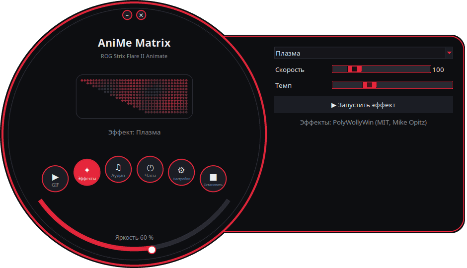
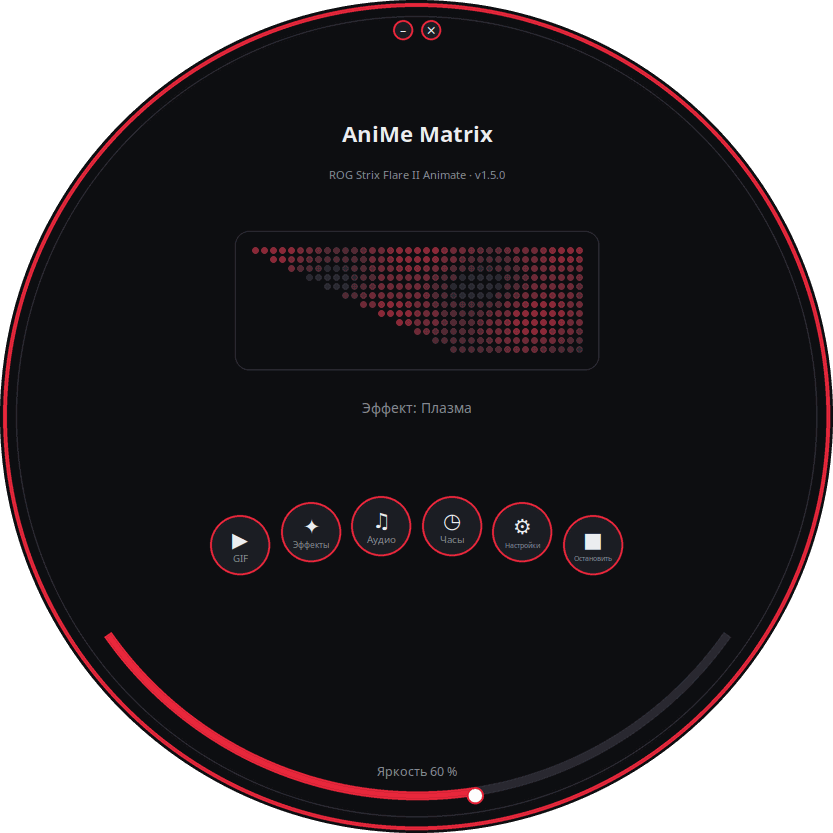
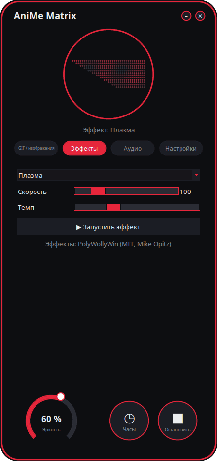
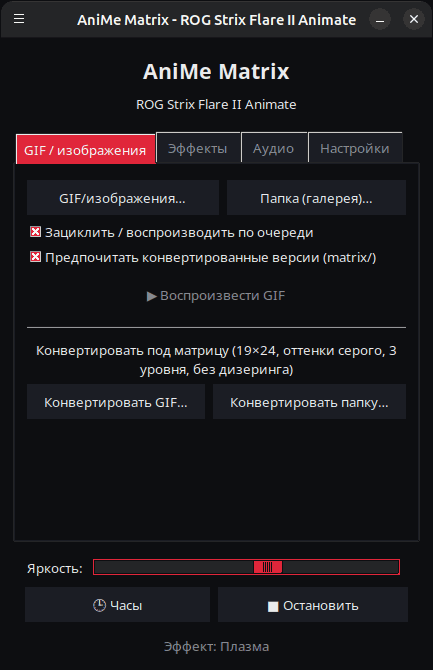
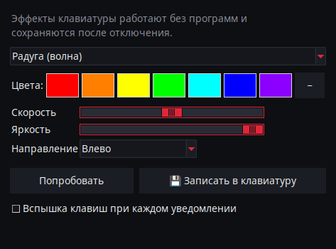
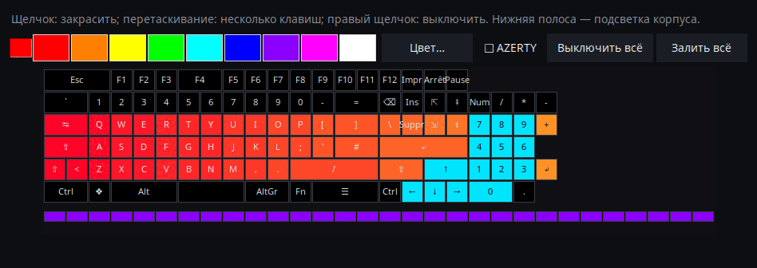

<p align="center">
  
</p>

# AniMe Matrix для Linux — ROG Strix Flare II Animate

[](https://github.com/AntiCitoyen/Anticitoyen-ROG-flare2-anime-matrix/releases/latest)
[](https://github.com/AntiCitoyen/Anticitoyen-ROG-flare2-anime-matrix/actions/workflows/ci.yml)
[](../../LICENSE)
[](https://buymeacoffee.com/anticitoyen)

Управление под Linux экраном **AniMe Matrix** (312 мини-светодиодов) клавиатуры **ASUS ROG Strix Flare II Animate**, без Armoury Crate и Windows: GIF и галерея, часы, эффекты и аудиовизуализаторы, игры, монитор системы, уведомления рабочего стола, расписание, редактор анимации, общая библиотека, синхронизированные цвета клавиатуры.

<div align="center">

[🇫🇷 Français](../../README.md) · [🇬🇧 English](README.en.md) · [🇪🇸 Español](README.es.md) · [🇩🇪 Deutsch](README.de.md) · [🇮🇹 Italiano](README.it.md) · [🇧🇷 Português](README.pt-BR.md) · [🇳🇱 Nederlands](README.nl.md) · [🇵🇱 Polski](README.pl.md) · **🇷🇺 Русский** · [🇺🇦 Українська](README.uk.md) · [🇹🇷 Türkçe](README.tr.md) · [🇸🇦 العربية](README.ar.md) · [🇮🇳 हिन्दी](README.hi.md) · [🇨🇳 简体中文](README.zh-CN.md) · [🇹🇼 繁體中文](README.zh-TW.md) · [🇯🇵 日本語](README.ja.md) · [🇰🇷 한국어](README.ko.md) · [🇻🇳 Tiếng Việt](README.vi.md) · [🇮🇩 Bahasa Indonesia](README.id.md)

</div>

<p align="center"><br><em>Циферблат + панель (интерфейс по умолчанию)</em></p>

| Циферблат | Скруглённый | Классический |
|:---:|:---:|:---:|
|  |  |  |

<p align="center"></p>

---

## Содержание

- [Что делает проект](#projet)
- [Поддерживаемое оборудование](#materiel)
- [Установка](#installation)
- [Использование](#utilisation)
- [Подготовка хороших GIF](#gif)
- [Как это работает](#fonctionnement)
- [Устранение неполадок](#depannage)
- [Структура репозитория](#depot)
- [Сборка пакетов](#deb)
- [Благодарности](#credits)
- [Лицензия](#licence)
- [Поддержать проект](#soutien)

---

<a id="projet"></a>

## Что делает проект

ASUS предоставляет доступ к экрану AniMe Matrix этой клавиатуры только под Windows (через Armoury Crate). Этот проект напрямую общается с клавиатурой по USB HID и добавляет:

**Отображение**
- **GIF, изображения и видео**: один файл, выбор файлов или целая папка в виде галереи, можно перетащить на окно; видео (MP4, WebM, MKV…) воспроизводятся через ffmpeg; галерея миниатюр; преобразованные кадры хранятся в кэше (галерея из 400 GIF умещается в ~25 МБ памяти).
- **Часы**: циферблат цифровой, аналоговый, двоичный, словами (французский, английский, немецкий, испанский, итальянский, португальский, нидерландский) или стилизованный.
- **Анимированные эффекты** (дождь в стиле Matrix, плазма, огонь, звёзды, фейерверки, молнии, метаболы, волна…) и **7 аудиовизуализаторов**, реагирующих на звук, воспроизводимый компьютером.
- **Текст**: ваше сообщение, в любой письменности (диакритика, кириллица, арабское письмо, хинди, китайский, японский, корейский…), бегущее влево, вправо, вверх, вниз или неподвижное.
- **Веб-камера** (изображение или силуэт) и **зеркало экрана** (весь экран, область вокруг мыши или активное окно).
- **Монитор системы**: CPU, RAM, GPU, температура, сетевой трафик и время, в виде индикаторов.
- **Текущий трек**: при смене трека один раз пробегает «ИСПОЛНИТЕЛЬ - НАЗВАНИЕ», затем включается визуализатор (Spotify, VLC, Rhythmbox, браузеры… через MPRIS).
- **Уведомления рабочего стола**: «ПРИЛОЖЕНИЕ: ЗАГОЛОВОК» отображается поверх, затем воспроизведение возобновляется (по умолчанию отключено, список разрешённых приложений).
- **Игры** на клавиатуре: Snake, Pong (в одиночку или вдвоём), Tetris, Арканоид, Invaders, Flappy, с рекордами.
- **Индикаторы**: маленькие светящиеся блоки, когда микрофон выключен или используется, когда работает веб-камера, когда OBS транслирует или записывает.
- **Память клавиатуры**: анимация (GIF, изображение), записанная в клавиатуру, показывается без всяких программ сразу после подключения, даже на другом ПК; яркость регулируется (вкладка GIF, `animematrix-ctl memoire`). Можно выбрать и 6 встроенных анимаций (KO, Метеорит, Глаз, Love, Хеллоуин, Запуск): `animematrix-ctl clavier 1`…`6`.

**Создание**
- **Редактор анимации** покадрово, на реальной геометрии экрана: 3 уровня, дорожка кадров, слой-призрак, смещение, копирование-вставка, предпросмотр, отправка на клавиатуру, экспорт в GIF.
- **Общая библиотека анимаций**: просматривайте, воспроизводите, добавляйте в свою галерею, предлагайте свои.
- **Умное преобразование** GIF: кадрирование по объекту, светлый объект на чёрном фоне, усиленные контуры, 3 уровня.
- **Точный предпросмотр** перед отправкой: смоделированное отображение экрана (реальное расположение, ореол между светодиодами).
- **Эффекты в виде расширений**: файл Python, помещённый в папку, добавляет эффект (см. [../EXTENSIONS.md](../EXTENSIONS.md)).

**Автоматизация**
- **Демон `animematrixd`**: единственный владелец экрана, продолжает отображение после закрытия лаунчера; команда `animematrix-ctl` и опциональный локальный HTTP API.
- **Расписание**: интервалы (дни, включая ночь) с часами, галереей, монитором, текущим треком, эффектом, плейлистом или выключенным экраном; чёрный экран, когда сеанс заблокирован, в спящем режиме или когда приложение развёрнуто на весь экран.
- **Профили приложений**: собственное содержимое для игры или приложения, пока оно на переднем плане (кнопка *Определить*).
- **Плейлисты и избранное**: GIF, эффекты, часы… каждый в течение своей длительности, по кругу; также в значке в системном трее и в командной строке.
- **Веб-пульт**: страница для управления экраном с телефона в локальной сети (QR-код, токен).
- **Завершение долгих команд**: в терминале отображается «Готово: make 2 min 05», когда долгая команда завершается.
- **Цвета и эффекты клавиш**, без OpenRGB: радуга, статичный, дыхание, смена цветов, реакция, рябь, звёздная ночь, зыбучие пески, течение, дождь — выполняются самой клавиатурой и сохраняются после отключения; или цвет темы, пульсация с экраном.
- **Значок в системном трее**: быстрое меню (режимы, яркость).

**Удобство**
- **4 интерфейса** (*Циферблат + панель* по умолчанию, *Циферблат*, *Скруглённый*, *Классический*) с **предпросмотром 312 светодиодов в реальном времени**, **11 темами** (5 ROG, 5 розовых, системная) и **19 языками**.
- **X11 и Wayland**: реакция на клавиатуру через evdev, активное окно запрашивается у Sway, Hyprland, KDE (kdotool) или GNOME (расширение *Window Calls*).
- **Встроенные обновления**: лаунчер скачивает последний релиз, проверяет его отпечаток SHA-256 и устанавливает его (пароль администратора); либо `apt upgrade` с репозиторием APT.

<a id="materiel"></a>

## Поддерживаемое оборудование

| Устройство | USB | Состояние |
|---|---|---|
| ASUS ROG Strix Flare II Animate | `0b05:19fc` | поддерживается (HID, интерфейс 4, usage page `0xFF02`) |
| Экраны AniMe Matrix ноутбуков ROG (G14, G16…) | различные | **экспериментально** через `asusctl`, не тестировалось на оборудовании (см. [Использование](#utilisation)) |

Протестировано на Ubuntu 26.04 (X11, PipeWire, Cinnamon). Должен подойти любой дистрибутив с Python ≥ 3.10, hidapi, Tk и systemd; под Wayland лаунчер работает через XWayland.

<a id="installation"></a>

## Установка

### Репозиторий APT (Debian, Ubuntu, Mint, Pop!_OS…) — обновления через `apt upgrade`

```bash
curl -fsSL https://anticitoyen.github.io/Anticitoyen-ROG-flare2-anime-matrix/animematrix.gpg \
  | sudo tee /usr/share/keyrings/animematrix.gpg >/dev/null
echo "deb [signed-by=/usr/share/keyrings/animematrix.gpg] https://anticitoyen.github.io/Anticitoyen-ROG-flare2-anime-matrix stable main" \
  | sudo tee /etc/apt/sources.list.d/animematrix.list
sudo apt update && sudo apt install anticitoyen-rog-flare2-anime-matrix
```

Затем **отключите и снова подключите клавиатуру** (правило udev даёт доступ вошедшему в систему пользователю) и запустите **AniMe Matrix** из меню.

### Другие форматы (страница [Releases](https://github.com/AntiCitoyen/Anticitoyen-ROG-flare2-anime-matrix/releases/latest))

| Система | Файл | Установка |
|---|---|---|
| Debian, Ubuntu… | `anticitoyen-rog-flare2-anime-matrix_<version>_all.deb` | `sudo apt install ./anticitoyen-rog-flare2-anime-matrix_*_all.deb` |
| Fedora, openSUSE… | `anticitoyen-rog-flare2-anime-matrix-<version>-1.noarch.rpm` | `sudo dnf install ./anticitoyen-rog-flare2-anime-matrix-*.noarch.rpm` |
| Arch, Manjaro… | `anticitoyen-rog-flare2-anime-matrix-<version>-1-any.pkg.tar.zst` | `sudo pacman -U anticitoyen-rog-flare2-anime-matrix-*.pkg.tar.zst` |
| Все (Flatpak) | `AniMeMatrix-<version>.flatpak` | `flatpak install --user AniMeMatrix-*.flatpak` (также установите правило udev ниже; без аудиовизуализаторов) |
| AUR | `aur-<version>.tar.gz` | PKGBUILD и .SRCINFO: `tar xf aur-*.tar.gz && cd anticitoyen-rog-flare2-anime-matrix && makepkg -si` |
| Copr | `anticitoyen-rog-flare2-anime-matrix-<version>-1.<fc>.src.rpm` | исходный RPM: `rpmbuild --rebuild anticitoyen-rog-flare2-anime-matrix-*.src.rpm` или загрузка в проект Copr |
| Flathub | `flathub-<version>.tar.gz` | манифест, закреплённый за этой версией, и `python3-modules.json`: заявка во Flathub или `flatpak-builder` |
| Weblate | `translations-<version>.zip` | файлы переводов (`locale/*.json`, основа `_source.json`) для импорта в Weblate |

Пакет устанавливает:

| Элемент | Расположение |
|---|---|
| Программы | `/usr/share/anticitoyen-rog-flare2-anime-matrix/` |
| Команды | `animematrix`, `animematrixd`, `animematrix-ctl`, `animematrix-bascule`, `animematrix-animation`, `animematrix-apercu`, `animematrix-convertir`, `animematrix-effet`, `animematrix-galerie`, `animematrix-horloge`, `animematrix-dessin`, `animematrix-tray`, `animematrix-memoire` |
| Пользовательская служба | `/usr/lib/systemd/user/animematrixd.service` (включена для всех сеансов) |
| Правило udev | `/usr/lib/udev/rules.d/72-rog-flare2-animate.rules` |
| Меню и значок | `animematrix.desktop`, значок `animematrix` |

### Из исходников

```bash
git clone https://github.com/AntiCitoyen/Anticitoyen-ROG-flare2-anime-matrix.git
cd Anticitoyen-ROG-flare2-anime-matrix
python3 -m venv .venv
.venv/bin/pip install hidapi pillow numpy pynput python-xlib
# доступ к клавиатуре без root
sudo cp packaging/72-rog-flare2-animate.rules /etc/udev/rules.d/
sudo udevadm control --reload-rules && sudo udevadm trigger
# затем отключите/подключите клавиатуру заново
.venv/bin/python rog_flare2_launcher.py
```

Полезные системные утилиты: `imagemagick` (классическая конвертация), `pulseaudio-utils` (`parec`, для аудио), `zenity` (диалоги выбора файлов), `libnotify-bin` (уведомления), `python3-gi` и `gir1.2-ayatanaappindicator3-0.1` (значок в системном трее), `ffmpeg` (видео, веб-камера, зеркало экрана), `python3-evdev` (реакция на клавиатуру под Wayland), `x11-utils` (активное окно под X11), `python3-qrcode` (QR-код веб-пульта), `tkdnd` (перетаскивание).

<a id="utilisation"></a>

## Использование

### Лаунчер

`animematrix` (или пункт **AniMe Matrix** в меню).

В круглых интерфейсах круглые кнопки открывают блоки *GIF*, *Эффекты*, *Аудио* и *Настройки* (в панели или в круге); *Часы* и *Остановить* действуют сразу; нижняя дуга регулирует яркость; окно перемещается перетаскиванием за фон; маленькие кнопки сверху сворачивают или закрывают его. Круглая форма использует расширение X11 SHAPE (пакет `python3-xlib`); без него тот же интерфейс отображается в прямоугольном окне.

- **GIF / изображения**: *GIF/изображения…* или *Папка (галерея)…* (или перетащить на окно); *Точная геометрия* сохраняет пропорции (угол обрезает изображение вместо растягивания); *👁 Точный предпросмотр (до отправки)* показывает результат, ничего не отправляя; *🎞 Создать анимацию (редактор)*; *📚 Библиотека анимаций*; *★ Плейлисты и избранное*; *🖼 Галерея миниатюр* (клик: воспроизвести, правый клик: в избранное); *🎥 Веб-камера* и *🖥 Зеркало экрана*; *Умное преобразование* для конвертации GIF.
- **Эффекты** и **Аудио**: выбрать, настроить, *▶ Запустить эффект*. Ползунки действуют в реальном времени; *Темп* ускоряет или замедляет всю анимацию. Эффект *Текст* принимает ваше сообщение и направление прокрутки. В игры играют стрелками, пробелом и Enter, при окне лаунчера на переднем плане; Pong вдвоём: Z/W и S для левого игрока.
- **Яркость**, **🕒 Часы**, **■ Остановить** (очищает экран) — общие для всех вкладок.
- **Настройки**: запуск сессии (Галерея GIF, Часы, Последнее воспроизведение или Ничего), циферблат часов, язык, тема, интерфейс, уведомления рабочего стола, цвета клавиатуры, *Расписание…* (триггеры, профили приложений, интервалы), *Индикаторы (микрофон, веб-камера, OBS)…*, *Веб-пульт…*, значок в системном трее, завершение долгих команд, папка расширений, обновления.

**Закрытие лаунчера ничего не прерывает**: демон `animematrixd` продолжает отображение. *■ Остановить* выключает экран.

### Демон и командная строка

```bash
animematrix-ctl etat                               # что отображается
animematrix-ctl gif ~/Images/AniMe-Matrix --fidele # галерея (папка или файлы)
animematrix-ctl effet "Plasma" --param speed=250   # эффект и настройки
animematrix-ctl horloge
animematrix-ctl texte "Bonjour"
animematrix-ctl effet "Text" --param message="Salut" --param direction=haut
animematrix-ctl liste "Soirée"                     # плейлист (без имени: выводит список)
animematrix-ctl favori 2                           # избранное № 2 (без номера: выводит список)
animematrix-ctl notifier "Café prêt" --duree 5     # наложение, затем возврат
animematrix-ctl memoire anim.gif                   # записана в клавиатуру (не более 196 кадров)
animematrix-ctl clavier                            # показывает записанную анимацию
animematrix-ctl luminosite 60
animematrix-ctl stop
```

| Команда | Назначение |
|---|---|
| `animematrix-bascule [gif\|horloge\|lecture\|off\|etat]` | переключатель (также по правому клику на значке в меню); выбранный режим также используется при входе в сессию |
| `animematrixd --http 8765` | демон с локальным HTTP API (`POST http://127.0.0.1:8765/api`, `Content-Type: application/json`, тот же JSON, что и сокет) |
| `animematrix-animation [файл.gif]` | редактор анимации |
| `animematrix-apercu файл.gif -o apercu.gif` | точный предпросмотр GIF (файл) |
| `animematrix-convertir папка/ [--fidele] [--classique]` | конвертирует GIF под матрицу (в `папка/matrix/`) |
| `animematrix-effet --liste` | выводит список эффектов и визуализаторов |
| `animematrix-dessin` | редактор по одному светодиоду (возвращает управление демону при закрытии) |
| `animematrix-ctl sauvegarde reglages.zip`, `animematrix-ctl restaurer reglages.zip` | экспортирует или восстанавливает все настройки (также в *Настройках*); без токена и пароля OBS, кроме `--secrets` |

### Аудио

Визуализаторы прослушивают **монитор звукового устройства вывода по умолчанию** через `parec` (PipeWire или PulseAudio): они реагируют на то, что воспроизводит компьютер, а не на микрофон.

### Эффект «Keyboard React»

Он зажигает экран в такт набору текста, пока эффект работает: под X11 через `pynput`, под Wayland — считывая клавиатуру из `/dev/input` (`python3-evdev`). Если под Wayland эффект остаётся в демо-режиме, разрешите чтение только клавиатуры ROG:

```bash
sudo cp /usr/share/anticitoyen-rog-flare2-anime-matrix/udev/73-rog-flare2-animate-touches.rules /etc/udev/rules.d/
sudo udevadm control --reload-rules && sudo udevadm trigger
```

### Индикаторы

*Настройки* → *Индикаторы (микрофон, веб-камера, OBS)…*: блок 2 × 2 светодиода загорается в левом верхнем углу экрана поверх воспроизведения (1: микрофон выключен или используется, 2: веб-камера используется, 3: OBS в эфире или записывает), и о каждом изменении может сообщать бегущая строка. OBS: включите сервер WebSocket (*Инструменты* → *Настройки сервера WebSocket*) и перенесите его порт и пароль.

### Веб-пульт

*Настройки* → *Веб-пульт…*: отметьте *Включить веб-пульт*, затем откройте адрес (или отсканируйте QR-код) на телефоне в той же сети. Страница показывает экран в реальном времени и предлагает часы, галерею, эффекты, избранное, плейлисты, яркость и сообщение. Адрес содержит токен: не делитесь им, смените его кнопкой *Новый токен*; страница не шифруется (HTTP): только доверенная сеть.

### Завершение долгих команд

*Настройки* → *Показывать завершение долгих команд (терминал)* добавляет строку в `~/.bashrc` (и `~/.zshrc`): каждая команда дольше 30 секунд по завершении выводит «Готово: make 2 min 05» или «Сбой (2): …». Порог: `ANIMEMATRIX_FIN_SECONDES`; интерактивные команды (редакторы, `ssh`, `less`…) игнорируются.

### Цвета клавиатуры

*Настройки* → *🌈 Цвета клавиатуры…*: эффект (радуга, статичный, дыхание, смена цветов, реакция, рябь, звёздная ночь, зыбучие пески, течение, дождь), цвета, скорость, яркость, направление. *Попробовать* применяет его, *Записать в клавиатуру* сохраняет после отключения. *Цвет темы* и *Пульсацию с экраном* демон отправляет по клавишам; после их отключения возвращается записанный эффект. В командной строке: `animematrix-ctl rgb arc-en-ciel --vitesse 70`, `animematrix-ctl rgb statique --couleur "#ff0000"`. Ещё два программных режима: *Изображение экрана* (клавиши повторяют экран в увеличенном виде) и *Спектр звука* (по полосе на столбец). Каждый временной интервал и каждый профиль приложения может также выбрать цвета клавиш (*Расписание…*). *По клавишам*: свой цвет для каждой клавиши, раскрашивается мышью на схеме клавиатуры (AZERTY или QWERTY). *Светящийся набор*: каждая нажатая клавиша вспыхивает и гаснет. Индикаторы микрофона, камеры и OBS могут также подсвечивать F1, F2 и F3, а каждое уведомление вызывает вспышку клавиш.

<p align="center"> </p>

### Ноутбуки ROG (экспериментально)

Впишите `portable-asusctl` в `~/.config/rog-flare2/materiel`, затем перезапустите демон: кадры проходят через `asusctl anime image` (не более 5 кадров в секунду). Не тестировалось на настоящем ноутбуке: отзывы приветствуются в тикетах.

<a id="gif"></a>

## Подготовка хороших GIF

Экран — не прямоугольник: 24 смещённых ряда, от 19 светодиодов вверху до 7 внизу (правый край вертикальный, левый — по диагонали), 3 действительно различимых уровня серого, ореол между соседними светодиодами. Силуэты, пиктограммы, короткие тексты и медленное движение смотрятся хорошо; фотографии и видео — плохо.

Полное руководство (холст, уровни, темп, конвертация, точная геометрия): **[../GUIDE-GIF.md](../GUIDE-GIF.md)**.

<a id="fonctionnement"></a>

## Как это работает

- **Транспорт**: hidapi открывает HID-интерфейс № 4 клавиатуры и записывает в него кадры по **1024 байта**; клавиатура возвращает каждый кадр.
- **Кадр**: `60 81 00 00` + **312 байт** (яркость 0–255 на светодиод, в аппаратном порядке) + нули до 1024.
- **Геометрия**: 24 ряда, смещённых по диагонали (ряд r охватывает столбцы (r+1)//2–18), либо, что эквивалентно, 12 логических рядов по 37 → 15 столбцов (модель PolyWollyWin); оба представления проверены как идентичные на всех 312 светодиодах.
- **Демон**: `animematrixd` единолично управляет клавиатурой; базовое воспроизведение и наложение (уведомления); JSON-сокет `$XDG_RUNTIME_DIR/animematrix.sock`; автоматическое переподключение клавиатуры.
- **Анимация**: хост отправляет кадры один за другим (~30 кадров/с для эффектов); встроенная память клавиатуры не используется (исследование: [../RECHERCHE-MEMOIRE.md](../RECHERCHE-MEMOIRE.md)).

Исходные заметки по реверс-инжинирингу находятся в **[../PROTOCOL.md](../PROTOCOL.md)**; захваты `*.cap` и утилиты `parse_usbpcap.py` / `rog_flare2_replay_capture.py` остаются в репозитории.

⚠️ Не отправляйте клавиатуре пакеты для AniMe Matrix ноутбуков (`0x5E …`, `0xEC …`): это неверный протокол, который может заблокировать клавиатуру (отключите/подключите заново, либо удерживайте **Fn + Esc** 10–15 с).

<a id="depannage"></a>

## Устранение неполадок

| Симптом | Вероятная причина | Решение |
|---|---|---|
| `interface 4 not found` | клавиатура не обнаружена или нет прав | `lsusb \| grep 0b05:19fc` ; установлено ли правило udev? отключить/подключить |
| `Permission denied` / `open failed` | правило udev не применено | `sudo udevadm control --reload-rules && sudo udevadm trigger`, затем переподключить |
| «Служба animematrixd недоступна» | демон остановлен | `systemctl --user restart animematrixd.service` или `animematrixd &` |
| Экран не меняется | другая программа пишет в клавиатуру | закрыть старые скрипты; `animematrix-ctl etat` |
| Визуализаторы остаются в демо-режиме | нет `parec` или нет звука | установить `pulseaudio-utils`, воспроизвести звук |
| «Keyboard React» не реагирует | отсутствует `pynput` (X11) или `python3-evdev` (Wayland), либо клавиатура недоступна для чтения | установить пакет; под Wayland — правило udev из [Keyboard React](#utilisation) |
| Веб-камера, видео или зеркало экрана не работают | отсутствует `ffmpeg` | `sudo apt install ffmpeg`; под Wayland зеркало экрана работает через портал (`gstreamer1.0-pipewire`) |
| Профили приложений или полноэкранный режим не действуют под Wayland | композитор не сообщает активное окно | GNOME: расширение *Window Calls*; KDE: `kdotool`; Sway и Hyprland: ничего делать не нужно |
| Круглое окно отображается как прямоугольник | отсутствует расширение SHAPE или `python3-xlib` | `sudo apt install python3-xlib`, либо *Настройки* → *Интерфейс:* → *Классический* |
| Журнал демона | — | `journalctl --user -u animematrixd.service -f` |

<a id="depot"></a>

## Структура репозитория

| Файл | Назначение |
|---|---|
| `rog_flare2_launcher.py` | графический лаунчер (Tk) |
| `rog_flare2_ui_ronde.py`, `rog_flare2_themes.py` | круглые интерфейсы, темы |
| `rog_flare2_i18n.py`, `locale/` | перевод (19 языков; `locale/_cles.json` = тексты для перевода; [../TRADUIRE.md](../TRADUIRE.md)) |
| `rog_flare2_demon.py`, `rog_flare2_ctl.py` | демон `animematrixd`, клиент и команда `animematrix-ctl` |
| `rog_flare2_core.py` | потоковое воспроизведение GIF, кэш кадров, часы, геометрия |
| `rog_flare2_texte.py`, `rog_flare2_horloges.py` | текст в любой письменности, эффект *Текст*, циферблаты часов |
| `rog_flare2_listes.py`, `rog_flare2_vignettes.py` | плейлисты, избранное, галерея миниатюр, перетаскивание |
| `rog_flare2_video.py`, `rog_flare2_voyants.py`, `rog_flare2_telecommande.py` | видео, веб-камера, зеркало экрана; индикаторы; веб-пульт |
| `rog_flare2_touches.py`, `rog_flare2_fenetre.py`, `rog_flare2_fin.py`, `rog_flare2_flatpak.py` | клавиши и активное окно (X11, Wayland), завершение долгих команд, Flatpak |
| `rog_flare2_effets.py`, `polywollywin/` | эффекты и визуализаторы (движок PolyWollyWin, MIT), расширения |
| `rog_flare2_infos.py`, `rog_flare2_mpris.py`, `rog_flare2_jeux.py` | монитор системы, текущий трек, игры |
| `rog_flare2_notifs.py`, `rog_flare2_programme.py`, `rog_flare2_ui_programme.py` | уведомления, расписание и триггеры |
| `rog_flare2_rgb.py`, `rog_flare2_tray.py`, `rog_flare2_portable.py` | цвета и эффекты клавиш, значок в системном трее, ноутбуки (экспериментально) |
| `rog_flare2_animation.py`, `rog_flare2_simulateur.py`, `rog_flare2_convertir.py` | редактор анимации, симулятор, конвертация |
| `rog_flare2_bibliotheque.py`, `bibliotheque/` | библиотека анимаций (каталог, GIF CC0) |
| `rog_flare2_maj.py` | обновления из релизов |
| `rog_flare2_matrix_paint.py`, `rog_flare2_clock_v3.py`, `rog_flare2_folder_player.py` | HID-транспорт и редактор светодиодов, часы, галерея (исходные инструменты) |
| `parse_usbpcap.py`, `rog_flare2_replay_capture.py`, `*.cap` | реверс-инжиниринг |
| `examples/effets/` | пример расширения |
| `tests/` | тесты (в том числе интерфейсы через реальные клики) |
| `systemd/`, `packaging/` | пользовательская служба; .deb, RPM, Arch, Flatpak, репозиторий APT |
| `docs/` | руководство по GIF, расширения, протокол, исследование, скриншоты, переведённые README |

<a id="deb"></a>

## Сборка пакетов

```bash
packaging/build-deb.sh
# → dist/anticitoyen-rog-flare2-anime-matrix_<version>_all.deb
```

`packaging/install.sh` устанавливает проект в любую файловую структуру; он используется для .deb, RPM (`packaging/rpm/`), пакета Arch (`packaging/aur/`) и Flatpak (`packaging/flathub/`). При каждом опубликованном релизе GitHub собирает RPM, пакет Arch и Flatpak, а также обновляет подписанный репозиторий APT. Версия считывается из `rog_flare2_core.py` (`VERSION`). Тесты: `python -m pytest tests`.

<a id="credits"></a>

## Благодарности

- **NicRoss512** — реверс-инжиниринг протокола, оригинальные часы и редактор: [ASUS-ROG-Strix-Flare-II-Animate-AniMe-Matrix-Protocol](https://github.com/NicRoss512/ASUS-ROG-Strix-Flare-II-Animate-AniMe-Matrix-Protocol). Этот репозиторий является форком того проекта; его история коммитов сохранена.
- **Mike Opitz** — [PolyWollyWin](https://github.com/MikeOpitz99/PolyWollyWin) (MIT), контроллер для Windows, чей движок эффектов и аудиовизуализаторов используется здесь.
- **Yoshi Walsh** — [Mastering the AniMe Matrix](https://blog.yoshiwalsh.me/asus-anime-matrix/), за описание поведения светодиодов (ореол, воспринимаемые уровни, темп).
- **asus-linux** — [asusctl](https://gitlab.com/asus-linux/asusctl), используется для экранов ноутбуков.

Независимый проект, не аффилированный с ASUS. «ROG», «AniMe Matrix» и «Armoury Crate» — товарные знаки ASUSTeK.

<a id="licence"></a>

## Лицензия

[MIT](../../LICENSE) для кода этого репозитория; анимации из `bibliotheque/` под лицензией CC0. `polywollywin/` остаётся под лицензией MIT своего автора ([../../polywollywin/LICENSE](../../polywollywin/LICENSE)). Оригинальные файлы NicRoss512 (`rog_flare2_clock_v3.py`, `rog_flare2_matrix_paint.py`, `parse_usbpcap.py`, `rog_flare2_replay_capture.py`, `../PROTOCOL.md`, захваты) были опубликованы без явной лицензии и остаются собственностью их автора; они распространяются здесь с указанием авторства.

<a id="soutien"></a>

## Поддержать проект

Если этот проект вам полезен, чашка кофе поможет поддерживать его развитие:

[](https://buymeacoffee.com/anticitoyen)

**https://buymeacoffee.com/anticitoyen** — ссылка также есть во вкладке *Настройки* лаунчера.

Сообщения об ошибках, идеи и анимации, которыми можно поделиться: [Issues](https://github.com/AntiCitoyen/Anticitoyen-ROG-flare2-anime-matrix/issues). Переводы: [../TRADUIRE.md](../TRADUIRE.md).
