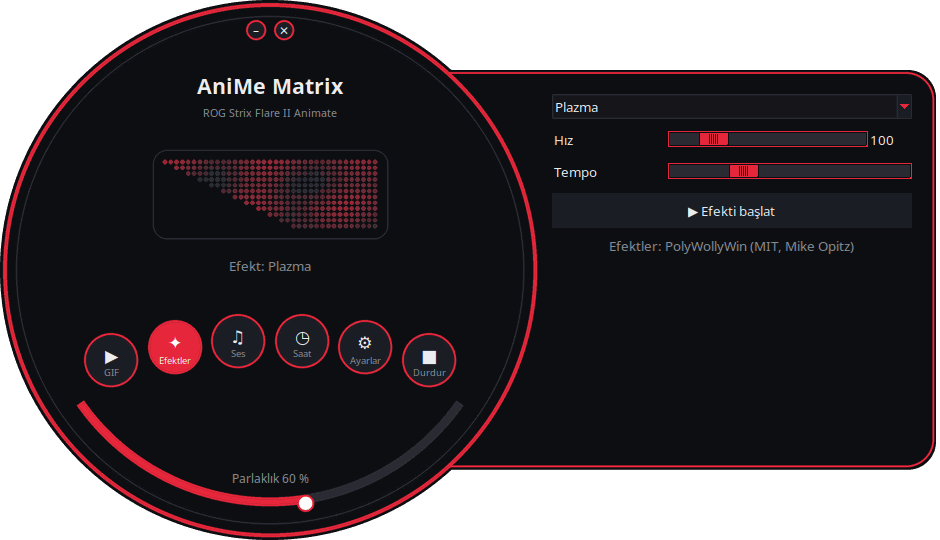
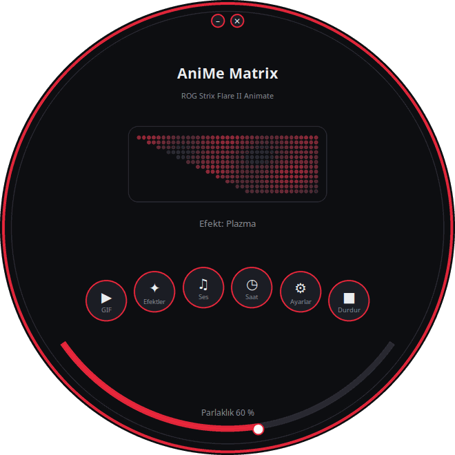
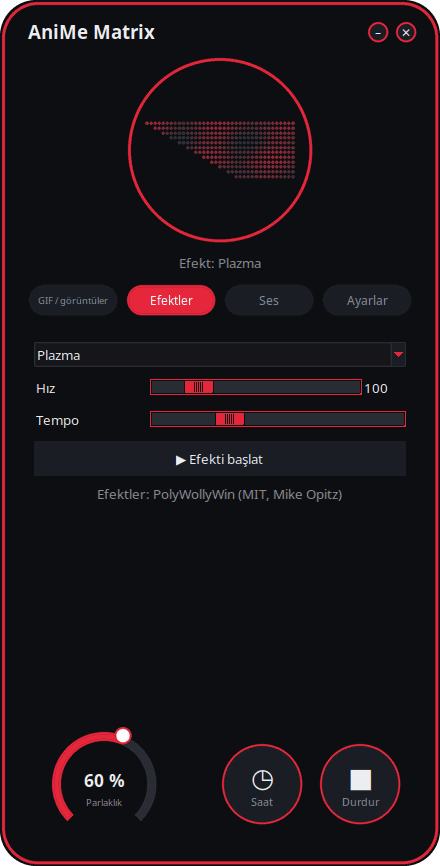
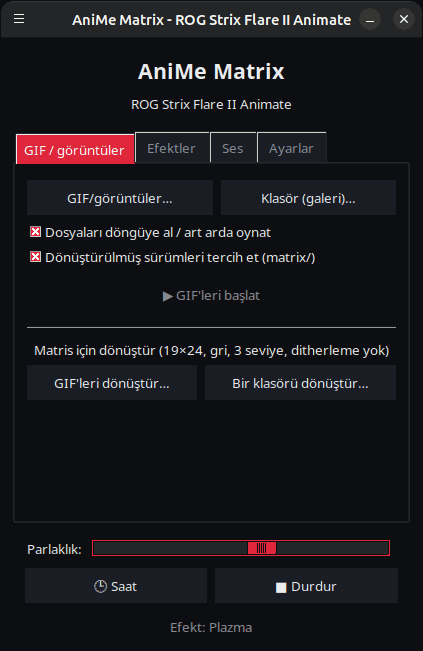

<p align="center">
  
</p>

# Linux için AniMe Matrix — ROG Strix Flare II Animate

[](https://github.com/AntiCitoyen/Anticitoyen-ROG-flare2-anime-matrix/releases/latest)
[](../../LICENSE)
[](https://buymeacoffee.com/anticitoyen)

**ASUS ROG Strix Flare II Animate** klavyesinin **AniMe Matrix** ekranını (312 mini-LED) Armoury Crate veya Windows olmadan Linux üzerinden yönetin: GIF ve görseller, arka plan galerisi, saat, 19 animasyonlu efekt, 7 ses görselleştirici, LED LED çizim.

<div align="center">

[🇫🇷 Français](../../README.md) · [🇬🇧 English](README.en.md) · [🇪🇸 Español](README.es.md) · [🇩🇪 Deutsch](README.de.md) · [🇮🇹 Italiano](README.it.md) · [🇧🇷 Português](README.pt-BR.md) · [🇳🇱 Nederlands](README.nl.md) · [🇵🇱 Polski](README.pl.md) · [🇷🇺 Русский](README.ru.md) · [🇺🇦 Українська](README.uk.md) · **🇹🇷 Türkçe** · [🇸🇦 العربية](README.ar.md) · [🇮🇳 हिन्दी](README.hi.md) · [🇨🇳 简体中文](README.zh-CN.md) · [🇹🇼 繁體中文](README.zh-TW.md) · [🇯🇵 日本語](README.ja.md) · [🇰🇷 한국어](README.ko.md) · [🇻🇳 Tiếng Việt](README.vi.md) · [🇮🇩 Bahasa Indonesia](README.id.md)

</div>

*Not: Arayüz 19 dilde mevcuttur, sistem dilini otomatik olarak izler ve **Ayarlar** sekmesindeki **Dil:** ile değiştirilebilir.*

<p align="center"><br><em>Kadran + çekmece (varsayılan arayüz)</em></p>

| Kadran | Yuvarlatılmış | Klasik |
|:---:|:---:|:---:|
|  |  |  |

<p align="center"></p>

---

## İçindekiler

- [Projenin yaptıkları](#projet)
- [Desteklenen donanım](#materiel)
- [Kurulum](#installation)
- [Kullanım](#utilisation)
- [İyi GIF'ler hazırlama](#gif)
- [Nasıl çalışır](#fonctionnement)
- [Sorun giderme](#depannage)
- [Depo düzeni](#depot)
- [.deb paketini oluşturma](#deb)
- [Emeği geçenler](#credits)
- [Lisans](#licence)
- [Projeyi destekleyin](#soutien)

---

<a id="projet"></a>

## Projenin yaptıkları

ASUS, bu klavyenin AniMe Matrix ekranını yalnızca Windows altında (Armoury Crate) sunar. Bu proje klavyeyle doğrudan USB HID üzerinden konuşur ve şunları sağlar:

- **Bir grafik başlatıcı** (`animematrix`), **4 arayüz** arasından seçilebilir: *Kadran + çekmece* (yuvarlak pencere ve sağdan açılan ayarlar paneli, varsayılan), *Kadran* (her şey çemberin içinde), *Yuvarlatılmış* (çok yuvarlak köşeler, parlaklık çarkı) ve *Klasik* (sekmeler). Yuvarlak arayüzler, klavyeye gönderilen **312 LED'i canlı olarak** gösterir. Dört komut bloğu:
  - **GIF / görüntüler**: bir veya birden fazla dosyayı, ya da tüm bir klasörü galeri olarak döngüde oynatma; matris için GIF dönüştürme.
  - **Efektler**: 19 animasyon (Matrix tarzı yağmur, plazma, ateş, yıldızlar, havai fişekler, şimşekler, metaball'lar, dalga, yılan, kayan yazı, stilize saat, klavyeye tepki…), çalışırken ayarlanabilir.
  - **Ses**: PC'de çalan sese tepki veren 7 görselleştirici (spektrum, KITT/KARR, starburst, osiloskop, ses ateşi…).
  - **Ayarlar**: oturum açılışında görüntülenecek olan, dil, tema ve arayüz, çizim düzenleyici, proje bağlantıları.
- HH:MM biçiminde **bir saat**, başlatıcıdan veya arka plan servisi olarak.
- **Bir arka plan galerisi**: oturum açılır açılmaz bir GIF klasöründe gezinen bir `systemd --user` servisi.
- **Tek tıkla geçiş** (`animematrix-bascule`): menü simgesi ekranı açar veya kapatır; sağ tık **GIF galerisi**, **Saat** veya **Kapat** seçeneklerini sunar.
- **Matrise uygun GIF dönüştürme** (`animematrix-convertir`): 19×24, gri, 3 seviye, tramasız — bkz. [docs/GUIDE-GIF.md](../GUIDE-GIF.md).
- LED LED **bir çizim düzenleyici** (`animematrix-dessin`).
- **11 tema**: ROG'dan esinlenen 5 tema (Classic, Strix, Glitch, Gold, Carbon), 5 pembe tema (Sakura, Sakız, Pembe altın, Lavanta pembe, Pembe gece) ve sistem teması; *Ayarlar* → *Tema:* üzerinden seçilir.
- **Düşük tüketim**: GIF'ler kare kare çözülür; 400 GIF'lik bir galeri ~25 MB bellekte çalışır.

<a id="materiel"></a>

## Desteklenen donanım

| Klavye | USB | Arayüz |
|---|---|---|
| ASUS ROG Strix Flare II Animate | `0b05:19fc` | HID, arayüz 4 (kullanım sayfası `0xFF02`) |

ROG **dizüstü bilgisayarlarının** (Zephyrus G14 vb.) AniMe Matrix ekranları farklı bir protokol kullanır: burada **desteklenmezler** (bunun yerine `asusctl`'a bakın).

Ubuntu 26.04 (X11, PipeWire) üzerinde test edildi. Python ≥ 3.10, hidapi, Tk ve systemd içeren her dağıtım uygun olmalıdır.

<a id="installation"></a>

## Kurulum

### .deb paketi (Debian, Ubuntu, Mint, Pop!_OS…)

1. [Releases](https://github.com/AntiCitoyen/Anticitoyen-ROG-flare2-anime-matrix/releases/latest) sayfasından `anticitoyen-rog-flare2-anime-matrix_<version>_all.deb` dosyasını indirin.
2. Kurun (apt bağımlılıkları otomatik alır):
   ```bash
   sudo apt install ./anticitoyen-rog-flare2-anime-matrix_*_all.deb
   ```
3. **Klavyeyi çıkarıp yeniden takın** (udev kuralı, oturum açmış kullanıcıya erişim verir).
4. Uygulamalar menüsünden **AniMe Matrix**'i başlatın, veya bir terminalde `animematrix` yazın.

Paket şunları kurar:

| Öğe | Konum |
|---|---|
| Programlar | `/usr/share/anticitoyen-rog-flare2-anime-matrix/` |
| Komutlar | `animematrix`, `animematrix-bascule`, `animematrix-effet`, `animematrix-galerie`, `animematrix-horloge`, `animematrix-convertir`, `animematrix-dessin`, `animematrix-lecture` |
| Kullanıcı servisleri | `/usr/lib/systemd/user/animematrix-galerie.service`, `animematrix-horloge.service`, `animematrix-lecture.service` (varsayılan olarak etkin değil) |
| udev kuralı | `/usr/lib/udev/rules.d/72-rog-flare2-animate.rules` |
| Menü ve simge | `animematrix.desktop`, `animematrix` simgesi |

Kaldırma: `sudo apt remove anticitoyen-rog-flare2-anime-matrix`.

### Kaynak koddan

```bash
git clone https://github.com/AntiCitoyen/Anticitoyen-ROG-flare2-anime-matrix.git
cd Anticitoyen-ROG-flare2-anime-matrix
python3 -m venv .venv
.venv/bin/pip install hidapi pillow numpy pynput python-xlib
# root olmadan klavyeye erişim
sudo cp packaging/72-rog-flare2-animate.rules /etc/udev/rules.d/
sudo udevadm control --reload-rules && sudo udevadm trigger
# ardından klavyeyi çıkarıp yeniden takın
.venv/bin/python rog_flare2_launcher.py
```

Faydalı sistem araçları: `imagemagick` (dönüştürme), `pulseaudio-utils` (`parec`, ses için), `zenity` (dosya seçiciler), `libnotify-bin` (geçiş bildirimleri).

Kaynak koddan arka plan servisleri için, `systemd/*.service` dosyalarını `~/.config/systemd/user/` içine kopyalayıp `ExecStart=` satırlarını `.venv/bin/python` yolu ve betik (`rog_flare2_folder_player.py`, `rog_flare2_clock_v3.py`) ile değiştirin, ardından `systemctl --user daemon-reload` çalıştırın.

<a id="utilisation"></a>

## Kullanım

### Başlatıcı

`animematrix` (veya menüdeki **AniMe Matrix** girişi).

Yuvarlak arayüzlerde, yuvarlak düğmeler *GIF / görüntüler*, *Efektler*, *Ses* ve *Ayarlar* bloklarını açar (çekmecede veya çemberin içinde); *Saat* ve *Durdur* hemen etkili olur; alttaki yay parlaklığı ayarlar; pencere, arka planından tutularak taşınır; üstteki küçük düğmeler küçültür veya kapatır. Yuvarlak biçim X11 SHAPE uzantısını kullanır (`python3-xlib` paketi); bu uzantı yoksa, aynı arayüz dikdörtgen bir pencerede görüntülenir.

- **GIF / görüntüler**: seçim için *GIF/görüntüler…*, tüm bir klasör için *Klasör (galeri)…*. Seçilen klasör aynı zamanda arka plan galerisinin klasörü olur. *Dönüştürülmüş sürümleri tercih et (matrix/)*, varsa `dossier/matrix/nom.gif` dosyasını okur (dönüştürme tarafından üretilir).
- **Efektler** ve **Ses**: seçin, ayarlayın, *▶ Efekti başlat*. Kaydırıcılar anlık etki eder; *Tempo* animasyonu hızlandırır veya yavaşlatır.
- **Parlaklık**, **🕒 Saat**, **■ Durdur** (ekranı temizler) tüm sekmelerde ortaktır.
- **Ayarlar**: *Oturum başlangıcında* = **GIF galerisi**, **Saat**, **Son oynatma** veya **Hiçbiri**; *Arayüz:* 4 arayüzden birini seçer (başlatıcı yeniden başlar, o anda gösterilen içerik oynamaya devam eder).

**Başlatıcı kapatıldığında, o an gösterilen şey görüntülenmeye devam eder** (GIF, o anki ayarlarıyla bir efekt, ses görselleştirici veya saat): başlatıcı bunu arka plan servisi olan `animematrix-lecture.service`'e devreder. Bir sonraki başlatmada, başka bir şey başlatılır başlatılmaz kontrolü geri alır (klavyeye yalnızca tek bir program yazabilir). Kapatmadan önce *■ Durdur* ekranı kapalı bırakır.

### Geçiş ve arka plan servisleri

```bash
animematrix-bascule            # açık → kapalı ; kapalı → son mod
animematrix-bascule gif        # arka plan galerisi, oturum açılışında da
animematrix-bascule horloge    # arka plan saati, oturum açılışında da
animematrix-bascule lecture    # başlatıcının son oynatması, oturum açılışında da
animematrix-bascule off        # kapalı, açılışta hiçbir şey yok
animematrix-bascule etat       # geçerli mod
```

Aynı seçimler menü simgesinin sağ tıkında da bulunur. Perde arkasında: `systemctl --user enable --now animematrix-galerie.service` (veya `animematrix-horloge.service`).

### Komut satırından

| Komut | İşlev |
|---|---|
| `animematrix-effet --liste` | efektleri ve görselleştiricileri listeler |
| `animematrix-effet "Plasma" --brightness 60 --vitesse 1.5` | bir efekt başlatır (durdurmak için Ctrl+C) |
| `animematrix-galerie [dossier] --brightness 60 [--originaux]` | bir klasörde gezinir (varsayılan olarak başlatıcıda seçilen son klasör, yoksa `~/Images/AniMe-Matrix`) |
| `animematrix-lecture` | başlatıcının son oynatmasını yeniden oynatır (`~/.config/rog-flare2/lecture.json`) |
| `animematrix-horloge -b 25` | saat; `--clear` ekranı temizler, `--once --text 12:34` bir metin gösterir |
| `animematrix-convertir dossier/ [--sortie D] [--force]` | matris için GIF dönüştürür (`dossier/matrix/` içine) |
| `animematrix-dessin` | çizim düzenleyici |

### Ses

Görselleştiriciler, `parec` (PipeWire veya PulseAudio) ile **varsayılan ses çıkışının monitörünü** dinler: mikrofona değil, PC'nin çaldığı sese tepki verirler. Çıkışı değiştirmek için sistemin varsayılan çıkışını değiştirin.

### « Keyboard React » efekti

`pynput` sayesinde yazma ritmine göre ekranı yakar; bu, efekt çalıştığı sürece tüm oturumun tuşlarını okur. X11 altında çalışır; Wayland altında tuşları almaz.

<a id="gif"></a>

## İyi GIF'ler hazırlama

Ekran bir dikdörtgen değildir: üstte 19, altta 7 LED olacak şekilde kayan 24 satır, gerçekten ayrık 3 gri seviyesi, komşu LED'ler arasında bir halo. Silüetler, piktogramlar, kısa metinler ve yavaş hareketler iyi görünür; fotoğraflar ve videolar görünmez.

Tam kılavuz (tuval boyutu, seviyeler, hız, parlaklık, ImageMagick komutu): **[docs/GUIDE-GIF.md](../GUIDE-GIF.md)**.

<a id="fonctionnement"></a>

## Nasıl çalışır

- **Aktarım**: hidapi, klavyenin 4 numaralı HID arayüzünü açar ve buraya **1024 baytlık** çerçeveler yazar.
- **Çerçeve**: `60 81 00 00` + **312 bayt** (donanım sırasına göre LED başına 0-255 parlaklık) + 1024'e kadar sıfırlar.
- **Geometri**: köşegen olarak kayan 24 satır (19 → 7 LED), ya da eşdeğer olarak 37 → 15 sütunlu 12 mantıksal satır (PolyWollyWin modeli); iki eşleme de 312 LED üzerinde aynı olduğu doğrulanmıştır.
- **GIF**: her kare yeniden birleştirilir (optimize edilmiş GIF'ler yalnızca farkları saklar), griye çevrilir, 24 satıra indirgenir ve satır satır örneklenir.
- **Animasyon**: gömülü bellek kullanılmaz; animasyon, ana bilgisayarın çerçeveleri art arda göndermesiyle oluşur (efektler için ~30 kare/sn).

Orijinal tersine mühendislik notları (USBPcap kayıtları, LED sırası, kalibrasyon noktaları) **[docs/PROTOCOL.md](../PROTOCOL.md)** içindedir; `*.cap` kayıtları ve `parse_usbpcap.py` / `rog_flare2_replay_capture.py` araçları daha ileri gitmek isteyenler için depoda kalır.

⚠️ Dizüstü bilgisayarların AniMe Matrix paketlerini (`0x5E …`, `0xEC …`) klavyeye göndermeyin: bu doğru protokol değildir ve klavyeyi kilitleyebilir (çıkarıp yeniden takın, veya **Fn + Esc** tuşlarını 10-15 saniye basılı tutun).

<a id="depannage"></a>

## Sorun giderme

| Belirti | Olası neden | Çözüm |
|---|---|---|
| `interface 4 not found` | klavye görülmüyor veya izin yok | `lsusb \| grep 0b05:19fc`; udev kuralı kurulu mu? çıkarıp yeniden takın |
| `Permission denied` / `open failed` | udev kuralı uygulanmamış | `sudo udevadm control --reload-rules && sudo udevadm trigger`, ardından yeniden takın |
| Ekran değişmiyor | başka bir program zaten yazıyor | `animematrix-bascule off`, diğer başlatıcıları veya betikleri kapatın |
| Görselleştiriciler demo modunda kalıyor | `parec` yok veya ses yok | `pulseaudio-utils` kurun, ses çalın |
| « Keyboard React » tepki vermiyor | Wayland oturumu veya `pynput` eksik | X11 oturumu, `sudo apt install python3-pynput` |
| Arka plan galerisi başlamıyor | klasör boş veya yok | başlatıcıda (GIF sekmesi) bir klasör seçin |
| Yuvarlak pencere dikdörtgen görünüyor | SHAPE uzantısı veya `python3-xlib` eksik | `sudo apt install python3-xlib`, veya *Ayarlar* → *Arayüz:* → *Klasik* |
| Bir servisin günlüğü | — | `journalctl --user -u animematrix-galerie.service -f` |

<a id="depot"></a>

## Depo düzeni

| Dosya | İşlev |
|---|---|
| `rog_flare2_launcher.py` | grafik başlatıcı (Tk) |
| `rog_flare2_i18n.py`, `locale/` | arayüz çevirisi (19 dil, her dil için bir JSON kataloğu) |
| `rog_flare2_themes.py` | arayüz temaları (ROG ve pembe) |
| `rog_flare2_ui_ronde.py` | yuvarlak arayüzler (kadran + çekmece, kadran, yuvarlatılmış): çizim, pencere biçimi, LED önizlemesi |
| `rog_flare2_effets.py` | efektler ve ses görselleştiricileri (Linux'a uyarlanmış PolyWollyWin motoru) |
| `polywollywin/` | PolyWollyWin efekt motoru, değiştirilmeden kopyalanmıştır (MIT) |
| `rog_flare2_folder_player.py` | arka plan galerisi (servis) |
| `rog_flare2_lecture.py` | arka plan oynatma: başlatıcının kapanışında gösterdiğini devralır (servis) |
| `rog_flare2_clock_v3.py` | saat (servis) |
| `rog_flare2_bascule.sh` | galeri / saat / kapalı geçişi |
| `rog_flare2_convertir.py` | GIF dönüştürme (ImageMagick) |
| `rog_flare2_matrix_paint.py` | HID aktarımı, LED sırası, çizim düzenleyici |
| `parse_usbpcap.py`, `rog_flare2_replay_capture.py`, `*.cap` | tersine mühendislik araçları ve kayıtları |
| `systemd/` | kullanıcı servisleri |
| `packaging/` | udev kuralı, menü girişi, simge, .deb paketinin dosyaları ve betiği |
| `docs/` | GIF kılavuzu, protokol notları, ekran görüntüleri |

<a id="deb"></a>

## .deb paketini oluşturma

```bash
packaging/build-deb.sh
# → dist/anticitoyen-rog-flare2-anime-matrix_<version>_all.deb
```

Yalnızca `dpkg-deb` ve `bash` gereklidir; sürüm `rog_flare2_launcher.py` (`VERSION`) içinden okunur.

<a id="credits"></a>

## Emeği geçenler

- **NicRoss512** — protokolün tersine mühendisliği, orijinal saat ve düzenleyici: [ASUS-ROG-Strix-Flare-II-Animate-AniMe-Matrix-Protocol](https://github.com/NicRoss512/ASUS-ROG-Strix-Flare-II-Animate-AniMe-Matrix-Protocol). Bu depo buradan yola çıkar; geçmişi korunmuştur.
- **Mike Opitz** — [PolyWollyWin](https://github.com/MikeOpitz99/PolyWollyWin) (MIT), efekt ve ses görselleştirici motoru buradan alınan Windows denetleyicisi.
- **Yoshi Walsh** — [Mastering the AniMe Matrix](https://blog.yoshiwalsh.me/asus-anime-matrix/), LED davranışı için (halo, algılanan seviyeler, hız).

Bağımsız bir proje, ASUS ile bağlantılı değildir. "ROG", "AniMe Matrix" ve "Armoury Crate" ASUSTeK'in ticari markalarıdır.

<a id="licence"></a>

## Lisans

Bu deponun kodu için [MIT](../../LICENSE). `polywollywin/`, yazarının MIT lisansı altında kalır ([polywollywin/LICENSE](../../polywollywin/LICENSE)). NicRoss512'nin orijinal dosyaları (`rog_flare2_clock_v3.py`, `rog_flare2_matrix_paint.py`, `parse_usbpcap.py`, `rog_flare2_replay_capture.py`, `docs/PROTOCOL.md`, kayıtlar) açık bir lisans olmadan yayımlanmıştır ve yazarına aittir; atıfla birlikte yeniden dağıtılmaktadır.

<a id="soutien"></a>

## Projeyi destekleyin

Bu proje işinize yarıyorsa, bir kahve onu sürdürmeye yardımcı olur:

[](https://buymeacoffee.com/anticitoyen)

**https://buymeacoffee.com/anticitoyen** — bağlantı, başlatıcının *Ayarlar* sekmesinde de bulunur.

Hata raporları ve fikirler: [Issues](https://github.com/AntiCitoyen/Anticitoyen-ROG-flare2-anime-matrix/issues).
