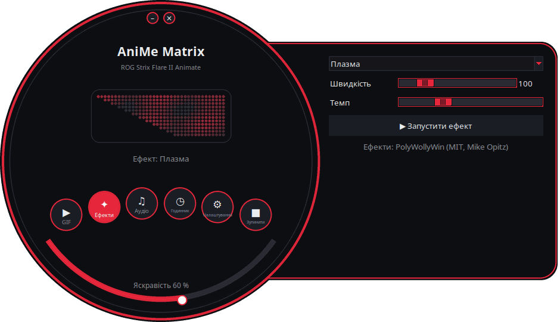
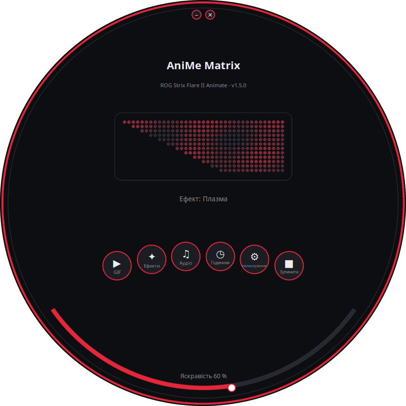
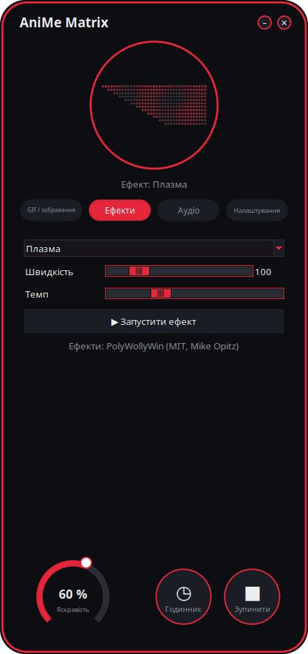
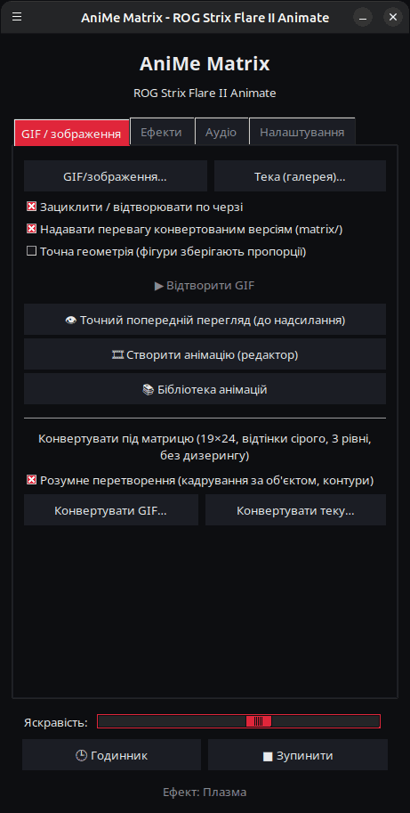

<p align="center">
  
</p>

# AniMe Matrix для Linux — ROG Strix Flare II Animate

[](https://github.com/AntiCitoyen/Anticitoyen-ROG-flare2-anime-matrix/releases/latest)
[](https://github.com/AntiCitoyen/Anticitoyen-ROG-flare2-anime-matrix/actions/workflows/ci.yml)
[](../../LICENSE)
[](https://buymeacoffee.com/anticitoyen)

Керування під Linux екраном **AniMe Matrix** (312 міні-світлодіодів) клавіатури **ASUS ROG Strix Flare II Animate**, без Armoury Crate та Windows: GIF і галерея, годинник, ефекти та аудіовізуалізатори, ігри, монітор системи, сповіщення робочого столу, розклад, редактор анімації, спільна бібліотека, синхронізовані кольори клавіатури.

<div align="center">

[🇫🇷 Français](../../README.md) · [🇬🇧 English](README.en.md) · [🇪🇸 Español](README.es.md) · [🇩🇪 Deutsch](README.de.md) · [🇮🇹 Italiano](README.it.md) · [🇧🇷 Português](README.pt-BR.md) · [🇳🇱 Nederlands](README.nl.md) · [🇵🇱 Polski](README.pl.md) · [🇷🇺 Русский](README.ru.md) · **🇺🇦 Українська** · [🇹🇷 Türkçe](README.tr.md) · [🇸🇦 العربية](README.ar.md) · [🇮🇳 हिन्दी](README.hi.md) · [🇨🇳 简体中文](README.zh-CN.md) · [🇹🇼 繁體中文](README.zh-TW.md) · [🇯🇵 日本語](README.ja.md) · [🇰🇷 한국어](README.ko.md) · [🇻🇳 Tiếng Việt](README.vi.md) · [🇮🇩 Bahasa Indonesia](README.id.md)

</div>

<p align="center"><br><em>Циферблат + панель (інтерфейс за замовчуванням)</em></p>

| Циферблат | Заокруглений | Класичний |
|:---:|:---:|:---:|
|  |  |  |

<p align="center"></p>

---

## Зміст

- [Що робить проєкт](#projet)
- [Підтримуване обладнання](#materiel)
- [Встановлення](#installation)
- [Використання](#utilisation)
- [Підготовка хороших GIF](#gif)
- [Як це працює](#fonctionnement)
- [Усунення несправностей](#depannage)
- [Організація репозиторію](#depot)
- [Збірка пакетів](#deb)
- [Подяки](#credits)
- [Ліцензія](#licence)
- [Підтримати проєкт](#soutien)

---

<a id="projet"></a>

## Що робить проєкт

ASUS надає доступ до екрана AniMe Matrix цієї клавіатури лише під Windows (через Armoury Crate). Цей проєкт спілкується з клавіатурою напряму через USB HID і додає:

**Показ**
- **GIF і зображення**: один файл, вибір файлів або ціла тека як галерея; потокове відтворення (галерея з 400 GIF вміщується у ~25 МБ пам'яті).
- **Годинник** ГГ:ХХ.
- **19 анімованих ефектів** (дощ у стилі Matrix, плазма, вогонь, зорі, феєрверки, блискавки, метаболи, хвиля, рухомий текст…) і **7 аудіовізуалізаторів**, що реагують на звук, який відтворює комп'ютер.
- **Монітор системи**: CPU, RAM, GPU, температура, мережевий трафік і час, у вигляді індикаторів.
- **Поточний трек**: при зміні треку один раз пробігає «ВИКОНАВЕЦЬ - НАЗВА», потім вмикається візуалізатор (Spotify, VLC, Rhythmbox, браузери… через MPRIS).
- **Сповіщення робочого столу**: «ЗАСТОСУНОК: ЗАГОЛОВОК» показується поверх, потім відтворення відновлюється (за замовчуванням вимкнено, список дозволених застосунків).
- **Ігри** на клавіатурі: Snake, Pong, Tetris, Арканоїд, з рекордами.

**Створення**
- **Редактор анімації** покадрово, на реальній геометрії екрана: 3 рівні, доріжка кадрів, шар-примара, зсув, копіювання-вставлення, попередній перегляд, надсилання на клавіатуру, експорт у GIF.
- **Спільна бібліотека анімацій**: переглядайте, відтворюйте, додавайте до своєї галереї, пропонуйте власні.
- **Розумне перетворення** GIF: кадрування за об'єктом, світлий об'єкт на чорному тлі, посилені контури, 3 рівні.
- **Точний попередній перегляд** перед надсиланням: змодельоване відображення екрана (реальне розташування, ореол між світлодіодами).
- **Ефекти у вигляді розширень**: файл Python, розміщений у теці, додає ефект (див. [../EXTENSIONS.md](../EXTENSIONS.md)).

**Автоматизація**
- **Демон `animematrixd`**: єдиний власник екрана, продовжує відображення після закриття лаунчера; команда `animematrix-ctl` та опційний локальний HTTP API.
- **Розклад**: інтервали (дні, включно з ніччю) з годинником, галереєю, монітором, поточним треком або вимкненим екраном; чорний екран, коли сеанс заблоковано, у режимі сну або коли застосунок розгорнуто на весь екран.
- **Кольори клавіатури через OpenRGB**: колір теми на клавішах або пульсація в такт екрану.
- **Значок у системному треї**: швидке меню (режими, яскравість).

**Зручність**
- **4 інтерфейси** (*Циферблат + панель* за замовчуванням, *Циферблат*, *Заокруглений*, *Класичний*) з **попереднім переглядом 312 світлодіодів наживо**, **11 темами** (5 ROG, 5 рожевих, системна) і **19 мовами**.
- **Вбудовані оновлення**: лаунчер завантажує останній реліз, перевіряє його відбиток SHA-256 і встановлює його (пароль адміністратора); або `apt upgrade` з репозиторієм APT.

<a id="materiel"></a>

## Підтримуване обладнання

| Пристрій | USB | Стан |
|---|---|---|
| ASUS ROG Strix Flare II Animate | `0b05:19fc` | підтримується (HID, інтерфейс 4, usage page `0xFF02`) |
| Екрани AniMe Matrix ноутбуків ROG (G14, G16…) | різні | **експериментально** через `asusctl`, не тестувалося на обладнанні (див. [Використання](#utilisation)) |

Протестовано на Ubuntu 26.04 (X11, PipeWire, Cinnamon). Має підійти будь-який дистрибутив із Python ≥ 3.10, hidapi, Tk і systemd.

<a id="installation"></a>

## Встановлення

### Репозиторій APT (Debian, Ubuntu, Mint, Pop!_OS…) — оновлення через `apt upgrade`

```bash
curl -fsSL https://anticitoyen.github.io/Anticitoyen-ROG-flare2-anime-matrix/animematrix.gpg \
  | sudo tee /usr/share/keyrings/animematrix.gpg >/dev/null
echo "deb [signed-by=/usr/share/keyrings/animematrix.gpg] https://anticitoyen.github.io/Anticitoyen-ROG-flare2-anime-matrix stable main" \
  | sudo tee /etc/apt/sources.list.d/animematrix.list
sudo apt update && sudo apt install anticitoyen-rog-flare2-anime-matrix
```

Потім **відключіть і знову підключіть клавіатуру** (правило udev надає доступ користувачу, що увійшов у сесію) і запустіть **AniMe Matrix** з меню.

### Інші формати (сторінка [Releases](https://github.com/AntiCitoyen/Anticitoyen-ROG-flare2-anime-matrix/releases/latest))

| Система | Файл | Встановлення |
|---|---|---|
| Debian, Ubuntu… | `anticitoyen-rog-flare2-anime-matrix_<version>_all.deb` | `sudo apt install ./anticitoyen-rog-flare2-anime-matrix_*_all.deb` |
| Fedora, openSUSE… | `anticitoyen-rog-flare2-anime-matrix-<version>-1.noarch.rpm` | `sudo dnf install ./anticitoyen-rog-flare2-anime-matrix-*.noarch.rpm` |
| Arch, Manjaro… | `anticitoyen-rog-flare2-anime-matrix-<version>-1-any.pkg.tar.zst` | `sudo pacman -U anticitoyen-rog-flare2-anime-matrix-*.pkg.tar.zst` |
| Усі (Flatpak) | `AniMeMatrix-<version>.flatpak` | `flatpak install --user AniMeMatrix-*.flatpak` (також встановіть правило udev нижче; без аудіовізуалізаторів) |

Пакет встановлює:

| Елемент | Розташування |
|---|---|
| Програми | `/usr/share/anticitoyen-rog-flare2-anime-matrix/` |
| Команди | `animematrix`, `animematrixd`, `animematrix-ctl`, `animematrix-bascule`, `animematrix-animation`, `animematrix-apercu`, `animematrix-convertir`, `animematrix-effet`, `animematrix-galerie`, `animematrix-horloge`, `animematrix-dessin`, `animematrix-tray` |
| Користувацька служба | `/usr/lib/systemd/user/animematrixd.service` (увімкнена для всіх сесій) |
| Правило udev | `/usr/lib/udev/rules.d/72-rog-flare2-animate.rules` |
| Меню та значок | `animematrix.desktop`, значок `animematrix` |

### З джерельного коду

```bash
git clone https://github.com/AntiCitoyen/Anticitoyen-ROG-flare2-anime-matrix.git
cd Anticitoyen-ROG-flare2-anime-matrix
python3 -m venv .venv
.venv/bin/pip install hidapi pillow numpy pynput python-xlib
# доступ до клавіатури без root
sudo cp packaging/72-rog-flare2-animate.rules /etc/udev/rules.d/
sudo udevadm control --reload-rules && sudo udevadm trigger
# потім відключіть/підключіть клавіатуру знову
.venv/bin/python rog_flare2_launcher.py
```

Корисні системні утиліти: `imagemagick` (класична конвертація), `pulseaudio-utils` (`parec`, для аудіо), `zenity` (діалоги вибору файлів), `libnotify-bin` (сповіщення), `python3-gi` і `gir1.2-ayatanaappindicator3-0.1` (значок у системному треї), `openrgb` (кольори клавіш).

<a id="utilisation"></a>

## Використання

### Лаунчер

`animematrix` (або пункт **AniMe Matrix** у меню).

У круглих інтерфейсах круглі кнопки відкривають блоки *GIF*, *Ефекти*, *Аудіо* та *Налаштування* (у панелі або в колі); *Годинник* і *Зупинити* діють одразу; нижня дуга регулює яскравість; вікно переміщується перетягуванням за фон; маленькі кнопки згори згортають або закривають його. Кругла форма використовує розширення X11 SHAPE (пакет `python3-xlib`); без нього той самий інтерфейс відображається у прямокутному вікні.

- **GIF / зображення**: *GIF/зображення…* або *Тека (галерея)…*; *Точна геометрія* зберігає пропорції (кут обрізає зображення замість розтягування); *👁 Точний попередній перегляд (до надсилання)* показує результат, нічого не надсилаючи; *🎞 Створити анімацію (редактор)*; *📚 Бібліотека анімацій*; *Розумне перетворення* для конвертації GIF.
- **Ефекти** та **Аудіо**: обрати, налаштувати, *▶ Запустити ефект*. Повзунки діють у реальному часі; *Темп* прискорює або сповільнює всю анімацію. В ігри грають стрілками, пробілом та Enter, коли вікно лаунчера на передньому плані.
- **Яскравість**, **🕒 Годинник**, **■ Зупинити** (очищає екран) — спільні для всіх вкладок.
- **Налаштування**: запуск сесії (Галерея GIF, Годинник, Останнє відтворення або Нічого), мова, тема, інтерфейс, сповіщення робочого столу, кольори клавіатури (OpenRGB), *Розклад…*, значок у системному треї, тека розширень, оновлення.

**Закриття лаунчера нічого не перериває**: демон `animematrixd` продовжує відображення. *■ Зупинити* вимикає екран.

### Демон і командний рядок

```bash
animematrix-ctl etat                               # що відображається
animematrix-ctl gif ~/Images/AniMe-Matrix --fidele # галерея (тека або файли)
animematrix-ctl effet "Plasma" --param speed=250   # ефект і налаштування
animematrix-ctl horloge
animematrix-ctl texte "Bonjour"
animematrix-ctl notifier "Café prêt" --duree 5     # накладення, потім повернення
animematrix-ctl luminosite 60
animematrix-ctl stop
```

| Команда | Призначення |
|---|---|
| `animematrix-bascule [gif\|horloge\|lecture\|off\|etat]` | перемикач (також через клік правою кнопкою на значку в меню); обраний режим також використовується на початку сесії |
| `animematrixd --http 8765` | демон із локальним HTTP API (`POST http://127.0.0.1:8765/api`, той самий JSON, що й сокет) |
| `animematrix-animation [файл.gif]` | редактор анімації |
| `animematrix-apercu файл.gif -o apercu.gif` | точний попередній перегляд GIF (файл) |
| `animematrix-convertir тека/ [--fidele] [--classique]` | конвертує GIF під матрицю (у `тека/matrix/`) |
| `animematrix-effet --liste` | виводить список ефектів і візуалізаторів |
| `animematrix-dessin` | редактор по одному світлодіоду (повертає керування демону при закритті) |

### Аудіо

Візуалізатори прослуховують **монітор звукового пристрою виведення за замовчуванням** через `parec` (PipeWire або PulseAudio): вони реагують на те, що відтворює комп'ютер, а не на мікрофон.

### Ефект «Keyboard React»

Він запалює екран у такт набору тексту завдяки `pynput`, який зчитує натискання клавіш у всій сесії, поки ефект працює. Працює під X11; під Wayland не отримує натискання клавіш.

### Кольори клавіатури (OpenRGB)

*Налаштування* → *Кольори клавіатури (OpenRGB)*: колір теми або пульсація в такт екрану. Демон за потреби запускає `openrgb --server`. OpenRGB не знає про попереднє підсвічування клавіатури: щоб повернути ефект, збережений у клавіатурі, відключіть її та підключіть знову.

### Ноутбуки ROG (експериментально)

Впишіть `portable-asusctl` у `~/.config/rog-flare2/materiel`, потім перезапустіть демон: кадри проходять через `asusctl anime image` (не більше 5 кадрів на секунду). Не тестувалося на справжньому ноутбуці: відгуки вітаються у тікетах.

<a id="gif"></a>

## Підготовка хороших GIF

Екран не є прямокутником: 24 зміщені ряди, від 19 світлодіодів угорі до 7 унизу (правий край вертикальний, лівий — по діагоналі), 3 справді розрізнювані рівні сірого, ореол між сусідніми світлодіодами. Силуети, піктограми, короткі тексти й повільний рух виглядають добре; фотографії та відео — погано.

Повний посібник (полотно, рівні, темп, конвертація, точна геометрія): **[../GUIDE-GIF.md](../GUIDE-GIF.md)**.

<a id="fonctionnement"></a>

## Як це працює

- **Транспорт**: hidapi відкриває HID-інтерфейс № 4 клавіатури й записує в нього кадри по **1024 байти**; клавіатура повертає кожен кадр.
- **Кадр**: `60 81 00 00` + **312 байтів** (яскравість 0–255 на світлодіод, в апаратному порядку) + нулі до 1024.
- **Геометрія**: 24 ряди, зміщені по діагоналі (ряд r охоплює стовпці (r+1)//2–18), або еквівалентно 12 логічних рядів по 37 → 15 стовпців (модель PolyWollyWin); обидва подання перевірено як ідентичні для всіх 312 світлодіодів.
- **Демон**: `animematrixd` одноосібно керує клавіатурою; базове відтворення і накладення (сповіщення); JSON-сокет `$XDG_RUNTIME_DIR/animematrix.sock`; автоматичне перепідключення клавіатури.
- **Анімація**: хост надсилає кадри один за одним (~30 кадрів/с для ефектів); вбудована пам'ять клавіатури не використовується (дослідження: [../RECHERCHE-MEMOIRE.md](../RECHERCHE-MEMOIRE.md)).

Оригінальні нотатки з реверс-інжинірингу містяться в **[../PROTOCOL.md](../PROTOCOL.md)**; захоплення `*.cap` та інструменти `parse_usbpcap.py` / `rog_flare2_replay_capture.py` залишаються в репозиторії.

⚠️ Не надсилайте клавіатурі пакети, призначені для ноутбуків AniMe Matrix (`0x5E …`, `0xEC …`): це не той протокол, і це може заблокувати клавіатуру (відключіть/підключіть знову, або утримуйте **Fn + Esc** 10–15 с).

<a id="depannage"></a>

## Усунення несправностей

| Симптом | Ймовірна причина | Рішення |
|---|---|---|
| `interface 4 not found` | клавіатуру не виявлено або немає прав | `lsusb \| grep 0b05:19fc` ; чи встановлено правило udev? відключити/підключити |
| `Permission denied` / `open failed` | правило udev не застосовано | `sudo udevadm control --reload-rules && sudo udevadm trigger`, потім перепідключити |
| «Служба animematrixd недоступна» | демон зупинено | `systemctl --user restart animematrixd.service` або `animematrixd &` |
| Екран не змінюється | інша програма пише в клавіатуру | закрити старі скрипти; `animematrix-ctl etat` |
| Візуалізатори лишаються в демо-режимі | немає `parec` або немає звуку | встановити `pulseaudio-utils`, відтворити звук |
| «Keyboard React» не реагує | сесія Wayland або відсутній `pynput` | сесія X11, `sudo apt install python3-pynput` |
| Кругле вікно відображається як прямокутник | відсутнє розширення SHAPE або `python3-xlib` | `sudo apt install python3-xlib`, або *Налаштування* → *Інтерфейс:* → *Класичний* |
| Клавіші лишаються одного кольору після OpenRGB | OpenRGB не відтворює початковий ефект | відключити й знову підключити клавіатуру |
| Журнал демона | — | `journalctl --user -u animematrixd.service -f` |

<a id="depot"></a>

## Організація репозиторію

| Файл | Призначення |
|---|---|
| `rog_flare2_launcher.py` | графічний лаунчер (Tk) |
| `rog_flare2_ui_ronde.py`, `rog_flare2_themes.py` | круглі інтерфейси, теми |
| `rog_flare2_i18n.py`, `locale/` | переклад (19 мов; `locale/_cles.json` = тексти для перекладу) |
| `rog_flare2_demon.py`, `rog_flare2_ctl.py` | демон `animematrixd`, клієнт і команда `animematrix-ctl` |
| `rog_flare2_core.py` | потокове відтворення GIF, годинник, геометрія |
| `rog_flare2_effets.py`, `polywollywin/` | ефекти та візуалізатори (рушій PolyWollyWin, MIT), розширення |
| `rog_flare2_infos.py`, `rog_flare2_mpris.py`, `rog_flare2_jeux.py` | монітор системи, поточний трек, ігри |
| `rog_flare2_notifs.py`, `rog_flare2_programme.py`, `rog_flare2_ui_programme.py` | сповіщення, розклад і тригери |
| `rog_flare2_openrgb.py`, `rog_flare2_tray.py`, `rog_flare2_portable.py` | кольори через OpenRGB, значок у системному треї, ноутбуки (експериментально) |
| `rog_flare2_animation.py`, `rog_flare2_simulateur.py`, `rog_flare2_convertir.py` | редактор анімації, симулятор, конвертація |
| `rog_flare2_bibliotheque.py`, `bibliotheque/` | бібліотека анімацій (каталог, GIF CC0) |
| `rog_flare2_maj.py` | оновлення з релізів |
| `rog_flare2_matrix_paint.py`, `rog_flare2_clock_v3.py`, `rog_flare2_folder_player.py` | HID-транспорт і редактор світлодіодів, годинник, галерея (початкові інструменти) |
| `parse_usbpcap.py`, `rog_flare2_replay_capture.py`, `*.cap` | реверс-інжиніринг |
| `examples/effets/` | приклад розширення |
| `tests/` | тести (зокрема інтерфейси через реальні кліки) |
| `systemd/`, `packaging/` | користувацька служба; .deb, RPM, Arch, Flatpak, репозиторій APT |
| `docs/` | посібник з GIF, розширення, протокол, дослідження, знімки екрана, перекладені README |

<a id="deb"></a>

## Збірка пакетів

```bash
packaging/build-deb.sh
# → dist/anticitoyen-rog-flare2-anime-matrix_<version>_all.deb
```

`packaging/install.sh` встановлює проєкт у будь-яку структуру каталогів; він використовується для .deb, RPM (`packaging/rpm/`), пакета Arch (`packaging/aur/`) і Flatpak (`packaging/flatpak/`). При кожному опублікованому релізі GitHub збирає RPM, пакет Arch і Flatpak, а також оновлює підписаний репозиторій APT. Версія зчитується з `rog_flare2_core.py` (`VERSION`). Тести: `python -m pytest tests`.

<a id="credits"></a>

## Подяки

- **NicRoss512** — реверс-інжиніринг протоколу, оригінальний годинник і редактор: [ASUS-ROG-Strix-Flare-II-Animate-AniMe-Matrix-Protocol](https://github.com/NicRoss512/ASUS-ROG-Strix-Flare-II-Animate-AniMe-Matrix-Protocol). Цей репозиторій є форком того проєкту; історію комітів збережено.
- **Mike Opitz** — [PolyWollyWin](https://github.com/MikeOpitz99/PolyWollyWin) (MIT), контролер для Windows, чий рушій ефектів і аудіовізуалізаторів використано тут.
- **Yoshi Walsh** — [Mastering the AniMe Matrix](https://blog.yoshiwalsh.me/asus-anime-matrix/), за опис поведінки світлодіодів (ореол, сприйняті рівні, темп).
- **asus-linux** — [asusctl](https://gitlab.com/asus-linux/asusctl), використовується для екранів ноутбуків.

Незалежний проєкт, не пов'язаний з ASUS. «ROG», «AniMe Matrix» і «Armoury Crate» — торгові марки ASUSTeK.

<a id="licence"></a>

## Ліцензія

[MIT](../../LICENSE) для коду цього репозиторію; анімації з `bibliotheque/` під ліцензією CC0. `polywollywin/` лишається під ліцензією MIT свого автора ([../../polywollywin/LICENSE](../../polywollywin/LICENSE)). Оригінальні файли NicRoss512 (`rog_flare2_clock_v3.py`, `rog_flare2_matrix_paint.py`, `parse_usbpcap.py`, `rog_flare2_replay_capture.py`, `../PROTOCOL.md`, захоплення) опубліковано без явної ліцензії, і вони лишаються власністю їхнього автора; тут вони поширюються з зазначенням авторства.

<a id="soutien"></a>

## Підтримати проєкт

Якщо цей проєкт вам корисний, кава допоможе його підтримувати:

[](https://buymeacoffee.com/anticitoyen)

**https://buymeacoffee.com/anticitoyen** — посилання також є у вкладці *Налаштування* лаунчера.

Звіти про помилки, ідеї та анімації, якими можна поділитися: [Issues](https://github.com/AntiCitoyen/Anticitoyen-ROG-flare2-anime-matrix/issues).
