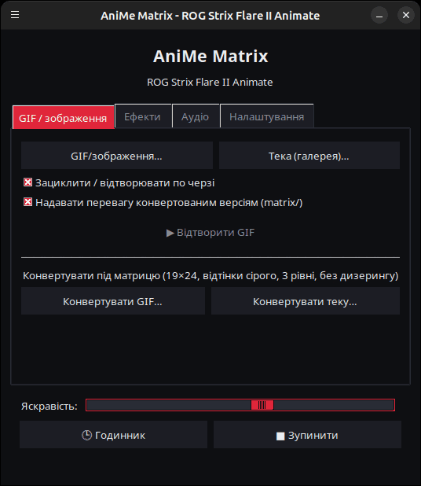
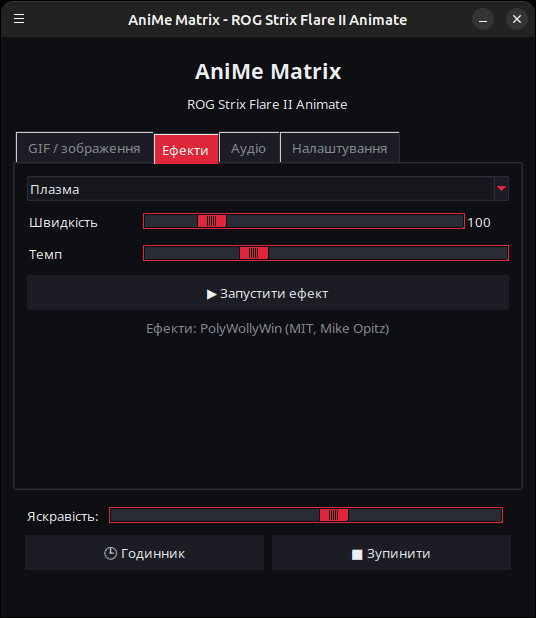
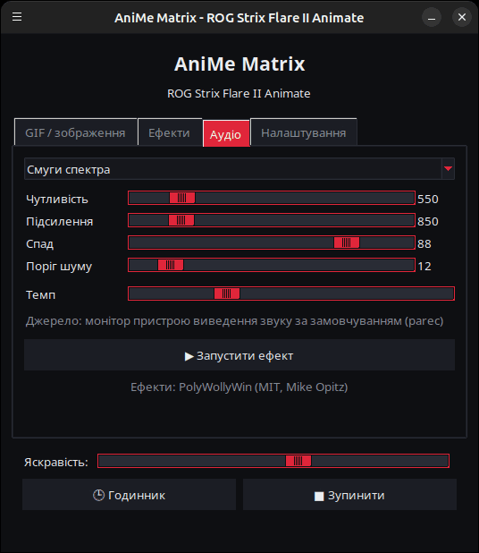
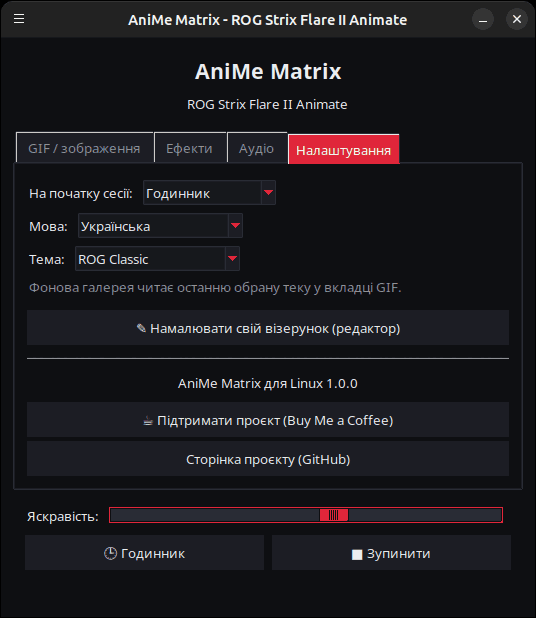

<p align="center">
  
</p>

# AniMe Matrix для Linux — ROG Strix Flare II Animate

[](https://github.com/AntiCitoyen/Anticitoyen-ROG-flare2-anime-matrix/releases/latest)
[](../../LICENSE)
[](https://buymeacoffee.com/anticitoyen)

Керування під Linux екраном **AniMe Matrix** (312 міні-світлодіодів) клавіатури **ASUS ROG Strix Flare II Animate** без Armoury Crate та Windows: GIF і зображення, фонова галерея, годинник, 19 анімованих ефектів, 7 аудіовізуалізаторів, малювання по одному світлодіоду.

Інтерфейс доступний 19 мовами — він автоматично підлаштовується під мову системи, а змінити її можна у вкладці *Налаштування* → *Мова:*.

<div align="center">

[🇫🇷 Français](../../README.md) · [🇬🇧 English](README.en.md) · [🇪🇸 Español](README.es.md) · [🇩🇪 Deutsch](README.de.md) · [🇮🇹 Italiano](README.it.md) · [🇧🇷 Português](README.pt-BR.md) · [🇳🇱 Nederlands](README.nl.md) · [🇵🇱 Polski](README.pl.md) · [🇷🇺 Русский](README.ru.md) · **🇺🇦 Українська** · [🇹🇷 Türkçe](README.tr.md) · [🇸🇦 العربية](README.ar.md) · [🇮🇳 हिन्दी](README.hi.md) · [🇨🇳 简体中文](README.zh-CN.md) · [🇹🇼 繁體中文](README.zh-TW.md) · [🇯🇵 日本語](README.ja.md) · [🇰🇷 한국어](README.ko.md) · [🇻🇳 Tiếng Việt](README.vi.md) · [🇮🇩 Bahasa Indonesia](README.id.md)

</div>

| GIF / зображення | Ефекти | Аудіо | Налаштування |
|---|---|---|---|
|  |  |  |  |

<p align="center"></p>

---

## Зміст

- [Що робить проєкт](#projet)
- [Підтримуване обладнання](#materiel)
- [Встановлення](#installation)
- [Використання](#utilisation)
- [Підготовка хороших GIF](#gif)
- [Як це працює](#fonctionnement)
- [Усунення несправностей](#depannage)
- [Організація репозиторію](#depot)
- [Збірка пакета .deb](#deb)
- [Подяки](#credits)
- [Ліцензія](#licence)
- [Підтримати проєкт](#soutien)

---

<a id="projet"></a>

## Що робить проєкт

ASUS надає доступ до екрана AniMe Matrix цієї клавіатури лише під Windows (через Armoury Crate). Цей проєкт спілкується з клавіатурою напряму через USB HID і додає:

- **Графічний лаунчер** (`animematrix`) із чотирма вкладками:
  - **GIF / зображення** (*GIF/зображення…*): відтворення одного чи кількох файлів або цілої теки як галереї, по колу; конвертація GIF під матрицю.
  - **Ефекти**: 19 анімацій (дощ у стилі Matrix, плазма, вогонь, зорі, феєрверки, блискавки, метаболи, хвиля, змійка, рухомий текст, стилізований годинник, реакція на клавіші…), які можна налаштовувати під час роботи.
  - **Аудіо**: 7 візуалізаторів, що реагують на звук, який відтворює комп'ютер (спектр, KITT/KARR, starburst, осцилограф, аудіо-вогонь…).
  - **Налаштування**: що показувати при вході в сесію, редактор малюнка, посилання проєкту.
- **Годинник** ГГ:ХХ — з лаунчера або як фонова служба.
- **Фонова галерея**: користувацька служба `systemd --user`, що прокручує теку з GIF одразу після входу в сесію.
- **Перемикання одним кліком** (`animematrix-bascule`): значок у меню вмикає або вимикає екран; клік правою кнопкою дозволяє обрати Галерея GIF, Годинник або Вимкнути.
- **Конвертацію GIF під матрицю** (`animematrix-convertir`): 19×24, відтінки сірого, 3 рівні, без дизерингу — див. [../GUIDE-GIF.md](../GUIDE-GIF.md).
- **Редактор малюнка** по одному світлодіоду (`animematrix-dessin`).
- **11 тем**: 5 у стилі ROG (Classic, Strix, Glitch, Gold, Carbon), 5 рожевих (Сакура, Жуйка, Рожеве золото, Лавандово-рожева, Рожева ніч) і системна; вибір у *Налаштування* → *Тема:*.
- **Низьке споживання ресурсів**: GIF декодуються покадрово; галерея з 400 GIF працює на ~25 МБ пам'яті.

<a id="materiel"></a>

## Підтримуване обладнання

| Клавіатура | USB | Інтерфейс |
|---|---|---|
| ASUS ROG Strix Flare II Animate | `0b05:19fc` | HID, інтерфейс 4 (usage page `0xFF02`) |

Екрани AniMe Matrix у **ноутбуках** ROG (Zephyrus G14 тощо) використовують інший протокол: вони тут **не** підтримуються (див. натомість `asusctl`).

Протестовано на Ubuntu 26.04 (X11, PipeWire). Має підійти будь-який дистрибутив із Python ≥ 3.10, hidapi, Tk і systemd.

<a id="installation"></a>

## Встановлення

### Пакет .deb (Debian, Ubuntu, Mint, Pop!_OS…)

1. Завантажте `anticitoyen-rog-flare2-anime-matrix_<version>_all.deb` зі сторінки [Releases](https://github.com/AntiCitoyen/Anticitoyen-ROG-flare2-anime-matrix/releases/latest).
2. Встановіть його (apt підтягне залежності):
   ```bash
   sudo apt install ./anticitoyen-rog-flare2-anime-matrix_*_all.deb
   ```
3. **Відключіть і знову підключіть клавіатуру** (правило udev надає доступ користувачу, що увійшов у сесію).
4. Запустіть **AniMe Matrix** з меню застосунків або командою `animematrix` у терміналі.

Пакет встановлює:

| Елемент | Розташування |
|---|---|
| Програми | `/usr/share/anticitoyen-rog-flare2-anime-matrix/` |
| Команди | `animematrix`, `animematrix-bascule`, `animematrix-effet`, `animematrix-galerie`, `animematrix-horloge`, `animematrix-convertir`, `animematrix-dessin` |
| Користувацькі служби | `/usr/lib/systemd/user/animematrix-galerie.service`, `animematrix-horloge.service` (за замовчуванням не активовані) |
| Правило udev | `/usr/lib/udev/rules.d/72-rog-flare2-animate.rules` |
| Меню та значок | `animematrix.desktop`, значок `animematrix` |

Видалення: `sudo apt remove anticitoyen-rog-flare2-anime-matrix`.

### З джерельного коду

```bash
git clone https://github.com/AntiCitoyen/Anticitoyen-ROG-flare2-anime-matrix.git
cd Anticitoyen-ROG-flare2-anime-matrix
python3 -m venv .venv
.venv/bin/pip install hidapi pillow numpy pynput
# доступ до клавіатури без root
sudo cp packaging/72-rog-flare2-animate.rules /etc/udev/rules.d/
sudo udevadm control --reload-rules && sudo udevadm trigger
# потім відключіть і знову підключіть клавіатуру
.venv/bin/python rog_flare2_launcher.py
```

Корисні системні утиліти: `imagemagick` (конвертація), `pulseaudio-utils` (`parec`, для аудіо), `zenity` (діалоги вибору файлів), `libnotify-bin` (сповіщення перемикача).

Для фонових служб при встановленні з джерельного коду скопіюйте `systemd/*.service` до `~/.config/systemd/user/`, замінивши рядки `ExecStart=` на шлях до `.venv/bin/python` та відповідного скрипту (`rog_flare2_folder_player.py`, `rog_flare2_clock_v3.py`), потім виконайте `systemctl --user daemon-reload`.

<a id="utilisation"></a>

## Використання

### Лаунчер

`animematrix` (або пункт **AniMe Matrix** у меню).

- **GIF / зображення**: *GIF/зображення…* для вибору файлів, *Тека (галерея)…* для цілої теки. Обрана тека також стає текою фонової галереї. *Надавати перевагу конвертованим версіям* читає `тека/matrix/назва.gif`, якщо він існує (створений конвертацією).
- **Ефекти** та **Аудіо**: обрати, налаштувати, *▶ Запустити ефект*. Повзунки діють у реальному часі; *Швидкість* прискорює або сповільнює анімацію.
- **Яскравість**, **🕒 Годинник**, **■ Зупинити** (очищає екран) — спільні для всіх вкладок.
- **Налаштування**: *На початку сесії* = Галерея GIF, Годинник або Нічого; *Мова:* змінює мову інтерфейсу (лаунчер перезапускається).

Поки лаунчер щось показує, він призупиняє фонову службу (записувати в клавіатуру може лише одна програма) і відновлює її після закриття.

### Перемикач і фонові служби

```bash
animematrix-bascule            # увімкнено → вимкнено ; вимкнено → останній режим
animematrix-bascule gif        # фонова галерея, також на початку сесії
animematrix-bascule horloge    # фоновий годинник, також на початку сесії
animematrix-bascule off        # вимкнено, нічого на початку
animematrix-bascule etat       # поточний режим
```

Ті самі варіанти доступні при кліку правою кнопкою на значку в меню. Під капотом: `systemctl --user enable --now animematrix-galerie.service` (або `animematrix-horloge.service`).

### З командного рядка

| Команда | Призначення |
|---|---|
| `animematrix-effet --liste` | список ефектів і візуалізаторів |
| `animematrix-effet "Plasma" --brightness 60 --vitesse 1.5` | запускає ефект (Ctrl+C для зупинки) |
| `animematrix-galerie [тека] --brightness 60 [--originaux]` | прокручує теку (за замовчуванням остання обрана в лаунчері, інакше `~/Images/AniMe-Matrix`) |
| `animematrix-horloge -b 25` | годинник; `--clear` очищає екран, `--once --text 12:34` показує текст |
| `animematrix-convertir тека/ [--sortie D] [--force]` | конвертує GIF під матрицю (у `тека/matrix/`) |
| `animematrix-dessin` | редактор малюнка |

### Аудіо

Візуалізатори прослуховують **монітор звукового пристрою виведення за замовчуванням** через `parec` (PipeWire або PulseAudio): вони реагують на те, що відтворює комп'ютер, а не на мікрофон. Щоб змінити джерело, змініть пристрій виведення за замовчуванням у системі.

### Ефект «Реакція на клавіатуру»

Він запалює екран у такт набору тексту завдяки `pynput`, який зчитує натискання клавіш у всій сесії, поки ефект працює. Працює під X11; під Wayland не отримує натискання клавіш.

<a id="gif"></a>

## Підготовка хороших GIF

Екран не є прямокутником: 24 зміщені ряди, від 19 світлодіодів угорі до 7 унизу, 3 справді розрізнювані рівні сірого, ореол між сусідніми світлодіодами. Силуети, піктограми, короткі тексти й повільний рух виглядають добре; фотографії та відео — ні.

Повний посібник (розмір полотна, рівні, частота кадрів, яскравість, команда ImageMagick): **[../GUIDE-GIF.md](../GUIDE-GIF.md)**.

<a id="fonctionnement"></a>

## Як це працює

- **Транспорт**: hidapi відкриває HID-інтерфейс № 4 клавіатури й записує в нього кадри по **1024 байти**.
- **Кадр**: `60 81 00 00` + **312 байтів** (яскравість 0–255 на світлодіод, в апаратному порядку) + нулі до 1024.
- **Геометрія**: 24 ряди, зміщені по діагоналі (19 → 7 світлодіодів), або еквівалентно 12 логічних рядів по 37 → 15 стовпців (модель PolyWollyWin); обидва подання перевірено як ідентичні для всіх 312 світлодіодів.
- **GIF**: кожен кадр відновлюється повністю (оптимізовані GIF зберігають лише відмінності), переводиться у відтінки сірого, зводиться до 24 рядів і дискретизується порядково.
- **Анімація**: вбудованої пам'яті пристрій не використовує; анімацію створює хост, надсилаючи кадри один за одним (~30 кадрів/с для ефектів).

Оригінальні нотатки з реверс-інжинірингу (захоплення USBPcap, порядок світлодіодів, точки калібрування) містяться в **[../PROTOCOL.md](../PROTOCOL.md)**; захоплення `*.cap` та інструменти `parse_usbpcap.py` / `rog_flare2_replay_capture.py` залишаються в репозиторії для тих, хто хоче зануритися глибше.

⚠️ Не надсилайте клавіатурі пакети, призначені для AniMe Matrix ноутбуків (`0x5E …`, `0xEC …`): це не той протокол, і це може заблокувати клавіатуру (відключіть і знову підключіть, або утримуйте **Fn + Esc** 10–15 с).

<a id="depannage"></a>

## Усунення несправностей

| Симптом | Ймовірна причина | Рішення |
|---|---|---|
| `interface 4 not found` | клавіатуру не виявлено або немає прав | `lsusb \| grep 0b05:19fc` ; чи встановлено правило udev? відключити/підключити |
| `Permission denied` / `open failed` | правило udev не застосовано | `sudo udevadm control --reload-rules && sudo udevadm trigger`, потім перепідключити |
| Екран не змінюється | інша програма вже пише | `animematrix-bascule off`, закрити інші лаунчери чи скрипти |
| Візуалізатори лишаються в демо-режимі | немає `parec` або немає звуку | встановити `pulseaudio-utils`, відтворити звук |
| «Реакція на клавіатуру» не реагує | сесія Wayland або відсутній `pynput` | сесія X11, `sudo apt install python3-pynput` |
| Фонова галерея не запускається | тека порожня або відсутня | обрати теку в лаунчері (вкладка GIF) |
| Журнал служби | — | `journalctl --user -u animematrix-galerie.service -f` |

<a id="depot"></a>

## Організація репозиторію

| Файл | Призначення |
|---|---|
| `rog_flare2_launcher.py` | графічний лаунчер (Tk) |
| `rog_flare2_effets.py` | ефекти та аудіовізуалізатори (рушій PolyWollyWin, адаптований під Linux) |
| `polywollywin/` | рушій ефектів PolyWollyWin, скопійований без змін (MIT) |
| `rog_flare2_folder_player.py` | фонова галерея (служба) |
| `rog_flare2_clock_v3.py` | годинник (служба) |
| `rog_flare2_bascule.sh` | перемикач галерея / годинник / вимкнено |
| `rog_flare2_convertir.py` | конвертація GIF (ImageMagick) |
| `rog_flare2_matrix_paint.py` | HID-транспорт, порядок світлодіодів, редактор малюнка |
| `parse_usbpcap.py`, `rog_flare2_replay_capture.py`, `*.cap` | інструменти та захоплення для реверс-інжинірингу |
| `systemd/` | користувацькі служби |
| `packaging/` | правило udev, пункт меню, значок, файли та скрипт пакета .deb |
| `docs/` | посібник із GIF, нотатки протоколу, знімки екрана |

<a id="deb"></a>

## Збірка пакета .deb

```bash
packaging/build-deb.sh
# → dist/anticitoyen-rog-flare2-anime-matrix_<version>_all.deb
```

Потрібні лише `dpkg-deb` і `bash`; версія зчитується з `rog_flare2_launcher.py` (`VERSION`).

<a id="credits"></a>

## Подяки

- **NicRoss512** — реверс-інжиніринг протоколу, оригінальний годинник і редактор: [ASUS-ROG-Strix-Flare-II-Animate-AniMe-Matrix-Protocol](https://github.com/NicRoss512/ASUS-ROG-Strix-Flare-II-Animate-AniMe-Matrix-Protocol). Цей репозиторій є форком того проєкту; історію комітів збережено.
- **Mike Opitz** — [PolyWollyWin](https://github.com/MikeOpitz99/PolyWollyWin) (MIT), контролер для Windows, чий рушій ефектів і аудіовізуалізаторів використано тут.
- **Yoshi Walsh** — [Mastering the AniMe Matrix](https://blog.yoshiwalsh.me/asus-anime-matrix/), за опис поведінки світлодіодів (ореол, сприйняті рівні, частота).

Незалежний проєкт, не пов'язаний з ASUS. «ROG», «AniMe Matrix» і «Armoury Crate» — торгові марки ASUSTeK.

<a id="licence"></a>

## Ліцензія

[MIT](../../LICENSE) для коду цього репозиторію. `polywollywin/` лишається під ліцензією MIT свого автора ([../../polywollywin/LICENSE](../../polywollywin/LICENSE)). Оригінальні файли NicRoss512 (`rog_flare2_clock_v3.py`, `rog_flare2_matrix_paint.py`, `parse_usbpcap.py`, `rog_flare2_replay_capture.py`, `../PROTOCOL.md`, захоплення) опубліковано без явної ліцензії, і вони лишаються власністю їхнього автора; тут вони поширюються з зазначенням авторства.

<a id="soutien"></a>

## Підтримати проєкт

Якщо цей проєкт вам корисний, кава допоможе його підтримувати:

[](https://buymeacoffee.com/anticitoyen)

**https://buymeacoffee.com/anticitoyen** — посилання також є у вкладці *Налаштування* лаунчера.

Звіти про помилки та ідеї: [Issues](https://github.com/AntiCitoyen/Anticitoyen-ROG-flare2-anime-matrix/issues).
