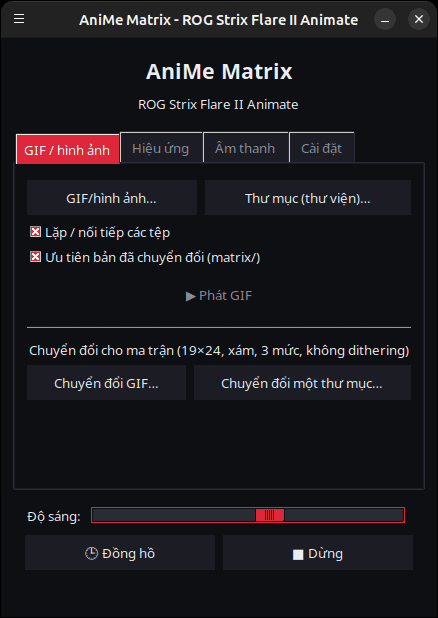
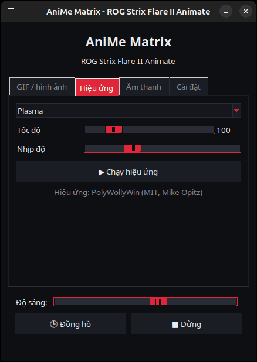
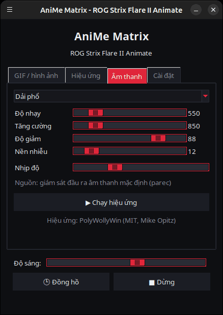
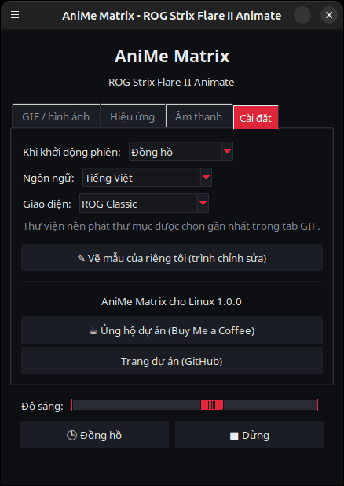

<p align="center">
  
</p>

# AniMe Matrix cho Linux — ROG Strix Flare II Animate

[](https://github.com/AntiCitoyen/Anticitoyen-ROG-flare2-anime-matrix/releases/latest)
[](../../LICENSE)
[](https://buymeacoffee.com/anticitoyen)

Điều khiển màn hình **AniMe Matrix** (312 mini-LED) của bàn phím **ASUS ROG Strix Flare II Animate** trên Linux, không cần Armoury Crate hay Windows: GIF và hình ảnh, thư viện ảnh nền, đồng hồ, 19 hiệu ứng hoạt hình, 7 bộ hiển thị âm thanh (visualizer), vẽ từng LED.

Giao diện ứng dụng có sẵn bằng 19 ngôn ngữ, tự động theo ngôn ngữ hệ thống và có thể thay đổi trong tab *Cài đặt* → *Ngôn ngữ:*.

<div align="center">

[🇫🇷 Français](../../README.md) · [🇬🇧 English](README.en.md) · [🇪🇸 Español](README.es.md) · [🇩🇪 Deutsch](README.de.md) · [🇮🇹 Italiano](README.it.md) · [🇧🇷 Português](README.pt-BR.md) · [🇳🇱 Nederlands](README.nl.md) · [🇵🇱 Polski](README.pl.md) · [🇷🇺 Русский](README.ru.md) · [🇺🇦 Українська](README.uk.md) · [🇹🇷 Türkçe](README.tr.md) · [🇸🇦 العربية](README.ar.md) · [🇮🇳 हिन्दी](README.hi.md) · [🇨🇳 简体中文](README.zh-CN.md) · [🇹🇼 繁體中文](README.zh-TW.md) · [🇯🇵 日本語](README.ja.md) · [🇰🇷 한국어](README.ko.md) · **🇻🇳 Tiếng Việt** · [🇮🇩 Bahasa Indonesia](README.id.md)

</div>

| GIF / hình ảnh | Hiệu ứng | Âm thanh | Cài đặt |
|---|---|---|---|
|  |  |  |  |

<p align="center"></p>

---

## Mục lục

- [Dự án này làm gì](#projet)
- [Phần cứng được hỗ trợ](#materiel)
- [Cài đặt](#installation)
- [Sử dụng](#utilisation)
- [Chuẩn bị GIF tốt](#gif)
- [Cách hoạt động](#fonctionnement)
- [Khắc phục sự cố](#depannage)
- [Cấu trúc kho mã nguồn](#depot)
- [Xây dựng gói .deb](#deb)
- [Ghi nhận](#credits)
- [Giấy phép](#licence)
- [Ủng hộ dự án](#soutien)

---

<a id="projet"></a>

## Dự án này làm gì

ASUS chỉ cung cấp màn hình AniMe Matrix của bàn phím này trên Windows (Armoury Crate). Dự án này giao tiếp trực tiếp với bàn phím qua USB HID và mang lại:

- **Một trình khởi chạy đồ họa** (`animematrix`) với bốn tab:
  - **GIF / hình ảnh**: phát một hoặc nhiều tệp, hoặc toàn bộ thư mục dưới dạng thư viện ảnh, theo vòng lặp; chuyển đổi GIF cho ma trận LED.
  - **Hiệu ứng**: 19 hiệu ứng động (Mưa Ma Trận V2, Plasma, Lửa, sao, Pháo hoa, Sét, Metaball, Sóng, Rắn, Chữ chạy, Đồng hồ cách điệu, Phản ứng bàn phím…), có thể điều chỉnh khi đang chạy.
  - **Âm thanh**: 7 bộ hiển thị phản ứng theo âm thanh phát ra từ máy tính (Dải phổ, KITT / KARR, Tia sáng trung tâm, Dao động ký, Lửa âm thanh…).
  - **Cài đặt**: những gì hiển thị khi mở phiên làm việc, trình chỉnh sửa hình vẽ, liên kết của dự án.
- **Đồng hồ** HH:MM, từ trình khởi chạy hoặc chạy như dịch vụ nền.
- **Thư viện ảnh nền**: một dịch vụ `systemd --user` tự động phát các GIF trong một thư mục ngay khi mở phiên làm việc.
- **Chuyển đổi bằng một cú nhấp** (`animematrix-bascule`): biểu tượng trên menu bật hoặc tắt màn hình; nhấp chuột phải để chọn Thư viện GIF, Đồng hồ hoặc Tắt.
- **Chuyển đổi GIF phù hợp với ma trận LED** (`animematrix-convertir`): 19×24, thang xám, 3 mức, không dithering — xem [docs/GUIDE-GIF.md](../GUIDE-GIF.md).
- **Trình chỉnh sửa hình vẽ** từng LED (`animematrix-dessin`).
- **11 giao diện**: 5 giao diện lấy cảm hứng từ ROG (Classic, Strix, Glitch, Gold, Carbon), 5 giao diện hồng (Hoa anh đào, Kẹo cao su, Vàng hồng, Hồng oải hương, Đêm hồng) và giao diện hệ thống, chọn trong *Cài đặt* → *Giao diện:*.
- **Tiêu thụ tài nguyên thấp**: các GIF được giải mã từng khung hình; một thư viện 400 GIF chạy chỉ với khoảng 25 MB bộ nhớ.

<a id="materiel"></a>

## Phần cứng được hỗ trợ

| Bàn phím | USB | Giao diện |
|---|---|---|
| ASUS ROG Strix Flare II Animate | `0b05:19fc` | HID, interface 4 (usage page `0xFF02`) |

Màn hình AniMe Matrix trên các **laptop** ROG (Zephyrus G14, v.v.) sử dụng một giao thức khác: chúng **không** được hỗ trợ ở đây (hãy xem `asusctl`).

Đã thử nghiệm trên Ubuntu 26.04 (X11, PipeWire). Bất kỳ bản phân phối nào có Python ≥ 3.10, hidapi, Tk và systemd đều phù hợp.

<a id="installation"></a>

## Cài đặt

### Gói .deb (Debian, Ubuntu, Mint, Pop!_OS…)

1. Tải `anticitoyen-rog-flare2-anime-matrix_<version>_all.deb` từ trang [Releases](https://github.com/AntiCitoyen/Anticitoyen-ROG-flare2-anime-matrix/releases/latest).
2. Cài đặt (apt sẽ tự lấy các phụ thuộc):
   ```bash
   sudo apt install ./anticitoyen-rog-flare2-anime-matrix_*_all.deb
   ```
3. **Rút phích cắm rồi cắm lại bàn phím** (quy tắc udev cấp quyền truy cập cho người dùng đang đăng nhập).
4. Khởi chạy **AniMe Matrix** từ menu ứng dụng, hoặc gõ `animematrix` trong terminal.

Gói này cài đặt:

| Thành phần | Vị trí |
|---|---|
| Chương trình | `/usr/share/anticitoyen-rog-flare2-anime-matrix/` |
| Lệnh | `animematrix`, `animematrix-bascule`, `animematrix-effet`, `animematrix-galerie`, `animematrix-horloge`, `animematrix-convertir`, `animematrix-dessin`, `animematrix-lecture` |
| Dịch vụ người dùng | `/usr/lib/systemd/user/animematrix-galerie.service`, `animematrix-horloge.service`, `animematrix-lecture.service` (không tự kích hoạt) |
| Quy tắc udev | `/usr/lib/udev/rules.d/72-rog-flare2-animate.rules` |
| Menu và biểu tượng | `animematrix.desktop`, biểu tượng `animematrix` |

Gỡ cài đặt: `sudo apt remove anticitoyen-rog-flare2-anime-matrix`.

### Từ mã nguồn

```bash
git clone https://github.com/AntiCitoyen/Anticitoyen-ROG-flare2-anime-matrix.git
cd Anticitoyen-ROG-flare2-anime-matrix
python3 -m venv .venv
.venv/bin/pip install hidapi pillow numpy pynput
# truy cập bàn phím không cần root
sudo cp packaging/72-rog-flare2-animate.rules /etc/udev/rules.d/
sudo udevadm control --reload-rules && sudo udevadm trigger
# sau đó rút và cắm lại bàn phím
.venv/bin/python rog_flare2_launcher.py
```

Các công cụ hệ thống hữu ích: `imagemagick` (chuyển đổi), `pulseaudio-utils` (`parec`, cho âm thanh), `zenity` (hộp thoại chọn tệp), `libnotify-bin` (thông báo khi chuyển đổi).

Đối với dịch vụ nền khi chạy từ mã nguồn, hãy sao chép `systemd/*.service` vào `~/.config/systemd/user/`, thay các dòng `ExecStart=` bằng đường dẫn tới `.venv/bin/python` và script tương ứng (`rog_flare2_folder_player.py`, `rog_flare2_clock_v3.py`), sau đó chạy `systemctl --user daemon-reload`.

<a id="utilisation"></a>

## Sử dụng

### Trình khởi chạy

`animematrix` (hoặc mục **AniMe Matrix** trong menu).

- **GIF / hình ảnh**: *GIF/hình ảnh…* để chọn tệp, *Thư mục (thư viện)…* để chọn cả một thư mục. Thư mục đã chọn cũng trở thành thư mục của thư viện ảnh nền. *Ưu tiên bản đã chuyển đổi* sẽ đọc `dossier/matrix/nom.gif` nếu tệp này tồn tại (được tạo ra bởi bước chuyển đổi).
- **Hiệu ứng** và **Âm thanh**: chọn, điều chỉnh, rồi nhấn *▶ Chạy hiệu ứng*. Các thanh trượt tác động trực tiếp; *Nhịp độ* làm hoạt ảnh nhanh hơn hoặc chậm hơn.
- **Độ sáng**, **🕒 Đồng hồ**, **■ Dừng** (xóa màn hình) có ở mọi tab.
- **Cài đặt**: *Khi khởi động phiên* = Thư viện GIF, Đồng hồ, Lần phát gần nhất hoặc Không có.

**Khi đóng trình khởi chạy, nội dung đang hiển thị vẫn tiếp tục** (GIF, hiệu ứng với các thiết lập hiện tại, trình hiển thị âm thanh hoặc đồng hồ): trình khởi chạy giao nó lại cho dịch vụ nền `animematrix-lecture.service`. Ở lần khởi chạy tiếp theo, nó giành lại quyền điều khiển ngay khi có thứ khác được khởi động (chỉ một chương trình được ghi vào bàn phím tại một thời điểm). Nhấn *■ Dừng* trước khi đóng sẽ để màn hình tắt.

### Chuyển đổi và dịch vụ nền

```bash
animematrix-bascule            # bật → tắt; tắt → chế độ gần nhất
animematrix-bascule gif        # thư viện nền, cả khi khởi động phiên
animematrix-bascule horloge    # đồng hồ nền, cả khi khởi động phiên
animematrix-bascule lecture    # lần phát gần nhất của trình khởi chạy, cũng áp dụng khi khởi động phiên
animematrix-bascule off        # tắt, không chạy gì khi khởi động phiên
animematrix-bascule etat       # chế độ hiện tại
```

Các lựa chọn tương tự cũng có trong menu chuột phải của biểu tượng. Phía sau: `systemctl --user enable --now animematrix-galerie.service` (hoặc `animematrix-horloge.service`).

### Dòng lệnh

| Lệnh | Vai trò |
|---|---|
| `animematrix-effet --liste` | liệt kê các hiệu ứng và bộ hiển thị |
| `animematrix-effet "Plasma" --brightness 60 --vitesse 1.5` | chạy một hiệu ứng (Ctrl+C để dừng) |
| `animematrix-galerie [dossier] --brightness 60 [--originaux]` | phát các GIF trong một thư mục (mặc định là thư mục được chọn gần nhất trong trình khởi chạy, nếu không thì `~/Images/AniMe-Matrix`) |
| `animematrix-lecture` | phát lại lần phát gần nhất của trình khởi chạy (`~/.config/rog-flare2/lecture.json`) |
| `animematrix-horloge -b 25` | đồng hồ; `--clear` xóa màn hình, `--once --text 12:34` hiển thị một đoạn văn bản |
| `animematrix-convertir dossier/ [--sortie D] [--force]` | chuyển đổi GIF cho ma trận LED (lưu trong `dossier/matrix/`) |
| `animematrix-dessin` | trình chỉnh sửa hình vẽ |

### Âm thanh

Các bộ hiển thị lắng nghe **bộ giám sát (monitor) của thiết bị âm thanh ra mặc định** thông qua `parec` (PipeWire hoặc PulseAudio): chúng phản ứng với âm thanh mà máy tính đang phát, không phải micro. Để đổi thiết bị ra, hãy đổi thiết bị ra mặc định của hệ thống.

### Hiệu ứng "Keyboard React"

Hiệu ứng này làm màn hình sáng theo nhịp gõ phím nhờ `pynput`, thư viện đọc các phím trong toàn bộ phiên làm việc miễn là hiệu ứng đang chạy. Nó hoạt động trên X11; trên Wayland, nó không nhận được thao tác gõ phím.

<a id="gif"></a>

## Chuẩn bị GIF tốt

Màn hình không phải là một hình chữ nhật: 24 hàng so le, từ 19 LED ở trên xuống 7 LED ở dưới, 3 mức xám thực sự khác biệt, có quầng sáng giữa các LED lân cận. Hình bóng (silhouette), biểu tượng đồ họa, chữ ngắn và chuyển động chậm hiển thị tốt; ảnh chụp và video thì không.

Hướng dẫn đầy đủ (kích thước khung vẽ, các mức xám, tốc độ khung hình, độ sáng, lệnh ImageMagick): **[docs/GUIDE-GIF.md](../GUIDE-GIF.md)**.

<a id="fonctionnement"></a>

## Cách hoạt động

- **Truyền dữ liệu**: hidapi mở interface HID số 4 của bàn phím và ghi vào đó các khung dữ liệu **1024 byte**.
- **Khung dữ liệu**: `60 81 00 00` + **312 byte** (một giá trị độ sáng 0–255 cho mỗi LED, theo thứ tự phần cứng) + các byte 0 cho đến đủ 1024.
- **Hình học**: 24 hàng so le theo đường chéo (19 → 7 LED), hoặc tương đương là 12 hàng logic từ 37 → 15 cột (mô hình của PolyWollyWin); cả hai cách ánh xạ đã được kiểm chứng là giống hệt nhau trên toàn bộ 312 LED.
- **GIF**: mỗi khung hình được dựng lại đầy đủ (các GIF được tối ưu hóa chỉ lưu phần khác biệt), chuyển sang thang xám, thu về 24 hàng và lấy mẫu theo từng hàng.
- **Hoạt ảnh**: không dùng bộ nhớ tích hợp trên bàn phím; hoạt ảnh được tạo ra bằng cách máy chủ gửi lần lượt các khung hình (~30 khung hình/giây đối với hiệu ứng).

Các ghi chú rétro-engineering gốc (bản chụp USBPcap, thứ tự LED, các điểm hiệu chỉnh) nằm trong **[docs/PROTOCOL.md](../PROTOCOL.md)**; các bản chụp `*.cap` và công cụ `parse_usbpcap.py` / `rog_flare2_replay_capture.py` vẫn còn trong kho mã nguồn cho ai muốn tìm hiểu sâu hơn.

⚠️ Đừng gửi tới bàn phím các gói tin của AniMe Matrix dành cho laptop (`0x5E …`, `0xEC …`): đó không phải giao thức đúng và có thể làm treo bàn phím (hãy rút rồi cắm lại, hoặc giữ **Fn + Esc** trong 10–15 giây).

<a id="depannage"></a>

## Khắc phục sự cố

| Triệu chứng | Nguyên nhân có thể | Giải pháp |
|---|---|---|
| `interface 4 not found` | không nhận diện được bàn phím hoặc thiếu quyền | `lsusb \| grep 0b05:19fc`; đã cài quy tắc udev chưa? rút rồi cắm lại |
| `Permission denied` / `open failed` | quy tắc udev chưa được áp dụng | `sudo udevadm control --reload-rules && sudo udevadm trigger`, sau đó cắm lại |
| Màn hình không thay đổi | một chương trình khác đang ghi vào | `animematrix-bascule off`, đóng các trình khởi chạy hoặc script khác |
| Bộ hiển thị vẫn ở chế độ demo | không có `parec` hoặc không có âm thanh | cài `pulseaudio-utils`, phát âm thanh |
| "Keyboard React" không phản ứng | phiên Wayland hoặc thiếu `pynput` | dùng phiên X11, `sudo apt install python3-pynput` |
| Thư viện ảnh nền không khởi động | thư mục trống hoặc không tồn tại | chọn một thư mục trong trình khởi chạy (tab GIF) |
| Nhật ký của một dịch vụ | — | `journalctl --user -u animematrix-galerie.service -f` |

<a id="depot"></a>

## Cấu trúc kho mã nguồn

| Tệp | Vai trò |
|---|---|
| `rog_flare2_launcher.py` | trình khởi chạy đồ họa (Tk) |
| `rog_flare2_effets.py` | hiệu ứng và bộ hiển thị âm thanh (engine PolyWollyWin được chuyển sang Linux) |
| `polywollywin/` | engine hiệu ứng của PolyWollyWin, sao chép nguyên bản không chỉnh sửa (MIT) |
| `rog_flare2_folder_player.py` | thư viện ảnh nền (dịch vụ) |
| `rog_flare2_lecture.py` | phát nền: tiếp tục nội dung trình khởi chạy đang hiển thị khi đóng (dịch vụ) |
| `rog_flare2_clock_v3.py` | đồng hồ (dịch vụ) |
| `rog_flare2_bascule.sh` | chuyển đổi thư viện / đồng hồ / tắt |
| `rog_flare2_convertir.py` | chuyển đổi GIF (ImageMagick) |
| `rog_flare2_matrix_paint.py` | truyền dữ liệu HID, thứ tự LED, trình chỉnh sửa hình vẽ |
| `parse_usbpcap.py`, `rog_flare2_replay_capture.py`, `*.cap` | công cụ và bản chụp rétro-engineering |
| `systemd/` | dịch vụ người dùng |
| `packaging/` | quy tắc udev, mục menu, biểu tượng, các tệp và script của gói .deb |
| `docs/` | hướng dẫn GIF, ghi chú giao thức, ảnh chụp màn hình |

<a id="deb"></a>

## Xây dựng gói .deb

```bash
packaging/build-deb.sh
# → dist/anticitoyen-rog-flare2-anime-matrix_<version>_all.deb
```

Chỉ cần `dpkg-deb` và `bash`; số phiên bản được đọc từ `rog_flare2_launcher.py` (`VERSION`).

<a id="credits"></a>

## Ghi nhận

- **NicRoss512** — rétro-engineering giao thức, đồng hồ và trình chỉnh sửa gốc: [ASUS-ROG-Strix-Flare-II-Animate-AniMe-Matrix-Protocol](https://github.com/NicRoss512/ASUS-ROG-Strix-Flare-II-Animate-AniMe-Matrix-Protocol). Kho mã nguồn này bắt nguồn từ đó; lịch sử commit của nó được giữ nguyên.
- **Mike Opitz** — [PolyWollyWin](https://github.com/MikeOpitz99/PolyWollyWin) (MIT), bộ điều khiển trên Windows mà engine hiệu ứng và bộ hiển thị âm thanh được lấy lại ở đây.
- **Yoshi Walsh** — [Mastering the AniMe Matrix](https://blog.yoshiwalsh.me/asus-anime-matrix/), về hành vi của các LED (quầng sáng, các mức cảm nhận được, tốc độ khung hình).

Đây là dự án độc lập, không liên kết với ASUS. "ROG", "AniMe Matrix" và "Armoury Crate" là thương hiệu của ASUSTeK.

<a id="licence"></a>

## Giấy phép

[MIT](../../LICENSE) áp dụng cho mã nguồn của kho này. `polywollywin/` vẫn giữ giấy phép MIT của tác giả gốc ([polywollywin/LICENSE](../../polywollywin/LICENSE)). Các tệp gốc của NicRoss512 (`rog_flare2_clock_v3.py`, `rog_flare2_matrix_paint.py`, `parse_usbpcap.py`, `rog_flare2_replay_capture.py`, `docs/PROTOCOL.md`, các bản chụp) được công bố mà không có giấy phép rõ ràng và vẫn thuộc về tác giả của chúng; chúng được phân phối lại kèm ghi công.

<a id="soutien"></a>

## Ủng hộ dự án

Nếu dự án này hữu ích với bạn, một ly cà phê sẽ giúp duy trì nó:

[](https://buymeacoffee.com/anticitoyen)

**https://buymeacoffee.com/anticitoyen** — liên kết này cũng có trong tab *Cài đặt* của trình khởi chạy.

Báo lỗi và ý tưởng: [Issues](https://github.com/AntiCitoyen/Anticitoyen-ROG-flare2-anime-matrix/issues).
