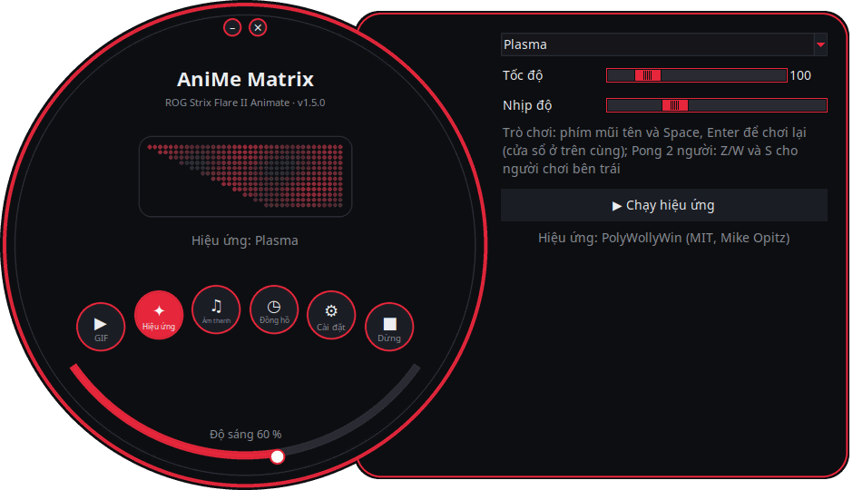
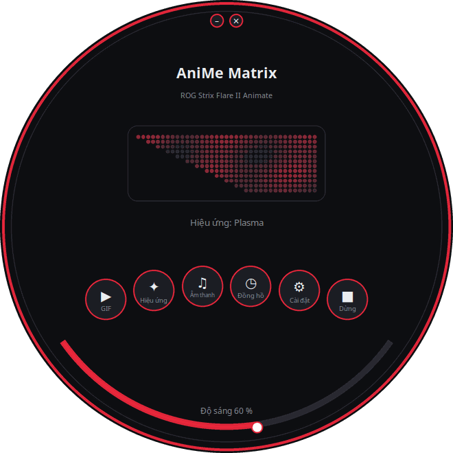
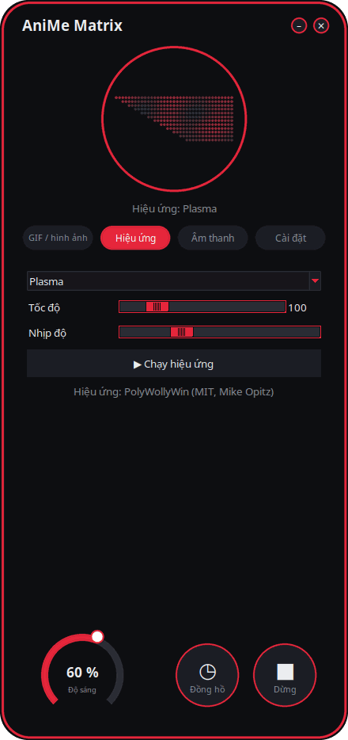
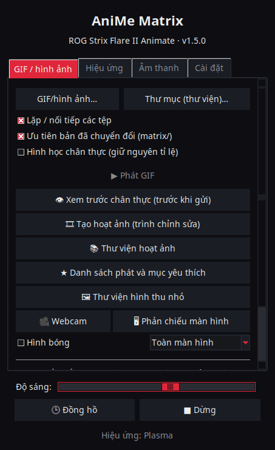
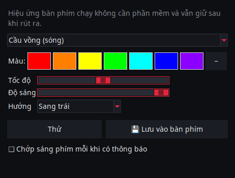
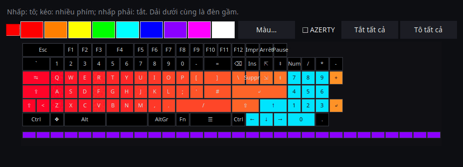

<p align="center">
  
</p>

# AniMe Matrix cho Linux — ROG Strix Flare II Animate

[](https://github.com/AntiCitoyen/Anticitoyen-ROG-flare2-anime-matrix/releases/latest)
[](https://github.com/AntiCitoyen/Anticitoyen-ROG-flare2-anime-matrix/actions/workflows/ci.yml)
[](../../LICENSE)
[](https://buymeacoffee.com/anticitoyen)

Điều khiển màn hình **AniMe Matrix** (312 mini-LED) của bàn phím **ASUS ROG Strix Flare II Animate** trên Linux, không cần Armoury Crate hay Windows: GIF và thư viện ảnh, đồng hồ, hiệu ứng và trình hiển thị âm thanh, trò chơi, giám sát hệ thống, thông báo màn hình nền, lên lịch theo khung giờ, trình chỉnh sửa hoạt ảnh, thư viện dùng chung, màu bàn phím đồng bộ.

<div align="center">

[🇫🇷 Français](../../README.md) · [🇬🇧 English](README.en.md) · [🇪🇸 Español](README.es.md) · [🇩🇪 Deutsch](README.de.md) · [🇮🇹 Italiano](README.it.md) · [🇧🇷 Português](README.pt-BR.md) · [🇳🇱 Nederlands](README.nl.md) · [🇵🇱 Polski](README.pl.md) · [🇷🇺 Русский](README.ru.md) · [🇺🇦 Українська](README.uk.md) · [🇹🇷 Türkçe](README.tr.md) · [🇸🇦 العربية](README.ar.md) · [🇮🇳 हिन्दी](README.hi.md) · [🇨🇳 简体中文](README.zh-CN.md) · [🇹🇼 繁體中文](README.zh-TW.md) · [🇯🇵 日本語](README.ja.md) · [🇰🇷 한국어](README.ko.md) · **🇻🇳 Tiếng Việt** · [🇮🇩 Bahasa Indonesia](README.id.md)

</div>

<p align="center"><br><em>Mặt số + ngăn kéo (giao diện mặc định)</em></p>

| Mặt số | Bo tròn | Cổ điển |
|:---:|:---:|:---:|
|  |  |  |

<p align="center"></p>

---

## Mục lục

- [Dự án này làm gì](#projet)
- [Phần cứng được hỗ trợ](#materiel)
- [Cài đặt](#installation)
- [Sử dụng](#utilisation)
- [Chuẩn bị GIF tốt](#gif)
- [Cách hoạt động](#fonctionnement)
- [Khắc phục sự cố](#depannage)
- [Cấu trúc kho mã nguồn](#depot)
- [Xây dựng các gói](#deb)
- [Ghi nhận](#credits)
- [Giấy phép](#licence)
- [Ủng hộ dự án](#soutien)

---

<a id="projet"></a>

## Dự án này làm gì

ASUS chỉ cung cấp màn hình AniMe Matrix của bàn phím này trên Windows (Armoury Crate). Dự án này giao tiếp trực tiếp với bàn phím qua USB HID và mang lại:

**Hiển thị**
- **GIF, hình ảnh và video**: một tệp, một số tệp đã chọn, hoặc cả một thư mục dưới dạng thư viện ảnh, có thể kéo thả vào cửa sổ; video (MP4, WebM, MKV…) được phát bằng ffmpeg; thư viện hình thu nhỏ; các khung hình đã chuyển đổi được lưu trong bộ nhớ đệm (một thư viện gồm 400 GIF chỉ chiếm khoảng 25 MB bộ nhớ).
- **Đồng hồ**: mặt số kiểu số, kiểu kim, nhị phân, bằng chữ (tiếng Pháp, tiếng Anh, tiếng Đức, tiếng Tây Ban Nha, tiếng Ý, tiếng Bồ Đào Nha, tiếng Hà Lan) hoặc cách điệu.
- **Hiệu ứng động** (mưa kiểu Ma Trận, plasma, lửa, ngôi sao, pháo hoa, sét, metaball, sóng…) và **7 bộ hiển thị âm thanh** phản ứng theo âm thanh mà máy tính phát ra.
- **Chữ**: thông điệp của bạn, với mọi hệ chữ viết (chữ có dấu, Kirin, Ả Rập, Hindi, Trung, Nhật, Hàn…), chạy sang trái, sang phải, lên trên, xuống dưới, hoặc đứng yên.
- **Webcam** (hình ảnh hoặc hình bóng) và **phản chiếu màn hình** (toàn màn hình, quanh con trỏ chuột hoặc cửa sổ đang hoạt động).
- **Giám sát hệ thống**: CPU, RAM, GPU, nhiệt độ, tốc độ mạng và giờ, dưới dạng đồng hồ đo.
- **Bài hát đang phát**: khi đổi bài, "NGHỆ SĨ - TÊN BÀI" chạy chữ một lần rồi chuyển sang bộ hiển thị (Spotify, VLC, Rhythmbox, trình duyệt… qua MPRIS).
- **Thông báo màn hình nền**: "ỨNG DỤNG : TIÊU ĐỀ" hiện chồng lên rồi việc phát tiếp tục (mặc định tắt, có danh sách ứng dụng được phép).
- **Trò chơi** chơi được bằng bàn phím: Rắn, Pong (một hoặc hai người), Tetris, phá gạch, Invaders, Flappy, có lưu kỷ lục.
- **Đèn báo**: các khối sáng nhỏ khi micro bị tắt hoặc đang được dùng, khi webcam đang bật, khi OBS đang phát trực tiếp hoặc ghi hình.
- **Bộ nhớ bàn phím**: hoạt ảnh (GIF, hình ảnh) lưu trong bàn phím chạy không cần phần mềm nào, ngay khi cắm vào, kể cả trên máy tính khác; độ sáng điều chỉnh được (thẻ GIF, `animematrix-ctl memoire`). Cũng có thể chọn 6 hoạt ảnh có sẵn (KO, Thiên thạch, Mắt, Love, Halloween, Khởi động): `animematrix-ctl clavier 1`…`6`.

**Tạo**
- **Trình chỉnh sửa hoạt ảnh** từng khung hình, trên đúng hình học của màn hình: 3 mức, dải khung hình, lớp mờ tham chiếu, dịch chuyển, sao chép-dán, xem trước, gửi tới bàn phím, xuất GIF.
- **Thư viện hoạt ảnh** dùng chung: duyệt, phát, thêm vào thư viện của mình, chia sẻ hoạt ảnh của riêng mình.
- **Chuyển đổi thông minh** cho GIF: cắt theo chủ thể, chủ thể sáng trên nền đen, tăng cường đường viền, 3 mức.
- **Xem trước chân thực** trước khi gửi: mô phỏng hiển thị của màn hình (bố cục thật, quầng sáng giữa các LED).
- **Hiệu ứng dạng tiện ích mở rộng**: một tệp Python đặt trong thư mục sẽ thêm một hiệu ứng (xem [docs/EXTENSIONS.md](../EXTENSIONS.md)).

**Tự động hóa**
- **Dịch vụ nền `animematrixd`**: chủ sở hữu duy nhất của màn hình, tiếp tục hiển thị khi đóng trình khởi chạy; lệnh `animematrix-ctl` và API HTTP nội bộ tùy chọn.
- **Lên lịch theo khung giờ**: các khung giờ (bao gồm cả ban đêm) với đồng hồ, thư viện ảnh, giám sát, bài hát đang phát, một hiệu ứng, một danh sách phát, hoặc tắt màn hình; màn hình tự tắt khi phiên bị khóa, khi ở chế độ chờ hoặc khi một ứng dụng đang toàn màn hình.
- **Hồ sơ theo ứng dụng**: nội dung riêng cho một trò chơi hoặc ứng dụng khi nó ở phía trước (nút *Phát hiện*).
- **Danh sách phát và mục yêu thích**: GIF, hiệu ứng, đồng hồ… mỗi mục trong thời lượng của nó, phát lặp lại; cũng có trong biểu tượng khay hệ thống và dòng lệnh.
- **Điều khiển từ xa qua web**: một trang để điều khiển màn hình từ điện thoại trong mạng nội bộ (mã QR, mã truy cập).
- **Báo khi lệnh dài kết thúc**: trong terminal, "Xong: make 2 min 05" hiện ra khi một lệnh chạy lâu kết thúc.
- **Màu và hiệu ứng phím**, không cần OpenRGB: cầu vồng, tĩnh, nhịp thở, chu kỳ màu, phản ứng, gợn sóng, đêm đầy sao, cát lún, dòng chảy, mưa — do chính bàn phím chạy và vẫn giữ sau khi rút ra; hoặc màu chủ đề, nhịp theo màn hình.
- **Biểu tượng khay hệ thống**: menu nhanh (chế độ, độ sáng).

**Tiện lợi**
- **4 giao diện** (*Mặt số + ngăn kéo* mặc định, *Mặt số*, *Bo tròn*, *Cổ điển*) với **xem trước trực tiếp 312 LED**, **11 giao diện màu** (5 kiểu ROG, 5 kiểu hồng, hệ thống) và **19 ngôn ngữ**.
- **X11 và Wayland**: phản ứng theo bàn phím qua evdev, đọc cửa sổ đang hoạt động từ Sway, Hyprland, KDE (kdotool) hoặc GNOME (tiện ích mở rộng *Window Calls*); phản chiếu màn hình qua cổng màn hình nền (màn hình hoặc cửa sổ, lựa chọn được ghi nhớ).
- **Cập nhật tích hợp**: trình khởi chạy tải bản phát hành mới nhất, kiểm tra vân tay SHA-256 rồi cài đặt (cần mật khẩu quản trị); hoặc `apt upgrade` với kho APT.

<a id="materiel"></a>

## Phần cứng được hỗ trợ

| Thiết bị | USB | Trạng thái |
|---|---|---|
| ASUS ROG Strix Flare II Animate | `0b05:19fc` | được hỗ trợ (HID, interface 4, usage page `0xFF02`) |
| Màn hình AniMe Matrix trên laptop ROG (G14, G16…) | khác nhau | **thử nghiệm** qua `asusctl`, chưa được thử nghiệm trên phần cứng thật (xem [Sử dụng](#utilisation)) |

Đã thử nghiệm trên Ubuntu 26.04 (X11, PipeWire, Cinnamon). Bất kỳ bản phân phối nào có Python ≥ 3.10, hidapi, Tk và systemd đều phù hợp; trên Wayland, trình khởi chạy chạy qua XWayland.

<a id="installation"></a>

## Cài đặt

### Kho APT (Debian, Ubuntu, Mint, Pop!_OS…) — cập nhật bằng `apt upgrade`

```bash
curl -fsSL https://anticitoyen.github.io/Anticitoyen-ROG-flare2-anime-matrix/animematrix.gpg \
  | sudo tee /usr/share/keyrings/animematrix.gpg >/dev/null
echo "deb [signed-by=/usr/share/keyrings/animematrix.gpg] https://anticitoyen.github.io/Anticitoyen-ROG-flare2-anime-matrix stable main" \
  | sudo tee /etc/apt/sources.list.d/animematrix.list
sudo apt update && sudo apt install anticitoyen-rog-flare2-anime-matrix
```

Sau đó **rút phích cắm rồi cắm lại bàn phím** (quy tắc udev cấp quyền truy cập cho người dùng đang đăng nhập) và khởi chạy **AniMe Matrix** từ menu.

### Định dạng khác (trang [Releases](https://github.com/AntiCitoyen/Anticitoyen-ROG-flare2-anime-matrix/releases/latest))

| Hệ thống | Tệp | Cài đặt |
|---|---|---|
| Debian, Ubuntu… | `anticitoyen-rog-flare2-anime-matrix_<version>_all.deb` | `sudo apt install ./anticitoyen-rog-flare2-anime-matrix_*_all.deb` |
| Fedora, openSUSE… | `anticitoyen-rog-flare2-anime-matrix-<version>-1.noarch.rpm` | `sudo dnf install ./anticitoyen-rog-flare2-anime-matrix-*.noarch.rpm` |
| Arch, Manjaro… | `anticitoyen-rog-flare2-anime-matrix-<version>-1-any.pkg.tar.zst` | `sudo pacman -U anticitoyen-rog-flare2-anime-matrix-*.pkg.tar.zst` |
| Mọi bản phân phối (Flatpak) | `AniMeMatrix-<version>.flatpak` | `flatpak install --user AniMeMatrix-*.flatpak` (cũng cần cài quy tắc udev bên dưới ; không có bộ hiển thị âm thanh) |
| AUR | `aur-<version>.tar.gz` | PKGBUILD và .SRCINFO: `tar xf aur-*.tar.gz && cd anticitoyen-rog-flare2-anime-matrix && makepkg -si` |
| Copr | `anticitoyen-rog-flare2-anime-matrix-<version>-1.<fc>.src.rpm` | RPM nguồn: `rpmbuild --rebuild anticitoyen-rog-flare2-anime-matrix-*.src.rpm`, hoặc tải lên một dự án Copr |
| Flathub | `flathub-<version>.tar.gz` | manifest cố định theo phiên bản này và `python3-modules.json`: gửi lên Flathub hoặc `flatpak-builder` |
| Weblate | `translations-<version>.zip` | tệp bản dịch (`locale/*.json`, gốc `_source.json`) để nhập vào Weblate |

Gói này cài đặt:

| Thành phần | Vị trí |
|---|---|
| Chương trình | `/usr/share/anticitoyen-rog-flare2-anime-matrix/` |
| Lệnh | `animematrix`, `animematrixd`, `animematrix-ctl`, `animematrix-bascule`, `animematrix-animation`, `animematrix-apercu`, `animematrix-convertir`, `animematrix-effet`, `animematrix-galerie`, `animematrix-horloge`, `animematrix-dessin`, `animematrix-tray`, `animematrix-memoire` |
| Dịch vụ người dùng | `/usr/lib/systemd/user/animematrixd.service` (kích hoạt cho mọi phiên) |
| Quy tắc udev | `/usr/lib/udev/rules.d/72-rog-flare2-animate.rules` |
| Menu và biểu tượng | `animematrix.desktop`, biểu tượng `animematrix` |

### Từ mã nguồn

```bash
git clone https://github.com/AntiCitoyen/Anticitoyen-ROG-flare2-anime-matrix.git
cd Anticitoyen-ROG-flare2-anime-matrix
python3 -m venv .venv
.venv/bin/pip install hidapi pillow numpy pynput python-xlib
# truy cập bàn phím không cần root
sudo cp packaging/72-rog-flare2-animate.rules /etc/udev/rules.d/
sudo udevadm control --reload-rules && sudo udevadm trigger
# sau đó rút và cắm lại bàn phím
.venv/bin/python rog_flare2_launcher.py
```

Các công cụ hệ thống hữu ích: `imagemagick` (chuyển đổi cơ bản), `pulseaudio-utils` (`parec`, cho âm thanh), `zenity` (hộp thoại chọn tệp), `libnotify-bin` (thông báo), `python3-gi` và `gir1.2-ayatanaappindicator3-0.1` (biểu tượng khay hệ thống), `ffmpeg` (video, webcam, phản chiếu màn hình), `python3-evdev` (phản ứng theo bàn phím trên Wayland), `x11-utils` (cửa sổ đang hoạt động trên X11), `python3-qrcode` (mã QR của điều khiển từ xa), `tkdnd` (kéo thả).

<a id="utilisation"></a>

## Sử dụng

### Trình khởi chạy

`animematrix` (hoặc mục **AniMe Matrix** trong menu).

Trong các giao diện tròn, các nút tròn mở khối *GIF*, *Hiệu ứng*, *Âm thanh* và *Cài đặt* (trong ngăn kéo hoặc trong vòng tròn); *Đồng hồ* và *Dừng* tác động ngay lập tức; cung ở phía dưới điều chỉnh độ sáng; kéo phần nền để di chuyển cửa sổ; các nút nhỏ phía trên để thu nhỏ hoặc đóng. Hình dạng tròn sử dụng tiện ích mở rộng X11 SHAPE (gói `python3-xlib`); nếu không có, cùng một giao diện sẽ hiển thị trong một cửa sổ hình chữ nhật.

- **GIF / hình ảnh**: *GIF/hình ảnh…* hoặc *Thư mục (thư viện)…* (hoặc kéo thả vào cửa sổ); *Hình học chân thực* giữ nguyên tỉ lệ (góc bị cắt thay vì hình ảnh bị kéo giãn); *👁 Xem trước chân thực (trước khi gửi)* cho xem kết quả mà không gửi gì cả; *🎞 Tạo hoạt ảnh (trình chỉnh sửa)*; *📚 Thư viện hoạt ảnh*; *★ Danh sách phát và mục yêu thích*; *🖼 Thư viện hình thu nhỏ* (nhấp: phát, nhấp phải: yêu thích); *🎥 Webcam* và *🖥 Phản chiếu màn hình*; *Chuyển đổi thông minh* để chuyển đổi GIF.
- **Hiệu ứng** và **Âm thanh**: chọn, điều chỉnh, *▶ Chạy hiệu ứng*. Các thanh trượt tác động trực tiếp; *Nhịp độ* làm toàn bộ hoạt ảnh nhanh hơn hoặc chậm hơn. Hiệu ứng *Chữ* nhận thông điệp của bạn và hướng chạy chữ. Trò chơi được chơi bằng phím mũi tên, Space và Enter, với cửa sổ trình khởi chạy ở phía trước; Pong hai người: Z/W và S cho người chơi bên trái.
- **Độ sáng**, **🕒 Đồng hồ**, **■ Dừng** (xóa màn hình) có ở mọi tab.
- **Cài đặt**: khi khởi động phiên (Thư viện GIF, Đồng hồ, Lần phát gần nhất hoặc Không có), mặt đồng hồ, ngôn ngữ, giao diện màu, giao diện, thông báo màn hình nền, màu bàn phím, *Lịch hẹn…* (điều kiện kích hoạt, hồ sơ theo ứng dụng, khung giờ), *Đèn báo…*, *Điều khiển từ xa qua web…*, biểu tượng khay hệ thống, báo khi lệnh dài kết thúc, thư mục tiện ích mở rộng, cập nhật.

**Đóng trình khởi chạy không làm gián đoạn gì cả**: dịch vụ nền `animematrixd` vẫn tiếp tục hiển thị. *■ Dừng* sẽ tắt màn hình.

### Dịch vụ nền và dòng lệnh

```bash
animematrix-ctl etat                               # nội dung đang hiển thị
animematrix-ctl gif ~/Images/AniMe-Matrix --fidele # thư viện (thư mục hoặc tệp)
animematrix-ctl effet "Plasma" --param speed=250   # hiệu ứng và thiết lập
animematrix-ctl horloge
animematrix-ctl texte "Bonjour"
animematrix-ctl effet "Text" --param message="Salut" --param direction=haut
animematrix-ctl liste "Soirée"                     # danh sách phát (không có tên: liệt kê)
animematrix-ctl favori 2                           # mục yêu thích số 2 (không có số: liệt kê)
animematrix-ctl notifier "Café prêt" --duree 5     # hiện chồng rồi quay lại
animematrix-ctl memoire anim.gif                   # lưu vào bàn phím (tối đa 196 khung hình)
animematrix-ctl clavier                            # hiện hoạt ảnh đã lưu
animematrix-ctl luminosite 60
animematrix-ctl stop
```

| Lệnh | Vai trò |
|---|---|
| `animematrix-bascule [gif\|horloge\|lecture\|off\|etat]` | chuyển đổi (cũng có trong menu chuột phải của biểu tượng); chế độ được chọn cũng là chế độ khi khởi động phiên |
| `animematrixd --http 8765` | dịch vụ nền có API HTTP nội bộ (`POST http://127.0.0.1:8765/api`, `Content-Type: application/json`, cùng định dạng JSON như socket) |
| `animematrix-animation [fichier.gif]` | trình chỉnh sửa hoạt ảnh |
| `animematrix-apercu fichier.gif -o apercu.gif` | xem trước chân thực của một GIF (tệp) |
| `animematrix-convertir dossier/ [--fidele] [--classique]` | chuyển đổi GIF cho ma trận (trong `dossier/matrix/`) |
| `animematrix-effet --liste` | liệt kê các hiệu ứng và bộ hiển thị |
| `animematrix-dessin` | trình chỉnh sửa từng LED (trả quyền điều khiển lại cho dịch vụ nền khi đóng) |
| `animematrix-ctl sauvegarde reglages.zip`, `animematrix-ctl restaurer reglages.zip` | xuất hoặc khôi phục mọi cài đặt (cả trong *Cài đặt*); không gồm mã thông báo và mật khẩu OBS trừ khi dùng `--secrets` |

### Âm thanh

Các bộ hiển thị lắng nghe **bộ giám sát của thiết bị âm thanh ra mặc định** thông qua `parec` (PipeWire hoặc PulseAudio): chúng phản ứng theo âm thanh mà máy tính đang phát, không phải micro.

### Hiệu ứng "Keyboard React"

Hiệu ứng này làm màn hình sáng theo nhịp gõ phím, miễn là hiệu ứng đang chạy: trên X11 nhờ `pynput`, trên Wayland bằng cách đọc bàn phím trong `/dev/input` (`python3-evdev`). Trên Wayland, nếu hiệu ứng vẫn ở chế độ demo, hãy cho phép đọc riêng bàn phím ROG:

```bash
sudo cp /usr/share/anticitoyen-rog-flare2-anime-matrix/udev/73-rog-flare2-animate-touches.rules /etc/udev/rules.d/
sudo udevadm control --reload-rules && sudo udevadm trigger
```

### Đèn báo

*Cài đặt* → *Đèn báo (micro, webcam, OBS)…*: một khối 2 × 2 LED sáng lên ở góc trên bên trái màn hình, đè lên nội dung đang phát (1: micro bị tắt hoặc đang được dùng, 2: webcam đang được dùng, 3: OBS đang phát trực tiếp hoặc ghi hình), và mỗi thay đổi có thể được báo bằng chữ chạy. OBS: bật máy chủ WebSocket (*Công cụ* → *Cài đặt máy chủ WebSocket*) rồi nhập cổng và mật khẩu của nó.

### Điều khiển từ xa qua web

*Cài đặt* → *Điều khiển từ xa qua web…*: đánh dấu *Bật điều khiển từ xa qua web*, rồi mở địa chỉ (hoặc quét mã QR) trên điện thoại cùng mạng. Trang hiển thị màn hình trực tiếp và cho phép điều khiển đồng hồ, thư viện ảnh, hiệu ứng, mục yêu thích, danh sách, độ sáng và thông điệp. Địa chỉ chứa mã truy cập: đừng chia sẻ nó, hãy đổi bằng *Mã truy cập mới*; trang không được mã hóa (HTTP): chỉ dùng trong mạng tin cậy.

### Báo khi lệnh dài kết thúc

*Cài đặt* → *Báo khi lệnh dài kết thúc (terminal)* thêm một dòng vào `~/.bashrc` (và `~/.zshrc`): mọi lệnh chạy quá 30 giây sẽ hiển thị khi kết thúc "Xong: make 2 min 05" hoặc "Thất bại (2): …". Ngưỡng: `ANIMEMATRIX_FIN_SECONDES`; các lệnh tương tác (trình soạn thảo, `ssh`, `less`…) được bỏ qua.

### Màu bàn phím

*Cài đặt* → *🌈 Màu bàn phím…*: hiệu ứng (cầu vồng, tĩnh, nhịp thở, chu kỳ màu, phản ứng, gợn sóng, đêm đầy sao, cát lún, dòng chảy, mưa), màu, tốc độ, độ sáng, hướng. *Thử* áp dụng ngay, *Lưu vào bàn phím* giữ lại sau khi rút ra. *Màu chủ đề* và *Nhịp theo màn hình* do dịch vụ gửi từng phím; khi thoát, hiệu ứng đã lưu trở lại. Dòng lệnh: `animematrix-ctl rgb arc-en-ciel --vitesse 70`, `animematrix-ctl rgb statique --couleur "#ff0000"`. Thêm hai chế độ phần mềm: *Hình màn hình* (phím phản chiếu màn hình, phóng to) và *Phổ âm thanh* (mỗi cột một thanh). Mỗi khung giờ và mỗi hồ sơ ứng dụng cũng có thể chọn màu phím riêng (*Lịch hẹn…*). *Từng phím*: mỗi phím một màu, tô bằng chuột trên sơ đồ bàn phím (AZERTY hoặc QWERTY). *Gõ phím phát sáng*: mỗi phím bạn nhấn sẽ sáng lên rồi mờ dần. Đèn báo micro, webcam và OBS cũng có thể làm sáng F1, F2 và F3, và mỗi thông báo làm các phím chớp sáng.

<p align="center"> </p>

### Laptop ROG (thử nghiệm)

Ghi `portable-asusctl` vào `~/.config/rog-flare2/materiel` rồi khởi động lại dịch vụ nền: các khung dữ liệu sẽ đi qua `asusctl anime image` (tối đa 5 khung hình mỗi giây). Chưa được thử nghiệm trên laptop thật: rất hoan nghênh phản hồi qua các ticket.

<a id="gif"></a>

## Chuẩn bị GIF tốt

Màn hình không phải là một hình chữ nhật: 24 hàng so le, từ 19 LED ở trên xuống 7 LED ở dưới (cạnh phải thẳng đứng, cạnh trái theo đường chéo), 3 mức xám thực sự khác biệt, có quầng sáng giữa các LED lân cận. Hình bóng, biểu tượng, chữ ngắn và chuyển động chậm hiển thị tốt; ảnh chụp và video thì không.

Hướng dẫn đầy đủ (khung vẽ, các mức, tốc độ khung hình, chuyển đổi, hình học chân thực): **[docs/GUIDE-GIF.md](../GUIDE-GIF.md)**.

<a id="fonctionnement"></a>

## Cách hoạt động

- **Truyền dữ liệu**: hidapi mở interface HID số 4 của bàn phím và ghi vào đó các khung dữ liệu **1024 byte**; bàn phím gửi trả lại từng khung.
- **Khung dữ liệu**: `60 81 00 00` + **312 byte** (một giá trị độ sáng 0–255 cho mỗi LED, theo thứ tự phần cứng) + các byte 0 cho đến đủ 1024.
- **Hình học**: 24 hàng so le (hàng r bao phủ các cột (r+1)//2 đến 18), hoặc tương đương là 12 hàng logic từ 37 → 15 cột (mô hình của PolyWollyWin); cả hai cách ánh xạ đã được kiểm chứng là giống hệt nhau trên toàn bộ 312 LED.
- **Dịch vụ nền**: `animematrixd` là chương trình duy nhất giữ quyền với bàn phím; phát cơ bản và hiện chồng (thông báo); socket JSON `$XDG_RUNTIME_DIR/animematrix.sock`; tự động kết nối lại bàn phím.
- **Hoạt ảnh**: máy chủ gửi các khung hình lần lượt (~30 khung hình/giây đối với hiệu ứng); bộ nhớ trong của bàn phím không được sử dụng (nghiên cứu: [docs/RECHERCHE-MEMOIRE.md](../RECHERCHE-MEMOIRE.md)).

Các ghi chú reverse engineering gốc nằm trong **[docs/PROTOCOL.md](../PROTOCOL.md)**; các bản chụp `*.cap` và công cụ `parse_usbpcap.py` / `rog_flare2_replay_capture.py` vẫn còn trong kho mã nguồn.

⚠️ Đừng gửi tới bàn phím các gói tin của AniMe Matrix dành cho laptop (`0x5E …`, `0xEC …`): đó không phải giao thức đúng và có thể làm treo bàn phím (hãy rút rồi cắm lại, hoặc giữ **Fn + Esc** trong 10–15 giây).

<a id="depannage"></a>

## Khắc phục sự cố

| Triệu chứng | Nguyên nhân có thể | Giải pháp |
|---|---|---|
| `interface 4 not found` | không nhận diện được bàn phím hoặc thiếu quyền | `lsusb \| grep 0b05:19fc` ; đã cài quy tắc udev chưa? rút rồi cắm lại |
| `Permission denied` / `open failed` | quy tắc udev chưa được áp dụng | `sudo udevadm control --reload-rules && sudo udevadm trigger`, sau đó cắm lại |
| "Không kết nối được dịch vụ animematrixd" | dịch vụ nền đã dừng | `systemctl --user restart animematrixd.service` hoặc `animematrixd &` |
| Màn hình không thay đổi | một chương trình khác đang ghi vào bàn phím | đóng các script cũ ; `animematrix-ctl etat` |
| Bộ hiển thị vẫn ở chế độ demo | không có `parec` hoặc không có âm thanh | cài `pulseaudio-utils`, phát âm thanh |
| "Keyboard React" không phản ứng | thiếu `pynput` (X11) hoặc `python3-evdev` (Wayland), hoặc không đọc được bàn phím | cài gói tương ứng ; trên Wayland, dùng quy tắc udev ở phần [Keyboard React](#utilisation) |
| Webcam, video hoặc phản chiếu màn hình không hoạt động | thiếu `ffmpeg` | `sudo apt install ffmpeg` ; trên Wayland, phản chiếu màn hình đi qua portal (`gstreamer1.0-pipewire`) |
| Hồ sơ theo ứng dụng hoặc phát hiện toàn màn hình không có tác dụng trên Wayland | compositor không cho biết cửa sổ đang hoạt động | GNOME: tiện ích mở rộng *Window Calls* ; KDE: `kdotool` ; Sway và Hyprland: không cần làm gì |
| Cửa sổ tròn hiển thị thành hình chữ nhật | thiếu tiện ích mở rộng SHAPE hoặc `python3-xlib` | `sudo apt install python3-xlib`, hoặc *Cài đặt* → *Giao diện:* → *Cổ điển* |
| Nhật ký của dịch vụ nền | — | `journalctl --user -u animematrixd.service -f` |

<a id="depot"></a>

## Cấu trúc kho mã nguồn

| Tệp | Vai trò |
|---|---|
| `rog_flare2_launcher.py` | trình khởi chạy đồ họa (Tk) |
| `rog_flare2_ui_ronde.py`, `rog_flare2_themes.py` | giao diện tròn, giao diện màu |
| `rog_flare2_i18n.py`, `locale/` | bản dịch (19 ngôn ngữ ; `locale/_cles.json` = văn bản cần dịch ; [docs/TRADUIRE.md](../TRADUIRE.md)) |
| `rog_flare2_demon.py`, `rog_flare2_ctl.py` | dịch vụ nền `animematrixd`, ứng dụng khách và lệnh `animematrix-ctl` |
| `rog_flare2_core.py` | phát GIF theo luồng, bộ nhớ đệm khung hình, đồng hồ, hình học |
| `rog_flare2_texte.py`, `rog_flare2_horloges.py` | chữ cho mọi hệ chữ viết, hiệu ứng *Chữ*, mặt đồng hồ |
| `rog_flare2_listes.py`, `rog_flare2_vignettes.py` | danh sách phát, mục yêu thích, thư viện hình thu nhỏ, kéo thả |
| `rog_flare2_video.py`, `rog_flare2_voyants.py`, `rog_flare2_telecommande.py` | video, webcam, phản chiếu màn hình ; đèn báo ; điều khiển từ xa qua web |
| `rog_flare2_touches.py`, `rog_flare2_fenetre.py`, `rog_flare2_fin.py`, `rog_flare2_flatpak.py` | phím và cửa sổ đang hoạt động (X11, Wayland), báo khi lệnh dài kết thúc, Flatpak |
| `rog_flare2_effets.py`, `polywollywin/` | hiệu ứng và bộ hiển thị âm thanh (engine PolyWollyWin, MIT), tiện ích mở rộng |
| `rog_flare2_infos.py`, `rog_flare2_mpris.py`, `rog_flare2_jeux.py` | giám sát hệ thống, bài hát đang phát, trò chơi |
| `rog_flare2_notifs.py`, `rog_flare2_programme.py`, `rog_flare2_ui_programme.py` | thông báo, lên lịch theo khung giờ và các điều kiện kích hoạt |
| `rog_flare2_rgb.py`, `rog_flare2_tray.py`, `rog_flare2_portable.py` | màu và hiệu ứng phím, biểu tượng khay hệ thống, laptop (thử nghiệm) |
| `rog_flare2_animation.py`, `rog_flare2_simulateur.py`, `rog_flare2_convertir.py` | trình chỉnh sửa hoạt ảnh, trình mô phỏng, chuyển đổi |
| `rog_flare2_bibliotheque.py`, `bibliotheque/` | thư viện hoạt ảnh (danh mục, GIF CC0) |
| `rog_flare2_maj.py` | cập nhật từ các bản phát hành |
| `rog_flare2_matrix_paint.py`, `rog_flare2_clock_v3.py`, `rog_flare2_folder_player.py` | truyền dữ liệu HID và trình chỉnh sửa LED, đồng hồ, thư viện ảnh (công cụ gốc) |
| `parse_usbpcap.py`, `rog_flare2_replay_capture.py`, `*.cap` | reverse engineering |
| `examples/effets/` | ví dụ tiện ích mở rộng |
| `tests/` | các bài kiểm thử (bao gồm giao diện qua thao tác nhấp chuột thật) |
| `systemd/`, `packaging/` | dịch vụ người dùng ; .deb, RPM, Arch, Flatpak, kho APT |
| `docs/` | hướng dẫn GIF, tiện ích mở rộng, giao thức, nghiên cứu, ảnh chụp màn hình, README đã dịch |

<a id="deb"></a>

## Xây dựng các gói

```bash
packaging/build-deb.sh
# → dist/anticitoyen-rog-flare2-anime-matrix_<version>_all.deb
```

`packaging/install.sh` cài đặt dự án vào bất kỳ cấu trúc thư mục nào; nó được dùng cho .deb, RPM (`packaging/rpm/`), gói Arch (`packaging/aur/`) và Flatpak (`packaging/flathub/`). Mỗi khi có bản phát hành mới, GitHub sẽ tự động xây dựng RPM, gói Arch và Flatpak, đồng thời cập nhật kho APT đã ký. Số phiên bản được đọc từ `rog_flare2_core.py` (`VERSION`). Kiểm thử: `python -m pytest tests`.

<a id="credits"></a>

## Ghi nhận

- **NicRoss512** — reverse engineering giao thức, đồng hồ và trình chỉnh sửa gốc: [ASUS-ROG-Strix-Flare-II-Animate-AniMe-Matrix-Protocol](https://github.com/NicRoss512/ASUS-ROG-Strix-Flare-II-Animate-AniMe-Matrix-Protocol). Kho mã nguồn này bắt nguồn từ đó; lịch sử commit được giữ nguyên.
- **Mike Opitz** — [PolyWollyWin](https://github.com/MikeOpitz99/PolyWollyWin) (MIT), bộ điều khiển Windows mà engine hiệu ứng và bộ hiển thị âm thanh được lấy lại ở đây.
- **Yoshi Walsh** — [Mastering the AniMe Matrix](https://blog.yoshiwalsh.me/asus-anime-matrix/), về hành vi của LED (quầng sáng, các mức cảm nhận, tốc độ khung hình).
- **asus-linux** — [asusctl](https://gitlab.com/asus-linux/asusctl), được dùng cho màn hình của laptop.

Dự án độc lập, không liên kết với ASUS. "ROG", "AniMe Matrix" và "Armoury Crate" là thương hiệu của ASUSTeK.

<a id="licence"></a>

## Giấy phép

[MIT](../../LICENSE) cho mã nguồn trong kho này ; các hoạt ảnh trong `bibliotheque/` theo giấy phép CC0. `polywollywin/` vẫn giữ giấy phép MIT của tác giả gốc ([polywollywin/LICENSE](../../polywollywin/LICENSE)). Các tệp gốc của NicRoss512 (`rog_flare2_clock_v3.py`, `rog_flare2_matrix_paint.py`, `parse_usbpcap.py`, `rog_flare2_replay_capture.py`, `docs/PROTOCOL.md`, các bản chụp) được công bố mà không có giấy phép rõ ràng và vẫn thuộc về tác giả của chúng; chúng được phân phối lại kèm ghi công.

<a id="soutien"></a>

## Ủng hộ dự án

Nếu dự án này hữu ích với bạn, một ly cà phê sẽ giúp duy trì nó:

[](https://buymeacoffee.com/anticitoyen)

**https://buymeacoffee.com/anticitoyen** — liên kết này cũng có trong tab *Cài đặt* của trình khởi chạy.

Báo cáo lỗi, ý tưởng và hoạt ảnh muốn chia sẻ: [Issues](https://github.com/AntiCitoyen/Anticitoyen-ROG-flare2-anime-matrix/issues). Bản dịch: [docs/TRADUIRE.md](../TRADUIRE.md).
