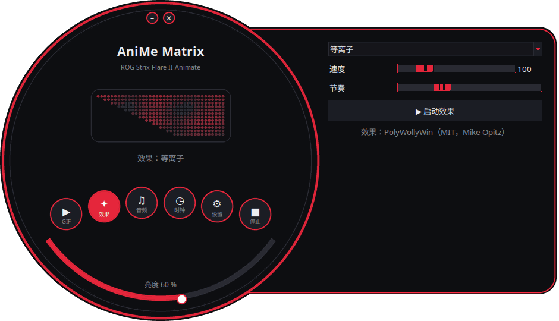
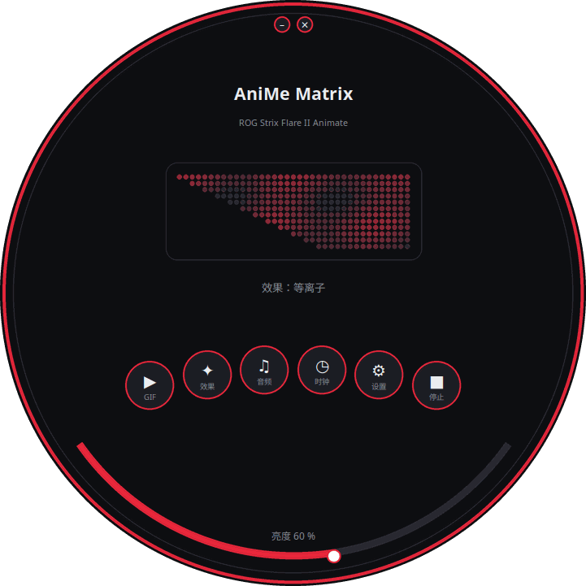
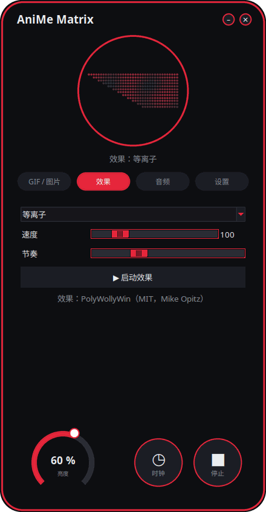
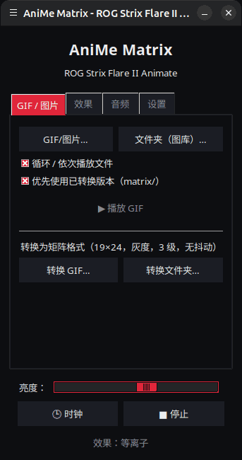

<p align="center">
  
</p>

# 面向 Linux 的 AniMe Matrix — ROG Strix Flare II Animate

[](https://github.com/AntiCitoyen/Anticitoyen-ROG-flare2-anime-matrix/releases/latest)
[](https://github.com/AntiCitoyen/Anticitoyen-ROG-flare2-anime-matrix/actions/workflows/ci.yml)
[](../../LICENSE)
[](https://buymeacoffee.com/anticitoyen)

在 Linux 下直接驱动 **ASUS ROG Strix Flare II Animate** 键盘的 **AniMe Matrix**（312 颗迷你 LED）屏幕，无需 Armoury Crate，也无需 Windows：GIF 与图库、时钟、动态效果与音频可视化、游戏、系统监视器、桌面通知、定时排程、动画编辑器、共享动画库、键盘颜色同步。

<div align="center">

[🇫🇷 Français](../../README.md) · [🇬🇧 English](README.en.md) · [🇪🇸 Español](README.es.md) · [🇩🇪 Deutsch](README.de.md) · [🇮🇹 Italiano](README.it.md) · [🇧🇷 Português](README.pt-BR.md) · [🇳🇱 Nederlands](README.nl.md) · [🇵🇱 Polski](README.pl.md) · [🇷🇺 Русский](README.ru.md) · [🇺🇦 Українська](README.uk.md) · [🇹🇷 Türkçe](README.tr.md) · [🇸🇦 العربية](README.ar.md) · [🇮🇳 हिन्दी](README.hi.md) · **🇨🇳 简体中文** · [🇹🇼 繁體中文](README.zh-TW.md) · [🇯🇵 日本語](README.ja.md) · [🇰🇷 한국어](README.ko.md) · [🇻🇳 Tiếng Việt](README.vi.md) · [🇮🇩 Bahasa Indonesia](README.id.md)

</div>

<p align="center"><br><em>表盘 + 抽屉（默认界面）</em></p>

| 表盘 | 圆角 | 经典 |
|:---:|:---:|:---:|
|  |  |  |

<p align="center"></p>

---

## 目录

- [项目简介](#projet)
- [支持的硬件](#materiel)
- [安装](#installation)
- [使用方法](#utilisation)
- [制作合适的 GIF](#gif)
- [工作原理](#fonctionnement)
- [故障排查](#depannage)
- [仓库结构](#depot)
- [构建软件包](#deb)
- [鸣谢](#credits)
- [许可证](#licence)
- [支持本项目](#soutien)

---

<a id="projet"></a>

## 项目简介

ASUS 仅在 Windows（通过 Armoury Crate）下为这款键盘提供 AniMe Matrix 屏幕的官方支持。本项目通过 USB HID 直接与键盘通信，提供：

**显示**
- **GIF、图片与视频**：单个文件、多选文件，或整个文件夹作为图库，也可直接拖放到窗口上；视频（MP4、WebM、MKV 等）通过 ffmpeg 播放；缩略图库；转换后的帧会被缓存（400 个 GIF 组成的图库运行时内存占用约 25 MB）。
- **时钟**：数字、指针、二进制、文字（法语、英语、德语、西班牙语、意大利语、葡萄牙语、荷兰语）或花式表盘。
- **动态效果**（矩阵雨、等离子、火焰、星空、烟花、闪电、融球、波浪……）和 **7 种音频可视化器**，随电脑播放的声音而变化。
- **文字**：你的消息，支持所有文字系统（带重音的字母、西里尔字母、阿拉伯文、印地文、中文、日文、韩文……），可向左、向右、向上、向下滚动或固定显示。
- **摄像头**（图像或剪影）与**屏幕镜像**（整个屏幕、鼠标周围或活动窗口）。
- **系统监视器**：以仪表盘形式显示 CPU、内存、GPU、温度、网络流量与时间。
- **当前播放曲目**：切换曲目时，「艺术家 - 标题」滚动播放一次，随后显示可视化效果（通过 MPRIS 支持 Spotify、VLC、Rhythmbox、浏览器等）。
- **桌面通知**：以「应用：标题」的形式叠加显示，随后恢复播放（默认关闭，可设置允许通知的应用列表）。
- **可玩的键盘游戏**：贪吃蛇、乒乓（单人或双人）、俄罗斯方块、打砖块、太空侵略者、Flappy，附带记录。
- **指示灯**：麦克风静音或正在使用、摄像头运行、OBS 直播或录制时，屏幕上会亮起小光块。
- **键盘内存**：保存在键盘中的动画（GIF、图片）插上即可播放，无需任何软件，换一台电脑也一样；亮度可调（GIF 选项卡，`animematrix-ctl memoire`）。

**创建**
- **逐帧动画编辑器**，基于屏幕的真实几何结构：3 级灰阶、时间轴、幽灵图层、平移、复制粘贴、预览、发送至键盘、导出 GIF。
- **共享动画库**：浏览、播放、加入图库、投稿自己的作品。
- **智能 GIF 转换**：按主体裁剪、在黑色背景上突出主体、加强轮廓、3 级灰阶。
- **真实预览**（发送前）：模拟屏幕渲染效果（真实排布、LED 间的光晕）。
- **扩展效果**：将一个 Python 文件放入指定文件夹即可新增一种效果（详见 [EXTENSIONS.md](../EXTENSIONS.md)）。

**自动化**
- **`animematrixd` 守护进程**：唯一的屏幕所有者，即使关闭启动器也会继续显示；提供 `animematrix-ctl` 命令与可选的本地 HTTP API。
- **定时排程**：按时间段（包括夜间）设置显示时钟、图库、监视器、当前播放曲目、某个效果、播放列表或熄屏；会话锁定、待机或有应用全屏时自动熄屏。
- **按应用配置**：某个游戏或应用位于前台时，显示其专属内容（*检测* 按钮）。
- **播放列表和收藏**：GIF、效果、时钟……各按设定的时长依次循环播放；也可在系统托盘图标和命令行中使用。
- **网页遥控**：通过一个网页，用局域网内的手机控制屏幕（二维码、令牌）。
- **长时间命令的结束**：在终端中，长时间运行的命令结束时显示「完成：make 2 min 05」。
- **按键颜色与效果**，无需 OpenRGB：彩虹、静态、呼吸、颜色循环、触发、涟漪、星空、流沙、电流、雨滴——由键盘自身运行，拔下后仍保留；或主题颜色、随屏幕脉动。
- **系统托盘图标**：快捷菜单（模式、亮度）。

**便捷**
- **4 种界面**（默认为 *表盘 + 抽屉*，另有 *表盘*、*圆角*、*经典*），带 **312 颗 LED 实时预览**、**11 套主题**（5 套 ROG 风格、5 套粉色系、1 套跟随系统）与 **19 种语言**。
- **X11 与 Wayland**：通过 evdev 响应键盘，活动窗口从 Sway、Hyprland、KDE（kdotool）或 GNOME（*Window Calls* 扩展）读取。
- **内置更新**：启动器下载最新 release，校验其 SHA-256 指纹后安装（需要管理员密码）；或通过 APT 仓库执行 `apt upgrade`。

<a id="materiel"></a>

## 支持的硬件

| 设备 | USB | 状态 |
|---|---|---|
| ASUS ROG Strix Flare II Animate | `0b05:19fc` | 已支持（HID，接口 4，usage page `0xFF02`） |
| ROG 笔记本电脑的 AniMe Matrix 屏幕（G14、G16 等） | 多种 | **实验性**，通过 `asusctl` 实现，未在实机上测试过（见[使用方法](#utilisation)） |

已在 Ubuntu 26.04（X11、PipeWire、Cinnamon）上测试通过。任何具备 Python ≥ 3.10、hidapi、Tk 和 systemd 的发行版理论上均可使用；在 Wayland 下，启动器通过 XWayland 运行。

<a id="installation"></a>

## 安装

### APT 仓库（Debian、Ubuntu、Mint、Pop!_OS 等）——用 `apt upgrade` 更新

```bash
curl -fsSL https://anticitoyen.github.io/Anticitoyen-ROG-flare2-anime-matrix/animematrix.gpg \
  | sudo tee /usr/share/keyrings/animematrix.gpg >/dev/null
echo "deb [signed-by=/usr/share/keyrings/animematrix.gpg] https://anticitoyen.github.io/Anticitoyen-ROG-flare2-anime-matrix stable main" \
  | sudo tee /etc/apt/sources.list.d/animematrix.list
sudo apt update && sudo apt install anticitoyen-rog-flare2-anime-matrix
```

然后**拔下键盘再重新插上**（udev 规则会为当前登录用户授予访问权限），从菜单启动 **AniMe Matrix**。

### 其他格式（见 [Releases](https://github.com/AntiCitoyen/Anticitoyen-ROG-flare2-anime-matrix/releases/latest) 页面）

| 系统 | 文件 | 安装方式 |
|---|---|---|
| Debian、Ubuntu 等 | `anticitoyen-rog-flare2-anime-matrix_<version>_all.deb` | `sudo apt install ./anticitoyen-rog-flare2-anime-matrix_*_all.deb` |
| Fedora、openSUSE 等 | `anticitoyen-rog-flare2-anime-matrix-<version>-1.noarch.rpm` | `sudo dnf install ./anticitoyen-rog-flare2-anime-matrix-*.noarch.rpm` |
| Arch、Manjaro 等 | `anticitoyen-rog-flare2-anime-matrix-<version>-1-any.pkg.tar.zst` | `sudo pacman -U anticitoyen-rog-flare2-anime-matrix-*.pkg.tar.zst` |
| 所有发行版（Flatpak） | `AniMeMatrix-<version>.flatpak` | `flatpak install --user AniMeMatrix-*.flatpak`（还需安装下方的 udev 规则；不支持音频可视化） |

软件包会安装：

| 项目 | 位置 |
|---|---|
| 程序文件 | `/usr/share/anticitoyen-rog-flare2-anime-matrix/` |
| 命令 | `animematrix`、`animematrixd`、`animematrix-ctl`、`animematrix-bascule`、`animematrix-animation`、`animematrix-apercu`、`animematrix-convertir`、`animematrix-effet`、`animematrix-galerie`、`animematrix-horloge`、`animematrix-dessin`、`animematrix-tray`, `animematrix-memoire` |
| 用户服务 | `/usr/lib/systemd/user/animematrixd.service`（对所有会话启用） |
| udev 规则 | `/usr/lib/udev/rules.d/72-rog-flare2-animate.rules` |
| 菜单与图标 | `animematrix.desktop`，图标 `animematrix` |

### 从源代码安装

```bash
git clone https://github.com/AntiCitoyen/Anticitoyen-ROG-flare2-anime-matrix.git
cd Anticitoyen-ROG-flare2-anime-matrix
python3 -m venv .venv
.venv/bin/pip install hidapi pillow numpy pynput python-xlib
# 无需 root 权限即可访问键盘
sudo cp packaging/72-rog-flare2-animate.rules /etc/udev/rules.d/
sudo udevadm control --reload-rules && sudo udevadm trigger
# 然后拔下并重新插上键盘
.venv/bin/python rog_flare2_launcher.py
```

有用的系统工具：`imagemagick`（经典转换）、`pulseaudio-utils`（`parec`，用于音频）、`zenity`（文件选择器）、`libnotify-bin`（通知）、`python3-gi` 与 `gir1.2-ayatanaappindicator3-0.1`（系统托盘图标）、`ffmpeg`（视频、摄像头、屏幕镜像）、`python3-evdev`（Wayland 下的键盘响应）、`x11-utils`（X11 下的活动窗口）、`python3-qrcode`（遥控二维码）、`tkdnd`（拖放）。

<a id="utilisation"></a>

## 使用方法

### 启动器

`animematrix`（或菜单中的 **AniMe Matrix** 项）。

在圆形界面中，圆形按钮用于打开 *GIF*、*效果*、*音频* 与 *设置* 模块（在抽屉中或圆圈内）；*时钟* 与 *停止* 立即生效；底部的弧形用于调节亮度；拖动背景可移动窗口；顶部的小按钮用于最小化或关闭。圆形外观依赖 X11 SHAPE 扩展（`python3-xlib` 包）；若没有该扩展，则以矩形窗口显示同一界面。

- **GIF / 图片**：*GIF/图片…* 或 *文件夹（图库）…*（或拖放到窗口上）；*真实几何* 保持比例（裁切边角而不是拉伸图像）；*👁 真实预览（发送前）* 在不发送任何内容的情况下展示渲染效果；*🎞 创建动画（编辑器）*；*📚 动画库*；*★ 播放列表和收藏*；*🖼 缩略图库*（单击：播放，右键：收藏）；*🎥 摄像头* 与 *🖥 屏幕镜像*；*智能转换* 用于转换 GIF。
- **效果** 与 **音频**：选择、调整，然后 *▶ 启动效果*。滑块实时生效；*节奏* 用于加快或减慢整个动画。*文字* 效果可输入你的消息并设置滚动方向。游戏使用方向键、空格与回车操作，需将启动器窗口置于前台；双人乒乓：左侧玩家使用 Z/W 与 S。
- **亮度**、**🕒 时钟**、**■ 停止**（清空屏幕）在所有标签页中通用。
- **设置**：会话启动内容（GIF 图库、时钟、上次播放或无）、时钟表盘、语言、主题、界面、桌面通知、键盘颜色、*计划…*（触发条件、按应用配置、时间段）、*指示灯…*、*网页遥控…*、系统托盘图标、长时间命令的结束、扩展文件夹、更新。

**关闭启动器不会中断任何内容**：`animematrixd` 守护进程会继续显示。*■ 停止* 会熄灭屏幕。

### 守护进程与命令行

```bash
animematrix-ctl etat                               # 当前显示的内容
animematrix-ctl gif ~/Images/AniMe-Matrix --fidele # 图库（文件夹或文件）
animematrix-ctl effet "Plasma" --param speed=250   # 效果与参数
animematrix-ctl horloge
animematrix-ctl texte "Bonjour"
animematrix-ctl effet "Text" --param message="Salut" --param direction=haut
animematrix-ctl liste "Soirée"                     # 播放列表（不带名称：列出所有列表）
animematrix-ctl favori 2                           # 第 2 个收藏（不带编号：列出所有收藏）
animematrix-ctl notifier "Café prêt" --duree 5     # 叠加显示后恢复
animematrix-ctl memoire anim.gif                   # 保存到键盘（最多 196 帧）
animematrix-ctl clavier                            # 显示已保存的动画
animematrix-ctl luminosite 60
animematrix-ctl stop
```

| 命令 | 作用 |
|---|---|
| `animematrix-bascule [gif\|horloge\|lecture\|off\|etat]` | 切换模式（也可在菜单图标的右键菜单中操作）；所选模式也会成为会话启动模式 |
| `animematrixd --http 8765` | 带本地 HTTP API 的守护进程（`POST http://127.0.0.1:8765/api`, `Content-Type: application/json`，JSON 格式与套接字相同） |
| `animematrix-animation [fichier.gif]` | 动画编辑器 |
| `animematrix-apercu fichier.gif -o apercu.gif` | 生成某个 GIF 文件的真实预览 |
| `animematrix-convertir dossier/ [--fidele] [--classique]` | 转换 GIF 以适配矩阵屏（输出至 `dossier/matrix/`） |
| `animematrix-effet --liste` | 列出所有效果与可视化器 |
| `animematrix-dessin` | 逐颗 LED 绘图编辑器（关闭时将控制权交还给守护进程） |

### 音频

可视化器通过 `parec`（PipeWire 或 PulseAudio）监听**默认音频输出的监视器**：它们对电脑播放的声音作出反应，而非麦克风输入。

### “Keyboard React” 效果

效果运行期间，它会根据按键节奏点亮屏幕：X11 下通过 `pynput`，Wayland 下读取 `/dev/input` 中的键盘（`python3-evdev`）。在 Wayland 下，如果效果一直停留在演示模式，请授权仅读取 ROG 键盘：

```bash
sudo cp /usr/share/anticitoyen-rog-flare2-anime-matrix/udev/73-rog-flare2-animate-touches.rules /etc/udev/rules.d/
sudo udevadm control --reload-rules && sudo udevadm trigger
```

### 指示灯

*设置* → *指示灯（麦克风、摄像头、OBS）…*：屏幕左上角会亮起一个 2 × 2 LED 的小块，叠加在当前播放内容之上（1：麦克风静音或正在使用，2：摄像头正在使用，3：OBS 直播或录制中），每次状态变化还可通过滚动文字提示。OBS：启用 WebSocket 服务器（*工具* → *WebSocket 服务器设置*），并填入其端口与密码。

### 网页遥控

*设置* → *网页遥控…*：勾选 *启用网页遥控*，然后在同一网络中的手机上打开该地址（或扫描二维码）。页面实时显示屏幕内容，并提供时钟、图库、效果、收藏、列表、亮度与消息功能。该地址包含一个令牌：请勿分享，可通过 *新令牌* 更换；页面未加密（HTTP）：仅限在可信网络中使用。

### 长时间命令的结束

*设置* → *显示长时间命令的结束（终端）* 会在 `~/.bashrc`（以及 `~/.zshrc`）中添加一行：任何运行超过 30 秒的命令结束时都会显示「完成：make 2 min 05」或「失败（2）：…」。阈值：`ANIMEMATRIX_FIN_SECONDES`；交互式命令（编辑器、`ssh`、`less` 等）会被忽略。

### 键盘颜色

*设置* → *🌈 键盘颜色…*：效果（彩虹、静态、呼吸、颜色循环、触发、涟漪、星空、流沙、电流、雨滴）、颜色、速度、亮度、方向。*试用* 立即应用，*保存到键盘* 拔下后仍保留。*主题颜色* 和 *随屏幕脉动* 由守护进程逐键发送；退出后恢复已保存的效果。命令行：`animematrix-ctl rgb arc-en-ciel --vitesse 70`、`animematrix-ctl rgb statique --couleur "#ff0000"`。 另有两种软件模式：*屏幕画面*（按键放大映射屏幕内容）和*音频频谱*（每列一条光柱）。每个时间段和每个应用配置文件也可以选择按键颜色（*计划…*）。

### ROG 笔记本电脑（实验性）

在 `~/.config/rog-flare2/materiel` 中写入 `portable-asusctl` 后重启守护进程：数据帧将通过 `asusctl anime image` 发送（最高每秒 5 帧）。尚未在实机笔记本上测试：欢迎在议题中反馈。

<a id="gif"></a>

## 制作合适的 GIF

屏幕并非一个规整的矩形：24 行呈阶梯状排列，顶部 19 颗 LED，底部 7 颗（右侧边缘垂直，左侧边缘呈对角线），只有 3 级真正可区分的灰阶，相邻 LED 之间存在光晕。剪影、图标、短文字与缓慢的动作效果较好；照片与视频效果不佳。

完整指南（画布、灰阶级别、帧率、转换、真实几何）：**[GUIDE-GIF.md](../GUIDE-GIF.md)**。

<a id="fonctionnement"></a>

## 工作原理

- **传输方式**：hidapi 打开键盘的第 4 号 HID 接口，并向其写入 **1024 字节** 的数据帧；键盘会回传每一帧。
- **数据帧结构**：`60 81 00 00` + **312 字节**（每颗 LED 一个 0–255 的亮度值，按硬件顺序排列）+ 补零至 1024 字节。
- **几何结构**：24 行呈阶梯状排列（第 r 行覆盖第 (r+1)//2 到 18 列），等价地也可视为 12 组逻辑行，每行 37 → 15 列（PolyWollyWin 的模型）；两种映射方式已在全部 312 颗 LED 上验证一致。
- **守护进程**：`animematrixd` 独占键盘；负责基础播放与叠加显示（通知）；JSON 套接字 `$XDG_RUNTIME_DIR/animematrix.sock`；键盘自动重连。
- **动画播放**：主机端逐帧连续发送（效果约 30 帧/秒）；键盘内部存储未被使用（相关研究见 [RECHERCHE-MEMOIRE.md](../RECHERCHE-MEMOIRE.md)）。

最初的逆向工程记录见 **[PROTOCOL.md](../PROTOCOL.md)**；抓包文件 `*.cap` 以及 `parse_usbpcap.py` / `rog_flare2_replay_capture.py` 工具仍保留在仓库中。

⚠️ 请勿向键盘发送笔记本电脑版 AniMe Matrix 的数据包（`0x5E …`、`0xEC …`）：协议不同，可能导致键盘卡死（需拔插键盘，或按住 **Fn + Esc** 10–15 秒）。

<a id="depannage"></a>

## 故障排查

| 症状 | 可能原因 | 解决方法 |
|---|---|---|
| `interface 4 not found` | 未检测到键盘或权限不足 | `lsusb \| grep 0b05:19fc`；确认 udev 规则已安装；拔插键盘 |
| `Permission denied` / `open failed` | udev 规则未生效 | `sudo udevadm control --reload-rules && sudo udevadm trigger`，然后重新插拔 |
| “无法连接 animematrixd 服务” | 守护进程已停止 | `systemctl --user restart animematrixd.service` 或 `animematrixd &` |
| 屏幕内容不变化 | 其他程序正在写入键盘 | 关闭旧的脚本；`animematrix-ctl etat` |
| 可视化器一直处于演示模式 | 没有 `parec` 或没有声音 | 安装 `pulseaudio-utils`，播放一些声音 |
| “Keyboard React” 没有反应 | 缺少 `pynput`（X11）或 `python3-evdev`（Wayland），或无法读取键盘 | 安装相应的包；在 Wayland 下，使用 [Keyboard React](#utilisation) 中的 udev 规则 |
| 摄像头、视频或屏幕镜像无法使用 | 缺少 `ffmpeg` | `sudo apt install ffmpeg`；在 Wayland 下，屏幕镜像通过门户（`gstreamer1.0-pipewire`）实现 |
| 在 Wayland 下按应用配置或全屏检测不起作用 | 合成器无法提供活动窗口 | GNOME：*Window Calls* 扩展；KDE：`kdotool`；Sway 与 Hyprland：无需任何操作 |
| 圆形窗口显示为矩形 | 缺少 SHAPE 扩展或 `python3-xlib` | `sudo apt install python3-xlib`，或 *设置* → *界面：* → *经典* |
| 守护进程日志 | — | `journalctl --user -u animematrixd.service -f` |

<a id="depot"></a>

## 仓库结构

| 文件 | 作用 |
|---|---|
| `rog_flare2_launcher.py` | 图形启动器（Tk） |
| `rog_flare2_ui_ronde.py`、`rog_flare2_themes.py` | 圆形界面、主题 |
| `rog_flare2_i18n.py`、`locale/` | 界面翻译（19 种语言；`locale/_cles.json` = 待翻译文本；[TRADUIRE.md](../TRADUIRE.md)） |
| `rog_flare2_demon.py`、`rog_flare2_ctl.py` | `animematrixd` 守护进程、客户端与 `animematrix-ctl` 命令 |
| `rog_flare2_core.py` | GIF 流式播放、帧缓存、时钟、几何结构 |
| `rog_flare2_texte.py`、`rog_flare2_horloges.py` | 支持所有文字系统的文本、*文字* 效果、时钟表盘 |
| `rog_flare2_listes.py`、`rog_flare2_vignettes.py` | 播放列表、收藏、缩略图库、拖放 |
| `rog_flare2_video.py`、`rog_flare2_voyants.py`、`rog_flare2_telecommande.py` | 视频、摄像头、屏幕镜像；指示灯；网页遥控 |
| `rog_flare2_touches.py`、`rog_flare2_fenetre.py`、`rog_flare2_fin.py`、`rog_flare2_flatpak.py` | 按键与活动窗口（X11、Wayland）、长时间命令的结束、Flatpak |
| `rog_flare2_effets.py`、`polywollywin/` | 效果与可视化器（PolyWollyWin 引擎，MIT 许可）、扩展 |
| `rog_flare2_infos.py`、`rog_flare2_mpris.py`、`rog_flare2_jeux.py` | 系统监视器、当前播放曲目、游戏 |
| `rog_flare2_notifs.py`、`rog_flare2_programme.py`、`rog_flare2_ui_programme.py` | 通知、定时排程与触发条件 |
| `rog_flare2_rgb.py`、`rog_flare2_tray.py`、`rog_flare2_portable.py` | 按键颜色与效果、系统托盘图标、笔记本电脑（实验性） |
| `rog_flare2_animation.py`、`rog_flare2_simulateur.py`、`rog_flare2_convertir.py` | 动画编辑器、模拟器、转换 |
| `rog_flare2_bibliotheque.py`、`bibliotheque/` | 动画库（目录、CC0 授权的 GIF） |
| `rog_flare2_maj.py` | 从 release 获取更新 |
| `rog_flare2_matrix_paint.py`、`rog_flare2_clock_v3.py`、`rog_flare2_folder_player.py` | HID 传输与逐颗 LED 绘图编辑器、时钟、图库（原始工具） |
| `parse_usbpcap.py`、`rog_flare2_replay_capture.py`、`*.cap` | 逆向工程 |
| `examples/effets/` | 扩展示例 |
| `tests/` | 测试（包含真实点击的界面测试） |
| `systemd/`、`packaging/` | 用户服务；.deb、RPM、Arch、Flatpak、APT 仓库 |
| `docs/` | GIF 指南、扩展、协议、研究记录、截图、已翻译的 README |

<a id="deb"></a>

## 构建软件包

```bash
packaging/build-deb.sh
# → dist/anticitoyen-rog-flare2-anime-matrix_<version>_all.deb
```

`packaging/install.sh` 可将本项目安装到任意目录树中；.deb、RPM（`packaging/rpm/`）、Arch 软件包（`packaging/aur/`）与 Flatpak（`packaging/flathub/`）均使用该脚本。每次发布新 release 时，GitHub 都会自动构建 RPM、Arch 软件包与 Flatpak，并更新已签名的 APT 仓库。版本号读取自 `rog_flare2_core.py`（`VERSION`）。测试：`python -m pytest tests`。

<a id="credits"></a>

## 鸣谢

- **NicRoss512** —— 协议逆向工程、最初的时钟与绘图编辑器：[ASUS-ROG-Strix-Flare-II-Animate-AniMe-Matrix-Protocol](https://github.com/NicRoss512/ASUS-ROG-Strix-Flare-II-Animate-AniMe-Matrix-Protocol)。本仓库由此衍生而来，其提交历史被保留。
- **Mike Opitz** —— [PolyWollyWin](https://github.com/MikeOpitz99/PolyWollyWin)（MIT），一款 Windows 控制程序，本项目沿用了其效果与音频可视化引擎。
- **Yoshi Walsh** —— [Mastering the AniMe Matrix](https://blog.yoshiwalsh.me/asus-anime-matrix/)，提供了关于 LED 表现（光晕、感知灰阶级别、刷新率）的说明。
- **asus-linux** —— [asusctl](https://gitlab.com/asus-linux/asusctl)，用于笔记本电脑屏幕。

本项目为独立项目，与 ASUS 无关联。「ROG」「AniMe Matrix」与「Armoury Crate」均为 ASUSTeK 的商标。

<a id="licence"></a>

## 许可证

本仓库代码采用 [MIT](../../LICENSE) 许可证；`bibliotheque/` 中的动画采用 CC0 许可。`polywollywin/` 目录仍遵循其作者的 MIT 许可（[polywollywin/LICENSE](../../polywollywin/LICENSE)）。NicRoss512 的原始文件（`rog_flare2_clock_v3.py`、`rog_flare2_matrix_paint.py`、`parse_usbpcap.py`、`rog_flare2_replay_capture.py`、`docs/PROTOCOL.md`、抓包文件）发布时未附带明确许可证，版权仍归其原作者所有；本项目在保留署名的前提下转载这些文件。

<a id="soutien"></a>

## 支持本项目

如果这个项目对你有帮助，一杯咖啡将有助于项目的持续维护：

[](https://buymeacoffee.com/anticitoyen)

**https://buymeacoffee.com/anticitoyen** —— 该链接同样可以在启动器的 *设置* 标签页中找到。

问题反馈、创意与动画分享：[Issues](https://github.com/AntiCitoyen/Anticitoyen-ROG-flare2-anime-matrix/issues)。翻译：[TRADUIRE.md](../TRADUIRE.md)。
