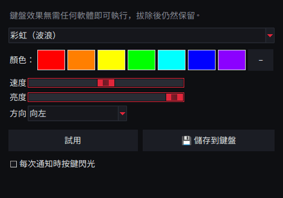
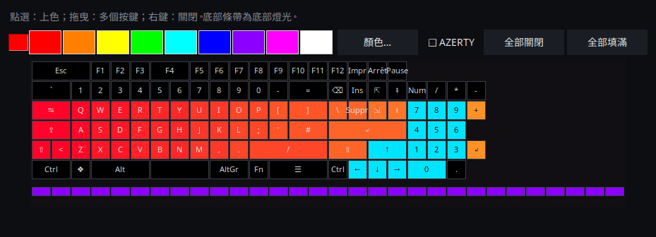

<p align="center">
  
</p>

# Linux 版 AniMe Matrix — ROG Strix Flare II Animate

[](https://github.com/AntiCitoyen/Anticitoyen-ROG-flare2-anime-matrix/releases/latest)
[](https://github.com/AntiCitoyen/Anticitoyen-ROG-flare2-anime-matrix/actions/workflows/ci.yml)
[](../../LICENSE)
[](https://buymeacoffee.com/anticitoyen)

在 Linux 上直接驅動 **ASUS ROG Strix Flare II Animate** 鍵盤的 **AniMe Matrix**(312 顆迷你 LED)螢幕,不需要 Armoury Crate,也不需要 Windows:GIF 與圖庫、時鐘、動態特效與音訊視覺化、遊戲、系統監視器、桌面通知、定時排程、動畫編輯器、共享動畫庫、鍵盤顏色同步。

<div align="center">

[🇫🇷 Français](../../README.md) · [🇬🇧 English](README.en.md) · [🇪🇸 Español](README.es.md) · [🇩🇪 Deutsch](README.de.md) · [🇮🇹 Italiano](README.it.md) · [🇧🇷 Português](README.pt-BR.md) · [🇳🇱 Nederlands](README.nl.md) · [🇵🇱 Polski](README.pl.md) · [🇷🇺 Русский](README.ru.md) · [🇺🇦 Українська](README.uk.md) · [🇹🇷 Türkçe](README.tr.md) · [🇸🇦 العربية](README.ar.md) · [🇮🇳 हिन्दी](README.hi.md) · [🇨🇳 简体中文](README.zh-CN.md) · **🇹🇼 繁體中文** · [🇯🇵 日本語](README.ja.md) · [🇰🇷 한국어](README.ko.md) · [🇻🇳 Tiếng Việt](README.vi.md) · [🇮🇩 Bahasa Indonesia](README.id.md)

</div>

<p align="center"><br><em>錶盤 + 抽屜 (預設介面)</em></p>

| 錶盤 | 圓角 | 經典 |
|:---:|:---:|:---:|
|  |  |  |

<p align="center"></p>

---

## 目錄

- [專案簡介](#projet)
- [支援的硬體](#materiel)
- [安裝](#installation)
- [使用方式](#utilisation)
- [製作合適的 GIF](#gif)
- [運作原理](#fonctionnement)
- [疑難排解](#depannage)
- [儲存庫結構](#depot)
- [建置套件](#deb)
- [致謝](#credits)
- [授權條款](#licence)
- [支持本專案](#soutien)

---

<a id="projet"></a>

## 專案簡介

ASUS 僅在 Windows(透過 Armoury Crate)提供這款鍵盤 AniMe Matrix 螢幕的官方支援。本專案以 USB HID 直接與鍵盤通訊,提供:

**顯示**
- **GIF、圖片與影片**:單一檔案、多選檔案,或將整個資料夾作為圖庫,也可直接拖放到視窗上;影片(MP4、WebM、MKV 等)透過 ffmpeg 播放;縮圖圖庫;轉換後的影格會保留在快取中(由 400 個 GIF 組成的圖庫執行時記憶體占用約 25 MB)。
- **時鐘**:數位、指針、二進位、文字(法語、英語、德語、西班牙語、義大利語、葡萄牙語、荷蘭語)或花式錶盤。
- **動態特效**(矩陣雨、電漿、火焰、星空、煙火、閃電、融球、波浪……)與**7 種音訊視覺化效果**,隨電腦播放的聲音而變化。
- **文字**:你的訊息,支援所有文字系統(帶重音的字母、西里爾字母、阿拉伯文、印地文、中文、日文、韓文……),可向左、向右、向上、向下捲動或固定顯示。
- **網路攝影機**(影像或剪影)與**螢幕鏡像**(整個螢幕、滑鼠周圍或作用中視窗)。
- **系統監視器**:以儀表板形式顯示 CPU、記憶體、GPU、溫度、網路流量與時間。
- **目前播放的曲目**:切換曲目時,「演出者 - 標題」捲動播放一次,接著顯示視覺化效果(透過 MPRIS 支援 Spotify、VLC、Rhythmbox、瀏覽器等)。
- **桌面通知**:以「應用程式:標題」的形式疊加顯示,接著恢復播放(預設關閉,可設定允許通知的應用程式清單)。
- **可玩的鍵盤遊戲**:貪食蛇、乒乓(單人或雙人)、俄羅斯方塊、打磚塊、太空侵略者、Flappy,附帶紀錄。
- **指示燈**:麥克風靜音或使用中、網路攝影機運作中、OBS 直播或錄製時,螢幕上會亮起小光塊。
- **鍵盤記憶體**：儲存在鍵盤中的動畫（GIF、圖片）插上即可播放，無需任何軟體，換一台電腦也一樣；亮度可調（GIF 分頁，`animematrix-ctl memoire`）。 也可以選擇 6 個內建動畫（KO、流星、眼睛、Love、萬聖節、開機）：`animematrix-ctl clavier 1`…`6`。

**建立**
- **逐格動畫編輯器**,基於螢幕的真實幾何結構:3 階灰階、時間軸、幽靈圖層、位移、複製貼上、預覽、傳送至鍵盤、匯出 GIF。
- **共享動畫庫**:瀏覽、播放、加入圖庫、投稿自己的作品。
- **智慧 GIF 轉換**:依主體裁切、在黑色背景上凸顯主體、加強輪廓、3 階灰階。
- **真實預覽**(傳送前):模擬螢幕的渲染效果(真實排列、LED 間的光暈)。
- **擴充特效**:將一個 Python 檔案放入指定資料夾即可新增一種特效(詳見 [EXTENSIONS.md](../EXTENSIONS.md))。

**自動化**
- **`animematrixd` 守護程式**:螢幕的唯一擁有者,即使關閉啟動器也會繼續顯示;提供 `animematrix-ctl` 指令與可選的本機 HTTP API。
- **定時排程**:依時段(含夜間)設定顯示時鐘、圖庫、監視器、目前播放的曲目、某個特效、播放清單或關閉螢幕;工作階段鎖定、待機或有應用程式全螢幕時自動關閉螢幕。
- **依應用程式設定檔**:某個遊戲或應用程式位於前景時,顯示其專屬內容(*偵測* 按鈕)。
- **播放清單與我的最愛**:GIF、特效、時鐘……各依設定的時長輪流循環播放;也可從系統匣圖示與命令列使用。
- **網頁遙控**:透過一個網頁,用區域網路內的手機控制螢幕(QR 碼、權杖)。
- **長時間指令的結束**:在終端機中,長時間執行的指令結束時會顯示「完成：make 2 min 05」。
- **按鍵顏色與效果**，無需 OpenRGB：彩虹、靜態、呼吸、顏色循環、觸發、漣漪、星空、流沙、電流、雨滴——由鍵盤本身執行，拔除後仍保留；或主題顏色、隨螢幕脈動。
- **系統匣圖示**:快速選單(模式、亮度)。

**便利性**
- **4 種介面**(預設為 *錶盤 + 抽屜*,另有 *錶盤*、*圓角*、*經典*),具備 **312 顆 LED 即時預覽**、**11 套主題**(5 套 ROG 風格、5 套粉色系、1 套跟隨系統)與 **19 種語言**。
- **X11 與 Wayland**:透過 evdev 回應鍵盤,作用中視窗從 Sway、Hyprland、KDE(kdotool)或 GNOME(*Window Calls* 擴充功能)讀取。
- **內建更新**:啟動器下載最新 release,驗證其 SHA-256 指紋後安裝(需要管理員密碼);或透過 APT 儲存庫執行 `apt upgrade`。

<a id="materiel"></a>

## 支援的硬體

| 裝置 | USB | 狀態 |
|---|---|---|
| ASUS ROG Strix Flare II Animate | `0b05:19fc` | 已支援(HID,介面 4,usage page `0xFF02`) |
| ROG 筆記型電腦的 AniMe Matrix 螢幕(G14、G16 等) | 多種 | **實驗性**,透過 `asusctl` 實作,尚未在實機上測試(見[使用方式](#utilisation)) |

已在 Ubuntu 26.04(X11、PipeWire、Cinnamon)上測試通過。任何具備 Python ≥ 3.10、hidapi、Tk 與 systemd 的發行版理論上都能使用;在 Wayland 下,啟動器會透過 XWayland 執行。

<a id="installation"></a>

## 安裝

### APT 儲存庫(Debian、Ubuntu、Mint、Pop!_OS 等)——以 `apt upgrade` 更新

```bash
curl -fsSL https://anticitoyen.github.io/Anticitoyen-ROG-flare2-anime-matrix/animematrix.gpg \
  | sudo tee /usr/share/keyrings/animematrix.gpg >/dev/null
echo "deb [signed-by=/usr/share/keyrings/animematrix.gpg] https://anticitoyen.github.io/Anticitoyen-ROG-flare2-anime-matrix stable main" \
  | sudo tee /etc/apt/sources.list.d/animematrix.list
sudo apt update && sudo apt install anticitoyen-rog-flare2-anime-matrix
```

接著**將鍵盤拔除後重新插上**(udev 規則會授予目前登入使用者存取權限),再從選單啟動 **AniMe Matrix**。

### 其他格式(見 [Releases](https://github.com/AntiCitoyen/Anticitoyen-ROG-flare2-anime-matrix/releases/latest) 頁面)

| 系統 | 檔案 | 安裝方式 |
|---|---|---|
| Debian、Ubuntu 等 | `anticitoyen-rog-flare2-anime-matrix_<version>_all.deb` | `sudo apt install ./anticitoyen-rog-flare2-anime-matrix_*_all.deb` |
| Fedora、openSUSE 等 | `anticitoyen-rog-flare2-anime-matrix-<version>-1.noarch.rpm` | `sudo dnf install ./anticitoyen-rog-flare2-anime-matrix-*.noarch.rpm` |
| Arch、Manjaro 等 | `anticitoyen-rog-flare2-anime-matrix-<version>-1-any.pkg.tar.zst` | `sudo pacman -U anticitoyen-rog-flare2-anime-matrix-*.pkg.tar.zst` |
| 所有發行版(Flatpak) | `AniMeMatrix-<version>.flatpak` | `flatpak install --user AniMeMatrix-*.flatpak`(還需安裝下方的 udev 規則;不支援音訊視覺化) |
| AUR | `aur-<version>.tar.gz` | PKGBUILD 與 .SRCINFO：`tar xf aur-*.tar.gz && cd anticitoyen-rog-flare2-anime-matrix && makepkg -si` |
| Copr | `anticitoyen-rog-flare2-anime-matrix-<version>-1.<fc>.src.rpm` | 原始碼 RPM：`rpmbuild --rebuild anticitoyen-rog-flare2-anime-matrix-*.src.rpm`，或上傳到 Copr 專案 |
| Flathub | `flathub-<version>.tar.gz` | 固定到此版本的清單與 `python3-modules.json`：提交到 Flathub 或使用 `flatpak-builder` |
| Weblate | `translations-<version>.zip` | 翻譯檔案（`locale/*.json`，基準 `_source.json`），可匯入 Weblate |

此套件會安裝:

| 項目 | 位置 |
|---|---|
| 程式檔案 | `/usr/share/anticitoyen-rog-flare2-anime-matrix/` |
| 指令 | `animematrix`、`animematrixd`、`animematrix-ctl`、`animematrix-bascule`、`animematrix-animation`、`animematrix-apercu`、`animematrix-convertir`、`animematrix-effet`、`animematrix-galerie`、`animematrix-horloge`、`animematrix-dessin`、`animematrix-tray`, `animematrix-memoire` |
| 使用者服務 | `/usr/lib/systemd/user/animematrixd.service`(對所有工作階段啟用) |
| udev 規則 | `/usr/lib/udev/rules.d/72-rog-flare2-animate.rules` |
| 選單與圖示 | `animematrix.desktop`,圖示 `animematrix` |

### 從原始碼安裝

```bash
git clone https://github.com/AntiCitoyen/Anticitoyen-ROG-flare2-anime-matrix.git
cd Anticitoyen-ROG-flare2-anime-matrix
python3 -m venv .venv
.venv/bin/pip install hidapi pillow numpy pynput python-xlib
# 讓一般使用者(無需 root)也能存取鍵盤
sudo cp packaging/72-rog-flare2-animate.rules /etc/udev/rules.d/
sudo udevadm control --reload-rules && sudo udevadm trigger
# 接著拔除並重新插上鍵盤
.venv/bin/python rog_flare2_launcher.py
```

有用的系統工具:`imagemagick`(經典轉換)、`pulseaudio-utils`(`parec`,用於音訊)、`zenity`(檔案選擇對話框)、`libnotify-bin`(通知)、`python3-gi` 與 `gir1.2-ayatanaappindicator3-0.1`(系統匣圖示)、`ffmpeg`(影片、網路攝影機、螢幕鏡像)、`python3-evdev`(Wayland 下的鍵盤反應)、`x11-utils`(X11 下的作用中視窗)、`python3-qrcode`(遙控的 QR 碼)、`tkdnd`(拖放)。

<a id="utilisation"></a>

## 使用方式

### 啟動器

`animematrix`(或選單中的 **AniMe Matrix** 項目)。

在圓形介面中,圓形按鈕用於開啟 *GIF*、*特效*、*音訊* 與 *設定* 區塊(在抽屜中或圓圈內);*時鐘* 與 *停止* 會立即生效;底部弧形用於調整亮度;拖曳背景可移動視窗;頂部的小按鈕用於最小化或關閉。圓形外觀依賴 X11 SHAPE 擴充功能(`python3-xlib` 套件);若無此擴充功能,則以矩形視窗顯示相同介面。

- **GIF / 圖片**:*GIF/圖片…* 或 *資料夾（圖庫）…*(或拖放到視窗上);*真實幾何* 會保持比例(裁切邊角而非拉伸圖片);*👁 真實預覽（傳送前）* 在不傳送任何內容的情況下呈現渲染效果;*🎞 建立動畫（編輯器）*;*📚 動畫庫*;*★ 播放清單與我的最愛*;*🖼 縮圖圖庫*(點擊:播放,右鍵:我的最愛);*🎥 網路攝影機* 與 *🖥 螢幕鏡像*;*智慧轉換* 用於轉換 GIF。
- **特效** 與 **音訊**:選擇、調整參數,再按下 *▶ 啟動效果*。滑桿會即時生效;*節奏* 用來加快或放慢整段動畫。*文字* 特效可輸入你的訊息並設定捲動方向。遊戲以方向鍵、空白鍵與 Enter 操作,需將啟動器視窗置於最上層;雙人乒乓:左側玩家使用 Z/W 與 S。
- **亮度**、**🕒 時鐘**、**■ 停止**(會清空螢幕)在所有分頁中都是共通的。
- **設定**:工作階段啟動內容(GIF 圖庫、時鐘、上次播放或無)、時鐘錶盤、語言、主題、介面、桌面通知、鍵盤顏色、*排程…*(觸發條件、依應用程式設定檔、時段)、*指示燈…*、*網頁遙控…*、系統匣圖示、長時間指令的結束、擴充資料夾、更新。

**關閉啟動器不會中斷任何內容**:`animematrixd` 守護程式會繼續顯示。*■ 停止* 會關閉螢幕。

### 守護程式與命令列

```bash
animematrix-ctl etat                               # 目前顯示的內容
animematrix-ctl gif ~/Images/AniMe-Matrix --fidele # 圖庫(資料夾或檔案)
animematrix-ctl effet "Plasma" --param speed=250   # 特效與參數
animematrix-ctl horloge
animematrix-ctl texte "Bonjour"
animematrix-ctl effet "Text" --param message="Salut" --param direction=haut
animematrix-ctl liste "Soirée"                     # 播放清單(不帶名稱:列出所有清單)
animematrix-ctl favori 2                           # 第 2 個我的最愛(不帶編號:列出所有我的最愛)
animematrix-ctl notifier "Café prêt" --duree 5     # 疊加顯示後恢復
animematrix-ctl memoire anim.gif                   # 儲存到鍵盤（最多 196 格）
animematrix-ctl clavier                            # 顯示已儲存的動畫
animematrix-ctl luminosite 60
animematrix-ctl stop
```

| 指令 | 作用 |
|---|---|
| `animematrix-bascule [gif\|horloge\|lecture\|off\|etat]` | 切換模式(也能在選單圖示的右鍵選單中操作);所選模式也會成為工作階段啟動模式 |
| `animematrixd --http 8765` | 具備本機 HTTP API 的守護程式(`POST http://127.0.0.1:8765/api`, `Content-Type: application/json`,JSON 格式與 Socket 相同) |
| `animematrix-animation [fichier.gif]` | 動畫編輯器 |
| `animematrix-apercu fichier.gif -o apercu.gif` | 產生某個 GIF 檔案的真實預覽 |
| `animematrix-convertir dossier/ [--fidele] [--classique]` | 將 GIF 轉換為適合矩陣螢幕的格式(輸出至 `dossier/matrix/`) |
| `animematrix-effet --liste` | 列出所有特效與視覺化效果 |
| `animematrix-dessin` | 逐顆 LED 繪圖編輯器(關閉時將控制權交還給守護程式) |
| `animematrix-ctl sauvegarde reglages.zip`, `animematrix-ctl restaurer reglages.zip` | 匯出或還原全部設定（也可在*設定*中操作）；除非使用 `--secrets`，否則不含權杖與 OBS 密碼 |

### 音訊

視覺化效果透過 `parec`(PipeWire 或 PulseAudio)監聽**預設音訊輸出的監控來源(monitor)**:它們會對電腦播放的聲音做出反應,而非麥克風輸入。

### 「Keyboard React」特效

特效執行期間,它會依按鍵節奏點亮螢幕:X11 下透過 `pynput`,Wayland 下則讀取 `/dev/input` 中的鍵盤(`python3-evdev`)。在 Wayland 下,若特效一直停留在示範模式,請授權僅讀取 ROG 鍵盤:

```bash
sudo cp /usr/share/anticitoyen-rog-flare2-anime-matrix/udev/73-rog-flare2-animate-touches.rules /etc/udev/rules.d/
sudo udevadm control --reload-rules && sudo udevadm trigger
```

### 指示燈

*設定* → *指示燈（麥克風、網路攝影機、OBS）…*:螢幕左上角會亮起一個 2 × 2 LED 的小塊,疊加在目前播放內容之上(1:麥克風靜音或使用中,2:網路攝影機使用中,3:OBS 直播或錄製中),每次狀態變化還可透過捲動文字提示。OBS:啟用 WebSocket 伺服器(*工具* → *WebSocket 伺服器設定*),並填入其連接埠與密碼。

### 網頁遙控

*設定* → *網頁遙控…*:勾選 *啟用網頁遙控*,然後在同一網路中的手機上開啟該網址(或掃描 QR 碼)。頁面會即時顯示螢幕內容,並提供時鐘、圖庫、特效、我的最愛、清單、亮度與訊息功能。網址中包含一個權杖:請勿分享,可透過 *新權杖* 更換;頁面未加密(HTTP):僅限在受信任的網路中使用。

### 長時間指令的結束

*設定* → *顯示長時間指令的結束（終端機）* 會在 `~/.bashrc`(以及 `~/.zshrc`)中加入一行:任何執行超過 30 秒的指令結束時都會顯示「完成：make 2 min 05」或「失敗（2）：…」。門檻:`ANIMEMATRIX_FIN_SECONDES`;互動式指令(編輯器、`ssh`、`less` 等)會被忽略。

### 鍵盤顏色

*設定* → *🌈 鍵盤顏色…*：效果（彩虹、靜態、呼吸、顏色循環、觸發、漣漪、星空、流沙、電流、雨滴）、顏色、速度、亮度、方向。*試用* 立即套用，*儲存到鍵盤* 拔除後仍保留。*主題顏色* 與 *隨螢幕脈動* 由常駐程式逐鍵傳送；離開後恢復已儲存的效果。命令列：`animematrix-ctl rgb arc-en-ciel --vitesse 70`、`animematrix-ctl rgb statique --couleur "#ff0000"`。 另有兩種軟體模式：*螢幕畫面*（按鍵放大映射螢幕內容）與*音訊頻譜*（每欄一條光柱）。每個時段與每個應用程式設定檔也可以選擇按鍵顏色（*排程…*）。 *逐鍵*：每個按鍵一種顏色，用滑鼠在鍵盤配置圖上繪製（AZERTY 或 QWERTY）。 *按鍵發光*：每按一個鍵，它就會亮起然後漸暗。麥克風、網路攝影機與 OBS 指示燈也可以點亮 F1、F2 與 F3，每則通知都會讓按鍵閃光。

<p align="center"> </p>

### ROG 筆記型電腦(實驗性)

在 `~/.config/rog-flare2/materiel` 中寫入 `portable-asusctl`,再重新啟動守護程式:資料訊框將透過 `asusctl anime image` 傳送(最多每秒 5 幀)。尚未在實機筆電上測試:歡迎在議題中回報。

<a id="gif"></a>

## 製作合適的 GIF

螢幕並非規則的矩形:24 列呈階梯狀排列,最上方 19 顆 LED、最下方 7 顆(右側邊緣為垂直線,左側邊緣為對角線),只有 3 階真正可區分的灰階,相鄰 LED 之間存在光暈。剪影、圖示、短文字與緩慢的動作效果較佳;照片與影片則不適合。

完整指南(畫布尺寸、灰階等級、影格速率、轉換、真實幾何):**[GUIDE-GIF.md](../GUIDE-GIF.md)**。

<a id="fonctionnement"></a>

## 運作原理

- **傳輸方式**:hidapi 開啟鍵盤的第 4 號 HID 介面,並向其寫入 **1024 位元組** 的資料訊框;鍵盤會回傳每一訊框。
- **訊框結構**:`60 81 00 00` + **312 位元組**(每顆 LED 一個 0–255 的亮度值,依硬體順序排列)+ 補零至 1024 位元組。
- **幾何結構**:24 列呈階梯狀排列(第 r 列涵蓋第 (r+1)//2 到 18 欄),等效地也可視為 12 組邏輯列、每列 37 → 15 欄(PolyWollyWin 的模型);兩種對應方式已在全部 312 顆 LED 上驗證一致。
- **守護程式**:`animematrixd` 獨自掌控鍵盤;負責基本播放與疊加顯示(通知);JSON Socket `$XDG_RUNTIME_DIR/animematrix.sock`;鍵盤自動重新連線。
- **動畫播放**:主機端逐格連續傳送(特效約每秒 30 格);鍵盤內部並未使用任何內建儲存空間(相關研究見 [RECHERCHE-MEMOIRE.md](../RECHERCHE-MEMOIRE.md))。

最初的逆向工程紀錄請見 **[PROTOCOL.md](../PROTOCOL.md)**;擷取檔 `*.cap` 以及 `parse_usbpcap.py` / `rog_flare2_replay_capture.py` 工具仍保留在儲存庫中。

⚠️ 請勿向鍵盤傳送筆電版 AniMe Matrix 的封包(`0x5E …`、`0xEC …`):協定不同,可能導致鍵盤卡死(需拔插鍵盤,或按住 **Fn + Esc** 10–15 秒)。

<a id="depannage"></a>

## 疑難排解

| 現象 | 可能原因 | 解決方法 |
|---|---|---|
| `interface 4 not found` | 未偵測到鍵盤或權限不足 | `lsusb \| grep 0b05:19fc`;確認 udev 規則已安裝;拔插鍵盤 |
| `Permission denied` / `open failed` | udev 規則未生效 | `sudo udevadm control --reload-rules && sudo udevadm trigger`,然後重新插拔 |
| 「無法連線至 animematrixd 服務」 | 守護程式已停止 | `systemctl --user restart animematrixd.service` 或 `animematrixd &` |
| 螢幕內容沒有變化 | 有其他程式正在寫入鍵盤 | 關閉舊的指令碼;`animematrix-ctl etat` |
| 視覺化效果一直停留在展示模式 | 沒有 `parec` 或沒有聲音輸出 | 安裝 `pulseaudio-utils`,播放一些聲音 |
| 「Keyboard React」沒有反應 | 缺少 `pynput`(X11)或 `python3-evdev`(Wayland),或無法讀取鍵盤 | 安裝對應的套件;在 Wayland 下,使用 [Keyboard React](#utilisation) 中的 udev 規則 |
| 網路攝影機、影片或螢幕鏡像無法使用 | 缺少 `ffmpeg` | `sudo apt install ffmpeg`;在 Wayland 下,螢幕鏡像透過入口網站(`gstreamer1.0-pipewire`)運作 |
| 在 Wayland 下依應用程式設定檔或全螢幕偵測無效 | 合成器無法提供作用中視窗 | GNOME:*Window Calls* 擴充功能;KDE:`kdotool`;Sway 與 Hyprland:無需任何操作 |
| 圓形視窗顯示為矩形 | 缺少 SHAPE 擴充功能或 `python3-xlib` | `sudo apt install python3-xlib`,或 *設定* → *介面：* → *經典* |
| 守護程式紀錄 | — | `journalctl --user -u animematrixd.service -f` |

<a id="depot"></a>

## 儲存庫結構

| 檔案 | 作用 |
|---|---|
| `rog_flare2_launcher.py` | 圖形啟動器(Tk) |
| `rog_flare2_ui_ronde.py`、`rog_flare2_themes.py` | 圓形介面、主題 |
| `rog_flare2_i18n.py`、`locale/` | 介面翻譯(19 種語言;`locale/_cles.json` = 待翻譯文字;[TRADUIRE.md](../TRADUIRE.md)) |
| `rog_flare2_demon.py`、`rog_flare2_ctl.py` | `animematrixd` 守護程式、用戶端與 `animematrix-ctl` 指令 |
| `rog_flare2_core.py` | GIF 串流播放、影格快取、時鐘、幾何結構 |
| `rog_flare2_texte.py`、`rog_flare2_horloges.py` | 支援所有文字系統的文字、*文字* 特效、時鐘錶盤 |
| `rog_flare2_listes.py`、`rog_flare2_vignettes.py` | 播放清單、我的最愛、縮圖圖庫、拖放 |
| `rog_flare2_video.py`、`rog_flare2_voyants.py`、`rog_flare2_telecommande.py` | 影片、網路攝影機、螢幕鏡像;指示燈;網頁遙控 |
| `rog_flare2_touches.py`、`rog_flare2_fenetre.py`、`rog_flare2_fin.py`、`rog_flare2_flatpak.py` | 按鍵與作用中視窗(X11、Wayland)、長時間指令的結束、Flatpak |
| `rog_flare2_effets.py`、`polywollywin/` | 特效與視覺化效果(PolyWollyWin 引擎,MIT 授權)、擴充功能 |
| `rog_flare2_infos.py`、`rog_flare2_mpris.py`、`rog_flare2_jeux.py` | 系統監視器、目前播放的曲目、遊戲 |
| `rog_flare2_notifs.py`、`rog_flare2_programme.py`、`rog_flare2_ui_programme.py` | 通知、定時排程與觸發條件 |
| `rog_flare2_rgb.py`、`rog_flare2_tray.py`、`rog_flare2_portable.py` | 按鍵顏色與效果、系統匣圖示、筆記型電腦(實驗性) |
| `rog_flare2_animation.py`、`rog_flare2_simulateur.py`、`rog_flare2_convertir.py` | 動畫編輯器、模擬器、轉換 |
| `rog_flare2_bibliotheque.py`、`bibliotheque/` | 動畫庫(目錄、CC0 授權的 GIF) |
| `rog_flare2_maj.py` | 從 release 取得更新 |
| `rog_flare2_matrix_paint.py`、`rog_flare2_clock_v3.py`、`rog_flare2_folder_player.py` | HID 傳輸與逐顆 LED 繪圖編輯器、時鐘、圖庫(原始工具) |
| `parse_usbpcap.py`、`rog_flare2_replay_capture.py`、`*.cap` | 逆向工程 |
| `examples/effets/` | 擴充功能範例 |
| `tests/` | 測試(包含以實際點擊操作的介面測試) |
| `systemd/`、`packaging/` | 使用者服務;.deb、RPM、Arch、Flatpak、APT 儲存庫 |
| `docs/` | GIF 指南、擴充功能、協定、研究紀錄、螢幕截圖、已翻譯的 README |

<a id="deb"></a>

## 建置套件

```bash
packaging/build-deb.sh
# → dist/anticitoyen-rog-flare2-anime-matrix_<version>_all.deb
```

`packaging/install.sh` 可將本專案安裝到任意目錄樹中;.deb、RPM(`packaging/rpm/`)、Arch 套件(`packaging/aur/`)與 Flatpak(`packaging/flathub/`)都使用這個指令碼。每次發布新 release 時,GitHub 都會自動建置 RPM、Arch 套件與 Flatpak,並更新已簽署的 APT 儲存庫。版本號會從 `rog_flare2_core.py`(`VERSION`)中讀取。測試:`python -m pytest tests`。

<a id="credits"></a>

## 致謝

- **NicRoss512** —— 協定逆向工程、最初版本的時鐘與繪圖編輯器:[ASUS-ROG-Strix-Flare-II-Animate-AniMe-Matrix-Protocol](https://github.com/NicRoss512/ASUS-ROG-Strix-Flare-II-Animate-AniMe-Matrix-Protocol)。本儲存庫由此衍生而來,並保留了其提交歷史。
- **Mike Opitz** —— [PolyWollyWin](https://github.com/MikeOpitz99/PolyWollyWin)(MIT 授權),一款 Windows 控制程式,本專案沿用了其特效與音訊視覺化引擎。
- **Yoshi Walsh** —— [Mastering the AniMe Matrix](https://blog.yoshiwalsh.me/asus-anime-matrix/),提供了關於 LED 表現(光暈、可感知的灰階等級、更新頻率)的說明。
- **asus-linux** —— [asusctl](https://gitlab.com/asus-linux/asusctl),用於筆記型電腦的螢幕。

本專案為獨立專案,與 ASUS 無關。「ROG」「AniMe Matrix」與「Armoury Crate」均為 ASUSTeK 的商標。

<a id="licence"></a>

## 授權條款

本儲存庫的程式碼採用 [MIT](../../LICENSE) 授權;`bibliotheque/` 中的動畫採用 CC0 授權。`polywollywin/` 目錄仍遵循其作者的 MIT 授權([polywollywin/LICENSE](../../polywollywin/LICENSE))。NicRoss512 的原始檔案(`rog_flare2_clock_v3.py`、`rog_flare2_matrix_paint.py`、`parse_usbpcap.py`、`rog_flare2_replay_capture.py`、`docs/PROTOCOL.md`、擷取檔)發布時未附帶明確授權條款,著作權仍屬於原作者;本專案在保留出處標示的前提下轉載這些檔案。

<a id="soutien"></a>

## 支持本專案

如果這個專案對你有幫助,一杯咖啡有助於本專案的持續維護:

[](https://buymeacoffee.com/anticitoyen)

**https://buymeacoffee.com/anticitoyen** —— 此連結同樣可以在啟動器的 *設定* 分頁中找到。

問題回報、創意與動畫分享:[Issues](https://github.com/AntiCitoyen/Anticitoyen-ROG-flare2-anime-matrix/issues)。翻譯:[TRADUIRE.md](../TRADUIRE.md)。
