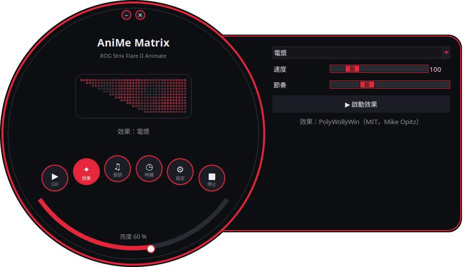
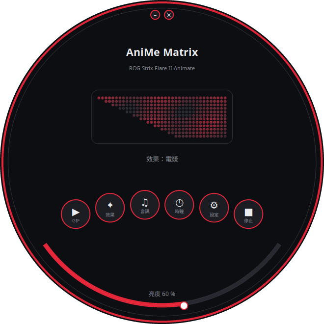
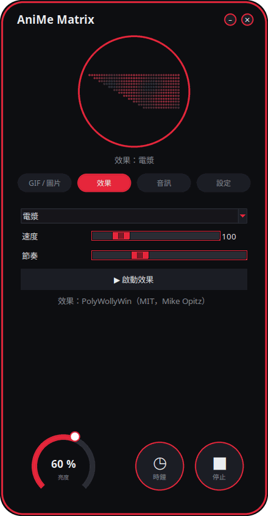
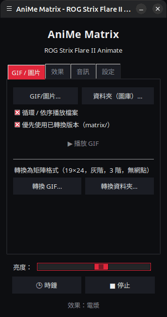

<p align="center">
  
</p>

# Linux 版 AniMe Matrix — ROG Strix Flare II Animate

[](https://github.com/AntiCitoyen/Anticitoyen-ROG-flare2-anime-matrix/releases/latest)
[](../../LICENSE)
[](https://buymeacoffee.com/anticitoyen)

在 Linux 上直接驅動 **ASUS ROG Strix Flare II Animate** 鍵盤的 **AniMe Matrix**(312 顆迷你 LED)螢幕,不需要 Armoury Crate,也不需要 Windows:GIF 與圖片、背景圖庫、時鐘、19 種動態特效、7 種音訊視覺化效果,以及逐顆 LED 繪圖。

圖形介面現已支援 19 種語言,會自動跟隨系統語言,也可以在 **設定** 分頁的 *語言：* 中更改。

<div align="center">

[🇫🇷 Français](../../README.md) · [🇬🇧 English](README.en.md) · [🇪🇸 Español](README.es.md) · [🇩🇪 Deutsch](README.de.md) · [🇮🇹 Italiano](README.it.md) · [🇧🇷 Português](README.pt-BR.md) · [🇳🇱 Nederlands](README.nl.md) · [🇵🇱 Polski](README.pl.md) · [🇷🇺 Русский](README.ru.md) · [🇺🇦 Українська](README.uk.md) · [🇹🇷 Türkçe](README.tr.md) · [🇸🇦 العربية](README.ar.md) · [🇮🇳 हिन्दी](README.hi.md) · [🇨🇳 简体中文](README.zh-CN.md) · **🇹🇼 繁體中文** · [🇯🇵 日本語](README.ja.md) · [🇰🇷 한국어](README.ko.md) · [🇻🇳 Tiếng Việt](README.vi.md) · [🇮🇩 Bahasa Indonesia](README.id.md)

</div>

<p align="center"><br><em>錶盤 + 抽屜 (預設介面)</em></p>

| 錶盤 | 圓角 | 經典 |
|:---:|:---:|:---:|
|  |  |  |

<p align="center"></p>

---

## 目錄

- [專案簡介](#projet)
- [支援的硬體](#materiel)
- [安裝](#installation)
- [使用方式](#utilisation)
- [製作合適的 GIF](#gif)
- [運作原理](#fonctionnement)
- [疑難排解](#depannage)
- [儲存庫結構](#depot)
- [建置 .deb 套件](#deb)
- [致謝](#credits)
- [授權條款](#licence)
- [支持本專案](#soutien)

---

<a id="projet"></a>

## 專案簡介

ASUS 僅在 Windows(透過 Armoury Crate)提供這款鍵盤 AniMe Matrix 螢幕的官方支援。本專案以 USB HID 直接與鍵盤通訊,提供:

- **圖形啟動器**(`animematrix`),可在 **4 種介面**中選擇:*錶盤 + 抽屜*(圓形視窗,設定面板從右側滑出,預設)、*錶盤*(全部內容都在圓圈中)、*圓角*(圓角非常大,附亮度轉盤)以及*經典*(分頁)。圓形介面會**即時顯示送往鍵盤的 312 顆 LED**。四個功能區塊:
  - **GIF / 圖片**:播放單一或多個檔案,或將整個資料夾作為圖庫循環播放;將 GIF 轉換為適合矩陣螢幕的格式。
  - **效果**:19 種動畫特效(矩陣雨、電漿、火焰、星空、煙火、閃電、融球、波浪、貪食蛇、捲動文字、花式時鐘、按鍵反應等),執行時可即時調整。
  - **音訊**:7 種會隨電腦播放的聲音變化的視覺化效果(頻譜條、KITT / KARR、中心爆閃、示波器、音訊火焰等)。
  - **設定**:工作階段開始時要顯示的內容、語言、主題與介面、繪圖編輯器、專案相關連結。
- **HH:MM 時鐘**,可從啟動器開啟,也可作為背景服務執行。
- **背景圖庫**:一個 `systemd --user` 服務,會在工作階段開始時自動循環播放指定資料夾中的 GIF。
- **一鍵切換**(`animematrix-bascule`):點選選單圖示可開關螢幕;按右鍵可選擇 GIF 圖庫、時鐘或關閉螢幕。
- **適合矩陣螢幕的 GIF 轉換**(`animematrix-convertir`):19×24、灰階、3 階灰階、不做網點化處理——詳見 [GUIDE-GIF.md](../GUIDE-GIF.md)。
- **逐顆 LED 繪圖編輯器**(`animematrix-dessin`)。
- **11 套主題**：5 套 ROG 風格（Classic、Strix、Glitch、Gold、Carbon），5 套粉色（櫻花、泡泡糖、玫瑰金、薰衣草粉、粉色之夜），以及系統預設外觀，可在 *設定* → *主題：* 中選擇。
- **低資源消耗**:GIF 逐格解碼;由 400 個 GIF 組成的圖庫執行時記憶體占用約 25 MB。

<a id="materiel"></a>

## 支援的硬體

| 鍵盤 | USB | 介面 |
|---|---|---|
| ASUS ROG Strix Flare II Animate | `0b05:19fc` | HID,介面 4(usage page `0xFF02`) |

ROG **筆記型電腦**(如 Zephyrus G14 等)上的 AniMe Matrix 螢幕使用不同的協定,本專案**不支援**這類裝置(請改用 `asusctl`)。

已在 Ubuntu 26.04(X11、PipeWire)上測試通過。任何具備 Python ≥ 3.10、hidapi、Tk 與 systemd 的發行版理論上都能使用。

<a id="installation"></a>

## 安裝

### .deb 套件(Debian、Ubuntu、Mint、Pop!_OS 等)

1. 從 [Releases](https://github.com/AntiCitoyen/Anticitoyen-ROG-flare2-anime-matrix/releases/latest) 頁面下載 `anticitoyen-rog-flare2-anime-matrix_<version>_all.deb`。
2. 進行安裝(apt 會自動抓取相依套件):
   ```bash
   sudo apt install ./anticitoyen-rog-flare2-anime-matrix_*_all.deb
   ```
3. **將鍵盤拔除後重新插上**(udev 規則會授予目前登入使用者存取權限)。
4. 從應用程式選單啟動 **AniMe Matrix**,或在終端機中執行 `animematrix`。

此套件會安裝:

| 項目 | 位置 |
|---|---|
| 程式檔案 | `/usr/share/anticitoyen-rog-flare2-anime-matrix/` |
| 指令 | `animematrix`、`animematrix-bascule`、`animematrix-effet`、`animematrix-galerie`、`animematrix-horloge`、`animematrix-convertir`、`animematrix-dessin`、`animematrix-lecture` |
| 使用者服務 | `/usr/lib/systemd/user/animematrix-galerie.service`、`animematrix-horloge.service`、`animematrix-lecture.service`(預設未啟用) |
| udev 規則 | `/usr/lib/udev/rules.d/72-rog-flare2-animate.rules` |
| 選單與圖示 | `animematrix.desktop`,圖示 `animematrix` |

解除安裝:`sudo apt remove anticitoyen-rog-flare2-anime-matrix`。

### 從原始碼安裝

```bash
git clone https://github.com/AntiCitoyen/Anticitoyen-ROG-flare2-anime-matrix.git
cd Anticitoyen-ROG-flare2-anime-matrix
python3 -m venv .venv
.venv/bin/pip install hidapi pillow numpy pynput python-xlib
# 讓一般使用者(無需 root)也能存取鍵盤
sudo cp packaging/72-rog-flare2-animate.rules /etc/udev/rules.d/
sudo udevadm control --reload-rules && sudo udevadm trigger
# 接著拔除並重新插上鍵盤
.venv/bin/python rog_flare2_launcher.py
```

有用的系統工具:`imagemagick`(轉換用)、`pulseaudio-utils`(提供 `parec`,用於音訊)、`zenity`(檔案選擇對話框)、`libnotify-bin`(切換時的通知)。

若要從原始碼執行背景服務,請將 `systemd/*.service` 複製到 `~/.config/systemd/user/`,並將其中的 `ExecStart=` 行替換為 `.venv/bin/python` 與對應指令碼(`rog_flare2_folder_player.py`、`rog_flare2_clock_v3.py`)的路徑,再執行 `systemctl --user daemon-reload`。

<a id="utilisation"></a>

## 使用方式

### 啟動器

`animematrix`(或選單中的 **AniMe Matrix** 項目)。

在圓形介面中,圓形按鈕用於開啟 *GIF / 圖片*、*效果*、*音訊*、*設定* 區塊(在抽屜中或圓圈內);*時鐘* 與 *停止* 會立即生效;底部弧形用於調整亮度;拖曳背景可移動視窗;頂部的小按鈕用於最小化或關閉。圓形外觀依賴 X11 SHAPE 擴充功能(`python3-xlib` 套件);若無此擴充功能,則以矩形視窗顯示相同介面。

- **GIF / 圖片**:*GIF/圖片…*用於選取單一或多個檔案,*資料夾（圖庫）…*用於選取整個資料夾。所選的資料夾同時會成為背景圖庫使用的資料夾。*優先使用已轉換版本*會在存在 `dossier/matrix/nom.gif`(由轉換功能產生)時優先讀取該檔案。
- **效果**與 **音訊**:選擇、調整參數,再按下 *▶ 啟動效果*。滑桿參數會即時生效;*節奏*用來加快或放慢動畫播放。
- **亮度**、**🕒 時鐘**、**■ 停止**(會清空螢幕)在所有分頁中都是共通的。
- **設定**:*工作階段啟動時*可設定為 GIF 圖庫、時鐘、上次播放或無;*介面：*在 4 種介面中選擇(啟動器會重新啟動,目前顯示的內容會繼續播放)。

**關閉啟動器後,目前顯示的內容會繼續播放**(GIF、帶目前參數的效果、音訊視覺化或時鐘):啟動器會將其交給背景服務 `animematrix-lecture.service`。下次啟動時,只要開始執行其他內容(同一時間只能有一個程式寫入鍵盤),它就會重新接管。關閉前按下 *■ 停止* 會讓螢幕保持熄滅。

### 切換與背景服務

```bash
animematrix-bascule            # 開啟 → 關閉;關閉 → 恢復上一次的模式
animematrix-bascule gif        # 背景圖庫,同時設為工作階段開始時自動啟動
animematrix-bascule horloge    # 背景時鐘,同時設為工作階段開始時自動啟動
animematrix-bascule lecture    # 啟動器的上次播放,同時設為工作階段開始時自動啟動
animematrix-bascule off        # 關閉,工作階段開始時不啟動任何內容
animematrix-bascule etat       # 顯示目前模式
```

相同的選項也能在選單圖示的右鍵選單中找到。底層實作:`systemctl --user enable --now animematrix-galerie.service`(或 `animematrix-horloge.service`)。

### 命令列方式

| 指令 | 作用 |
|---|---|
| `animematrix-effet --liste` | 列出所有特效與視覺化效果 |
| `animematrix-effet "Plasma" --brightness 60 --vitesse 1.5` | 啟動某個特效(Ctrl+C 停止) |
| `animematrix-galerie [dossier] --brightness 60 [--originaux]` | 循環播放某個資料夾(預設使用啟動器中最近選取的資料夾,否則為 `~/Images/AniMe-Matrix`) |
| `animematrix-lecture` | 重新播放啟動器的上次播放內容(`~/.config/rog-flare2/lecture.json`) |
| `animematrix-horloge -b 25` | 顯示時鐘;`--clear` 清空螢幕,`--once --text 12:34` 顯示指定文字 |
| `animematrix-convertir dossier/ [--sortie D] [--force]` | 將 GIF 轉換為適合矩陣螢幕的格式(輸出至 `dossier/matrix/`) |
| `animematrix-dessin` | 繪圖編輯器 |

### 音訊

視覺化效果透過 `parec`(PipeWire 或 PulseAudio)監聽**預設音訊輸出的監控來源(monitor)**:它們會對電腦播放的聲音做出反應,而非麥克風輸入。若要更換監聽的輸出裝置,請變更系統的預設音訊輸出。

### 「Keyboard React」特效

此特效透過 `pynput` 依按鍵節奏點亮螢幕,`pynput` 會在特效執行期間監聽整個工作階段的按鍵。它在 X11 下可正常運作;在 Wayland 下則無法接收按鍵事件。

<a id="gif"></a>

## 製作合適的 GIF

螢幕並非規則的矩形:24 列呈階梯狀排列,最上方 19 顆 LED、最下方 7 顆;只有 3 階真正可區分的灰階;相鄰 LED 之間存在光暈。剪影、圖示、短文字與緩慢的動作效果較佳;照片與影片則不適合。

完整指南(畫布尺寸、灰階等級、影格速率、亮度、ImageMagick 指令):**[GUIDE-GIF.md](../GUIDE-GIF.md)**。

<a id="fonctionnement"></a>

## 運作原理

- **傳輸方式**:hidapi 開啟鍵盤的第 4 號 HID 介面,並向其寫入 **1024 位元組**的資料訊框。
- **訊框結構**:`60 81 00 00` + **312 位元組**(每顆 LED 一個 0–255 的亮度值,依硬體順序排列)+ 補零至 1024 位元組。
- **幾何結構**:24 列呈對角階梯排列(19 → 7 顆 LED),等效地也可視為 12 組邏輯列、每列 37 → 15 欄(PolyWollyWin 的模型);兩種對應方式已在全部 312 顆 LED 上驗證一致。
- **GIF 處理**:每一影格先完整重組(經最佳化的 GIF 只儲存差異部分),轉為灰階,縮放至 24 列,再逐列取樣。
- **動畫播放**:裝置本身不使用任何內建記憶體;動畫效果是由主機逐一連續傳送影格所實現(特效約每秒 30 格)。

原始的逆向工程紀錄(USBPcap 封包擷取、LED 順序、校準點)請見 **[PROTOCOL.md](../PROTOCOL.md)**;擷取檔 `*.cap` 以及 `parse_usbpcap.py` / `rog_flare2_replay_capture.py` 工具仍保留在儲存庫中,供想進一步深入研究的人使用。

⚠️ 請勿向鍵盤傳送筆電版 AniMe Matrix 的封包(`0x5E …`、`0xEC …`):協定不同,可能導致鍵盤卡死(需拔插鍵盤,或按住 **Fn + Esc** 10–15 秒)。

<a id="depannage"></a>

## 疑難排解

| 現象 | 可能原因 | 解決方法 |
|---|---|---|
| `interface 4 not found` | 未偵測到鍵盤或權限不足 | `lsusb \| grep 0b05:19fc`;確認 udev 規則已安裝;拔插鍵盤 |
| `Permission denied` / `open failed` | udev 規則未生效 | `sudo udevadm control --reload-rules && sudo udevadm trigger`,然後重新插拔鍵盤 |
| 螢幕內容沒有變化 | 有其他程式正在寫入螢幕 | `animematrix-bascule off`,關閉其他啟動器或指令碼 |
| 視覺化效果一直停留在展示模式 | 沒有 `parec` 或沒有聲音輸出 | 安裝 `pulseaudio-utils`,播放一些聲音 |
| 「Keyboard React」沒有反應 | Wayland 工作階段或缺少 `pynput` | 改用 X11 工作階段,`sudo apt install python3-pynput` |
| 背景圖庫無法啟動 | 資料夾為空或不存在 | 在啟動器的 GIF 分頁中選擇一個資料夾 |
| 圓形視窗顯示為矩形 | 缺少 SHAPE 擴充功能或 `python3-xlib` | `sudo apt install python3-xlib`,或在 *設定* → *介面：* → *經典* |
| 查看某個服務的紀錄 | — | `journalctl --user -u animematrix-galerie.service -f` |

<a id="depot"></a>

## 儲存庫結構

| 檔案 | 作用 |
|---|---|
| `rog_flare2_launcher.py` | 圖形啟動器(Tk) |
| `rog_flare2_i18n.py`, `locale/` | 介面翻譯（19 種語言，每種語言一個 JSON 目錄） |
| `rog_flare2_themes.py` | 介面主題（ROG 與粉色） |
| `rog_flare2_ui_ronde.py` | 圓形介面(錶盤 + 抽屜、錶盤、圓角):繪製、視窗形狀、LED 預覽 |
| `rog_flare2_effets.py` | 特效與音訊視覺化效果(移植自 PolyWollyWin 的引擎) |
| `polywollywin/` | PolyWollyWin 的特效引擎,原樣複製(MIT 授權) |
| `rog_flare2_folder_player.py` | 背景圖庫(服務) |
| `rog_flare2_lecture.py` | 背景播放:接續啟動器關閉時正在顯示的內容(服務) |
| `rog_flare2_clock_v3.py` | 時鐘(服務) |
| `rog_flare2_bascule.sh` | 圖庫 / 時鐘 / 關閉之間的切換 |
| `rog_flare2_convertir.py` | GIF 轉換(ImageMagick) |
| `rog_flare2_matrix_paint.py` | HID 傳輸、LED 順序、繪圖編輯器 |
| `parse_usbpcap.py`、`rog_flare2_replay_capture.py`、`*.cap` | 逆向工程工具與擷取檔 |
| `systemd/` | 使用者服務 |
| `packaging/` | udev 規則、選單項目、圖示,以及 .deb 套件的檔案與指令碼 |
| `docs/` | GIF 指南、協定說明文件、螢幕截圖 |

<a id="deb"></a>

## 建置 .deb 套件

```bash
packaging/build-deb.sh
# → dist/anticitoyen-rog-flare2-anime-matrix_<version>_all.deb
```

只需要 `dpkg-deb` 與 `bash`;版本號會從 `rog_flare2_launcher.py`(`VERSION`)中讀取。

<a id="credits"></a>

## 致謝

- **NicRoss512** —— 協定逆向工程、最初版本的時鐘與繪圖編輯器:[ASUS-ROG-Strix-Flare-II-Animate-AniMe-Matrix-Protocol](https://github.com/NicRoss512/ASUS-ROG-Strix-Flare-II-Animate-AniMe-Matrix-Protocol)。本儲存庫由此衍生而來,並保留了其提交歷史。
- **Mike Opitz** —— [PolyWollyWin](https://github.com/MikeOpitz99/PolyWollyWin)(MIT 授權),一款 Windows 控制程式,本專案沿用了其特效與音訊視覺化引擎。
- **Yoshi Walsh** —— [Mastering the AniMe Matrix](https://blog.yoshiwalsh.me/asus-anime-matrix/),提供了關於 LED 表現(光暈、可感知的灰階等級、更新頻率)的說明。

本專案為獨立專案,與 ASUS 無關。「ROG」「AniMe Matrix」與「Armoury Crate」均為 ASUSTeK 的商標。

<a id="licence"></a>

## 授權條款

本儲存庫的程式碼採用 [MIT](../../LICENSE) 授權。`polywollywin/` 目錄仍遵循其作者的 MIT 授權([polywollywin/LICENSE](../../polywollywin/LICENSE))。NicRoss512 的原始檔案(`rog_flare2_clock_v3.py`、`rog_flare2_matrix_paint.py`、`parse_usbpcap.py`、`rog_flare2_replay_capture.py`、`docs/PROTOCOL.md`、擷取檔)發布時未附帶明確授權條款,著作權仍屬於原作者;本專案在保留出處標示的前提下轉載這些檔案。

<a id="soutien"></a>

## 支持本專案

如果這個專案對你有幫助,一杯咖啡有助於本專案的持續維護:

[](https://buymeacoffee.com/anticitoyen)

**https://buymeacoffee.com/anticitoyen** —— 此連結同樣可以在啟動器的 *設定* 分頁中找到。

問題回報與建議:[Issues](https://github.com/AntiCitoyen/Anticitoyen-ROG-flare2-anime-matrix/issues)。
